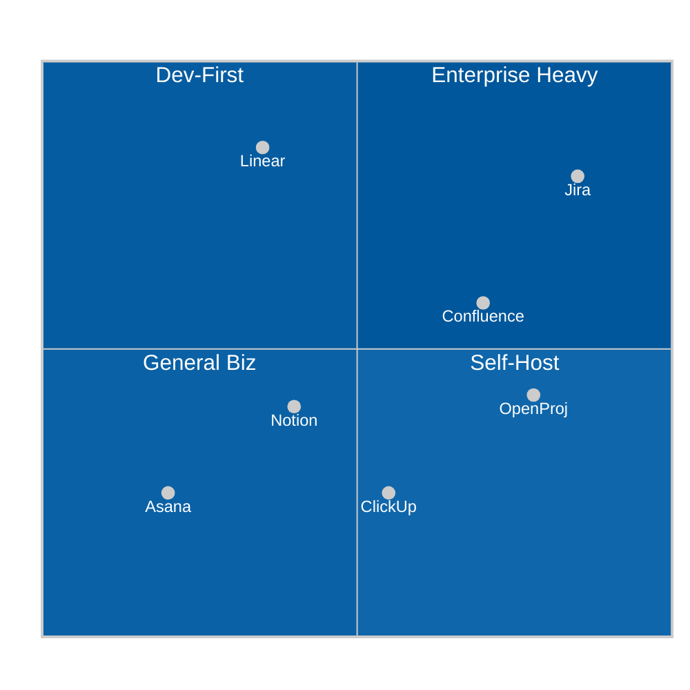
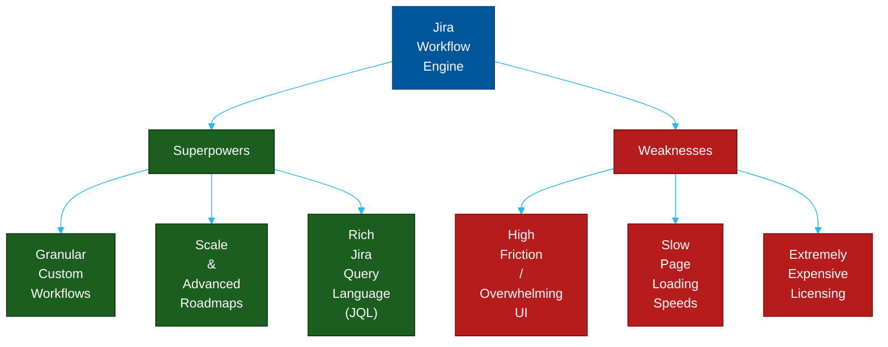
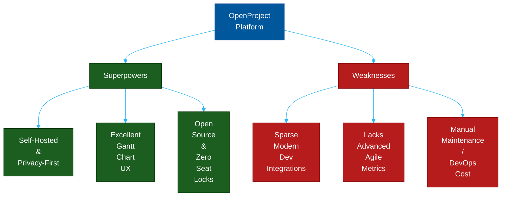
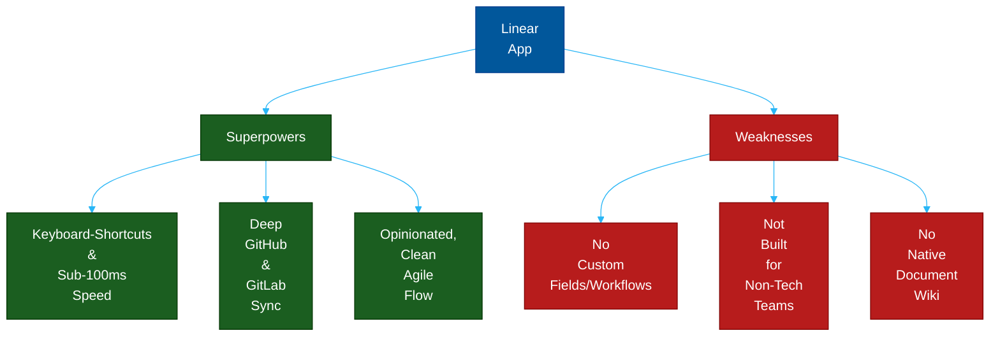
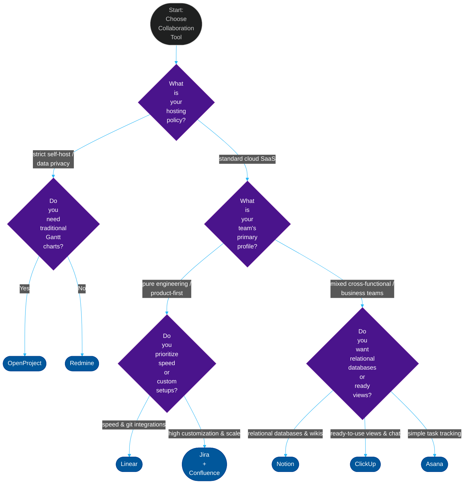

# The Ultimate Guide to Project Management & Collaboration Tools

**Author:** ichamrong  
**Date:** 2026-05-17  
**Tags:** #project-management #jira #confluence #notion #linear #openproject #agile #scrum  
**Category:** Engineering Management  
**Read Time:** ~18 min  

---

## 📌 Table of Contents
- [📋 Executive Overview](#executive-overview)
- [📊 Tool Positioning Matrix](#tool-positioning-matrix)
- [⚖️ The Ultimate Tool Comparison Matrix](#️-the-ultimate-tool-comparison-matrix)
- [🛠️ In-Depth Tool Analysis](#️-in-depth-tool-analysis)
  - [1. Jira (Atlassian)](#1-jira-atlassian)
    - [💪 The Strongest Points (Superpowers)](#the-strongest-points-superpowers-7)
    - [⚠️ The Weakest Points (Frustrations)](#️-the-weakest-points-frustrations-7)
    - [🎯 When / Why / How to Use It](#when-why-how-to-use-it-7)
  - [2. Confluence (Atlassian)](#2-confluence-atlassian)
    - [💪 The Strongest Points (Superpowers)](#the-strongest-points-superpowers-7)
    - [⚠️ The Weakest Points (Frustrations)](#️-the-weakest-points-frustrations-7)
    - [🎯 When / Why / How to Use It](#when-why-how-to-use-it-7)
  - [3. OpenProject](#3-openproject)
    - [💪 The Strongest Points (Superpowers)](#the-strongest-points-superpowers-7)
    - [⚠️ The Weakest Points (Frustrations)](#️-the-weakest-points-frustrations-7)
    - [🎯 When / Why / How to Use It](#when-why-how-to-use-it-7)
  - [4. Notion](#4-notion)
    - [💪 The Strongest Points (Superpowers)](#the-strongest-points-superpowers-7)
    - [⚠️ The Weakest Points (Frustrations)](#️-the-weakest-points-frustrations-7)
    - [🎯 When / Why / How to Use It](#when-why-how-to-use-it-7)
  - [5. Linear](#5-linear)
    - [💪 The Strongest Points (Superpowers)](#the-strongest-points-superpowers-7)
    - [⚠️ The Weakest Points (Frustrations)](#️-the-weakest-points-frustrations-7)
    - [🎯 When / Why / How to Use It](#when-why-how-to-use-it-7)
  - [6. ClickUp](#6-clickup)
    - [💪 The Strongest Points (Superpowers)](#the-strongest-points-superpowers-7)
    - [⚠️ The Weakest Points (Frustrations)](#️-the-weakest-points-frustrations-7)
    - [🎯 When / Why / How to Use It](#when-why-how-to-use-it-7)
  - [7. Asana](#7-asana)
    - [💪 The Strongest Points (Superpowers)](#the-strongest-points-superpowers-7)
    - [⚠️ The Weakest Points (Frustrations)](#️-the-weakest-points-frustrations-7)
    - [🎯 When / Why / How to Use It](#when-why-how-to-use-it-7)
  - [8. Redmine](#8-redmine)
    - [💪 The Strongest Points (Superpowers)](#the-strongest-points-superpowers-7)
    - [⚠️ The Weakest Points (Frustrations)](#️-the-weakest-points-frustrations-7)
    - [🎯 When / Why / How to Use It](#when-why-how-to-use-it-7)
- [🚀 The Architect's Decision Tree (How to Choose)](#the-architects-decision-tree-how-to-choose)
- [💡 Summary: The Golden Rule of Project Tooling](#summary-the-golden-rule-of-project-tooling)

---

## 📋 Executive Overview

In modern software development, choosing the wrong collaboration tool is as destructive as choosing the wrong database. A tool that is too heavy stalls developer velocity with bureaucratic clicking. A tool that is too light leads to chaotic requirements, missed deadlines, and lost institutional knowledge.

This guide provides a first-principles, expert-level comparison of the industry's leading project management and wiki tools, analyzing their core superpowers, fundamental weaknesses, and precise use cases.

---

## 📊 Tool Positioning Matrix

The quadrant chart below visualizes where each tool sits on the spectrum of **Complexity/Configurability vs. Audience Focus (Tech/Dev vs. Business/General)**.

---

## ⚖️ The Ultimate Tool Comparison Matrix

| Tool | Focus | Host Option | Target Audience | Primary Superpower | Major Drawback |
| :--- | :--- | :--- | :--- | :--- | :--- |
| **Jira** | Enterprise Agile | Cloud / Server | Scale Dev Teams | Infinite automation, JQL | Administrative bloat |
| **Confluence** | Knowledge / Wiki | Cloud / Server | Cross-Functional | Deep Jira link, rich macros | Info graveyard risk |
| **OpenProject** | Agile & Gantt | Self-Host / Cloud | Privacy & hybrid projects | Data privacy, Gantt UX | Sparse Git ecosystem |
| **Notion** | DB Docs & Wiki | Cloud | Startups, Creative | Relational databases | Sandbox chaos risk |
| **Linear** | Agile Tracker | Cloud | High-Speed Devs | Keyboard UX, Git speed | No custom workflows |
| **ClickUp** | All-in-One | Cloud | General Business | Modular views (Board/Gantt) | UI bloat, occasional bugs |
| **Asana** | Business Task | Cloud | Marketing, Operations | Clean UX, cross-project link | Lacks dev-centric depth |
| **Redmine** | Classic Ticketing | Self-Host | Legacy, IT Support | Tiny resource cost, stable | Outdated 2005 style |

---

## 🛠️ In-Depth Tool Analysis

---

### 1. Jira (Atlassian)

> **Elevator Pitch:** *"The heavy-duty, highly configurable industry standard for enterprise-grade Agile issue tracking and workflow automation."*

#### 💪 The Strongest Points (Superpowers)
*   **Infinite Workflow Customization:** Allows organizations to map out highly complex, multi-stage approval pipelines, status transitions, and automated state machine transitions with fine-grained permission controls.
*   **Power of JQL (Jira Query Language):** Provides a robust SQL-like querying syntax (e.g., `project = DEV AND status CHANGED TO "In Progress" BY "ichamrong"`) for generating advanced reports, filters, and custom dashboards.
*   **Scale and Cross-Team Dependency Tracking:** Advanced Roadmaps allow multi-project program management, capacity planning, and critical-path dependency tracking across hundreds of developer squads.

#### ⚠️ The Weakest Points (Frustrations)
*   **Heavy administrative overhead:** Often requires a dedicated full-time "Jira Administrator" to configure, maintain, and prevent customized workflow bloat.
*   **Low Developer Velocity (UI Friction):** Developers frequently complain about high click-to-work ratios, slow loading states, cluttered issue layouts, and administrative "bureaucracy."
*   **Pricing Lock-In:** While affordable at small scales, enterprise tier add-ons, marketplace plug-ins, and user seats quickly escalate into massive annual invoices.

#### 🎯 When / Why / How to Use It
*   **When:** Your engineering team exceeds 50–100 developers, requiring cross-department alignments, strict compliance audits, and multi-team release management.
*   **Why:** You need centralized visibility, custom automated gates, and robust historical auditing across a highly regulated enterprise landscape.
*   **How (Best Practice):** Keep workflows as simple as possible. Avoid forcing developers to fill out 15 mandatory fields to move a ticket to "In Progress". Rely on automated integrations (e.g., automatically transition a ticket to "In Review" when a GitHub PR is opened).

---

### 2. Confluence (Atlassian)

> **Elevator Pitch:** *"The enterprise knowledge base that acts as the single source of truth for engineering requirements, decisions, and system architectures."*

#### 💪 The Strongest Points (Superpowers)
*   **Atlassian Ecosystem Integration:** Deep native linkage with Jira (e.g., highlighting a Jira ticket ID automatically displays its live status, priority, and summary directly inside a document; creating tasks in Confluence auto-creates Jira tickets).
*   **Structured Content Hierarchy:** Uses spaces, parent-child page structures, and customizable templates to build highly organized, easily scannable department wikis.
*   **Advanced Macro Library:** Embeds active tables, roadmap timelines, code snippets, Jira reports, and third-party draw.io diagrams directly into pages.

#### ⚠️ The Weakest Points (Frustrations)
*   **Information Graveyard Risk:** If left unmaintained, search indices decay, pages become stale, and developers duplicate documentation, leading to a polluted wiki.
*   **Clunky Editor Experience:** Real-time collaborative editing can occasionally experience sync collisions and format breaking compared to modern document suites (like Notion or Google Docs).
*   **Poor Discovery UX:** The search algorithm is notoriously imprecise, often requiring exact page titles or tags to find deep documentation.

#### 🎯 When / Why / How to Use It
*   **When:** You are already committed to the Jira ecosystem and need to document RFCs, system architecture designs, and Product Requirements Documents (PRDs).
*   **Why:** To establish a central, searchable knowledge repository that connects your long-form planning documents directly with your execution tickets.
*   **How (Best Practice):** Enforce a strict page lifecycle. Review and archive outdated pages every quarter. Use standardized templates for PRDs and architecture reviews (RFCs) to ensure consistent page layouts across all teams.

---

### 3. OpenProject

> **Elevator Pitch:** *"A powerful, self-hosted, open-source alternative to Jira that emphasizes traditional classic project management, Gantt charts, and strict data privacy."*

#### 💪 The Strongest Points (Superpowers)
*   **100% Self-Hosted & GDPR Compliant:** Perfect for government agencies, healthcare platforms, and financial firms that cannot host proprietary code or user data in third-party clouds.
*   **Excellent Traditional Gantt Charts:** Out-of-the-box support for beautiful, interactive Gantt timelines with visual phase transitions, task hierarchies, and resource scheduling.
*   **Budget Friendly:** Open-source core provides complete access to task boards, wiki tools, and timeline tracking without user seat limits.

#### ⚠️ The Weakest Points (Frustrations)
*   **Dev Ecosystem Integrations:** GitHub, GitLab, and CI/CD pipelines require manual configuration and API connectors, lacking the seamless, out-of-the-box developer feel of Linear or Jira.
*   **Agile Metrics:** Standard Scrum/Kanban metrics (like burndown velocity, cumulative flow, and control charts) are basic and lack the granular analytics found in dedicated Agile suites.
*   **DevOps Overhead:** Self-hosting requires server maintenance, manual migrations, database backups, and security patching.

#### 🎯 When / Why / How to Use It
*   **When:** Your team demands strict data privacy/residency, prefers a hybrid of Waterfall (Gantt) and Agile, and has the DevOps capacity to maintain internal servers.
*   **Why:** To escape proprietary SaaS licensing costs while retaining a robust enterprise tool for cross-functional project tracking.
*   **How (Best Practice):** Use it to bridge the gap between business stakeholders and developers. Stakeholders use the interactive Gantt chart module, while developers execute tasks using the Kanban/Backlog boards connected to the same items.

---

### 4. Notion

> **Elevator Pitch:** *"The ultimate blocks-based canvas that seamlessly merges long-form wikis with highly customizable relational databases, ideal for start-ups and dynamic squads."*

#### 💪 The Strongest Points (Superpowers)
*   **Unified Wiki & Relational Databases:** A document is no longer just text; it can host multiple relational databases. You can build a single task database and view it as a Kanban board, a Calendar, a List, or a Table inside different documents.
*   **World-Class Editor UX:** Real-time co-authoring is incredibly fast, intuitive, and frictionless. Uses a slash `/` command system to quickly insert elements.
*   **Low Barrier to Entry:** Non-technical and engineering teams can work together in the exact same workspace, making it a true cross-functional alignment hub.

#### ⚠️ The Weakest Points (Frustrations)
*   **Lack of Structure (The Sandbox Trap):** Because it is completely open and modular, workspaces quickly decay into a chaotic mess of messy pages and disconnected databases without strict naming rules.
*   **Developer-Specific Workflows:** Notion is not an IDE/development tool. It lacks git branch tracking, deep CI/CD integrations, code dependency linking, and developer-oriented sprint tracking metrics out of the box.
*   **Performance at Scale:** Pages with massive relational databases, nested filters, and heavy asset embeds can load slowly, impacting speed for power users.

#### 🎯 When / Why / How to Use It
*   **When:** You are a fast-moving startup, agency, or cross-functional team that values flexible documentation, rapid knowledge sharing, and lightweight task tracking.
*   **Why:** To eliminate tool fragmentation by hosting your product roadmap, engineering wiki, team schedules, and task boards inside a single unified app.
*   **How (Best Practice):** Appoint a "Notion Champion" to define a rigid database hierarchy. Build **one** master task database and use customized views (filters/relations) for different teams, rather than creating hundreds of independent, isolated tables.

---

### 5. Linear

> **Elevator Pitch:** *"An ultra-fast, developer-first Agile project tracker engineered specifically to remove friction and accelerate software shipping."*

#### 💪 The Strongest Points (Superpowers)
*   **Sub-100ms Performance:** The entire UI is built for speed. Keyboard-driven navigation (via command menu `Cmd+K` / `Ctrl+K`) allows developers to update tickets, assign issues, and switch sprints without touching their mouse.
*   **True Developer Focus:** Out-of-the-box, deep integrations with GitHub, GitLab, and Sentry. Opening a PR automatically links, moves, and closes issues based on branch names (e.g. `user/issue-id-fix`).
*   **Clean, Opinionated Design:** Forces standard best-practice Agile (Sprints, Backlog, Active, Done) with automatic velocity calculations and clean, un-cluttered burndown analytics.

#### ⚠️ The Weakest Points (Frustrations)
*   **Highly Inflexible:** Linear is opinionated. You cannot create complex custom workflows, nested issue hierarchies, or customized fields. You must adapt to Linear's system, not the other way around.
*   **Not Built for Business Teams:** Highly technical interface. Sales, Marketing, and Customer Support will find the interface alienating and lacking visual marketing workflows.
*   **No Document Management:** Contains no native wiki or long-form documentation engine (relies on integrations with Notion or GitHub/GitLab wikis).

#### 🎯 When / Why / How to Use It
*   **When:** Your team is a pure-play engineering, product, and design squad that values execution speed, GitHub automation, and frictionless ticket management.
*   **Why:** To maximize developer focus, reduce administrative bloat, and gain clean velocity analytics with zero setup overhead.
*   **How (Best Practice):** Fully adopt its opinionated flow. Do not attempt to work around its lack of custom statuses. Trust its auto-close and branch tracking features to keep the backlog perfectly groomed.

---

### 6. ClickUp

> **Elevator Pitch:** *"A highly modular, highly visual 'all-in-one' productivity suite designed to replace multiple tools by wrapping tasks, documents, and timelines into a single app."*

#### 💪 The Strongest Points (Superpowers)
*   **Extreme Visual Versatility:** Allows users to view the exact same list of tasks as a Kanban board, List, Gantt Chart, Calendar, Table, Mind Map, or Box View with a single click.
*   **Rich Feature Set:** Out-of-the-box support for subtasks, customized fields, integrated docs, dashboard reporting, goals, and internal chat.
*   **Highly Custom Hierarchy:** Spaces, Folders, Lists, Tasks, and Subtasks allow complex department segregation and organization.

#### ⚠️ The Weakest Points (Frustrations)
*   **Feature Bloat & UI Overwhelm:** Because it tries to do everything, the interface can feel extremely cluttered, confusing, and overwhelming for new users.
*   **Performance Issues:** Complex setups with numerous lists, dashboards, and custom automations can lead to laggy interactions and slow load times.
*   **Frequent Feature Bugs:** Deploying too many minor features quickly can lead to occasional UI bugs and broken integrations, requiring regular reload clicks.

#### 🎯 When / Why / How to Use It
*   **When:** You are a growing startup, agency, or cross-functional team that wants to replace multiple SaaS subscriptions (Jira, Confluence, Trello, Asana) with a single, highly flexible visual suite.
*   **Why:** To gain massive visual flexibility and custom fields across multiple departments (Sales, Marketing, Devs, Support) without switching between apps.
*   **How (Best Practice):** Turn off features you don't use! ClickUp allows you to customize and disable individual features ("ClickApps") per Space. Disable everything except the bare essentials to keep the UI clean and fast.

---

### 7. Asana

> **Elevator Pitch:** *"The clean, visual, and highly intuitive project coordinator for cross-functional marketing, business, and operational workflows."*

#### 💪 The Strongest Points (Superpowers)
*   **Intuitive Visual UX:** Stunningly simple interface with zero learning curve. Features satisfying micro-animations (like the celebration unicorn) upon task completion.
*   **Cross-Project Task Linking:** A single task can exist in multiple projects simultaneously. If a marketing task depends on a design asset, updating the task updates it in both projects in real time.
*   **Robust Rules Engine:** Simple visual automation builder (e.g. *"When a task moves to Ready, assign it to Design Lead"*).

#### ⚠️ The Weakest Points (Frustrations)
*   **Lacks Technical Depth:** Not built for software developers. Lacks release management, code linking, Git integrations, and developer-focused sprint metrics.
*   **Pricing Scalability:** Asana's tier structures are expensive, locking basic features (like task dependencies and custom fields) behind premium pricing tiers.
*   **Rigid Task Model:** Subtasks lack visual connection to parent tasks in standard board views, making complex hierarchical planning difficult.

#### 🎯 When / Why / How to Use It
*   **When:** You are managing business-centric projects (Marketing launches, HR onboarding, Design workflows) involving non-technical stakeholders.
*   **Why:** To ensure 100% user adoption and alignment across departments without overwhelming them with complex developer-centric status sheets.
*   **How (Best Practice):** Use Asana for high-level roadmap planning, and integrate it with developer trackers (like Jira or Linear) using integrations like Unito, keeping business stakeholders in Asana and developers in their IDE-linked tools.

---

### 8. Redmine

> **Elevator Pitch:** *"The classic, battle-tested open-source ruby-on-rails issue tracker that provides deep, reliable ticketing and wiki tools for lightweight server environments."*

#### 💪 The Strongest Points (Superpowers)
*   **Ultra-Lightweight & Fast:** Runs efficiently on tiny servers. Standard server resources are minimal because it features zero bloated client-side JavaScript or heavy tracking frameworks.
*   **Excellent Multi-Project Support:** Out-of-the-box support for hierarchical sub-projects, each with its own independent wiki, issue tracker, and forum boards.
*   **Highly Extensible:** Features a mature ecosystem of community-developed plugins (Agile boards, CRM, Time tracking, Helpdesk) accumulated over 15+ years.

#### ⚠️ The Weakest Points (Frustrations)
*   **Outdated UI/UX:** The default interface looks like a website from 2005. It requires custom themes (like Circle or Abacus) to look passably modern.
*   **Steep Admin Configuration:** Configuring custom fields, security roles, and ticket categories relies on old-school database administration menus and config files.
*   **Lack of Modern Native Integrations:** Lacks modern Webhook integrations and real-time collaborative editing.

#### 🎯 When / Why / How to Use It
*   **When:** You need a free, lightweight, self-hosted, bulletproof ticket manager with forums and wikis that can run on an internal Raspberry Pi or isolated legacy VM.
*   **Why:** To obtain a reliable, standard issue tracker with zero licensing costs, zero cloud dependencies, and extremely low system resource consumption.
*   **How (Best Practice):** Install a modern responsive theme immediately. Set up automatic Git integration using commit messages (e.g. `refs #1234` or `closes #1234`) to automatically link code changes and resolve tickets.

---

## 🚀 The Architect's Decision Tree (How to Choose)

---

## 💡 Summary: The Golden Rule of Project Tooling

> **"A tool should serve your development pipeline, not the other way around."**

If your engineers are spending more than **3 minutes per day** updating issue cards, configuring status columns, or waiting for task menus to load, your tools are actively draining your company's capital. Choose the leanest, fastest tool that satisfies your security policies and supports your release pipeline. 

Keep it simple, automate issue transitions via Git commits, and focus on shipping code.

## Related

- [SDLC Models](sdlc/README.md)
- [Career Paths](../concepts/career-paths/README.md)
- [Developer Habits](../developer-habits/README.md)
