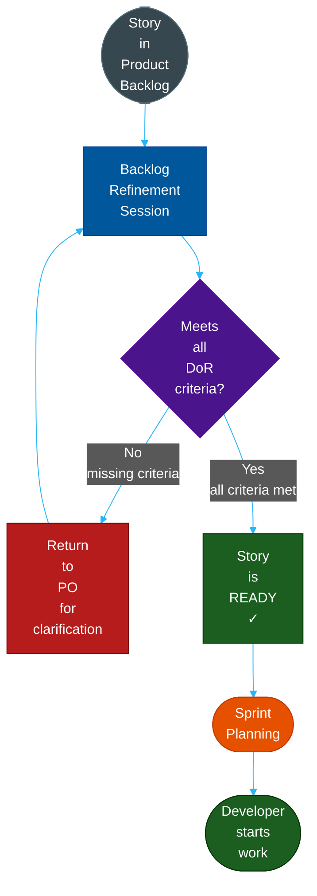
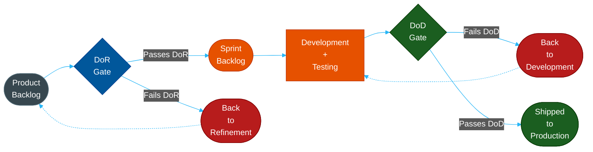
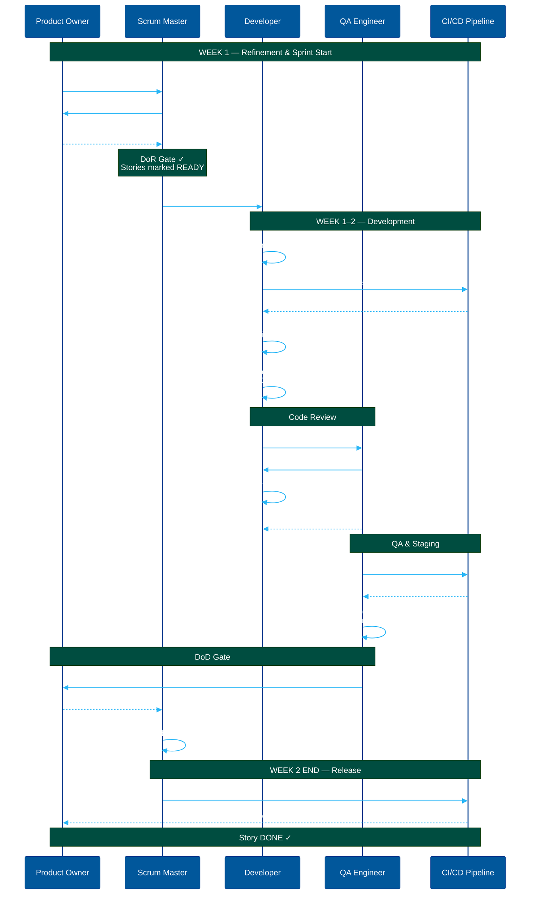
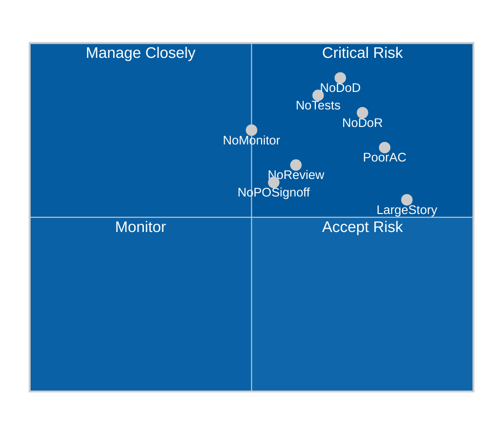
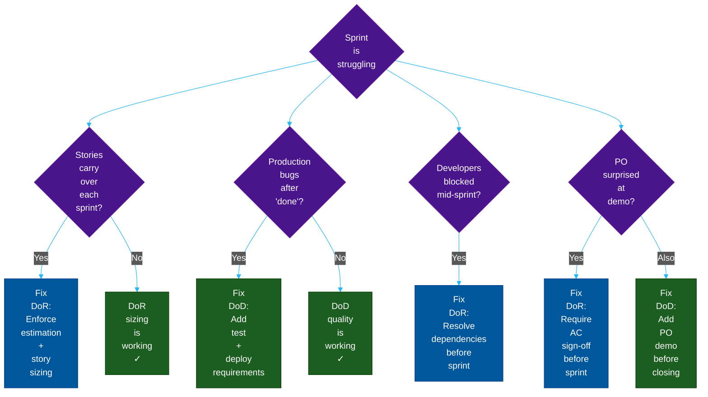
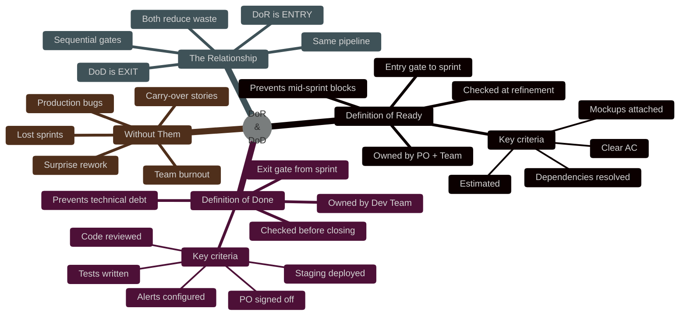

# Definition of Ready vs Definition of Done: The Two Gates of Quality

**Author:** ichamrong  
**Date:** 2026-05-16  
**Tags:** #agile #scrum #dor #dod #engineering-practices #team-process  
**Category:** Management & Leadership  
**Read Time:** ~18 min  

---

## 📌 Table of Contents
- [The Problem](#the-problem-1)
- [The Insight](#the-insight-1)
- [When DoR Applies](#when-dor-applies)
- [The Standard DoR Checklist](#the-standard-dor-checklist)
- [Industrial Example: A Story That Fails DoR](#industrial-example-a-story-that-fails-dor)
- [The Problem](#the-problem-1)
- [The Insight](#the-insight-1)
- [The Story Lifecycle State Machine](#the-story-lifecycle-state-machine)
- [The Standard DoD Checklist](#the-standard-dod-checklist)
- [Industrial Example: "Done" vs Actually Done](#industrial-example-done-vs-actually-done)
- [Side-by-Side Comparison](#side-by-side-comparison)
- [The Relationship: Two Gates, One Pipeline](#the-relationship-two-gates-one-pipeline)
- [The Vocabulary Test](#the-vocabulary-test)
- [The Cost Matrix: What Happens When You Skip Each Gate](#the-cost-matrix-what-happens-when-you-skip-each-gate)
- [The 5 Most Dangerous Anti-Patterns](#the-5-most-dangerous-anti-patterns)
  - [Anti-Pattern 1: "We'll figure it out during the sprint"](#anti-pattern-1-well-figure-it-out-during-the-sprint)
  - [Anti-Pattern 2: "It works on my machine"](#anti-pattern-2-it-works-on-my-machine)
  - [Anti-Pattern 3: "We'll write tests next sprint"](#anti-pattern-3-well-write-tests-next-sprint)
  - [Anti-Pattern 4: "The story is done — we just need to configure monitoring"](#anti-pattern-4-the-story-is-done-we-just-need-to-configure-monitoring)
  - [Anti-Pattern 5: "We refined it enough — let's start"](#anti-pattern-5-we-refined-it-enough-lets-start)
- [Failure Mode Diagnosis Flowchart](#failure-mode-diagnosis-flowchart)
- [🔗 External References](#external-references)
- [📚 Cross-References & Related Reading](#cross-references-related-reading)

---

## Table of Contents

- [Part 1 — What is Definition of Ready (DoR)?](#part-1-what-is-definition-of-ready-dor)
- [Part 2 — What is Definition of Done (DoD)?](#part-2-what-is-definition-of-done-dod)
- [Part 3 — DoR vs DoD: The Full Comparison](#part-3-dor-vs-dod-the-full-comparison)
- [Part 4 — The Sprint Lifecycle with Both Gates](#part-4-the-sprint-lifecycle-with-both-gates)
- [Part 5 — Failure Patterns & Consequences](#part-5-failure-patterns-consequences)
- [Summary](#summary)

---

> **"Starting wrong costs more than starting late. Finishing half costs more than not starting at all."**  
> DoR prevents the first mistake. DoD prevents the second.

---

# Part 1 — What is Definition of Ready (DoR)?

## The Problem

A developer picks up a story on Monday morning. By Wednesday afternoon, they are blocked. The acceptance criteria are ambiguous. The design mockup is missing. No one knows which API endpoint to call because the backend team hasn't decided yet.

The story was **in the sprint** — but it was never **ready to be worked on**.

The cost: 2.5 days of lost engineering time, a blocked sprint goal, and a story that carries over to the next sprint where it starts the cycle again. Multiply by 6 developers, and you have lost a sprint.

**Definition of Ready (DoR) exists to prevent this exact failure.**

## The Insight

DoR is a **checklist of conditions that a story must satisfy before the team is allowed to pull it into a sprint**. It is the entrance gate — the "ready" signal that says: *"this story is understood, scoped, and unblocked enough that a developer can start working on it immediately."*

DoR is not a bureaucracy tax. It is a **cost-shifting mechanism**: it moves the discovery of ambiguity from sprint execution time (expensive) to backlog refinement time (cheap). Catching a missing requirement in a 30-minute refinement session costs 30 minutes. Catching it mid-sprint costs 2 days.

## When DoR Applies

DoR is checked **during backlog refinement** and at the **sprint planning gate**. A story that does not meet DoR cannot enter the sprint. It goes back to the Product Owner for clarification.

## The Standard DoR Checklist

| # | Criterion | Why It Matters |
| :--- | :--- | :--- |
| **1** | User story written in "As a / I want / So that" format | Establishes who benefits and why — not just what to build |
| **2** | Acceptance criteria are clear and testable | Developers know exactly when they are done |
| **3** | Story is small enough to complete in one sprint | Large stories guarantee partial completion and carry-over |
| **4** | Dependencies are identified and resolved (or accepted) | No mid-sprint surprises about blocked external APIs |
| **5** | Design / UX mockups attached (if UI work) | Developers do not design — they implement |
| **6** | API contracts agreed upon (if cross-team) | Backend and frontend can work in parallel |
| **7** | Estimate is provided (story points or t-shirt size) | Sprint capacity planning requires known estimates |
| **8** | Edge cases and error states documented | Happy-path-only stories always cause late rework |

## Industrial Example: A Story That Fails DoR

**Story as written:**
> "As a user, I want to see my notifications."

**What's missing:**
- Which notifications? (email? in-app? push? SMS?)
- What is the read/unread state model?
- How many notifications per page? Infinite scroll or pagination?
- What happens if there are zero notifications?
- Where is the notification icon? (UI mockup missing)
- Is this a new API endpoint or reuse of existing one?

**What DoR catches:** This story cannot enter the sprint until all of the above are answered. The PO must refine it into a specific, unambiguous story with clear acceptance criteria.

**Story after DoR:**
> "As a logged-in user, I want to see my last 20 in-app notifications in a paginated list (10 per page), sorted by recency, showing unread count badge, so I can review recent system activity."
> 
> **AC:** Badge count reflects unread count. Clicking a notification marks it read. Empty state shows 'No notifications yet.' Mockup: [link]. API: `GET /api/notifications?page=1&size=10` — contract approved by backend team 2026-05-14.

---

# Part 2 — What is Definition of Done (DoD)?

## The Problem

A developer announces on Friday: "The feature is done." On Monday, the QA engineer opens a bug ticket. On Tuesday, the code review finds security issues. On Wednesday, the deployment fails because migrations were not included. On Thursday, the PM discovers there are no monitoring alerts for the new endpoint.

The feature was called "done" — but it was not actually done. It was *coded*.

**Definition of Done (DoD) exists to close the gap between "coded" and "done."**

## The Insight

DoD is a **shared, team-agreed list of conditions that every story must satisfy before it is considered complete**. It is the exit gate — the "shipped" signal that means: *"this story is implemented, tested, reviewed, integrated, and deployable. No follow-up work is needed."*

DoD is not a quality checklist for perfectionists. It is an **institutional memory device**: it captures every time the team learned the hard way that "done" needs to include one more thing. Each item in DoD was added because its absence once caused a production incident, a hot-fix sprint, or a customer complaint.

## The Story Lifecycle State Machine

```mermaid
%%{init: {'theme': 'dark', 'themeVariables': {'primaryColor': '#1b5e20', 'primaryTextColor': '#ffffff', 'lineColor': '#4caf50',
    'background': '#1e1e1e'},
  'themeCSS': 'svg { background-color: #1e1e1e !important; padding: 1rem !important; border-radius: 8px !important; } .edgeLabel rect { fill: #1e1e1e !important; } text, tspan, .messageText, .signalText, .edgeLabel, .edgeLabel span, .pointLabel, .axisLabel, .quadrantTitle, .quadrantLabel { fill: #ffffff !important; color: #ffffff !important; stroke: none !important; }'
}}%%
stateDiagram-v2
    classDef todo    fill:#37474f,stroke:#546e7a,color:#fff
    classDef active  fill:#01579b,stroke:#003c8f,color:#fff
    classDef review  fill:#e65100,stroke:#bf360c,color:#fff
    classDef blocked fill:#b71c1c,stroke:#7f0000,color:#fff
    classDef shipped fill:#1b5e20,stroke:#003300,color:#fff

    [*] --> ToDo : meets DoR
    ToDo --> InProgress : developer picks up

    InProgress --> InReview : code complete,<br/>tests written
    InReview --> InProgress : review failed —<br/>needs rework
    InReview --> QATesting : review passed

    QATesting --> InProgress : bugs found —<br/>back to dev
    QATesting --> DoDCheck : tests pass

    DoDCheck --> InProgress : DoD criteria<br/>not met
    DoDCheck --> Done : ALL DoD<br/>criteria met ✓

    Done --> [*]

    class ToDo todo
    class InProgress active
    class InReview review
    class QATesting review
    class DoDCheck blocked
    class Done shipped
```

## The Standard DoD Checklist

| # | Criterion | Category |
| :--- | :--- | :--- |
| **1** | All acceptance criteria from the story are verified | Functionality |
| **2** | Unit tests written with ≥ 80% coverage on new code | Quality |
| **3** | Integration / E2E tests pass | Quality |
| **4** | No new failing tests in the CI pipeline | Quality |
| **5** | Code reviewed and approved by ≥ 1 peer | Quality |
| **6** | No critical or high-severity SonarQube / linting warnings | Quality |
| **7** | Database migrations included (if applicable) | Deployment |
| **8** | Feature flags configured (if applicable) | Deployment |
| **9** | Deployed to staging environment | Deployment |
| **10** | Product Owner has signed off / demoed | Acceptance |
| **11** | Monitoring alerts and dashboards updated | Observability |
| **12** | Runbook / documentation updated (if applicable) | Documentation |

## Industrial Example: "Done" vs Actually Done

A team built an order cancellation endpoint. The developer marked it done after writing the controller and unit tests. What was missing from DoD:

| Missed Item | Consequence |
| :--- | :--- |
| No integration test | A race condition with the payment service was caught only in production |
| No migration for `cancelled_at` column | First deploy failed — rollback required |
| No monitoring alert | Cancellation spike went unnoticed for 4 hours |
| No PO sign-off | PO discovered the confirmation email was not sent on cancellation |
| No runbook update | On-call engineer had no procedure for mass cancellation events |

Every one of these would have been caught if the team had a DoD and enforced it.

---

# Part 3 — DoR vs DoD: The Full Comparison

## Side-by-Side Comparison

| Dimension | Definition of Ready (DoR) | Definition of Done (DoD) |
| :--- | :--- | :--- |
| **What is it?** | Entry criteria for a story to enter the sprint | Exit criteria for a story to be declared complete |
| **When checked?** | During backlog refinement and sprint planning | At the end of development, before closing the story |
| **Who owns it?** | Product Owner + Team (collaborative) | Development Team (technical standard) |
| **What fails?** | Ambiguous, large, or unestimated stories | Code that is working but not production-ready |
| **What it prevents** | Mid-sprint blockers and scope discovery | Technical debt, missing tests, deployment failures |
| **Metaphor** | Pre-flight checklist before takeoff | Landing checklist after arrival |
| **Cost of skipping** | Wasted sprint capacity, carry-over stories | Hot-fix sprints, production incidents |

## The Relationship: Two Gates, One Pipeline

DoR and DoD are not competing concepts. They are **sequential gates on the same assembly line**. A story must pass DoR to enter the pipeline, and must pass DoD to exit it.

## The Vocabulary Test

Use this mental model to never confuse the two again:

> **DoR asks:** *"Is this story ready for us to START?"*  
> **DoD asks:** *"Is this story ready for us to SHIP?"*

| If you hear... | It's about... |
| :--- | :--- |
| "We can't start this — the requirements aren't clear" | **DoR** — story was not ready |
| "We can't close this — tests aren't written" | **DoD** — story is not done |
| "This needs more refinement before sprint planning" | **DoR** — back to backlog |
| "This is coded but not reviewed — it's not done yet" | **DoD** — not at exit gate |

---

# Part 4 — The Sprint Lifecycle with Both Gates

The following sequence diagram shows exactly where DoR and DoD appear in a standard 2-week sprint, and who is responsible at each stage.

---

# Part 5 — Failure Patterns & Consequences

## The Cost Matrix: What Happens When You Skip Each Gate

*Abbreviations: NoDoR = No Definition of Ready, NoDoD = No Definition of Done, PoorAC = Ambiguous Acceptance Criteria, NoTests = Skipped Test Writing, NoPOSignoff = No Product Owner Approval, NoMonitor = No Alerts Added, NoReview = No Code Review, LargeStory = Story Too Large*

## The 5 Most Dangerous Anti-Patterns

### Anti-Pattern 1: "We'll figure it out during the sprint"

**Symptom:** Stories enter sprint planning without acceptance criteria. Developers make their own assumptions.  
**Consequence:** Feature is built to the wrong spec. Rework in week 2. PO disappointed at demo.  
**Fix:** Hard DoR gate at sprint planning. PO cannot add a story without AC.

### Anti-Pattern 2: "It works on my machine"

**Symptom:** Developers mark stories done after local testing. No CI run, no staging deploy.  
**Consequence:** "Works locally" fails in staging due to missing env variables, DB state differences, or dependency versions.  
**Fix:** DoD mandates green CI run + staging deploy before closing a story.

### Anti-Pattern 3: "We'll write tests next sprint"

**Symptom:** Tests are excluded from the current story estimate and treated as optional.  
**Consequence:** Test debt accumulates. Future refactoring breaks untested code silently.  
**Fix:** DoD includes unit test coverage requirement. Tests are part of the story estimate, not a separate task.

### Anti-Pattern 4: "The story is done — we just need to configure monitoring"

**Symptom:** Monitoring is treated as post-launch infrastructure work, not development work.  
**Consequence:** New endpoint in production with no alerts. SLA breach goes undetected for hours.  
**Fix:** DoD includes: "Monitoring alert created and validated for new endpoints/features."

### Anti-Pattern 5: "We refined it enough — let's start"

**Symptom:** Story has acceptance criteria but dependencies (API contract, design mockup) are still "in progress."  
**Consequence:** Developer starts implementation, then blocks on dependency mid-sprint. Switches context. Original story half-done at sprint end.  
**Fix:** DoR requires that all dependencies are either resolved or formally acknowledged as non-blocking with a mitigation plan.

---

## Failure Mode Diagnosis Flowchart

---

# Summary

| | DoR | DoD |
| :--- | :--- | :--- |
| **Gate type** | Entry | Exit |
| **Timing** | Before sprint starts | Before story closes |
| **Question** | "Ready to START?" | "Ready to SHIP?" |
| **Catches** | Ambiguity, missing dependencies | Missing tests, missing deployment |
| **Owner** | Product Owner + Team | Development Team |
| **Cost of skipping** | Blocked sprints, carry-overs | Hot-fixes, incidents, tech debt |

> **The goal is not to create checkboxes. The goal is to make the implicit explicit — to turn unspoken assumptions into shared agreements that the whole team can hold each other accountable to.**

---

**Navigation:** [← Management Index](./README.md) | [Visual Communication Guide →](../developer-habits/visual-communication/README.md)

---

## 🔗 External References
- [The Scrum Guide: Definition of Done](https://scrumguides.org/scrum-guide.html#artifact-transparency)
- [Agile Alliance: Definition of Ready](https://www.agilealliance.org/glossary/definition-of-ready/)
- [Atlassian: DoR and DoD in Jira](https://www.atlassian.com/agile/scrum)

## 📚 Cross-References & Related Reading
- **Agile & Process:** [DoR vs DoD](./02-dor-and-dod-guide.md) | [SDLC Comparison Matrix](./sdlc/06-comparison-matrix.md) | [What is SDLC?](./sdlc/01-what-is-sdlc.md)
- **Documentation & Flow:** [Visual Communication Guide](../developer-habits/visual-communication/README.md) | [Fast Documentation](../productivity/01-fast-documentation-workflow.md) | [MCP Guide](../developer-habits/02-mcp-development-guide.md)

---

*Last updated: 2026-05-16*

## Related

- [SDLC Models](sdlc/README.md)
- [Career Paths](../concepts/career-paths/README.md)
- [Developer Habits](../developer-habits/README.md)
