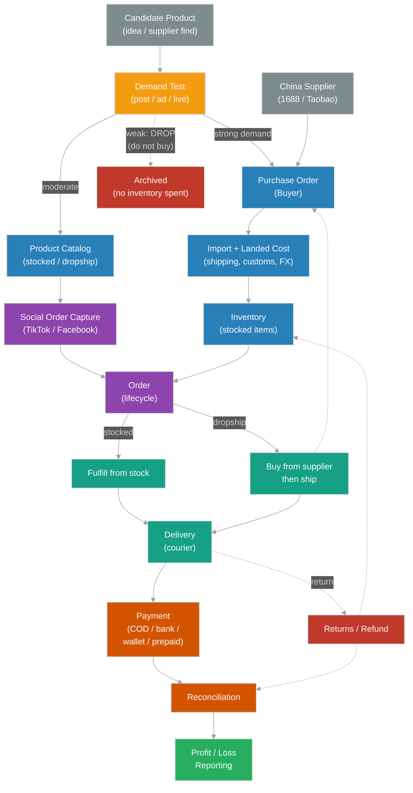

# FS: Cross-Border Social Resell POS — System Overview (Example)

> A comprehensive, modular example Functional Spec for a full operations/POS system serving a **cross-border reselling business**: sourcing from China (1688 / Taobao / AliExpress), importing, and reselling on **TikTok Shop** and **Facebook**. Built to demonstrate the [FS Document Procedure](../fs-document-procedure.md) at real scale. Names, prices, and rules are illustrative.

| Field | Value |
|-------|-------|
| Author (PO) | Sophea |
| Date | 2026-06-02 |
| Status | Draft |
| Target | Multi-sprint program (each module is its own epic) |
| Reviewers | PM Dara, Dev Visal, QA Chenda, Ops Lead Rith |

---

## 1. Summary

We run a cross-border resell business. We source products from Chinese marketplaces, bring them into the country, and sell them to local customers through social channels (TikTok Shop, Facebook Page/Live). Today this runs on spreadsheets, chat screenshots, and manual bookkeeping — it does not scale, money leaks through bad cost tracking, and orders fall through the cracks between a Facebook comment and a delivered parcel.

This system is the single operational backbone: it tracks a product from **supplier purchase → import & landed cost → inventory → social order → fulfillment → payment → after-sales**, and tells us, at any moment, what we own, what we owe, what we've sold, and what we actually earned.

## 2. Business Model (what makes this different)

We operate a **hybrid** model, decided per product:

- **Stocked (buy-first):** fast-moving items bought in bulk from China, held in our local warehouse, shipped from our own stock when sold.
- **Dropship (buy-after-order):** long-tail items listed on socials but purchased from the supplier only after a customer orders; supplier ships to us (then to customer) or direct.

The system must support both paths and make the path a property of the product, not a separate workflow the staff have to remember.

Customers pay by **COD, bank transfer / ABA, mobile wallet, or prepaid payment link** — so money arrives at different times relative to fulfillment, and reconciliation is a first-class concern, not an afterthought.

## 3. Goals & Non-Goals

**Goals:**
- One source of truth for products, costs, stock, orders, payments, and customers.
- Accurate **landed cost** per item (purchase + shipping + import fees + FX), so margin is real, not guessed.
- Capture orders from **TikTok Shop and Facebook** (including live selling) without manual re-typing.
- Support **stocked and dropship** fulfillment from the same order screen.
- Reconcile **COD, bank, wallet, and prepaid** payments to each order.
- Handle **returns/refunds** and keep stock and money correct.
- **Drive revenue** through promotions, marketing attribution, loyalty, live selling, and social proof — while protecting margin.
- Give the owner **real profit/loss** reporting, not just revenue.

**Non-Goals:**
- Building our own storefront/website (we sell on social platforms, not a custom shop).
- Accounting/tax filing (we export data; we don't replace an accountant).
- Warehouse robotics or barcode hardware in v1 (manual stock counts acceptable initially).
- Creating ad creative or running the ad platforms themselves (we *measure* marketing and *run promotions*; we don't replace the ad manager or the content team).

## 3b. Expected Impact (honest)

This system is two things working together, and it's worth being precise about what each does:

- **Modules 1–9 (operations) protect profit.** They don't create sales — they stop the leaks: selling below true landed cost, orders lost between a comment and a parcel, COD cash that never reconciles, returns that never hit the books. The realistic win is **higher net margin on the sales you already make, and the ability to scale volume without chaos**.
- **Modules 10–14 (growth) drive revenue.** Promotions lift conversion and basket size; attribution moves ad spend toward what works; loyalty brings cheaper repeat revenue; live selling raises sales velocity; social proof lifts conversion on everything.

**On numbers:** any specific figure (e.g. "+80% revenue") depends on the seller's current volume, ad budget, product–market fit, and team discipline — not on the software alone. This FS removes the operational ceiling and adds the growth levers, but the lift is earned by *using* them well. Treat percentage targets as goals to test, not guarantees the system delivers on its own.

## 4. Users / Roles

| Role | What they do |
|------|--------------|
| **Owner / Admin** | Sees everything; sets prices, margins, FX rate; reads P&L. |
| **Buyer / Sourcer** | Creates purchase orders to Chinese suppliers; records costs and shipments. |
| **Inventory / Warehouse staff** | Receives imports, counts stock, packs orders. |
| **Sales / Chat agent** | Captures orders from TikTok/Facebook chats and comments; confirms with customers. |
| **Fulfillment / Dispatch** | Books couriers, prints labels, marks shipped/delivered. |
| **Finance** | Confirms bank/wallet payments, reconciles COD cash from couriers, processes refunds. |

Roles are permissions, not necessarily separate people — in a small team one person may hold several.

## 5. The Modules

This FS is split into modules; each is its own document with full requirements and acceptance criteria. Build order roughly follows the list. Modules 1–9 are the **operations backbone** (protect margin, prevent losses, scale without chaos); modules 10–14 are the **revenue/growth layer** (drive more sales).

**Operations backbone**
1. [Procurement & Suppliers](01-procurement.md) — buying from China, purchase orders, supplier records.
2. [Import & Landed Cost](02-landed-cost.md) — shipping, customs/import fees, FX, true per-unit cost.
3. [Inventory & Products](03-inventory.md) — product catalog, stocked vs dropship, stock levels, valuation.
4. [Sales Channels & Orders](04-channels-orders.md) — TikTok Shop & Facebook order capture, the order lifecycle.
5. [Fulfillment & Delivery](05-fulfillment.md) — stocked vs dropship fulfillment, couriers, tracking.
6. [Payments & Reconciliation](06-payments.md) — COD, bank/ABA, wallets, prepaid links, matching money to orders.
7. [Returns, Refunds & Cancellations](07-returns.md) — after-sales, restock, refund money flow.
8. [Reporting & Profit/Loss](08-reporting.md) — margin, P&L, channel performance, stock value, COD float.
9. [Users, Roles & Audit](09-users-roles.md) — who can do what; every money/stock action logged.

**Revenue / growth layer**
10. [Promotions & Discounts](10-promotions.md) — offers, vouchers, bundles, with a margin guardrail.
15. [Product Demand Testing](15-product-testing.md) — **test before you buy**: validate demand on social first, then decide Stock / Dropship / Drop. (Runs *before* procurement.)
11. [Marketing & Attribution](11-marketing-attribution.md) — which ads/posts/lives actually make money (ROAS).
12. [Customers, Loyalty & Retention](12-customers-loyalty.md) — repeat buyers, points, store credit, segments.
13. [Live Selling & Channel Engagement](13-live-selling.md) — fast claim capture, real-time stock, follow-up.
14. [Reviews & Social Proof](14-reviews-social-proof.md) — trust that lifts conversion on every future sale.

## 6. End-to-End Flow (how the modules connect)

> In Google Docs / PDF, replace this Mermaid block with an exported image.

## 7. System-Wide Non-Functional Requirements

- **Reliability:** No order or payment is ever lost; in-progress work survives a crash or power loss.
- **Auditability:** Every change to money or stock is logged with who, when, before/after value.
- **Performance:** Common actions (capture order, check stock, record payment) respond in under 1 second on a normal connection.
- **Localization:** Local currency and language for staff and receipts; FX handled explicitly for supplier costs.
- **Access control:** Each role sees and does only what its permissions allow (see [module 9](09-users-roles.md)).
- **Mobile-friendly:** Sales and fulfillment staff often work from phones; key screens must work on mobile.

## 8. Cross-Cutting Assumptions & Dependencies

- Social platforms (TikTok Shop, Facebook) are accessed via their APIs where available, and via manual entry where not — the system must not *require* an API that may be unavailable.
- Courier services expose tracking numbers and delivery status (API or manual update).
- One base currency for the business; supplier costs are in CNY and converted via a configurable FX rate.
- Payment confirmation for bank/wallet may be manual (finance confirms) in v1.

## 9. Open Questions (program-level)

- Which social platform integrations are API-based vs manual in v1? — owner: Dara (PM).
- Single warehouse or multiple locations in v1? — owner: Rith (Ops).
- Do we need multi-currency selling, or local-currency only? — owner: Sophea (PO).

## 10. Program Approval & Sign-Off

This is a program-level approval of the overall scope and approach. Each module also carries its own approval block. This is an internal working agreement, not a legal contract.

| Role | Name | Status (Reviewed / Approved) | Date |
|------|------|------------------------------|------|
| Product Owner (PO) | Sophea | `<>` | `<YYYY-MM-DD>` |
| Project Manager (PM) | Dara | `<>` | `<YYYY-MM-DD>` |
| Dev Lead | Visal | `<>` | `<YYYY-MM-DD>` |
| QA | Chenda | `<>` | `<YYYY-MM-DD>` |
| Owner | `<name>` | `<>` | `<YYYY-MM-DD>` |

**Program status:** `<Draft / In Review / Approved>`

## 11. Appendices (shared depth)

- [A1 — Data Dictionary & Glossary](A1-data-dictionary.md) — shared terms and core entities/fields used across all modules.
- [A2 — Non-Functional Requirements](A2-nfr.md) — measurable performance, reliability, security, usability, and scalability targets.
- [A3 — Wireframes & Screen Flows](A3-wireframes.md) — low-fidelity sketches of the key screens.

## 12. Related

- [FS Document Procedure](../fs-document-procedure.md) — how this FS was written.
- [Ticket Sign-Off Procedure](../../procedure/signoff-jira-ticket-procedure.md) — each module becomes Backlog tickets at Gate 0.
