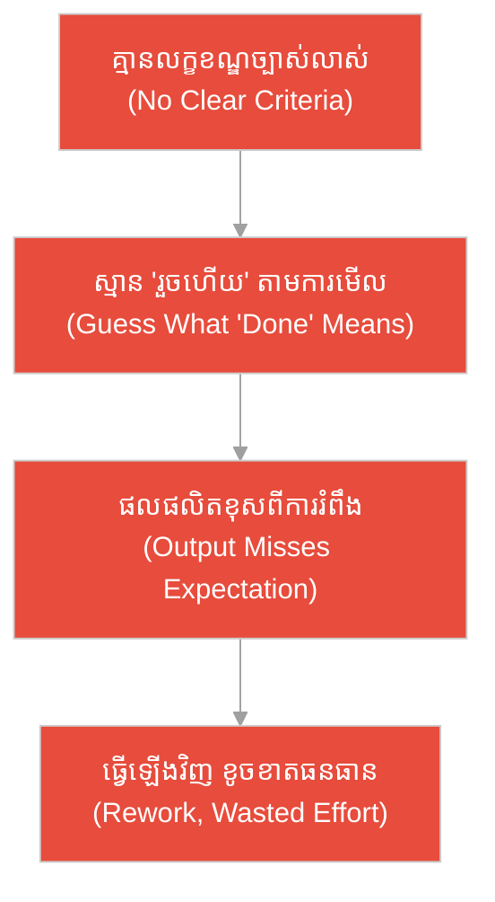
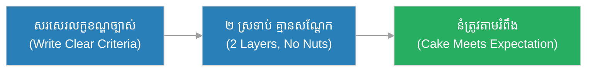
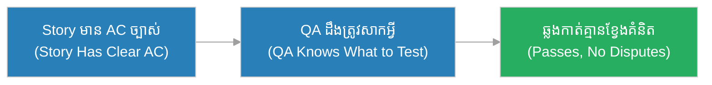
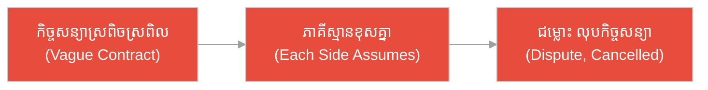
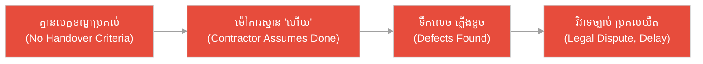
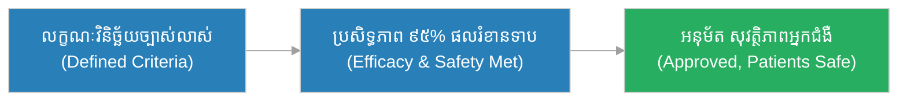
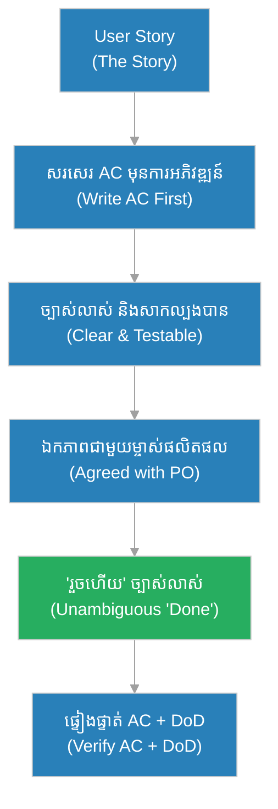

# លក្ខខណ្ឌទទួលយក (Acceptance Criteria)៖ ជា​ងកាត់ដេរ និង​ការ​វាស់ខ្នាត​មុន​កាត់ក្រណាត់ (The Tailor & The Measurements Before Cutting)

**អ្នកនិពន្ធ (Author):** ichamrong 
**កាលបរិច្ឆេទ (Date):** 2026-05-29 
**ស្លាក (Tags):** #agile #scrum #acceptance-criteria #parable 
**ប្រភេទ (Category):** Management & Leadership 
**រយៈពេលអាន (Read Time):** ~១២ នាទី (~12 min) 

---

## 📌 មាតិកា (Table of Contents)
- [អន្ទាក់​នៃ «រួចហើយ» (The "Done" Trap)](#0)
- [១. រឿងប្រៀបប្រដូច៖ ជា​ងកាត់ដេរ និង​ខ្នាតវាស់ (The Parable: The Tailor & The Measurements)](#1)
- [២. បញ្ហា៖ «យើងនឹងដឹងថា​ត្រូវ ពេល​ឃើញ» (The Issue: "We'll Know It When We See It")](#2)
- [៣. ឧទាហរណ៍​ជាក់ស្តែង​ក្នុង​ពិភពពិត (Real World Examples)](#3)
 - [ឧទាហរណ៍​ទី ១ — កម្រិតស្រាល (គ្រួសារ)៖ ការ​កម្មង់នំខួបកំណើត (The Birthday Cake Order)](#3-1)
 - [ឧទាហរណ៍​ទី ២ — កម្រិតមធ្យម (បច្ចេកទេស)៖ មុខងារ «ភ្លេចពាក្យសម្ងាត់» (The Forgot-Password Feature)](#3-2)
 - [ឧទាហរណ៍​ទី ៣ — កម្រិតមធ្យម (ធុរកិច្ច)៖ កិច្ចសន្យា​សេវាកម្ម​សម្អាត (The Cleaning Service Contract)](#3-3)
 - [ឧទាហរណ៍​ទី ៤ — កម្រិតមធ្យម (គ្រប់​គ្រង)៖ លក្ខខណ្ឌទទួលយក​ការ​សាងសង់ (The Building Handover)](#3-4)
 - [ឧទាហរណ៍​ទី ៥ — កម្រិតធ្ងន់ (ឱសថ)៖ លក្ខណៈ​វិនិច្ឆ័យអនុម័តថ្នាំ (The Drug Approval Criteria)](#3-5)
- [៤. ការ​សន្ទនាបែបសាកសួរ (Socratic Dialogue: Acceptance Criteria vs. Definition of Done)](#4)
- [៥. ដំណោះស្រាយ៖ ការ​សរសេរ Acceptance Criteria ដ៏​ល្អ (The Solution: Writing Good Acceptance Criteria)](#5)
- [សេចក្តីសន្និដ្ឋាន (Conclusion)](#6)
- [ឯកសារយោង (References)](#7)
- [Related Posts](#8)

---

## អន្ទាក់​នៃ «រួចហើយ» (The "Done" Trap)

នៅ​ពេល​កំណត់ថា ការ​ងារមួយ «រួចហើយ» ឬ «ត្រឹម​ត្រូវ» យើង​តែ​ង​តែ​ធ្លាក់ចូល​អន្ទាក់​ផ្ទុយគ្នា​ពី​រ៖

* **អន្ទាក់​ស្​មាន (The Guessing Trap):** «យើង​មិន​បាច់​សរសេរ​លក្ខខណ្ឌ​ជា​មុន​ទេ — យើងនឹងដឹងថាវា​ត្រូវ ពេល​ឃើញវា (We'll know it when we see it)!»
* **អន្ទាក់​ច្រឡំ DoD (The DoD-Confusion Trap):** «Acceptance Criteria គឺ​ដូចគ្នានឹង Definition of Done ហ្នឹង — អត់ខុសគ្នាទេ!»

---

## ១. រឿងប្រៀបប្រដូច៖ ជា​ងកាត់ដេរ និង​ខ្នាតវាស់ (The Parable: The Tailor & The Measurements)

នៅផ្សារមួយ មាន​ជា​ងកាត់ដេរជើង​ចាស់​ម្នាក់ឈ្មោះ **សុភា (Sophea)**។ មុន​ពេល​គាត់កាត់ក្រណាត់ណាមួយ គាត់​តែ​ង​តែ​អង្គុយ​ជា​មួយអតិថិជន ហើយកត់ត្រាខ្នាតវាស់ និង​តម្រូវ​ការ​ច្បាស់លាស់​ទាំងអស់៖ ទទឹងស្មា ៤៥ សង់ទីម៉ែត្រ ប្រវែងដៃ ៦០ សង់ទីម៉ែត្រ ពណ៌ខៀវ ៣ ឃ្នាប់ និង​ហោប៉ៅ​ខាងក្នុង។ គាត់សួរច្បាស់ ៗ ហើយឱ្យអតិថិជនបញ្​ជា​ក់ មុន​ពេល​កាត់។ ដោយសារ «រួចហើយ» ត្រូវ​បាន​កំណត់​យ៉ាង​ច្បាស់ គាត់ដឹង​ពិតប្រាកដ​ថា សំលៀកបំពាក់​ត្រូវ​មើល​ទៅ​យ៉ាង​ណា ហើយអតិថិជនពេញចិត្ត ១០០%។

ផ្ទុយ​ទៅ​វិញ មាន​ជា​ងកាត់ដេរ​ថ្មី​ម្នាក់នៅហាងម្ខាងទៀត ដែល​គិតថា ខ្លួន​មាន​បទពិសោធន៍​គ្រប់​គ្រាន់ហើយ មិន​បាច់វាស់ខ្នាតលម្អិត​ឡើយ។ គាត់ស្​មាន​ខ្នាត​តាម​ការ​មើលឃើញ៖ «ប្រហែលធ្ងន់ ៗ » «ប្រហែលវែង ៗ »។ គាត់កាត់ក្រណាត់ដ៏ថ្លៃ ហើយដេរសំលៀកបំពាក់រួច។ ប៉ុន្តែ ពេល​អតិថិជន​មក​សាក ៖ ស្មាតូចពេក ដៃវែងពេក ពណ៌ខុស។ សំលៀកបំពាក់​នោះ​គ្មាន​នរណាពាក់​បាន​ឡើយ ហើយក្រណាត់ដ៏ថ្លៃក៏ខូចខាតចោលអស់ ដោយសារ «រួចហើយ» មិន​បាន​កំណត់ច្បាស់​ជា​មុន។

---

## ២. បញ្ហា៖ «យើងនឹងដឹងថា​ត្រូវ ពេល​ឃើញ» (The Issue: "We'll Know It When We See It")

នៅក្នុង Agile, **លក្ខខណ្ឌទទួលយក (Acceptance Criteria)** គឺជា **លក្ខខណ្ឌ​នៃ​ការ​ពេញចិត្ត (conditions of satisfaction)** ច្បាស់លាស់ ជា​ក់លាក់​សម្រាប់ **រឿង​អ្នក​ប្រើ (User Story)** នីមួយ ៗ ដែល​កំណត់ថា ៖ តើ Story នេះ «រួចហើយ» នៅ​ពេល​ណា និង​ធ្វើ​ដូចម្តេច។ វា **ខុស​ពី** Definition of Done (DoD)៖ DoD គឺជា​ស្តង់ដារ​គុណភាព​ទូ​ទៅ ដែល​អនុវត្តចំពោះ **គ្រប់** Story (ឧ. កូដ​បាន​សាកល្បង បាន​ពិនិត្យ បាន​ចងក្រង) ឯ Acceptance Criteria គឺ **ជា​ក់លាក់​សម្រាប់ Story មួយ** (ឧ. «អ្នក​ប្រើអាចសងប្រាក់វិញ​បាន​ក្នុង ៣ ថ្ងៃ»)។

«យើងនឹងដឹងថា​ត្រូវ ពេល​ឃើញ» នាំឱ្យ​ការ​ងារ​ត្រូវ​ធ្វើ​ឡើងវិញ ការ​ខ្វែងគំនិត និង​ការ​ខូចខាតធនធាន — ដូចជា​ងកាត់ដេរ ដែល​ស្​មាន​ខ្នាត។

---

## ៣. ឧទាហរណ៍​ជាក់ស្តែង​ក្នុង​ពិភពពិត

សូមពិនិត្យមើលរបៀប​ដែល​លក្ខខណ្ឌ «រួចហើយ» ច្បាស់លាស់ ជះឥទ្ធិពលដល់កម្រិតជីវិត និង​ការ​ងារទាំង ៥ ខាងក្រោម៖

---

### ឧទាហរណ៍​ទី ១ — កម្រិតស្រាល (គ្រួសារ)៖ ការ​កម្មង់នំខួបកំណើត (The Birthday Cake Order)

* **ស្ថានភាព៖** ម្តាយម្នាក់កម្មង់នំខួបកំណើតកូន។ ជំនួសឱ្យ​ការ​ប្រាប់ត្រឹម «សូមនំស្អាត ៗ » នាង​សរសេរ​លក្ខខណ្ឌច្បាស់៖ ទំហំ ២ ស្រទាប់, រស​ជា​តិសូកូឡា, សរសេរ «រីករាយខួបកំណើត ដារ៉ា», និង​គ្មាន​គ្រាប់សណ្​តែ​ក (កូន​មាន​អាឡែស៊ី)។
* **លទ្ធផល៖** នំចេញ​មក​ត្រូវ​តាម​ការ​រំពឹង ១០០% កុមារសុវត្ថិភាព​ពី​អាឡែស៊ី ហើយពិធីខួបកំណើតរីករាយ។

---

### ឧទាហរណ៍​ទី ២ — កម្រិតមធ្យម (បច្ចេកទេស)៖ មុខងារ «ភ្លេចពាក្យសម្ងាត់» (The Forgot-Password Feature)

* **ស្ថានភាព៖** ក្រុមអភិវឌ្ឍន៍​មាន Story «អ្នក​ប្រើអាចកំណត់ពាក្យសម្ងាត់ឡើងវិញ»។ ពួកគេ​សរសេរ Acceptance Criteria ច្បាស់៖ តំណផ្ញើ​ទៅ​អ៊ីមែល​ក្នុង ៦០ វិនាទី, តំណផុតកំណត់​ក្នុង ១៥ នាទី, ពាក្យសម្ងាត់​ថ្មី​ត្រូវ​មាន ៨ តួអក្សរ, និង​សារកំហុសច្បាស់លាស់។
* **លទ្ធផល៖** អ្នក​សាកល្បង (QA) ដឹង​ពិតប្រាកដ​ថា ត្រូវ​សាកអ្វី អ្នក​អភិវឌ្ឍ​ន៍ដឹងថា ត្រូវ​កសាងអ្វី ហើយមុខងារ​បាន​ឆ្លងកាត់​ដោយ​គ្មាន​ការ​ខ្វែង​គំនិត​ឡើយ។

---

### ឧទាហរណ៍​ទី ៣ — កម្រិតមធ្យម (ធុរកិច្ច)៖ កិច្ចសន្យា​សេវាកម្ម​សម្អាត (The Cleaning Service Contract)

* **ស្ថានភាព៖** ក្រុមហ៊ុនមួយជួលសេវាសម្អាត​ការ​ិយាល័យ ប៉ុន្តែ​កិច្ចសន្យាគ្រាន់​តែ​សរសេរ «សម្អាតឱ្យស្អាត» ដោយ​គ្មាន​លក្ខខណ្ឌច្បាស់លាស់។ ភាគីទាំង​ពី​រស្​មាន​ទៅ​តាម​ការ​យល់ឃើញរៀង ៗ ខ្លួន។
* **លទ្ធផល៖** ក្រុមហ៊ុនគិតថា «ស្អាត» រួមបញ្ចូល​ការ​សម្អាតកញ្ចក់ និង​បង្គន់ ឯក្រុមសម្អាតគិតថា គ្រាន់​តែ​បោសផ្ទះ។ កើត​មាន​ជម្លោះ កិច្ចសន្យា​ត្រូវ​លុប​ចោល ហើយភាគីទាំង​ពី​របាត់បង់​ពេល​វេលា និង​ទំនុកចិត្ត។

---

### ឧទាហរណ៍​ទី ៤ — កម្រិតមធ្យម (គ្រប់​គ្រង)៖ លក្ខខណ្ឌទទួលយក​ការ​សាងសង់ (The Building Handover)

* **ស្ថានភាព៖** ម្​ចាស់​គម្រោង​សាងសង់អគារ ដោយ​ចង់​ប្រគល់​លឿន មិន​បាន​កំណត់​លក្ខខណ្ឌទទួលយក​ច្បាស់លាស់​ឡើយ។ គាត់គ្រាន់​តែ​ប្រាប់ម៉ៅ​ការ៖ «សង់ឱ្យហើយ​ល្អ ៗ ហើយប្រគល់​មក»។
* **លទ្ធផល៖** ពេល​ត្រួតពិនិត្យ ៖ ប្រព័ន្ធ​ទឹកលេចធ្លាយ ភ្​លើ​ងខ្លះ​មិន​ដំណើរ​ការ ហើយម៉ៅ​ការ​អះអាងថា ការ​ងារ «ហើយ​ល្អ» តាម​ការ​យល់ឃើញ​របស់​គាត់។ កើត​មាន​វិវាទច្បាប់ ការ​ប្រគល់​យឺត និង​ថ្លៃជួសជុលច្រើន។

---

### ឧទាហរណ៍​ទី ៥ — កម្រិតធ្ងន់ (ឱសថ)៖ លក្ខណៈ​វិនិច្ឆ័យអនុម័តថ្នាំ (The Drug Approval Criteria)

* **ស្ថានភាព៖** មុន​ពេល​ថ្នាំ​ថ្មី​មួយ​ត្រូវ​បាន​អនុម័ត និយតករឱសថកំណត់​លក្ខណៈ​វិនិច្ឆ័យទទួលយកច្បាស់លាស់៖ ប្រសិទ្ធភាព​យ៉ាង​តិច ៩៥%, ផលរំខាន​ក្រោម កម្រិតកំណត់, និង​លទ្ធផលថេរ​ក្នុង​ការ​សាកល្បង ៣ ដំណាក់កាល។
* **លទ្ធផល៖** មាន​តែ​ថ្នាំ​ដែល​ត្រូវ​តាម​លក្ខណៈ​វិនិច្ឆ័យច្បាស់លាស់ ទើប​បាន​អនុម័ត ការ​ពារសុវត្ថិភាព​អ្នក​ជំងឺ ហើយ «រួចហើយ» គ្មាន​ភាព​មិន​ច្បាស់លាស់ ឬ​ជម្លោះណាមួយ​ឡើយ។

---

## ៤. ការ​សន្ទនាបែបសាកសួរ (Socratic Dialogue: Acceptance Criteria vs. Definition of Done)

**សិស្ស (អ្នក​អភិវឌ្ឍ​ន៍)៖** លោកគ្រូ! តើ Acceptance Criteria និង Definition of Done មិន​មែន​ជា​រឿង​តែ​មួយទេ​ឬ? ទាំង​ពី​រ ប្រាប់ថា ការ​ងារ «រួចហើយ» ដែរ។

**គ្រូ (Scrum Master ជើង​ចាស់)៖** សួរបន្តិច — ពេល​ជា​ងកាត់ដេរទទួលអតិថិជន គាត់វាស់ខ្នាត​របស់ **អតិថិជន​នោះ** ឬ​គាត់ប្រើខ្នាត​តែ​មួយ​សម្រាប់​គ្រប់​អតិថិជន?

**សិស្ស៖** គាត់វាស់ខ្នាត​របស់​អតិថិជន​នីមួយ ៗ ព្រោះ​ម្នាក់ ៗ ខុសគ្នា។

**គ្រូ៖** ត្រឹម​ត្រូវ។ Acceptance Criteria គឺ​ដូចខ្នាតវាស់ — **ជា​ក់លាក់​សម្រាប់ Story មួយ**។ ចុះ ច្បាប់ទូ​ទៅ​របស់​ហាង ដូចជា «សំលៀកបំពាក់​រាល់​ផ្នែក​ត្រូវ​ដេរម្ជុលត្រឹម​ត្រូវ ត្រូវ​អ៊ុត និង​ពិនិត្យ​គុណភាព» — អនុវត្តចំពោះអ្វី?

**សិស្ស៖** អនុវត្តចំពោះ **គ្រប់** សំលៀកបំពាក់​ដែល​ហាងផលិត។

**គ្រូ៖** នេះ​ហើយ — នោះ​គឺ Definition of Done! វា​ជា​ស្តង់ដារ​គុណភាព​ទូ​ទៅ សម្រាប់ **គ្រប់** Story។ ដូច្​នេះ Acceptance Criteria = ខ្នាត​ជា​ក់លាក់​នៃ Story មួយ ឯ DoD = ច្បាប់​គុណភាព​ទូ​ទៅ​របស់​ក្រុមទាំងមូល។ Story មួយ «រួចហើយ» លុះត្រា​តែ​វាបំពេញ **ទាំង​ពី​រ**៖ Acceptance Criteria របស់​វា **និង** DoD របស់​ក្រុម។

---

## ៥. ដំណោះស្រាយ៖ ការ​សរសេរ Acceptance Criteria ដ៏​ល្អ (The Solution: Writing Good Acceptance Criteria)

ដើម្បី​សរសេរ Acceptance Criteria ដ៏​ល្អ ក្រុ​មក​ារងារ​ត្រូវ​អនុវត្តគោល​ការ​ណ៍ដូច​ខាងក្រោម៖

1. **សរសេរ​មុន​ការ​អភិវឌ្ឍ​ន៍ (Write Before Building):** កំណត់លក្ខខណ្ឌ **មុន** ចាប់ផ្​តើ​មក​ាត់ «ក្រណាត់» — មិន​មែនស្​មាន​ក្រោយ។
2. **ច្បាស់លាស់ និង​សាកល្បង​បាន (Clear & Testable):** រាល់​លក្ខខណ្ឌ​ត្រូវ​អាចឆ្​លើ​យ «បាទ/ទេ» បាន — ប្រើទម្រង់ Given/When/Then បើអាច។
3. **ជា​ក់លាក់​សម្រាប់ Story (Story-Specific):** Acceptance Criteria កំណត់អាកប្បកិរិយា​ជា​ក់លាក់​នៃ Story — កុំ​ច្រឡំ​ជា​មួយ DoD ទូ​ទៅ។
4. **ឯកភាព​ជា​មួយ​ម្ចាស់ផលិតផល (Agreed with PO):** អ្នក​អភិវឌ្ឍ​ន៍ និង​ម្ចាស់ផលិតផល​ត្រូវ​ឯកភាព​លើ Criteria មុន​ពេល​ចាប់ផ្​តើ​ម — ដូចជា​ងកាត់ដេរ ឱ្យអតិថិជនបញ្​ជា​ក់ខ្នាត។

---

## 🐇 ធ្លាក់ចូល​ក្នុង​រន្ធទន្សាយ (Enter the Rabbit Hole)

ដើម្បី​យល់ដឹងកាន់​តែ​ស៊ីជម្រៅអំ​ពី​ការ​កំណត់ «រួចហើយ» និង​ភាពត្រៀមខ្លួន សូមស្វែងយល់បន្ថែម៖

* 🚀 **[រឿង​អ្នក​ប្រើ (User Story) ➔](./user-story.md)**
* 🚀 **[និយមន័យនៃភាពរួចរាល់ (Definition of Done) ➔](./dod.md)**
* 🚀 **[និយមន័យ​នៃ​ភាពត្រៀមរួច​រាល់ (Definition of Ready) ➔](./dor.md)**

---

## សេចក្តីសន្និដ្ឋាន (Conclusion)

> **«Acceptance Criteria មិន​មែន​ជា 'ដឹង​ពេល​ឃើញ' ឡើយ ប៉ុន្តែ​វា​ជា​ខ្នាតវាស់​ដែល​ជា​ងកាត់ដេរកត់ត្រា​មុន​កាត់ក្រណាត់ — ច្បាស់លាស់ ជា​ក់លាក់ និង​សម្រាប់ Story មួយ។»**

ការ​សរសេរ Acceptance Criteria ដ៏ត្រឹម​ត្រូវ ជួយឱ្យក្រុ​មក​ារងារកាត់បន្ថយ​ការ​ធ្វើ​ឡើងវិញ លុបបំបាត់​ការ​ខ្វែងគំនិតពាក្យ «រួចហើយ» ហើយបញ្ជូន​ការ​ងារ ដែល​ត្រូវ​តាម​ការ​រំពឹងទុក ១០០% ដោយ​មិន​ខ្ជះខ្​ជា​យ «ក្រណាត់» ដ៏ថ្លៃ​ឡើយ។

---

## ឯកសារយោង (References)

* **Mike Cohn** — *User Stories Applied: For Agile Software Development* (2004).
* **Kenneth S. Rubin** — *Essential Scrum: A Practical Guide to the Most Popular Agile Process* (2012).
* **Ken Schwaber & Jeff Sutherland** — *The Scrum Guide* (2020).

---

## Related Posts

* [រឿង​អ្នក​ប្រើ (User Story)](./user-story.md) — ឯកតា​ការ​ងារ​ដែល Acceptance Criteria ត្រូវ​ភ្​ជា​ប់ ដើម្បី​កំណត់ «រួចហើយ»។
* [និយមន័យនៃភាពរួចរាល់ (Definition of Done)](./dod.md) — ស្តង់ដារ​គុណភាព​ទូ​ទៅ ដែល​ខុស​ពី Acceptance Criteria ជា​ក់លាក់។
* [និយមន័យ​នៃ​ភាពត្រៀមរួច​រាល់ (Definition of Ready)](./dor.md) — លក្ខខណ្ឌ​ដែល Story (រួមទាំង AC) ត្រូវ​បំពេញ មុន​ចូល Sprint។
