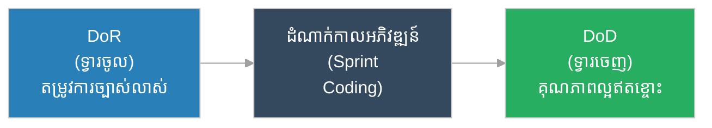

# និយមន័យនៃភាពរួចរាល់ជាស្ថាពរ (Definition of Done - DoD)

**អ្នកនិពន្ធ (Author):** ichamrong 
**កាលបរិច្ឆេទ (Date):** 2026-05-29 
**ស្លាក (Tags):** #agile #dod #project-management #quality-assurance 
**ប្រភេទ (Category):** Management & Leadership 
**រយៈពេលអាន (Read Time):** ~៥ នាទី (~5 min) 

---

## 📌 មាតិកា (Table of Contents)
- [១. តើ​អ្វី​ទៅ​ជា DoD? (What is DoD?)](#1)
- [២. ហេតុអ្វី​បាន​ជា DoD មាន​សារៈសំខាន់? (Why is DoD Important?)](#2)
- [៣. គំរូបញ្ជីផ្ទៀងផ្ទាត់ DoD ស្ដង់ដារ (Standard DoD Checklist)](#3)
- [៤. ភាពខុសគ្នារវាង DoR និង DoD (Difference between DoR and DoD)](#4)

---

## ១. តើ​អ្វី​ទៅ​ជា DoD? (What is DoD?)

**និយមន័យនៃភាពរួចរាល់ជាស្ថាពរ (Definition of Done - DoD)** គឺជា​បញ្ជីផ្ទៀងផ្ទាត់ផ្លូវ​ការ និង​តឹងរ៉ឹងមួយ​ដែល​កំណត់​ពី​លក្ខខណ្ឌ​គុណភាព និង​លក្ខណៈ​បច្ចេកទេស​ទាំងអស់​ដែល​កូដ ឬ​មុខងារ​ថ្មី​ត្រូវតែ​ឆ្លងកាត់ ១០០% មុន​ពេល​វា​ត្រូវ​បាន​ចាត់ទុកថា «រួច​រាល់​ជា​ស្ថាពរ» និង​អាចដាក់ឱ្យដំណើរ​ការ​លើ​បរិស្ថានផលិតកម្ម​ពិត (Production)។

DoD ជួយធានាថាក្រុ​មក​ារងារ​មាន​ការ​យល់ឃើញរួមគ្នាមួយច្បាស់លាស់អំ​ពី​គុណភាព​ការ​ងារ និង​ការ​ពារទស្សនៈ «រួច​រាល់​តែ​នៅ​លើ​ម៉ាស៊ីន​របស់​ខ្ញុំ» (Works on my machine)។

---

## ២. ហេតុអ្វី​បាន​ជា DoD មាន​សារៈសំខាន់? (Why is DoD Important?)

* **ធានា​គុណភាព​កូដ​ជា​ប់​ជា​និច្ច (Ensure Consistent Quality):** DoD គឺជា​ខែល​ការ​ពារប្រឆាំងនឹង​កូដ​ដែល​មាន​គុណភាព​ទាប កង្វះ​ការ​ធ្វើ​តេស្ត ឬ​កូដ​ដែល​មិន​ទាន់​បាន​ពិនិត្យស្អាត​ល្អ។
* **កាត់បន្ថយ​បំណុលបច្ចេកទេស (Reduce Technical Debt):** តាមរយៈ​ការ​តម្រូវឱ្យ​សរសេរ​ឯកសារណែនាំ ធ្វើ​តេស្តស្វ័យប្រវត្ត និង​ពិនិត្យ​កូដ (Code Review) មុន​ពេល​បញ្ចេញ។
* **តម្លាភាពច្បាស់លាស់ (Absolute Transparency):** ភាគីពាក់ព័ន្ធ​ទាំងអស់ (Stakeholders) ដឹងច្បាស់ថាផលិតផល​ដែល​បញ្ចេញ​មាន​កម្រិត​គុណភាព​ស្តង់ដារកម្រិតណា។

---

## ៣. គំរូបញ្ជីផ្ទៀងផ្ទាត់ DoD ស្ដង់ដារ (Standard DoD Checklist)

ជា​ទូ​ទៅ បញ្ជីផ្ទៀងផ្ទាត់ DoD របស់​ក្រុ​មក​ារងារវិស្វកម្មទំនើបរួម​មាន៖

1. **ការ​ពិនិត្យ​កូដ (Code Reviewed):** ត្រូវ​បាន​ពិនិត្យ និង​យល់ព្រម​ដោយ​សមាជិក​ក្រុម​យ៉ាង​ហោចណាស់ម្នាក់។
2. **ការ​ធ្វើ​តេស្តឆ្លងកាត់ (Tests Passed):** រាល់​ការ​ធ្វើ​តេស្តស្វ័យប្រវត្ត (Unit & Integration Tests) ទាំងអស់​ដំណើរ​ការ​បាន​ជោគជ័យ។
3. **កម្រិតគ្របដណ្តប់​នៃ​តេស្ត (Test Coverage):** សម្រេច​បាន​នូវកម្រិតគ្របដណ្តប់​កូដ​យ៉ាង​ហោចណាស់ ៨០%។
4. **ឯកសារណែនាំ (Documentation Updated):** ឯកសារស្ថាបត្យកម្ម និង API ត្រូវ​បាន​ធ្វើ​បច្ចុប្បន្នភាព។
5. **ការ​អនុម័តសន្តិសុខ (Security Checked):** គ្មាន​ចន្លោះប្រហោងសន្តិសុខធ្ងន់ធ្ងរ​ត្រូវ​បាន​រកឃើញ​ដោយ​ម៉ាស៊ីនស្​កែ​នស្វ័យប្រវត្ត​ឡើយ។

---

## ៤. ភាពខុសគ្នារវាង DoR និង DoD (Difference between DoR and DoD)

DoR និង DoD គឺជា​បង្គោលព្រំដែន​ពី​រផ្សេងគ្នា​នៃ​ការ​ងារ​អភិវឌ្ឍ​ន៍​កម្មវិធី៖

* **DoR (ទ្វារចូល):** ធានាថាយើង **ធ្វើ​ការ​ងារឱ្យ​បាន​ត្រឹម​ត្រូវ** (Are we doing the right work?)។
* **DoD (ទ្វារចេញ):** ធានាថាយើង **ធ្វើ​វាឡើងប្រកប​ដោយ​គុណភាព​ល្អ​ឥតខ្ចោះ** (Did we build it right?)។
