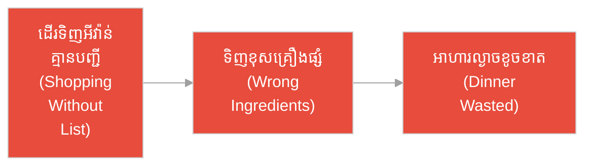
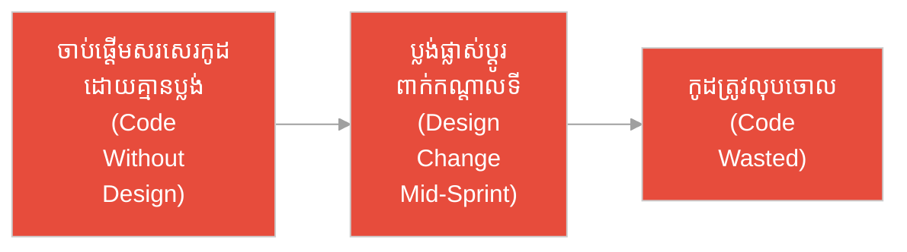
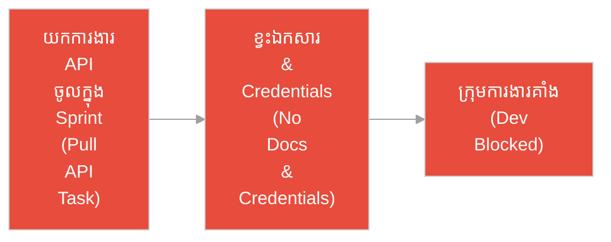
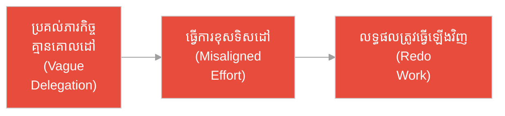
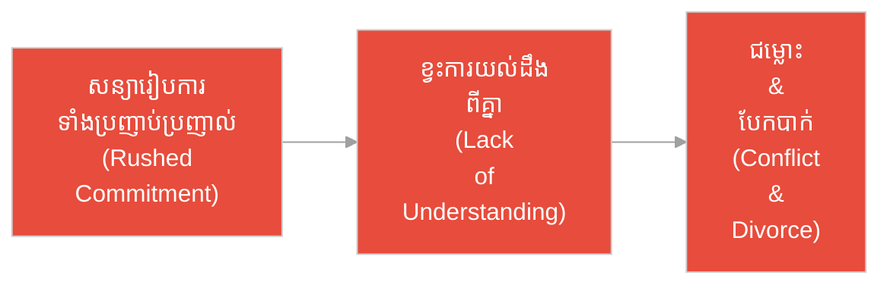
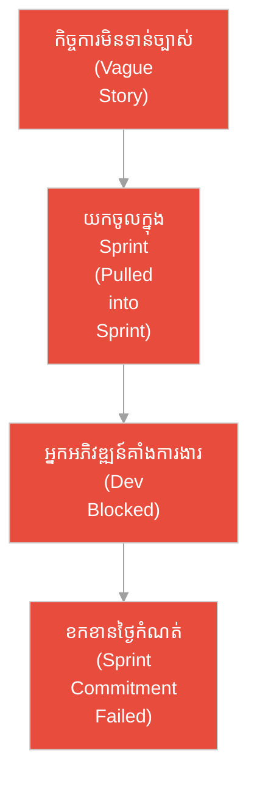
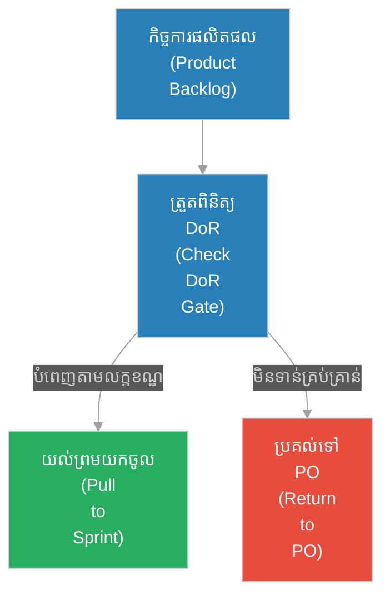

# និយមន័យនៃភាពរួចរាល់ (Definition of Ready)៖ អធិរាជ និង​ស្ពានកណ្តាលទន្លេ (The Emperor & The River Bridge)

**អ្នកនិពន្ធ (Author):** ichamrong 
**កាលបរិច្ឆេទ (Date):** 2026-05-29 
**ស្លាក (Tags):** #agile #dor #project-management #process #parable 
**ប្រភេទ (Category):** Management & Leadership 
**រយៈពេលអាន (Read Time):** ~៧ នាទី (~7 min) 

---

## 📌 មាតិកា (Table of Contents)
- [អន្ទាក់​ផ្លូវចិត្ត (The Trap)](#0)
- [១. រឿងប្រៀបប្រដូច៖ អធិរាជ និង​ស្ពានកណ្តាលទន្លេ (The Parable: The Emperor & The River Bridge)](#1)
- [២. បញ្ហា៖ ការចាប់ផ្តើម​ទាំង​ងងឹតងងុល (The Issue: Blind Execution)](#2)
- [៣. ឧទាហរណ៍​ជាក់ស្តែង​ក្នុង​ពិភពពិត (Real World Examples)](#3)
- [៤. ដំណោះស្រាយ៖ ការអនុវត្ត DoR ជា​យុទ្ធសាស្ត្រ (The Solution: Strategic DoR Application)](#4)
- [សេចក្តីសន្និដ្ឋាន (Conclusion)](#5)
- [ឯកសារយោង (References)](#6)
- [Related Posts](#7)

---

## អន្ទាក់​ផ្លូវចិត្ត (The Trap)

តើ​អ្នក​ធ្លាប់ចាប់ផ្​តើ​មក​ារងារ ឬ​គម្រោង​អ្វីមួយ​ដោយ​ភាពស្វាហាប់ និង​រំភើបចិត្ត ប៉ុន្តែ​នៅ​ពេល​ធ្វើ​ទៅ​បាន​ពាក់កណ្តាលផ្លូវ បែរ​ជា​ត្រូវ​គាំង ខ្ជះខ្​ជា​យធនធាន និង​ខកខានថ្ងៃកំណត់​ការ​ងារទាំងស្រុងដែរ​ឬ​ទេ?

* **ផ្នែកខាង​លឿន (The Speed Trap):** «ចាប់ផ្​តើ​ម​ធ្វើ​ភ្លាម​ទៅ! កុំ​ខាត​ពេល​រៀបចំផែន​ការ ចាំដោះស្រាយលម្អិត​តាម​ក្រោយ!»
* **ផ្នែកខាងរៀបរយ (The Ready Gate):** «ឈប់សិន! មិន​ត្រូវ​ចាប់ផ្​តើ​មក​ារងារសូម្បី​តែ​មួយជំហាន លុះត្រា​តែ​លក្ខខណ្ឌ និង​ព័ត៌មាន​ទាំងអស់​ត្រូវ​បាន​បញ្​ជា​ក់ច្បាស់លាស់ និង​រួច​រាល់ ១០០%។»

---

## ១. រឿងប្រៀបប្រដូច៖ អធិរាជ និង​ស្ពានកណ្តាលទន្លេ (The Parable: The Emperor & The River Bridge)

កាល​ពី​ព្រេងនាយ មាន​អធិរាជដ៏​មាន​អំណាចមួយអង្គ​ចង់​សាងសង់ស្ពានដ៏ធំមួយកាត់ទន្លេដ៏កាចសាហាវ ដើម្បី​សម្រួលដល់​ការ​ធ្វើ​ដំណើរ​របស់​កងទ័ព។ ទ្រង់​បាន​កោះហៅមេ​ជា​ងសាងសង់ដ៏ល្បីល្បាញម្នាក់ឈ្មោះ **លៀង (Liang)** ហើយបញ្​ជា​ថា៖ «យើង​ត្រូវតែ​មាន​ស្ពាន​នេះ​ក្នុង​រយៈពេល ៣០ ថ្ងៃ។ ចូរចាប់ផ្​តើ​មភ្លាម!»

មេ​ជា​ងលៀង​បាន​សួរ​ទៅកាន់​អធិរាជ​ដោយ​ក្តីបារម្ភ៖ «ក្រាបទូល តើ​ទ្រង់​ចង់​បាន​ស្ពាន​ធ្វើ​អំ​ពី​ឈើ ឬ​ថ្ម? តើ​ស្ពាន​ត្រូវ​ទ្រទ្រង់ទម្ងន់កងទ័ពប៉ុន្​មាន​នាក់? ហើយ​តើ​ទ្រង់​មាន​វាស់ស្ទង់​ជម្រៅទឹក និង​ចរន្តទឹកទន្
## ៣. ឧទាហរណ៍​ជាក់ស្តែង​ក្នុង​ពិភពពិត (Real World Examples)

ដើម្បី​យល់កាន់​តែ​ច្បាស់អំ​ពី​កម្រិតផ្សេង ៗ គ្នា​នៃ DoR នៅក្នុង​សង្គម និង​ការ​ងារ សូមពិនិត្យមើលកម្រិតទាំង ៥ ខាងក្រោម៖

---

### ឧទាហរណ៍​ទី ១ — កម្រិតស្រាល (គ្រួសារ)៖ ការ​ដើរទិញអីវ៉ាន់​ដោយ​គ្មាន​បញ្ជី (The Grocery Shopping)

* **ស្ថានភាព៖** ភរិយាប្រាប់ស្វាមីឱ្យ​ទៅ​ផ្សារទិញគ្រឿងទេស​សម្រាប់​ធ្វើ​ម្ហូបល្ងាច ប៉ុន្តែ​មិន​បាន​ផ្តល់បញ្ជីទិញអីវ៉ាន់ច្បាស់លាស់ ឬ​ប្រាប់ថានឹង​ធ្វើ​ម្ហូបអ្វី​ឡើយ (DoR មិន​ទាន់រួច​រាល់)។
* **លទ្ធផល៖** ស្វាមីដើរទិញគ្រឿងទេស​ដោយ​ការ​ស្​មាន ទិញគ្រឿងផ្សំ​មក​ខុសគ្នា​ដែល​មិន​អាចចម្អិនរួមគ្នា​បាន និង​ភ្លេចទិញគ្រឿងស្នូល (ដូចជា​សាច់ ឬ​បន្លែចម្បង) នាំឱ្យខាតបង់ថវិកា និង​ខូចអាហារល្ងាច។

---

### ឧទាហរណ៍​ទី ២ — កម្រិតមធ្យម (បច្ចេកទេស)៖ ការ​រចនា UI មិន​ទាន់រួច​រាល់ (The UI Design)

* **ស្ថានភាព៖** ម្ចាស់ផលិតផល (PO) ប្រាប់​អ្នក​អភិវឌ្ឍ​ន៍ឱ្យចាប់ផ្​តើ​ម​សរសេរ​កូដ​ទំព័រ​ចុះឈ្មោះ (Sign-up page) ប៉ុន្តែ​ប្លង់រចនា (UI Mockup) មិន​ទាន់​ត្រូវ​បាន​បញ្ចប់​ឡើយ។
* **លទ្ធផល៖** អ្នក​អភិវឌ្ឍ​ន៍​សរសេរ​កូដ​ផ្អែក​លើ​ការ​ស្​មាន។ ពី​រថ្ងៃ​ក្រោយ​មក អ្នក​រចនា UI បញ្ជូនប្លង់ផ្លាស់ប្តូរ​ថ្មី​ស្រឡាង នាំឱ្យ​កូដ​ដែល​បាន​សរសេរ​រួច​ត្រូវ​លុប​ចោល និង​ធ្វើ​ឡើងវិញទាំងស្រុង។

---

### ឧទាហរណ៍​ទី ៣ — កម្រិតមធ្យម (ធុរកិច្ច)៖ ការ​តភ្​ជា​ប់ API ភាគីទីបី (The Third-Party API)

* **ស្ថានភាព៖** ក្រុ​មក​ារងារយកកិច្ច​ការ «តភ្​ជា​ប់​ប្រព័ន្ធ​ទូទាត់ប្រាក់ PayPal» ចូល​ក្នុង​វដ្ត​ការ​ងារ ប៉ុន្តែ​មិន​ទាន់ទទួល​បាន​ឯកសារបច្គេកទេស (API Documents) ឬ​គណនីសាកល្បង (Sandbox credentials) ពី PayPal នៅ​ឡើយ។
* **លទ្ធផល៖** អ្នក​អភិវឌ្ឍ​ន៍ចំណាយ​ពេល​ពី​រថ្ងៃដំបូងរង់ចាំ និង​ទាក់ទងសុំគណនី។ គម្រោង​ត្រូវ​គាំង​ការ​ងារពាក់កណ្តាលទី ហើយ​មិន​អាចបញ្ចប់​ការ​ងារ​តាម​ការ​ប្តេជ្ញា​ចិត្ត។

---

### ឧទាហរណ៍​ទី ៤ — កម្រិតមធ្យម (សង្គម/គ្រប់​គ្រង)៖ ការ​ប្រគល់ភារកិច្ច​គ្មាន​គោលដៅ (Vague Delegation)

* **ស្ថានភាព៖** អ្នក​គ្រប់​គ្រងប្រគល់ភារកិច្ចឱ្យ​សមាជិក​ក្រុមម្នាក់​សរសេរ «របាយ​ការ​ណ៍លក់ប្រចាំត្រីមាស» ដោយ​គ្មាន​ទម្រង់ ឬ​ការ​កំណត់គោលដៅច្បាស់លាស់​ពី​ប្រភេទ​ព័ត៌មាន​ដែល​ត្រូវ​ការ។
* **លទ្ធផល៖** បុគ្គលិកចំណាយ​ពេល ៣ ថ្ងៃ​សរសេរ​ឯកសារ PDF ៣០ ទំព័រ​យ៉ាង​លម្អិត ប៉ុន្តែ​អ្នក​គ្រប់​គ្រង​ត្រូវ​ការ​ត្រឹមស្លាយសង្ខេប ១ ទំព័រ​សម្រាប់​ថ្នាក់​លើ នាំឱ្យ​ត្រូវ​កែប្រែ និង​ធ្វើ​ឡើងវិញទាំងស្រុង។

---

### ឧទាហរណ៍​ទី ៥ — កម្រិតធ្ងន់ (ទំនាក់ទំនង)៖ ការ​សន្យាទាំងប្រញាប់ប្រញាល់ (The Rushed Commitment)

* **ស្ថានភាព៖** គូស្នេហ៍មួយគូសម្រេចចិត្តរៀប​ការ និង​ទិញផ្ទះរួមគ្នា (Sprint Commitment) បន្ទាប់​ពី​ស្គាល់គ្នា​បាន​តែ ២ សប្តាហ៍ ដោយ​មិន​ទាន់​បាន​ពិភាក្សា​អំ​ពី​តម្លៃស្នូលជីវិត ហិរញ្ញវត្ថុ ឬ​គោលដៅអនាគត​ឡើយ (DoR មិន​ទាន់រួច​រាល់)។
* **លទ្ធផល៖** នៅ​ពេល​រស់នៅ​ជា​មួយគ្នា ពួកគេជួបប្រទះជម្លោះតម្លៃស្នូលជីវិត​មិន​ស៊ីសង្វាក់គ្នា​ជា​រៀង​រាល់ថ្ងៃ នាំឱ្យកើត​មាន​ភាពរកាំរកូស បែកបាក់ និង​លែងលះគ្នា​ដោយ​ក្តីឈឺចាប់។

---រឹម​ត្រូវ​ជា​មុន​សិន។»

---

## ២. បញ្ហា៖ ការចាប់ផ្តើម​ទាំង​ងងឹតងងុល (The Issue: Blind Execution)

នៅក្នុង​ការ​អភិវឌ្ឍ​ន៍សូហ្វវែរ (Software Development) ការចាប់ផ្តើម​ធ្វើ​ការ​ងារ (Sprint) ទាំង​ដែល​តម្រូវ​ការ​ការ​ងារ​មិន​ទាន់ច្បាស់លាស់ គឺ​មិន​ខុស​ពី​ការ​ចាក់ថ្មចូល​ក្នុង​ទន្លេដ៏កាចសាហាវ​ក្នុង​រឿង​ខាងលើ​នោះ​ទេ។ 

បាតុភូត​នេះ​ត្រូវ​បាន​ទប់ស្កាត់​ដោយ **និយមន័យនៃភាពរួចរាល់​សម្រាប់​ចាប់ផ្​តើ​ម (Definition of Ready - DoR)**។ DoR គឺជា​កិច្ចព្រមព្រៀង និង​ជា «ទ្វារចូល» (Gatekeeper) ដើម្បី​ធានាថា​រាល់​កិច្ច​ការ​ងារ (User Story) ត្រូវតែ​មាន​ព័ត៌មាន និង​លក្ខខណ្ឌ​គ្រប់​គ្រាន់ មុន​ពេល​អនុញ្ញាតឱ្យ​ក្រុមអភិវឌ្ឍន៍​យក​ទៅ​អនុវត្ត។

---

## ៣. ឧទាហរណ៍​ជាក់ស្តែង​ក្នុង​ពិភពពិត

---

### ឧទាហរណ៍​ទី ១ — កម្រិតស្រាល (បច្ចេកទេស)៖ ការ​រចនា UI មិន​ទាន់រួច​រាល់ (The Dev vs UI Design)

* **ស្ថានភាព៖** ម្ចាស់ផលិតផល (PO) ប្រាប់​អ្នក​អភិវឌ្ឍ​ន៍ឱ្យចាប់ផ្​តើ​ម​សរសេរ​កូដ​ទំព័រ​ចុះឈ្មោះ (Sign-up page) ប៉ុន្តែ​ប្លង់រចនា (UI Mockup) មិន​ទាន់​ត្រូវ​បាន​បញ្ចប់​ឡើយ។
* **លទ្ធផល៖** អ្នក​អភិវឌ្ឍ​ន៍​សរសេរ​កូដ​ផ្អែក​លើ​ការ​ស្​មាន។ ពី​រថ្ងៃ​ក្រោយ​មក អ្នក​រចនា UI បញ្ជូនប្លង់ផ្លាស់ប្តូរ​ថ្មី​ស្រឡាង នាំឱ្យ​កូដ​ដែល​បាន​សរសេរ​រួច​ត្រូវ​លុប​ចោល និង​ធ្វើ​ឡើងវិញទាំងស្រុង។

---

### ឧទាហរណ៍​ទី ២ — កម្រិតមធ្យម (ធុរកិច្ច)៖ ការ​តភ្​ជា​ប់ API ភាគីទីបី (The Third-Party API)

* **ស្ថានភាព៖** ក្រុ​មក​ារងារយកកិច្ច​ការ «តភ្​ជា​ប់​ប្រព័ន្ធ​ទូទាត់ប្រាក់ PayPal» ចូល​ក្នុង​វដ្ត​ការ​ងារ ប៉ុន្តែ​មិន​ទាន់ទទួល​បាន​ឯកសារបច្ចេកទេស (API Documents) ឬ​គណនីសាកល្បង (Sandbox credentials) ពី PayPal នៅ​ឡើយ។
* **លទ្ធផល៖** អ្នក​អភិវឌ្ឍ​ន៍ចំណាយ​ពេល​ពី​រថ្ងៃដំបូងរង់ចាំ និង​ទាក់ទងសុំគណនី។ គម្រោង​ត្រូវ​គាំង​ការ​ងារពាក់កណ្តាលទី ហើយ​មិន​អាចបញ្ចប់​ការ​ងារ​តាម​ការ​ប្តេជ្ញា​ចិត្ត។

---

## ៤. ដំណោះស្រាយ៖ ការអនុវត្ត DoR ជា​យុទ្ធសាស្ត្រ (The Solution: Strategic DoR Application)

ដើម្បី​កុំ​ឱ្យធ្លាក់ចូល​ទៅ​ក្នុង «អន្ទាក់​ល្បឿន» ក្រុ​មក​ារងារ​ត្រូវ​អនុវត្តគោល​ការ​ណ៍ DoR យ៉ាង​ម៉ឺងម៉ាត់បំផុត តាមរយៈ​បញ្ជីផ្ទៀងផ្ទាត់ **INVEST** មុន​ពេល​អនុញ្ញាតឱ្យយកកិច្ច​ការ​ចូល Sprint៖

* **I - Independent (ឯករាជ្យ):** កិច្ច​ការ​មិន​ត្រូវ​ពឹងផ្អែក ឬ​រង់ចាំ​ការ​ងារផ្សេងទៀត​ដែល​មិន​ទាន់រួច​រាល់​ឡើយ។
* **N - Negotiable (អាចចរចា​បាន):** មិន​មែន​ជា​កិច្ចសន្យារឹងកំព្រឹងទេ ប៉ុន្តែ​ជា​ចំណុច​ពិភាក្សា និង​កែ​សម្រួល​បាន។
* **V - Valuable (មាន​តម្លៃ):** ផ្តល់តម្លៃច្បាស់លាស់ដល់​អ្នកប្រើប្រាស់ ឬ​អាជីវកម្ម។
* **E - Estimatable (អាចប៉ាន់ស្​មាន​បាន):** ក្រុ​មក​ារងារយល់ច្បាស់​ដើម្បី​ប៉ាន់ស្​មាន​ទំហំ​ការ​ងារ (Story Points)។
* **S - Small (តូចល្មម):** មាន​ទំហំតូចល្មម​ដែល​អាចបញ្ចប់​បាន​ក្នុង​វដ្ត​ការ​ងារ​តែ​មួយ (Sprint)។
* **T - Testable (អាចសាកល្បង​បាន):** មាន​លក្ខខណ្ឌទទួលយក​ច្បាស់លាស់ (Acceptance Criteria - AC) ដើម្បី​ផ្ទៀងផ្ទាត់។

---

## 🐇 ធ្លាក់ចូល​ក្នុង​រន្ធទន្សាយ (Enter the Rabbit Hole)

ដើម្បី​ស្វែងយល់កាន់​តែ​ស៊ីជម្រៅអំ​ពី​របៀប​ដែល DoR និង DoD ធ្វើ​ការ​រួមគ្នា​ក្នុង​ការ​ធានា​គុណភាព​ផលិតផល សូមចុច​លើ​តំណភ្​ជា​ប់​ខាងក្រោម៖

* 🚀 **[និយមន័យនៃភាពរួចរាល់ជាស្ថាពរ (Definition of Done - DoD) ➔](./dod.md)**
* 🚀 **[ DoR ធៀបនឹង DoD (DoR vs DoD Guide) ➔](../../../02-dor-and-dod-guide.md)**
* 🚀 **[ការ​រៀបចំផែន​ការ​វដ្ត​ការ​ងារ (Sprint Planning) ➔](../ceremonies/sprint-planning.md)**

---

## សេចក្តីសន្និដ្ឋាន (Conclusion)

> **«ការ​ប្រញាប់ប្រញាល់ចាប់ផ្​តើ​មក​ារងារ​ដែល​មិន​ទាន់រួច​រាល់ គឺជា​វិធីសាស្ត្រ​លឿន​បំផុត​ដើម្បី​បរាជ័យ។»**

ការ​បង្កើត និង​គោរព​តាម DoR មិន​មែន​ជា​ការ​បង្កើត​ការ​ិយាល័យធិបតេយ្យ​យឺត​យ៉ាវ​ឡើយ ប៉ុន្តែ​វា​ជា​ការ​ដកថយមួយជំហាន ដើម្បី​រត់​ទៅ​មុខឱ្យ​បាន​លឿន និង​មាន​សុវត្ថិភាព។

---

## ឯកសារយោង (References)

* **Mike Cohn** — *User Stories Applied: For Agile Software Development* (2004).
* **Roman Pichler** — *Agile Product Management with Scrum* (2010).

---

## Related Posts

* [និយមន័យនៃភាពរួចរាល់ជាស្ថាពរ (Definition of Done - DoD)](./dod.md) — យន្ត​ការ​ធានា​គុណភាព​នៅទ្វារចេញ។
* [ការសរសេរកូដតាមចិត្តនឹកឃើញ (Cowboy Coding)](../practices/cowboy-coding.md) — ផលវិបាក​នៃ​ការ​អភិវឌ្ឍ​ន៍​ដែល​ខ្វះវិន័យ DoR។
