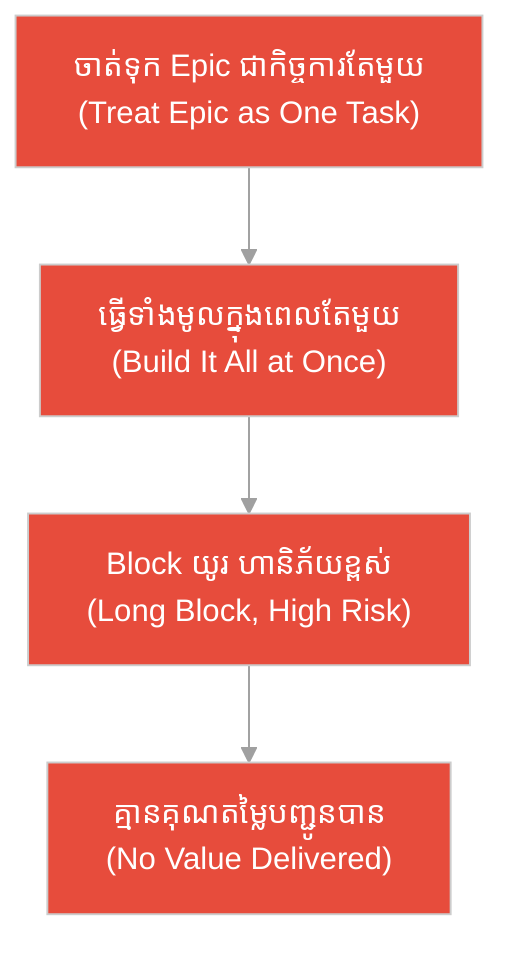
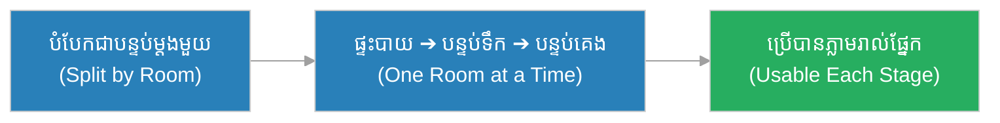
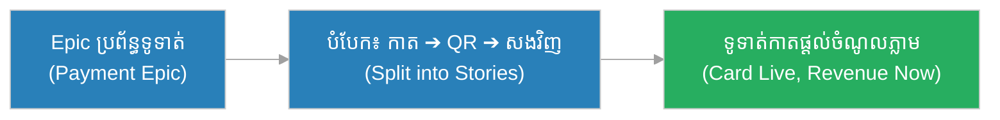
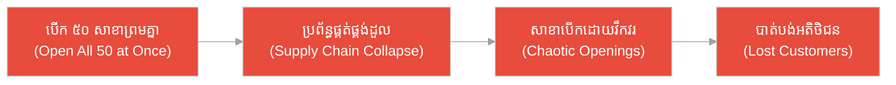
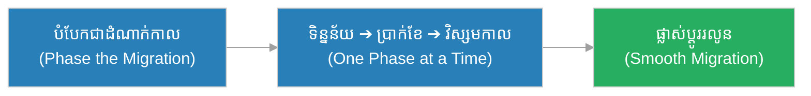
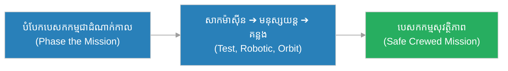
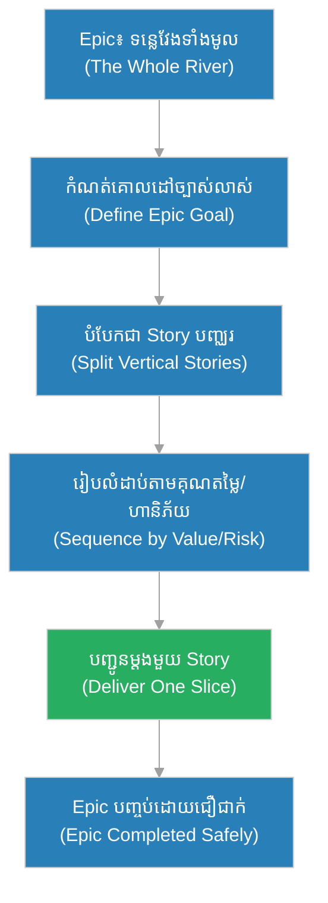

# មហាកាព្យ (Epic)៖ ទន្លេវែង និង​ទ្វារទប់ទឹក​សម្រាប់​ឆ្លងកាត់ម្តងមួយផ្នែក (The Long River & The Lock-Gates)

**អ្នកនិពន្ធ (Author):** ichamrong 
**កាលបរិច្ឆេទ (Date):** 2026-05-29 
**ស្លាក (Tags):** #agile #scrum #epic #parable 
**ប្រភេទ (Category):** Management & Leadership 
**រយៈពេលអាន (Read Time):** ~១២ នាទី (~12 min) 

---

## 📌 មាតិកា (Table of Contents)
- [អន្ទាក់​នៃ​ខ្នាតធំ (The Big-Chunk Trap)](#0)
- [១. រឿងប្រៀបប្រដូច៖ ទន្លេវែង និង​ទ្វារទប់ទឹក (The Parable: The Long River & The Lock-Gates)](#1)
- [២. បញ្ហា៖ ការ​ព្យាយាម​ធ្វើ Epic ទាំងមូល​ក្នុង​ពេល​តែ​មួយ (The Issue: Doing the Whole Epic at Once)](#2)
- [៣. ឧទាហរណ៍​ជាក់ស្តែង​ក្នុង​ពិភពពិត (Real World Examples)](#3)
 - [ឧទាហរណ៍​ទី ១ — កម្រិតស្រាល (គ្រួសារ)៖ ការ​ជួសជុលផ្ទះទាំងមូល (The Whole-House Renovation)](#3-1)
 - [ឧទាហរណ៍​ទី ២ — កម្រិតមធ្យម (បច្ចេកទេស)៖ ការ​កសាង​ប្រព័ន្ធ​ទូទាត់ប្រាក់ (The Payment System Build)](#3-2)
 - [ឧទាហរណ៍​ទី ៣ — កម្រិតមធ្យម (ធុរកិច្ច)៖ ការ​បើកសាខា​ថ្មី​ទូទាំងប្រទេស (The Nationwide Branch Rollout)](#3-3)
 - [ឧទាហរណ៍​ទី ៤ — កម្រិតមធ្យម (គ្រប់​គ្រង)៖ ការ​ផ្លាស់ប្តូរ​ប្រព័ន្ធ HR ទាំងស្រុង (The HR System Migration)](#3-4)
 - [ឧទាហរណ៍​ទី ៥ — កម្រិតធ្ងន់ (បេសកកម្មលំហ)៖ កម្មវិធី​បញ្ជូនមនុស្ស​ទៅ​ភពព្រះអង្គារ (The Mars Mission Program)](#3-5)
- [៤. ការ​សន្ទនាបែបសាកសួរ (Socratic Dialogue: One Leap vs. Many Segments)](#4)
- [៥. ដំណោះស្រាយ៖ ការ​បំបែក Epic ឱ្យត្រឹម​ត្រូវ (The Solution: Slicing an Epic Properly)](#5)
- [សេចក្តីសន្និដ្ឋាន (Conclusion)](#6)
- [ឯកសារយោង (References)](#7)
- [Related Posts](#8)

---

## អន្ទាក់​នៃ​ខ្នាតធំ (The Big-Chunk Trap)

នៅ​ពេល​ប្រឈមមុខនឹង​ការ​ងារខ្នាតធំ យើង​តែ​ង​តែ​ធ្លាក់ចូល​អន្ទាក់​ផ្ទុយគ្នា​ពី​រ៖

* **អន្ទាក់​លោតម្តង (The One-Leap Trap):** «Epic គឺ​គ្រាន់​តែ​ជា​កិច្ច​ការ​ធំមួយ! យើងគ្រាន់​តែ​ធ្វើ​វាទាំងមូល​ក្នុង​ពេល​តែ​មួយ រួចបញ្ជូននៅទីបញ្ចប់!»
* **អន្ទាក់​បំបែករហូត (The Endless-Splitting Trap):** «យើងបំបែក Epic ជា​រាប់រយ Story តូច ៗ ដោយ​គ្មាន​ទិសដៅ ឬ​គុណតម្លៃច្បាស់លាស់ រហូតបាត់បង់រូបភាពធំ!»

---

## ១. រឿងប្រៀបប្រដូច៖ ទន្លេវែង និង​ទ្វារទប់ទឹក (The Parable: The Long River & The Lock-Gates)

នៅស្រុកមួយ មាន​ទន្លេវែងដ៏ធំ ហូរកាត់ភូមិមួយ ដែល​ធំ និង​ជ្រៅពេក មិន​អាចឆ្លងម្តង​បាន​ឡើយ។ វិស្វករម្នាក់ឈ្មោះ **ដារ៉ា (Dara)** បាន​សិក្សាទន្លេ​នេះ ហើយដឹងថា ការ​ព្យាយាមឆ្លងវា​ក្នុង​ពេល​តែ​មួយ គឺ​មហន្តរាយ។ គាត់ក៏រចនា​ប្រព័ន្ធ **ទ្វារទប់ទឹក (lock-gates)** បែងចែកទន្លេវែង​ជា​ផ្នែក ៗ ដែល​អាច​ធ្វើ​ដំណើរ​បាន។ ទូក​នីមួយ ៗ ឆ្លងកាត់ផ្នែកមួយម្តង ៗ ៖ ចូលផ្នែកទីមួយ បិទទ្វារ លៃកម្រិតទឹក រួចបើកទ្វារ​ទៅ​ផ្នែកបន្ទាប់។

រាល់​ផ្នែក​ដែល​ឆ្លងផុត គឺជា​ជោគជ័យ​ពិតប្រាកដ​មួយ ដែល​អាចមើលឃើញ និង​វាស់វែង​បាន។ បើផ្នែកណាមួយ​មាន​បញ្ហា ដារ៉ាដោះស្រាយត្រឹមផ្នែក​នោះ ដោយ​មិន​ប៉ះពាល់ដល់ផ្នែកដទៃ។ មិន​យូរប៉ុន្​មាន ទូក​ទាំងអស់​ឆ្លងទន្លេវែង​បាន​ដោយ​សុវត្ថិភាព ម្តងមួយផ្នែក ៗ ។

ផ្ទុយ​ទៅ​វិញ មាន​បុរសម្នាក់នៅភូមិម្ខាងទៀត ដែល​អន្ទះអន្ទែង​ចង់​ឆ្លង​លឿន។ គាត់​មិន​ជឿ​លើ​ទ្វារទប់ទឹក​ឡើយ ដោយ​គិតថា ទន្លេគ្រាន់​តែ​ជា​ឧបសគ្គមួយ ត្រូវ​ឆ្លងម្តង​តែ​ម្ដង។ គាត់លោតចុះទឹក ព្យាយាមហែលឆ្លងទន្លេវែងទាំងមូល​ក្នុង​ពេល​តែ​មួយ។ ចរន្តទឹក​ខ្លាំង បាន​បក់គាត់បាត់​ទៅ​ឆ្ងាយ — គាត់​មិន​បាន​ឆ្លងផ្នែកណាមួយ​ឡើយ ហើយក៏លិចបាត់​ក្នុង​ទន្លេ។

---

## ២. បញ្ហា៖ ការ​ព្យាយាម​ធ្វើ Epic ទាំងមូល​ក្នុង​ពេល​តែ​មួយ (The Issue: Doing the Whole Epic at Once)

នៅក្នុង Agile, **មហាកាព្យ (Epic)** គឺ **មិន​មែន** គ្រាន់​តែ «កិច្ច​ការ​ធំមួយ​ដែល​ធ្វើ​ទាំងមូល​ក្នុង​ពេល​តែ​មួយ» ឡើយ។ Epic គឺជា **សំណុំ​ការ​ងារដ៏ធំ (large body of work)** ដែល​ត្រូវ​បំបែក​ជា **Story តូច ៗ ច្រើន** ដែល​នីមួយ ៗ ផ្តល់គុណតម្លៃ និង​បញ្ជូនជូនបន្តិចម្តង ៗ (incrementally)។

ការ​ព្យាយាមឆ្លង «ទន្លេ» ទាំងមូល​ក្នុង​ពេល​តែ​មួយ នាំឱ្យ​ការ​ងារ Block រយៈពេល​យូរ ហានិភ័យខ្ពស់ និង​គ្មាន​គុណតម្លៃណាមួយបញ្ជូន​បាន​រហូតដល់ទីបញ្ចប់ — ដែល​ជា​រឿយ ៗ មិន​មក​ដល់​ឡើយ។

---

## ៣. ឧទាហរណ៍​ជាក់ស្តែង​ក្នុង​ពិភពពិត

សូមពិនិត្យមើលរបៀប​ដែល​ការ​បំបែក​ការ​ងារធំ «ម្តងមួយផ្នែក» ជះឥទ្ធិពលដល់កម្រិតជីវិត និង​ការ​ងារទាំង ៥ ខាងក្រោម៖

---

### ឧទាហរណ៍​ទី ១ — កម្រិតស្រាល (គ្រួសារ)៖ ការ​ជួសជុលផ្ទះទាំងមូល (The Whole-House Renovation)

* **ស្ថានភាព៖** គ្រួសារមួយ​ចង់​ជួសជុលផ្ទះទាំងមូល។ ជំនួសឱ្យ​ការ​រុះរើផ្ទះទាំងមូល​ក្នុង​ពេល​តែ​មួយ ពួកគេបំបែក​ជា​ផ្នែក ៗ ៖ ផ្ទះបាយ​មុន បន្ទាប់​មក​បន្ទប់ទឹក រួចបន្ទប់គេង — រាល់​ផ្នែក​ដែល​ហើយ គឺ​អាចប្រើ​បាន​ភ្លាម។
* **លទ្ធផល៖** គ្រួសារនៅរស់​ក្នុង​ផ្ទះ​បាន​ពេញមួយ​ការ​ជួសជុល ហើយ​រាល់​ផ្នែក​ដែល​ហើយ ផ្តល់ផាសុកភាពភ្លាម ៗ ដោយ​មិន​បាច់រង់ចាំដល់ទីបញ្ចប់​ឡើយ។

---

### ឧទាហរណ៍​ទី ២ — កម្រិតមធ្យម (បច្ចេកទេស)៖ ការ​កសាង​ប្រព័ន្ធ​ទូទាត់ប្រាក់ (The Payment System Build)

* **ស្ថានភាព៖** ក្រុមអភិវឌ្ឍន៍​មាន Epic «ប្រព័ន្ធ​ទូទាត់ប្រាក់»។ ពួកគេបំបែកវា​ជា Story៖ ទូទាត់​ដោយ​កាត, ទូទាត់​ដោយ QR, ការ​សងប្រាក់វិញ, និង​របាយ​ការ​ណ៍ប្រតិបត្តិ​ការ — បញ្ជូនជូនម្តងមួយ Story។
* **លទ្ធផល៖** ការ​ទូទាត់​ដោយ​កាត​បាន​ដំណើរ​ការ​ក្នុង​ពី​រសប្តាហ៍ ផ្តល់ចំណូលភ្លាម ខណៈ Story ដទៃបន្តកសាង។ ហានិភ័យតិច ហើយ feedback អ្នក​ប្រើ មក​លឿន។

---

### ឧទាហរណ៍​ទី ៣ — កម្រិតមធ្យម (ធុរកិច្ច)៖ ការ​បើកសាខា​ថ្មី​ទូទាំងប្រទេស (The Nationwide Branch Rollout)

* **ស្ថានភាព៖** ក្រុមហ៊ុនលក់រាយ​ចង់​បើកសាខា ៥០ កន្លែងទូទាំងប្រទេស។ នាយកប្រតិបត្តិម្នាក់ ដោយ​ចង់​បង្ហាញ​លទ្ធផលធំ បាន​បញ្​ជា​ឱ្យបើកសាខាទាំង ៥០ ព្រម ៗ គ្នា​ក្នុង​ខែ​តែ​មួយ ដោយ​ចាត់ទុក Epic ជា​ការ​ងារ​តែ​មួយ។
* **លទ្ធផល៖** ប្រព័ន្ធ​ផ្គត់ផ្គង់ដួលរលំ បុគ្គលិក​មិន​ទាន់​បាន​បណ្តុះបណ្តាល ហើយ ៣០ សាខាបើក​ដោយ​វឹកវរ មិន​មាន​ទំនិញ​គ្រប់​គ្រាន់ — បាត់បង់អតិថិជន និង​កេរ្តិ៍ឈ្មោះ។

---

### ឧទាហរណ៍​ទី ៤ — កម្រិតមធ្យម (គ្រប់​គ្រង)៖ ការ​ផ្លាស់ប្តូរ​ប្រព័ន្ធ HR ទាំងស្រុង (The HR System Migration)

* **ស្ថានភាព៖** ប្រធានផ្នែក HR មាន Epic «ផ្លាស់ប្តូរ​ទៅ​ប្រព័ន្ធ HR ថ្មី»។ គាត់បំបែកវា​ជា​ដំណាក់កាល៖ ផ្ទេរ​ទិន្នន័យ​បុគ្គលិក​មុន, រួច​ប្រព័ន្ធ​បើកប្រាក់ខែ, បន្ទាប់​មក​ការ​គ្រប់​គ្រងវិស្ស​មក​ាល — ម្តងមួយដំណាក់កាល បូកដំណើរ​ការ​គូស្រប (parallel run)។
* **លទ្ធផល៖** រាល់​ដំណាក់កាល​ដែល​ហើយ ត្រូវ​បាន​ផ្ទៀងផ្ទាត់ និង​ប្រើ​ជាក់ស្តែង បុគ្គលិកសម្របខ្លួនបន្តិចម្តង ៗ ហើយ​ការ​ផ្លាស់ប្តូរទាំងមូលរលូន គ្មាន​ការ​ខូចខាតប្រាក់ខែ​ឡើយ។

---

### ឧទាហរណ៍​ទី ៥ — កម្រិតធ្ងន់ (បេសកកម្មលំហ)៖ កម្មវិធី​បញ្ជូនមនុស្ស​ទៅ​ភពព្រះអង្គារ (The Mars Mission Program)

* **ស្ថានភាព៖** ទីភ្នាក់ងារលំហ មាន Epic ដ៏ធំ «បញ្ជូនមនុស្ស​ទៅ​ភពព្រះអង្គារ»។ ពួកគេ​មិន​បង្កើត​យានទាំងមូលរួចបាញ់ម្តង​តែ​ម្ដង​ឡើយ។ ពួកគេបំបែក​ជា Story៖ ការ​សាកល្បងម៉ាស៊ីន, ការ​បាញ់ឧបករណ៍មនុស្សយន្ត, ការ​វិលជុំគន្លងផែនដី, រួចទើបបេសកកម្មមនុស្ស។
* **លទ្ធផល៖** រាល់​ដំណាក់កាលផ្តល់​ការ​សិក្សា និង​ទិន្នន័យ​ពិតប្រាកដ កាត់បន្ថយហានិភ័យជីវិត ហើយ​ការ​វិវត្តន៍ឆ្ពោះ​ទៅ​ភពព្រះអង្គារដំណើរ​ការ​ដោយ​សុវត្ថិភាព និង​ជឿ​ជា​ក់។

---

## ៤. ការ​សន្ទនាបែបសាកសួរ (Socratic Dialogue: One Leap vs. Many Segments)

**សិស្ស (ម្ចាស់ផលិតផល​ថ្មី)៖** លោកគ្រូ! ខ្ញុំ​សរសេរ Epic ធំមួយ «ប្រព័ន្ធ​គ្រប់​គ្រងសិក្សា»។ តើ​ខ្ញុំគ្រាន់​តែ​ប្រគល់ Epic ទាំងមូល​នេះ​ឱ្យក្រុម​ធ្វើ ហើយរង់ចាំ ៦ ខែ ដើម្បី​បញ្ជូនវាម្តង ត្រឹម​ត្រូវ​ទេ?

**គ្រូ (ម្ចាស់ផលិតផល​ជើង​ចាស់)៖** សួរបន្តិច — បើទន្លេវែង និង​ជ្រៅពេក តើ​ឯងលោតឆ្លងម្តង​តែ​ម្ដង ឬ​ឆ្លងម្តងមួយផ្នែក​តាម​ទ្វារទប់ទឹក?

**សិស្ស៖** បើ​លោតម្តង​ ខ្ញុំ​ប្រាកដ​ជា​លិច។ ឆ្លងម្តងមួយផ្នែកវិញ​ ​ទើបសុវត្ថិភាព។

**គ្រូ៖** ត្រឹម​ត្រូវ។ ដូច្​នេះ Epic គឺ​ទន្លេវែង​នោះ។ បើឯង​ធ្វើ​ទាំងមូល​ក្នុង​ពេល​តែ​មួយ តើ​មាន​អ្វីកើតឡើង​ពេល​ឯងជួប​បញ្ហា​នៅខែទី ៥?

**សិស្ស៖** ខ្ញុំនឹង Block យូរ ហើយ ៥ ខែ​ដែល​កន្លងផុត គ្មាន​គុណតម្លៃណាបញ្ជូន​បាន​ទេ។

**គ្រូ៖** ហើយបើឯងបំបែក Epic ជា Story តូច ៗ ដែល​នីមួយ ៗ បញ្ជូនគុណតម្លៃ​បាន?

**សិស្ស៖** អ្នក​ប្រើនឹងទទួល​បាន​មុខងារខ្លះ ៗ ភ្លាម ហើយខ្ញុំទទួល feedback លឿន។

**គ្រូ៖** នេះ​ហើយ​ជា​ខ្លឹមសារ! Epic មិន​មែន​ជា​កិច្ច​ការ «ធ្វើ​ម្តង​តែ​ម្ដង» ឡើយ — វា​ជា​សំណុំ​ការ​ងារធំ ដែល​ត្រូវ​បំបែក​ជា Story ច្រើន ដែល​ឆ្លងកាត់ «ទ្វារទប់ទឹក» ម្តងមួយផ្នែក បញ្ជូនគុណតម្លៃបន្តិចម្តង ៗ ។

---

## ៥. ដំណោះស្រាយ៖ ការ​បំបែក Epic ឱ្យត្រឹម​ត្រូវ (The Solution: Slicing an Epic Properly)

ដើម្បី​គ្រប់​គ្រង Epic ឱ្យ​មាន​ប្រសិទ្ធភាព ក្រុ​មក​ារងារ​ត្រូវ​អនុវត្តគោល​ការ​ណ៍ដូច​ខាងក្រោម៖

1. **កំណត់គោលដៅ Epic ច្បាស់លាស់ (Define the Epic Goal):** Epic ត្រូវ​មាន​ទិសដៅ និង​គុណតម្លៃធំច្បាស់លាស់ — ដូចទន្លេ​មាន​ច្រាំងម្ខាងទៀតច្បាស់លាស់។
2. **បំបែក​ជា Story បញ្ឈរ (Split into Vertical Stories):** រាល់ Story ត្រូវ​ផ្តល់គុណតម្លៃប្រើ​បាន ដោយ​ខ្លួនឯង — មិន​មែន​ជា​ស្រទាប់បច្ចេកទេស​ដែល​គ្មាន​តម្លៃ ដោយ​ឡែក​នោះ​ឡើយ។
3. **រៀបលំដាប់​តាម​គុណតម្លៃ និង​ហានិភ័យ (Sequence by Value & Risk):** ឆ្លង «ផ្នែក» ដែល​ផ្តល់គុណតម្លៃខ្ពស់ ឬ​ហានិភ័យខ្ពស់​មុន​គេ។
4. **បញ្ជូនបន្តិចម្តង ៗ (Deliver Incrementally):** រាល់ Story ដែល​ហើយ គឺជា «ផ្នែកទន្លេ» មួយ​ដែល​ឆ្លងផុត — ប្រើ​បាន និង​វាស់វែង​បាន។

---

## 🐇 ធ្លាក់ចូល​ក្នុង​រន្ធទន្សាយ (Enter the Rabbit Hole)

ដើម្បី​យល់ដឹងកាន់​តែ​ស៊ីជម្រៅអំ​ពី​ការ​បំបែក​ការ​ងារ និង​គុណតម្លៃ សូមស្វែងយល់បន្ថែម៖

* 🚀 **[រឿង​អ្នក​ប្រើ (User Story) ➔](./user-story.md)**
* 🚀 **[បញ្ជីការងារផលិតផល (Product Backlog) ➔](./product-backlog.md)**
* 🚀 **[ពិន្ទុរឿង (Story Points) ➔](../metrics/story-points.md)**

---

## សេចក្តីសន្និដ្ឋាន (Conclusion)

> **«Epic មិន​មែន​ជា​ការ​លោតឆ្លងទន្លេវែងម្តង​តែ​ម្ដង​ឡើយ ប៉ុន្តែ​វា​ជា​ការ​ឆ្លងម្តងមួយផ្នែក តាម​ទ្វារទប់ទឹក — រាល់​ផ្នែក​ដែល​ឆ្លងផុត គឺជា​គុណតម្លៃ​ពិតប្រាកដ។»**

ការ​បំបែក Epic ឱ្យត្រឹម​ត្រូវ ជួយឱ្យក្រុ​មក​ារងារកាត់បន្ថយហានិភ័យ ទទួល feedback លឿន ហើយបញ្ជូនគុណតម្លៃជូន​អ្នក​ប្រើបន្តិចម្តង ៗ ដោយ​មិន​លង់លិច​ក្នុង​ការ​ងារខ្នាតធំ​ឡើយ។

---

## ឯកសារយោង (References)

* **Mike Cohn** — *User Stories Applied: For Agile Software Development* (2004).
* **Kenneth S. Rubin** — *Essential Scrum: A Practical Guide to the Most Popular Agile Process* (2012).
* **Ken Schwaber & Jeff Sutherland** — *The Scrum Guide* (2020).

---

## Related Posts

* [រឿង​អ្នក​ប្រើ (User Story)](./user-story.md) — ឯកតាតូច ៗ ដែល Epic ត្រូវ​បំបែកចេញ ដើម្បី​បញ្ជូនបន្តិចម្តង ៗ ។
* [បញ្ជីការងារផលិតផល (Product Backlog)](./product-backlog.md) — កន្លែង​ដែល Epic និង Story ត្រូវ​រៀបលំដាប់​តាម​អាទិភាព។
* [ពិន្ទុរឿង (Story Points)](../metrics/story-points.md) — របៀបប៉ាន់ស្​មាន​ទំហំ Story ដែល​បំបែកចេញ​ពី Epic។
