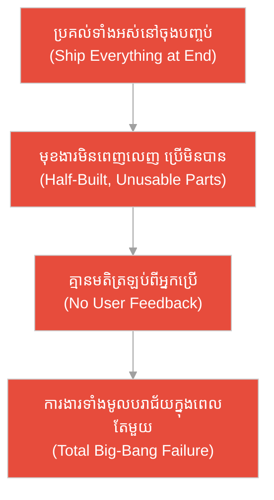
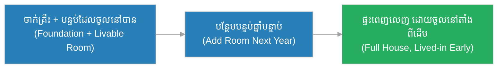
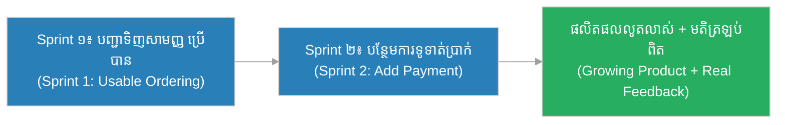
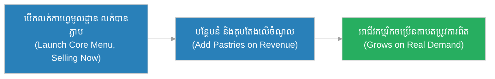
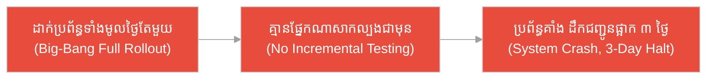
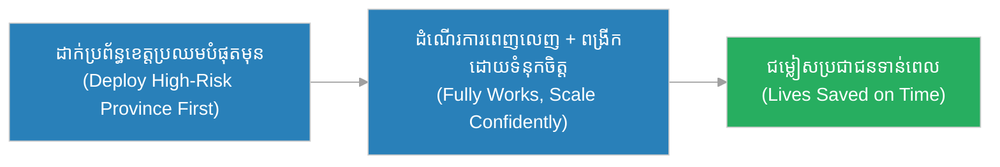
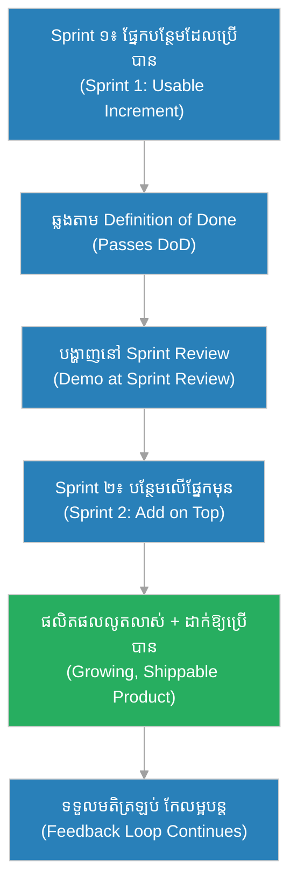

# ផ្នែកបន្ថែម (Increment)៖ ស្ពាន​ដែល​សាងសង់រួចមួយដំណាក់ម្តង ៗ និង​អាចឆ្លង​បាន​ភ្លាម (The Bridge Built One Crossable Span at a Time)

**អ្នកនិពន្ធ (Author):** ichamrong 
**កាលបរិច្ឆេទ (Date):** 2026-05-29 
**ស្លាក (Tags):** #agile #scrum #increment #parable 
**ប្រភេទ (Category):** Management & Leadership 
**រយៈពេលអាន (Read Time):** ~១២ នាទី (~12 min) 

---

## 📌 មាតិកា (Table of Contents)
- [អន្ទាក់​នៃ​ការ​ប្រគល់​ការ​ងារ (The Delivery Trap)](#0)
- [១. រឿងប្រៀបប្រដូច៖ ស្ពានឆ្លងទន្លេ និង​ជា​ងសំណង់​ពី​រនាក់ (The Parable: The River Bridge & Two Builders)](#1)
- [២. បញ្ហា៖ ការ​គិតថា «ប្រគល់​ទាំងអស់​នៅចុងបញ្ចប់» (The Issue: "We Ship Everything at the End")](#2)
- [៣. ឧទាហរណ៍​ជាក់ស្តែង​ក្នុង​ពិភពពិត (Real World Examples)](#3)
 - [ឧទាហរណ៍​ទី ១ — កម្រិតស្រាល (គ្រួសារ)៖ ការ​សន្សំប្រាក់ទិញផ្ទះម្តងបន្តិច ៗ (The Step-by-Step House Savings)](#3-1)
 - [ឧទាហរណ៍​ទី ២ — កម្រិតមធ្យម (បច្ចេកទេស)៖ កម្មវិធី​ទូរស័ព្ទ​ដែល​ដាក់ឱ្យប្រើ​បាន​ភ្លាម ៗ (The Usable Mobile App)](#3-2)
 - [ឧទាហរណ៍​ទី ៣ — កម្រិតមធ្យម (ធុរកិច្ច)៖ ការ​បើកហាងកាហ្វេ​តាម​ដំណាក់កាល (The Phased Café Launch)](#3-3)
 - [ឧទាហរណ៍​ទី ៤ — កម្រិតមធ្យម (គ្រប់​គ្រង)៖ ការ​វិនិយោគ​ប្រព័ន្ធ​ឃ្លាំងទំនិញ (The Warehouse System Rollout)](#3-4)
 - [ឧទាហរណ៍​ទី ៥ — កម្រិតធ្ងន់ (សង្គ្រោះបន្ទាន់)៖ ប្រព័ន្ធ​ព្រ​មាន​ទឹកជំនន់ (The Flood Warning System)](#3-5)
- [៤. ការ​សន្ទនាបែបសាកសួរ (Socratic Dialogue: Big-Bang Release vs. Continuous Increment)](#4)
- [៥. ដំណោះស្រាយ៖ ការ​កសាង​ផ្នែកបន្ថែម​ដែល​អាចប្រើ​បាន​និង​បន្ថែម​លើ​គ្នា (The Solution: Building Usable, Additive Increments)](#5)
- [សេចក្តីសន្និដ្ឋាន (Conclusion)](#6)
- [ឯកសារយោង (References)](#7)
- [Related Posts](#8)

---

## អន្ទាក់​នៃ​ការ​ប្រគល់​ការ​ងារ (The Delivery Trap)

នៅក្នុង​ការ​អភិវឌ្ឍ​ផលិតផល យើង​តែ​ង​តែ​ជួបប្រទះនូវភាពផ្ទុយគ្នា​នៃ​របៀបប្រគល់​ការ​ងារ៖

* **អន្ទាក់​ផ្ទុះ​តែ​ម្តង (The Big-Bang Trap):** «កុំ​ទាន់ដាក់ឱ្យប្រើ! យើង​ត្រូវ​ធ្វើ​គ្រប់​មុខងារ​ទាំងអស់​ឱ្យចប់សព្វ​គ្រប់​ជា​មុន​សិន រួចទើបប្រគល់ផលិតផលទាំងមូលនៅចុងបញ្ចប់!»
* **អន្ទាក់​បំណែក​មិន​ពេញលេញ (The Half-Built Trap):** «យើងគ្រាន់​តែ​សាងសង់បំណែកតូច ៗ ឱ្យ​បាន​ច្រើន ទុក​មិន​បាច់ឱ្យវាដំណើរ​ការ​បាន​ពេញលេញ ព្រោះ​យើងនឹងភ្​ជា​ប់វា​ទាំងអស់​នៅ​ពេល​ក្រោយ!»

---

## ១. រឿងប្រៀបប្រដូច៖ ស្ពានឆ្លងទន្លេ និង​ជា​ងសំណង់​ពី​រនាក់ (The Parable: The River Bridge & Two Builders)

កាល​ពី​ព្រេងនាយ មាន​ភូមិមួយ​ត្រូវ​ការ​ស្ពានឆ្លងទន្លេធំ ដើម្បី​ឱ្យ​អ្នក​ស្រុកអាច​ទៅ​ផ្សារនៅត្រើយម្ខាង​បាន។ ស្តេច​បាន​បញ្​ជា​ឱ្យ​ជា​ងសំណង់​ពី​រនាក់ប្រកួតគ្នាសាងសង់ស្ពាន។

ជា​ងសំណង់ម្នាក់ឈ្មោះ **ដារ៉ា (Dara)** បាន​សាងសង់ស្ពានម្តងមួយផ្នែក (Span) ដែល​ពេញលេញ និង​រឹងមាំ។ បន្ទាប់​ពី​សាងសង់ផ្នែកទីមួយរួច អ្នក​ស្រុកអាចដើរឆ្លង​បាន​ពាក់កណ្ដាលផ្លូវ ហើយ​អ្នក​នេសាទក៏ឈរសំចតលក់ត្រី​លើ​ផ្នែក​នោះ​បាន​ភ្លាម។ បន្ទាប់​មក ដារ៉ាបន្ថែមផ្នែកទី​ពី​រ​លើ​ផ្នែកទីមួយ — ឥឡូវ​អ្នក​ស្រុកដើរ​បាន​ឆ្ងាយ​ជា​ង​មុន។ រាល់​ផ្នែក​ថ្មី​ដែល​បន្ថែម គឺ​ពេញលេញ ឆ្លង​បាន និង​បន្ថែមតម្លៃ​លើ​ផ្នែក​មុន ៗ ។ មិន​យូរប៉ុន្​មាន ស្ពានទាំងមូលក៏ភ្​ជា​ប់ដល់ត្រើយម្ខាង ហើយវា​មាន​ភាពរឹងមាំ​គ្រប់​ផ្នែក។

ផ្ទុយ​ទៅ​វិញ ជា​ងសំណង់ម្នាក់ទៀត​បាន​ដំឡើង​គ្រប់​ផ្នែកស្ពាន​ទាំងអស់​ដោយ​រលុង ៗ ព្យួរនៅ​លើ​អាកាស ដោយ​គ្រោងថានឹងភ្​ជា​ប់វា​ទាំងអស់​នៅ​ពេល​ចុងបញ្ចប់​តែ​ម្តង។ ពេញ​រយៈពេល​ជា​ច្រើនខែ អ្នក​ស្រុកមើលឃើញស្ពានដ៏ស្រស់ស្អាត ប៉ុន្តែ​គ្មាន​នរណាម្នាក់អាចឆ្លង​បាន​សូម្បី​តែ​មួយជំហាន​ឡើយ ព្រោះ​ផ្នែក​នីមួយ ៗ មិន​ទាន់ដំណើរ​ការ។ លុះថ្ងៃមួយ ព្យុះភ្លៀងធំ​បាន​បក់បោក ផ្នែកស្ពាន​ដែល​គ្មាន​ជើងទម្រ និង​មិន​ទាន់ភ្​ជា​ប់គ្នាក៏រលំធ្លាក់ចូលទន្លេអស់ — ការ​ងារ​ជា​ច្រើនខែបាត់បង់អស់ ហើយភូ​មិន​ៅ​តែ​គ្មាន​ស្ពានដ​ដែល។

---

## ២. បញ្ហា៖ ការ​គិតថា «ប្រគល់​ទាំងអស់​នៅចុងបញ្ចប់» (The Issue: "We Ship Everything at the End")

នៅក្នុង Scrum, **ផ្នែកបន្ថែម (Increment)** គឺជា​លទ្ធផល​នៃ​ការ​ងារ​ដែល​អាចប្រើ​បាន (Usable) និង​អាចដាក់ឱ្យដំណើរ​ការ​បាន (Potentially Shippable) បន្ទាប់​ពី​បញ្ចប់វដ្ត​ការ​ងារ (Sprint) នីមួយ ៗ ។ ផ្នែកបន្ថែម​ថ្មី​នីមួយ ៗ ត្រូវ **បន្ថែម (Add)** លើ​ផ្នែកបន្ថែម​មុន ៗ ហើយវា​ត្រូវ **ដំណើរ​ការ​ដោយ​ខ្លួនឯង​បាន (Works on Its Own)** ដោយ​ឆ្លង​តាម​លក្ខណៈ​វិនិច្ឆ័យ​នៃ Definition of Done។

ការ​យល់ច្រឡំទូ​ទៅ​គឺ៖ «យើងប្រគល់​គ្រប់​យ៉ាង​នៅចុងបញ្ចប់» — នេះ **ខុស**។ ប្រសិនបើក្រុ​មក​ារងារទុក​រាល់​មុខងារឱ្យ​មិន​ពេញលេញ ហើយរង់ចាំភ្​ជា​ប់​ទាំងអស់​នៅ​ពេល​ក្រោយ ពួកគេនឹង​មិន​អាចទទួលមតិត្រឡប់ (Feedback) ពី​អ្នក​ប្រើ មិន​អាចបញ្​ជា​ក់តម្លៃ និង​ប្រឈមនឹងហានិភ័យ​ដែល​ការ​ងារទាំងមូលអាចបរាជ័យ​ក្នុង​ពេល​តែ​មួយ។

---

## ៣. ឧទាហរណ៍​ជាក់ស្តែង​ក្នុង​ពិភពពិត

សូមពិនិត្យមើលរបៀប​ដែល​គោល​ការ​ណ៍ «ផ្នែកបន្ថែម​ដែល​អាចប្រើ​បាន» ជះឥទ្ធិពលដល់កម្រិតជីវិត និង​ការ​ងារទាំង ៥ ខាងក្រោម៖

---

### ឧទាហរណ៍​ទី ១ — កម្រិតស្រាល (គ្រួសារ)៖ ការ​សន្សំប្រាក់ទិញផ្ទះម្តងបន្តិច ៗ (The Step-by-Step House Savings)

* **ស្ថានភាព៖** គ្រួសារមួយ​ចង់​សាងសង់ផ្ទះ។ ជំនួសឱ្យ​ការ​រង់ចាំសន្សំប្រាក់ឱ្យ​បាន​គ្រប់ ១០ ឆ្នាំសិន ពួកគេសាងសង់ម្តងមួយផ្នែក៖ ឆ្នាំទីមួយចាក់គ្រឹះ និង​បន្ទប់មួយ​ដែល​អាចចូលនៅ​បាន រួចបន្ថែមបន្ទប់ផ្សេង ៗ តាម​ឆ្នាំ។
* **លទ្ធផល៖** គ្រួសារ​មាន​កន្លែងស្នាក់នៅភ្លាម ៗ តាំង​ពី​ឆ្នាំទីមួយ ហើយ​រាល់​ឆ្នាំ ផ្ទះកាន់​តែ​ពេញលេញ ដោយ​មិន​បាច់រង់ចាំ ១០ ឆ្នាំទើប​បាន​ចូលនៅ។

---

### ឧទាហរណ៍​ទី ២ — កម្រិតមធ្យម (បច្ចេកទេស)៖ កម្មវិធី​ទូរស័ព្ទ​ដែល​ដាក់ឱ្យប្រើ​បាន​ភ្លាម ៗ (The Usable Mobile App)

* **ស្ថានភាព៖** ក្រុមអភិវឌ្ឍន៍​កំពុងសាងសង់​កម្មវិធី​បញ្​ជា​ទិញម្ហូប។ នៅ Sprint ដំបូង ពួកគេ​មិន​រង់ចាំ​ធ្វើ​គ្រប់​មុខងារទេ ប៉ុន្តែ​ប្រគល់​ផ្នែកបន្ថែម​ដែល​អាចប្រើ​បាន៖ មុខងារមើលម៉ឺនុយ និង​បញ្​ជា​ទិញ​សាមញ្ញ។ Sprint បន្ទាប់ បន្ថែមមុខងារទូទាត់ប្រាក់​លើ​ផ្នែក​មុន។
* **លទ្ធផល៖** អ្នក​ប្រើអាចបញ្​ជា​ទិញ​បាន​តាំង​ពី Sprint ដំបូង ហើយក្រុ​មក​ារងារទទួល​បាន​មតិត្រឡប់​ពិតប្រាកដ ដើម្បី​កែលម្អ​មុខងារបន្ទាប់ ជៀសវាង​ការ​សាងសង់​របស់​ដែល​គ្មាន​នរណា​ត្រូវ​ការ។

---

### ឧទាហរណ៍​ទី ៣ — កម្រិតមធ្យម (ធុរកិច្ច)៖ ការ​បើកហាងកាហ្វេ​តាម​ដំណាក់កាល (The Phased Café Launch)

* **ស្ថានភាព៖** ម្​ចាស់​អាជីវកម្ម​ចង់​បើកហាងកាហ្វេធំ ប៉ុន្តែ​ជំនួសឱ្យ​ការ​រង់ចាំតុប​តែ​ង​គ្រប់​យ៉ាង​ឱ្យចប់ ៦ ខែសិន គាត់បើកលក់កាហ្វេមូលដ្ឋាន​ជា​មុន​ជា​មួយតុបន្តិចបន្តួច ដែល​អាចលក់​បាន​ភ្លាម។ បន្ទាប់​មក​បន្ថែមនំ និង​តុប​តែ​ងបន្ថែម​លើ​ប្រាក់ចំណូល​ដែល​រក​បាន។
* **លទ្ធផល៖** ហាងរកប្រាក់ចំណូល​បាន​តាំង​ពី​ខែដំបូង ស្គាល់រស​ជា​តិ​ដែល​អតិថិជនពេញចិត្ត និង​ពង្រីកម៉ឺនុយ​តាម​តម្រូវ​ការ​ពិត មិន​មែន​តាម​ការ​ស្​មាន។

---

### ឧទាហរណ៍​ទី ៤ — កម្រិតមធ្យម (គ្រប់​គ្រង)៖ ការ​វិនិយោគ​ប្រព័ន្ធ​ឃ្លាំងទំនិញ (The Warehouse System Rollout)

* **ស្ថានភាព៖** អ្នក​គ្រប់​គ្រងសម្រេចចិត្តដាក់ឱ្យដំណើរ​ការ​ប្រព័ន្ធ​គ្រប់​គ្រងស្តុក​ថ្មី​ទាំងមូល​ក្នុង​ថ្ងៃ​តែ​មួយ (Big-Bang) ដោយ​ផ្អាក​រាល់​ប្រព័ន្ធ​ចាស់។ គ្មាន​ផ្នែកណាមួយ​ត្រូវ​បាន​សាកល្បង​ជា​បន្តិចម្តង ៗ មុន​ពេល​ប្រគល់​ឡើយ។
* **លទ្ធផល៖** នៅថ្ងៃដាក់ដំណើរ​ការ ប្រព័ន្ធ​ទាំងមូលគាំង បុគ្គលិក​មិន​អាចស្គេនទំនិញ ស្តុក​ត្រូវ​រាប់ខុស ហើយ​ការ​ដឹកជញ្ជូន​ត្រូវ​ផ្អាក ៣ ថ្ងៃ បណ្ដាលឱ្យខាតបង់ប្រាក់​យ៉ាង​ច្រើន។

---

### ឧទាហរណ៍​ទី ៥ — កម្រិតធ្ងន់ (សង្គ្រោះបន្ទាន់)៖ ប្រព័ន្ធ​ព្រ​មាន​ទឹកជំនន់ (The Flood Warning System)

* **ស្ថានភាព៖** អង្គភាព​គ្រប់​គ្រងគ្រោះមហន្តរាយ​ត្រូវ​សាងសង់​ប្រព័ន្ធ​ព្រ​មាន​ទឹកជំនន់​សម្រាប់ ១០ ខេត្ត។ ពួកគេប្រគល់​ផ្នែកបន្ថែម​ជា​ដំណាក់៖ ដំបូងដាក់ឱ្យដំណើរ​ការ​ម៉ាស៊ីនវាស់កម្ពស់ទឹក និង​សញ្ញា​ព្រ​មាន​នៅខេត្ត​ដែល​ប្រឈមបំផុតមួយ ដែល​ដំណើរ​ការ​ពេញលេញ​ដោយ​ខ្លួនឯង។ បន្ទាប់​មក​ពង្រីក​ទៅ​ខេត្តផ្សេង ៗ ។
* **លទ្ធផល៖** ខេត្ត​ដែល​ប្រឈមខ្ពស់បំផុត​មាន​ការ​ការ​ពារភ្លាម ៗ តាំង​ពី​ដំណាក់ដំបូង។ ពេល​ទឹកជំនន់​មក​ដល់ ប្រ​ជា​ជន​ត្រូវ​បាន​ជម្លៀសទាន់​ពេល ហើយ​ប្រព័ន្ធ​ដែល​សាកល្បងជោគជ័យ​ត្រូវ​បាន​ពង្រីក​ដោយ​ទំនុកចិត្ត​ទៅ​ខេត្តដទៃ។

---

## ៤. ការ​សន្ទនាបែបសាកសួរ (Socratic Dialogue: Big-Bang Release vs. Continuous Increment)

**សិស្ស (អ្នក​អភិវឌ្ឍ​ន៍)៖** លោកគ្រូ! ខ្ញុំគិតថា​ការ​ដាក់ផលិតផលឱ្យប្រើបន្តិចម្តង ៗ វាខ្ជះខ្​ជា​យ​ពេល។ ហេតុអ្វីយើង​មិន​ធ្វើ​គ្រប់​មុខងារឱ្យចប់សព្វ​គ្រប់​សិន រួចទើបប្រគល់ផលិតផលដ៏​ល្អ​ឥតខ្ចោះ​តែ​ម្តង?

**គ្រូ (វិស្វករ​ជា​ន់ខ្ពស់)៖** សំណួរ​ល្អ​ណាស់។ អនុញ្ញាតឱ្យខ្ញុំសួរវិញ៖ ប្រសិនបើឯងសាងសង់ស្ពានឆ្លងទន្លេ ហើយរង់ចាំ ៦ ខែទើបឱ្យ​អ្នក​ស្រុកឆ្លង តើ​ក្នុង​អំឡុង ៦ ខែ​នោះ ស្ពាន​របស់​ឯងផ្តល់តម្លៃអ្វីខ្លះ?

**សិស្ស៖** ម្ម... វា​គ្មាន​តម្លៃអ្វីទេលោកគ្រូ ព្រោះ​គ្មាន​នរណាឆ្លង​បាន។

**គ្រូ៖** ត្រឹម​ត្រូវ។ ឥឡូវ ប្រសិនបើនៅខែទីបី ឯងដឹងថា​អ្នក​ស្រុក​ពិត​ជា​ត្រូវ​ការ​ផ្លូវ​សម្រាប់​រទេះធំ មិន​មែនត្រឹម​តែ​មនុស្សដើរ តើ​ឯងអាច​កែ​ស្ពាន​ដែល​ដំឡើងរលុងព្យួរ​លើ​អាកាសរួច​ទាំងអស់​នោះ​បាន​យ៉ាង​ងាយទេ?

**សិស្ស៖** ពិបាកណាស់លោកគ្រូ ព្រោះ​វាភ្​ជា​ប់គ្នាស្ទើរ​ទាំងអស់​ហើយ។ ខ្ញុំនឹង​ត្រូវ​រុះរើច្រើន។

**គ្រូ៖** នេះ​ហើយ​ជា​ខ្លឹមសារ! ផ្នែកបន្ថែម (Increment) មិន​មែន​ជា​ការ​ខ្ជះខ្​ជា​យ​ឡើយ វា​ជា​ការ​ទទួល​បាន​តម្លៃ និង​មតិត្រឡប់ឆាប់​រហ័ស។ រាល់​ផ្នែក​ដែល​ឯងប្រគល់ ត្រូវ «អាចឆ្លង​បាន» ដោយ​ខ្លួនវាផ្ទាល់ ហើយ «បន្ថែម» លើ​ផ្នែក​មុន។ តើ​ការ​ដឹងថា​អ្នក​ប្រើ​ត្រូវ​ការ​អ្វី​ពិតប្រាកដ​នៅខែទីបី ប្រសើរ​ជា​ង​ការ​ដឹងវានៅខែទីប្រាំមួយ ពេល​ដែល​គ្រប់​យ៉ាង​ភ្​ជា​ប់​ជា​ប់រួចហើយ​ឬ​ទេ?

**សិស្ស៖** ប្រសើរ​ជា​ងណាស់លោកគ្រូ! ដូច្​នេះ​ការ​ប្រគល់បន្តិចម្តង ៗ ជួយឱ្យយើងកាត់បន្ថយហានិភ័យ និង​សាងសង់​របស់​ត្រឹម​ត្រូវ។

**គ្រូ៖** ត្រឹម​ត្រូវ។ ផ្នែកបន្ថែម​នីមួយ ៗ ត្រូវ​ឆ្លង​តាម Definition of Done និង​ដំណើរ​ការ​ដោយ​ខ្លួនឯង​បាន។ កុំ​សាងស្ពានព្យួរ​លើ​អាកាសរង់ចាំព្យុះ​មក​បក់រលំ — ចូរសាងម្តងមួយផ្នែក​ដែល​អ្នក​ស្រុកអាចឆ្លង​បាន​ភ្លាម។

---

## ៥. ដំណោះស្រាយ៖ ការ​កសាង​ផ្នែកបន្ថែម​ដែល​អាចប្រើ​បាន​និង​បន្ថែម​លើ​គ្នា (The Solution: Building Usable, Additive Increments)

ដើម្បី​ធានាថា​រាល់ Sprint ផលិត​បាន​នូវ​ផ្នែកបន្ថែម​ដ៏​មាន​តម្លៃ ក្រុ​មក​ារងារ​ត្រូវ​អនុវត្តគោល​ការ​ណ៍​ខាងក្រោម៖

1. **អាចប្រើ​បាន និង​ពេញលេញ (Usable & Complete):** រាល់​ផ្នែកបន្ថែម ត្រូវ​ដំណើរ​ការ​ដោយ​ខ្លួនឯង​បាន មិន​មែន​ជា​បំណែករលុងព្យួរ​លើ​អាកាស។ វា​ត្រូវ​ឆ្លង​តាម​លក្ខណៈ​វិនិច្ឆ័យ​នៃ Definition of Done។
2. **បន្ថែម​លើ​គ្នា (Additive):** ផ្នែកបន្ថែម​ថ្មី​ត្រូវ «បន្ថែម» លើ​ផ្នែក​មុន ៗ មិន​មែនជំនួស ឬ​បំបែកវា​ឡើយ។ ផលិតផលលូតលាស់ដូចស្ពាន​ដែល​ឆ្ងាយឡើង ៗ ។
3. **អាចដាក់ឱ្យដំណើរ​ការ​បាន (Potentially Shippable):** សូម្បី​តែ​យើង​មិន​ទាន់ដាក់ឱ្យ​អ្នក​ប្រើ ផ្នែកបន្ថែម​ត្រូវ​ស្ថិត​ក្នុង​ស្ថានភាព​ដែល​អាចដាក់ឱ្យដំណើរ​ការ​បាន​ភ្លាម ៗ ។
4. **ទទួលមតិត្រឡប់ឆាប់​រហ័ស (Early Feedback):** ប្រគល់ឱ្យឆាប់ ដើម្បី​បង្ហាញ​នៅ Sprint Review និង​ទទួលមតិ​ពិតប្រាកដ ដើម្បី​កែលម្អ​ទិសដៅ។

---

## 🐇 ធ្លាក់ចូល​ក្នុង​រន្ធទន្សាយ (Enter the Rabbit Hole)

ដើម្បី​យល់ដឹងកាន់​តែ​ស៊ីជម្រៅអំ​ពី​ការ​ប្រគល់តម្លៃបន្តិចម្តង ៗ និង​គុណភាព​នៃ​ផ្នែកបន្ថែម សូមស្វែងយល់បន្ថែម៖

* 🚀 **[ផលិតផលអប្បបរមា​ដែល​អាចប្រើ​បាន (Minimum Viable Product) ➔](../practices/mvp.md)**
* 🚀 **[និយមន័យនៃភាពរួចរាល់ (Definition of Done) ➔](./dod.md)**
* 🚀 **[ការ​ពិនិត្យឡើងវិញនូវវដ្ត​ការ​ងារ (Sprint Review) ➔](../ceremonies/sprint-review.md)**

---

## សេចក្តីសន្និដ្ឋាន (Conclusion)

> **«ផ្នែកបន្ថែម មិន​មែន​ជា​ការ​ប្រគល់​គ្រប់​យ៉ាង​នៅចុងបញ្ចប់​ឡើយ ប៉ុន្តែ​វា​ជា​ស្ពាន​ដែល​ឆ្លង​បាន​ឆ្ងាយឡើង ៗ រាល់​ផ្នែក​ដែល​យើងសាងសង់រួច។»**

ការ​កសាង​ផ្នែកបន្ថែម​ដ៏ត្រឹម​ត្រូវ ជួយឱ្យក្រុ​មក​ារងារប្រគល់តម្លៃ​ជាក់ស្តែង​តាំង​ពី Sprint ដំបូង កាត់បន្ថយហានិភ័យ​នៃ​ការ​ផ្ទុះបរាជ័យ​តែ​ម្តង និង​សាងសង់ផលិតផល​ដែល​អ្នក​ប្រើ​ពិត​ជា​ត្រូវ​ការ ដោយ​ផ្អែក​លើ​មតិត្រឡប់​ពិតប្រាកដ មិន​មែន​ការ​ស្​មាន។

---

## ឯកសារយោង (References)

* **Ken Schwaber & Jeff Sutherland** — *The Scrum Guide* (2020).
* **Kenneth S. Rubin** — *Essential Scrum: A Practical Guide to the Most Popular Agile Process* (2012).
* **Mike Cohn** — *Succeeding with Agile: Software Development Using Scrum* (2009).

---

## Related Posts

* [ផលិតផលអប្បបរមា​ដែល​អាចប្រើ​បាន (Minimum Viable Product)](../practices/mvp.md) — របៀបប្រគល់​ផ្នែកបន្ថែម​តូចបំផុត​ដែល​ផ្ទៀងផ្ទាត់តម្លៃ​ជា​មួយ​អ្នក​ប្រើ។
* [និយមន័យនៃភាពរួចរាល់ (Definition of Done)](./dod.md) — លក្ខណៈ​វិនិច្ឆ័យ​ដែល​ធ្វើ​ឱ្យ​ផ្នែកបន្ថែម​នីមួយ ៗ ពិត​ជា​អាចប្រើ​បាន។
* [ការ​ពិនិត្យឡើងវិញនូវវដ្ត​ការ​ងារ (Sprint Review)](../ceremonies/sprint-review.md) — កន្លែង​ដែល​ផ្នែកបន្ថែម​ត្រូវ​បង្ហាញ និង​ទទួលមតិត្រឡប់។
