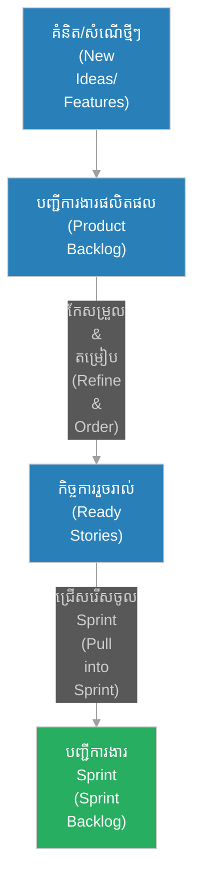

# បញ្ជីការងារផលិតផល (Product Backlog)

**អ្នកនិពន្ធ (Author):** ichamrong 
**កាលបរិច្ឆេទ (Date):** 2026-05-29 
**ស្លាក (Tags):** #agile #scrum #product-backlog #requirements #prioritization 
**ប្រភេទ (Category):** Management & Leadership 
**រយៈពេលអាន (Read Time):** ~៥ នាទី (~5 min) 

---

## 📌 មាតិកា (Table of Contents)
- [១. តើ​អ្វី​ទៅ​ជា Product Backlog? (What is Product Backlog?)](#1)
- [២. ម្​ចាស់​កម្មសិទ្ធិ និង​អ្នក​គ្រប់​គ្រង (Ownership)](#2)
- [៣. របៀបរៀបចំលំដាប់អាទិភាព (Prioritization Rules)](#3)
- [៤. វដ្តជីវិត​នៃ​កិច្ច​ការ​ងារ​ក្នុង Backlog (Backlog Lifecycle)](#4)

---

## ១. តើ​អ្វី​ទៅ​ជា Product Backlog? (What is Product Backlog?)

**បញ្ជីការងារផលិតផល (Product Backlog)** គឺជា​បញ្ជីរៀបរៀបរយ​នៃ​អ្វី ៗ គ្រប់​យ៉ាង​ដែល​ត្រូវ​ការ​ដើម្បី​អភិវឌ្ឍ​ផលិតផល (រួម​មាន មុខងារ​ថ្មី ៗ មុខងារ​កែលម្អ ការ​ជួសជុលកំហុស​កូដ - Bug fixes និង​កិច្ច​ការ​បច្ចេកទេសផ្សេងទៀត)។ វា​ជា​ប្រភព​ព័ត៌មាន​តែ​មួយគត់ (Single Source of Truth) សម្រាប់​រាល់​តម្រូវ​ការ​ការ​ងារ​ទាំងអស់​របស់​ក្រុម។

Product Backlog មិន​មែន​ជា​បញ្ជីឋិតិវន្តរឹងកំព្រឹង​ឡើយ ប៉ុន្តែ​វា​ជា​ឯកសាររស់ (Living Document) ដែល​វិវត្តន៍ និង​ផ្លាស់ប្តូរ​ជា​និច្ច​តាម​ការ​ផ្លាស់ប្តូរ​របស់​ទីផ្សារ អតិថិជន និង​បច្ចេកវិទ្យា។

---

## ២. ម្​ចាស់​កម្មសិទ្ធិ និង​អ្នក​គ្រប់​គ្រង (Ownership)

ទោះបី​ជា​សមាជិក​ក្រុម​ទាំងអស់ និង​ភាគីពាក់ព័ន្ធ (Stakeholders) អាច​ចូលរួម​ចំណែកផ្ដល់គំនិត ឬ​សំណើក៏​ដោយ ក៏ **ម្ចាស់ផលិតផល (Product Owner - PO)** គឺជា​អ្នក​ទទួលខុស​ត្រូវ និង​មាន​សិទ្ធិអំណាចទាំងស្រុង​លើ Product Backlog។ PO សម្រេច​ថាតើ​ត្រូវ​បញ្ចូលកិច្ច​ការ​ណា មិន​បញ្ចូលកិច្ច​ការ​ណា និង​រៀបចំលំដាប់​ការ​ងារណា​ដែល​ត្រូវ​ធ្វើ​មុន និង​ក្រោយ​គេ។

---

## ៣. របៀបរៀបចំលំដាប់អាទិភាព (Prioritization Rules)

ការ​រៀបចំលំដាប់អាទិភាព​ក្នុង Product Backlog មិន​មែន​ធ្វើ​ឡើង​តាម​ការ​ស្​មាន​ឡើយ ប៉ុន្តែ​ផ្អែក​លើ​កត្តាស្នូល៖
* **តម្លៃអាជីវកម្ម (Business Value):** តើ​កិច្ច​ការ​នោះ​ផ្តល់ចំណូល កាត់បន្ថយ​ការ​ចំណាយ ឬ​បង្កើន​ការ​ពេញចិត្ត​របស់​អតិថិជនកម្រិតណា?
* **ហានិភ័យបច្ចេកទេស (Risk):** តើ​វា​ជា​ការ​សាកល្បងបច្ចេកវិទ្យា​ថ្មី​ដែល​ត្រូវ​ដឹង​មុន​ដើម្បី​ការ​ពារបរាជ័យធំ​ឬ​ទេ?
* **ភាពអាស្រ័យគ្នា (Dependencies):** តើ​មុខងារ A ត្រូវតែ​សាងសង់​មុន​មុខងារ B ឬ​ទេ?
* **សមត្ថភាព​របស់​ក្រុម (Effort):** សមាមាត្ររវាងតម្លៃ​ដែល​ទទួល​បាន និង​កម្លាំងពលកម្ម​ដែល​ត្រូវ​ប្រើប្រាស់ (Value vs Effort)។

---

## ៤. វដ្តជីវិត​នៃ​កិច្ច​ការ​ងារ​ក្នុង Backlog (Backlog Lifecycle)

លំហូរ​ការ​ងារ​ពី​គំនិតដំបូងរហូតដល់​ការ​ជ្រើសរើសយក​ទៅ​អភិវឌ្ឍ​ត្រូវ​បាន​បង្ហាញ​តាម​លំហូរ​ខាងក្រោម៖

កិច្ច​ការ​ងារ​ដែល​ស្ថិតនៅ​ខាងលើ​គេ​នៃ Product Backlog ត្រូវតែ​បំពេញ​តាម​លក្ខខណ្ឌ DoR ទាំងស្រុង​មុន​ពេល​វា​ត្រូវ​បាន​ជ្រើសរើសចូល​ទៅ​ក្នុង Sprint Backlog ក្នុង​អំឡុង​ពេល​ប្រជុំ Sprint Planning។
