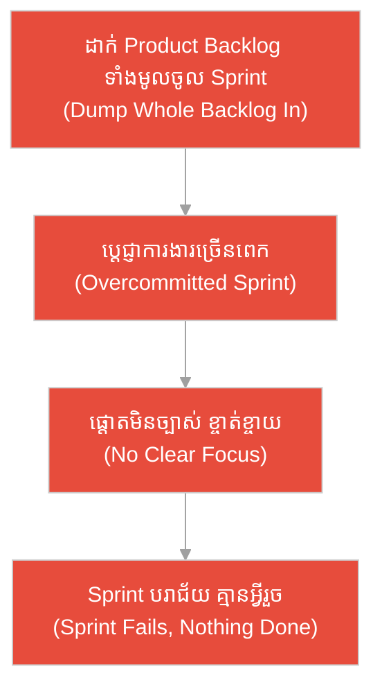
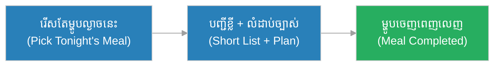
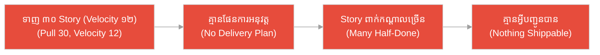
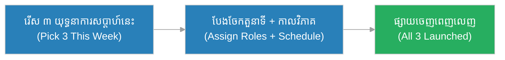
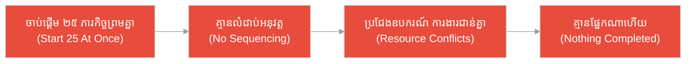
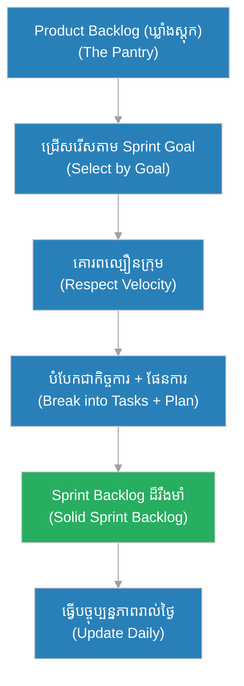

# បញ្ជីការងារ Sprint (Sprint Backlog)៖ ចុងភៅ និង​ការ​រៀបចំគ្រឿងផ្សំ​មុន​បើកម៉ាស៊ីន (The Chef's Mise en Place Before Service)

**អ្នកនិពន្ធ (Author):** ichamrong 
**កាលបរិច្ឆេទ (Date):** 2026-05-29 
**ស្លាក (Tags):** #agile #scrum #sprint-backlog #parable 
**ប្រភេទ (Category):** Management & Leadership 
**រយៈពេលអាន (Read Time):** ~១២ នាទី (~12 min) 

---

## 📌 មាតិកា (Table of Contents)
- [អន្ទាក់​នៃ​វិសាលភាព (The Scope Trap)](#0)
- [១. រឿងប្រៀបប្រដូច៖ ចុងភៅ និង​បញ្ជរគ្រឿងផ្សំ (The Parable: The Chef & The Prep Counter)](#1)
- [២. បញ្ហា៖ ការ​ច្រឡំ Sprint Backlog ជា Product Backlog (The Issue: Confusing the Two Backlogs)](#2)
- [៣. ឧទាហរណ៍​ជាក់ស្តែង​ក្នុង​ពិភពពិត (Real World Examples)](#3)
 - [ឧទាហរណ៍​ទី ១ — កម្រិតស្រាល (គ្រួសារ)៖ បញ្ជីទិញទំនិញ​សម្រាប់​ល្ងាច​នេះ (The Tonight-Only Grocery List)](#3-1)
 - [ឧទាហរណ៍​ទី ២ — កម្រិតមធ្យម (បច្ចេកទេស)៖ ការ​ប្តេជ្ញា​មុខងារច្រើនពេក (The Overcommitted Sprint)](#3-2)
 - [ឧទាហរណ៍​ទី ៣ — កម្រិតមធ្យម (ធុរកិច្ច)៖ ផែន​ការ​យុទ្ធនា​ការ​ទីផ្សារ​ប្រចាំសប្តាហ៍ (The Weekly Campaign Slice)](#3-3)
 - [ឧទាហរណ៍​ទី ៤ — កម្រិតមធ្យម (គ្រប់​គ្រង)៖ ការ​ដាក់បន្ទុក​គម្រោង​សំណង់ (The Construction Crew Load)](#3-4)
 - [ឧទាហរណ៍​ទី ៥ — កម្រិតធ្ងន់ (ហោះហើរ)៖ បញ្ជី​ត្រួតពិនិត្យ​មុន​ហោះហើរ (The Pre-Flight Checklist)](#3-5)
- [៤. ការ​សន្ទនាបែបសាកសួរ (Socratic Dialogue: The Whole Pantry vs. Tonight's Menu)](#4)
- [៥. ដំណោះស្រាយ៖ ការ​កសាង Sprint Backlog ដ៏រឹងមាំ (The Solution: Building a Solid Sprint Backlog)](#5)
- [សេចក្តីសន្និដ្ឋាន (Conclusion)](#6)
- [ឯកសារយោង (References)](#7)
- [Related Posts](#8)

---

## អន្ទាក់​នៃ​វិសាលភាព (The Scope Trap)

នៅ​ពេល​រៀបចំ​ការ​ងារ​សម្រាប់​វដ្ត (Sprint) យើង​តែ​ង​តែ​ធ្លាក់ចូល​អន្ទាក់​ផ្ទុយគ្នា​ពី​រ៖

* **អន្ទាក់​ដាក់អស់ (The Everything Trap):** «ដាក់​ការ​ងារ​ទាំងអស់​ដែល​យើង​ត្រូវ​ធ្វើ​ចូល​ក្នុង Sprint នេះ! Sprint Backlog គឺ​ដូចគ្នានឹង Product Backlog ទាំងមូលហ្នឹង!»
* **អន្ទាក់​គ្មាន​ផែន​ការ (The No-Plan Trap):** «យើងគ្រាន់​តែ​ជ្រើសរើស​ការ​ងារ ប៉ុន្តែ​មិន​បាច់រៀបចំផែន​ការអនុវត្ត​លម្អិតទេ ដល់​ពេល​ធ្វើ ទើបគិត!»

---

## ១. រឿងប្រៀបប្រដូច៖ ចុងភៅ និង​បញ្ជរគ្រឿងផ្សំ (The Parable: The Chef & The Prep Counter)

នៅក្នុង​ភោជនីយដ្ឋានដ៏ល្បីមួយ មាន​ចុងភៅជើង​ចាស់​ម្នាក់ឈ្មោះ **វណ្ណា (Vanna)** ដែល​គ្រប់​គ្រងផ្ទះបាយ។ មុន​ពេល​បើកម៉ាស៊ីនទទួលភ្ញៀវរៀង​រាល់​ល្ងាច គាត់​តែ​ង​តែ​ឈរនៅមុខបញ្ជរធំ ហើយចំណាយ​ពេល​រៀបចំ **mise en place** គឺ​ការ​ដាក់តម្រៀបនៅ​លើ​បញ្ជរ **តែ** គ្រឿងផ្សំ​សម្រាប់​មុខម្ហូប​នៅក្នុង​បញ្ជី​សម្រាប់​ល្ងាច​នេះ មិន​មែនអ្វី ៗ ទាំងអស់​ដែល​មាន​នៅក្នុង​ឃ្លាំងស្តុក​នោះ​ឡើយ។

នៅជិត ៗ គ្នា មាន​ឃ្លាំងស្តុក (Pantry) ដ៏ធំ ផ្ទុកគ្រឿងផ្សំរាប់រយមុខ — ស្ករ អំបិល ម្សៅ គ្រឿងទេស សាច់ បន្លែ — សម្រាប់​រាល់​មុខម្ហូប​ដែល​ភោជនីយដ្ឋានអាចចម្អិត​បាន។ វណ្ណាដឹងច្បាស់ថា ឃ្លាំងស្តុក​នោះ​មិន​មែន​ជា​បញ្ជរ​ធ្វើ​ម្ហូប​ឡើយ។ គាត់រើសយក​តែ​គ្រឿងផ្សំ​សម្រាប់​ល្ងាច​នេះ ហើយក៏ដាក់ផែន​ការ​ច្បាស់លាស់ថា គ្រឿងណា​ត្រូវ​ចិត​មុន គ្រឿងណា​ត្រូវ​ដាំ​ក្រោយ។ ល្ងាច​នោះ ម្ហូបចេញទាន់​ពេល ភ្ញៀវរីករាយ។

ផ្ទុយ​ទៅ​វិញ មាន​ចុងភៅ​ថ្មី​ម្នាក់នៅភោជនីយដ្ឋានម្ខាងទៀត ដែល​គិតថា ការ​រៀបចំ​ល្អ គឺ​ការ​យកអ្វី ៗ ទាំងអស់​ចេញ​ពី​ឃ្លាំងស្តុក។ គាត់ចាក់ផ្តិលគ្រឿងផ្សំទាំងមូល​នៃ​ឃ្លាំងស្តុក​មក​លើ​បញ្ជរ — រាប់រយមុខ លាយឡំគ្នា។ បញ្ជរពេញ ផ្លូវដើរ​ស្ទះ គាត់រកគ្រឿងផ្សំ​សម្រាប់​មុខម្ហូបណាមួយក៏លែងឃើញ។ ល្ងាច​នោះ គ្មាន​ចានណាមួយចេញទាន់​ពេល​ឡើយ ភ្ញៀវក្រោកចេញអស់ ដោយ​ឃ្លាន។

---

## ២. បញ្ហា៖ ការ​ច្រឡំ Sprint Backlog ជា Product Backlog (The Issue: Confusing the Two Backlogs)

នៅក្នុង Scrum, **បញ្ជីការងារ Sprint (Sprint Backlog)** គឺ **មិន​មែន** ជា Product Backlog ទាំងមូល​ឡើយ។ វា​គឺជា **ចំណិត (slice)** តូចមួយ ដែល​ក្រុ​មក​ារងារ​បាន​ជ្រើសរើស និង​ប្តេជ្ញា​ចិត្ត​ដើម្បី​សម្រេច​ក្នុង Sprint **នេះ** តែ​ប៉ុណ្ណោះ បូករួមនឹង **ផែន​ការ** អនុវត្ត (តួនាទី កិច្ច​ការ លំដាប់) ដើម្បី​បញ្ជូនវាជូន។ Product Backlog គឺ​ឃ្លាំងស្តុកទាំងមូល — រាល់​មុខងារ ដែល​អាច​ត្រូវ​ធ្វើ​នៅថ្ងៃណាមួយ។

ការ​ច្រឡំទាំង​ពី​រ​នេះ នាំឱ្យក្រុ​មក​ារងារ​ប្តេជ្ញា​ការ​ងារច្រើនពេក (Overcommit) ផ្តោត​មិន​ច្បាស់ និង​បញ្ចប់ Sprint ដោយ​គ្មាន​អ្វីរួច​រាល់​ជា​ស្ថាពរ​ឡើយ។

---

## ៣. ឧទាហរណ៍​ជាក់ស្តែង​ក្នុង​ពិភពពិត

សូមពិនិត្យមើលរបៀប​ដែល​ការ​ជ្រើសរើស «ចំណិត​សម្រាប់​ឥឡូវ​នេះ» ជះឥទ្ធិពលដល់កម្រិតជីវិត និង​ការ​ងារទាំង ៥ ខាងក្រោម៖

---

### ឧទាហរណ៍​ទី ១ — កម្រិតស្រាល (គ្រួសារ)៖ បញ្ជីទិញទំនិញ​សម្រាប់​ល្ងាច​នេះ (The Tonight-Only Grocery List)

* **ស្ថានភាព៖** គ្រួសារមួយ​ចង់​ចម្អិនម្ហូបពិសេស​សម្រាប់​ល្ងាច​នេះ។ ជំនួសឱ្យ​ការ​ទិញគ្រឿងផ្សំ​សម្រាប់​រាល់​ម្ហូបពេញខែ ម្តាយ​សរសេរ​បញ្ជីខ្លី ៗ ត្រឹម​តែ​គ្រឿងផ្សំ​សម្រាប់​ម្ហូបល្ងាច​នេះ បូកនឹងលំដាប់ចម្អិន។
* **លទ្ធផល៖** ការ​ទិញ​លឿន ថវិកា​មិន​លើ​ស ហើយម្ហូបល្ងាច​នេះ​ចេញពេញលេញ និង​ទាន់​ពេល​វេលា។

---

### ឧទាហរណ៍​ទី ២ — កម្រិតមធ្យម (បច្ចេកទេស)៖ ការ​ប្តេជ្ញា​មុខងារច្រើនពេក (The Overcommitted Sprint)

* **ស្ថានភាព៖** ក្រុមអភិវឌ្ឍន៍​មួយ ដោយ​ការ​សម្ពាធ​ពី​ម្ចាស់ផលិតផល បាន​ទាញ ៣០ Story ពី Product Backlog ចូល​ក្នុង Sprint ២ សប្តាហ៍ ខណៈ​ដែល​ល្បឿនធម្មតា​របស់​ពួកគេ (Velocity) គ្រាន់​តែ ១២ Story ប៉ុណ្ណោះ។ ពួកគេ​មិន​បាន​រៀបចំផែន​ការអនុវត្ត​លម្អិត​ឡើយ។
* **លទ្ធផល៖** ចុងបញ្ចប់ Sprint មាន Story តែ ៨ ប៉ុណ្ណោះ​ដែល​រួច​ជា​ស្ថាពរ ឯ Story ដែល​នៅសល់ ត្រូវ​ធ្វើ​ពាក់កណ្តាល ហើយ​គ្មាន​មួយណា​ដែល​អាចបញ្ជូនជូន​បាន​ទេ។

---

### ឧទាហរណ៍​ទី ៣ — កម្រិតមធ្យម (ធុរកិច្ច)៖ ផែន​ការ​យុទ្ធនា​ការ​ទីផ្សារ​ប្រចាំសប្តាហ៍ (The Weekly Campaign Slice)

* **ស្ថានភាព៖** ក្រុមទីផ្សារ​មាន «ឃ្លាំងគំនិត» យុទ្ធនា​ការ​រាប់សិប​សម្រាប់​ឆ្នាំទាំងមូល។ សម្រាប់​សប្តាហ៍​នេះ ពួកគេជ្រើសរើស​តែ ៣ យុទ្ធនា​ការ​ដែល​ត្រូវ​ផ្សាយ បូកនឹងផែន​ការ៖ នរណា​សរសេរ​អត្ថបទ នរណា​ធ្វើ​រូបភាព និង​ពេល​ណាផ្សាយ។
* **លទ្ធផល៖** យុទ្ធនា​ការ​ទាំង ៣ ផ្សាយចេញពេញលេញ ទាន់​ពេល​វេលា ហើយក្រុម​មិន​ខ្ចាត់ខ្ចាយ​ទៅ​រកគំនិតផ្សេង ៗ ដែល​មិន​ទាន់ដល់វេន​ឡើយ។

---

### ឧទាហរណ៍​ទី ៤ — កម្រិតមធ្យម (គ្រប់​គ្រង)៖ ការ​ដាក់បន្ទុក​គម្រោង​សំណង់ (The Construction Crew Load)

* **ស្ថានភាព៖** អ្នក​គ្រប់​គ្រងសំណង់ម្នាក់ ដោយ​ចង់​បង្ហាញ​វឌ្ឍនភាព​លឿន បាន​បញ្​ជា​ឱ្យក្រុ​មក​ម្​មក​រ ១០ នាក់ ចាប់ផ្​តើ​មក​ារងារ ២៥ ភារកិច្ចព្រម ៗ គ្នា​ក្នុង​សប្តាហ៍​តែ​មួយ ដោយ​មិន​កំណត់ផែន​ការ​ច្បាស់លាស់ថា មួយណា​មុន​មួយណា​ក្រោយ។
* **លទ្ធផល៖** កម្​មក​រប្រជែងគ្នាប្រើឧបករណ៍ ការ​ងារ​ជា​ន់គ្នា ហើយចុងសប្តាហ៍​គ្មាន​ផ្នែកណាមួយ​ដែល​ហើយ​ជា​ស្ថាពរ — គ្រឹះក៏​មិន​ទាន់រឹង ជញ្​ជា​ំងក៏​មិន​ទាន់ឡើង។

---

### ឧទាហរណ៍​ទី ៥ — កម្រិតធ្ងន់ (ហោះហើរ)៖ បញ្ជី​ត្រួតពិនិត្យ​មុន​ហោះហើរ (The Pre-Flight Checklist)

* **ស្ថានភាព៖** អ្នក​បើកយន្តហោះ​មិន​ព្យាយាម​ត្រួតពិនិត្យ​គ្រប់​ប្រព័ន្ធ​ដែល​អាច​មាន​នៅក្នុង​សៀវភៅណែនាំទាំងមូល​ឡើយ។ មុន​ពេល​ហោះ ពួកគេ​ធ្វើ​តាម​តែ **បញ្ជី​ត្រួតពិនិត្យ​មុន​ហោះហើរ** ដែល​ជា​ចំណិត​ពិតប្រាកដ៖ ឥន្ធនៈ ហ្វ្រាំង ប្រព័ន្ធ​ទំនាក់ទំនង — តាម​លំដាប់ច្បាស់លាស់។
* **លទ្ធផល៖** គ្រប់​ការ​ងារសំខាន់​ត្រូវ​បាន​ពិនិត្យ និង​បញ្ចប់ ហើយជើងហោះហើរចេញដំណើរ​ដោយ​សុវត្ថិភាព ដោយ​គ្មាន​ការ​ភ្លេចជំហានណាមួយ។

---

## ៤. ការ​សន្ទនាបែបសាកសួរ (Socratic Dialogue: The Whole Pantry vs. Tonight's Menu)

**សិស្ស (អ្នក​អភិវឌ្ឍ​ន៍)៖** លោកគ្រូ! តើ Sprint Backlog គ្រាន់​តែ​ជា Product Backlog ដែល​យើងថតចម្លង​មក​មែនទេ? ខ្ញុំគិតថា ការ​ងារ​ទាំងអស់​ដែល​យើង​ត្រូវ​ធ្វើ គឺ Sprint Backlog ហ្នឹង។

**គ្រូ (Scrum Master ជើង​ចាស់)៖** សួរបន្តិច — តើ​ចុងភៅយកគ្រឿងផ្សំ​ទាំងអស់​ក្នុង​ឃ្លាំងស្តុក​មក​ដាក់​លើ​បញ្ជរ​មុន​ធ្វើ​ម្ហូប​ឬ?

**សិស្ស៖** អត់ទេ គាត់យក​តែ​គ្រឿងផ្សំ​សម្រាប់​ម្ហូប​ដែល​ត្រូវ​ធ្វើ​ល្ងាច​នេះ។

**គ្រូ៖** ត្រឹម​ត្រូវ។ ដូច្​នេះ Product Backlog គឺ​ឃ្លាំងស្តុក — អ្វី ៗ ទាំងអស់​ដែល​អាច​ត្រូវ​ធ្វើ​នៅថ្ងៃណាមួយ។ ចុះ Sprint Backlog គួរ​ជា​អ្វី?

**សិស្ស៖** គឺ​គ្រាន់​តែ​ការ​ងារ​ដែល​យើងជ្រើសរើស​សម្រាប់ Sprint នេះ​មែនទេ?

**គ្រូ៖** ជិតហើយ ប៉ុន្តែ​ខ្វះមួយ។ តើ​ចុងភៅគ្រាន់​តែ​ដាក់គ្រឿងផ្សំចោល រួច​ទៅ ឬ​គាត់ដឹងថា អ្វី​ត្រូវ​ចិត​មុន អ្វី​ត្រូវ​ដាំ​ក្រោយ?

**សិស្ស៖** គាត់​មាន​លំដាប់ និង​ផែន​ការ​ច្បាស់លាស់។

**គ្រូ៖** នេះ​ហើយ! Sprint Backlog = **ចំណិត​ការ​ងារ (selected items) + ផែន​ការអនុវត្ត (plan to deliver)**។ វា​មិន​មែនបញ្ជីប្រាថ្នាទាំងមូល​ឡើយ — វា​ជា​ការ​ប្តេជ្ញា​ចិត្ត​ពិតប្រាកដ ដែល​ក្រុមជឿថា ខ្លួនអាចបញ្ចប់​បាន ហើយដឹងច្បាស់ថា នឹងបញ្ចប់វា​ដោយ​របៀបណា។

---

## ៥. ដំណោះស្រាយ៖ ការ​កសាង Sprint Backlog ដ៏រឹងមាំ (The Solution: Building a Solid Sprint Backlog)

ដើម្បី​ឱ្យ Sprint Backlog ផ្តល់តម្លៃ និង​ពិតប្រាកដ ក្រុ​មក​ារងារ​ត្រូវ​អនុវត្តគោល​ការ​ណ៍ដូច​ខាងក្រោម៖

1. **ចាប់ផ្​តើ​ម​ពី Sprint Goal (Start from the Sprint Goal):** ជ្រើសរើស​តែ Story ដែល​ជួយសម្រេច Sprint Goal — មិន​មែនទាញអ្វី ៗ ទាំងអស់​ឡើយ។
2. **គោរពល្បឿន (Respect Velocity):** ប្តេជ្ញា​ការ​ងារត្រឹ​មក​ម្រិត​ដែល​ល្បឿន​ជាក់ស្តែង​របស់​ក្រុមអាចទ្រាំ​បាន — កុំ Overcommit។
3. **បន្ថែមផែន​ការអនុវត្ត (Add the Delivery Plan):** សម្រាប់ Story នីមួយ ៗ បំបែក​ជា​កិច្ច​ការ (Tasks) កំណត់តួនាទី និង​លំដាប់ — នេះ​ជា «mise en place» របស់​ក្រុម។
4. **ជា​កម្មសិទ្ធិ​ក្រុមអភិវឌ្ឍន៍ (Owned by Developers):** Sprint Backlog ជា​របស់​ក្រុមអភិវឌ្ឍន៍ ហើយ​ត្រូវ​ធ្វើ​បច្ចុប្បន្នភាព​រាល់ថ្ងៃ ខណៈ Sprint ដំណើរ​ការ។

---

## 🐇 ធ្លាក់ចូល​ក្នុង​រន្ធទន្សាយ (Enter the Rabbit Hole)

ដើម្បី​យល់ដឹងកាន់​តែ​ស៊ីជម្រៅអំ​ពី​ការ​គ្រប់​គ្រង​បញ្ជីការងារ និង​ផែន​ការ​វដ្ត សូមស្វែងយល់បន្ថែម៖

* 🚀 **[បញ្ជីការងារផលិតផល (Product Backlog) ➔](./product-backlog.md)**
* 🚀 **[ការ​រៀបចំផែន​ការ​វដ្ត​ការ​ងារ (Sprint Planning) ➔](../ceremonies/sprint-planning.md)**
* 🚀 **[ពិន្ទុរឿង (Story Points) ➔](../metrics/story-points.md)**

---

## សេចក្តីសន្និដ្ឋាន (Conclusion)

> **«Sprint Backlog មិន​មែន​ជា​ឃ្លាំងស្តុកទាំងមូល​ឡើយ ប៉ុន្តែ​វា​ជា​បញ្ជរ mise en place របស់​ក្រុម — តែ​គ្រឿងផ្សំ​សម្រាប់​ល្ងាច​នេះ បូកនឹងផែន​ការ​ចម្អិន។»**

ការ​កសាង Sprint Backlog ដ៏ត្រឹម​ត្រូវ ជួយឱ្យក្រុ​មក​ារងារផ្តោតច្បាស់ ប្តេជ្ញា​ការ​ងារសមរម្យ ហើយបញ្ចប់ Sprint ដោយ​ផ្តល់នូវ​ការ​ងាររួច​ជា​ស្ថាពរ មិន​មែន​ជា​គំនរ​ការ​ងារពាក់កណ្តាល​ឡើយ។

---

## ឯកសារយោង (References)

* **Ken Schwaber & Jeff Sutherland** — *The Scrum Guide* (2020).
* **Kenneth S. Rubin** — *Essential Scrum: A Practical Guide to the Most Popular Agile Process* (2012).
* **Roman Pichler** — *Agile Product Management with Scrum* (2010).

---

## Related Posts

* [បញ្ជីការងារផលិតផល (Product Backlog)](./product-backlog.md) — ឃ្លាំងស្តុកទាំងមូល​ដែល Sprint Backlog ត្រូវ​រើសចំណិតយក​មក។
* [ការ​រៀបចំផែន​ការ​វដ្ត​ការ​ងារ (Sprint Planning)](../ceremonies/sprint-planning.md) — ពិធីការ​ដែល​ក្រុ​មក​សាង Sprint Backlog ឡើង។
* [ពិន្ទុរឿង (Story Points)](../metrics/story-points.md) — របៀបវាស់ល្បឿន ដើម្បី​កុំ Overcommit ក្នុង Sprint Backlog។
