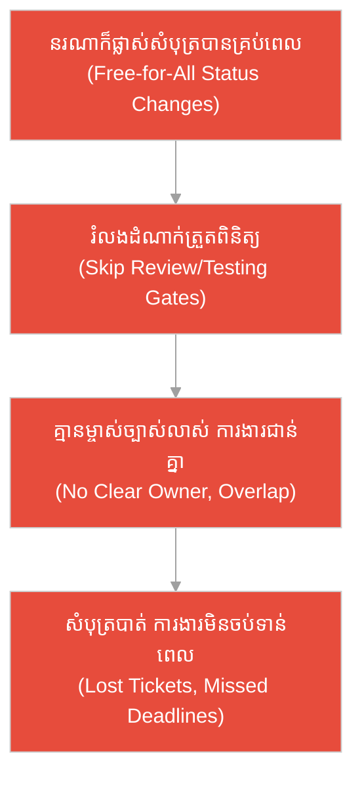
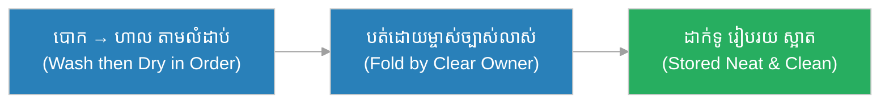
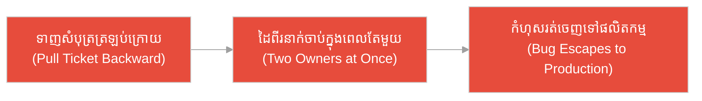
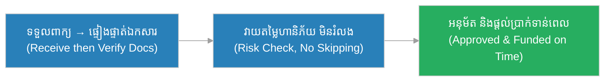
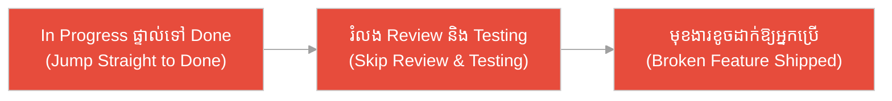
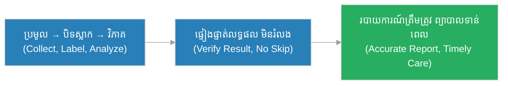
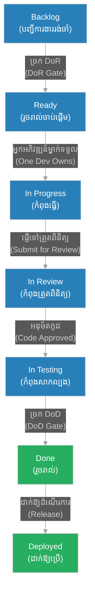

# វដ្តជីវិតសំបុត្រ (Ticket Lifecycle)៖ កញ្ចប់សំបុត្រឆ្លងកាត់រោងបែងចែកប្រៃសណីយ៍ (The Parcel Through the Postal Sorting House)

**អ្នកនិពន្ធ (Author):** ichamrong 
**កាលបរិច្ឆេទ (Date):** 2026-05-29 
**ស្លាក (Tags):** #agile #scrum #ticket-lifecycle #parable 
**ប្រភេទ (Category):** Management & Leadership 
**រយៈពេលអាន (Read Time):** ~១២ នាទី (~12 min) 

---

## 📌 មាតិកា (Table of Contents)
- [អន្ទាក់​នៃ​ស្ថានភាពសំបុត្រ (The Ticket Status Trap)](#0)
- [១. រឿងប្រៀបប្រដូច៖ កញ្ចប់សំបុត្រ និង​រោងបែងចែកប្រៃសណីយ៍ (The Parable: The Parcel & The Sorting House)](#1)
- [២. បញ្ហា៖ ការ​គិតថា «នរណាក៏ផ្លាស់ស្ថានភាពសំបុត្រ​បាន​គ្រប់​ពេល» (The Issue: "Anyone Can Move a Ticket Anytime")](#2)
- [៣. ឧទាហរណ៍​ជាក់ស្តែង​ក្នុង​ពិភពពិត (Real World Examples)](#3)
 - [ឧទាហរណ៍​ទី ១ — កម្រិតស្រាល (គ្រួសារ)៖ ការ​បោកគក់សម្លៀកបំពាក់​តាម​ដំណាក់ (The Laundry Workflow)](#3-1)
 - [ឧទាហរណ៍​ទី ២ — កម្រិតមធ្យម (បច្ចេកទេស)៖ សំបុត្រកំហុស​ដែល​គេទាញត្រឡប់​ក្រោយ (The Backward-Pulled Bug Ticket)](#3-2)
 - [ឧទាហរណ៍​ទី ៣ — កម្រិតមធ្យម (ធុរកិច្ច)៖ ការ​អនុម័តប្រាក់កម្ចី​តាម​ដំណាក់ (The Loan Approval Pipeline)](#3-3)
 - [ឧទាហរណ៍​ទី ៤ — កម្រិតមធ្យម (គ្រប់​គ្រង)៖ ការ«រំលង»ដំណាក់​ត្រួតពិនិត្យ (The Skipped Review Gate)](#3-4)
 - [ឧទាហរណ៍​ទី ៥ — កម្រិតធ្ងន់ (សង្គ្រោះបន្ទាន់)៖ សំណុំឈាមនៅមន្ទីរពិសោធន៍ (The Blood Sample Chain)](#3-5)
- [៤. ការ​សន្ទនាបែបសាកសួរ (Socratic Dialogue: Status as Chat vs. State Machine)](#4)
- [៥. ដំណោះស្រាយ៖ សំបុត្រ​ជា​ម៉ាស៊ីនស្ថានភាព ម្​ចាស់​ម្នាក់​ក្នុង​មួយដំណាក់ (The Solution: The Ticket as a State Machine)](#5)
- [សេចក្តីសន្និដ្ឋាន (Conclusion)](#6)
- [ឯកសារយោង (References)](#7)
- [Related Posts](#8)

---

## អន្ទាក់​នៃ​ស្ថានភាពសំបុត្រ (The Ticket Status Trap)

នៅក្នុង​ការ​គ្រប់​គ្រងលំហូរ​ការ​ងារ យើង​តែ​ង​តែ​ជួបប្រទះនូវភាពផ្ទុយគ្នា​នៃ​របៀបប្រើស្ថានភាពសំបុត្រ៖

* **អន្ទាក់​ច្របូកច្របល់ (The Free-for-All Trap):** «នរណាក៏ផ្លាស់សំបុត្រ​ទៅ​ស្ថានភាពណាក៏​បាន គ្រប់​ពេល​វេលា — បើខ្ញុំ​ចង់​ផ្លាស់​ពី To Do ទៅ Done ផ្ទាល់ ក៏​បាន​ដែរ!»
* **អន្ទាក់​ស្ថានភាព​ជា​ការ​ជជែក (The Status-as-Chat Trap):** «ស្ថានភាពសំបុត្រគ្រាន់​តែ​ជា​ប្រអប់សារ​សម្រាប់​ប្រាប់គ្នាថាខ្ញុំកំពុង​ធ្វើ​អ្វី — វា​គ្មាន​ច្បាប់ ឬ​ម្​ចាស់​ច្បាស់លាស់​ឡើយ!»

---

## ១. រឿងប្រៀបប្រដូច៖ កញ្ចប់សំបុត្រ និង​រោងបែងចែកប្រៃសណីយ៍ (The Parable: The Parcel & The Sorting House)

កាល​ពី​ព្រេងនាយ មាន​រោងបែងចែកប្រៃសណីយ៍ដ៏ធំមួយ ដែល​កញ្ចប់សំបុត្ររាប់ពាន់​ត្រូវ​ឆ្លងកាត់​ជា​រៀង​រាល់ថ្ងៃ។ រោង​នេះ​មាន​ស្ថានីយ៍​ជា​បន្តបន្ទាប់៖ ស្ថានីយ៍ទទួល ស្ថានីយ៍ថ្លឹង ស្ថានីយ៍បិទ​ស្លាក ស្ថានីយ៍​ត្រួតពិនិត្យ និង​ស្ថានីយ៍ផ្ញើចេញ។

នៅរោងមួយ មេ​ការ​ម្នាក់ឈ្មោះ **វិសាល (Visal)** បាន​ដាក់ច្បាប់ច្បាស់លាស់៖ កញ្ចប់​នីមួយ ៗ ឆ្លងកាត់ស្ថានីយ៍ម្តងមួយ​តាម​លំដាប់ ហើយ **នៅស្ថានីយ៍​នីមួយ ៗ មាន​អ្នក​ទទួលខុស​ត្រូវ​ត្រឹម​តែ​ម្នាក់** ប៉ុណ្ណោះ។ កញ្ចប់​មិន​អាចលោតរំលងស្ថានីយ៍ ឬ​ត្រូវ​ដៃ​ពី​រនាក់ចាប់​ក្នុង​ពេល​តែ​មួយ​ឡើយ។ ពេល​អ្នក​ថ្លឹង​ធ្វើ​ការ​រួច គាត់ប្រគល់​ទៅ​អ្នក​បិទ​ស្លាក ហើយទើប​អ្នក​នោះ​មាន​សិទ្ធិចាប់កញ្ចប់។ លំហូរ​នេះ​ធ្វើ​ឱ្យ​គ្រប់​កញ្ចប់​ត្រូវ​ដឹងថានៅទីណា អ្នក​ណាទទួលខុស​ត្រូវ និង​ផ្ញើចេញទាន់​ពេល​គ្រប់ ៗ ។

ផ្ទុយ​ទៅ​វិញ មាន​រោងបែងចែកមួយទៀត​ដែល​គ្មាន​ច្បាប់ច្បាស់លាស់​ឡើយ។ បុគ្គលិក​គ្រប់​គ្នាចាប់កញ្ចប់ណាមួយ​តាម​ចិត្តនឹកឃើញ — អ្នក​ខ្លះទាញកញ្ចប់ត្រឡប់​ក្រោយ​ទៅ​ស្ថានីយ៍​ចាស់​វិញ អ្នក​ខ្លះលោតរំលងស្ថានីយ៍​ត្រួតពិនិត្យ ហើយកញ្ចប់ដូចគ្នា​ត្រូវ​ដៃ​ពី​រនាក់ទាញចុះឡើង។ លទ្ធផល៖ កញ្ចប់​ជា​ច្រើនបាត់ កញ្ចប់ខ្លះ​ត្រូវ​ផ្ញើ​ទៅ​ខុសទិសត្រឡប់​ក្រោយ ហើយ​គ្មាន​កញ្ចប់ណាមួយផ្ញើចេញទាន់​ពេល​ឡើយ។ អតិថិជនត្អូញត្អែរ ហើយរោង​នោះ​ក៏​ត្រូវ​បិទទ្វារ។

---

## ២. បញ្ហា៖ ការ​គិតថា «នរណាក៏ផ្លាស់ស្ថានភាពសំបុត្រ​បាន​គ្រប់​ពេល» (The Issue: "Anyone Can Move a Ticket Anytime")

នៅក្នុង​លំហូរ​ការ​ងារ Agile, **វដ្តជីវិតសំបុត្រ (Ticket Lifecycle)** គឺជា​ដំណើរ​ការ​ដែល​សំបុត្រ (Ticket/Issue) ឆ្លងកាត់ស្ថានភាព​ជា​បន្តបន្ទាប់ ដូចជា Backlog → Ready → In Progress → In Review → In Testing → Done → Deployed។ វា​គឺជា **ម៉ាស៊ីនស្ថានភាព (State Machine)** ដែល​មាន **ម្​ចាស់​ត្រឹម​តែ​ម្នាក់​ក្នុង​មួយដំណាក់ (One Owner per State)** ហើយ **ផ្លាស់​ទៅ​មុខ​តាម​ច្រក​ដែល​កំណត់ (Forward through Defined Gates)**។

ការ​យល់ច្រឡំទូ​ទៅ​គឺ៖ «នរណាក៏ផ្លាស់សំបុត្រ​ទៅ​ស្ថានភាពណាក៏​បាន​គ្រប់​ពេល» ឬ «ស្ថានភាពគ្រាន់​តែ​ជា​ឧបករណ៍ជជែក» — នេះ **ខុស**។ ប្រសិនបើ​គ្មាន​ច្បាប់ លំហូរ​ការ​ងារនឹងច្របូកច្របល់ សំបុត្រ​ត្រូវ​ទាញត្រឡប់​ក្រោយ លោតរំលងដំណាក់​ត្រួតពិនិត្យ និង​គ្មាន​ម្​ចាស់​ច្បាស់លាស់ — ដូចរោងបែងចែកប្រៃសណីយ៍​ដែល​គ្មាន​របៀប។

---

## ៣. ឧទាហរណ៍​ជាក់ស្តែង​ក្នុង​ពិភពពិត

សូមពិនិត្យមើលរបៀប​ដែល​គោល​ការ​ណ៍ «សំបុត្រ​ជា​ម៉ាស៊ីនស្ថានភាព» ជះឥទ្ធិពលដល់កម្រិតជីវិត និង​ការ​ងារទាំង ៥ ខាងក្រោម៖

---

### ឧទាហរណ៍​ទី ១ — កម្រិតស្រាល (គ្រួសារ)៖ ការ​បោកគក់សម្លៀកបំពាក់​តាម​ដំណាក់ (The Laundry Workflow)

* **ស្ថានភាព៖** គ្រួសារមួយរៀបចំ​ការ​បោកគក់សម្លៀកបំពាក់​ជា​ដំណាក់ច្បាស់លាស់៖ បោក → ហាល → បត់ → ដាក់ទូ។ ម្ដាយទទួលខុស​ត្រូវ​ដំណាក់បត់ និង​គ្មាន​នរណាយកសម្លៀកបំពាក់សើម ៗ ទៅ​ដាក់ទូផ្ទាល់​ឡើយ។
* **លទ្ធផល៖** សម្លៀកបំពាក់ស្អាត ស្ងួត និង​រៀបរយ ដោយ​គ្មាន​ការ​ច្រឡំ ឬ​ដាក់ខោអាវសើមចូលទូ ព្រោះ​រាល់​ដំណាក់​មាន​ម្​ចាស់ និង​លំដាប់ច្បាស់លាស់។

---

### ឧទាហរណ៍​ទី ២ — កម្រិតមធ្យម (បច្ចេកទេស)៖ សំបុត្រកំហុស​ដែល​គេទាញត្រឡប់​ក្រោយ (The Backward-Pulled Bug Ticket)

* **ស្ថានភាព៖** អ្នក​អភិវឌ្ឍ​ន៍ម្នាក់ឃើញសំបុត្រកំហុសនៅ In Testing ហើយ​ដោយ​ចង់ «កែ​តិចតួច» គាត់ទាញវាត្រឡប់​ទៅ In Progress វិញ​ដោយ​មិន​ប្រាប់នរណា ស្រប​ពេល​អ្នក​ធ្វើ​តេស្តកំពុងសាកល្បងវាដ​ដែល។ សំបុត្រ​ត្រូវ​ដៃ​ពី​រនាក់ចាប់​ក្នុង​ពេល​តែ​មួយ។
* **លទ្ធផល៖** ការ​ផ្លាស់ប្ដូរ​ថ្មី​លុប​ការ​ងារ​របស់​អ្នក​ធ្វើ​តេស្ត លទ្ធផលតេស្តក្លាយ​ជា​មិន​ត្រឹម​ត្រូវ ហើយកំហុសដ​ដែល​ត្រូវ​រត់ចេញ​ទៅ​ផលិតកម្ម (Production) ដោយសារ​គ្មាន​ម្​ចាស់​ច្បាស់លាស់​ក្នុង​មួយដំណាក់។

---

### ឧទាហរណ៍​ទី ៣ — កម្រិតមធ្យម (ធុរកិច្ច)៖ ការ​អនុម័តប្រាក់កម្ចី​តាម​ដំណាក់ (The Loan Approval Pipeline)

* **ស្ថានភាព៖** ធនាគារមួយដំណើរ​ការ​ពាក្យសុំកម្ចី​តាម​ដំណាក់ច្បាស់លាស់៖ ទទួលពាក្យ → ផ្ទៀងផ្ទាត់ឯកសារ → វាយតម្លៃហានិភ័យ → អនុម័ត → ផ្ដល់ប្រាក់។ ដំណាក់​នីមួយ ៗ មាន​បុគ្គលិកទទួលខុស​ត្រូវ​ម្នាក់ ហើយពាក្យ​មិន​អាចលោតរំលង​ការ​វាយតម្លៃហានិភ័យ​ឡើយ។
* **លទ្ធផល៖** រាល់​ពាក្យកម្ចី​ត្រូវ​វាយតម្លៃត្រឹម​ត្រូវ ហានិភ័យ​បាន​គ្រប់​គ្រង និង​អតិថិជនទទួលចម្​លើ​យច្បាស់លាស់ទាន់​ពេល ដោយ​ដឹងថាពាក្យ​របស់​ខ្លួននៅដំណាក់ណា។

---

### ឧទាហរណ៍​ទី ៤ — កម្រិតមធ្យម (គ្រប់​គ្រង)៖ ការ«រំលង»ដំណាក់​ត្រួតពិនិត្យ (The Skipped Review Gate)

* **ស្ថានភាព៖** ដោយសារ​ពេល​វេលា​ជិតផុតកំណត់ អ្នក​គ្រប់​គ្រងបញ្​ជា​ឱ្យក្រុមផ្លាស់សំបុត្រ​ពី In Progress ផ្ទាល់​ទៅ Done ដោយ​លោតរំលងដំណាក់ In Review និង In Testing។ គ្មាន​នរណា​ត្រួតពិនិត្យ​កូដ ឬ​សាកល្បងមុខងារ​ឡើយ។
* **លទ្ធផល៖** មុខងារ​ដែល​គេគិតថា «Done» ពិត​ជា​មាន​កំហុសធ្ងន់ធ្ងរ ត្រូវ​ដាក់ឱ្យ​អ្នក​ប្រើ បណ្ដាលឱ្យ​ប្រព័ន្ធ​គាំង និង​បាត់បង់ទំនុកចិត្ត​របស់​អតិថិជន ព្រោះ​ច្រក​ត្រួតពិនិត្យ​ត្រូវ​បាន​រំលង។

---

### ឧទាហរណ៍​ទី ៥ — កម្រិតធ្ងន់ (សង្គ្រោះបន្ទាន់)៖ សំណុំឈាមនៅមន្ទីរពិសោធន៍ (The Blood Sample Chain)

* **ស្ថានភាព៖** នៅមន្ទីរពិសោធន៍ សំណុំឈាម​របស់​អ្នក​ជំងឺ​ត្រូវ​ឆ្លងកាត់ដំណាក់ច្បាស់លាស់៖ ប្រមូល → បិទ​ស្លាក → វិភាគ → ផ្ទៀងផ្ទាត់លទ្ធផល → ចេញរបាយ​ការ​ណ៍។ ដំណាក់​នីមួយ ៗ មាន​បុគ្គលិកវេជ្ជសាស្ត្រទទួលខុស​ត្រូវ​ម្នាក់ ហើយលទ្ធផល​មិន​អាចចេញ​ដោយ​រំលងដំណាក់ផ្ទៀងផ្ទាត់​ឡើយ។
* **លទ្ធផល៖** លទ្ធផលឈាមត្រឹម​ត្រូវ ១០០% គ្មាន​ការ​ច្រឡំសំណុំ ឬ​ផ្ទៀងផ្ទាត់ខុស ហើយវេជ្ជបណ្ឌិតអាចសម្រេចចិត្តព្យាបាល​អ្នក​ជំងឺ​បាន​ទាន់​ពេល ដោយ​ទុកចិត្ត​លើ​ខ្សែសង្វាក់​នៃ​ការ​ទទួលខុស​ត្រូវ។

---

## ៤. ការ​សន្ទនាបែបសាកសួរ (Socratic Dialogue: Status as Chat vs. State Machine)

**សិស្ស (អ្នក​អភិវឌ្ឍ​ន៍)៖** លោកគ្រូ! ខ្ញុំ​មិន​យល់ទេ ហេតុអ្វីយើង​ត្រូវ​មាន​ច្បាប់តឹងរ៉ឹង​ពី​ការ​ផ្លាស់ស្ថានភាពសំបុត្រ? ស្ថានភាពគ្រាន់​តែ​ជា​ការ​ប្រាប់គ្នាថាខ្ញុំកំពុង​ធ្វើ​អ្វី — ខ្ញុំ​ចង់​ផ្លាស់វា​ទៅ Done ផ្ទាល់ ក៏គួរ​បាន​ដែរ។

**គ្រូ (វិស្វករ​ជា​ន់ខ្ពស់)៖** អនុញ្ញាតឱ្យខ្ញុំសួរ៖ ប្រសិនបើនៅរោងបែងចែកប្រៃសណីយ៍ បុគ្គលិក​គ្រប់​គ្នាចាប់កញ្ចប់ណាក៏​បាន ហើយផ្ញើចេញ​ដោយ​រំលងស្ថានីយ៍​ត្រួតពិនិត្យ តើ​នឹង​មាន​អ្វីកើតឡើង?

**សិស្ស៖** ប្រហែល​ជា​កញ្ចប់នឹងបាត់ ឬ​ផ្ញើ​ទៅ​ខុសទីលំនៅលោកគ្រូ។

**គ្រូ៖** ត្រឹម​ត្រូវ។ ឥឡូវ ប្រសិនបើកញ្ចប់​តែ​មួយ​ត្រូវ​ដៃ​ពី​រនាក់ចាប់​ក្នុង​ពេល​តែ​មួយ — ម្នាក់បិទ​ស្លាក ម្នាក់ទៀតទាញវាត្រឡប់​ទៅ​ថ្លឹងវិញ — តើ​នរណា​ជា​អ្នក​ទទួលខុស​ត្រូវ?

**សិស្ស៖** គ្មាន​នរណាដឹងច្បាស់​ឡើយ​លោកគ្រូ ហើយ​ការ​ងារនឹងច្របូកច្របល់។

**គ្រូ៖** នេះ​ហើយ​ជា​ខ្លឹមសារ! សំបុត្រ​មិន​មែន​ជា​ប្រអប់ជជែក​ឡើយ វា​ជា **ម៉ាស៊ីនស្ថានភាព (State Machine)**។ នៅដំណាក់​នីមួយ ៗ ត្រូវ​មាន **ម្​ចាស់​ត្រឹម​តែ​ម្នាក់** ហើយសំបុត្រ **ផ្លាស់​ទៅ​មុខ** តាម​ច្រក​ដែល​កំណត់ មិន​លោតរំលង មិន​ទាញត្រឡប់​ក្រោយ​ដោយ​ឥតរបៀប។ តើ Done ដែល​រំលង​ការ​ត្រួតពិនិត្យ ពិត​ជា «Done» មែនទេ?

**សិស្ស៖** អត់ទេលោកគ្រូ វាគ្រាន់​តែ​មើល​ទៅ​ដូចចប់ ប៉ុន្តែ​គ្មាន​នរណាផ្ទៀងផ្ទាត់។

**គ្រូ៖** ត្រឹម​ត្រូវ។ រាល់​ការ​ផ្លាស់ស្ថានភាព​គឺជា «ច្រក» (Gate) ដែល​មាន​លក្ខខណ្ឌច្បាស់លាស់ ដូចជា Definition of Ready ដើម្បី​ចូល In Progress និង Definition of Done ដើម្បី​ទៅ Done។ ច្បាប់ទាំង​នេះ​មិន​មែន​ជា​ការ​រារាំង​ឡើយ វា​ជា​អ្វី​ដែល​ធ្វើ​ឱ្យលំហូរ​ការ​ងារអាចទុកចិត្ត​បាន។

---

## ៥. ដំណោះស្រាយ៖ សំបុត្រ​ជា​ម៉ាស៊ីនស្ថានភាព ម្​ចាស់​ម្នាក់​ក្នុង​មួយដំណាក់ (The Solution: The Ticket as a State Machine)

ដើម្បី​ធានាថាសំបុត្រ​នីមួយ ៗ ឆ្លងកាត់លំហូរ​ការ​ងារ​ដោយ​របៀបរៀបរយ ក្រុ​មក​ារងារ​ត្រូវ​ចាត់ទុកសំបុត្រ​ជា **ម៉ាស៊ីនស្ថានភាព** ដែល​ផ្លាស់​ទៅ​មុខ​តាម​ច្រក​ដែល​កំណត់៖

1. **ម្​ចាស់​ម្នាក់​ក្នុង​មួយដំណាក់ (One Owner per State):** នៅ​ពេល​ណាមួយ សំបុត្រ​ត្រូវ​មាន​អ្នក​ទទួលខុស​ត្រូវ​ត្រឹម​តែ​ម្នាក់ មិន​មែនដៃ​ពី​រនាក់ចាប់​ក្នុង​ពេល​តែ​មួយ​ឡើយ។
2. **ផ្លាស់​ទៅ​មុខ មិន​លោតរំលង (Move Forward, No Skipping):** សំបុត្រ​ត្រូវ​ឆ្លងកាត់​រាល់​ដំណាក់​តាម​លំដាប់ មិន​អាចលោត​ពី In Progress ផ្ទាល់​ទៅ Done ដោយ​រំលង Review និង Testing ឡើយ។
3. **ច្រក​មាន​លក្ខខណ្ឌច្បាស់លាស់ (Defined Gates):** ការ​ចូល Ready ត្រូវ​ឆ្លង​តាម Definition of Ready (DoR) និង​ការ​ទៅ Done ត្រូវ​ឆ្លង​តាម Definition of Done (DoD)។
4. **ស្ថានភាពឆ្លុះបញ្ចាំង​ការ​ពិត (Status Reflects Reality):** ស្ថានភាព​មិន​មែន​ជា​ការ​ជជែក​ឡើយ វា​ជា​ការ​ពិត​នៃ​កន្លែង​ដែល​ការ​ងារ​ពិត​ជា​ស្ថិតនៅ។

ខាងក្រោម​នេះ​ជា **ម៉ាស៊ីនស្ថានភាព​នៃ​វដ្តជីវិតសំបុត្រ** ដែល​បង្ហាញ​ពី​លំហូរ​ទៅ​មុខ ច្រក​នីមួយ ៗ និង​ម្​ចាស់​ម្នាក់​ក្នុង​មួយដំណាក់៖

---

## 🐇 ធ្លាក់ចូល​ក្នុង​រន្ធទន្សាយ (Enter the Rabbit Hole)

ដើម្បី​យល់ដឹងកាន់​តែ​ស៊ីជម្រៅអំ​ពី​ច្រក​នៃ​លំហូរ​ការ​ងារ និង​ការ​គ្រប់​គ្រងស្ថានភាពសំបុត្រ សូមស្វែងយល់បន្ថែម៖

* 🚀 **[និយមន័យនៃភាពរួចរាល់​ដើម្បី​ចាប់ផ្​តើ​ម (Definition of Ready) ➔](./dor.md)**
* 🚀 **[និយមន័យនៃភាពរួចរាល់ (Definition of Done) ➔](./dod.md)**
* 🚀 **[វដ្តជីវិត​នៃ​ការ​ដាក់ឱ្យដំណើរ​ការ (Deployment Lifecycle) ➔](../practices/deployment-lifecycle.md)**
* 🚀 **[ដែនកំណត់​ការ​ងារកំពុង​ធ្វើ (WIP Limits) ➔](../metrics/wip-limits.md)**

---

## សេចក្តីសន្និដ្ឋាន (Conclusion)

> **«សំបុត្រ​មិន​មែន​ជា​ប្រអប់ជជែក​ឡើយ វា​ជា​ម៉ាស៊ីនស្ថានភាព — ម្​ចាស់​ម្នាក់​ក្នុង​មួយដំណាក់ ផ្លាស់​ទៅ​មុខ​តាម​ច្រ​ក គ្មាន​ការ​លោតរំលង។»**

ការ​ចាត់ទុកសំបុត្រ​ជា​ម៉ាស៊ីនស្ថានភាពដ៏ត្រឹម​ត្រូវ ជួយឱ្យក្រុ​មក​ារងារដឹងច្បាស់ថា​ការ​ងារ​នីមួយ ៗ នៅទីណា អ្នក​ណាទទួលខុស​ត្រូវ និង​ធានាថា​គ្មាន​ការ​ងារណាមួយរត់ចេញ​ដោយ​រំលងច្រក​គុណភាព — ដូចរោងបែងចែកប្រៃសណីយ៍ដ៏​មាន​របៀប ដែល​គ្រប់​កញ្ចប់ផ្ញើ​ទៅ​ដល់ទីដៅទាន់​ពេល​គ្រប់ ៗ ។

---

## ឯកសារយោង (References)

* **Ken Schwaber & Jeff Sutherland** — *The Scrum Guide* (2020).
* **Kenneth S. Rubin** — *Essential Scrum: A Practical Guide to the Most Popular Agile Process* (2012).
* **Mike Cohn** — *Agile Estimating and Planning* (2005).

---

## Related Posts

* [និយមន័យនៃភាពរួចរាល់​ដើម្បី​ចាប់ផ្​តើ​ម (Definition of Ready)](./dor.md) — ច្រក​ដែល​សំបុត្រ​ត្រូវ​ឆ្លង​មុន​ចូលដំណាក់ In Progress។
* [និយមន័យនៃភាពរួចរាល់ (Definition of Done)](./dod.md) — ច្រក​គុណភាព​ចុងក្រោយ​មុន​សំបុត្រ​ទៅ Done។
* [ដែនកំណត់​ការ​ងារកំពុង​ធ្វើ (WIP Limits)](../metrics/wip-limits.md) — របៀបកំណត់ចំនួនសំបុត្រ​ក្នុង​មួយដំណាក់ ដើម្បី​ឱ្យលំហូរ​ការ​ងាររលូន។
