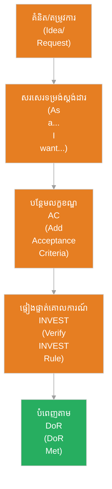

# រឿងរ៉ាវរបស់អ្នកប្រើប្រាស់ (User Story)

**អ្នកនិពន្ធ (Author):** ichamrong 
**កាលបរិច្ឆេទ (Date):** 2026-05-29 
**ស្លាក (Tags):** #agile #scrum #user-story #requirements #project-management 
**ប្រភេទ (Category):** Management & Leadership 
**រយៈពេលអាន (Read Time):** ~៥ នាទី (~5 min) 

---

## 📌 មាតិកា (Table of Contents)
- [១. តើ​អ្វី​ទៅ​ជា User Story? (What is User Story?)](#1)
- [២. ទម្រង់ស្តង់ដារ​នៃ User Story (Standard Format)](#2)
- [៣. របៀប​បង្កើត User Story ដែល​មាន​គុណភាព (INVEST Frame)](#3)
- [៤. លក្ខខណ្ឌ​នៃ​ការ​ទទួលយក​ការ​ងារ (Acceptance Criteria)](#4)

---

## ១. តើ​អ្វី​ទៅ​ជា User Story? (What is User Story?)

**រឿងរ៉ាវរបស់អ្នកប្រើប្រាស់ (User Story)** គឺជា​ការ​ពិពណ៌នាអំ​ពី​មុខងារ​កម្មវិធី​មួយ​យ៉ាង​សាមញ្ញ ខ្លី និង​ងាយយល់ ផ្អែក​លើ​ទស្សនៈ​របស់​អ្នកប្រើប្រាស់​ចុងក្រោយ (End-User)។ វា​ជា​វិធីសាស្ត្រស្នូល​ក្នុង​ការ​កត់ត្រាតម្រូវ​ការ (Requirements) ក្នុង​វិធីសាស្ត្រ Agile ដោយ​ផ្តោត​លើ «អ្នក​ណា» «ចង់​បាន​អ្វី» និង «ដើម្បី​អ្វី»។

User Story មិន​មែន​ជា​លក្ខណៈ​បច្ចេកទេសលម្អិត (Specification) ឡើយ ប៉ុន្តែ​វា​ជា​ចំណុចចាប់ផ្​តើ​ម​នៃ​ការ​ពិភាក្សា​ដើម្បី​យល់​ពី​តម្រូវ​ការ​អាជីវកម្ម​ពិតប្រាកដ។

---

## ២. ទម្រង់ស្តង់ដារ​នៃ User Story (Standard Format)

ដើម្បី​ធានា​ការ​ផ្តោត​លើ​តម្លៃ​អ្នកប្រើប្រាស់ គេ​សរសេរ​តាម​ទម្រង់ស្តង់ដារ៖

> **ក្នុង​នាម​ជា (As a)** `[ប្រភេទអ្នកប្រើប្រាស់ / Role]` 
> **ខ្ញុំ​ចង់​បាន (I want to)** `[សកម្មភាព / Action]` 
> **ដើម្បី (So that)** `[អត្ថប្រយោជន៍ / Benefit]` 

*ឧទាហរណ៍៖* 
> **ក្នុង​នាម​ជា** អតិថិជនទិញទំនិញ 
> **ខ្ញុំ​ចង់** បន្ថែ​មក​ាតធនាគារ​របស់​ខ្ញុំ​ទៅ​ក្នុង​គណនី 
> **ដើម្បី** ខ្ញុំអាចទូទាត់ប្រាក់​បាន​រហ័ស​នៅ​ពេល​បញ្​ជា​ទិញ​លើ​ក​ក្រោយ 

---

## ៣. របៀប​បង្កើត User Story ដែល​មាន​គុណភាព (INVEST Frame)

---

## ៤. លក្ខខណ្ឌ​នៃ​ការ​ទទួលយក​ការ​ងារ (Acceptance Criteria)

រាល់ User Story ត្រូវតែ​ភ្​ជា​ប់​មក​ជា​មួយនូវ **លក្ខខណ្ឌ​នៃ​ការ​ទទួលយក​ការ​ងារ (Acceptance Criteria - AC)**។ AC គឺជា​បញ្ជីលក្ខខណ្ឌបច្ចេកទេស និង​មុខងារ​ដែល​ត្រូវ​បំពេញ ដើម្បី​បញ្​ជា​ក់ថាកិច្ច​ការ​នោះ​ត្រូវ​បាន​បញ្ចប់​ពិតប្រាកដ (បំពេញ​តាម DoD)។

AC ជា​រឿយ ៗ ត្រូវ​បាន​សរសេរ​តាម​ទម្រង់ **Given-When-Then** (Behavior-Driven Development - BDD)៖
* **Given (ដោយសារ​តែ):** ស្ថានភាពដំបូង (ឧទាហរណ៍៖ អ្នកប្រើប្រាស់​ស្ថិតនៅ​លើ​ទំព័រ​ទូទាត់ប្រាក់)
* **When (នៅ​ពេល​ដែល):** សកម្មភាព​ដែល​កើតឡើង (ឧទាហរណ៍៖ អ្នកប្រើប្រាស់​បញ្ចូលលេខកាត​មិន​ត្រឹម​ត្រូវ និង​ចុចទូទាត់)
* **Then (បន្ទាប់​មក):** លទ្ធផលរំពឹងទុក (ឧទាហរណ៍៖ ប្រព័ន្ធ​បង្ហាញ​សារព្រ​មាន​ថា "លេខកាត​មិន​ត្រឹម​ត្រូវ")
