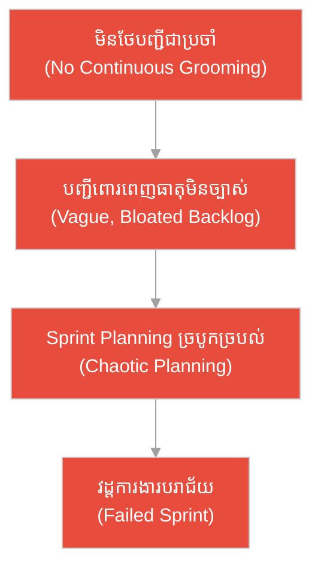
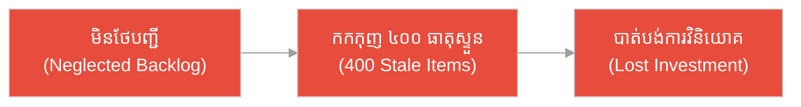
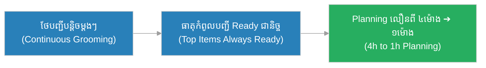
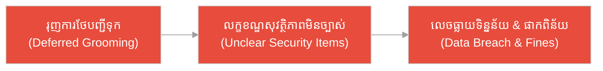
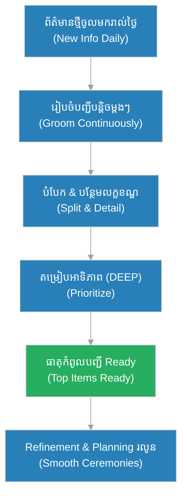

# ការរៀបចំបញ្ជី (Backlog Grooming)៖ អ្នក​ថែសួនច្បារ​ដែល​កាត់ស្លឹកបន្តិចម្តង ៗ និង​សួនព្រៃ​របស់​អ្នក​ជិតខាង (The Daily-Pruning Gardener & The Neighbor's Overgrown Jungle)

**អ្នកនិពន្ធ (Author):** ichamrong 
**កាលបរិច្ឆេទ (Date):** 2026-05-29 
**ស្លាក (Tags):** #agile #scrum #backlog-grooming #parable 
**ប្រភេទ (Category):** Management & Leadership 
**រយៈពេលអាន (Read Time):** ~១២ នាទី (~12 min) 

---

## 📌 មាតិកា (Table of Contents)
- [អន្ទាក់​នៃ​ការរៀបចំបញ្ជី (The Backlog Trap)](#0)
- [១. រឿងប្រៀបប្រដូច៖ អ្នក​ថែសួនច្បារ និង​សួនព្រៃ (The Parable: The Gardener & The Jungle)](#1)
- [២. បញ្ហា៖ ការ​មិន​ថែ​បញ្ជីការងារ (The Issue: A Neglected Backlog)](#2)
- [៣. ឧទាហរណ៍​ជាក់ស្តែង​ក្នុង​ពិភពពិត (Real World Examples)](#3)
 - [ឧទាហរណ៍​ទី ១ — កម្រិតស្រាល (គ្រួសារ)៖ បញ្ជីការងារ​ផ្ទះ​ប្រចាំសប្តាហ៍ (The Household To-Do List)](#3-1)
 - [ឧទាហរណ៍​ទី ២ — កម្រិតមធ្យម (បច្ចេកទេស)៖ បំណុលបច្ចេកទេស​ក្នុង​បញ្ជី (The Backlog Tech Debt)](#3-2)
 - [ឧទាហរណ៍​ទី ៣ — កម្រិតមធ្យម (ធុរកិច្ច)៖ ផែន​ការ​ផលិតផលច្របូកច្របល់ (The Tangled Product Roadmap)](#3-3)
 - [ឧទាហរណ៍​ទី ៤ — កម្រិតមធ្យម (គ្រប់​គ្រង)៖ ការ​រៀបចំ Sprint Planning ដ៏អនាធិបតេយ្យ (The Chaotic Sprint Planning)](#3-4)
 - [ឧទាហរណ៍​ទី ៥ — កម្រិតធ្ងន់ (ហានិភ័យខ្ពស់)៖ ការ​ដាក់ឱ្យដំណើរ​ការ​ប្រព័ន្ធ​ធនាគារ (The Banking System Launch)](#3-5)
- [៤. ការ​សន្ទនាបែបសាកសួរ (Socratic Dialogue: Grooming vs. Refinement Ceremony)](#4)
- [៥. ដំណោះស្រាយ៖ ការរៀបចំបញ្ជី​ជា​ប្រចាំ (The Solution: Continuous Grooming)](#5)
- [សេចក្តីសន្និដ្ឋាន (Conclusion)](#6)
- [ឯកសារយោង (References)](#7)
- [Related Posts](#8)

---

## អន្ទាក់​នៃ​ការរៀបចំបញ្ជី (The Backlog Trap)

នៅក្នុង​ការ​គ្រប់​គ្រង​បញ្ជីការងារ (Product Backlog) យើង​តែ​ង​តែ​ជួបប្រទះនូវភាពផ្ទុយគ្នា​ពី​រ៖

* **អន្ទាក់​បោះបង់ចោល (The Neglect Trap):** «កុំ​ខាត​ពេល​រៀបចំបញ្ជី​ធ្វើ​អ្វី! យើងគ្រាន់​តែ​យក​ការ​ងារ​ពី​បញ្ជី​មក​ធ្វើ​ពេល​ណា​ដែល​ត្រូវ​ការ ឱ្យ​តែ​ការ​ងារនៅទី​នោះ​បាន​ហើយ!»
* **អន្ទាក់​ច្រឡំ​ពិធីការ (The Ceremony Confusion Trap):** «ការរៀបចំបញ្ជី និង​កិច្ចប្រជុំ Sprint Refinement គឺជា​រឿង​តែ​មួយ! យើងគ្រាន់​តែ​រៀបចំបញ្ជីម្តងនៅ​ពេល​ប្រជុំ​មុន​ពេល​ធ្វើ​ផែន​ការ ជា​ការ​គ្រប់​គ្រាន់ហើយ!»

---

## ១. រឿងប្រៀបប្រដូច៖ អ្នក​ថែសួនច្បារ និង​សួនព្រៃ (The Parable: The Gardener & The Jungle)

នៅភូមិមួយ មាន​បុរសម្នាក់ឈ្មោះ **ដារ៉ា (Dara)** ដែល​មាន​សួនច្បារផ្កា និង​បន្លែដ៏ស្រស់ស្អាត។ រៀង​រាល់ព្រឹក ដារ៉ាចំណាយ​ពេល​ត្រឹម​តែ ១០ នាទី ដើរលេង​ក្នុង​សួន កាត់ស្លឹកស្ងួត រំ​លើ​ងស្មៅ​ដែល​ដុះ​ថ្មី និង​ផ្ដាច់មែក​ដែល​ដុះលៀនចេញ។ គាត់​មិន​បាន​ធ្វើ​ការ​នឿយហត់អ្វី​ឡើយ គ្រាន់​តែ​ថែបន្តិចម្តង ៗ ជា​រៀង​រាល់ថ្ងៃ។ ដោយសារ​តែ​ការ​ថែទាំ​ជា​ប្រចាំ​នេះ សួន​របស់​ដារ៉ា​តែ​ង​តែ​ស្អាត ផ្​ការ​ីក​ល្អ ហើយនៅ​ពេល​រដូវប្រមូលផល គាត់ដឹងភ្លាម ៗ ថាមែកណាគួរកាត់ ផ្លែណាគួរបេះ ដោយ​គ្មាន​ការ​ច្របូកច្របល់​ឡើយ។

ត្រង់​នេះ​ត្រូវ​យល់ឱ្យច្បាស់៖ **ការ​កាត់ស្លឹក​ប្រចាំថ្ងៃ (ការ​រៀបចំ​ជា​ប្រចាំ / Grooming)** គឺជា «ទម្លាប់» ដ៏ស្ងប់ស្ងាត់ ខណៈ **ការប្រជុំ​រៀបចំផែន​ការ​ប្រមូលផលរួមគ្នា​ប្រចាំសប្តាហ៍ (ពិធីការ Sprint Refinement)** គឺជា «កិច្ចប្រជុំផ្លូវ​ការ» ដែល​ដោយសារ​សួន​ត្រូវ​បាន​ថែ​ជា​ប្រចាំ ការប្រជុំ​នោះ​ក៏រលូន និង​លឿន​បំផុត។

ផ្ទុយ​ទៅ​វិញ អ្នក​ជិតខាងម្នាក់​មិន​ដែល​ថែសួន​របស់​គាត់​ឡើយ ដោយ​គិតថា «ខាត​ពេល​ណាស់ ខ្ញុំនឹងសម្អាតវាម្តង​ពេល​ដល់រដូវប្រមូលផល»។ ប៉ុន្តែ​នៅ​ពេល​រដូវ​នោះ​មក​ដល់ សួន​របស់​គាត់​បាន​ក្លាយ​ជា​ព្រៃស្បាត ស្មៅ និង​វល្លិវឹកវររុំព័ទ្ធគ្នា ស្លឹកស្ងួតគរ​លើ​គ្នាដិត។ គាត់​ត្រូវ​ចំណាយ​ពេល​ពេញមួយសប្តាហ៍កាប់ឆ្​ការ​ដោយ​ភ័យស្លន់ស្លោ ហើយ​ក្នុង​ការ​កាប់ឆ្​ការ​ដ៏​រហ័ស​នោះ គាត់​បាន​កាត់ខុសផ្ដាច់ដើមឈើផ្លែដ៏​មាន​តម្លៃ និង​ធ្វើ​ឱ្យខូចសួនទាំងមូល ទាល់​តែ​ប្រមូលផលអ្វី​មិន​បាន។

---

## ២. បញ្ហា៖ ការ​មិន​ថែ​បញ្ជីការងារ (The Issue: A Neglected Backlog)

នៅក្នុង​ការ​គ្រប់​គ្រង​គម្រោង​បែប Agile, **ការរៀបចំបញ្ជី (Backlog Grooming)** គឺជា «ទម្លាប់​ជា​ប្រចាំ» (Continuous Habit) នៃ​ការ​រក្សា​បញ្ជីការងារផលិតផល (Product Backlog) ឱ្យ​មាន​សុខភាព​ល្អ៖ បន្ថែម​ព័ត៌មាន​លម្អិត ការ​ប៉ាន់ប្រមាណ (Estimation) និង​ការ​តម្រៀបលំដាប់អាទិភាព (Prioritization) ដល់ធាតុ​នីមួយ ៗ ។ វាខុស​ពី **ពិធីការ Sprint Refinement** ដែល​ជា «កិច្ចប្រជុំផ្លូវ​ការ​ដែល​បាន​កំណត់​ពេល​វេលា» (Scheduled Session)។ ការ​រៀបចំ​ជា​ប្រចាំ​គឺជា​ទម្លាប់ស្ងប់ស្ងាត់​ប្រចាំថ្ងៃ ដែល​ធ្វើ​ឱ្យកិច្ចប្រជុំ Refinement និង Sprint Planning ដំណើរ​ការ​រលូន។

ការ​យល់ច្រឡំដ៏ធំបំផុត​គឺ «ការ​រៀបចំ​ជា​ប្រចាំ និង​ពិធីការ Refinement ជា​រឿង​តែ​មួយ» ឬ «យើងគ្រាន់​តែ​រៀបចំបញ្ជីម្តងភ្លាម ៗ មុន​ពេល​ធ្វើ​ផែន​ការ»។ នេះ​ជា​ការ​យល់ខុស! បើបញ្ជី​មិន​ត្រូវ​បាន​ថែ​ជា​ប្រចាំ វានឹងក្លាយ​ជា «ព្រៃ» នៃ​ធាតុ​មិន​ច្បាស់លាស់ ដែល​ធ្វើ​ឱ្យ Sprint Planning ច្របូកច្របល់ និង​បរាជ័យ។

---

## ៣. ឧទាហរណ៍​ជាក់ស្តែង​ក្នុង​ពិភពពិត

សូមពិនិត្យមើលរបៀប​ដែល​ការរៀបចំបញ្ជី​ជា​ប្រចាំ (Continuous Grooming) ជះឥទ្ធិពលដល់កម្រិតជីវិត និង​ការ​ងារទាំង ៥ ខាងក្រោម៖

---

### ឧទាហរណ៍​ទី ១ — កម្រិតស្រាល (គ្រួសារ)៖ បញ្ជីការងារ​ផ្ទះ​ប្រចាំសប្តាហ៍ (The Household To-Do List)

* **ស្ថានភាព៖** គ្រួសារមួយរក្សា​បញ្ជីការងារ​ផ្ទះនៅ​លើ​ទូទឹកកក។ រៀង​រាល់​ល្ងាច ពួកគេចំណាយ ៣ នាទី​លុប​ការ​ងារ​ដែល​រួច​រាល់ បន្ថែ​មក​ារងារ​ថ្មី និង​សម្គាល់អ្វី​ដែល​បន្ទាន់​ជា​ង។
* **លទ្ធផល៖** នៅ​ពេល​ចុងសប្តាហ៍​មក​ដល់ បញ្ជីការងារ​ច្បាស់លាស់រួចស្រេច ពួកគេចែក​ការ​ងារគ្នា​បាន​ភ្លាម ៗ ដោយ​គ្មាន​ការ​ប្រ​កែ​កថា «តើ​ត្រូវ​ធ្វើ​អ្វី​មុន​គេ?»។

---

### ឧទាហរណ៍​ទី ២ — កម្រិតមធ្យម (បច្ចេកទេស)៖ បំណុលបច្ចេកទេស​ក្នុង​បញ្ជី (The Backlog Tech Debt)

* **ស្ថានភាព៖** ក្រុមអភិវឌ្ឍន៍​រៀបចំ​បញ្ជីការងារ​ជា​ប្រចាំរៀង​រាល់​សប្តាហ៍។ ក្នុង​ពេល​ថែបញ្ជី ពួកគេ​បាន​បំបែកធាតុ «កែលម្អ​មូលដ្ឋាន​ទិន្នន័យ» ដ៏ធំមួយ ឱ្យ​ទៅ​ជា​ការ​ងារតូច ៗ ច្បាស់លាស់ និង​បន្ថែម​លក្ខខណ្ឌទទួលយក (Acceptance Criteria)។
* **លទ្ធផល៖** នៅ​ពេល​ដល់ Sprint Planning ការ​ងារ​នីមួយ ៗ ច្បាស់​ល្អ ប៉ាន់ប្រមាណ​បាន​ត្រឹម​ត្រូវ ហើយក្រុមជ្រើសរើស​ការ​ងារចូលវដ្ត​បាន​យ៉ាង​លឿន​ដោយ​គ្មាន​ភាព​មិន​ច្បាស់លាស់។

---

### ឧទាហរណ៍​ទី ៣ — កម្រិតមធ្យម (ធុរកិច្ច)៖ ផែន​ការ​ផលិតផលច្របូកច្របល់ (The Tangled Product Roadmap)

* **ស្ថានភាព៖** ម្ចាស់ផលិតផល (Product Owner) មិន​ដែល​ថែ​បញ្ជីការងារ​ឡើយ ដោយ​គិតថានឹងរៀបចំវាម្តង​ពេល​ប្រជុំ។ បញ្ជី​បាន​កកកុញដល់ ៤០០ ធាតុ ដែល​ភាគច្រើនស្ទួនគ្នា លែងពាក់ព័ន្ធ ឬ​មិន​ច្បាស់លាស់។
* **លទ្ធផល៖** នៅ​ពេល​អ្នក​វិនិយោគសួររក​ផែនទី​ផលិតផល (Roadmap) ម្ចាស់ផលិតផល​មិន​អាច​បង្ហាញ​អ្វីច្បាស់លាស់​បាន​ឡើយ បាត់បង់ទំនុកចិត្ត និង​បាត់បង់​ការ​វិនិយោគទាំងស្រុង។

---

### ឧទាហរណ៍​ទី ៤ — កម្រិតមធ្យម (គ្រប់​គ្រង)៖ ការ​រៀបចំ Sprint Planning ដ៏អនាធិបតេយ្យ (The Chaotic Sprint Planning)

* **ស្ថានភាព៖** Scrum Master លើ​កទឹកចិត្តក្រុមឱ្យថែបញ្ជីបន្តិចម្តង ៗ រាល់​ពេល​ដែល​មាន​ព័ត៌មាន​ថ្មី។ ដោយសារ​ធាតុនៅកំពូលបញ្ជី (Top of Backlog) តែ​ង​តែ «រួច​រាល់​ត្រៀម​ធ្វើ» (Ready) ជា​និច្ច។
* **លទ្ធផល៖** កិច្ចប្រជុំ Sprint Planning ដែល​ធ្លាប់ចំណាយ ៤ ម៉ោងពេញ ឥឡូវចំណាយត្រឹម​តែ ១ ម៉ោងប៉ុណ្ណោះ ដោយសារ​ធាតុ​ការ​ងារ​បាន​ច្បាស់លាស់ និង​តម្រៀបអាទិភាពរួចស្រេច។

---

### ឧទាហរណ៍​ទី ៥ — កម្រិតធ្ងន់ (ហានិភ័យខ្ពស់)៖ ការ​ដាក់ឱ្យដំណើរ​ការ​ប្រព័ន្ធ​ធនាគារ (The Banking System Launch)

* **ស្ថានភាព៖** ក្រុមអភិវឌ្ឍន៍​ប្រព័ន្ធ​ធនាគារមួយ​មិន​បាន​ថែ​បញ្ជីការងារ​ផ្នែកសុវត្ថិភាព (Security) ជា​ប្រចាំ ដោយ​រុញវាទុកដល់​ពេល​ជិតដាក់ឱ្យដំណើរ​ការ។ បញ្ជីពោរពេញធាតុ​មិន​ច្បាស់លាស់ ដែល​គ្មាន​នរណាយល់ច្បាស់​ពី​លក្ខខណ្ឌ។
* **លទ្ធផល៖** នៅ​ពេល​ដាក់ឱ្យដំណើរ​ការ ប្រព័ន្ធ​មាន​ចន្លោះប្រហោងសុវត្ថិភាពធ្ងន់ធ្ងរ ដែល​ត្រូវ​បាន​វាយលុក នាំឱ្យលេចធ្លាយ​ទិន្នន័យ​អតិថិជន និង​ការ​ផាកពិន័យផ្លូវច្បាប់ដ៏ធំធេង។

---

## ៤. ការ​សន្ទនាបែបសាកសួរ (Socratic Dialogue: Grooming vs. Refinement Ceremony)

**សិស្ស (ម្ចាស់ផលិតផល​ថ្មី)៖** លោកគ្រូ! ពួកយើង​មាន​កិច្ចប្រជុំ Sprint Refinement រៀង​រាល់​សប្តាហ៍រួចហើយ។ ដូច្​នេះ​តើ​ខ្ញុំនៅ​ត្រូវ​ការ «ការរៀបចំបញ្ជី (Grooming)» ធ្វើ​អ្វីទៀត? វា​មិន​មែន​ជា​រឿង​តែ​មួយទេ​ឬ?

**គ្រូ (ម្ចាស់ផលិតផល​ជើង​ចាស់)៖** នេះ​ជា​ការ​យល់ច្រឡំដ៏ពេញនិយម។ អនុញ្ញាតឱ្យខ្ញុំសួរឯង៖ ប្រសិនបើឯងថែសួនច្បារ​តែ​ម្តង​ក្នុង​មួយសប្តាហ៍ ក្នុង​ពេល​ប្រជុំ ១ ម៉ោង តើ​ស្មៅ និង​ស្លឹកស្ងួតឈប់ដុះ​ក្នុង ៦ ថ្ងៃផ្សេងទៀត​ឬ?

**សិស្ស៖** អត់ទេលោកគ្រូ វានៅ​តែ​ដុះ​ជា​រៀង​រាល់ថ្ងៃ។

**គ្រូ៖** ត្រឹម​ត្រូវ! បញ្ជីការងារ​របស់​ឯងក៏ដូចគ្នា — ព័ត៌មាន​ថ្មី​ចូល​មក​រាល់ថ្ងៃ៖ មតិអតិថិជន កំហុស​ថ្មី និង​គំនិត​ថ្មី។ ដូច្​នេះ តើ Grooming គឺជា «ព្រឹត្តិ​ការ​ណ៍ម្តង» ឬ​ជា «ទម្លាប់​ជា​ប្រចាំ»?

**សិស្ស៖** គឺជា​ទម្លាប់​ជា​ប្រចាំ... ប៉ុន្តែ​បើដូច្​នេះ តើ​កិច្ចប្រជុំ Refinement សម្រាប់​ធ្វើ​អ្វី?

**គ្រូ៖** ល្អ! ការ​រៀបចំ​ជា​ប្រចាំ (Grooming) គឺជា «ការ​កាត់ស្លឹក​ប្រចាំថ្ងៃ» — ឯងថែបញ្ជីបន្តិចម្តង ៗ ដើម្បី​រក្សាវាឱ្យ​មាន​សុខភាព​ល្អ។ ឯ Sprint Refinement វិញ គឺជា «កិច្ចប្រជុំផ្លូវ​ការ» ដែល​ក្រុមទាំងមូលជួបជុំគ្នា​ដើម្បី​ពិភាក្សា ប៉ាន់ប្រមាណ និង​បញ្​ជា​ក់​ការ​យល់ដឹងរួមគ្នា​លើ​ធាតុ​ដែល​ឯង​បាន​រៀបចំ​ជា​មុន​រួចហើយ។

**សិស្ស៖** ដូច្​នេះ​បើខ្ញុំថែបញ្ជី​ជា​ប្រចាំ កិច្ចប្រជុំ Refinement នឹង​លឿន និង​រលូន​ជា​ង​មុន​មែនទេ?

**គ្រូ៖** ត្រឹម​ត្រូវ​ហើយ! ដូចជា​សួនច្បារ​ដែល​ថែ​ជា​ប្រចាំ ការ​ប្រមូលផលក៏រលូន។ ការ​រៀបចំ​ជា​ប្រចាំ មិន​ជំនួស​ពិធីការ Refinement ឡើយ ប៉ុន្តែ​វា​ធ្វើ​ឱ្យ​ពិធីការ​នោះ​មាន​ប្រសិទ្ធភាពបំផុត។ កុំ​រង់ចាំឱ្យបញ្ជីក្លាយ​ជា​ព្រៃ រួចទើបព្យាយា​មក​ាប់ឆ្​ការ​វា​ក្នុង​ពេល​តែ​បន្តិច។

---

## ៥. ដំណោះស្រាយ៖ ការរៀបចំបញ្ជី​ជា​ប្រចាំ (The Solution: Continuous Grooming)

ដើម្បី​រក្សា​បញ្ជីការងារ​ឱ្យ​មាន​សុខភាព​ល្អ និង​ធានាថា Refinement និង Planning ដំណើរ​ការ​រលូន ក្រុ​មក​ារងារ​ត្រូវ​អនុវត្តគោល​ការ​ណ៍ **DEEP**៖

1. **លម្អិត (Detailed Appropriately):** ធាតុនៅកំពូលបញ្ជី (ដែល​ជិត​ធ្វើ) ត្រូវ​មាន​ព័ត៌មាន​លម្អិត និង​លក្ខខណ្ឌទទួលយក (Acceptance Criteria) ច្បាស់លាស់ ឯធាតុនៅ​ខាងក្រោម​អាចទុកធំ ៗ បាន (Epics)។
2. **ប៉ាន់ប្រមាណ (Estimated):** ធាតុ​នីមួយ ៗ ត្រូវ​មាន​ការ​ប៉ាន់ប្រមាណទំហំ (Story Points) ដែល​ត្រូវ​កែ​សម្រួលនៅ​ពេល​ដឹង​ព័ត៌មាន​កាន់​តែ​ច្បាស់។
3. **កើតឡើង​ជា​និច្ច (Emergent):** បញ្ជី​ត្រូវ​រស់រវើក និង​វិវឌ្ឍ​ជា​និច្ច — បន្ថែម កែ ឬ​លុប​ធាតុនៅ​ពេល​ដែល​មាន​ព័ត៌មាន​ថ្មី​ចូល​មក (ការ​កាត់ស្លឹក​ប្រចាំថ្ងៃ)។
4. **តម្រៀបអាទិភាព (Prioritized):** ធាតុ​ដែល​មាន​តម្លៃខ្ពស់បំផុត​ត្រូវ​ដាក់នៅកំពូលបញ្ជី​ជា​និច្ច ដើម្បី​ឱ្យក្រុមដឹងច្បាស់ថា​ត្រូវ​ធ្វើ​អ្វីបន្ទាប់។
5. **កុំ​ច្រឡំ Grooming ជា​មួយ Refinement Ceremony:** ការ​រៀបចំ​ជា​ប្រចាំ​ជា​ទម្លាប់ ឯ Refinement ជា​កិច្ចប្រជុំផ្លូវ​ការ — អនុវត្តទាំង​ពី​រ ដើម្បី​បញ្ជី​ដែល​មាន​សុខភាព​ល្អ។

---

## 🐇 ធ្លាក់ចូល​ក្នុង​រន្ធទន្សាយ (Enter the Rabbit Hole)

ដើម្បី​យល់ដឹងកាន់​តែ​ស៊ីជម្រៅអំ​ពី​ការ​គ្រប់​គ្រង​បញ្ជីការងារ និង​ពិធីការ Scrum សូមស្វែងយល់បន្ថែម៖

* 🚀 **[ការ​កែលម្អ​បញ្ជីការងារ​វដ្ត​ការ​ងារ (Sprint Refinement) ➔](./sprint-refinement.md)**
* 🚀 **[បញ្ជីការងារផលិតផល (Product Backlog) ➔](../artifacts/product-backlog.md)**
* 🚀 **[រឿងរ៉ាវ​អ្នកប្រើប្រាស់ (User Story) ➔](../artifacts/user-story.md)**

---

## សេចក្តីសន្និដ្ឋាន (Conclusion)

> **«ការរៀបចំបញ្ជី មិន​មែន​ជា​ការ​សម្អាតម្តងធំ ៗ ឡើយ ប៉ុន្តែ​វា​ជា​ការ​កាត់ស្លឹកបន្តិចម្តង ៗ រាល់ថ្ងៃ ដើម្បី​ឱ្យសួន​ការ​ងារ​របស់​យើង​មាន​សុខភាព​ល្អ​ជា​និច្ច។»**

ការរៀបចំបញ្ជី​ជា​ប្រចាំ (Grooming) ដ៏ត្រឹម​ត្រូវ ជួយឱ្យ​បញ្ជីការងារ​មាន​សុខភាព​ល្អ ច្បាស់លាស់ និង​តម្រៀបអាទិភាពរួចស្រេច។ ដូច​អ្នក​ថែសួនច្បារដារ៉ា​ដែល​ថែបន្តិចម្តង ៗ ការ​ប្រមូលផល (Sprint Planning និង Refinement) ក៏រលូន លឿន និង​គ្មាន​ការ​ច្របូកច្របល់ — ផ្ទុយ​ពី​អ្នក​ជិតខាង​ដែល​ត្រូវ​កាប់ឆ្​ការ​ព្រៃ​របស់​ខ្លួន​ក្នុង​ភាពភ័យស្លន់ស្លោ។

---

## ឯកសារយោង (References)

* **Ken Schwaber & Jeff Sutherland** — *The Scrum Guide* (2020).
* **Kenneth S. Rubin** — *Essential Scrum: A Practical Guide to the Most Popular Agile Process* (2012).
* **Mike Cohn** — *Agile Estimating and Planning* (2005).

---

## Related Posts

* [ការ​កែលម្អ​បញ្ជីការងារ​វដ្ត​ការ​ងារ (Sprint Refinement)](./sprint-refinement.md) — កិច្ចប្រជុំផ្លូវ​ការ​ដែល​ក្រុមជួបជុំគ្នា​ដើម្បី​បញ្​ជា​ក់​ការ​យល់ដឹង​លើ​ធាតុ​ដែល​បាន​រៀបចំ​ជា​មុន។
* [បញ្ជីការងារផលិតផល (Product Backlog)](../artifacts/product-backlog.md) — សួន​ការ​ងារ​ដែល​ត្រូវ​ថែទាំ​ជា​ប្រចាំ ដើម្បី​រក្សាសុខភាព​ល្អ។
* [រឿងរ៉ាវ​អ្នកប្រើប្រាស់ (User Story)](../artifacts/user-story.md) — ធាតុ​នីមួយ ៗ ក្នុង​បញ្ជី ដែល​ត្រូវ​បន្ថែម​លក្ខខណ្ឌទទួលយក​ក្នុង​ពេល​រៀបចំ។
