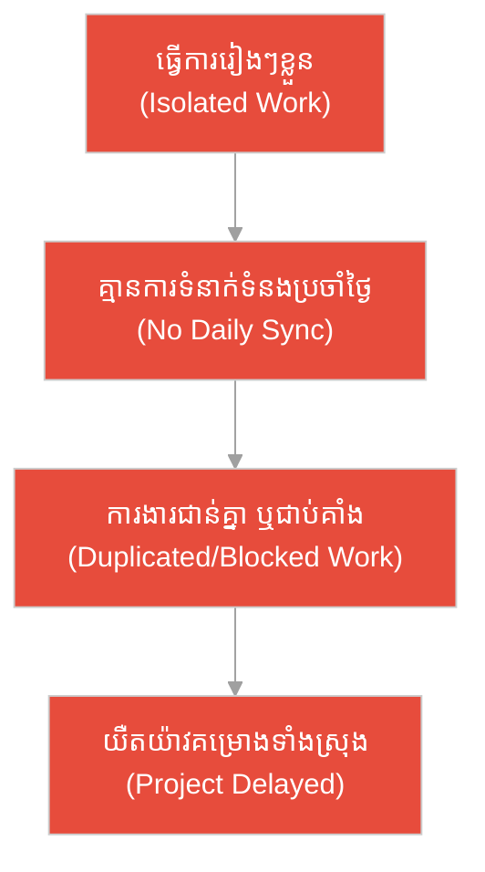
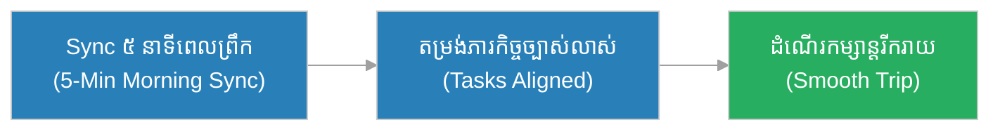
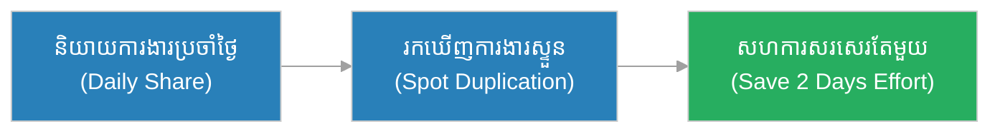
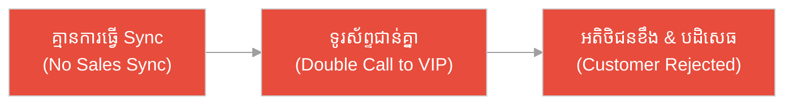
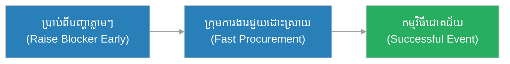
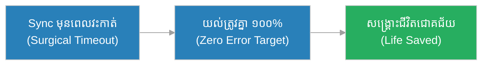
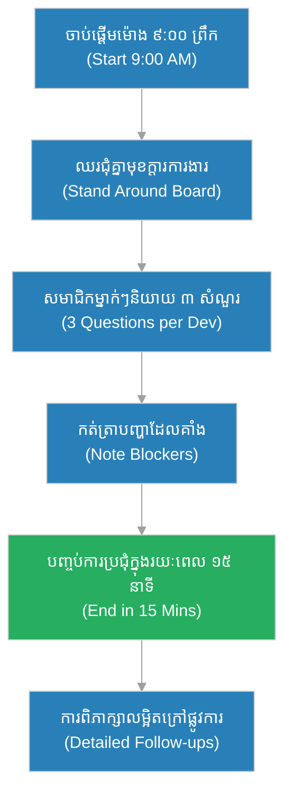

# ការប្រជុំខ្លីប្រចាំថ្ងៃ (Daily Standup)៖ ក្រុមអុំទូកចម្បាំង និង​ការ​តម្រង់ទិស​រាល់ព្រឹក​ព្រលឹម (The War Galley Crew & The Dawn Alignment)

**អ្នកនិពន្ធ (Author):** ichamrong 
**កាលបរិច្ឆេទ (Date):** 2026-05-29 
**ស្លាក (Tags):** #agile #scrum #daily-standup #collaboration #parable 
**ប្រភេទ (Category):** Management & Leadership 
**រយៈពេលអាន (Read Time):** ~១២ នាទី (~12 min) 

---

## 📌 មាតិកា (Table of Contents)
- [អន្ទាក់​ទំនាក់ទំនង (The Communication Trap)](#0)
- [១. រឿងប្រៀបប្រដូច៖ ក្រុមអុំទូកចម្បាំង និង​អ័ព្ទ​នាព្រឹកព្រលឹម (The Parable: The Rowers of the War Galley & The Morning Fog)](#1)
- [២. បញ្ហា៖ ការប្រជុំ​វែងអន្លាយ​គ្មាន​ទិសដៅ (The Issue: Rushed or Bloated Meetings)](#2)
- [៣. ឧទាហរណ៍​ជាក់ស្តែង​ក្នុង​ពិភពពិត (Real World Examples)](#3)
 - [ឧទាហរណ៍​ទី ១ — កម្រិតស្រាល (គ្រួសារ)៖ ការ​រៀបចំដំណើរកម្សាន្តនាចុងសប្តាហ៍ (The Family Trip Sync)](#3-1)
 - [ឧទាហរណ៍​ទី ២ — កម្រិតមធ្យម (បច្ចេកទេស)៖ ការ​កសាងម៉ូឌុលស្ទួន​ដោយ​មិន​ដឹងខ្លួន (The Duplicated Code Module)](#3-2)
 - [ឧទាហរណ៍​ទី ៣ — កម្រិតមធ្យម (ធុរកិច្ច)៖ ការ​ប្រគល់សេវាអតិថិជន​ជា​ន់គ្នា (The Overlapped Sales Call)](#3-3)
 - [ឧទាហរណ៍​ទី ៤ — កម្រិតមធ្យម (គ្រប់​គ្រង)៖ ការ​រៀបចំស្តង់​កម្មវិធី​ពិព័រណ៍ខ្នាតធំ (The Event Stage Setup)](#3-4)
 - [ឧទាហរណ៍​ទី ៥ — កម្រិតធ្ងន់ (សង្គ្រោះបន្ទាន់)៖ ក្រុមគ្រូពេទ្យវះកាត់​ក្នុង​បន្ទប់សង្គ្រោះបន្ទាន់ (The ER Surgical Sync)](#3-5)
- [៤. ការ​សន្ទនាបែបសាកសួរ (Socratic Dialogue: Status Reporting vs. Strategic Collaboration)](#4)
- [៥. ដំណោះស្រាយ៖ ការអនុវត្ត Daily Standup ឱ្យ​មាន​ប្រសិទ្ធភាព (The Solution: Executing High-Impact Standups)](#5)
- [សេចក្តីសន្និដ្ឋាន (Conclusion)](#6)
- [ឯកសារយោង (References)](#7)
- [Related Posts](#8)

---

## អន្ទាក់​ទំនាក់ទំនង (The Communication Trap)

នៅក្នុង​កិច្ចសហការ​ជា​ក្រុម យើង​តែ​ង​តែ​ជួបប្រទះនូវភាពផ្ទុយគ្នា​នៃ​ទំនាក់ទំនង៖

* **អន្ទាក់​ឯកោ (The Isolation Trap):** «ធ្វើ​ការ​រៀង ៗ ខ្លួន​ទៅ កុំ​ខាត​ពេល​និយាយគ្នា! សរសេរ​កូដ​ឱ្យ​តែ​រួច​ទៅ​បាន​ហើយ!»
* **អន្ទាក់​ប្រជុំចោល (The Meeting Trap):** «យើង​ត្រូវ​ប្រជុំគ្នា ២ ម៉ោងរៀង​រាល់ព្រឹក ដើម្បី​រាយ​ការ​ណ៍​ព័ត៌មាន​លម្អិត និង​ដោះស្រាយ​បញ្ហា​គ្រប់​យ៉ាង​ជា​មួយគ្នា!»

---

## ១. រឿងប្រៀបប្រដូច៖ ក្រុមអុំទូកចម្បាំង និង​អ័ព្ទ​នាព្រឹកព្រលឹម (The Parable: The Rowers of the War Galley & The Morning Fog)

កាល​ពី​ព្រេងនាយ មាន​សំពៅចម្បាំងដ៏ធំមួយ​របស់​ព្រះរា​ជា​ត្រូវ​ធ្វើ​ដំណើរឆ្លងកាត់ច្រកសមុទ្រដ៏ចង្អៀត និង​ពោពេញ​ទៅ​ដោយ​ថ្មប៉ប្រះទឹក។ សំពៅ​នោះ​មាន​ក្រុម​អ្នក​អុំទូក ២០ នាក់ បែងចែក​ជា​ពី​រជួរឆ្វេងស្តាំ។

នៅព្រឹកមួយ អ័ព្ទក្រាស់​បាន​ធ្លាក់ចុះ​មក​យ៉ាង​លឿន ធ្វើ​ឱ្យមើល​មិន​ឃើញទិសដៅខាងមុខ​ឡើយ។ មេក្រុមម្នាក់ឈ្មោះ **សុខ (Sok)** បាន​បង្គាប់ឱ្យក្រុម​អ្នក​អុំ​ទាំងអស់​ឈប់អុំមួយភ្លែត ហើយចំណាយ​ពេល​ត្រឹម​តែ ៣ ដង្ហើម (ប្រហែល ២ នាទី) ដើម្បី​ស្រែកប្រាប់គ្នា​ទៅ​វិញ​ទៅ​មក៖ «តើ​ជួរឆ្វេងកំពុងជួបថ្មប៉ប្រះទឹកដែរ​ឬ​ទេ? តើ​ជួរខាងស្តាំ​ត្រូវ​បន្ថែមល្បឿនកម្រិតណា? តើ​មាន​នរណាអស់កម្លាំង​ខ្លាំង​ឬ​ទេ?» បន្ទាប់​ពី​ទទួល​បាន​ព័ត៌មាន និង​តម្រង់ទិសគ្នា រួច​រាល់ ពួកគេក៏ចាប់ផ្​តើ​មវាយអុំស្របគ្នា គេចផុត​ពី​ថ្មប៉ប្រះទឹក និង​ទៅ​ដល់គោលដៅ​ដោយ​សុវត្ថិភាព។

ផ្ទុយ​ទៅ​វិញ សំពៅមួយទៀត​ដែល​ដឹកនាំ​ដោយ​មេក្រុមម្នាក់ទៀត​មិន​ព្រមឈប់​សម្របសម្រួល​គ្នា​ឡើយ ដោយសារ​ខ្លាចខាត​ពេល។ អ្នក​អុំម្នាក់ ៗ អុំ​តាម​ចិត្តនឹកឃើញ គ្មាន​ការ​ដឹងថា​អ្នក​ខាងឆ្វេង ឬ​ខាងស្តាំកំពុងជួបឧបសគ្គអ្វី​ឡើយ។ មិន​យូរប៉ុន្​មាន សំពៅ​នោះ​ក៏​បាន​បុកទង្គិចនឹងថ្មប៉ប្រះទឹកលិចចូល​ទៅ​ក្នុង​សមុទ្រ​ដោយសារ​តែ​ការ​អុំខុសទិសដៅគ្នា និង​ខ្វះ​ការ​ទំនាក់ទំនង។

---

## ២. បញ្ហា៖ ការប្រជុំ​វែងអន្លាយ​គ្មាន​ទិសដៅ (The Issue: Rushed or Bloated Meetings)

នៅក្នុង​ការ​គ្រប់​គ្រង​គម្រោង​បែប Agile, **ការប្រជុំខ្លីប្រចាំថ្ងៃ (Daily Standup)** គឺជា​ការប្រជុំ​រយៈពេល​ខ្លី (Timeboxed ត្រឹម ១៥ នាទី) ដែល​ធ្វើ​ឡើងរៀង​រាល់ព្រឹក ដើម្បី​ឱ្យ​សមាជិក​ក្រុម​ទាំងអស់​មក​តម្រង់ទិសគ្នា (Align)។ គោលបំណង​គឺ​មិន​មែន​ដើម្បី «រាយ​ការ​ណ៍​ការ​ងារ​ទៅកាន់​អ្នក​គ្រប់​គ្រង» នោះ​ទេ ប៉ុន្តែ​វា​ជា​ការ​សហការ​រៀបចំ​យុទ្ធសាស្ត្រ​ប្រចាំថ្ងៃ។

ប្រសិនបើខ្វះ Daily Standup ក្រុ​មក​ារងារនឹងធ្លាក់ចូល​ទៅ​ក្នុង​ភាពឯកោ ធ្វើ​ការ​ងារ​ជា​ន់គ្នា ឬ​ត្រូវ​ជា​ប់គាំង​ការ​ងារ (Blocked) រាប់ថ្ងៃ​ដោយ​គ្មាន​ដំណោះស្រាយ។

---

## ៣. ឧទាហរណ៍​ជាក់ស្តែង​ក្នុង​ពិភពពិត

សូមពិនិត្យមើលរបៀប​ដែល Daily Sync ជះឥទ្ធិពលដល់កម្រិតជីវិត និង​ការ​ងារទាំង ៥ ខាងក្រោម៖

---

### ឧទាហរណ៍​ទី ១ — កម្រិតស្រាល (គ្រួសារ)៖ ការ​រៀបចំដំណើរកម្សាន្តនាចុងសប្តាហ៍ (The Family Trip Sync)

* **ស្ថានភាព៖** គ្រួសារមួយកំពុងរៀបចំចេញដំណើរ​ទៅ​លេងកំពត។ ពួកគេ​ធ្វើ​ការ sync គ្នា ៥ នាទីនៅ​ពេល​ព្រឹក ដើម្បី​បញ្​ជា​ក់ថា៖ ឪពុក​បាន​ពិនិត្យប្រេងឡានរួច​រាល់ ម្តាយ​បាន​រៀបចំអាហារសម្រន់ និង​កូន ៗ បាន​រៀបចំសម្លៀកបំពាក់។
* **លទ្ធផល៖** គ្រួសារចេញដំណើរទាន់​ពេល​វេលា​ដោយ​គ្មាន​ការ​ភ្លេច​របស់​របរសំខាន់ ឬ​យឺត​យ៉ាវ​ឡើយ។

---

### ឧទាហរណ៍​ទី ២ — កម្រិតមធ្យម (បច្ចេកទេស)៖ ការ​កសាងម៉ូឌុលស្ទួន​ដោយ​មិន​ដឹងខ្លួន (The Duplicated Code Module)

* **ស្ថានភាព៖** អ្នក​អភិវឌ្ឍ​ន៍​ពី​រនាក់កំពុង​ធ្វើ​ការ​លើ​មុខងារផ្សេងគ្នា។ ក្នុង​ពេល Standup ពួក​បាន​និយាយ​ពី​អ្វី​ដែល​ពួកគេ​ត្រូវ​ធ្វើ​នៅថ្ងៃ​នេះ ហើយដឹងភ្លាមថាពួកគេទាំង​ពី​រកំពុង​សរសេរ «ម៉ូឌុលផ្ទៀងផ្ទាត់លេខទូរស័ព្ទ (OTP Verification)» ដូចគ្នា។
* **លទ្ធផល៖** ពួកគេសម្រេចចិត្ត​សហការគ្នា​សរសេរ​តែ​មួយ ជួយសន្សំ​ពេល​វេលា​អភិវឌ្ឍ​ន៍​បាន ២ ថ្ងៃពេញ និង​ជៀសវាង​ការ​សរសេរ​កូដ​ស្ទួន។

---

### ឧទាហរណ៍​ទី ៣ — កម្រិតមធ្យម (ធុរកិច្ច)៖ ការ​ប្រគល់សេវាអតិថិជន​ជា​ន់គ្នា (The Overlapped Sales Call)

* **ស្ថានភាព៖** នៅក្នុង​ក្រុមលក់ (Sales Team) គ្មាន​ការ​ធ្វើ Daily Sync ឡើយ។ បុគ្គលិកលក់​ពី​រនាក់​បាន​ទូរស័ព្ទ​ទៅកាន់​អតិថិជន VIP តែ​ម្នាក់​ក្នុង​ថ្ងៃ​តែ​មួយ​ដើម្បី​ណែនាំ​សេវាកម្ម​ដូចគ្នា។
* **លទ្ធផល៖** អតិថិជន​មាន​អារម្មណ៍ធុញទ្រាន់ និង​មាន​ការ​វាយតម្លៃថា ក្រុមហ៊ុន​គ្មាន​វិជ្​ជា​ជីវៈ និង​គ្មាន​ប្រព័ន្ធ​គ្រប់​គ្រង​ការ​ងារច្បាស់លាស់ នាំឱ្យបាត់បង់ឱកាសលក់ទាំងស្រុង។

---

### ឧទាហរណ៍​ទី ៤ — កម្រិតមធ្យម (គ្រប់​គ្រង)៖ ការ​រៀបចំស្តង់​កម្មវិធី​ពិព័រណ៍ខ្នាតធំ (The Event Stage Setup)

* **ស្ថានភាព៖** ក្រុមរៀបចំ​កម្មវិធី​ព្រឹត្តិ​ការ​ណ៍ខ្នាតធំចំណាយ​ពេល ៥ នាទីរៀង​រាល់ព្រឹក​ដើម្បី sync គ្នា។ ក្រុមបច្ចេកទេសប្រាប់ថា៖ «ជើងទម្រភ្​លើ​ងឆាកខាងឆ្វេងកំពុងខូច​ត្រូវ​ការ​ផ្នែកទិញគ្រឿងបន្លាស់បន្ទាន់!»។
* **លទ្ធផល៖** ក្រុមទិញទំនិញដឹងភ្លាម និង​រត់​ទៅ​ទិញគ្រឿងបន្លាស់​មក​ជំនួសទាន់​ពេល​វេលា ជួយឱ្យ​កម្មវិធី​បើកដំណើរ​ការ​បាន​ល្អ​ឥតខ្ចោះ។

---

### ឧទាហរណ៍​ទី ៥ — កម្រិតធ្ងន់ (សង្គ្រោះបន្ទាន់)៖ ក្រុមគ្រូពេទ្យវះកាត់​ក្នុង​បន្ទប់សង្គ្រោះបន្ទាន់ (The ER Surgical Sync)

* **ស្ថានភាព៖** មុន​ពេល​ចាប់ផ្​តើ​មវះកាត់​អ្នក​ជំងឺគ្រោះថ្នាក់ចរាចរណ៍ធ្ងន់ធ្ងរ ក្រុមគ្រូពេទ្យវះកាត់ គ្រូពេទ្យសន្លប់ និង​គិលានុបដ្ឋាយិកា ចំណាយ​ពេល ១ នាទី (Surgical Timeout) ដើម្បី sync គ្នា៖ ផ្ទៀងផ្ទាត់ឈ្មោះ​អ្នក​ជំងឺ ក្រុមឈាម និង​តួនាទី​របស់​សមាជិក​ម្នាក់ ៗ ។
* **លទ្ធផល៖** ជៀសវាង​ការ​ខុសឆ្គងបច្ចេកទេស និង​ជួយសង្គ្រោះជីវិត​អ្នក​ជំងឺ​បាន​ទាន់​ពេល​វេលា​បំផុត។

---

## ៤. ការ​សន្ទនាបែបសាកសួរ (Socratic Dialogue: Status Reporting vs. Strategic Collaboration)

**សិស្ស (អ្នក​អភិវឌ្ឍ​ន៍)៖** លោកគ្រូ! ពួកយើង​ធ្វើ Daily Standup រាល់ថ្ងៃ ប៉ុន្តែ​វាគួរឱ្យធុញណាស់។ វា​មាន​អារម្មណ៍​ដូចជា​ពួកយើងកំពុង​មក​ធ្វើ​របាយ​ការ​ណ៍ឱ្យ Scrum Master ឬ​អ្នក​គ្រប់​គ្រង​គម្រោង​តែ​ប៉ុណ្ណោះ។

**គ្រូ (វិស្វករ​ជា​ន់ខ្ពស់)៖** នេះ​ជា​បញ្ហា​ដ៏ពេញនិយមបំផុត។ អនុញ្ញាតឱ្យខ្ញុំសួរឯង៖ តើ​នៅក្នុង​ការប្រជុំ​នោះ ឯងរាយ​ការ​ណ៍អ្វីខ្លះ?

**សិស្ស៖** ខ្ញុំគ្រាន់​តែ​រាយ​ការ​ណ៍ថា៖ «ម្សិលមិញខ្ញុំ​ធ្វើ​ការ​ងារលេខ ១២៣ ថ្ងៃ​នេះ​ខ្ញុំបន្ត​ធ្វើ​វា ហើយខ្ញុំ​គ្មាន​បញ្ហា​អ្វីទេ។» ម្នាក់ ៗ និយាយ​តែ​ប៉ុណ្ណឹង រួចក៏ចប់​ការប្រជុំ។

**គ្រូ៖** ចុះប្រសិនបើឯងកំពុងជួប​ការ​ងារលំបាក ប៉ុន្តែ​ឯងខ្លាច​មិន​ហ៊ាននិយាយ ឬ​មាន​អារម្មណ៍ថា​គ្មាន​នរណាចាប់អារម្មណ៍ តើ​ឯងនឹងប្រាប់ក្រុ​មក​ារងារទេ?

**សិស្ស៖** ប្រហែល​ជា​អត់ទេលោកគ្រូ ខ្ញុំនឹងព្យាយាមដោះស្រាយវា​តែ​ម្នាក់ឯង។

**គ្រូ៖** នេះ​ហើយ​ជា​អន្ទាក់! ប្រសិនបើម្នាក់ ៗ គ្រាន់​តែ​មក​អាន​របាយ​ការ​ណ៍​ដែល​គេអាចមើលឃើញនៅ​លើ​ក្តារ​ការ​ងារ (Jira Board) រួចត្រឡប់​ទៅ​ធ្វើ​ការ​ងាររៀង ៗ ខ្លួនវិញ តើ​យើង​ត្រូវ​ការ​មក​ឈរជុំគ្នា​ធ្វើ​អ្វី? តើ Daily Standup បង្កើត​ឡើង​ដើម្បី «តាមដាន​មនុស្ស» ឬ​ដើម្បី «តម្រង់ទិសដៅ​ការ​ងារ»?

**សិស្ស៖** គឺ​ដើម្បី​តម្រង់ទិសដៅ​ការ​ងារ និង​ជួយគ្នាដោះស្រាយ​បញ្ហា​លោកគ្រូ។

**គ្រូ៖** ត្រឹម​ត្រូវ​ហើយ។ ដូច្​នេះ ដើម្បី​ផ្លាស់ប្តូរវា ឯង​ត្រូវ​ប្តូរ​ការ​ផ្តោតអារម្មណ៍​ពី «ខ្ញុំ​បាន​ធ្វើ​អ្វី» ទៅ​ជា «តើ​យើងអាចរួមគ្នាសម្រេច​បាន​គោលដៅវដ្ត​ការ​ងារ (Sprint Goal) យ៉ាង​ដូចម្តេច»។ ប្រសិនបើឯងជួប​បញ្ហា ឯង​ត្រូវ​លើ​កឡើងភ្លាម ៗ ដើម្បី​ឱ្យ​សមាជិក​ដទៃដឹង និង​សហការ​ដោះស្រាយបន្ទាប់​ពី​ចប់​ការប្រជុំ។ ការប្រជុំ​នេះ​គឺ​សម្រាប់ «អ្នក​លេង» (Developers) មិន​មែន​សម្រាប់ «ទស្សនិកជន» (Managers) ឡើយ។

---

## ៥. ដំណោះស្រាយ៖ ការអនុវត្ត Daily Standup ឱ្យ​មាន​ប្រសិទ្ធភាព (The Solution: Executing High-Impact Standups)

ដើម្បី​ធានាថា Daily Standup ផ្តល់តម្លៃខ្ពស់បំផុត និង​មិន​ខាត​ពេល ក្រុ​មក​ារងារ​ត្រូវ​អនុវត្តគោល​ការ​ណ៍ **៣-១៥-STAND**៖

1. ** Timebox ម៉ឺងម៉ាត់ (Strict 15-Minute Limit):** ការប្រជុំ​មិន​ត្រូវ​ឱ្យ​លើ​ស​ពី ១៥ នាទី​ឡើយ។ បញ្ហា​បច្ចេកទេសលម្អិត​ត្រូវ​ទុក​ពិភាក្សា​ក្រៅផ្លូវ​ការ​បន្ទាប់​ពី​ចប់​ការប្រជុំ (Post-Standup/16th minute)។
2. **ផ្តោត​លើ​សំណួរ​គន្លឹះ​ទាំង ៣ (Focus on 3 Core Questions):**
 * តើ​ខ្ញុំ​បាន​ធ្វើ​អ្វីខ្លះកាល​ពី​ម្សិលមិញ​ដើម្បី​ជួយឱ្យសម្រេច​បាន Sprint Goal?
 * តើ​ខ្ញុំនឹង​ធ្វើ​អ្វីខ្លះនៅថ្ងៃ​នេះ​ដើម្បី​ជួយឱ្យសម្រេច​បាន Sprint Goal?
 * តើ​ខ្ញុំកំពុងជួបឧបសគ្គ ឬ​បញ្ហា​អ្វីខ្លះ​ដែល​រារាំង​ការ​ងារ​របស់​ខ្ញុំ (Blockers)?
3. **ការ​ឈរប្រជុំ (Stand Up physically):** ប្រសិនបើ​ធ្វើ​ការ​នៅ​ការ​ិយាល័យផ្ទាល់ ត្រូវ​ឈរប្រជុំជុំគ្នា។ ការ​ឈរ​ធ្វើ​ឱ្យយើង​ចង់​បញ្ចប់​ការប្រជុំ​ឱ្យ​បាន​លឿន និង​មិន​និយាយរឿងក្រៅប្រធានបទ។
4. **ផ្តោត​លើ​ក្តារ​ការ​ងារ (Walk the Board):** ពិនិត្យមើលលំហូរ​ការ​ងារ​ពី​ស្តាំ​ទៅ​ឆ្វេង (ពី Done ទៅ To Do) ដើម្បី​ធានាថា​ការ​ងារ​ដែល​ជិតរួច​រាល់​ត្រូវ​បាន​ជម្រុញឱ្យរួច​រាល់​ជា​ស្ថាពរ​ជា​មុន។

---

## 🐇 ធ្លាក់ចូល​ក្នុង​រន្ធទន្សាយ (Enter the Rabbit Hole)

ដើម្បី​យល់ដឹងកាន់​តែ​ស៊ីជម្រៅអំ​ពី​ការ​ប្រាស្រ័យទាក់ទង និង​ការ​គ្រប់​គ្រង​ពិធីការ​ងារ​របស់ Scrum សូមស្វែងយល់បន្ថែម៖

* 🚀 **[ការ​រៀបចំផែន​ការ​វដ្ត​ការ​ងារ (Sprint Planning) ➔](./sprint-planning.md)**
* 🚀 **[ការ​កែលម្អ​បញ្ជីការងារ​វដ្ត​ការ​ងារ (Sprint Refinement) ➔](./sprint-refinement.md)**
* 🚀 **[ការ​ពិនិត្យឡើងវិញ​និង​កែលម្អ​វដ្ត​ការ​ងារ (Sprint Retrospective) ➔](./sprint-retrospective.md)**

---

## សេចក្តីសន្និដ្ឋាន (Conclusion)

> **«ការប្រជុំខ្លីប្រចាំថ្ងៃ មិន​មែន​ជា​ការ​តាមដាន​មនុស្ស​ឡើយ ប៉ុន្តែ​វា​ជា​ការ​រៀបចំផែន​ការ​ចម្បាំង​ប្រចាំថ្ងៃ​របស់​ក្រុ​មក​ារងារ។»**

ការអនុវត្ត Daily Standup ដ៏ត្រឹម​ត្រូវ ជួយឱ្យក្រុ​មក​ារងារបំបែកអ័ព្ទក្រាស់​នៃ​ដំណើរ​ការ​អភិវឌ្ឍ​ន៍ ដឹង​ពី​ស្ថានភាពគ្នា​ទៅ​វិញ​ទៅ​មក និង​សហការគ្នា​អុំសំពៅបច្ចេកវិទ្យា​ទៅ​ដល់គោលដៅ​ដោយ​ភាពជឿ​ជា​ក់ និង​សុវត្ថិភាពបំផុត។

---

## ឯកសារយោង (References)

* **Jeff Sutherland** — *Scrum: The Art of Doing Twice the Work in Half the Time* (2014).
* **Kenneth S. Rubin** — *Essential Scrum: A Practical Guide to the Most Popular Agile Process* (2012).

---

## Related Posts

* [ការ​រៀបចំផែន​ការ​វដ្ត​ការ​ងារ (Sprint Planning)](./sprint-planning.md) — របៀបរៀបចំផែន​ការ​ចម្បាំងធំ មុន​ពេល​បែងចែក​ការ​ងារ​ប្រចាំថ្ងៃ។
* [តួនាទី​ក្នុង​ក្រុ​មក​ារងារ Scrum (Scrum Roles)](../roles/scrum-roles.md) — ការ​យល់ដឹង​ពី​តួនាទីច្បាស់លាស់​ដើម្បី​សម្របសម្រួល​គ្នា​ក្នុង Daily Standup។
