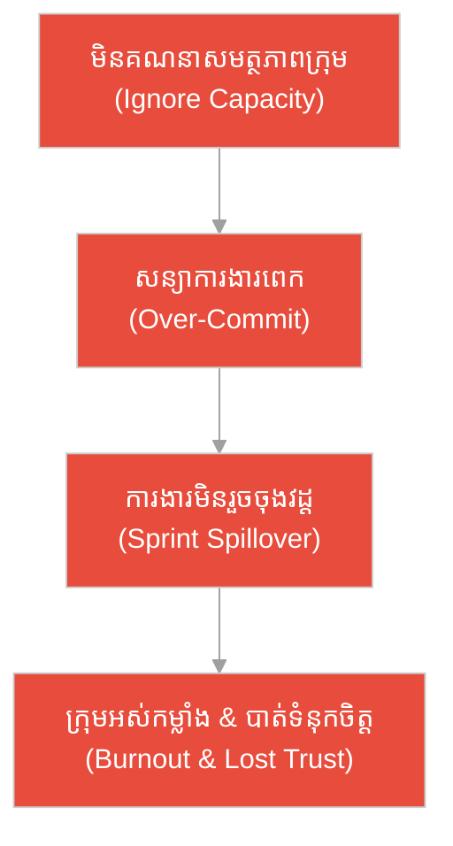
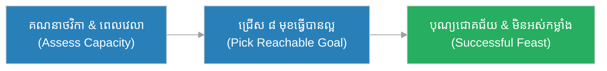
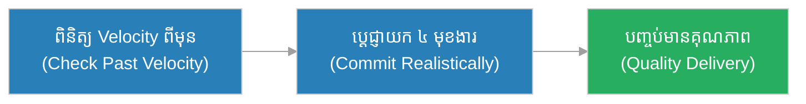
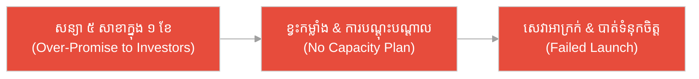
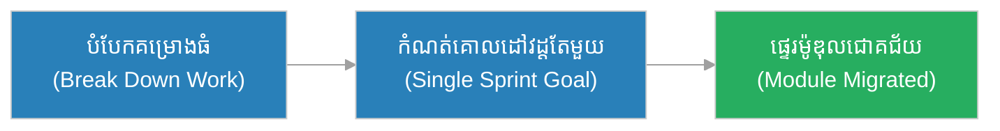
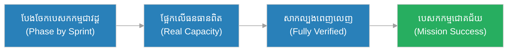
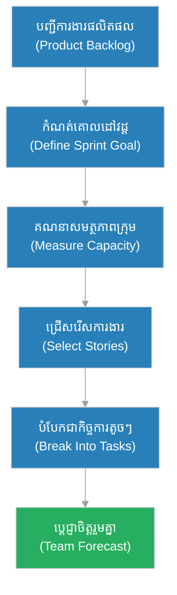

# ការ​រៀបចំផែន​ការ​វដ្ត​ការ​ងារ (Sprint Planning)៖ មេក្រុមដឹកអូដ្ឋ និង​គោលដៅអូអាស៊ីស​ដែល​ឈានដល់​បាន (The Caravan Master & The Reachable Oasis)

**អ្នកនិពន្ធ (Author):** ichamrong 
**កាលបរិច្ឆេទ (Date):** 2026-05-29 
**ស្លាក (Tags):** #agile #scrum #sprint-planning #parable 
**ប្រភេទ (Category):** Management & Leadership 
**រយៈពេលអាន (Read Time):** ~១២ នាទី (~12 min) 

---

## 📌 មាតិកា (Table of Contents)
- [អន្ទាក់​នៃ​ការ​សន្យា (The Commitment Trap)](#0)
- [១. រឿងប្រៀបប្រដូច៖ មេក្រុមដឹកអូដ្ឋ និង​គោលដៅអូអាស៊ីស (The Parable: The Caravan Master & The Oasis)](#1)
- [២. បញ្ហា៖ ការ​សន្យា​ការ​ងារពេក​គ្មាន​សមត្ថភាព (The Issue: Over-Commitment Without Capacity)](#2)
- [៣. ឧទាហរណ៍​ជាក់ស្តែង​ក្នុង​ពិភពពិត (Real World Examples)](#3)
 - [ឧទាហរណ៍​ទី ១ — កម្រិតស្រាល (គ្រួសារ)៖ ការ​រៀបចំចំណាយម្ហូប​ពេល​បុណ្យចូលឆ្នាំ (The Family Feast Budget)](#3-1)
 - [ឧទាហរណ៍​ទី ២ — កម្រិតមធ្យម (បច្ចេកទេស)៖ ការ​សន្យាមុខងារ ១០ ក្នុង​វដ្ត​តែ ២ សប្តាហ៍ (The 10-Feature Sprint)](#3-2)
 - [ឧទាហរណ៍​ទី ៣ — កម្រិតមធ្យម (ធុរកិច្ច)៖ ការ​សន្យាបើកសាខា​ថ្មី​ពេល​រដូវកំពូល (The Branch Launch Promise)](#3-3)
 - [ឧទាហរណ៍​ទី ៤ — កម្រិតមធ្យម (គ្រប់​គ្រង)៖ ការ​បែងចែកក្រុមឱ្យ​ធ្វើ​គម្រោង​ធំ (The Migration Project Plan)](#3-4)
 - [ឧទាហរណ៍​ទី ៥ — កម្រិតធ្ងន់ (ហានិភ័យខ្ពស់)៖ ផែន​ការ​បេសកកម្មយានអវកាស (The Spacecraft Mission Plan)](#3-5)
- [៤. ការ​សន្ទនាបែបសាកសួរ (Socratic Dialogue: Boss Assigns vs. Team Forecasts)](#4)
- [៥. ដំណោះស្រាយ៖ ការអនុវត្ត Sprint Planning ឱ្យឈានដល់គោលដៅ (The Solution: Forecasting a Reachable Goal)](#5)
- [សេចក្តីសន្និដ្ឋាន (Conclusion)](#6)
- [ឯកសារយោង (References)](#7)
- [Related Posts](#8)

---

## អន្ទាក់​នៃ​ការ​សន្យា (The Commitment Trap)

នៅ​ពេល​រៀបចំផែន​ការ​វដ្ត​ការ​ងារ ក្រុ​មក​ារងារ​តែ​ង​តែ​ធ្លាក់ចូល​ក្នុង​អន្ទាក់​ផ្ទុយគ្នា​ពី​រ៖

* **អន្ទាក់​ចេញបញ្​ជា (The Command Trap):** «ចៅហ្វាយ​ជា​អ្នក​សម្រេច! ខ្ញុំចែក​ការ​ងារ​នេះ​ឱ្យ​អ្នក​ធ្វើ ហើយ​ត្រូវតែ​រួច​ក្នុង​វដ្ត​នេះ មិន​បាច់​ពិភាក្សា​ទេ!»
* **អន្ទាក់​សន្យាហួសកម្លាំង (The Over-Promise Trap):** «យក​ការ​ងារ​ទាំងអស់​នេះ​ចូលវដ្តចុះ! យើងព្យាយាម​ធ្វើ​ឱ្យអស់ ស្អែកគិត​ពី​បញ្ហា​ជា​ក្រោយ!»

---

## ១. រឿងប្រៀបប្រដូច៖ មេក្រុមដឹកអូដ្ឋ និង​គោលដៅអូអាស៊ីស (The Parable: The Caravan Master & The Oasis)

កាល​ពី​ព្រេងនាយ មាន​ក្រុមដឹកទំនិញឆ្លងវាលខ្សាច់ដ៏ធំមួយ ដែល​ដឹកនាំ​ដោយ​មេក្រុមម្នាក់ឈ្មោះ **ដារ៉ា (Dara)**។ រាល់ព្រឹក​ព្រលឹម​មុន​ពេល​ចេញដំណើរ ដារ៉ា​តែ​ង​តែ​ឈរក្រោកមើលអូដ្ឋ​ទាំងអស់ ស្ទាបពិនិត្យកម្លាំង​របស់​វា គណនាបរិមាណទឹក​ដែល​នៅសល់ និង​ពិនិត្យមើលក្តៅ​ខ្លាំង​នៃ​ថ្ងៃ​នោះ។

បន្ទាប់​មក ដារ៉ាក៏ប្រកាសច្បាស់លាស់​ទៅកាន់​ក្រុម​ទាំងអស់៖ «ថ្ងៃ​នេះ យើងនឹង​ធ្វើ​ដំណើរ​ទៅ **អូអាស៊ីសក្តៅ (the Warm Oasis)** ដែល​នៅចម្ងាយ​ដែល​អូដ្ឋឈានដល់​បាន​ពិតប្រាកដ — មិន​មែន​ទៅ​អូអាស៊ីសឆ្ងាយ​ដែល​អ្នក​ដទៃប្រាថ្នា​ចង់​បាន​ឡើយ»។ គាត់​មិន​សន្យាចម្ងាយ​ដែល​មើលឃើញ​តែ​ក្នុង​ផែនទី ប៉ុន្តែ​សន្យាចម្ងាយ​ដែល​ក្រុម​ពិត​ជា​អាច​ទៅ​ដល់។ ដោយសារ​ផែន​ការ​នេះ​ផ្អែក​លើ​កម្លាំង​ពិត ក្រុម​របស់​ដារ៉ា​បាន​ទៅ​ដល់អូអាស៊ីស​រាល់​ល្ងាច បាន​សម្រាក បាន​បំពេញទឹក និង​បន្តដំណើរ​ដោយ​សុវត្ថិភាពរហូតដល់ទីក្រុងគោលដៅ។

ផ្ទុយ​ទៅ​វិញ មាន​មេក្រុមមួយទៀត​ដែល​ប្រាថ្នា​ចង់​បាន​កេរ្តិ៍ឈ្មោះ ក៏សន្យា​ទៅ​ម្​ចាស់​ទំនិញថានឹង​ទៅ​ដល់ទីក្រុងឆ្ងាយ​ក្នុង​តែ​មួយថ្ងៃ ដោយ​មិន​បាន​គណនាកម្លាំងអូដ្ឋ ឬ​បរិមាណទឹក​ឡើយ។ ពេល​ថ្ងៃកាន់​តែ​ខ្ពស់ អូដ្ឋអស់កម្លាំង ទឹកអស់ ហើយក្រុម​នោះ​ក៏​ត្រូវ​ជា​ប់គាំងនៅកណ្តាលវាលខ្សាច់ ឆ្ងាយ​ពី​អូអាស៊ីសណាមួយ — បាត់បង់ទាំងទំនិញ ទាំងជីវិត ដោយសារ​តែ​សន្យាគោលដៅ​ដែល​ឈាន​មិន​ដល់។

---

## ២. បញ្ហា៖ ការ​សន្យា​ការ​ងារពេក​គ្មាន​សមត្ថភាព (The Issue: Over-Commitment Without Capacity)

នៅក្នុង​ការ​គ្រប់​គ្រង​គម្រោង​បែប Agile, **ការ​រៀបចំផែន​ការ​វដ្ត​ការ​ងារ (Sprint Planning)** គឺជា​ការប្រជុំ​នៅថ្ងៃដំបូង​នៃ​វដ្ត​ការ​ងារ​នីមួយ ៗ ដែល​ក្រុ​មក​ារងារទាំងមូល (Product Owner, Scrum Master, និង Development Team) រួមគ្នាសម្រេចចិត្ត​លើ **គោលដៅវដ្ត (Sprint Goal)** ដែល​ឈានដល់​បាន​ពិតប្រាកដ ផ្អែក​លើ **សមត្ថភាពក្រុម (Capacity)**។

គោលបំណង​គឺ​មិន​មែន​ដើម្បី​ឱ្យ «ចៅហ្វាយចែក​ការ​ងារ» នោះ​ទេ ប៉ុន្តែ​វា​ជា​ការ **ព្យាករណ៍រួមគ្នា (Team Forecast)** អំ​ពី​អ្វី​ដែល​ក្រុម​ពិត​ជា​អាចបញ្ចប់​បាន។ ប្រសិនបើក្រុ​មក​ារងារសន្យា​ការ​ងារច្រើនហួសសមត្ថភាព (Over-commitment) ឬ​ចៅហ្វាយដាក់សម្ពាធបញ្​ជា​គ្រប់​យ៉ាង នោះ​វដ្ត​ការ​ងារនឹង​ជា​ប់គាំងនៅកណ្តាលផ្លូវ ដូចជា​ក្រុមដឹកអូដ្ឋ​ដែល​ជា​ប់​ក្នុង​វាលខ្សាច់។

---

## ៣. ឧទាហរណ៍​ជាក់ស្តែង​ក្នុង​ពិភពពិត

សូមពិនិត្យមើលរបៀប​ដែល​ការ​ព្យាករណ៍គោលដៅឈានដល់​បាន ជះឥទ្ធិពលដល់កម្រិតជីវិត និង​ការ​ងារទាំង ៥ ខាងក្រោម៖

---

### ឧទាហរណ៍​ទី ១ — កម្រិតស្រាល (គ្រួសារ)៖ ការ​រៀបចំចំណាយម្ហូប​ពេល​បុណ្យចូលឆ្នាំ (The Family Feast Budget)

* **ស្ថានភាព (Situation)៖** គ្រួសារមួយរៀបចំ​ធ្វើ​បុណ្យចូលឆ្នាំ។ ជំនួសឱ្យ​ការ​សន្យា​ធ្វើ​ម្ហូប ២០ មុខ ពួកគេអង្គុយគណនាថវិកា​ពិត ពេល​វេលា​ចម្អិន និង​ចំនួនមនុស្សជួយ រួចសម្រេចចិត្ត​ធ្វើ​តែ ៨ មុខ​ដែល​ធ្វើ​បាន​ល្អ។
* **លទ្ធផល (Outcome)៖** ម្ហូបទាំង ៨ មុខចេញ​មក​ឆ្ងាញ់ ទាន់​ពេល ហើយម្​ចាស់​ផ្ទះ​មិន​អស់កម្លាំង — ភ្ញៀវរីករាយ​ជា​ង​ការ​មាន​ម្ហូបច្រើន​តែ​ឆៅ ឬ​ខ្លះ។

---

### ឧទាហរណ៍​ទី ២ — កម្រិតមធ្យម (បច្ចេកទេស)៖ ការ​សន្យាមុខងារ ១០ ក្នុង​វដ្ត​តែ ២ សប្តាហ៍ (The 10-Feature Sprint)

* **ស្ថានភាព (Situation)៖** ក្រុមអភិវឌ្ឍន៍​ត្រូវ​បាន​សុំឱ្យបញ្ចប់មុខងារ ១០ ក្នុង​វដ្ត ២ សប្តាហ៍។ ក្នុង Sprint Planning ពួកគេពិនិត្យ Velocity ពី​មុន (ប្រហែល ៤ មុខងារ​ក្នុង​មួយវដ្ត) ហើយ​ប្តេជ្ញា​យក​តែ ៤ មុខងារ​ដែល​មាន​អាទិភាពខ្ពស់ ផ្អែក​លើ Story Points។
* **លទ្ធផល (Outcome)៖** មុខងារទាំង ៤ ត្រូវ​បាន​បញ្ចប់​ដោយ​មាន​គុណភាព និង​សាកល្បងពេញលេញ — ផ្ទុយ​ពី​ការ​សន្យា ១០ ដែល​នឹងនាំឱ្យ​កូដ​ឆៅ និង​បំណុលបច្ចេកទេស។

---

### ឧទាហរណ៍​ទី ៣ — កម្រិតមធ្យម (ធុរកិច្ច)៖ ការ​សន្យាបើកសាខា​ថ្មី​ពេល​រដូវកំពូល (The Branch Launch Promise)

* **ស្ថានភាព (Situation)៖** ម្​ចាស់​អាជីវកម្មសន្យា​ជា​មួយវិនិយោគិនថានឹងបើកសាខា​ថ្មី ៥ កន្លែង​ក្នុង​ខែ​តែ​មួយ ដោយ​មិន​បាន​គណនាកម្លាំងបុគ្គលិក ស្តុក ឬ​ការ​បណ្តុះបណ្តាល។
* **លទ្ធផល (Outcome)៖** សាខាទាំង ៥ បើក​មិន​រួច​រាល់ បុគ្គលិក​មិន​បាន​បណ្តុះបណ្តាល សេវាកម្ម​អាក្រក់ អតិថិជនត្អូញត្អែរ ហើយវិនិយោគិនបាត់បង់ទំនុកចិត្តទាំងស្រុង។

---

### ឧទាហរណ៍​ទី ៤ — កម្រិតមធ្យម (គ្រប់​គ្រង)៖ ការ​បែងចែកក្រុមឱ្យ​ធ្វើ​គម្រោង​ធំ (The Migration Project Plan)

* **ស្ថានភាព (Situation)៖** អ្នក​គ្រប់​គ្រងផលិតផល​ត្រូវ​ផ្ទេរ​ប្រព័ន្ធ​ទិន្នន័យ​ចាស់​ទៅ​ប្រព័ន្ធ​ថ្មី។ ក្នុង Sprint Planning ក្រុមបំបែក​ការ​ងារធំ​ទៅ​ជា User Story តូច ៗ ប៉ាន់ស្​មាន Story Points រួចកំណត់គោលដៅវដ្តច្បាស់លាស់៖ «ផ្ទេរម៉ូឌុល​អ្នកប្រើប្រាស់​ឱ្យ​បាន​ពេញលេញ»។
* **លទ្ធផល (Outcome)៖** ដោយ​ផ្តោត​លើ​គោលដៅ​តែ​មួយ ក្រុមបញ្ចប់​ការ​ផ្ទេរម៉ូឌុល​អ្នកប្រើប្រាស់​ដោយ​គ្មាន​កំហុស ហើយចាប់ផ្​តើ​មម៉ូឌុលបន្ទាប់​ដោយ​ទំនុកចិត្ត។

---

### ឧទាហរណ៍​ទី ៥ — កម្រិតធ្ងន់ (ហានិភ័យខ្ពស់)៖ ផែន​ការ​បេសកកម្មយានអវកាស (The Spacecraft Mission Plan)

* **ស្ថានភាព (Situation)៖** ក្រុមវិស្វករបេសកកម្មបញ្ជូនយាន​ទៅ​ភពអង្គារ។ ពួកគេ​មិន​សន្យាបេសកកម្មទាំងមូល​ក្នុង​ពេល​តែ​ម្តង​ឡើយ ប៉ុន្តែ​បែងចែក​ជា «វដ្ត» តូច ៗ ៖ បង្កើត​គ្រឿងបញ្​ជា ផ្ទៀងផ្ទាត់ឥន្ធនៈ និង​សាកល្បងម៉ាស៊ីន — រាល់​វដ្តផ្អែក​លើ​ធនធាន និង​ពេល​វេលា​ជាក់ស្តែង។
* **លទ្ធផល (Outcome)៖** ដោយ​ផែន​ការ​ឈានដល់​បាន​ជា​ដំណាក់កាល គ្រប់​ប្រព័ន្ធ​ត្រូវ​បាន​សាកល្បងពេញលេញ ហើយយានបញ្ជូន​ទៅ​ភពអង្គារ​ដោយ​ជោគជ័យ — ផ្ទុយ​ពី​ការ​ប្រញាប់សន្យា​ដែល​អាចបណ្តាលឱ្យបេសកកម្មបរាជ័យ និង​បាត់បង់ជីវិត។

---

## ៤. ការ​សន្ទនាបែបសាកសួរ (Socratic Dialogue: Boss Assigns vs. Team Forecasts)

**សិស្ស (អ្នក​អភិវឌ្ឍ​ន៍)៖** លោកគ្រូ! នៅក្រុមយើង Sprint Planning គឺ​មាន​ន័យថា ចៅហ្វាយចែក​ការ​ងារ​ទាំងអស់​ឱ្យពួកយើង រួចយើងគ្រាន់​តែ​ទទួលយក។ តើ​នេះ​មិន​មែន​ជា​ការ​រៀបចំផែន​ការ​ត្រឹម​ត្រូវ​ទេ​ឬ?

**គ្រូ (Scrum Master ជា​ន់ខ្ពស់)៖** អនុញ្ញាតឱ្យខ្ញុំសួរ៖ តើ​នរណាដឹងច្បាស់​ជា​ងគេថា ការ​ងារ​នីមួយ ៗ ត្រូវ​ចំណាយ​ពេល​ប៉ុន្​មាន — ចៅហ្វាយ ឬ​អ្នក​ដែល​ពិត​ជា​សរសេរ​កូដ?

**សិស្ស៖** ពិត​ណាស់ គឺ​ពួកយើង​ដែល​ធ្វើ​ការ​ងារ ដឹងច្បាស់​ជា​ងគេ។

**គ្រូ៖** ដូច្​នេះ ប្រសិនបើចៅហ្វាយសន្យា​ការ​ងារ ១០ ដោយ​មិន​សួរក្រុម​ដែល​ដឹងថា​ធ្វើ​បាន​តែ ៤ តើ​នឹង​មាន​អ្វីកើតឡើងនៅចុងវដ្ត?

**សិស្ស៖** ការ​ងារនឹង​មិន​រួច ហើយយើងនឹងអស់កម្លាំង។

**គ្រូ៖** ត្រឹម​ត្រូវ។ ចូរនឹកដល់មេក្រុមដឹកអូដ្ឋ — តើ​គាត់សួរអូដ្ឋថាដើរ​បាន​ឆ្ងាយប៉ុណ្ណា មុន​នឹងសន្យាគោលដៅ ឬ​គាត់គ្រាន់​តែ​ប្រកាសចម្ងាយ​តាម​តែ​បំណង?

**សិស្ស៖** គាត់ស្ទាបកម្លាំងអូដ្ឋ និង​គណនាទឹក​ជា​មុន​សិន លោកគ្រូ។

**គ្រូ៖** នេះ​ហើយ​ជា​ខ្លឹមសារ។ Sprint Planning មិន​មែន​ជា «ការ​ចែក​ការ​ងារ» ឡើយ ប៉ុន្តែ​ជា **ការ​ព្យាករណ៍រួមគ្នា**៖ Product Owner នាំ​មក​នូវ «អ្វី និង​ហេតុអ្វី» (What & Why) រីឯ Development Team សម្រេច​លើ «ប៉ុន្​មាន និង​របៀបណា» (How Much & How) ផ្អែក​លើ​សមត្ថភាព​ពិត។ ការ​សន្យាគោលដៅឈានដល់​បាន ល្អ​ជា​ង​ការ​សន្យាដ៏ស្រស់ស្អាត​ដែល​ឈាន​មិន​ដល់រាប់រយដង។

---

## ៥. ដំណោះស្រាយ៖ ការអនុវត្ត Sprint Planning ឱ្យឈានដល់គោលដៅ (The Solution: Forecasting a Reachable Goal)

ដើម្បី​ឱ្យ Sprint Planning ផ្តល់ផែន​ការ​ដែល​ឈានដល់​បាន​ពិតប្រាកដ ក្រុ​មក​ារងារ​ត្រូវ​អនុវត្តគោល​ការ​ណ៍ដូច​ខាងក្រោម៖

1. **កំណត់គោលដៅវដ្តច្បាស់លាស់ (Define a Clear Sprint Goal):** ដូចមេក្រុមដឹកអូដ្ឋប្រកាសអូអាស៊ីសគោលដៅ — គ្រប់​ការ​ងារ​ក្នុង​វដ្តគួរបម្រើគោលដៅរួម​តែ​មួយ។
2. **គណនាសមត្ថភាព​ពិត (Measure Real Capacity):** ពិនិត្យ Velocity ពី​វដ្ត​មុន ៗ ថ្ងៃឈប់សម្រាក និង​ពេល​វេលា​ជាក់ស្តែង​របស់​សមាជិក​ម្នាក់ ៗ មុន​នឹង​ប្តេជ្ញា​ចិត្ត។
3. **ជ្រើសរើស​ការ​ងារ​តាម​អាទិភាព (Pull High-Priority Items):** យក​ការ​ងារ​ដែល​មាន​តម្លៃខ្ពស់បំផុត​ពី Product Backlog ចូល Sprint Backlog ដោយ​ផ្អែក​លើ Story Points។
4. **បំបែក​ជា​កិច្ច​ការ​តូច ៗ (Break Into Tasks):** អ្នក​អភិវឌ្ឍ​ន៍បំបែក User Story ទៅ​ជា​កិច្ច​ការ​បច្ចេកទេស​ដែល​អាចបញ្ចប់​បាន​ក្នុង​រយៈពេល​ខ្លី។
5. **ប្តេជ្ញា​ចិត្តរួមគ្នា មិន​មែនទទួលបញ្​ជា (Forecast Together, Don't Take Orders):** ការ​ប្តេជ្ញា​ចិត្ត​ត្រូវ​ចេញ​ពី​ក្រុមផ្ទាល់ ដើម្បី​បង្កើត​ការ​ទទួលខុស​ត្រូវ និង​ភាពជឿ​ជា​ក់​ពិតប្រាកដ។

---

## 🐇 ធ្លាក់ចូល​ក្នុង​រន្ធទន្សាយ (Enter the Rabbit Hole)

ដើម្បី​យល់ដឹងកាន់​តែ​ស៊ីជម្រៅអំ​ពី​ការ​រៀបចំផែន​ការ និង​ការ​វាស់វែងសមត្ថភាពក្រុម សូមស្វែងយល់បន្ថែម៖

* 🚀 **[ការប្រជុំខ្លីប្រចាំថ្ងៃ (Daily Standup) ➔](./daily-standup.md)**
* 🚀 **[បញ្ជីការងារ​វដ្ត (Sprint Backlog) ➔](../artifacts/sprint-backlog.md)**
* 🚀 **[ពិន្ទុទំហំ​ការ​ងារ (Story Points) ➔](../metrics/story-points.md)**
* 🚀 **[ល្បឿនក្រុ​មក​ារងារ (Velocity) ➔](../metrics/velocity.md)**

---

## សេចក្តីសន្និដ្ឋាន (Conclusion)

> **«ផែន​ការ​ដ៏​ល្អ មិន​មែន​ជា​ការ​សន្យាគោលដៅឆ្ងាយបំផុត​ឡើយ ប៉ុន្តែ​ជា​ការ​សន្យាគោលដៅ​ដែល​ក្រុម​ពិត​ជា​ឈានដល់​បាន​នៅ​ពេល​ថ្ងៃលិច។»**

ការអនុវត្ត Sprint Planning ដ៏ត្រឹម​ត្រូវ ជួយឱ្យក្រុ​មក​ារងារដូចមេក្រុមដឹកអូដ្ឋ ដែល​ស្ទាបកម្លាំង​ជា​មុន​សិន រួចព្យាករណ៍គោលដៅឈានដល់​បាន — ទៅ​ដល់អូអាស៊ីស​រាល់​វដ្ត ដោយ​ជៀសវាង​ការ​ជា​ប់គាំងនៅកណ្តាលវាលខ្សាច់​នៃ​ការ​សន្យាហួសកម្លាំង។

---

## ឯកសារយោង (References)

* **Ken Schwaber & Jeff Sutherland** — *The Scrum Guide* (2020).
* **Jeff Sutherland** — *Scrum: The Art of Doing Twice the Work in Half the Time* (2014).
* **Kenneth S. Rubin** — *Essential Scrum: A Practical Guide to the Most Popular Agile Process* (2012).

---

## Related Posts

* [បញ្ជីការងារ​វដ្ត (Sprint Backlog)](../artifacts/sprint-backlog.md) — បញ្ជីការងារ​ដែល​ក្រុមជ្រើសរើស​ក្នុង Sprint Planning ដើម្បី​សម្រេចគោលដៅវដ្ត។
* [ល្បឿនក្រុ​មក​ារងារ (Velocity)](../metrics/velocity.md) — របៀបវាស់សមត្ថភាព​ពិត​របស់​ក្រុម​ដើម្បី​ព្យាករណ៍គោលដៅឈានដល់​បាន។
* [ការប្រជុំខ្លីប្រចាំថ្ងៃ (Daily Standup)](./daily-standup.md) — របៀបតម្រង់ទិស​ប្រចាំថ្ងៃ បន្ទាប់​ពី​ផែន​ការ​វដ្ត​ត្រូវ​បាន​កំណត់។
