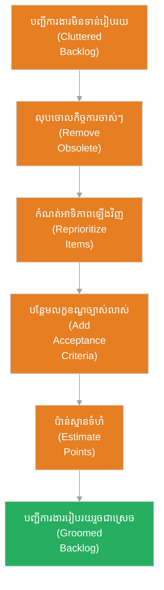

# ការ​កែលម្អ​បញ្ជីការងារ (Sprint Refinement / Backlog Grooming)

**អ្នកនិពន្ធ (Author):** ichamrong 
**កាលបរិច្ឆេទ (Date):** 2026-05-29 
**ស្លាក (Tags):** #agile #scrum #backlog-grooming #sprint-refinement #project-management 
**ប្រភេទ (Category):** Management & Leadership 
**រយៈពេលអាន (Read Time):** ~៥ នាទី (~5 min) 

---

## 📌 មាតិកា (Table of Contents)
- [១. តើ​អ្វី​ទៅ​ជា Sprint Refinement? (What is Refinement?)](#1)
- [២. គោលបំណងសំខាន់​នៃ​ការ​កែលម្អ​បញ្ជីការងារ (Primary Goals)](#2)
- [៣. ដំណើរ​ការ​កែលម្អ​បញ្ជីការងារ (The Grooming Process)](#3)
- [៤. លក្ខណៈ​សម្បត្តិ​នៃ​បញ្ជីការងារ​ដែល​ល្អ (DEEP Principle)](#4)

---

## ១. តើ​អ្វី​ទៅ​ជា Sprint Refinement? (What is Refinement?)

**ការ​កែលម្អ​បញ្ជីការងារ (Sprint Refinement ឬ​ហៅថា Backlog Grooming)** គឺជា​សកម្មភាពបន្ត​នៅក្នុង​វិធីសាស្ត្រ Scrum ដែល​ក្រុ​មក​ារងារ និង Product Owner រួមគ្នា​ត្រួតពិនិត្យ ពិភាក្សា និង​កែលម្អ​បញ្ជីការងារផលិតផល (Product Backlog)។ 

គោលបំណង​គឺ​ដើម្បី​ធានាថារឿងរ៉ាវ​អ្នកប្រើប្រាស់ (User Stories) នៅផ្នែក​ខាងលើ​នៃ Backlog គឺ​ច្បាស់លាស់ មាន​ព័ត៌មាន​គ្រប់​គ្រាន់ និង​អាចយក​ទៅ​ធ្វើ​ការ​បាន​ភ្លាម ៗ នៅក្នុង Sprint បន្ទាប់ (បំពេញ​តាម​លក្ខខណ្ឌ DoR)។

---

## ២. គោលបំណងសំខាន់​នៃ​ការ​កែលម្អ​បញ្ជីការងារ (Primary Goals)

* **លុប​ចោលកិច្ច​ការ​លែង​ត្រូវ​ការ (Remove Deprecated Items):** សម្អាតកិច្ច​ការ​ណា​ដែល​លែងផ្តល់តម្លៃដល់ផលិតផល ឬ​អាជីវកម្ម។
* **បន្ថែម​ព័ត៌មាន​លម្អិត (Elaborate Stories):** សរសេរ​លក្ខខណ្ឌទទួលយក​ការ​ងារ (Acceptance Criteria) ឱ្យ​បាន​ច្បាស់លាស់ និង​បញ្ចូល​ឯកសារយោង/ប្លង់រចនា (Wireframes)។
* **កំណត់អាទិភាពឡើងវិញ (Adjust Priority):** ផ្លាស់ប្តូរលំដាប់លំ​ដោយ​នៃ​កិច្ច​ការ​ផ្អែក​លើ​ការ​ផ្លាស់ប្តូរ​របស់​ទីផ្សារ ឬ​យុទ្ធសាស្ត្រ​ថ្មី ៗ ។
* **ប៉ាន់ស្​មាន​ទំហំ​ការ​ងារ (Estimate Effort):** ក្រុ​មក​ារងាររួមគ្នាផ្តល់ពិន្ទុទំហំ (Story Points) ដើម្បី​ងាយស្រួល​ធ្វើ​ផែន​ការ។

---

## ៣. ដំណើរ​ការ​កែលម្អ​បញ្ជីការងារ (The Grooming Process)

---

## ៤. លក្ខណៈ​សម្បត្តិ​នៃ​បញ្ជីការងារ​ដែល​ល្អ (DEEP Principle)

ដើម្បី​ធានាថា Product Backlog ជោគជ័យ ក្រុ​មក​ារងារគួរ​តែ​អនុវត្ត​តាម​គោល​ការ​ណ៍ **DEEP**៖

* **D - Detailed appropriately (មាន​ព័ត៌មាន​លម្អិតសមស្រប):** កិច្ច​ការ​ដែល​ត្រូវ​ធ្វើ​ឆាប់ ៗ ត្រូវ​មាន​ព័ត៌មាន​លម្អិតច្រើន ចំណែកកិច្ច​ការ​អនាគតឆ្ងាយ​មាន​ព័ត៌មាន​លម្អិតតិច។
* **E - Emergent (វិវត្តន៍​ជា​និច្ច):** បញ្ជីការងារ​ត្រូវតែ​ផ្លាស់ប្តូរ និង​បន្ថែម​ថ្មី​ជា​និច្ច​តាម​ស្ថានភាព​ជាក់ស្តែង។
* **E - Estimated (ត្រូវ​បាន​ប៉ាន់ស្​មាន):** កិច្ច​ការ​នីមួយ ៗ ត្រូវតែ​មាន​ការ​ប៉ាន់ស្​មាន​ទំហំសមស្រប។
* **P - Prioritized (មាន​អាទិភាពច្បាស់លាស់):** កិច្ច​ការ​ដែល​មាន​តម្លៃខ្ពស់បំផុត​ត្រូវ​បាន​ដាក់នៅផ្នែក​ខាងលើ​គេបង្អស់។
