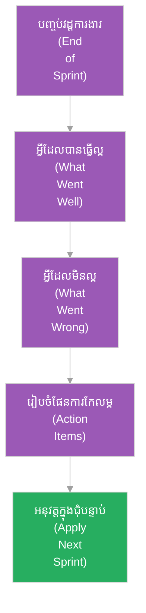

# ការ​រំលឹកឡើងវិញអំ​ពី​វដ្ត​ការ​ងារ (Sprint Retrospective)

**អ្នកនិពន្ធ (Author):** ichamrong 
**កាលបរិច្ឆេទ (Date):** 2026-05-29 
**ស្លាក (Tags):** #agile #scrum #retrospective #self-improvement #project-management 
**ប្រភេទ (Category):** Management & Leadership 
**រយៈពេលអាន (Read Time):** ~៥ នាទី (~5 min) 

---

## 📌 មាតិកា (Table of Contents)
- [១. តើ​អ្វី​ទៅ​ជា Sprint Retrospective? (What is Retrospective?)](#1)
- [២. គោលបំណងសំខាន់​នៃ Retrospective (Primary Goals)](#2)
- [៣. របៀបដំណើរ​ការ Retrospective (The Process)](#3)
- [៤. គន្លឹះ​ដើម្បី​ធ្វើ​ឱ្យ​ការប្រជុំ​មាន​ប្រសិទ្ធភាព (Best Practices)](#4)

---

## ១. តើ​អ្វី​ទៅ​ជា Sprint Retrospective? (What is Retrospective?)

**ការ​រំលឹកឡើងវិញអំ​ពី​វដ្ត​ការ​ងារ (Sprint Retrospective)** គឺជា​ពិធីសារ Scrum ដែល​ធ្វើ​ឡើងនៅចុងបញ្ចប់​នៃ​វដ្ត​ការ​ងារ​នីមួយ ៗ (Sprint) បន្ទាប់​ពី​ការប្រជុំ​បង្ហាញ​លទ្ធផលផលិតផល (Sprint Review)។ 

ខណៈ​ពេល​ដែល Sprint Review ផ្តោត​លើ «អ្វី​ដែល​ក្រុ​មក​ារងារ​បាន​សាងសង់» (លទ្ធផលផលិតផល) Sprint Retrospective ផ្តោត​លើ «របៀប​ដែល​ក្រុ​មក​ារងារ​បាន​ធ្វើ​ការ​ជា​មួយគ្នា» (មនុស្ស ទំនាក់ទំនង ដំណើរ​ការ​ការ​ងារ និង​ឧបករណ៍)។ វា​ជា​យន្ត​ការ​ស្នូល​សម្រាប់​បង្កើត​វប្បធម៌ស្វ័យ-កែលម្អ (Continuous Improvement)។

---

## ២. គោលបំណងសំខាន់​នៃ Retrospective (Primary Goals)

* **ត្រួតពិនិត្យ​ដំណើរ​ការ (Inspect Process):** វាយតម្លៃរបៀប​ដែល​ក្រុ​មក​ារងារ​បាន​ប្រាស្រ័យទាក់ទងគ្នា និង​ដោះស្រាយ​បញ្ហា​ក្នុង​អំឡុង​ពេល​វដ្ត​ការ​ងារ​ចុងក្រោយ។
* **កំណត់ចំណុច​ខ្លាំង​និង​ខ្សោយ (Identify Wins and Pain Points):** ស្វែងរកអ្វី​ដែល​ដំណើរ​ការ​បាន​ល្អ (ដើម្បី​បន្ត​ធ្វើ) និង​អ្វី​ដែល​រាំង​ស្ទះ​ដល់ល្បឿន​អភិវឌ្ឍ​ន៍ (ដើម្បី​កែលម្អ)។
* **បង្កើត​ផែន​ការ​សកម្មភាព​កែលម្អ (Create Actionable Items):** កំណត់យក​បញ្ហា​សំខាន់ ៗ ចំនួន ១ ឬ ២ មក​ដោះស្រាយ និង​បង្កើត​ផែន​ការអនុវត្ត​ន៍ឱ្យ​បាន​ច្បាស់លាស់​នៅក្នុង Sprint បន្ទាប់។

---

## ៣. របៀបដំណើរ​ការ Retrospective (The Process)

---

## ៤. គន្លឹះ​ដើម្បី​ធ្វើ​ឱ្យ​ការប្រជុំ​មាន​ប្រសិទ្ធភាព (Best Practices)

* **វប្បធម៌​មិន​ចង្អុលមុខបន្ទោស (Blameless Culture):** ផ្អែក​លើ​ច្បាប់ចម្បង​របស់ Retrospective៖ *«យើង​ត្រូវ​ជឿ​ជា​ក់ថា​រាល់​សមាជិក​ក្រុម​ទាំងអស់​បាន​បំពេញ​ការ​ងារអស់​ពី​សមត្ថភាព​របស់​ពួកគេហើយ ផ្អែក​លើ​ព័ត៌មាន និង​ធនធាន​ដែល​ពួកគេ​មាន​នៅ​ពេល​នោះ»*។ គោលដៅ​គឺ​ដោះស្រាយ​បញ្ហា មិន​មែនស្វែងរក​អ្នក​ខុស​ដើម្បី​បន្ទោស​ឡើយ។
* **សកម្មភាពច្បាស់លាស់ (SMART Action Items):** ផែន​ការ​កែលម្អ​ត្រូវ​មាន​លក្ខណៈ​ជា​ក់លាក់ អាចវាស់វែង​បាន មាន​អ្នក​ទទួលខុស​ត្រូវ​ច្បាស់លាស់ និង​អាចបញ្ចប់​បាន​ក្នុង Sprint ថ្មី។
* **កុំ​សន្យាច្រើនហួស (Don't Overcommit to Actions):** ជ្រើសរើសសកម្មភាព​កែលម្អ​តែ ១ ឬ ២ ប៉ុណ្ណោះ​ក្នុង​មួយវដ្ត​ការ​ងារ ដើម្បី​ធានាថាវា​ត្រូវ​បាន​អនុវត្ត​ពិតប្រាកដ។
