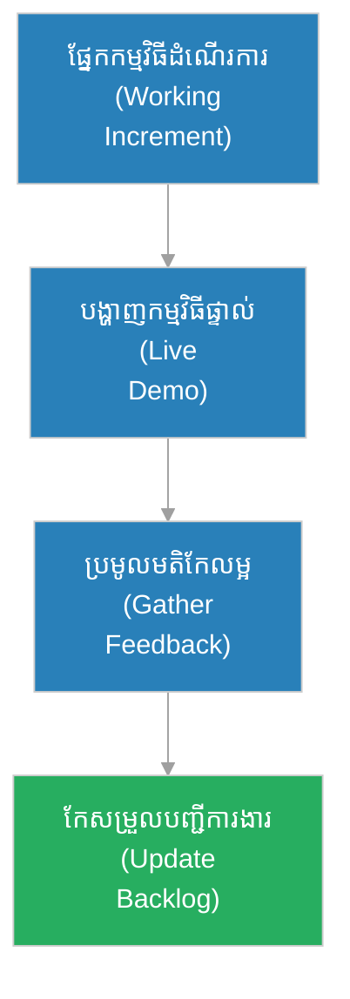

# ការ​បង្ហាញ​លទ្ធផលវដ្ត​ការ​ងារ (Sprint Review / Demo)

**អ្នកនិពន្ធ (Author):** ichamrong 
**កាលបរិច្ឆេទ (Date):** 2026-05-29 
**ស្លាក (Tags):** #agile #scrum #sprint-review #demo #project-management 
**ប្រភេទ (Category):** Management & Leadership 
**រយៈពេលអាន (Read Time):** ~៥ នាទី (~5 min) 

---

## 📌 មាតិកា (Table of Contents)
- [១. តើ​អ្វី​ទៅ​ជា Sprint Review? (What is Sprint Review?)](#1)
- [២. គោលបំណងសំខាន់​នៃ Sprint Review (Primary Goals)](#2)
- [៣. របៀបដំណើរ​ការ Sprint Review (How It Works)](#3)
- [៤. ផលវិបាក​នៃ​ការ​មិន​ធ្វើ Sprint Review (Consequences of Skipping)](#4)

---

## ១. តើ​អ្វី​ទៅ​ជា Sprint Review? (What is Sprint Review?)

**ការ​បង្ហាញ​លទ្ធផលវដ្ត​ការ​ងារ (Sprint Review ឬ Demo)** គឺជា​ពិធីសារ Scrum ដែល​ធ្វើ​ឡើងនៅចុងបញ្ចប់​នៃ​វដ្ត​ការ​ងារ​នីមួយ ៗ (Sprint) មុន​ពេល​ការប្រជុំ Retrospective។ នៅក្នុង​ការប្រជុំ​នេះ ក្រុមការងារអភិវឌ្ឍន៍​បង្ហាញ​ពី​ផ្នែក​កម្មវិធី​ដែល​ដំណើរ​ការ​បាន​ពិតប្រាកដ (Working Increment) ទៅកាន់​ម្ចាស់ផលិតផល (Product Owner) ភាគីពាក់ព័ន្ធ (Stakeholders) និង​អ្នកប្រើប្រាស់​គំរូ។

វា​គឺជា​ការ​ផ្ទៀងផ្ទាត់លទ្ធផលរួមគ្នា ដើម្បី​ធានាថាអ្វី​ដែល​បាន​សាងសង់​ពិត​ជា​បំពេញ​តាម​ការ​ចង់​បាន និង​តម្រូវ​ការ​អាជីវកម្ម​ពិតប្រាកដ។

---

## ២. គោលបំណងសំខាន់​នៃ Sprint Review (Primary Goals)

* **បង្ហាញ​ផ្នែក​កម្មវិធី​ដំណើរ​ការ (Demo Working Software):** បង្ហាញ​កម្មវិធី​ផ្ទាល់ (Live Running App) មិន​មែនគ្រាន់​តែ​បង្ហាញ​ស្លាយ PowerPoint ឡើយ។
* **ប្រមូលមតិ​កែលម្អ​ភ្លាម ៗ (Collect Instant Feedback):** ទទួល​បាន​មតិយោបល់ និង​ការ​វាយតម្លៃ​ដោយ​ផ្ទាល់​ពី​អតិថិជន និង Stakeholders។
* **កែ​សម្រួលផែន​ការ​ផលិតផល (Inspect and Adapt Backlog):** Product Owner សម្រេចចិត្ត​ថាតើ​ត្រូវ​កែ​សម្រួល​បញ្ជីការងារផលិតផល (Product Backlog) យ៉ាង​ដូចម្តេចផ្អែក​លើ​មតិត្រឡប់​ដែល​បាន​ទទួល។

---

## ៣. របៀបដំណើរ​ការ Sprint Review (How It Works)

---

## ៤. ផលវិបាក​នៃ​ការ​មិន​ធ្វើ Sprint Review (Consequences of Skipping)

* **ការ​យល់ខុស​វិសាលភាព (Scope Mismatch):** បើ​គ្មាន​ការ​បង្ហាញ​ជា​ប្រចាំទេ ក្រុ​មក​ារងារអាចនឹងដើរខុសទិសដៅរាប់ខែ ដោយ​សាងសង់អ្វី​ដែល​អតិថិជន​មិន​ចង់​បាន។
* **បាត់បង់​ការ​ទុកចិត្ត​ពី Stakeholders (Loss of Trust):** ភាគីពាក់ព័ន្ធ​មិន​បាន​ឃើញវឌ្ឍនភាព​ជាក់ស្តែង នាំឱ្យពួកគេ​មាន​ការ​សង្ស័យ​លើ​ល្បឿន និង​សមត្ថភាព​របស់​ក្រុ​មក​ារងារ។
* **ការ​កែលម្អ​យឺត​ពេល (Delayed Adaptation):** ការ​មិន​ទទួល​បាន​មតិត្រឡប់ទាន់​ពេល នាំឱ្យបាត់បង់ឱកាស​កែប្រែ​ទិសដៅផលិតផលស្រប​តាម​តម្រូវ​ការ​ទីផ្សារ។
