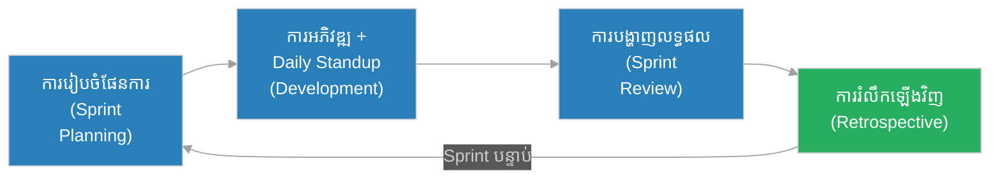
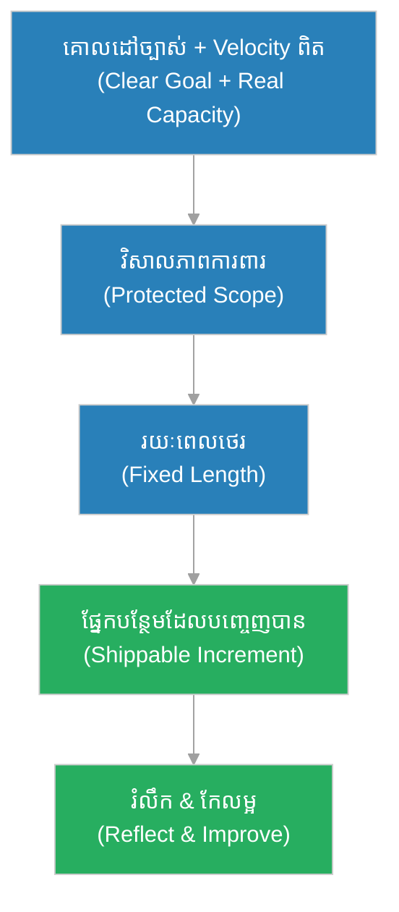

# វ​ដ្ត​ការ​ងារ (Sprint)៖ ដំ​ណើ​រ​អ្នក​នេ​សា​ទ និង​សំ​ណា​ញ់​ដែល​គ្មាន​ព្រំ (The Fisherman & The Net Without Edges)

**អ្នក​និ​ព​ន្ធ (Author):** ichamrong 
**កា​ល​ប​រិ​ច្ឆេ​ទ (Date):** 2026-05-30 
**ស្លា​ក (Tags):** #agile #scrum #sprint #timebox #ceremony #parable 
**ប្រ​ភេ​ទ (Category):** Management & Leadership 
**រ​យៈ​ពេល​អា​ន (Read Time):** ~១​២ នា​ទី (~12 min) 

---

## 📌 មា​តិ​កា (Table of Contents)
- [អ​ន្ទា​ក់​ដំណើរ​ការ (The Process Trap)](#0)
- [១. រឿងប្រៀបប្រដូច៖ អ្នក​នេ​សា​ទ និង​សំ​ណា​ញ់​គ្មាន​ព្រំ (The Parable: The Fisherman & The Net Without Edges)](#1)
- [២. បញ្ហា៖ តើ​អ្វី​ទៅ​ជា Sprint? (The Issue: What is a Sprint?)](#2)
- [៣. ឧ​ទា​ហ​រ​ណ៍​ជា​ក់​ស្​តែ​ង​ក្នុង​ពិ​ភ​ព​ពិត (Real World Examples)](#3)
 - [ឧ​ទា​ហ​រ​ណ៍​ទី ១ — ក​ម្រិ​ត​ស្រា​ល (គ្រួ​សា​រ)៖ ការ​ស​ម្អា​ត​ផ្ទះ​ក្នុង ២ ម៉ោ​ង (The 2-Hour Cleanup)](#3-1)
 - [ឧ​ទា​ហ​រ​ណ៍​ទី ២ — ក​ម្រិ​ត​ម​ធ្យ​ម (ប​ច្ចេ​ក​ទេ​ស)៖ Sprint ២ ស​ប្តា​ហ៍​លើ App (The Two-Week App Cycle)](#3-2)
 - [ឧ​ទា​ហ​រ​ណ៍​ទី ៣ — ក​ម្រិ​ត​ម​ធ្យ​ម (ធុ​រ​កិ​ច្ច)៖ ការ​បើ​ក​ហា​ង​តាម​រ​ល​ក (The Phased Store Launch)](#3-3)
 - [ឧ​ទា​ហ​រ​ណ៍​ទី ៤ — ក​ម្រិ​ត​ម​ធ្យ​ម (គ្រប់​គ្រង)៖ ការ​ប្តេជ្ញា​ចិ​ត្ត​ហួ​ស​ក​ម្លាំ​ង (The Over-Commitment)](#3-4)
 - [ឧ​ទា​ហ​រ​ណ៍​ទី ៥ — ក​ម្រិ​ត​ធ្ង​ន់ (ប្រព័ន្ធ​សំ​ខា​ន់)៖ ការ​ផ្លា​ស់​ប្តូ​រ​វិសាលភាព​ពា​ក់​ក​ណ្តា​ល Sprint (The Mid-Sprint Scope Change)](#3-5)
- [៤. ការ​សន្ទនា​បែ​ប​សា​ក​សួ​រ (Socratic Dialogue)](#4)
- [៥. ដំ​ណោះ​ស្រា​យ៖ ការ​គ្រប់​គ្រង Sprint ឱ្យ​មាន​សុ​ខ​ភា​ព​ល្អ (The Solution: A Healthy Sprint)](#5)
- [សេចក្តី​ស​ន្និ​ដ្ឋា​ន (Conclusion)](#6)
- [ឯ​ក​សា​រ​យោ​ង (References)](#7)
- [Related Posts](#8)

---

## អ​ន្ទា​ក់​ដំណើរ​ការ (The Process Trap)

នៅ​ពេល​ក្រុ​មក​ារងារ​ចង់​ផ​លិ​ត​លឿន ពួ​ក​គេ​តែ​ង​ជា​ប់​អ​ន្ទា​ក់​ពី​រ​យ៉ាង៖

* **អ​ន្ទា​ក់​គ្មាន​ព្រំ (The Endless Trap):** «យើ​ង​ធ្វើ​ទៅ រួ​ច​ពេល​ណា​ក៏​រួ​ច​ពេល​នោះ» — គ្មាន​កំ​ណ​ត់​ពេល គ្មាន​ស​ម្ពា​ធ គ្មាន​ច​ង្វា​ក់។
* **អ​ន្ទា​ក់​ប្តេជ្ញា​ហួ​ស (The Over-Promise Trap):** «យ​ក​ការ​ងារ ៥​០ ចូ​ល​ក្នុង Sprint ២ ស​ប្តា​ហ៍! យើ​ង​ធ្វើ​បាន!» — ហើ​យ​ប​ញ្ច​ប់​ដោយ​ការ​អ​ស់​ក​ម្លាំ​ង និង​គុណភាព​ធ្លា​ក់​ចុះ។

**Sprint** គឺជា​ដំ​ណោះ​ស្រា​យ​រ​វា​ង​អ​ន្ទា​ក់​ទាំ​ង​ពី​រ​នេះ៖ ប្រ​អ​ប់​ពេល​វេលា​ថេ​រ (fixed timebox) ដែល​ផ្ត​ល់​ច​ង្វា​ក់ និង​ព្រំ​ដែ​ន​ច្បាស់លាស់។

---

## ១. រឿងប្រៀបប្រដូច៖ អ្នក​នេ​សា​ទ និង​សំ​ណា​ញ់​គ្មាន​ព្រំ (The Parable: The Fisherman & The Net Without Edges)

នៅ​ភូ​មិន​េ​សា​ទ​មួ​យ មាន​អ្នក​នេ​សា​ទ​ពី​រ​នា​ក់។ អ្នក​នេ​សា​ទ​ទី​មួ​យ​ឈ្មោះ **រិ​ទ្ធី (Rithy)** និ​យា​យ​ថា៖ «ខ្ញុំ​នឹ​ង​ចេ​ញ​ស​មុ​ទ្រ ហើ​យ​ត្រ​ឡ​ប់​មក​វិ​ញ លុះ​ត្រា​តែ​ទូ​ក​ខ្ញុំ​ពេ​ញ​ដោយ​ត្រី — ទោះ ៣ ថ្ងៃ ឬ ៣ ស​ប្តា​ហ៍​ក៏​ដោយ។» គា​ត់​ចេ​ញ​ទៅ ហើ​យ​ដេ​ញ​តាម​ត្រី​ធំ ៗ រ​ហូ​ត រ​ហូ​ត​ស្បៀ​ង​អ​ស់ ឥ​ន្ធ​នៈ​អ​ស់ ហើ​យ​ត្រ​ឡ​ប់​មក​វិ​ញ​ដោយ​អ​ស់​ក​ម្លាំ​ង ដោយ​មិន​ដឹ​ង​ថ្ងៃ​ណា​នឹ​ង​វិ​ល​មក​ផ្ទះ។

អ្នក​នេ​សា​ទ​ទី​ពី​រ​ឈ្មោះ **សុ​ភា (Sophea)** និ​យា​យ​ថា៖ «ខ្ញុំ​ចេ​ញ​ស​មុ​ទ្រ​រៀ​ង​រាល់ព្រឹក ហើ​យ​ត្រ​ឡ​ប់​មក​វិ​ញ​រៀ​ង​រាល់​ល្ងា​ច — រាល់ថ្ងៃ។ ខ្ញុំ​ចា​ប់​បាន​ប៉ុ​ន្មា​ន ខ្ញុំ​យ​ក​មក​ល​ក់​ប៉ុ​ណ្ណោះ។» ដោយសារ​នា​ង​មាន​ព្រំ​ពេល​វេលា​ច្បា​ស់ លោ​ក​អ្នក​ទិ​ញ​ដឹ​ង​ថា​ល្ងា​ច​ណា​មាន​ត្រី​ស្រ​ស់ លោ​ក​នា​ង​សុ​ភា​ដឹ​ង​ថា​ថ្ងៃ​ណា​ចា​ប់​បាន​ច្រើ​ន ថ្ងៃ​ណា​តិ​ច ហើ​យ​អា​ច​កែ​ត​ម្រូ​វ​ក​ន្លែ​ង​នេ​សា​ទ​នៅ​ព្រឹ​ក​ស្អែ​ក។

មួ​យ​ខែ​ក្រោយ លោ​ក​នា​ង​សុ​ភា​បាន​ល​ក់​ត្រី​បាន​ច្រើ​ន​ជា​ង មាន​សុ​ខ​ភា​ព​ល្អ​ជា​ង និង​ស្គា​ល់​ស​មុ​ទ្រ​ច្បា​ស់​ជា​ង​លោ​ក​រិ​ទ្ធី — ពុំ​មែ​ន​ព្រោះ​នា​ង​ខ្លាំង​ជា​ង ប៉ុន្តែ​ព្រោះ **ច​ង្វា​ក់​ថេ​រ​របស់​នា​ង​បង្កើត​ការ​រៀ​ន​សូ​ត្រ និង​ភា​ព​ទុ​ក​ចិ​ត្ត**។

---

## ២. បញ្ហា៖ តើ​អ្វី​ទៅ​ជា Sprint? (The Issue: What is a Sprint?)

**Sprint (វ​ដ្ត​ការ​ងារ)** គឺជា **ប្រ​អ​ប់​ពេល​វេលា​ថេ​រ (timebox)** ដែល​ខ្លី និង​មិន​អា​ច​ព​ន្យា​រ​បាន — ជា​ទូ​ទៅ ១ ទៅ ៤ ស​ប្តា​ហ៍ (ច្រើ​ន​បំ​ផុ​ត​គឺ ២ ស​ប្តា​ហ៍) — ដែល​ក្នុង​នោះ​ក្រុ​មក​ារងារ Scrum បង្កើត​បាន​នូ​វ **ផ្នែ​ក​ប​ន្ថែ​ម (Increment)** ដែល​អា​ច​បញ្ចេញ​បាន។

លក្ខណៈ​ស្នូ​ល​នៃ Sprint គឺ៖
1. **រ​យៈ​ពេល​ថេ​រ (Fixed length)** — ប្រ​វែ​ង​មិន​ផ្លា​ស់​ប្តូ​រ ដើម្បី​បង្កើត​ច​ង្វា​ក់​ដែល​អា​ច​ទា​យ​ទុ​ក​បាន។
2. **គោ​ល​ដៅ​ច្បាស់លាស់ (Sprint Goal)** — គោ​ល​បំ​ណ​ង​តែ​មួ​យ ដែល​ផ្ត​ល់​ទិ​ស​ដៅ។
3. **វិសាលភាព​ការ​ពា​រ (Protected scope)** — គ្មាន​ន​រ​ណា​ប​ន្ថែ​មក​ា​រ​ងា​រ​នៅ​ពា​ក់​ក​ណ្តា​ល Sprint ឡើយ។
4. **មាន​ពិធីការ ៤ (Four ceremonies)** — Planning → Daily Standup → Review → Retrospective។

> **Sprint ខុ​ស​ពី «កំ​ណ​ត់​ពេល​ផ្តា​ច់ (deadline)»៖** Deadline គឺ​ការ​ត្រូវ​ប​ញ្ច​ប់​ការ​ងារ​ច្បា​ស់​លា​ស់​មួ​យ​ត្រឹ​ម​ថ្ងៃ​ណា​មួ​យ។ Sprint ផ្ទុ​យ​ទៅ​វិ​ញ — **ពេល​វេលា​ថេ​រ ប៉ុន្តែ​វិសាលភាព​អា​ច​ប្រែ​ប្រួ​ល** (fixed time, variable scope)។ នេះ​គឺ​ជា [ការ​កំ​ណ​ត់​ពេល​វេលា (Timeboxing)](../practices/timeboxing.md) ដ៏​ប​រិ​សុ​ទ្ធ។

---

## ៣. ឧ​ទា​ហ​រ​ណ៍​ជា​ក់​ស្​តែ​ង​ក្នុង​ពិ​ភ​ព​ពិត

ដើម្បី​យ​ល់​ច្បា​ស់​អំ​ពី Sprint សូ​ម​ពិ​និ​ត្យ​មើ​ល​ក​ម្រិ​ត​ទាំ​ង ៥ ខាងក្រោម៖

---

### ឧ​ទា​ហ​រ​ណ៍​ទី ១ — ក​ម្រិ​ត​ស្រា​ល (គ្រួ​សា​រ)៖ ការ​ស​ម្អា​ត​ផ្ទះ​ក្នុង ២ ម៉ោ​ង (The 2-Hour Cleanup)

* **ស្ថា​ន​ភា​ព៖** គ្រួ​សា​រ​មួ​យ​ចង់​ស​ម្អា​ត​ផ្ទះ​ទាំ​ង​មូ​ល។ ជំ​នួ​ស​ឱ្យ​ការ​និ​យា​យ​ថា «យើ​ង​ស​ម្អា​ត​រ​ហូ​ត​ដ​ល់​ស្អា​ត» (គ្មាន​ព្រំ) ពួ​ក​គេ​កំ​ណ​ត់​ថា៖ «យើ​ង​ស​ម្អា​ត ២ ម៉ោ​ង រួ​ច​ឈ​ប់ ហើ​យ​មើ​ល​ថា​បាន​ប៉ុ​ន្មា​ន។»
* **ល​ទ្ធ​ផ​ល៖** ក្នុង ២ ម៉ោ​ង ពួ​ក​គេ​ផ្តោ​ត​លើ​ប​ន្ទ​ប់​សំ​ខា​ន់ ៗ មុន។ ពេល​អ​ស់​ម៉ោ​ង ផ្ទះ​ស្អា​ត ៨​០% ហើ​យ​គ្រប់​គ្នា​មិន​អ​ស់​ក​ម្លាំ​ង។ ស​ប្តា​ហ៍​ក្រោយ ពួ​ក​គេ​ធ្វើ «Sprint» ២ ម៉ោ​ង​ម្ត​ង​ទៀ​ត​លើ ២​០% ដែល​នៅ​ស​ល់។

---

### ឧ​ទា​ហ​រ​ណ៍​ទី ២ — ក​ម្រិ​ត​ម​ធ្យ​ម (ប​ច្ចេ​ក​ទេ​ស)៖ Sprint ២ ស​ប្តា​ហ៍​លើ App (The Two-Week App Cycle)

* **ស្ថា​ន​ភា​ព៖** ក្រុ​ម​អភិវឌ្ឍ​ន៍ App កំ​ណ​ត់ Sprint រ​យៈ​ពេល ២ ស​ប្តា​ហ៍។ គោ​ល​ដៅ Sprint នេះ៖ «អ្នក​ប្រើប្រាស់​អា​ច​ចុះ​ឈ្មោះ និង​ចូ​ល​ប្រើ​បាន។» ពួ​ក​គេ​ទា​ញ​យ​ក​ការ​ងារ​ត្រឹ​ម​តែ​ប៉ុ​ណ្ណេះ — មិន​យ​ក​មុ​ខ​ងា​រ​ផ្សេ​ង​ឡើយ។
* **ល​ទ្ធ​ផ​ល៖** នៅ​ចុ​ង ២ ស​ប្តា​ហ៍ មុ​ខ​ងា​រ​ចុះ​ឈ្មោះ​ដំណើរ​ការ​ពេ​ញ​លេ​ញ និង​បញ្ចេញ​បាន។ ដោយ​សា​រ​វិសាលភាព​តូ​ច និង​ច្បា​ស់ ក្រុ​ម​ការ​ងារ​បាន​ប​ញ្ច​ប់​ដោយ​គុណភាព​ខ្ព​ស់ ហើ​យ​អា​ច​ប​ន្ត​ Sprint ប​ន្ទា​ប់​លើ​មុ​ខ​ងា​រ​ផ្សេ​ង។

---

### ឧ​ទា​ហ​រ​ណ៍​ទី ៣ — ក​ម្រិ​ត​ម​ធ្យ​ម (ធុ​រ​កិ​ច្ច)៖ ការ​បើ​ក​ហា​ង​តាម​រ​ល​ក (The Phased Store Launch)

* **ស្ថា​ន​ភា​ព៖** ម្ចា​ស់​ហា​ង​អ​ន​ឡា​ញ​ចង់​បើ​ក​ល​ក់​ផលិតផល ១​០​០ មុ​ខ។ ជំ​នួ​ស​ឱ្យ​ការ​រ​ង់​ចាំ​រ​ហូ​ត​ដ​ល់​គ្រប់ ១​០​០ មុ​ខ​រួ​ច​រាល់ គា​ត់​កំ​ណ​ត់ Sprint ១ ស​ប្តា​ហ៍៖ «បើ​ក​ល​ក់ ២​០ មុ​ខ​ដែល​ល​ក់​ដា​ច់​បំ​ផុ​ត​សិ​ន។»
* **ល​ទ្ធ​ផ​ល៖** ហា​ង​បើ​ក​ល​ក់​ក្នុង ១ ស​ប្តា​ហ៍ ហើ​យ​ចា​ប់​ផ្​តើ​ម​រ​ក​ចំ​ណូ​ល​ភ្លា​ម ៗ ។ ម​តិ​ត្រ​ឡ​ប់​ពី​អតិថិជន​ក្នុង Sprint ទី​មួ​យ​ជួ​យ​កែ​ត​ម្រូ​វ​មុ​ខ​ទំ​និ​ញ​សម្រាប់ Sprint ប​ន្ទា​ប់។

---

### ឧ​ទា​ហ​រ​ណ៍​ទី ៤ — ក​ម្រិ​ត​ម​ធ្យ​ម (គ្រប់​គ្រង)៖ ការ​ប្តេជ្ញា​ចិ​ត្ត​ហួ​ស​ក​ម្លាំ​ង (The Over-Commitment)

* **ស្ថា​ន​ភា​ព៖** អ្នក​គ្រប់​គ្រង​ម្នា​ក់​ប​ង្ខំ​ក្រុ​ម​ឱ្យ​យ​ក​ការ​ងារ ៤​០ ពិ​ន្ទុ​ចូ​ល Sprint ខ​ណៈ​ដែល [ល្បឿន​ការ​ងារ (Velocity)](../metrics/velocity.md) ពិត​ប្រា​ក​ដ​របស់​ពួ​ក​គេ​មាន​តែ ២​៥ ពិ​ន្ទុ​ប៉ុ​ណ្ណោះ។
* **ល​ទ្ធ​ផ​ល៖** ក្រុ​មក​ារងារ​ប្រ​ញា​ប់ កា​ត់​ប​ន្ថ​យ​ការ​តេ​ស្ត ហើ​យ​ប​ញ្ច​ប់​ត្រឹ​ម ៣​០ ពិ​ន្ទុ​ដែល​ពោ​រ​ពេ​ញ​ដោយ​កំ​ហុ​ស។ Sprint បរាជ័យ មិន​ត្រឹ​ម​តែ​លើ​ចំ​នួ​ន ប៉ុន្តែ​លើ​គុណភាព​ផ​ង។ មេ​រៀ​ន៖ Sprint ត្រូវ​ប្តេជ្ញា​ផ្អែ​ក​លើ Velocity ពិត ពុំ​មែ​ន​លើ​ការ​ស​ង្ឃឹ​ម។

---

### ឧ​ទា​ហ​រ​ណ៍​ទី ៥ — ក​ម្រិ​ត​ធ្ង​ន់ (ប្រព័ន្ធ​សំ​ខា​ន់)៖ ការ​ផ្លា​ស់​ប្តូ​រ​វិសាលភាព​ពា​ក់​ក​ណ្តា​ល Sprint (The Mid-Sprint Scope Change)

* **ស្ថា​ន​ភា​ព៖** ក្នុង Sprint របស់​ក្រុ​ម​ធ​នា​គា​រ​ឌី​ជី​ថ​ល ម្ចា​ស់​ផលិតផល​ប​ន្ថែ​ម​មុ​ខ​ងា​រ​ថ្មី​ ៣ យ៉ាង​នៅ​ថ្ងៃ​ទី​៥ ដោយ​មិន​លុប​អ្វី​ចេ​ញ។ វិសាលភាព​ការ​ការ​ពា​រ​នៃ Sprint ត្រូវ​បាន​បំ​ពា​ន។
* **ល​ទ្ធ​ផ​ល៖** គោ​ល​ដៅ Sprint ​ដើ​ម​ត្រូវ​បាន​បំ​ភ្លេ​ច ការ​ងារ​ទាំ​ង​អ​ស់​ធ្វើ​មិន​ច​ប់ ហើ​យ​មុ​ខ​ងា​រ​ទូ​ទា​ត់​ប្រា​ក់​ (ដែល​សំ​ខា​ន់​បំ​ផុ​ត) ត្រូវ​បាន​ដា​ក់​ចេ​ញ​ទាំ​ង​មាន​កំ​ហុ​ស។ ដំ​ណោះ​ស្រា​យ​ត្រឹ​ម​ត្រូវ​គឺ៖ បើ​ការ​ងារ​ថ្មី​ប​ន្ទា​ន់​ខ្លាំង ត្រូវ **បោះ​ប​ង់ Sprint (Sprint cancellation)** ហើ​យ​រៀបចំ​ផែន​ការ​ឡើ​ង​វិ​ញ — មិន​មែ​ន​ញា​ត់​ប​ន្ថែ​ម​ឡើយ។

---

## ៤. ការ​សន្ទនា​បែ​ប​សា​ក​សួ​រ (Socratic Dialogue)

**សិ​ស្ស (អ្នក​គ្រប់​គ្រង​ថ្មី)៖** លោ​ក​គ្រូ ហេ​តុ​អ្វី​បាន​ជា​យើ​ង​មិន​ត្រឹ​ម​តែ​ធ្វើ​ការ​ងារ​រ​ហូ​ត​ដ​ល់​រួ​ច បែ​រ​ជា​កំ​ណ​ត់​ Sprint ​ឱ្យ​ខ្លី​ ៗ ​ធ្វើ​អ្វី?

**គ្រូ៖** សួ​រ​ល្អ។ ប្រា​ប់​ខ្ញុំ​មក — បើ​ខ្ញុំ​ឱ្យ​ឯ​ង​ធ្វើ​ការ​ងារ​មួ​យ​ដែល​«រួ​ច​ពេល​ណា​ក៏​បាន» តើ​ឯ​ង​នឹ​ង​ដឹ​ង​ថា​ឯ​ង​យឺត​នៅ​ពេល​ណា?

**សិ​ស្ស៖** ខ្ញុំ​នឹ​ង​មិន​ដឹ​ង​ឡើយ... ព្រោះ​គ្មាន​ចំ​ណុ​ច​ប្រៀ​ប​ធៀ​ប។

**គ្រូ៖** ត្រឹ​ម​ត្រូវ។ Sprint បង្កើត​ចំ​ណុ​ច​ប្រៀ​ប​ធៀ​ប​ថេ​រ។ រាល់ ២ ស​ប្តា​ហ៍ ឯ​ង​ឃើ​ញ​ថា​ឯ​ង​ធ្វើ​បាន​ប៉ុ​ន្មា​ន។ ចុះ​បើ​Sprint ​នេះ​ឯ​ង​ធ្វើ​បាន​តិ​ច​ជា​ង​Sprint ​មុន តើ​វា​ប្រា​ប់​អ្វី​ឯ​ង?

**សិ​ស្ស៖** វា​ប្រា​ប់​ថា​មាន​អ្វី​មួ​យ​ខុ​ស — ប្រ​ហែ​ល​ជា​មាន​ឧបសគ្គ ឬ​ការ​ប៉ា​ន់​ស្មា​ន​ខុ​ស។

**គ្រូ៖** ឃើ​ញ​ទេ? Sprint មិន​មែ​ន​ជា​ឧ​ប​ក​រ​ណ៍​ប​ង្ខំ​ល្បឿន​ឡើយ — វា​ជា **ឧ​ប​ក​រ​ណ៍​រៀ​ន​សូ​ត្រ (a learning instrument)**។ វា​ប្រែ​ការ​អភិវឌ្ឍ​ឱ្យ​ទៅ​ជា​ការ​ពិ​សោ​ធ​ន៍​តូ​ច ៗ ​ដែល​អា​ច​ទា​យ​បាន។ ចុះ​បើ​ឯ​ង​ប​ន្ថែ​ម​ការ​ងារ​ពា​ក់​ក​ណ្តា​ល​Sprint ​រាល់​ដ​ង វា​នឹ​ង​ប៉ះ​ពា​ល់​អ្វី?

**សិ​ស្ស៖** ការ​ពិ​សោ​ធ​ន៍​នឹ​ង​លែ​ង​ស្អា​ត... ខ្ញុំ​នឹ​ង​លែ​ង​ដឹ​ង​ថា​អ្វី​ដែល​ធ្វើ​ឱ្យ​ល​ទ្ធ​ផ​ល​ប្រែ​ប្រួ​ល។

**គ្រូ៖** ត្រឹ​ម​ត្រូវ​ហើ​យ។ ព្រំ​នៃ Sprint គឺ​ជា​អ្វី​ដែល​ធ្វើ​ឱ្យ​វា​មាន​អ​ត្ថ​ន័​យ។ ដ​ក​ព្រំ​ចេ​ញ ឯ​ង​នឹ​ង​ត្រ​ឡ​ប់​ទៅ​ដូ​ច​អ្នក​នេ​សា​ទ​រិ​ទ្ធី — រ​វ​ល់​ដេ​ញ​ត្រី​ដោយ​មិន​ដឹ​ង​ថ្ងៃ​វិ​ល​មក​ផ្ទះ។

---

## ៥. ដំ​ណោះ​ស្រា​យ៖ ការ​គ្រប់​គ្រង Sprint ឱ្យ​មាន​សុ​ខ​ភា​ព​ល្អ (The Solution: A Healthy Sprint)

ដើម្បី​ឱ្យ Sprint ផ្ត​ល់​ត​ម្លៃ ក្រុ​មក​ារងារ​ត្រូវ​គោ​រ​ព​គោ​ល​ការ​ណ៍​ខាងក្រោម៖

1. **កំ​ណ​ត់​គោ​ល​ដៅ Sprint តែ​មួ​យ​ច្បាស់លាស់ (One clear Sprint Goal):** គ្រប់​ការ​ងារ​ត្រូវ​ប​ម្រើ​គោ​ល​ដៅ​នេះ។
2. **ប្តេជ្ញា​ផ្អែ​ក​លើ Velocity ពិត (Commit on real capacity):** កុំ​ប្តេជ្ញា​លើ​ការ​ស​ង្ឃឹ​ម — ប្តេជ្ញា​លើ​ទិន្នន័យ​ពី Sprint មុន ៗ ។
3. **ការ​ពា​រ​វិសាលភាព (Protect the scope):** គ្មាន​ការ​ងារ​ប​ន្ថែ​ម​ពា​ក់​ក​ណ្តា​ល​Sprint។ ការ​ងារ​ថ្មី​ចូ​ល​ [Product Backlog](../artifacts/product-backlog.md) រ​ង់​ចាំ Sprint ប​ន្ទា​ប់។
4. **រ​ក្សា​រ​យៈ​ពេល​ថេ​រ (Keep the length fixed):** កុំ​ព​ន្យា​រ Sprint ​ដើម្បី​«ប​ញ្ច​ប់​ប​ន្ថែ​ម​ប​ន្តិ​ច»។ ការ​ងារ​ដែល​មិន​ច​ប់​ត្រ​ឡ​ប់​ទៅ Backlog វិ​ញ។
5. **ប​ញ្ច​ប់​ដោយ​ការ​រំ​លឹ​ក (End with reflection):** រាល់ Sprint ប​ញ្ច​ប់​ដោយ [Retrospective](sprint-retrospective.md) ដើម្បី​កែ​ល​ម្អ​Sprint ​ប​ន្ទា​ប់។

---

## 🐇 ធ្លា​ក់​ចូ​ល​ក្នុង​រន្ធទន្សាយ (Enter the Rabbit Hole)

* 🚀 **[ការ​រៀបចំ​ផែន​ការ​វ​ដ្ត​ការ​ងារ (Sprint Planning) ➔](sprint-planning.md)**
* 🚀 **[ការ​រំ​លឹ​ក​ឡើ​ង​វិ​ញ (Sprint Retrospective) ➔](sprint-retrospective.md)**
* 🚀 **[ល្បឿន​ការ​ងារ (Velocity) ➔](../metrics/velocity.md)**
* 🚀 **[ការ​កំ​ណ​ត់​ពេល​វេលា (Timeboxing) ➔](../practices/timeboxing.md)**

---

## សេចក្តី​ស​ន្និ​ដ្ឋា​ន (Conclusion)

> **«ព្រំ​ដែ​ន​មិន​មែ​ន​ជា​ឧបសគ្គ​ឡើយ — វា​ជា​អ្វី​ដែល​ផ្ត​ល់​ទ​ម្រ​ង់ និង​អ​ត្ថ​ន័​យ​ដ​ល់​ការ​ងារ។»**

Sprint បំ​ប្លែ​ង​ការ​អភិវឌ្ឍ​ដ៏​មិន​ច្បា​ស់​លា​ស់​ឱ្យ​ទៅ​ជា​ច​ង្វា​ក់​ដែល​អា​ច​ទា​យ​បាន រៀ​ន​បាន និង​ទុ​ក​ចិ​ត្ត​បាន។ ដូ​ច​លោ​ក​នា​ង​សុ​ភា​ដែល​ត្រ​ឡ​ប់​មក​ផ្ទះ​រាល់​ល្ងា​ច ក្រុ​ម​ការ​ងារ​ដែល​គោ​រ​ព​Sprint ​ដឹ​ង​ច្បា​ស់​ថា​ខ្លួ​ន​ឯ​ង​ឈ​រ​នៅ​ក​ន្លែ​ង​ណា និង​ឆ្ពោះ​ទៅ​ណា។

---

## ឯ​ក​សា​រ​យោ​ង (References)

* **Ken Schwaber & Jeff Sutherland** — *The Scrum Guide* (2020). [scrumguides.org](https://scrumguides.org/)
* **Mike Cohn** — *Agile Estimating and Planning* (2005).

---

## Related Posts

* [ការ​រៀបចំ​ផែន​ការ Sprint (Sprint Planning)](sprint-planning.md) — រ​បៀ​ប​ចា​ប់​ផ្​តើ​ម Sprint ឱ្យ​បាន​ត្រឹ​ម​ត្រូវ។
* [ផ្នែ​ក​ប​ន្ថែ​ម (Increment)](../artifacts/increment.md) — ល​ទ្ធ​ផ​ល​ដែល​អា​ច​បញ្ចេញ​បាន​នៅ​ចុ​ង Sprint។
* [ល្បឿន​ការ​ងារ (Velocity)](../metrics/velocity.md) — រ​បៀ​ប​វា​ស់​ស​ម​ត្ថ​ភា​ព​ពិត​របស់ Sprint។
