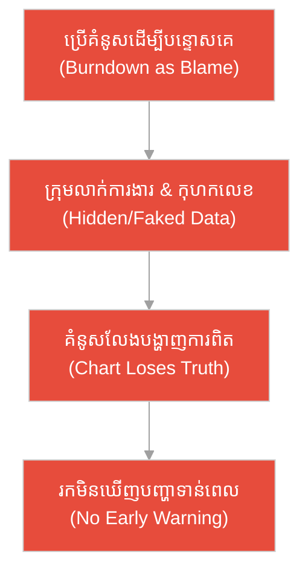
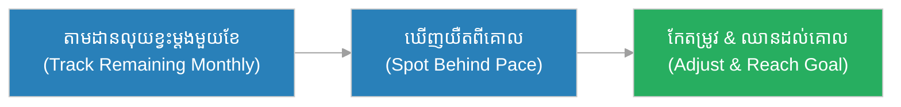
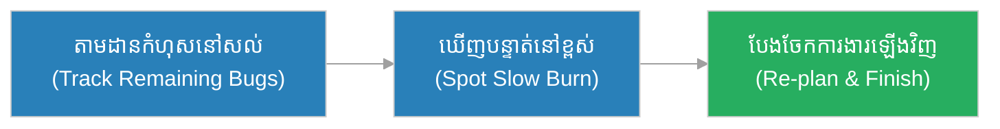
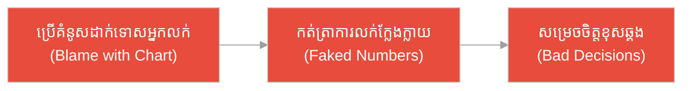
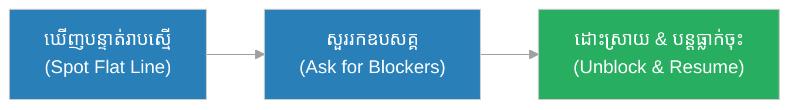
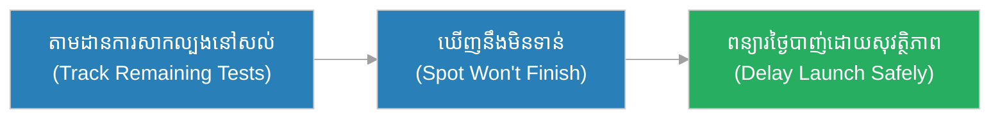
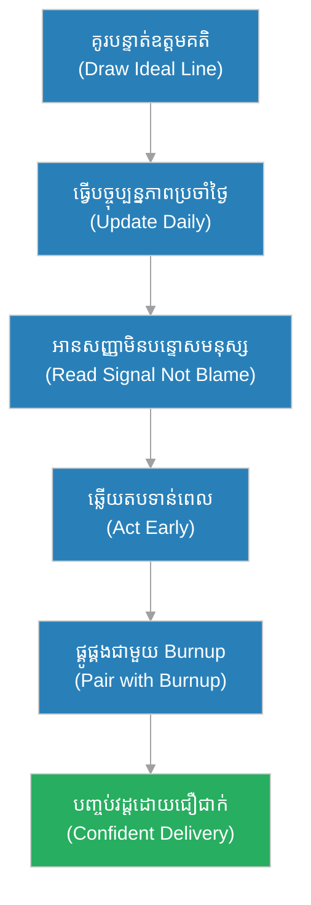

# គំនូសធ្លាក់ចុះ (Burndown Chart)៖ ទៀន​នៃ​យាមរត្រី និង​យាម​ដែល​គ្មាន​គ្រឿងសម្គាល់​ពេល (The Night-Watch Candle & The Watch Without a Marker)

**អ្នកនិពន្ធ (Author):** ichamrong 
**កាលបរិច្ឆេទ (Date):** 2026-05-29 
**ស្លាក (Tags):** #agile #scrum #burndown-chart #parable 
**ប្រភេទ (Category):** Management & Leadership 
**រយៈពេលអាន (Read Time):** ~១២ នាទី (~12 min) 

---

## 📌 មាតិកា (Table of Contents)
- [អន្ទាក់​នៃ​ការ​មើលឃើញ (The Visibility Trap)](#0)
- [១. រឿងប្រៀបប្រដូច៖ ទៀន​នៃ​យាមរត្រី (The Parable: The Night-Watch Candle)](#1)
- [២. បញ្ហា៖ ការ​ប្រើ​គំនូសធ្លាក់ចុះ​ដើម្បី​បន្ទោសគេ (The Issue: Using Burndown to Blame)](#2)
- [៣. ឧទាហរណ៍​ជាក់ស្តែង​ក្នុង​ពិភពពិត (Real World Examples)](#3)
 - [ឧទាហរណ៍​ទី ១ — កម្រិតស្រាល (គ្រួសារ)៖ ការ​សន្សំប្រាក់ទិញម៉ូតូ (The Family Savings Goal)](#3-1)
 - [ឧទាហរណ៍​ទី ២ — កម្រិតមធ្យម (បច្ចេកទេស)៖ ការ​សម្អាត​បំណុលបច្ចេកទេស (The Tech Debt Cleanup)](#3-2)
 - [ឧទាហរណ៍​ទី ៣ — កម្រិតមធ្យម (ធុរកិច្ច)៖ ការ​ផ្តល់សិទ្ធិឱ្យ​អ្នក​លក់ (The Sales Quota Dashboard)](#3-3)
 - [ឧទាហរណ៍​ទី ៤ — កម្រិតមធ្យម (គ្រប់​គ្រង)៖ បន្ទាត់រាបស្មើ​ដែល​គ្មាន​ចលនា (The Flat-Line Warning)](#3-4)
 - [ឧទាហរណ៍​ទី ៥ — កម្រិតធ្ងន់ (ហានិភ័យខ្ពស់)៖ ការ​ត្រៀមបើកដំណើរ​ការ​ផ្កាយរណប (The Satellite Launch Countdown)](#3-5)
- [៤. ការ​សន្ទនាបែបសាកសួរ (Socratic Dialogue: Blame Tool vs. Warning Signal)](#4)
- [៥. ដំណោះស្រាយ៖ ការ​អាន​គំនូសធ្លាក់ចុះ (The Solution: Reading the Burndown)](#5)
- [សេចក្តីសន្និដ្ឋាន (Conclusion)](#6)
- [ឯកសារយោង (References)](#7)
- [Related Posts](#8)

---

## អន្ទាក់​នៃ​ការ​មើលឃើញ (The Visibility Trap)

នៅ​ពេល​តាមដាន​វឌ្ឍនភាព​ការ​ងារ ក្រុ​មក​ារងារ​តែ​ង​តែ​ធ្លាក់ចូល​ទៅ​ក្នុង​ភាពផ្ទុយគ្នា​ពី​រ៖

* **អន្ទាក់​បន្ទោសគេ (The Blame Trap):** «គំនូស​នេះ​បង្ហាញ​ថា​ការ​ងារ​យឺត! នរណា​ជា​មនុស្ស​ដែល​ធ្វើ​ការ​យឺត? ត្រូវ​ដាក់ទោសវា!»
* **អន្ទាក់​ងងឹតភ្នែក (The Blindness Trap):** «កុំ​ខ្វល់​ពី​គំនូស​ណាស់ ធ្វើ​ការ​ទៅ ដល់ថ្ងៃផុតកំណត់ទើបយើងដឹងថា​បាន​ឬ​មិន​បាន!»

---

## ១. រឿងប្រៀបប្រដូច៖ ទៀន​នៃ​យាមរត្រី (The Parable: The Night-Watch Candle)

កាល​ពី​ព្រេងនាយ បន្ទាយមួយ​ត្រូវ​ការ​យា​មក​ារពារទ្វារពេញមួយយប់រហូតដល់ព្រឹក។ ប៉ុន្តែ​នៅ​ពេល​យប់ងងឹត គ្មាន​នរណាដឹងថា ពេល​វេលា​នៅសល់ប៉ុន្​មាន​រហូតដល់ភ្លឺ។ មេយាមម្នាក់ឈ្មោះ **វិរៈ (Virak)** បាន​បង្កើត​គំនិតមួយ៖ គាត់ដុតទៀនមួយ​ដែល​មាន​ឆ្នូតសម្គាល់​ជា​រង្វង់ ៗ — ឆ្នូតមួយ = មួយម៉ោង​នៃ​យប់។

ពេល​ទៀនរលាយ ធ្លាក់ចុះ ឆ្នូតម្តងមួយ ៗ យាម​នីមួយ ៗ មើលឃើញភ្លាមថា «យប់នៅសល់ ៣ ឆ្នូត» ឬ «នៅសល់​តែ ១ ឆ្នូត»។ ដោយ​ឃើញទៀនធ្លាក់ចុះ​លឿន​ជា​ង​ការ​ត្រួតពិនិត្យ វិរៈ​បាន​បញ្ជូនយាមបន្ថែម និង​ពន្​លឿន​ល្បាត​ការ​ពារទ្វារ ដោយ​ដឹង​ជា​មុន​ថា ពេល​វេលា​ជិតអស់ហើយ។ ទ្វារ​ត្រូវ​បាន​ការ​ពារ​យ៉ាង​មាំមួនរហូតដល់ភ្លឺ។

ផ្ទុយ​ទៅ​វិញ បន្ទាយម្នាក់ទៀត​គ្មាន​ទៀនសម្គាល់​ពេល​ឡើយ។ ពួកយាម​ធ្វើ​ល្បាត​តាម​អារម្មណ៍ ដោយ​គិតថា «យប់នៅវែងឆ្ងាយ»។ ពេល​រះព្រឹក​មក​ដល់ភ្លាម ៗ ពួកគេភ្ញាក់ផ្អើល ហើយទុកទ្វារចោល​ដោយ​គ្មាន​ការ​ការ​ពារ — ដោយសារ​ពួកគេ​មិន​ដឹងថា ពេល​វេលា​កំពុងរត់អស់។

---

## ២. បញ្ហា៖ ការ​ប្រើ​គំនូសធ្លាក់ចុះ​ដើម្បី​បន្ទោសគេ (The Issue: Using Burndown to Blame)

នៅក្នុង Agile, **គំនូសធ្លាក់ចុះ (Burndown Chart)** គឺជា​ក្រាហ្វិក​ដែល​បង្ហាញ «ការ​ងារនៅសល់» (Remaining Work) ធៀបនឹង «ពេល​វេលា​នៅសល់» (Time Remaining) — ដូចជា​ទៀន​របស់​វិរៈ ដែល​រលាយធ្លាក់ចុះម្តងបន្តិច ៗ ។ វា​ជា «សញ្ញា​ព្រ​មាន​ដំបូង» (Early-Warning Signal) ដែល​ក្រុ​មក​ារងារទាំងមូលចែករំលែកគ្នា។

កំហុសធំបំផុត​គឺ​ការ​ច្រឡំថា គំនូស​នេះ​ជា «ឧបករណ៍​សម្រាប់​បន្ទោស​អ្នក​អភិវឌ្ឍ​ន៍​យឺត»។ នៅ​ពេល​អ្នក​គ្រប់​គ្រងប្រើវា​ដើម្បី​ដាក់ទោសមនុស្ស ក្រុ​មក​ារងារនឹងលាក់​ការ​ងារ ឬ​កុហកលេខ ហើយទៀន​នោះ​ក៏លែង​បង្ហាញ​ការ​ពិត​ទៀតហើយ។

---

## ៣. ឧទាហរណ៍​ជាក់ស្តែង​ក្នុង​ពិភពពិត

សូមពិនិត្យមើលរបៀប​ដែល​គំនូសធ្លាក់ចុះ ជះឥទ្ធិពលដល់កម្រិតជីវិត និង​ការ​ងារទាំង ៥ ខាងក្រោម៖

---

### ឧទាហរណ៍​ទី ១ — កម្រិតស្រាល (គ្រួសារ)៖ ការ​សន្សំប្រាក់ទិញម៉ូតូ (The Family Savings Goal)

* **ស្ថានភាព៖** គ្រួសារមួយ​ចង់​សន្សំ ៦,០០០ ដុល្លារទិញម៉ូតូ​ក្នុង ៦ ខែ។ ពួកគេគូរបន្ទាត់ឧត្តមគតិធ្លាក់ចុះ (១,០០០ ដុល្លារ/ខែ) ហើយគូសចំនួនលុយ​ដែល​នៅខ្វះម្តងមួយខែ ដើម្បី​មើលថា តើ​ពួកគេនៅ​តាម​ផ្លូវ​ត្រូវ ឬ​យឺត។
* **លទ្ធផល៖** នៅខែទី ៣ ពួកគេឃើញបន្ទាត់ខ្ពស់​ជា​ងគោល (សន្សំតិច) ក៏កាត់បន្ថយ​ការ​ចំណាយភ្លាម ៗ ហើយឈានដល់គោលដៅទាន់​ពេល។

---

### ឧទាហរណ៍​ទី ២ — កម្រិតមធ្យម (បច្ចេកទេស)៖ ការ​សម្អាត​បំណុលបច្ចេកទេស (The Tech Debt Cleanup)

* **ស្ថានភាព៖** ក្រុម​មាន ៥០ ពិន្ទុ​នៃ​កំហុស (Bugs) ដែល​ត្រូវ​សម្អាត​ក្នុង ១ វដ្ត។ ពួកគេ​តាមដាន​គំនូសធ្លាក់ចុះ​ប្រចាំថ្ងៃ ដើម្បី​មើលថា ការ​ងារនៅសល់ ធ្លាក់ចុះ​តាម​ល្បឿនត្រឹម​ត្រូវ ឬ​អត់។
* **លទ្ធផល៖** នៅថ្ងៃទី ៣ បន្ទាត់នៅខ្ពស់ ក្រុមដឹងថា មាន​កំហុសលាក់កំបាំង​ថ្មី ៗ ក៏ប្រជុំ និង​បែងចែក​ការ​ងារឡើងវិញ ដើម្បី​បញ្ចប់វដ្តទាន់​ពេល។

---

### ឧទាហរណ៍​ទី ៣ — កម្រិតមធ្យម (ធុរកិច្ច)៖ ការ​ផ្តល់សិទ្ធិឱ្យ​អ្នក​លក់ (The Sales Quota Dashboard)

* **ស្ថានភាព៖** ប្រធានផ្នែកលក់ប្រើ​គំនូសធ្លាក់ចុះ ដើម្បី​ដាក់ទោស​អ្នក​លក់​ដែល​បន្ទាត់នៅខ្ពស់ ដោយ​ស្រែកថ្កោលនៅ​ពេល​ប្រជុំ ជំនួសឱ្យ​ការ​សួរថា «តើ​មាន​ឧបសគ្គអ្វី?»។
* **លទ្ធផល៖** អ្នក​លក់ចាប់ផ្​តើ​មក​ត់ត្រា​ការ​លក់ក្លែងក្លាយ ដើម្បី​ឱ្យបន្ទាត់មើល​ទៅ​ល្អ។ គំនូស​លែង​បង្ហាញ​ការ​ពិត ហើយក្រុមហ៊ុន​ធ្វើ​ការ​សម្រេចចិត្តខុសផ្អែក​លើ​ទិន្នន័យ​ក្លែងក្លាយ។

---

### ឧទាហរណ៍​ទី ៤ — កម្រិតមធ្យម (គ្រប់​គ្រង)៖ បន្ទាត់រាបស្មើ​ដែល​គ្មាន​ចលនា (The Flat-Line Warning)

* **ស្ថានភាព៖** Scrum Master កត់សម្គាល់ឃើញបន្ទាត់​គំនូស​រាបស្មើ (Flat Line) ៣ ថ្ងៃ​ជា​ប់គ្នា — ការ​ងារនៅសល់​មិន​ធ្លាក់ចុះសោះ។ ជំនួសឱ្យ​ការ​បន្ទោស គាត់សួរក្រុមថា «តើ​មាន​ឧបសគ្គអ្វី​ដែល​រារាំង​យើង?»។
* **លទ្ធផល៖** ក្រុមបង្ហើបថា ពួកគេកំពុងរង់ចាំ API ពី​ក្រុមផ្សេង។ Scrum Master ដោះស្រាយឧបសគ្គ​នោះ ហើយបន្ទាត់ចាប់ផ្​តើ​មធ្លាក់ចុះវិញ។

---

### ឧទាហរណ៍​ទី ៥ — កម្រិតធ្ងន់ (ហានិភ័យខ្ពស់)៖ ការ​ត្រៀមបើកដំណើរ​ការ​ផ្កាយរណប (The Satellite Launch Countdown)

* **ស្ថានភាព៖** ក្រុមវិស្វកររៀបចំ​ការ​ងារសាកល្បងសុវត្ថិភាពចំនួន ២០០ មុខងារ មុន​ថ្ងៃបាញ់បង្ហោះផ្កាយរណប។ គំនូសធ្លាក់ចុះ​បង្ហាញ​ការ​ងារសាកល្បងនៅសល់ ធៀបនឹងថ្ងៃរាប់ថយ​ក្រោយ (Countdown)។
* **លទ្ធផល៖** នៅ ២ សប្តាហ៍​មុន​បាញ់ បន្ទាត់នៅខ្ពស់​ខ្លាំង ក្រុមដឹងភ្លាមថា ការ​សាកល្បងនឹង​មិន​ទាន់ ក៏ពន្យារថ្ងៃបាញ់ ការ​ពារផ្កាយរណប​ពី​ការ​បាញ់បង្ហោះដ៏គ្រោះថ្នាក់ ដែល​អាចខាតបង់រាប់រយលានដុល្លារ។

---

## ៤. ការ​សន្ទនាបែបសាកសួរ (Socratic Dialogue: Blame Tool vs. Warning Signal)

**សិស្ស (Scrum Master ថ្មី)៖** លោកគ្រូ! នៅ​ពេល​គំនូសធ្លាក់ចុះ​បង្ហាញ​ថា​ការ​ងារ​យឺត តើ​ខ្ញុំគួរប្រាប់​អ្នក​គ្រប់​គ្រងថា នរណា​ជា​មនុស្ស​ដែល​ធ្វើ​ការ​យឺត​មែនទេ?

**គ្រូ (Agile Coach)៖** សួរ​បាន​ល្អ។ ខ្ញុំសុំសួរវិញ៖ ពេល​យាមរត្រីមើលឃើញទៀនធ្លាក់ចុះ​លឿន​ពេក តើ​គាត់គួរស្តីបន្ទោសទៀន ឬ​គួររៀបចំ​ការ​ពារទ្វារ?

**សិស្ស៖** ពិត​ណាស់គាត់គួររៀបចំ​ការ​ពារ មិន​មែនស្តីបន្ទោសទៀនទេ។ ទៀនគ្រាន់​តែ​ប្រាប់គាត់​ពី​ការ​ពិត។

**គ្រូ៖** ត្រឹម​ត្រូវ។ ឥឡូវ ប្រសិនបើយាមដាក់ទោសទៀន រួចលាបក្រមួនបន្ថែម ដើម្បី​ឱ្យទៀនមើល​ទៅ​ធ្លាក់ចុះ​យឺត តើ​ទៀន​នោះ​នៅប្រាប់​ការ​ពិត​ទៀតទេ?

**សិស្ស៖** អត់ទេ ទៀន​នោះ​ក្លាយ​ជា​ការ​កុហក ហើយយាមនឹងភ្ញាក់ផ្អើលនៅ​ពេល​ព្រឹករះ។

**គ្រូ៖** ដូចគ្នាហ្នឹង! នៅ​ពេល​ឯងប្រើ​គំនូស​ដើម្បី​បន្ទោសមនុស្ស ពួកគេនឹង «លាបក្រមួន» — ពោល​គឺ​កុហកលេខ ដើម្បី​ឱ្យបន្ទាត់មើល​ទៅ​ល្អ។ បន្ទាប់​មក គំនូស​លែង​ជា​សញ្ញា​ព្រ​មាន ហើយក្រុមនឹងភ្ញាក់ផ្អើលនៅ​ពេល​ផុតកំណត់។

**សិស្ស៖** ដូច្​នេះ ខ្ញុំគួរប្រើ​គំនូស​ដើម្បី​សួរ «តើ​មាន​ឧបសគ្គអ្វី?» ជា​ជា​ង «នរណាខុស?»។

**គ្រូ៖** ពិតប្រាកដ! គំនូសធ្លាក់ចុះ​មិន​មែន​ជា​សាលាក្តី​ឡើយ ប៉ុន្តែ​វា​ជា​ទៀន​នៃ​ក្រុ​មក​ារងារ — ជា​សញ្ញា​ព្រ​មាន​ដែល​គ្រប់​គ្នាចែករំលែក ដើម្បី​សម្របសម្រួល​គ្នា​មុន​ពេល​យប់អស់។

---

## ៥. ដំណោះស្រាយ៖ ការ​អាន​គំនូសធ្លាក់ចុះ (The Solution: Reading the Burndown)

ដើម្បី​ប្រើ​គំនូសធ្លាក់ចុះ​ឱ្យ​បាន​ត្រឹម​ត្រូវ ក្រុ​មក​ារងារ​ត្រូវ​អនុវត្តគោល​ការ​ណ៍​ខាងក្រោម៖

1. **គូរបន្ទាត់ឧត្តមគតិ (Draw the Ideal Line):** គូរបន្ទាត់ត្រង់​ពី​ការ​ងារសរុបនៅថ្ងៃដំបូង ទៅ​សូន្យនៅថ្ងៃ​ចុងក្រោយ ដើម្បី​ប្រៀបធៀប​ជា​មួយ​ការ​ងារ​ពិត។
2. **ធ្វើ​បច្ចុប្បន្នភាព​ប្រចាំថ្ងៃ (Update Daily):** កត់ត្រា​ការ​ងារនៅសល់ (Remaining Work) ជា​រៀង​រាល់ថ្ងៃ ដូចទៀនរលាយម្តងមួយឆ្នូត។
3. **អាន​សញ្ញា​មិន​មែនបន្ទោសមនុស្ស (Read Signals, Not People):** បន្ទាត់នៅខ្ពស់ ឬ​រាបស្មើ មិន​មែន​ជា «កំហុស​របស់​នរណាម្នាក់» ឡើយ ប៉ុន្តែ​ជា​សញ្ញា​សួររកឧបសគ្គ។
4. **ឆ្លើយតប​ទាន់​ពេល (Act Early):** នៅ​ពេល​ឃើញនិន្នា​ការ​មិន​ល្អ ត្រូវ​កែ​ផែន​ការ ដោះស្រាយឧបសគ្គ ឬ​ចរចា​វិសាលភាព មុន​ពេល​ផុតកំណត់។
5. **ផ្គូផ្គង​ជា​មួយ Burnup (Pair with Burnup):** ដោយសារ Burndown មិន​បង្ហាញ​ការ​ផ្លាស់ប្តូរ​វិសាលភាព ត្រូវ​ប្រើ​ជា​មួយ Burnup ដើម្បី​មើលឃើញពេញលេញ។

---

## 🐇 ធ្លាក់ចូល​ក្នុង​រន្ធទន្សាយ (Enter the Rabbit Hole)

ដើម្បី​យល់ដឹងកាន់​តែ​ស៊ីជម្រៅអំ​ពី​ការ​តាមដាន​វឌ្ឍនភាព និង​ការ​វាស់ល្បឿនក្រុ​មក​ារងារ សូមស្វែងយល់បន្ថែម៖

* 🚀 **[គំនូសឡើងលើ (Burnup Chart) ➔](./burnup-chart.md)**
* 🚀 **[ល្បឿនក្រុ​មក​ារងារ (Velocity) ➔](./velocity.md)**
* 🚀 **[ការ​រៀបចំផែន​ការ​វដ្ត​ការ​ងារ (Sprint Planning) ➔](../ceremonies/sprint-planning.md)**

---

## សេចក្តីសន្និដ្ឋាន (Conclusion)

> **«គំនូសធ្លាក់ចុះ​មិន​មែន​ជា​សាលាក្តី​សម្រាប់​ដាក់ទោសមនុស្ស​យឺត​ឡើយ ប៉ុន្តែ​វា​ជា​ទៀន​នៃ​យាមរត្រី — សញ្ញា​ព្រ​មាន​ដែល​ក្រុមទាំងមូលចែករំលែក មុន​ពេល​យប់អស់។»**

ការ​អាន​គំនូសធ្លាក់ចុះ​ដ៏ត្រឹម​ត្រូវ ជួយឱ្យក្រុ​មក​ារងារមើលឃើញ​ពេល​វេលា​នៅសល់ ធៀបនឹង​ការ​ងារនៅសល់ ដោយ​ឆ្លើយតប​ទាន់​ពេល​វេលា មុន​ពេល​ដែល​ព្រឹករះ​មក​ដល់​ដោយ​ការ​ងារនៅ​មិន​ទាន់រួច​រាល់។

---

## ឯកសារយោង (References)

* **Ken Schwaber & Jeff Sutherland** — *The Scrum Guide* (2020).
* **Mike Cohn** — *Agile Estimating and Planning* (2005).

---

## Related Posts

* [គំនូសឡើងលើ (Burnup Chart)](./burnup-chart.md) — របៀប​បង្ហាញ​ការ​ងារ​ដែល​រួច​រាល់ និង​វិសាលភាព​ទាំងមូល ដែល Burndown លាក់។
* [ល្បឿនក្រុ​មក​ារងារ (Velocity)](./velocity.md) — របៀបវាស់ល្បឿនបញ្ចប់​ការ​ងារ ដើម្បី​ព្យាករណ៍​ការ​ធ្លាក់ចុះ។
* [ការ​រៀបចំផែន​ការ​វដ្ត​ការ​ងារ (Sprint Planning)](../ceremonies/sprint-planning.md) — របៀបកំណត់​ការ​ងារសរុបនៅដើមវដ្ត ដែល​ជា​ចំណុចចាប់ផ្​តើ​ម​នៃ​គំនូស។
