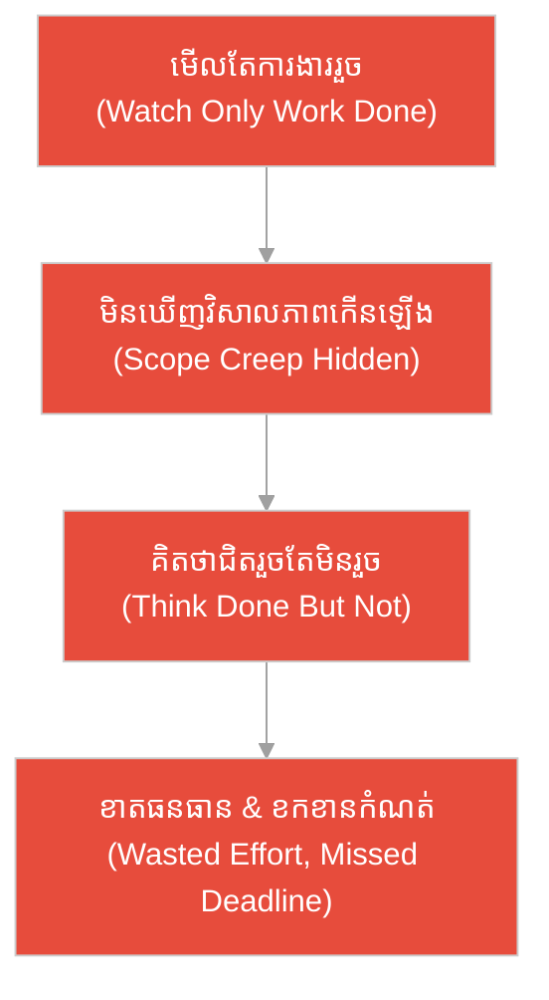
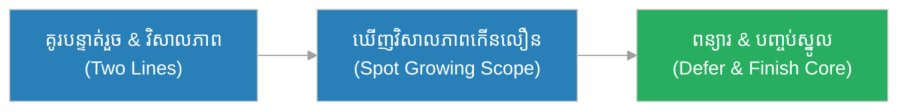
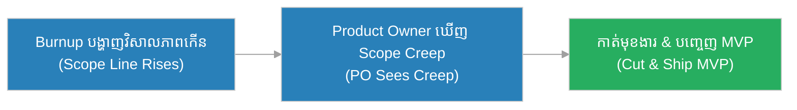
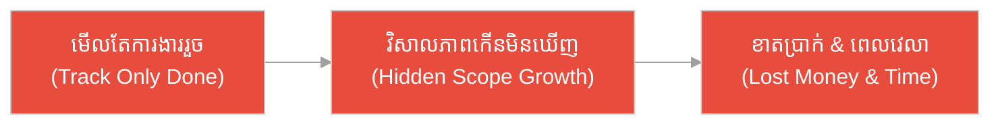
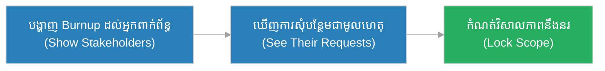
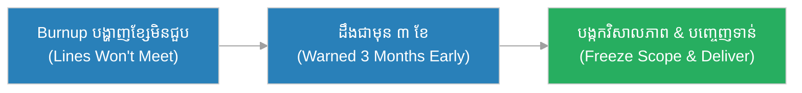
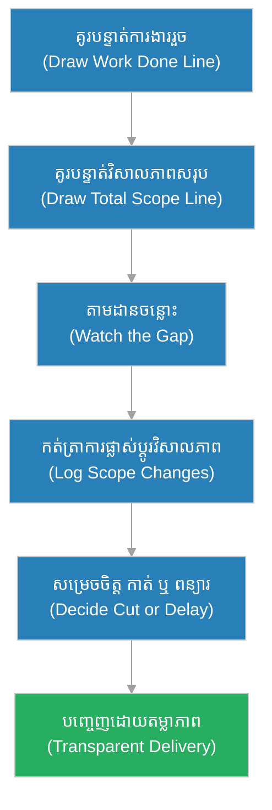

# គំនូសឡើងលើ (Burnup Chart)៖ អណ្តូង​ដែល​គេ​លើ​កមាត់ និង​ភូមិ​ដែល​មើល​តែ​ទឹក (The Well With a Rising Rim & The Village That Watched Only the Water)

**អ្នកនិពន្ធ (Author):** ichamrong 
**កាលបរិច្ឆេទ (Date):** 2026-05-29 
**ស្លាក (Tags):** #agile #scrum #burnup-chart #parable 
**ប្រភេទ (Category):** Management & Leadership 
**រយៈពេលអាន (Read Time):** ~១២ នាទី (~12 min) 

---

## 📌 មាតិកា (Table of Contents)
- [អន្ទាក់​នៃ​វិសាលភាព (The Scope Trap)](#0)
- [១. រឿងប្រៀបប្រដូច៖ អណ្តូង​ដែល​គេ​លើ​កមាត់ (The Parable: The Well With a Rising Rim)](#1)
- [២. បញ្ហា៖ ការ​ច្រឡំ Burnup នឹង Burndown (The Issue: Confusing Burnup with Burndown)](#2)
- [៣. ឧទាហរណ៍​ជាក់ស្តែង​ក្នុង​ពិភពពិត (Real World Examples)](#3)
 - [ឧទាហរណ៍​ទី ១ — កម្រិតស្រាល (គ្រួសារ)៖ ការ​សាងសង់សួនច្បារ​ក្រោយ​ផ្ទះ (The Backyard Garden Build)](#3-1)
 - [ឧទាហរណ៍​ទី ២ — កម្រិតមធ្យម (បច្ចេកទេស)៖ ការ​បន្ថែមមុខងារ MVP ឥតឈប់ (The Creeping MVP Features)](#3-2)
 - [ឧទាហរណ៍​ទី ៣ — កម្រិតមធ្យម (ធុរកិច្ច)៖ កិច្ចសន្យា​សេវាកម្ម​ដែល​រីកធំ (The Bloating Service Contract)](#3-3)
 - [ឧទាហរណ៍​ទី ៤ — កម្រិតមធ្យម (គ្រប់​គ្រង)៖ ការ​បង្ហាញ​វិសាលភាព​ដល់​អ្នក​ពាក់ព័ន្ធ (The Stakeholder Scope Reveal)](#3-4)
 - [ឧទាហរណ៍​ទី ៥ — កម្រិតធ្ងន់ (ហានិភ័យខ្ពស់)៖ ការ​សាងសង់​ប្រព័ន្ធ​បោះឆ្នោតថ្នាក់​ជា​តិ (The National Election System)](#3-5)
- [៤. ការ​សន្ទនាបែបសាកសួរ (Socratic Dialogue: Same Picture vs. Hidden Scope)](#4)
- [៥. ដំណោះស្រាយ៖ ការ​អាន​គំនូសឡើងលើ (The Solution: Reading the Burnup)](#5)
- [សេចក្តីសន្និដ្ឋាន (Conclusion)](#6)
- [ឯកសារយោង (References)](#7)
- [Related Posts](#8)

---

## អន្ទាក់​នៃ​វិសាលភាព (The Scope Trap)

នៅ​ពេល​តាមដាន​វឌ្ឍនភាព​គម្រោង ក្រុ​មក​ារងារ​តែ​ង​តែ​ធ្លាក់ចូល​ទៅ​ក្នុង​ភាពផ្ទុយគ្នា​ពី​រ៖

* **អន្ទាក់​មើល​តែ​ការ​ងាររួច (The Done-Only Trap):** «យើងបញ្ចប់​ការ​ងារច្រើនណាស់ហើយ! យើងជិតរួចហើយ មិន​បាច់ខ្វល់​ពី​វិសាលភាព​ទៀតទេ!»
* **អន្ទាក់​ស្ងាត់ស្ងៀម​ពី​ការ​បន្ថែម (The Silent-Scope Trap):** «បន្ថែមមុខងារ​នេះ មុខងារ​នោះ កុំ​ខ្វល់... វា​ជា​ការ​ងារតូច​តែ​ប៉ុណ្ណោះ មិន​ប៉ះពាល់ផែន​ការ​ទេ!»

---

## ១. រឿងប្រៀបប្រដូច៖ អណ្តូង​ដែល​គេ​លើ​កមាត់ (The Parable: The Well With a Rising Rim)

កាល​ពី​ព្រេងនាយ ភូមិមួយ​ត្រូវ​ការ​បំពេញអណ្តូងស្ងួតមួយឱ្យពេញ ដោយ​ដងទឹក​មក​ចាក់ធុងម្តងបន្តិច ៗ ។ មេភូមិម្នាក់ឈ្មោះ **សុភា (Sophea)** បាន​សម្គាល់រឿងចម្លែកមួយ៖ ខណៈ​ដែល​កម្​មក​រម្នាក់ចាក់ទឹកបន្ថែម (កម្រិតទឹក «ឡើង​លើ») នោះ កម្​មក​រម្នាក់ទៀតបន្តពង្រីកមាត់អណ្តូងឱ្យខ្ពស់ឡើង ៗ (វិសាលភាព «ឡើង​លើ» ដែរ)។

សុភាក៏សម្រេចចិត្តគូរ «បន្ទាត់​ពី​រ» នៅជញ្​ជា​ំងអណ្តូង៖ បន្ទាត់មួយ​តាមដាន​កម្រិតទឹក (ការ​ងាររួច) និង​បន្ទាត់មួយទៀត​តាមដាន​កម្ពស់មាត់អណ្តូង (វិសាលភាព​សរុប)។ ដោយ​ឃើញបន្ទាត់ទាំង​ពី​រ គាត់ដឹងភ្លាមថា មាត់អណ្តូងកំពុងឡើង​លឿន​ជា​ងទឹក — នេះ​គឺជា «ការ​រុករាន​វិសាលភាព» (Scope Creep)។ គាត់ក៏ឈប់​ការ​លើ​កមាត់ ហើយផ្តោត​លើ​ការ​ដងទឹក រហូតអណ្តូងពេញ។

ផ្ទុយ​ទៅ​វិញ ភូមិមួយទៀតមើល​តែ «កម្រិតទឹក» (ការ​ងាររួច) ប៉ុណ្ណោះ ដោយ​មិន​បាន​កត់សម្គាល់ថា មាត់អណ្តូងកំពុង​ត្រូវ​លើ​កខ្ពស់ឡើង ៗ ។ ពួកគេគិតថា «ជិតពេញហើយ!» ប៉ុន្តែ​ជាក់ស្តែង មាត់អណ្តូងឡើង​លឿន​ជា​ងទឹក ហើយអណ្តូង​នោះ​មិន​ដែល​ពេញសោះ — ភូមិទាំងមូលភ្ញាក់ផ្អើល ហើយចំណាយធនធានអស់​ដោយ​ឥតប្រយោជន៍។

---

## ២. បញ្ហា៖ ការ​ច្រឡំ Burnup នឹង Burndown (The Issue: Confusing Burnup with Burndown)

នៅក្នុង Agile, **គំនូសឡើងលើ (Burnup Chart)** គឺជា​ក្រាហ្វិក​ដែល​គូរ «បន្ទាត់​ពី​រ»៖ បន្ទាត់មួយ​បង្ហាញ «ការ​ងារ​ដែល​រួច​រាល់» (Work Done) ដែល​ឡើង​លើ និង​បន្ទាត់មួយទៀត​បង្ហាញ «វិសាលភាព​សរុប» (Total Scope) ដែល​អាចឡើង​លើ​បាន​ដែរ។ វា​ជា «បន្ទាត់​ពី​រ» របស់​សុភា ដែល​លាតត្រដាង​ការ​រុករាន​វិសាលភាព។

កំហុសធំបំផុត​គឺ​ការ​ច្រឡំថា **«Burnup និង Burndown បង្ហាញ​រឿងដូចគ្នា»**។ ការ​ពិត Burndown បង្ហាញ​តែ «ការ​ងារនៅសល់» (បន្ទាត់​តែ​មួយ) ដែល​លាក់​ការ​ផ្លាស់ប្តូរ​វិសាលភាព ខណៈ Burnup បំបែក «ការ​ងាររួច» ចេញ​ពី «វិសាលភាព​សរុប» ដូច្​នេះ​វាលាតត្រដាង Scope Creep ភ្លាម ៗ ។

---

## ៣. ឧទាហរណ៍​ជាក់ស្តែង​ក្នុង​ពិភពពិត

សូមពិនិត្យមើលរបៀប​ដែល​គំនូសឡើងលើ ជះឥទ្ធិពលដល់កម្រិតជីវិត និង​ការ​ងារទាំង ៥ ខាងក្រោម៖

---

### ឧទាហរណ៍​ទី ១ — កម្រិតស្រាល (គ្រួសារ)៖ ការ​សាងសង់សួនច្បារ​ក្រោយ​ផ្ទះ (The Backyard Garden Build)

* **ស្ថានភាព៖** គ្រួសារមួយរៀបចំសួនច្បារ ដោយ​គ្រោងដាំ ១០ ដើមឈើ។ ប៉ុន្តែ​ម្តាយបន្តបន្ថែម «ដាំផ្កា​នេះ ដាក់កៅអី​នោះ ធ្វើ​ស្រះត្រីទៀត» — វិសាលភាព​កើន​ទៅ ២៥ ការ​ងារ។ ប្តីគូរបន្ទាត់​ពី​រ ដើម្បី​បង្ហាញ​ការ​ងាររួច និង​វិសាលភាព​សរុប​ដែល​កំពុងកើន។
* **លទ្ធផល៖** គ្រួសារឃើញច្បាស់ថា ការ​ងារកើន​លឿន​ជា​ង​ការ​ដាំ ក៏​ពិភាក្សា និង​សម្រេចចិត្តពន្យារស្រះត្រី​ទៅ​ឆ្នាំ​ក្រោយ ដើម្បី​បញ្ចប់សួនមូលដ្ឋានទាន់រដូវវស្សា។

---

### ឧទាហរណ៍​ទី ២ — កម្រិតមធ្យម (បច្ចេកទេស)៖ ការ​បន្ថែមមុខងារ MVP ឥតឈប់ (The Creeping MVP Features)

* **ស្ថានភាព៖** ក្រុ​មក​ំពុងសាងសង់ MVP ដែល​គ្រោង​មាន ៣០ ពិន្ទុ។ ប៉ុន្តែ​គ្រប់​ការប្រជុំ មាន​នរណាម្នាក់បន្ថែម «មុខងារតូចមួយ» បន្ថែម — រហូត​វិសាលភាព​កើន​ទៅ ៧០ ពិន្ទុ។ Burnup បង្ហាញ​បន្ទាត់​វិសាលភាព​កើនឡើងខ្ពស់។
* **លទ្ធផល៖** ក្រុម​បង្ហាញ Burnup ដល់ Product Owner ដែល​ឃើញ Scope Creep ច្បាស់ ក៏សម្រេចចិត្តកាត់មុខងារ​មិន​សំខាន់ចេញ ដើម្បី​បញ្ចេញ MVP ទាន់​ពេល។

---

### ឧទាហរណ៍​ទី ៣ — កម្រិតមធ្យម (ធុរកិច្ច)៖ កិច្ចសន្យា​សេវាកម្ម​ដែល​រីកធំ (The Bloating Service Contract)

* **ស្ថានភាព៖** ភ្នាក់ងារទីផ្សារទទួល​គម្រោង​ធ្វើ​គេហ​ទំព័រ ៣ ទំព័រ។ អតិថិជនបន្តស្នើ «បន្ថែម​ទំព័រ​នេះ ប្តូររូបរាង​នោះ» ដោយ​គ្មាន​កិច្ចសន្យាបន្ថែម។ ភ្នាក់ងារមើល​តែ «ការ​ងាររួច» ដោយ​មិន​តាមដាន​វិសាលភាព​កើនឡើង។
* **លទ្ធផល៖** គម្រោង​ពង្រីក​ទៅ ១២ ទំព័រ ដោយ​តម្លៃដ​ដែល។ ភ្នាក់ងារខាតបង់ប្រាក់ និង​ពេល​វេលា​យ៉ាង​ធំ ដោយសារ​មិន​បាន​ឃើញ​វិសាលភាព​កើនឡើងទាន់​ពេល។

---

### ឧទាហរណ៍​ទី ៤ — កម្រិតមធ្យម (គ្រប់​គ្រង)៖ ការ​បង្ហាញ​វិសាលភាព​ដល់​អ្នក​ពាក់ព័ន្ធ (The Stakeholder Scope Reveal)

* **ស្ថានភាព៖** អ្នក​គ្រប់​គ្រង​គម្រោង​បង្ហាញ Burnup ក្នុង Sprint Review។ បន្ទាត់​ការ​ងាររួចឡើងស្អាត ប៉ុន្តែ​បន្ទាត់​វិសាលភាព​ក៏ឡើងស្របគ្នា ដោយសារ​អ្នក​ពាក់ព័ន្ធបន្តស្នើបន្ថែម។
* **លទ្ធផល៖** អ្នក​ពាក់ព័ន្ធយល់ភ្លាមថា ការ​សុំបន្ថែម​របស់​ពួកគេ​ជា​រៀង​រាល់​សប្តាហ៍ ជា​មូលហេតុ «ហេតុអ្វី​មិន​ទាន់រួច»។ ពួកគេក៏ព្រ​មក​ំណត់​វិសាលភាព​ឱ្យនឹងនរ ដើម្បី​បញ្ចេញ​ផលិតផល។

---

### ឧទាហរណ៍​ទី ៥ — កម្រិតធ្ងន់ (ហានិភ័យខ្ពស់)៖ ការ​សាងសង់​ប្រព័ន្ធ​បោះឆ្នោតថ្នាក់​ជា​តិ (The National Election System)

* **ស្ថានភាព៖** ក្រុ​មក​ំពុងសាងសង់​ប្រព័ន្ធ​រាប់សន្លឹកឆ្នោតថ្នាក់​ជា​តិ ដែល​ត្រូវ​រួច​មុន​ថ្ងៃបោះឆ្នោតថេរ។ ស្ថាប័នផ្សេង ៗ បន្តស្នើតម្រូវ​ការ​សុវត្ថិភាព​ថ្មី ៗ ធ្វើ​ឱ្យ​វិសាលភាព​កើនឡើងឥតឈប់។
* **លទ្ធផល៖** Burnup បង្ហាញ​ច្បាស់ថា បន្ទាត់​វិសាលភាព​នឹង​មិន​ជួបបន្ទាត់​ការ​ងាររួចទាន់ថ្ងៃបោះឆ្នោត។ ក្រុមដឹង​ជា​មុន ៣ ខែ ក៏ចរចាបង្កកតម្រូវ​ការ​ថ្មី ការ​ពារប្រទេស​ពី​ការ​បោះឆ្នោត​ដោយ​ប្រព័ន្ធ​មិន​ទាន់រួច។

---

## ៤. ការ​សន្ទនាបែបសាកសួរ (Socratic Dialogue: Same Picture vs. Hidden Scope)

**សិស្ស (អ្នក​គ្រប់​គ្រង​គម្រោង)៖** លោកគ្រូ! ខ្ញុំ​មាន Burndown ស្រាប់ហើយ។ ហេតុអ្វីខ្ញុំ​ត្រូវ​ការ Burnup ទៀត? វាមើល​ទៅ​ដូចគ្នាទេ?

**គ្រូ (Agile Coach)៖** សួរ​បាន​ល្អ។ ខ្ញុំសុំសួរវិញ៖ ប្រសិនបើភូមិមួយដងទឹកចាក់ចូលអណ្តូង ប៉ុន្តែ​មាន​នរណាម្នាក់​លើ​កមាត់អណ្តូងឱ្យខ្ពស់ឡើង​ជា​និច្ច តើ​ការ​មើលត្រឹម​តែ «ទឹកនៅខ្វះប៉ុន្​មាន» គ្រប់​គ្រាន់ទេ?

**សិស្ស៖** ប្រហែល​ជា​អត់ទេ ព្រោះ​បើមាត់អណ្តូងឡើងខ្ពស់ ទឹក​ដែល​ត្រូវ​ការ​ក៏ប្តូរ ប៉ុន្តែ «ទឹកនៅខ្វះ» វាមើល​ទៅ​ដូចថេរ។

**គ្រូ៖** ត្រឹម​ត្រូវ! Burndown បង្ហាញ​តែ «ការ​ងារនៅសល់» — បន្ទាត់​តែ​មួយ។ ប្រសិនបើនរណាបន្ថែ​មក​ារងារ (លើ​កមាត់អណ្តូង) បន្ទាត់​នោះ​អាចមើល​ទៅ​ថេរ ឬ​ឡើងវិញ ដោយ​ឯង​មិន​ដឹងថា ការ​ងារនៅសល់ច្រើន​ព្រោះ «ធ្វើ​តិច» ឬ​ព្រោះ «បន្ថែម​វិសាលភាព»។

**សិស្ស៖** អូ! ដូច្​នេះ Burndown លាក់​ការ​បន្ថែម​វិសាលភាព?

**គ្រូ៖** ពិតប្រាកដ។ Burnup គូរ «បន្ទាត់​ពី​រ» — ការ​ងាររួចមួយ និង​វិសាលភាព​សរុបមួយ។ នៅ​ពេល​បន្ទាត់​វិសាលភាព​កើនឡើង ឯងឃើញ Scope Creep ភ្លាម ៗ ។ នោះ​ហើយ​ជា​អ្វី​ដែល Burndown មិន​អាច​បង្ហាញ​បាន។

**សិស្ស៖** ដូច្​នេះ ពួកវា​មិន​បង្ហាញ​រឿងដូចគ្នា​ឡើយ — Burnup បំបែក​ការ​ងាររួចចេញ​ពី​វិសាលភាព។

**គ្រូ៖** ត្រឹម​ត្រូវ! Burndown ល្អ​សម្រាប់​មើលល្បឿន​ក្នុង​វដ្ត ប៉ុន្តែ Burnup ល្អ​ជា​ង​សម្រាប់​មើល​គម្រោង​វែង ដែល​វិសាលភាព​អាចផ្លាស់ប្តូរ។ ប្រើទាំង​ពី​រ ទើបឃើញពេញលេញ។

---

## ៥. ដំណោះស្រាយ៖ ការ​អាន​គំនូសឡើងលើ (The Solution: Reading the Burnup)

ដើម្បី​ប្រើ​គំនូសឡើងលើ​ឱ្យ​បាន​ត្រឹម​ត្រូវ ក្រុ​មក​ារងារ​ត្រូវ​អនុវត្តគោល​ការ​ណ៍​ខាងក្រោម៖

1. **គូរបន្ទាត់​ពី​រ (Draw Two Lines):** បន្ទាត់ «ការ​ងាររួច» ឡើង​លើ និង​បន្ទាត់ «វិសាលភាព​សរុប» ដាច់ដោយឡែក ដូចទឹក និង​មាត់អណ្តូង​របស់​សុភា។
2. **តាមដាន​ចន្លោះ (Watch the Gap):** ចន្លោះរវាងបន្ទាត់ទាំង​ពី​រ គឺជា «ការ​ងារនៅសល់»។ បើបន្ទាត់​វិសាលភាព​កើន​លឿន ចន្លោះ​មិន​បិទ — នោះ​ជា Scope Creep។
3. **កត់ត្រា​ការ​ផ្លាស់ប្តូរ​វិសាលភាព (Log Scope Changes):** រាល់​ការ​បន្ថែម ត្រូវ​ឃើញនៅ​លើ​បន្ទាត់​វិសាលភាព ដើម្បី​ឱ្យ​អ្នក​ពាក់ព័ន្ធទទួលខុស​ត្រូវ។
4. **ប្រើ​សម្រាប់​ការ​សម្រេចចិត្ត (Use for Decisions):** នៅ​ពេល​បន្ទាត់ទាំង​ពី​រនឹង​មិន​ជួបគ្នាទាន់កំណត់ ត្រូវ​សម្រេចចិត្ត៖ កាត់​វិសាលភាព ឬ​ពន្យារ​ពេល។
5. **ផ្គូផ្គង​ជា​មួយ Burndown (Pair with Burndown):** ប្រើ Burndown សម្រាប់​វដ្តខ្លី និង Burnup សម្រាប់​គម្រោង​វែង​ដែល​វិសាលភាព​អាចប្រែប្រួល។

---

## 🐇 ធ្លាក់ចូល​ក្នុង​រន្ធទន្សាយ (Enter the Rabbit Hole)

ដើម្បី​យល់ដឹងកាន់​តែ​ស៊ីជម្រៅអំ​ពី​ការ​តាមដាន​វឌ្ឍនភាព និង​ការ​គ្រប់​គ្រង​វិសាលភាព សូមស្វែងយល់បន្ថែម៖

* 🚀 **[គំនូសធ្លាក់ចុះ (Burndown Chart) ➔](./burndown-chart.md)**
* 🚀 **[ល្បឿនក្រុ​មក​ារងារ (Velocity) ➔](./velocity.md)**
* 🚀 **[ការ​ពិនិត្យឡើងវិញវដ្ត​ការ​ងារ (Sprint Review) ➔](../ceremonies/sprint-review.md)**

---

## សេចក្តីសន្និដ្ឋាន (Conclusion)

> **«គំនូសឡើងលើ និង​គំនូសធ្លាក់ចុះ មិន​បង្ហាញ​រឿងដូចគ្នា​ឡើយ — Burnup គូរបន្ទាត់​ពី​រ ដើម្បី​លាតត្រដាងមាត់អណ្តូង​ដែល​កំពុងឡើង មិន​មែនត្រឹម​តែ​កម្រិតទឹក។»**

ការ​អាន​គំនូសឡើងលើ​ដ៏ត្រឹម​ត្រូវ ជួយឱ្យក្រុ​មក​ារងារមើលឃើញទាំង​ការ​ងាររួច និង​វិសាលភាព​កើនឡើង ដោយ​លាតត្រដាង​ការ​រុករាន​វិសាលភាព​ទាន់​ពេល​វេលា ការ​ពារ​ពី​ការ​គិតថា «ជិតរួចហើយ» ខណៈអណ្តូង​មិន​ដែល​ពេញ។

---

## ឯកសារយោង (References)

* **Mike Cohn** — *Agile Estimating and Planning* (2005).
* **Ken Schwaber & Jeff Sutherland** — *The Scrum Guide* (2020).

---

## Related Posts

* [គំនូសធ្លាក់ចុះ (Burndown Chart)](./burndown-chart.md) — របៀប​តាមដាន​ការ​ងារនៅសល់​ក្នុង​វដ្ត ដែល​លាក់​ការ​ផ្លាស់ប្តូរ​វិសាលភាព។
* [ល្បឿនក្រុ​មក​ារងារ (Velocity)](./velocity.md) — របៀបវាស់ល្បឿនបញ្ចប់​ការ​ងារ ដើម្បី​ព្យាករណ៍​ការ​ប្រសព្វ​នៃ​បន្ទាត់។
* [ការ​ពិនិត្យឡើងវិញវដ្ត​ការ​ងារ (Sprint Review)](../ceremonies/sprint-review.md) — ឱកាស​បង្ហាញ Burnup ដល់​អ្នក​ពាក់ព័ន្ធ ដើម្បី​គ្រប់​គ្រង​វិសាលភាព។
