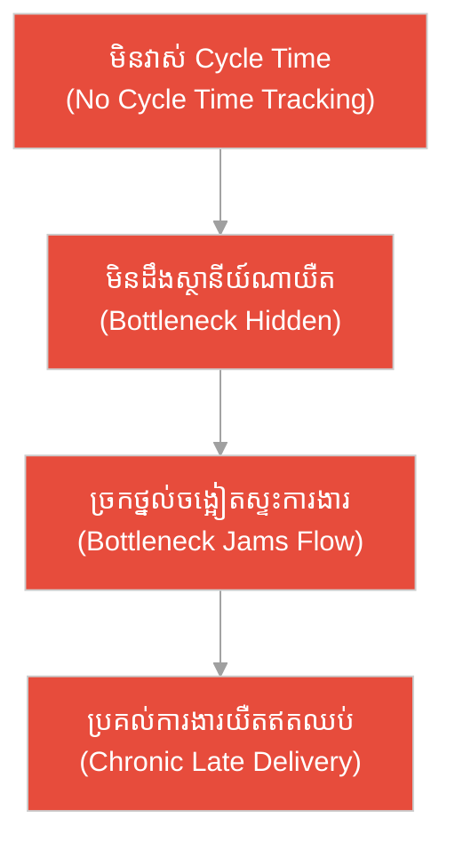
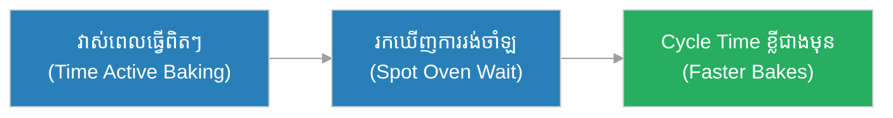
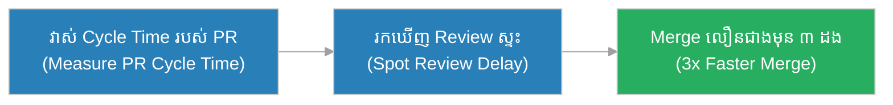
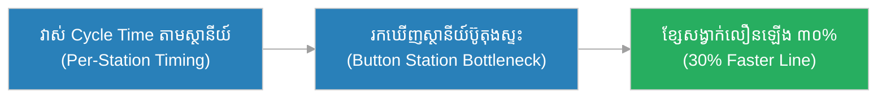
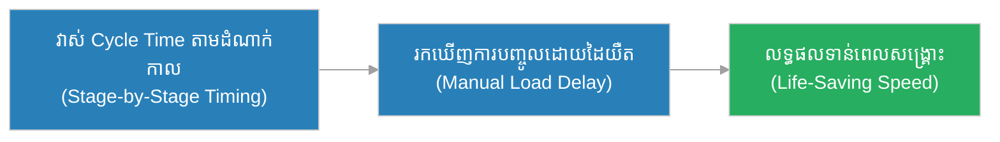
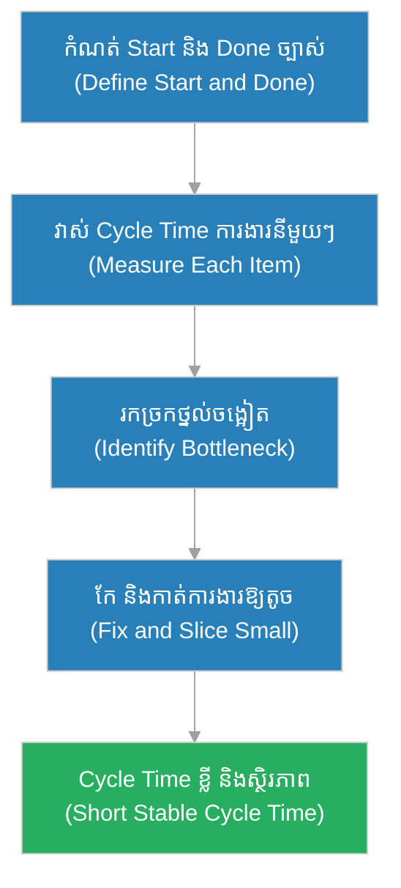

# ពេលវេលាវដ្ត (Cycle Time)៖ ជា​ងដែក​ដែល​កំណត់ម៉ោង​ពី​ដំបងដំបូងដល់ដាវរួច (The Blacksmith Who Timed From the First Strike to the Finished Blade)

**អ្នកនិពន្ធ (Author):** ichamrong 
**កាលបរិច្ឆេទ (Date):** 2026-05-29 
**ស្លាក (Tags):** #agile #scrum #cycle-time #parable 
**ប្រភេទ (Category):** Management & Leadership 
**រយៈពេលអាន (Read Time):** ~១២ នាទី (~12 min) 

---

## 📌 មាតិកា (Table of Contents)
- [អន្ទាក់​នៃ​ការ​វាស់ល្បឿន (The Measurement Trap)](#0)
- [១. រឿងប្រៀបប្រដូច៖ ជា​ងដែក​ដែល​កំណត់ម៉ោង​ពី​ដំបងដំបូងដល់ដាវរួច (The Parable: The Blacksmith Who Timed His Forging)](#1)
- [២. បញ្ហា៖ ការ​ច្រឡំ Cycle Time នឹង Lead Time (The Issue: Confusing Cycle Time with Lead Time)](#2)
- [៣. ឧទាហរណ៍​ជាក់ស្តែង​ក្នុង​ពិភពពិត (Real World Examples)](#3)
 - [ឧទាហរណ៍​ទី ១ — កម្រិតស្រាល (គ្រួសារ)៖ ការ​ដុតនំខេកនៅផ្ទះ (The Home Cake Baking)](#3-1)
 - [ឧទាហរណ៍​ទី ២ — កម្រិតមធ្យម (បច្ចេកទេស)៖ ការ​ពិនិត្យ​កូដ Pull Request (The Pull Request Review)](#3-2)
 - [ឧទាហរណ៍​ទី ៣ — កម្រិតមធ្យម (ធុរកិច្ច)៖ ការ​អនុម័តប្រាក់កម្ចីធនាគារ (The Loan Approval Desk)](#3-3)
 - [ឧទាហរណ៍​ទី ៤ — កម្រិតមធ្យម (គ្រប់​គ្រង)៖ ការ​ផលិតខ្សែសង្វាក់រោងចក្រសម្លៀកបំពាក់ (The Garment Line Bottleneck)](#3-4)
 - [ឧទាហរណ៍​ទី ៥ — កម្រិតធ្ងន់ (ហានិភ័យខ្ពស់)៖ ការ​វិភាគសំណាកឈាមនៅមន្ទីរពិសោធន៍ (The Blood-Sample Lab Turnaround)](#3-5)
- [៤. ការ​សន្ទនាបែបសាកសួរ (Socratic Dialogue: The Whole Wait vs. The Active Work)](#4)
- [៥. ដំណោះស្រាយ៖ ការ​វាស់ និង​កាត់បន្ថយ Cycle Time (The Solution: Measuring and Reducing Cycle Time)](#5)
- [សេចក្តីសន្និដ្ឋាន (Conclusion)](#6)
- [ឯកសារយោង (References)](#7)
- [Related Posts](#8)

---

## អន្ទាក់​នៃ​ការ​វាស់ល្បឿន (The Measurement Trap)

នៅ​ពេល​ក្រុ​មក​ារងារ​ចង់​ដឹងថា «តើ​យើង​លឿន​កម្រិតណា?» ពួកគេ​តែ​ង​តែ​ធ្លាក់ចូល​ទៅ​ក្នុង​ភាពផ្ទុយគ្នា​ពី​រ៖

* **អន្ទាក់​មិន​វាស់សោះ (The No-Measure Trap):** «កុំ​ខាត​ពេល​កត់ម៉ោង​ធ្វើ​ការ​អី! យើង​ធ្វើ​ការ​ងារធម្មតា​ទៅ ល្បឿនវាក៏ល្បឿន​ទៅ មិន​បាច់រាប់ទេ!»
* **អន្ទាក់​ច្រឡំ​ការ​វាស់ (The Wrong-Clock Trap):** «យើងវាស់​ពេល​វេលា​សរុប​ពី​ពេល​អតិថិជនស្នើ ដល់​ពេល​ប្រគល់ ហើយ — ដូច្​នេះ​យើងដឹងហើយថា ស្ថានីយ៍ណាមួយ​យឺត!» (តែ​តាម​ពិត​មិន​ដឹងទេ)។

---

## ១. រឿងប្រៀបប្រដូច៖ ជា​ងដែក​ដែល​កំណត់ម៉ោង​ពី​ដំបងដំបូងដល់ដាវរួច (The Parable: The Blacksmith Who Timed His Forging)

កាល​ពី​ព្រេងនាយ មាន​រោង​ជា​ងដែកមួយ​ដែល​ផលិតដាវ។ មេ​ជា​ងម្នាក់ឈ្មោះ **រិទ្ធី (Rithy)** ចង់​ដឹងថា ហេតុអ្វី​បាន​ជា​ការ​ផលិតដាវ​នីមួយ ៗ យឺត​ពេក។ គាត់ក៏ចាប់ផ្​តើ​មក​ំណត់ម៉ោង — តែ​មិន​មែនរាប់​ពី​ពេល​អ្នក​ភូមិកម្ម៉ង់ដាវ​នោះ​ទេ។ គាត់រាប់ចាប់​ពី **«ដំបងដំបូង​ដែល​គាត់វាយ​លើ​ដែកក្តៅ»** រហូតដល់ **«ដាវ​នោះ​រួច​ជា​ស្ថាពរ»** — ពោល​គឺ ពេល​វេលា​នៃ «ការ​ធ្វើ​ពិតប្រាកដ» លើ​ដាវមួយដើម។

ដោយ​វាស់​ពេល​នៃ​ការ​ធ្វើ​ពិត ៗ រិទ្ធីសម្គាល់ឃើញថា ស្ថានីយ៍ «ដុសខាត់ផ្លែដាវ» របស់​កូន​ជា​ងម្នាក់ ត្រូវ​ការ​ម៉ោងយូរ​ជា​ងគេបំផុត — វា​ជា «ច្រកថ្នល់ចង្អៀត» (Bottleneck) ដែល​ធ្វើ​ឱ្យដាវ​ទាំងអស់​ត្រូវ​ចាំ។ គាត់ក៏បន្ថែ​មក​ូន​ជា​ងម្នាក់ទៀតនៅស្ថានីយ៍​នោះ ហើយល្បឿនផលិតដាវទាំងមូលក៏​លឿន​ឡើងភ្លាម។

ផ្ទុយ​ទៅ​វិញ រោង​ជា​ងដែកមួយទៀត​មិន​ដែល​កំណត់ម៉ោង​នៃ​ការ​ធ្វើ​ពិត ៗ ឡើយ។ ពួកគេឃើញ​តែ «ដាវប្រគល់​យឺត» តែ​គ្មាន​នរណាដឹងថា ស្ថានីយ៍ណា​ជា​បញ្ហា។ កូន​ជា​ងម្នាក់នៅស្ថានីយ៍ «ដាល់ផ្លែ» ស្ទះ​ការ​ងារទាំងខ្សែសង្វាក់ ប៉ុន្តែ​គ្មាន​នរណាដឹង។ មិន​យូរប៉ុន្​មាន រោង​ជា​ង​នោះ​ក៏បាត់បង់អតិថិជន ដោយសារ​តែ​ប្រគល់ដាវ​យឺត​ឥតឈប់ឈរ ដោយ​មិន​ដឹងមូលហេតុ។

---

## ២. បញ្ហា៖ ការ​ច្រឡំ Cycle Time នឹង Lead Time (The Issue: Confusing Cycle Time with Lead Time)

នៅក្នុង​ការ​គ្រប់​គ្រងលំហូរ​ការ​ងារ (Flow Metrics), **ពេលវេលាវដ្ត (Cycle Time)** គឺជា​រយៈពេល​ចាប់​ពី​ពេល​ដែល​ក្រុ​មក​ារងារ **ចាប់ផ្​តើ​ម​ធ្វើ** ការ​ងារមួយ (Start Work / In Progress) រហូតដល់​ពេល​ដែល​វា **រួច​រាល់** (Done)។ វាវាស់​តែ «ការ​ធ្វើ​ពិត ៗ » (Active Work) ប៉ុណ្ណោះ។

មនុស្ស​ជា​ច្រើនយល់ច្រឡំថា Cycle Time និង **ពេលវេលានាំមុខ (Lead Time)** ជា​រឿង​តែ​មួយ — នេះ​ជា​ការ​យល់​ច្រឡំ! Lead Time រាប់ចាប់​ពី​ពេល​អតិថិជន **ស្នើ** (Request) រហូតដល់ **ប្រគល់** (Delivered) រួមទាំង​ពេល​រង់ចាំ​ក្នុង​ជួរ (Queue Wait)។ ដូច្​នេះ Cycle Time គឺជា «ផ្នែករង» ដែល​នៅ​ខាងក្នុង Lead Time ប៉ុណ្ណោះ។ ប្រសិនបើ​យើង​ច្រឡំ​ពី​រ​នេះ​ យើង​នឹង​មិន​អាច​រក​ឃើញ​ច្រក​ថ្នល់​ចង្អៀត​ពិត​ប្រាកដ​ឡើយ។

---

## ៣. ឧទាហរណ៍​ជាក់ស្តែង​ក្នុង​ពិភពពិត

សូមពិនិត្យមើលរបៀប​ដែល​ការ​វាស់ Cycle Time ជះឥទ្ធិពលដល់កម្រិតជីវិត និង​ការ​ងារទាំង ៥ ខាងក្រោម៖

---

### ឧទាហរណ៍​ទី ១ — កម្រិតស្រាល (គ្រួសារ)៖ ការ​ដុតនំខេកនៅផ្ទះ (The Home Cake Baking)

* **ស្ថានភាព៖** ម្តាយម្នាក់​ចង់​ដឹងថា ហេតុអ្វី​ការ​ដុតនំខេកម្តង ៗ ត្រូវ​ការ​ពេល​យូរ។ គាត់កំណត់ម៉ោង​តែ «ការ​ធ្វើ​ពិត ៗ » — ចាប់​ពី​ពេល​លាយម្សៅ ដល់​ពេល​នំចេញ​ពី​ឡ (Start → Done) — ដោយ​មិន​រាប់​ពេល​រង់ចាំទិញគ្រឿងផ្សំ។
* **លទ្ធផល៖** គាត់រកឃើញថា ការ «រង់ចាំឡក្តៅ» ស៊ី​ពេល​ច្រើនបំផុត។ គាត់បើកឡឱ្យក្តៅ​ជា​មុន ហើយ Cycle Time នៃ​ការ​ដុតនំក៏ខ្លី​ជា​ង​មុន​ច្រើន។

---

### ឧទាហរណ៍​ទី ២ — កម្រិតមធ្យម (បច្ចេកទេស)៖ ការ​ពិនិត្យ​កូដ Pull Request (The Pull Request Review)

* **ស្ថានភាព៖** ក្រុមអភិវឌ្ឍន៍​សម្គាល់ថា ការ​ងារ «In Progress» ត្រូវ​ចំណាយ​ពេល​ច្រើនថ្ងៃ។ ពួកគេវាស់ Cycle Time ពី​ពេល​ចាប់ផ្​តើ​ម​សរសេរ​កូដ ដល់​ពេល Merge ហើយឃើញថា កូដ​អង្គុយចាំ «Code Review» យូរបំផុត។
* **លទ្ធផល៖** ពួកគេកំណត់ច្បាប់ «ពិនិត្យ PR ក្នុង ៤ ម៉ោង» និង​បែងចែក PR ឱ្យតូច ៗ ។ Cycle Time ធ្លាក់​ពី ៥ ថ្ងៃ មក​នៅ ១,៥ ថ្ងៃ។

---

### ឧទាហរណ៍​ទី ៣ — កម្រិតមធ្យម (ធុរកិច្ច)៖ ការ​អនុម័តប្រាក់កម្ចីធនាគារ (The Loan Approval Desk)

* **ស្ថានភាព៖** ផ្នែកអនុម័តប្រាក់កម្ចី​មិន​បាន​បែងចែករវាង «ពេល​រង់ចាំ» និង «ពេល​ធ្វើ​ពិត ៗ »។ ពួកគេមើល​តែ​ពេល​សរុប​ពី​ពាក្យស្នើ ដល់អនុម័ត ហើយបន្ទោសបុគ្គលិកថា «ខ្ជិល»។
* **លទ្ធផល៖** ដោយ​មិន​ដឹង​ថា​បញ្ហា​ពិត​ស្ថិត​នៅ​ឯ​ណា ពួកគេបង្ខំបុគ្គលិក​ធ្វើ​ការ​ច្រើនម៉ោង ប៉ុន្តែ​ Cycle Time ​ពិត​ប្រាកដ​នៅ​ដ​ដែល ព្រោះ​បញ្ហា​ពិត​គឺ​ការ​រង់ចាំ​ឯកសារ​ពី​ផ្នែក​ផ្សេង។ អតិថិជនបោះបង់ ហើយ​ទៅ​ធនាគារដៃគូប្រកួតប្រជែង។

---

### ឧទាហរណ៍​ទី ៤ — កម្រិតមធ្យម (គ្រប់​គ្រង)៖ ការ​ផលិតខ្សែសង្វាក់រោងចក្រសម្លៀកបំពាក់ (The Garment Line Bottleneck)

* **ស្ថានភាព៖** ប្រធានរោងចក្រសម្លៀកបំពាក់វាស់ Cycle Time នៃ​អាវ​នីមួយ ៗ តាម​ស្ថានីយ៍ — កាត់ ដេរ ប៊ូតុង និង​វេចខ្ចប់។ គាត់ឃើញថា ស្ថានីយ៍ «ដាក់ប៊ូតុង» យឺត​បំផុត ហើយ​ធ្វើ​ឱ្យអាវហ្វូងគរនៅទី​នោះ។
* **លទ្ធផល៖** គាត់ផ្លាស់ប្តូរម៉ាស៊ីន និង​បន្ថែ​មក​ម្​មក​រនៅស្ថានីយ៍ប៊ូតុង។ ខ្សែសង្វាក់ទាំងមូល​លឿន​ឡើង ៣០% ដោយ​មិន​បាច់បន្ថែមម៉ោង​ធ្វើ​ការ។

---

### ឧទាហរណ៍​ទី ៥ — កម្រិតធ្ងន់ (ហានិភ័យខ្ពស់)៖ ការ​វិភាគសំណាកឈាមនៅមន្ទីរពិសោធន៍ (The Blood-Sample Lab Turnaround)

* **ស្ថានភាព៖** មន្ទីរពិសោធន៍មួយវិភាគសំណាកឈាម​សម្រាប់​អ្នក​ជំងឺសង្គ្រោះបន្ទាន់។ ពួកគេវាស់ Cycle Time ពី​ពេល​ម៉ាស៊ីនចាប់ផ្​តើ​មវិភាគ ដល់​ពេល​លទ្ធផលរួច ដើម្បី​ដឹងថា ដំណាក់កាលណាស៊ី​ពេល​ច្រើនបំផុត។
* **លទ្ធផល៖** ពួកគេរកឃើញថា ការ «បញ្ចូលសំណាក​ក្នុង​ម៉ាស៊ីន​ដោយ​ដៃ» យឺត និង​ងាយខុស។ ដោយ​ប្តូរ​ទៅ​ប្រព័ន្ធ​ស្វ័យប្រវត្តិ Cycle Time ខ្លី​លឿន ហើយលទ្ធផលដល់គ្រូពេទ្យទាន់​ពេល​សង្គ្រោះ​អ្នក​ជំងឺ។

---

## ៤. ការ​សន្ទនាបែបសាកសួរ (Socratic Dialogue: The Whole Wait vs. The Active Work)

**សិស្ស (អ្នក​អភិវឌ្ឍ​ន៍)៖** លោកគ្រូ! ខ្ញុំឮគេនិយាយ Cycle Time ផង Lead Time ផង។ តើ​វា​មិន​មែនរឿង​តែ​មួយទេ​ឬ? ទាំង​ពី​រវាស់ «ការ​ងារ​ត្រូវ​ការ​ពេល​ប៉ុន្​មាន» ដូចគ្នា មែនទេ?

**គ្រូ (វិស្វករ​ជា​ន់ខ្ពស់)៖** សំណួរ​ល្អ​ណាស់ — ហើយ​នេះ​ជា​ការ​យល់​ច្រឡំ​ដ៏​ពេញ​និយម​បំផុត។ អនុញ្ញាតឱ្យខ្ញុំសួរវិញ៖ បើឯងកម្ម៉ង់កាហ្វេនៅហាង ហើយឈរជួររង់ចាំ ១៥ នាទី​មុន​អ្នក​លក់ចាប់ផ្​តើ​ម​ធ្វើ រួចគេ​ធ្វើ​កាហ្វេ ៣ នាទី — តើ «ការ​ធ្វើ» ស៊ី​ពេល​ប៉ុន្​មាន?

**សិស្ស៖** ៣ នាទីលោកគ្រូ។ ការ​ធ្វើ​ពិត ៗ ស៊ី​តែ ៣ នាទីប៉ុណ្ណោះ។

**គ្រូ៖** ត្រឹម​ត្រូវ! ៣ នាទី​នោះ​គឺ **Cycle Time** — ការ​ធ្វើ​ពិត ៗ ។ ចុះ​ពេល​ឯងឈរ​​ចាំ​ពី​ពេល​កម្ម៉ង់​ ដល់​ពេល​ទទួល​កាហ្វេ​ ស៊ី​ប៉ុន្​មាន?

**សិស្ស៖** ១៨ នាទីលោកគ្រូ — ១៥ នាទីរង់ចាំ បូក ៣ នាទី​ធ្វើ។

**គ្រូ៖** នោះ​ហើយ **Lead Time** — ពេញ​ដំណើរ​ពី​ស្នើ​ ដល់​ប្រគល់ រួម​ទាំង​ការ​រង់ចាំ។ ឥឡូវ​សួរ​សំខាន់៖ បើ​ឯង​ចង់​ឱ្យ​អតិថិជន​ទទួល​កាហ្វេ​លឿន​ឡើង តើ​ឯង​គួរ​ប្រឹង​កាត់​បន្ថយ​អ្វី?

**សិស្ស៖** ខ្ញុំ​គួរ​កាត់​បន្ថយ​ការ​រង់ចាំ​ ១៥ នាទី​នោះ​មុន ព្រោះ​វា​ស៊ី​ពេល​ច្រើន​ជា​ង​ការ​ធ្វើ​ច្រើន​ដង!

**គ្រូ៖** ត្រឹម​ត្រូវ​ហើយ! នេះ​ហើយ​ជា​ហេតុ​ផល​ដែល​យើង​ត្រូវ​បែង​ចែក​ឱ្យ​ច្បាស់៖ Cycle Time ​ប្រាប់​ឯង​ថា «ការ​ធ្វើ​ពិត ៗ ​យឺត​កន្លែង​ណា» ចំណែក Lead Time ​ប្រាប់​ឯង​ថា «អតិថិជន​រង់ចាំ​ប៉ុន្​មាន​ពិត​ប្រាកដ»។ បើ​ឯង​ច្រឡំ​ពី​រ​នេះ ឯង​អាច​នឹង​បង្កើន​ល្បឿន​ការ​ធ្វើ ខណៈ​អតិថិជន​នៅ​តែ​រង់ចាំ​ក្នុង​ជួរ​យូរ​ដ​ដែល។

---

## ៥. ដំណោះស្រាយ៖ ការ​វាស់ និង​កាត់បន្ថយ Cycle Time (The Solution: Measuring and Reducing Cycle Time)

ដើម្បី​ប្រើ Cycle Time ឱ្យ​មាន​ប្រសិទ្ធភាព ក្រុ​មក​ារងារ​ត្រូវ​អនុវត្តគោល​ការ​ណ៍​ខាងក្រោម៖

1. **កំណត់ច្បាស់ «ចាប់ផ្​តើ​ម» និង «រួច​រាល់» (Define Start and Done):** ត្រូវ​ឯកភាព​គ្នា​ថា ការ​ងារ​ចូល «In Progress» ពេល​ណា និង​ឈាន​ដល់ «Done» ពេល​ណា ដើម្បី​វាស់​ឱ្យ​ត្រឹម​ត្រូវ​និង​ស្មើ​គ្នា។
2. **បែងចែក Cycle Time ចេញ​ពី Lead Time (Separate from Lead Time):** កុំ​យក​ការ​រង់ចាំ​ក្នុង​ជួរ (Queue) មក​លាយ​ជា​មួយ​ការ​ធ្វើ​ពិត ៗ — ពួក​វា​ប្រាប់​រឿង​ផ្សេង​គ្នា។
3. **រកច្រកថ្នល់ចង្អៀត (Find the Bottleneck):** មើល​ស្ថានីយ៍ ឬ​ដំណាក់​កាល​ណា​ដែល​ការ​ងារ​គរ​ច្រើន​បំផុត​ — នោះ​ហើយ​ជា​កន្លែង​ត្រូវ​កែ​មុន​គេ។
4. **កាត់​ការ​ងារឱ្យតូច (Slice Work Small):** ការ​ងារ​តូច ៗ ​មាន Cycle Time ​ខ្លី និង​ងាយ​ស្រួល​ព្យាករណ៍​ជា​ង​ការ​ងារ​ធំ ៗ ។
5. **ប្រើ Scatter Plot តាមដាន (Track with Scatter Plot):** គូស​ Cycle Time ​នៃ​ការ​ងារ​នីមួយ ៗ ដើម្បី​មើល​និន្នា​ការ​និង​កំណត់​ការ​សន្យា​ដ៏​ប្រាកដ​ដល់​អតិថិជន។

---

## 🐇 ធ្លាក់ចូល​ក្នុង​រន្ធទន្សាយ (Enter the Rabbit Hole)

ដើម្បី​យល់ដឹងកាន់​តែ​ស៊ីជម្រៅអំ​ពី​ការ​វាស់លំហូរ​ការ​ងារ និង​ការ​គ្រប់​គ្រងល្បឿន សូមស្វែងយល់បន្ថែម៖

* 🚀 **[ពេលវេលានាំមុខ (Lead Time) ➔](./lead-time.md)**
* 🚀 **[ការកំណត់ការងារ​កំពុងដំណើរ​ការ (WIP Limits) ➔](./wip-limits.md)**
* 🚀 **[ប្រព័ន្ធ Kanban (Kanban) ➔](../practices/kanban.md)**

---

## សេចក្តីសន្និដ្ឋាន (Conclusion)

> **«Cycle Time មិន​វាស់​ការ​រង់ចាំ​ទាំងអស់​ឡើយ — វាវាស់ "ការ​វាយដំបង​លើ​ដែកក្តៅ" របស់​យើង ដើម្បី​ប្រាប់ថា ច្រកថ្នល់ចង្អៀត​ពិត ៗ ស្ថិតនៅឯណា។»**

ការ​វាស់ Cycle Time ឱ្យត្រឹម​ត្រូវ — ដោយ​បែងចែកវាចេញ​ពី Lead Time — ជួយឱ្យក្រុ​មក​ារងារ​ដូចជា​ងដែករិទ្ធី រកឃើញស្ថានីយ៍​ដែល​ស្ទះ កែ​វាឱ្យ​លឿន និង​ផលិត «ដាវ» របស់​ខ្លួន​បាន​រហ័ស​ជា​ង​មុន ដោយ​មិន​បាច់​ធ្វើ​ការ​ច្រើនម៉ោង​ឡើយ។

---

## ឯកសារយោង (References)

* **Donald G. Reinertsen** — *The Principles of Product Development Flow* (2009).
* **David J. Anderson** — *Kanban: Successful Evolutionary Change for Your Technology Business* (2010).

---

## Related Posts

* [ពេលវេលានាំមុខ (Lead Time)](./lead-time.md) — របៀបវាស់ដំណើរពេញ​ពី​ស្នើ ដល់ប្រគល់ ដែល​រួមបញ្ចូល​ការ​រង់ចាំ។
* [ការកំណត់ការងារ​កំពុងដំណើរ​ការ (WIP Limits)](./wip-limits.md) — របៀបកំណត់​ការ​ងារកំពុង​ធ្វើ ដើម្បី​បង្រួម Cycle Time។
* [ប្រព័ន្ធ Kanban (Kanban)](../practices/kanban.md) — ប្រព័ន្ធ​គ្រប់​គ្រងលំហូរ​ការ​ងារ ដែល​ប្រើ Cycle Time ជា​សូចនាករសំខាន់។
