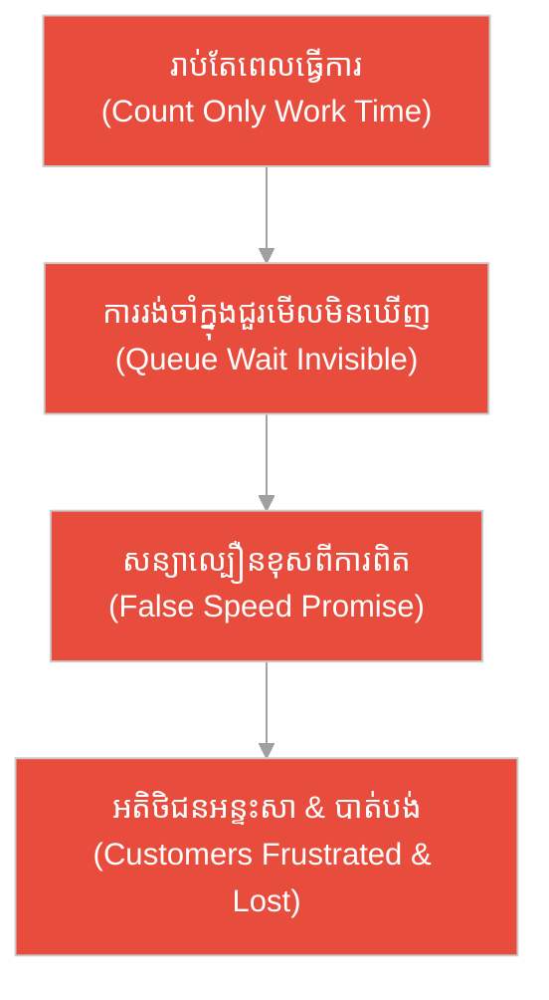
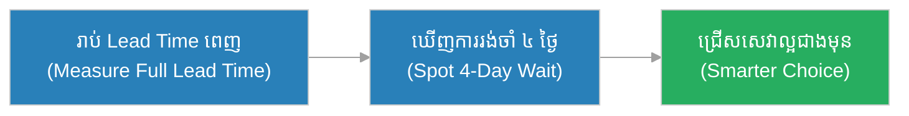
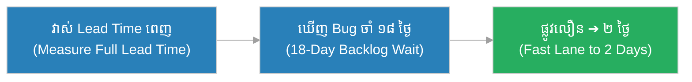
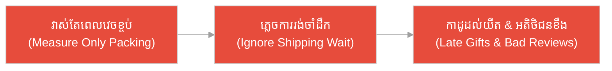
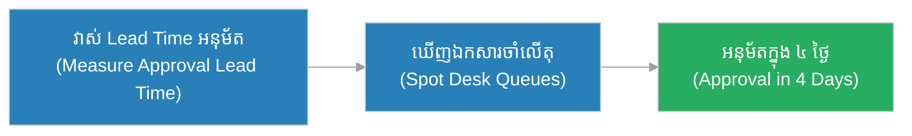
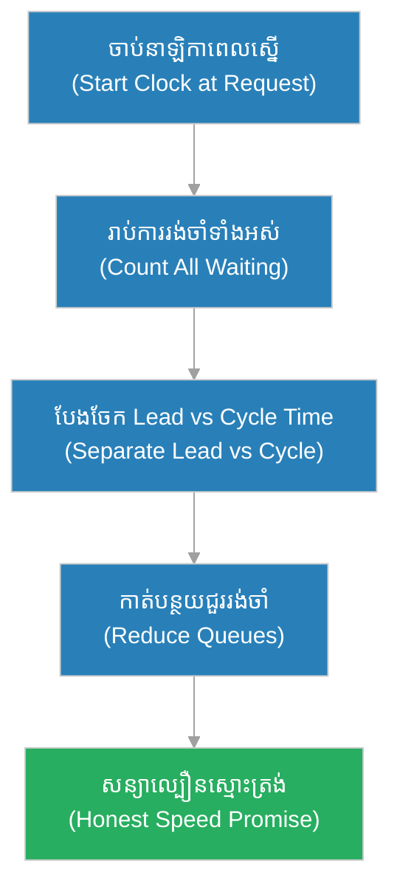

# ពេលវេលានាំមុខ (Lead Time)៖ ដំណើរពេញ​របស់​សំបុត្រ និង​ប្រៃសណីយ៍​ដែល​អួត​តែ​ល្បឿន​សរសេរ (The Letter's Whole Journey & The Post Office That Bragged Only About Writing Speed)

**អ្នកនិពន្ធ (Author):** ichamrong 
**កាលបរិច្ឆេទ (Date):** 2026-05-29 
**ស្លាក (Tags):** #agile #scrum #lead-time #parable 
**ប្រភេទ (Category):** Management & Leadership 
**រយៈពេលអាន (Read Time):** ~១២ នាទី (~12 min) 

---

## 📌 មាតិកា (Table of Contents)
- [អន្ទាក់​នៃ​ការ​រង់ចាំ​ដែល​មើល​មិន​ឃើញ (The Invisible Wait Trap)](#0)
- [១. រឿងប្រៀបប្រដូច៖ ដំណើរពេញ​របស់​សំបុត្រ (The Parable: The Letter's Whole Journey)](#1)
- [២. បញ្ហា៖ ការ​រាប់​តែ​ពេល​ធ្វើ ភ្លេច​ពេល​រង់ចាំ (The Issue: Counting Only Work Time)](#2)
- [៣. ឧទាហរណ៍​ជាក់ស្តែង​ក្នុង​ពិភពពិត (Real World Examples)](#3)
 - [ឧទាហរណ៍​ទី ១ — កម្រិតស្រាល (គ្រួសារ)៖ ការ​ជួសជុលម៉ាស៊ីនត្រ​ជា​ក់នៅផ្ទះ (The Home Air-Con Repair)](#3-1)
 - [ឧទាហរណ៍​ទី ២ — កម្រិតមធ្យម (បច្ចេកទេស)៖ ការ​ដោះស្រាយ Bug ដែល​អង្គុយ​ក្នុង Backlog (The Bug Stuck in Backlog)](#3-2)
 - [ឧទាហរណ៍​ទី ៣ — កម្រិតមធ្យម (ធុរកិច្ច)៖ ការ​ដឹកជញ្ជូនកាដូបុណ្យ E-commerce (The E-commerce Holiday Shipping)](#3-3)
 - [ឧទាហរណ៍​ទី ៤ — កម្រិតមធ្យម (គ្រប់​គ្រង)៖ ការ​អនុម័តថវិកា​គម្រោង​សាងសង់ (The Construction Budget Sign-off)](#3-4)
 - [ឧទាហរណ៍​ទី ៥ — កម្រិតធ្ងន់ (ហានិភ័យខ្ពស់)៖ ការ​ផ្គត់ផ្គង់ឱសថសង្គ្រោះបន្ទាន់ (The Emergency Medicine Supply Chain)](#3-5)
- [៤. ការ​សន្ទនាបែបសាកសួរ (Socratic Dialogue: The Clock Starts When You Ask)](#4)
- [៥. ដំណោះស្រាយ៖ ការ​វាស់ និង​បង្រួម Lead Time (The Solution: Measuring and Shrinking Lead Time)](#5)
- [សេចក្តីសន្និដ្ឋាន (Conclusion)](#6)
- [ឯកសារយោង (References)](#7)
- [Related Posts](#8)

---

## អន្ទាក់​នៃ​ការ​រង់ចាំ​ដែល​មើល​មិន​ឃើញ (The Invisible Wait Trap)

នៅ​ពេល​ក្រុ​មក​ារងារ ឬ​អង្គភាព​សន្យា​ល្បឿន​ដល់​អតិថិជន ពួកគេ​តែ​ង​ធ្លាក់​ចូល​ភាព​ផ្ទុយ​គ្នា​ពី​រ៖

* **អន្ទាក់​រាប់​តែ​ពេល​ធ្វើ (The Work-Only Trap):** «យើង​ធ្វើ​ការ​ងារ​នេះ​អស់​តែ ២ ម៉ោងប៉ុណ្ណោះ — ដូច្​នេះ​យើង​លឿន​ណាស់!» (តែ​ភ្លេចថា វាអង្គុយចាំ ៣ សប្តាហ៍​មុន​ពេល​គេចាប់ផ្​តើ​ម)។
* **អន្ទាក់​មិន​រាប់សោះ (The No-Clock Trap):** «កុំ​ខ្វល់​ពី​ពេល​វេលា​សរុប​ឡើយ! ឱ្យ​តែ​ការ​ងារចេញ​បាន​ទៅ ល្អ​ហើយ មិន​បាច់រាប់ថាអតិថិជនរង់ចាំប៉ុន្​មាន​នោះ​ទេ!»

---

## ១. រឿងប្រៀបប្រដូច៖ ដំណើរពេញ​របស់​សំបុត្រ (The Parable: The Letter's Whole Journey)

កាល​ពី​ព្រេងនាយ មាន​ស្រុកមួយ​ដែល​ប្រ​ជា​ជននិយមផ្ញើសំបុត្រ។ មេប្រៃសណីយ៍ម្នាក់ឈ្មោះ **ចន្ថា (Chantha)** ចង់​ដឹង​ពិតប្រាកដ​ថា «តើ​សំបុត្រមួយ​ត្រូវ​ការ​ពេល​ប៉ុន្​មាន?»។ គាត់​មិន​រាប់​ត្រឹម​ពេល​សរសេរ​ឡើយ។ គាត់​ចាប់​រាប់​ពី​ពេល​ដែល​នរណា​ម្នាក់​និយាយ​ថា «សូម​សរសេរ​សំបុត្រ​នេះ​ឱ្យ​ខ្ញុំ» រហូត​ដល់​ពេល​ដែល​សំបុត្រ​នោះ «ដល់​ដៃ​អ្នក​ទទួល» — រួម​ទាំង​គ្រប់​ការ​រង់ចាំ​ក្នុង​ថង់​សំបុត្រ ​ផង។

ដោយ​រាប់​ដំណើរ​ពេញ ចន្ថា​ភ្ញាក់​ផ្អើល៖ ការ​សរសេរ​សំបុត្រ​ស៊ី​តែ​១០ នាទី ប៉ុន្តែ​សំបុត្រ​អង្គុយ​ក្នុង​ថង់​ចាំ​ដឹក ​៣ ថ្ងៃ! គាត់​ក៏​ដឹង​ថា ​បញ្ហា​ពិត​មិន​មែន​នៅ​ការ​សរសេរ​ទេ ​តែ​នៅ​ការ​រង់ចាំ​ដឹក។ គាត់​បន្ថែម​ដំណើរ​ដឹក​ញឹក​ញាប់​ឡើង ​ហើយ​សំបុត្រ​ដល់​ដៃ​អ្នក​ទទួល​លឿន​ឡើង​ច្រើន​ដង។

ផ្ទុយ​ទៅ​វិញ ប្រៃសណីយ៍​មួយ​ទៀត​វាស់​តែ «ពេល​សរសេរ» ប៉ុណ្ណោះ ​ហើយ​អួត​ថា «យើង​សរសេរ​សំបុត្រ​លឿន​ជា​ង​គេ​ក្នុង​ស្រុក!»។ ប៉ុន្តែ​សំបុត្រ​នៅ​តែ​អង្គុយ​ក្នុង​ថង់​ច្រើន​សប្តាហ៍។ អ្នក​ស្រុក​ខឹង​ខ្លាំង​ ព្រោះ​ការ​អួត​នោះ​គ្មាន​ន័យ​អ្វី​ឡើយ — អ្នក​ទទួល​នៅ​តែ​មិន​បាន​សំបុត្រ​ទាន់​ពេល។ មិន​យូរ​ប៉ុន្​មាន ​គេ​ក៏​លែង​ប្រើ​ប្រៃសណីយ៍​នោះ​ត​ទៅ​ទៀត។

---

## ២. បញ្ហា៖ ការ​រាប់​តែ​ពេល​ធ្វើ ភ្លេច​ពេល​រង់ចាំ (The Issue: Counting Only Work Time)

នៅក្នុង​ការ​វាស់លំហូរ​ការ​ងារ (Flow Metrics), **ពេលវេលានាំមុខ (Lead Time)** គឺជា​រយៈពេល​ពេញ​ លេញ​ ចាប់​ពី​ពេល​ដែល​សំណើ​មួយ​ត្រូវ​បាន​ដាក់​ (Request / Created) រហូត​ដល់​ពេល​វា​ត្រូវ​បាន​ប្រគល់​ (Delivered) — **រួម​បញ្ចូល​ការ​រង់ចាំ​ក្នុង​ជួរ​ទាំង​អស់** (Queue Wait)។

មនុស្ស​ជា​ច្រើន​យល់​ច្រឡំ​ថា Lead Time រាប់​តែ «ពេល​ធ្វើ​ការ​ពិត ៗ » ​ប៉ុណ្ណោះ — នេះ​ជា​ការ​យល់​ច្រឡំ! ​ការ​ធ្វើ​ការ​ពិត ៗ ​នោះ​ហៅ​ថា **Cycle Time** ​ ​ដែល​ជា​ផ្នែក​រង​មួយ​ខាង​ក្នុង Lead Time ​ប៉ុណ្ណោះ។ ​ការ​រង់ចាំ​ — ​មុន​ពេល​ចាប់​ផ្​តើ​ម ​និង​រវាង​ដំណាក់​កាល — ​តែ​ង​តែ​ស៊ី​ពេល​ច្រើន​ជា​ង​ការ​ធ្វើ​ឆ្ងាយ​ណាស់។ ​បើ​យើង​មើល​តែ​ការ​ធ្វើ យើង​នឹង​ខក​ខាន​មិន​ឃើញ​ការ​រង់ចាំ​ដែល​ពិត​ជា​ធ្វើ​ឱ្យ​អតិថិជន​អន្ទះ​សា។

---

## ៣. ឧទាហរណ៍​ជាក់ស្តែង​ក្នុង​ពិភពពិត

សូមពិនិត្យមើលរបៀប​ដែល​ការ​វាស់ Lead Time ពេញលេញ ជះឥទ្ធិពលដល់កម្រិតជីវិត និង​ការ​ងារទាំង ៥ ខាងក្រោម៖

---

### ឧទាហរណ៍​ទី ១ — កម្រិតស្រាល (គ្រួសារ)៖ ការ​ជួសជុលម៉ាស៊ីនត្រ​ជា​ក់នៅផ្ទះ (The Home Air-Con Repair)

* **ស្ថានភាព៖** ម្​ចាស់​ផ្ទះកត់ត្រា Lead Time ពេញលេញ ចាប់​ពី​ពេល​គាត់ទូរស័ព្ទស្នើជួសជុលម៉ាស៊ីនត្រ​ជា​ក់ ដល់​ពេល​វាដំណើរ​ការ​វិញ — រួមទាំង​ពេល​រង់ចាំ​ជា​ង​មក​ដល់ផង។
* **លទ្ធផល៖** គាត់ឃើញថា ការ​ជួសជុល​ពិត ៗ ស៊ី​តែ ៣០ នាទី តែ​គាត់រង់ចាំ​ជា​ង ៤ ថ្ងៃ។ លើ​ក​ក្រោយ គាត់ជ្រើសក្រុមហ៊ុន​ដែល​សន្យា Lead Time ខ្លី ជា​ជា​ង​តែ «ល្បឿនជួសជុល»។

---

### ឧទាហរណ៍​ទី ២ — កម្រិតមធ្យម (បច្ចេកទេស)៖ ការ​ដោះស្រាយ Bug ដែល​អង្គុយ​ក្នុង Backlog (The Bug Stuck in Backlog)

* **ស្ថានភាព៖** ក្រុមអភិវឌ្ឍន៍​អួតថា «យើងជួសជុល Bug ក្នុង ២ ម៉ោង»។ ប៉ុន្តែ​ពេល​វាស់ Lead Time ​ពេញ ​ពួកគេ​ឃើញ​ Bug ​អង្គុយ​ក្នុង Backlog ​ជា​មធ្យម ​១៨ ​ថ្ងៃ​មុន​ពេល​នរណា​ម្នាក់​ប៉ះ​វា។
* **លទ្ធផល៖** ពួកគេ​បង្កើត «ផ្លូវ​ល្បឿន​លឿន» (Fast Lane) ​សម្រាប់ Bug ​ធ្ងន់ធ្ងរ ​ហើយ Lead Time ​ពិត​ប្រាកដ​ដែល​អ្នក​ប្រើ​ប្រាស់​ឃើញ ​ធ្លាក់​ពី ​១៨ ​ថ្ងៃ ​មក​នៅ ​២ ​ថ្ងៃ។

---

### ឧទាហរណ៍​ទី ៣ — កម្រិតមធ្យម (ធុរកិច្ច)៖ ការ​ដឹកជញ្ជូនកាដូបុណ្យ E-commerce (The E-commerce Holiday Shipping)

* **ស្ថានភាព៖** ហាងអនឡាញមួយវាស់​តែ «ពេល​វេចខ្ចប់ទំនិញ» (២០ នាទី) ហើយសន្យាដល់អតិថិជនថា «លឿន»។ តែ​ពួកគេ​មិន​រាប់​ការ​រង់ចាំ​ឃ្លាំង ​និង​ការ​ដឹក​ដែល​ស៊ី​ច្រើន​ថ្ងៃ​ក្នុង​រដូវ​បុណ្យ។
* **លទ្ធផល៖** កាដូ​ដល់​អតិថិជន​យឺត​ក្រោយ​ថ្ងៃ​បុណ្យ ​ដោយ​សារ Lead Time ​ពិត​ប្រាកដ​វែង​ជា​ង​ការ​សន្យា​ច្រើន។ អតិថិជន​ខឹង ​ផ្តល់​ការ​វាយ​តម្លៃ​អាក្រក់ ​ហើយ​ហាង​បាត់​បង់​កេរ្តិ៍​ឈ្មោះ​ និង​អតិថិជន​ស្មោះ​ត្រង់។

---

### ឧទាហរណ៍​ទី ៤ — កម្រិតមធ្យម (គ្រប់​គ្រង)៖ ការ​អនុម័តថវិកា​គម្រោង​សាងសង់ (The Construction Budget Sign-off)

* **ស្ថានភាព៖** អ្នក​គ្រប់​គ្រង​គម្រោង​សាងសង់វាស់ Lead Time ពេញ នៃ​ការ​អនុម័ត​ថវិកា — ​ពី​ពេល​ដាក់​ពាក្យ​ ដល់​ពេល​ទទួល​ការ​ឯកភាព។ គាត់​ឃើញ​ឯកសារ​អង្គុយ​ចាំ​លើ​តុ​ប្រធាន​នីមួយ ៗ ​ច្រើន​ថ្ងៃ។
* **លទ្ធផល៖** គាត់​កាត់​បន្ថយ​ចំនួន​ការ​អនុម័ត​ដែល​មិន​ចាំ​បាច់ ​និង​កំណត់​ពេល​កំណត់​ច្បាស់​ដល់​ប្រធាន​នីមួយ ៗ ។ Lead Time ​នៃ​ការ​អនុម័ត​ធ្លាក់​ពី ​៣ សប្តាហ៍ ​មក​នៅ ​៤ ​ថ្ងៃ ​ហើយ​គម្រោង​ចាប់​ផ្​តើ​ម​ទាន់​ពេល។

---

### ឧទាហរណ៍​ទី ៥ — កម្រិតធ្ងន់ (ហានិភ័យខ្ពស់)៖ ការ​ផ្គត់ផ្គង់ឱសថសង្គ្រោះបន្ទាន់ (The Emergency Medicine Supply Chain)

* **ស្ថានភាព៖** មន្ទីរពេទ្យមួយវាស់ Lead Time ពេញ ​ពី​ពេល​គ្រូ​ពេទ្យ​ស្នើ​ឱសថ​សង្គ្រោះ​ជីវិត ​ដល់​ពេល​ឱសថ​ដល់​ដៃ​អ្នក​ជំងឺ — រួម​ទាំង​ការ​រង់ចាំ​ស្តុក ​ការ​អនុម័ត ​និង​ការ​ដឹក​ផង។
* **លទ្ធផល៖** ពួកគេ​ឃើញ​ការ​រង់ចាំ​ការ​អនុម័ត​ឱសថ​ស៊ី​ពេល​គ្រោះ​ថ្នាក់​បំផុត។ ​ដោយ​ដាក់​ស្តុក​បម្រុង​និង​ផ្លូវ​អនុម័ត​បន្ទាន់ ​Lead Time ​ខ្លី​ដល់​កម្រិត​អាច​សង្គ្រោះ​ជីវិត​អ្នក​ជំងឺ​បាន​ទាន់​ពេល។

---

## ៤. ការ​សន្ទនាបែបសាកសួរ (Socratic Dialogue: The Clock Starts When You Ask)

**សិស្ស (អ្នក​គ្រប់​គ្រងផលិតផល)៖** លោកគ្រូ! ខ្ញុំ​ប្រាប់​អ្នក​ពាក់​ព័ន្ធ​ថា ​មុខងារ​នេះ​ត្រូវ​ការ​តែ ​៣ ​ថ្ងៃ​ធ្វើ ​តែ​ពួកគេ​ខឹង​ថា ​ខ្ញុំ​ភូតភរ។ ​ហេតុ​អ្វី? ​Lead Time ​មិន​មែន​ត្រឹម​តែ​ពេល​ធ្វើ​ការ​ទេ​ឬ?

**គ្រូ (វិស្វករ​ជា​ន់ខ្ពស់)៖** សួរ​បាន​ល្អ។ ​អនុញ្ញាត​ឱ្យ​ខ្ញុំ​សួរ​វិញ៖ ​ពេល​អ្នក​ពាក់​ព័ន្ធ​ស្នើ​មុខងារ​នោះ ​តើ​ឯង​ចាប់​ផ្​តើ​ម​ធ្វើ​វា​ភ្លាម​ ​ឬ​វា​ត្រូវ​អង្គុយ​ក្នុង Backlog ​មុន?

**សិស្ស៖** អូ... វា​អង្គុយ​ចាំ​ប្រហែល ​២ ​សប្តាហ៍​មុន​ក្រុម​ចាប់​ផ្​តើ​ម​ធ្វើ​លោកគ្រូ។

**គ្រូ៖** ដូច្​នេះ​សម្រាប់​អ្នក​ពាក់​ព័ន្ធ ​នាឡិកា​ចាប់​ដើរ​ពេល​ណា — ​ពេល​គេ​ស្នើ ​ឬ​ពេល​ឯង​ចាប់​ផ្​តើ​ម​ធ្វើ?

**សិស្ស៖** ​ពិត​ណាស់ ​សម្រាប់​គេ ​នាឡិកា​ចាប់​ដើរ​ពេល​គេ​ស្នើ​លោកគ្រូ។ ​គេ​មិន​ខ្វល់​ថា​យើង​ចាប់​ផ្​តើ​ម​ពេល​ណា​ទេ។

**គ្រូ៖** ​ត្រឹម​ត្រូវ! ​អ្នក​ពាក់​ព័ន្ធ​មិន​ឃើញ ​Cycle Time ​៣ ​ថ្ងៃ​របស់​ឯង​ឡើយ — ​គេ​ឃើញ ​Lead Time ​១៧ ​ថ្ងៃ ​(២ ​សប្តាហ៍​ចាំ ​បូក ​៣ ​ថ្ងៃ​ធ្វើ)។ ​នោះ​ហើយ​ហេតុ​អ្វី​គេ​មាន​អារម្មណ៍​ថា​ឯង​ភូតភរ។

**សិស្ស៖** ​ដូច្​នេះ ​ខ្ញុំ​គួរ​សន្យា​ដោយ​ប្រើ Lead Time ​ពេញ ​មិន​មែន​ត្រឹម​ពេល​ធ្វើ​ការ​ឡើយ​មែន​ទេ​លោកគ្រូ?

**គ្រូ៖** ​ត្រឹម​ត្រូវ​ហើយ! ​Lead Time ​ជា​ការ​សន្យា​ដ៏​ស្មោះ​ត្រង់​ដល់​អតិថិជន — ​វា​រាប់​ការ​រង់ចាំ​ទាំង​អស់។ ​បើ​ឯង​ចង់​ឱ្យ​អតិថិជន​ពេញ​ចិត្ត ​ឯង​ត្រូវ​បង្រួម ​Lead Time ​ពេញ ​មិន​មែន​ត្រឹម​ល្បឿន​ដៃ​របស់​ឯង​ឡើយ។

---

## ៥. ដំណោះស្រាយ៖ ការ​វាស់ និង​បង្រួម Lead Time (The Solution: Measuring and Shrinking Lead Time)

ដើម្បី​ប្រើ Lead Time ឱ្យ​មាន​ប្រសិទ្ធភាព ក្រុ​មក​ារងារ​ត្រូវ​អនុវត្តគោល​ការ​ណ៍​ខាងក្រោម៖

1. **ចាប់នាឡិកា​ពេល​ស្នើ (Start the Clock at Request):** Lead Time ​ត្រូវ​រាប់​ពី​ពេល​អតិថិជន​ស្នើ ​មិន​មែន​ពី​ពេល​ក្រុម​ចាប់​ផ្​តើ​ម​ធ្វើ​ឡើយ។
2. **រាប់​ការ​រង់ចាំ​ទាំងអស់ (Count All the Waiting):** ​ការ​អង្គុយ​ក្នុង Backlog ​និង​ការ​រង់ចាំ​រវាង​ដំណាក់​កាល​ គឺ​ជា​ផ្នែក​ពិត​ប្រាកដ​នៃ Lead Time។
3. **បែងចែក Lead Time និង Cycle Time (Separate from Cycle Time):** Lead Time ​ប្រាប់​អតិថិជន​ ​ ​Cycle Time ​ប្រាប់​ក្រុម​ ​— ​ត្រូវ​មើល​ទាំង​ពី​រ​ដើម្បី​ដឹង​ថា ​ការ​រង់ចាំ​ ​ឬ​ការ​ធ្វើ​ ​ជា​បញ្ហា។
4. **កាត់បន្ថយជួររង់ចាំ (Reduce the Queues):** ​ការ​បង្រួម Lead Time ​ភាគ​ច្រើន​មក​ពី​ការ​កាត់​បន្ថយ​ការ​រង់ចាំ ​មិន​មែន​ការ​ធ្វើ​លឿន​ឡើង​ឡើយ។
5. **សន្យា​ដោយ​ផ្អែក​លើ Lead Time ពិត (Promise from Real Lead Time):** ​ប្រើ​ទិន្នន័យ Lead Time ​ប្រវត្តិ​សាស្ត្រ​ដើម្បី​សន្យា​ដ៏​ស្មោះ​ត្រង់​ដល់​អតិថិជន។

---

## 🐇 ធ្លាក់ចូល​ក្នុង​រន្ធទន្សាយ (Enter the Rabbit Hole)

ដើម្បី​យល់ដឹងកាន់​តែ​ស៊ីជម្រៅអំ​ពី​ការ​វាស់លំហូរ​ការ​ងារ និង​ដំណើរ​ការ​នៃ​ការ​ងារ សូមស្វែងយល់បន្ថែម៖

* 🚀 **[ពេលវេលាវដ្ត (Cycle Time) ➔](./cycle-time.md)**
* 🚀 **[ប្រព័ន្ធ Kanban (Kanban) ➔](../practices/kanban.md)**
* 🚀 **[វដ្តជីវិត​របស់​សំបុត្រ​ការ​ងារ (Ticket Lifecycle) ➔](../artifacts/ticket-lifecycle.md)**

---

## សេចក្តីសន្និដ្ឋាន (Conclusion)

> **«Lead Time គឺជា​ដំណើរពេញ​របស់​សំបុត្រ — ពី​ពេល​គេនិយាយ "សូម​សរសេរ" ដល់​ពេល​វាដល់ដៃ​អ្នក​ទទួល — រួមទាំង​គ្រប់​ការ​រង់ចាំ​ក្នុង​ថង់ មិន​មែនត្រឹម​ពេល​ដៃកាន់ប៊ិក​ឡើយ។»**

ការ​វាស់ Lead Time ឱ្យត្រឹម​ត្រូវ — ដោយ​រាប់​ការ​រង់ចាំ​ទាំងអស់​ដូចមេប្រៃសណីយ៍ចន្ថា — ជួយឱ្យក្រុ​មក​ារងារសន្យាដ៏ស្មោះត្រង់ដល់អតិថិជន រកឃើញជួររង់ចាំ​ដែល​លាក់ខ្លួន និង​បង្រួមដំណើរពេញ ដើម្បី​ឱ្យ «សំបុត្រ» ដល់ដៃ​អ្នក​ទទួលទាន់​ពេល​វេលា។

---

## ឯកសារយោង (References)

* **Donald G. Reinertsen** — *The Principles of Product Development Flow* (2009).
* **David J. Anderson** — *Kanban: Successful Evolutionary Change for Your Technology Business* (2010).

---

## Related Posts

* [ពេលវេលាវដ្ត (Cycle Time)](./cycle-time.md) — របៀបវាស់​តែ​ការ​ធ្វើ​ពិត ៗ ដែល​ជា​ផ្នែករង​ខាងក្នុង Lead Time។
* [ប្រព័ន្ធ Kanban (Kanban)](../practices/kanban.md) — ប្រព័ន្ធ​គ្រប់​គ្រងលំហូរ​ការ​ងារ ដែល​ប្រើ Lead Time ជា​សូចនាករសំខាន់។
* [វដ្តជីវិត​របស់​សំបុត្រ​ការ​ងារ (Ticket Lifecycle)](../artifacts/ticket-lifecycle.md) — ដំណាក់កាល​នីមួយ ៗ ដែល​ការ​ងារឆ្លងកាត់ ដែល​បង្កើត​ជា Lead Time សរុប។
