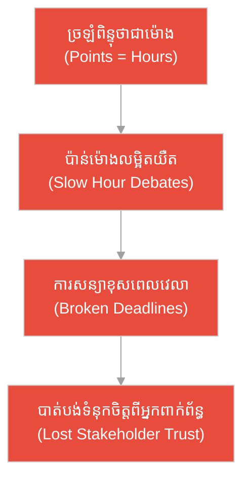
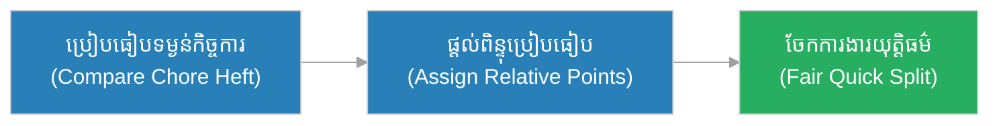
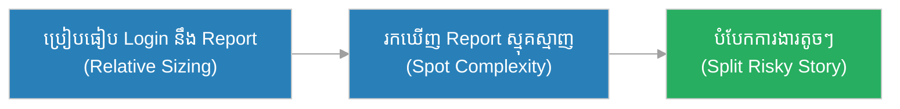
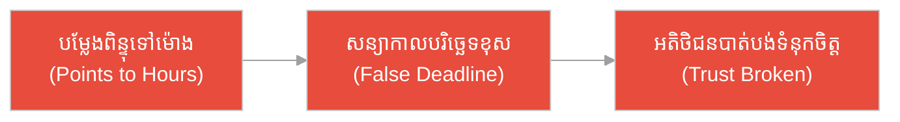
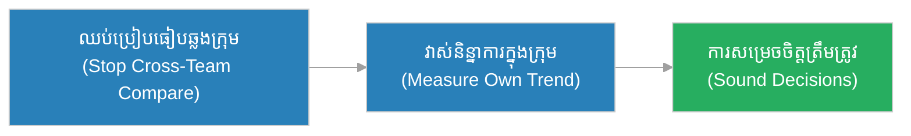
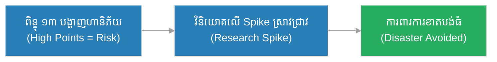
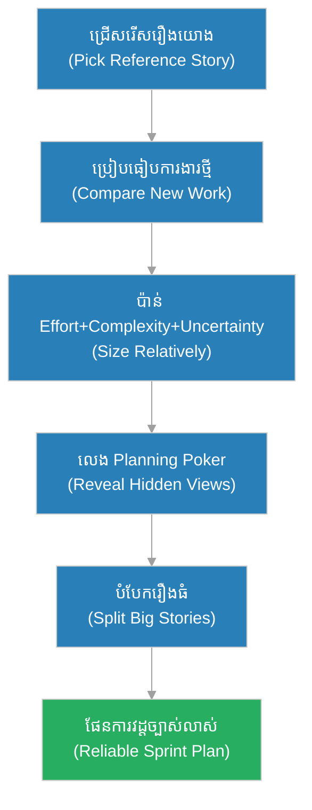

# ពិន្ទុរឿង (Story Points)៖ អ្នក​លីថ្ម​ដែល​ប្រៀបធៀបទម្ងន់ និង​មេ​ការ​ដែល​ទាមទារជញ្ជីង​ជា​ក្រាម (The Porters Who Compared Heft & The Foreman Who Demanded Grams)

**អ្នកនិពន្ធ (Author):** ichamrong 
**កាលបរិច្ឆេទ (Date):** 2026-05-29 
**ស្លាក (Tags):** #agile #scrum #story-points #parable 
**ប្រភេទ (Category):** Management & Leadership 
**រយៈពេលអាន (Read Time):** ~១២ នាទី (~12 min) 

---

## 📌 មាតិកា (Table of Contents)
- [អន្ទាក់​នៃ​ការ​ប៉ាន់ស្​មាន (The Estimation Trap)](#0)
- [១. រឿងប្រៀបប្រដូច៖ អ្នក​លីថ្ម និង​ជញ្ជីង​ជា​ក្រាម (The Parable: The Porters & The Gram Scale)](#1)
- [២. បញ្ហា៖ ការ​ច្រឡំ​ពិន្ទុរឿង​ថា​ជា​ម៉ោង (The Issue: Mistaking Points for Hours)](#2)
- [៣. ឧទាហរណ៍​ជាក់ស្តែង​ក្នុង​ពិភពពិត (Real World Examples)](#3)
 - [ឧទាហរណ៍​ទី ១ — កម្រិតស្រាល (គ្រួសារ)៖ ការ​ប៉ាន់​ការ​ងារផ្ទះ​ប្រចាំសប្តាហ៍ (The Household Chores Sizing)](#3-1)
 - [ឧទាហរណ៍​ទី ២ — កម្រិតមធ្យម (បច្ចេកទេស)៖ ការ​ប៉ាន់មុខងារ Login និង Report (The Login vs. Report Sizing)](#3-2)
 - [ឧទាហរណ៍​ទី ៣ — កម្រិតមធ្យម (ធុរកិច្ច)៖ ការ​សន្យា​កាលបរិច្ឆេទ​ដោយ​ផ្អែក​លើ​ម៉ោង (The Hour-Based Promise)](#3-3)
 - [ឧទាហរណ៍​ទី ៤ — កម្រិតមធ្យម (គ្រប់​គ្រង)៖ ការ​ប្រៀបធៀបល្បឿនក្រុម​ដោយ​ម៉ោង (The Cross-Team Hour Comparison)](#3-4)
 - [ឧទាហរណ៍​ទី ៥ — កម្រិតធ្ងន់ (ហានិភ័យខ្ពស់)៖ ការ​ប៉ាន់​ប្រព័ន្ធ​ធនាគារដ៏ស្មុគស្មាញ (The Banking Core Migration)](#3-5)
- [៤. ការ​សន្ទនាបែបសាកសួរ (Socratic Dialogue: Time vs. Relative Effort)](#4)
- [៥. ដំណោះស្រាយ៖ ការ​ប៉ាន់​ដោយ​ប្រៀបធៀប (The Solution: Relative Estimation)](#5)
- [សេចក្តីសន្និដ្ឋាន (Conclusion)](#6)
- [ឯកសារយោង (References)](#7)
- [Related Posts](#8)

---

## អន្ទាក់​នៃ​ការ​ប៉ាន់ស្​មាន (The Estimation Trap)

នៅ​ពេល​ប៉ាន់ស្​មាន​ការ​ងារ ក្រុ​មក​ារងារ​តែ​ង​តែ​ធ្លាក់ចូល​ទៅ​ក្នុង​ភាពផ្ទុយគ្នា​ពី​រ៖

* **អន្ទាក់​ជញ្ជីង​ជា​ក្រាម (The Exact-Hours Trap):** «សូមប្រាប់ខ្ញុំឱ្យច្បាស់ថា ការ​ងារ​នេះ​ត្រូវ​ការ ៧ ម៉ោង ៣០ នាទីច្បាស់ ៗ កុំ​ឱ្យខុសសូម្បី​តែ ១ នាទី!»
* **អន្ទាក់​ប៉ាន់ស្ទាបស្ទង់ (The Vague-Guess Trap):** «កុំ​ខ្វល់​ពី​ការ​ប៉ាន់ឱ្យសោះ! គ្រាន់​តែ​ធ្វើ​ទៅ បាន​ដល់ណាដល់​នោះ!»

---

## ១. រឿងប្រៀបប្រដូច៖ អ្នក​លីថ្ម និង​ជញ្ជីង​ជា​ក្រាម (The Parable: The Porters & The Gram Scale)

កាល​ពី​ព្រេងនាយ មាន​គម្រោង​សាងសង់ប្រាសាទថ្មដ៏ធំមួយ ដែល​ត្រូវ​ការ​អ្នក​លីថ្មរាប់រយនាក់ដឹកដុំថ្ម​ពី​ភ្នំ​ទៅកាន់​ទីតាំងសាងសង់។ មុន​ពេល​ចែក​ការ​ងារ មេក្រុម​អ្នក​លីម្នាក់ឈ្មោះ **ដារ៉ា (Dara)** បាន​បង្រៀនកូនក្រុមថា៖ «កុំ​ខ្វល់ថាដុំថ្ម​នេះ​ធ្ងន់ប៉ុន្​មាន​ក្រាម​ឡើយ។ គ្រាន់​តែ​មើល ហើយប្រាប់ខ្ញុំថា ដុំ​នេះ​ធ្ងន់ប្រហែល​ជា ‹ពី​រដង› នៃ​ដុំតូច​នោះ ឬ ‹បីដង› នោះ​គ្រប់​គ្រាន់ហើយ»។

ដោយ​ប្រៀបធៀបទម្ងន់ដុំថ្ម​ទៅ​នឹងគ្នា​ទៅ​វិញ​ទៅ​មក (ដុំស្តង់ដារតូចមួយ = ១ ឯកតា) ក្រុម​របស់​ដារ៉ា​បាន​បែងចែក​ការ​ងារ​យ៉ាង​លឿន ដឹងថាដុំធំ ៗ ត្រូវ​ការ​អ្នក​លីច្រើននាក់ និង​បាន​ដឹកដុំថ្មរាប់រយ​ក្នុង​មួយថ្ងៃ។ ពួកគេ​មិន​បាច់ខ្វល់ថា ‹ក្រាមមួយ› ស្មើនឹង​ពេល​ប៉ុន្​មាន​នោះ​ទេ ព្រោះ​ការ​ប្រៀបធៀប​ធ្វើ​បាន​លឿន និង​គ្រប់​គ្នាយល់ស្របគ្នា។

ផ្ទុយ​ទៅ​វិញ មេ​ការ​ម្នាក់ទៀត​បាន​ទាមទារឱ្យ​អ្នក​លីដាក់ដុំថ្ម​នីមួយ ៗ ឡើងជញ្ជីង ដើម្បី​កត់ត្រាទម្ងន់​ជា​ក្រាមឱ្យ​បាន​ច្បាស់លាស់​មុន​នឹងលី។ ការ​ថ្លឹងថ្មរាប់រយដុំចំណាយ​ពេល​ពេញមួយថ្ងៃ ហើយលទ្ធផល៖ ដុំថ្មមួយដុំក៏​មិន​ទាន់​បាន​ដឹក​ទៅ​ទីតាំងសាងសង់​ឡើយ។ ការ​ទាមទារ «លេខច្បាស់លាស់» បាន​ធ្វើ​ឱ្យ​គម្រោង​ទាំងមូលគាំងស្ថិតនៅនឹងកន្លែង។

---

## ២. បញ្ហា៖ ការ​ច្រឡំ​ពិន្ទុរឿង​ថា​ជា​ម៉ោង (The Issue: Mistaking Points for Hours)

នៅក្នុង Agile, **ពិន្ទុរឿង (Story Points)** គឺជា​ឯកតារង្វាស់​ដោយ «ប្រៀបធៀប» (Relative) ដែល​ឆ្លុះបញ្ចាំង​ពី​ការ​ខិតខំ (Effort) ភាពស្មុគស្មាញ (Complexity) និង​ភាព​មិន​ច្បាស់លាស់ (Uncertainty) នៃ​ការ​ងារមួយ — មិន​មែន​ជា «ម៉ោង» (Hours) នោះ​ឡើយ។

កំហុសធំបំផុត​គឺ​ការ​ច្រឡំថា **«ពិន្ទុរឿង = ម៉ោង»**។ នៅ​ពេល​ក្រុ​មក​ារងារបម្លែងពិន្ទុ​ទៅ​ជា​ម៉ោងវិញ ពួកគេបាត់បង់អត្ថប្រយោជន៍​ទាំងអស់​នៃ​ការ​ប៉ាន់​ដោយ​ប្រៀបធៀប ហើយត្រឡប់​ទៅ​រក​ការ​ថ្លឹង «ជា​ក្រាម» ដែល​យឺត និង​មិន​ត្រឹម​ត្រូវ​វិញ។

---

## ៣. ឧទាហរណ៍​ជាក់ស្តែង​ក្នុង​ពិភពពិត

សូមពិនិត្យមើលរបៀប​ដែល​ការ​ប៉ាន់​ដោយ​ប្រៀបធៀប ជះឥទ្ធិពលដល់កម្រិតជីវិត និង​ការ​ងារទាំង ៥ ខាងក្រោម៖

---

### ឧទាហរណ៍​ទី ១ — កម្រិតស្រាល (គ្រួសារ)៖ ការ​ប៉ាន់​ការ​ងារផ្ទះ​ប្រចាំសប្តាហ៍ (The Household Chores Sizing)

* **ស្ថានភាព៖** គ្រួសារមួយចែក​ការ​ងារផ្ទះ។ ជំនួសឱ្យ​ការ​ឈ្លោះថា «បោកខោអាវ​ត្រូវ​ការ​ប៉ុន្​មាន​នាទីច្បាស់ ៗ » ពួកគេយល់ស្របថា៖ ការ​លាងចាន​គឺ ១ ពិន្ទុ បោកខោអាវធ្ងន់​ជា​ងបន្តិច = ២ ពិន្ទុ និង​សម្អាតផ្ទះទាំងមូល = ៥ ពិន្ទុ។
* **លទ្ធផល៖** គ្រួសារចែក​ការ​ងារ​បាន​យ៉ាង​លឿន​ដោយ​យុត្តិធម៌ ដោយ​ផ្អែក​លើ «ទម្ងន់ប្រៀបធៀប» នៃ​កិច្ច​ការ ដោយ​មិន​មាន​ការ​ឈ្លោះប្រ​កែ​កគ្នា​ពី​នាទីច្បាស់ ៗ ។

---

### ឧទាហរណ៍​ទី ២ — កម្រិតមធ្យម (បច្ចេកទេស)៖ ការ​ប៉ាន់មុខងារ Login និង Report (The Login vs. Report Sizing)

* **ស្ថានភាព៖** ក្រុមអភិវឌ្ឍន៍​ប្រើ Planning Poker ដើម្បី​ប៉ាន់។ មុខងារ Login ធម្មតា = ៣ ពិន្ទុ។ មុខងាររបាយ​ការ​ណ៍​ដែល​ត្រូវ​ទាញ​ទិន្នន័យ​ពី​ប្រភពច្រើន និង​មាន​ភាព​មិន​ច្បាស់លាស់ខ្ពស់ = ៨ ពិន្ទុ (មិន​មែន​ព្រោះ​វាយូរ ប៉ុន្តែ​ព្រោះ​វាស្មុគស្មាញ និង​មាន​ហានិភ័យ)។
* **លទ្ធផល៖** ក្រុ​មក​ំណត់អាទិភាព និង​បំបែករបាយ​ការ​ណ៍ ៨ ពិន្ទុចេញ​ជា​បំណែកតូច ៗ ដោយ​ដឹង​ជា​មុន​ថាវាប្រថុយ មុន​ពេល​វាក្លាយ​ជា​បញ្ហា។

---

### ឧទាហរណ៍​ទី ៣ — កម្រិតមធ្យម (ធុរកិច្ច)៖ ការ​សន្យា​កាលបរិច្ឆេទ​ដោយ​ផ្អែក​លើ​ម៉ោង (The Hour-Based Promise)

* **ស្ថានភាព៖** អ្នក​គ្រប់​គ្រងផលិតផលបម្លែងពិន្ទុ ៤០ ទៅ​ជា «៤០ ម៉ោង = ៥ ថ្ងៃ» ហើយសន្យា​ជា​មួយអតិថិជនថានឹងបញ្ជូន​ក្នុង ១ សប្តាហ៍ ដោយ​មិន​គិត​ពី​ការប្រជុំ ការ​សាកល្បង និង​ភាព​មិន​ច្បាស់លាស់។
* **លទ្ធផល៖** ការ​ងារ​ត្រូវ​ការ ៣ សប្តាហ៍​ជាក់ស្តែង។ អតិថិជនខឹង ហើយក្រុម​ត្រូវ​ធ្វើ​ការ​យប់​ដើម្បី​សង់​ការ​សន្យាខុសឆ្គង​នោះ — ការ​ច្រឡំ «ពិន្ទុ = ម៉ោង» បាន​បំផ្លាញទំនុកចិត្ត។

---

### ឧទាហរណ៍​ទី ៤ — កម្រិតមធ្យម (គ្រប់​គ្រង)៖ ការ​ប្រៀបធៀបល្បឿនក្រុម​ដោយ​ម៉ោង (The Cross-Team Hour Comparison)

* **ស្ថានភាព៖** អ្នក​គ្រប់​គ្រងព្យាយាមប្រៀបធៀបក្រុម A (៥០ ពិន្ទុ/វដ្ត) និង​ក្រុម B (៣០ ពិន្ទុ/វដ្ត) ដោយ​សន្និដ្ឋានថាក្រុម A ខ្​ជា​ប់ខ្ជួន​ជា​ង។ ប៉ុន្តែ​ពិន្ទុ​របស់​ក្រុម​នីមួយ ៗ គឺជា​ខ្នាតរង្វាស់ផ្ទាល់ខ្លួន មិន​អាចប្រៀបធៀបឆ្លងក្រុម​បាន​ឡើយ។
* **លទ្ធផល៖** អ្នក​គ្រប់​គ្រង​បាន​រៀនថា ពិន្ទុ​ជា «ភាសា​ក្នុង​ក្រុម» ហើយប្តូរ​ទៅ​វាស់និន្នា​ការ (Trend) ក្នុង​ក្រុម​នីមួយ ៗ វិញ ដោយ​ឈប់ប្រៀបធៀបឆ្លងក្រុម​ដែល​គ្មាន​ន័យ។

---

### ឧទាហរណ៍​ទី ៥ — កម្រិតធ្ងន់ (ហានិភ័យខ្ពស់)៖ ការ​ប៉ាន់​ប្រព័ន្ធ​ធនាគារដ៏ស្មុគស្មាញ (The Banking Core Migration)

* **ស្ថានភាព៖** ធនាគារមួយ​ត្រូវ​ផ្លាស់ប្តូរ​ប្រព័ន្ធ​ស្នូល (Core Banking Migration)។ ការ​ងារ «ផ្ទេរ​ទិន្នន័យ​គណនី» ត្រូវ​បាន​វាយតម្លៃ ១៣ ពិន្ទុ — មិន​មែន​ព្រោះ​វាយូរ ប៉ុន្តែ​ព្រោះ​មាន​ហានិភ័យបាត់បង់លុយអតិថិជន និង​ភាព​មិន​ច្បាស់លាស់ខ្ពស់បំផុត។
* **លទ្ធផល៖** ដោយសារ​ពិន្ទុខ្ពស់​បាន​បង្ហាញ «ភាព​មិន​ច្បាស់លាស់» ក្រុម​បាន​វិនិយោគ​លើ Spike ស្រាវជ្រាវ និង​សាកល្បង​ជា​មុន ការ​ពារធនាគារ​ពី​ការ​ខាតបង់រាប់លានដុល្លារ។

---

## ៤. ការ​សន្ទនាបែបសាកសួរ (Socratic Dialogue: Time vs. Relative Effort)

**សិស្ស (អ្នក​អភិវឌ្ឍ​ន៍)៖** លោកគ្រូ! ហេតុអ្វីយើង​មិន​ប៉ាន់​ការ​ងារ​ជា​ម៉ោងឱ្យ​តែ​ម្តង? វាងាយយល់​ជា​ង។ ពិន្ទុ ៥ មាន​ន័យថាប៉ុន្​មាន​ម៉ោង​ទៅ?

**គ្រូ (វិស្វករ​ជា​ន់ខ្ពស់)៖** សួរ​បាន​ល្អ។ អនុញ្ញាតឱ្យខ្ញុំសួរវិញ៖ ប្រសិនបើខ្ញុំសុំឱ្យឯងលីដុំថ្ម​ពី​រដុំ ឯងអាចប្រាប់ខ្ញុំភ្លាម ៗ ទេថា ដុំណាធ្ងន់​ជា​ង?

**សិស្ស៖** បាន​ស្រួលណាស់ ខ្ញុំគ្រាន់​តែ​លើ​កវាមើល ក៏ដឹងភ្លាមថាមួយណាធ្ងន់​ជា​ង។

**គ្រូ៖** ត្រឹម​ត្រូវ។ ឥឡូវ ខ្ញុំសុំឱ្យឯងប្រាប់ថា ដុំ​នីមួយ ៗ ធ្ងន់ប៉ុន្​មាន​ក្រាមច្បាស់ ៗ តើ​ឯង​ធ្វើ​បាន​លឿន​ដែរទេ?

**សិស្ស៖** អត់ទេលោកគ្រូ ខ្ញុំ​ត្រូវ​រកជញ្ជីង ហើយវា​យឺត ហើយខ្ញុំក៏ប្រហែល​ជា​ខុសទៀត។

**គ្រូ៖** នេះ​ហើយ​ជា​ចំណុចសំខាន់! មនុស្សយើងពូ​កែ «ប្រៀបធៀប» ជា​ង «វាស់ច្បាស់»។ ការ​ប៉ាន់​ជា​ម៉ោង​គឺ​ដូចជា​ការ​ទាមទារក្រាមច្បាស់ ៗ — យឺត និង​ពោរពេញ​ដោយ​ការ​ខុសឆ្គង។ ដូច្​នេះ តើ​ពិន្ទុ ៥ ស្មើនឹងម៉ោងថេរមួយ​ឬ?

**សិស្ស៖** ប្រហែល​ជា​អត់ទេ ព្រោះ​អ្នក​លឿន​អាច​ធ្វើ​បាន ៣ ម៉ោង ឯ​អ្នក​ថ្មី​អាច​ត្រូវ​ការ ៨ ម៉ោង តែ​ទម្ងន់​ការ​ងារនៅ​តែ ៥ ដ​ដែល។

**គ្រូ៖** ពិតប្រាកដ! ពិន្ទុរឺងវាស់ «ទម្ងន់​ការ​ងារ» (Effort, Complexity, Uncertainty) មិន​មែន «ពេល​វេលា» របស់​បុគ្គលណាម្នាក់​ឡើយ។ ម៉ោងផ្លាស់ប្តូរ​តាម​មនុស្ស តែ​ទម្ងន់​នៃ​ថ្មនៅដ​ដែល។ នោះ​ហើយ​ជា​មូលហេតុ​ដែល​យើងប្រើពិន្ទុ។

---

## ៥. ដំណោះស្រាយ៖ ការ​ប៉ាន់​ដោយ​ប្រៀបធៀប (The Solution: Relative Estimation)

ដើម្បី​ប្រើ​ពិន្ទុរឿង​ឱ្យ​បាន​ត្រឹម​ត្រូវ ក្រុ​មក​ារងារ​ត្រូវ​អនុវត្តគោល​ការ​ណ៍​ខាងក្រោម៖

1. **ជ្រើសរើសរឿងយោង (Pick a Reference Story):** ជ្រើសរើស​ការ​ងារតូចមួយ​ដែល​គ្រប់​គ្នាស្គាល់ច្បាស់ ហើយកំណត់វា​ជា ១ ឬ ២ ពិន្ទុ ដើម្បី​ប្រើ​ជា «ដុំថ្មស្តង់ដារ» សម្រាប់​ប្រៀបធៀប។
2. **ប្រើស៊េរី Fibonacci (Use Fibonacci):** ប្រើ ១, ២, ៣, ៥, ៨, ១៣, ២១ ដើម្បី​ឆ្លុះបញ្ចាំងថា ការ​ងារធំ មាន​ភាព​មិន​ច្បាស់លាស់កើនឡើង​ជា​លំដាប់ ដូច្​នេះ​មិន​អាចប៉ាន់​បាន​ច្បាស់។
3. **ប៉ាន់ត្រីភាគី (Effort + Complexity + Uncertainty):** ត្រូវ​ចងចាំថា ពិន្ទុ​មិន​មែន​ជា​ម៉ោង​ឡើយ ប៉ុន្តែ​ជា​ការ​ផ្សំគ្នា​នៃ​ការ​ខិតខំ ភាពស្មុគស្មាញ និង​ហានិភ័យ។
4. **លេង Planning Poker (Play Planning Poker):** ឱ្យ​សមាជិក​ម្នាក់ ៗ ប៉ាន់​ដោយ​ឯករាជ្យ បន្ទាប់​មក​ពិភាក្សា​ពេល​លេខខុសគ្នា​ខ្លាំង ដើម្បី​បង្ហាញ​ការ​យល់ដឹង​ដែល​លាក់កំបាំង។
5. **បំបែករឿងធំ (Split Large Stories):** ការ​ងារ ១៣ ពិន្ទុឡើងគួរ​ត្រូវ​បំបែក​ជា​បំណែកតូច ៗ មុន​ពេល​ដាក់ចូលវដ្ត​ការ​ងារ។

---

## 🐇 ធ្លាក់ចូល​ក្នុង​រន្ធទន្សាយ (Enter the Rabbit Hole)

ដើម្បី​យល់ដឹងកាន់​តែ​ស៊ីជម្រៅអំ​ពី​ការ​ប៉ាន់ស្​មាន និង​ការ​វាស់ល្បឿនក្រុ​មក​ារងារ សូមស្វែងយល់បន្ថែម៖

* 🚀 **[ល្បឿនក្រុ​មក​ារងារ (Velocity) ➔](./velocity.md)**
* 🚀 **[ការ​រៀបចំផែន​ការ​វដ្ត​ការ​ងារ (Sprint Planning) ➔](../ceremonies/sprint-planning.md)**
* 🚀 **[រឿង​អ្នកប្រើប្រាស់ (User Story) ➔](../artifacts/user-story.md)**

---

## សេចក្តីសន្និដ្ឋាន (Conclusion)

> **«ពិន្ទុរឿង​មិន​មែន​ជា​ការ​វាស់​ពេល​វេលា​ឡើយ ប៉ុន្តែ​វា​ជា​ការ​ប្រៀបធៀបទម្ងន់​ការ​ងារ ដូច​អ្នក​លី​លើ​កដុំថ្ម​ពី​រ ប្រៀបធៀបគ្នា លឿន​ជា​ង​ការ​ថ្លឹង​ជា​ក្រាម។»**

ការ​ប្រើ​ពិន្ទុរឿង​ដ៏ត្រឹម​ត្រូវ ជួយឱ្យក្រុ​មក​ារងារប៉ាន់ស្​មាន​បាន​លឿន ខ្​ជា​ប់ខ្ជួន និង​ស្មោះត្រង់ ដោយ​ផ្តោត​លើ​ទម្ងន់ប្រៀបធៀប​នៃ​ការ​ងារ ជា​ជា​ង​ការ​ដេញ​តាម​លេខម៉ោងច្បាស់ ៗ ដែល​ផ្លាស់ប្តូរ​តាម​មនុស្ស និង​បំផ្លាញ​ការ​សន្យា។

---

## ឯកសារយោង (References)

* **Mike Cohn** — *Agile Estimating and Planning* (2005).
* **Ken Schwaber & Jeff Sutherland** — *The Scrum Guide* (2020).

---

## Related Posts

* [ល្បឿនក្រុ​មក​ារងារ (Velocity)](./velocity.md) — របៀបបូកសរុប​ពិន្ទុរឿង​ដែល​បញ្ចប់ ដើម្បី​ព្យាករណ៍សមត្ថភាពក្រុម។
* [ការ​រៀបចំផែន​ការ​វដ្ត​ការ​ងារ (Sprint Planning)](../ceremonies/sprint-planning.md) — របៀបប្រើពិន្ទុ​ដើម្បី​ជ្រើសរើស​ការ​ងារ​សម្រាប់​វដ្ត។
* [រឿង​អ្នកប្រើប្រាស់ (User Story)](../artifacts/user-story.md) — អង្គភាព​ការ​ងារ​ដែល​យើងផ្តល់ពិន្ទុឱ្យ។
