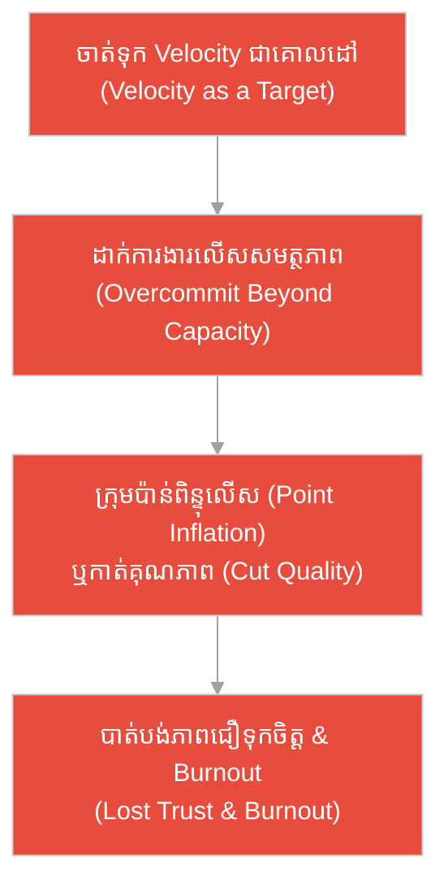
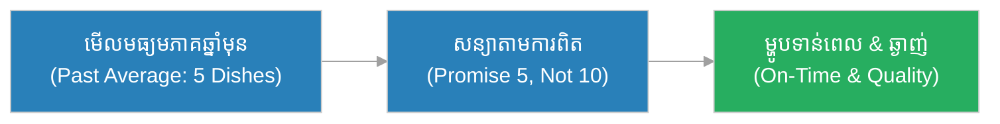
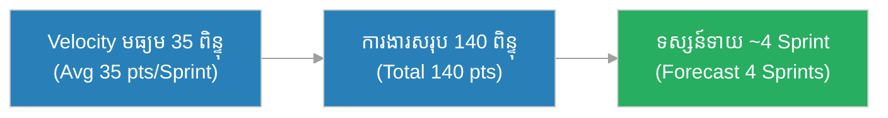
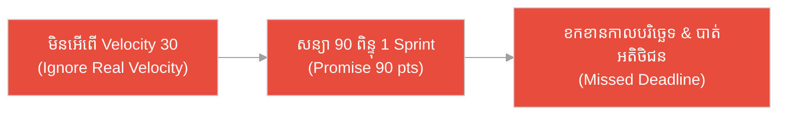
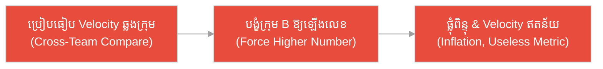
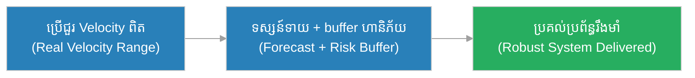
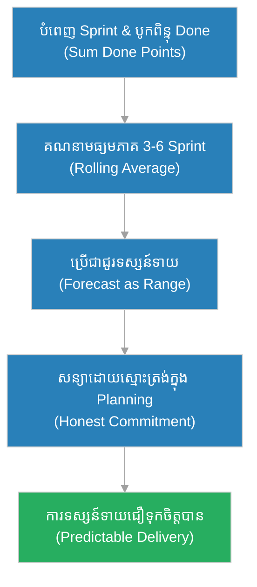

# ល្បឿនការងារ និង Story Points (Velocity & Story Points)៖ អ្នក​អុំទូកចម្លងទន្លេ និង​សន្យាដ៏ស្មោះត្រង់ (The Ferryman & The Honest Promise)

**អ្នកនិពន្ធ (Author):** ichamrong 
**កាលបរិច្ឆេទ (Date):** 2026-05-29 
**ស្លាក (Tags):** #agile #scrum #velocity #parable 
**ប្រភេទ (Category):** Management & Leadership 
**រយៈពេលអាន (Read Time):** ~១២ នាទី (~12 min) 

---

## 📌 មាតិកា (Table of Contents)
- [អន្ទាក់​នៃ​ល្បឿន (The Velocity Trap)](#0)
- [១. រឿងប្រៀបប្រដូច៖ អ្នក​អុំទូកចម្លងទន្លេ និង​សន្យាដ៏ស្មោះត្រង់ (The Parable: The Ferryman & The Honest Promise)](#1)
- [២. បញ្ហា៖ ការ​យល់ច្រឡំ Velocity ជា​ពិន្ទុផលិតភាព (The Issue: Velocity Mistaken for a Productivity Score)](#2)
- [៣. ឧទាហរណ៍​ជាក់ស្តែង​ក្នុង​ពិភពពិត (Real World Examples)](#3)
 - [ឧទាហរណ៍​ទី ១ — កម្រិតស្រាល (គ្រួសារ)៖ ការ​ប៉ាន់ស្​មាន​ពេល​ធ្វើ​ម្ហូបពិធីបុណ្យ (The Festival Cooking Estimate)](#3-1)
 - [ឧទាហរណ៍​ទី ២ — កម្រិតមធ្យម (បច្ចេកទេស)៖ ការ​ផ្ទេរ​ទិន្នន័យ​ចាស់​ទៅ​ប្រព័ន្ធ​ថ្មី (The Data Migration Forecast)](#3-2)
 - [ឧទាហរណ៍​ទី ៣ — កម្រិតមធ្យម (ធុរកិច្ច)៖ ការ​សន្យា​កាលបរិច្ឆេទ​ដាក់ផ្សារ (The Launch Date Promise)](#3-3)
 - [ឧទាហរណ៍​ទី ៤ — កម្រិតមធ្យម (គ្រប់​គ្រង)៖ ការ​ប្រៀបធៀបក្រុម​ពី​រ​ដោយ Velocity (The Cross-Team Comparison)](#3-4)
 - [ឧទាហរណ៍​ទី ៥ — កម្រិតធ្ងន់ (ហានិភ័យខ្ពស់)៖ ការ​សន្យាកិច្ចសន្យារដ្ឋាភិបាល (The Government Contract Bid)](#3-5)
- [៤. ការ​សន្ទនាបែបសាកសួរ (Socratic Dialogue: Target vs. Forecast)](#4)
- [៥. ដំណោះស្រាយ៖ ការ​ប្រើ Velocity ជា​ឧបករណ៍ទស្សន៍ទាយ (The Solution: Velocity as a Forecasting Tool)](#5)
- [សេចក្តីសន្និដ្ឋាន (Conclusion)](#6)
- [ឯកសារយោង (References)](#7)
- [Related Posts](#8)

---

## អន្ទាក់​នៃ​ល្បឿន (The Velocity Trap)

នៅ​ពេល​និយាយ​ពី Velocity យើង​តែ​ង​តែ​ធ្លាក់ចូល​ទៅ​ក្នុង​ភាពផ្ទុយគ្នា​ពី​រ៖

* **អន្ទាក់​ការ​ប្រកួតប្រជែង (The Scoreboard Trap):** «Velocity របស់​ក្រុម A គឺ ៥០ ពិន្ទុ តែ​ក្រុម B បាន​ត្រឹម ៣០ ពិន្ទុ ដូច្​នេះ​ក្រុម B ខ្ជិល! ត្រូវ​បង្ខំឱ្យពួកគេ​ធ្វើ​ឱ្យ​បាន​លឿន​ជា​ង​នេះ!»
* **អន្ទាក់​ការ​សន្យាមហិច្ឆតា (The Wishful Promise Trap):** «យើង​មិន​ដែល​ធ្វើ​បាន ៤០ ពិន្ទុទេ តែ​ខ្ញុំសន្យា​ជា​មួយអតិថិជនថានឹង​បាន ៦០ ពិន្ទុ Sprint នេះ ដើម្បី​ឱ្យគេពេញចិត្ត!»

---

## ១. រឿងប្រៀបប្រដូច៖ អ្នក​អុំទូកចម្លងទន្លេ និង​សន្យាដ៏ស្មោះត្រង់ (The Parable: The Ferryman & The Honest Promise)

នៅភូមិមួយ​ដែល​មាន​ទន្លេធំហូរកាត់ មាន​អ្នក​អុំទូកចម្លងម្នាក់ឈ្មោះ **ប៉ុល (Pol)** ដែល​ធ្វើ​ការ​នេះ​អស់​រយៈពេល​ជា​ច្រើនឆ្នាំ។ ប៉ុលដឹងច្បាស់​ពី​ខ្លួនឯង៖ ក្នុង​មួយថ្ងៃ ដោយ​គិតទាំងខ្យល់ ទាំងចរន្តទឹក និង​កម្លាំង​ពិតប្រាកដ​របស់​គាត់ គាត់អាចចម្លង​អ្នក​ដំណើរឆ្លងទន្លេ​បាន **ប្រហែល ៨ ដង** ជា​មធ្យម។ ខ្លះថ្ងៃ​បាន ៧ ខ្លះថ្ងៃ​បាន ៩ តែ​ជា​មធ្យម​គឺ ៨។

ដូច្​នេះ នៅ​ពេល​អ្នក​ដំណើរសួរថា «តើ​ថ្ងៃ​នេះ​អ្នក​អាចចម្លងពួកយើង​បាន​ទេ?» ប៉ុលឆ្​លើ​យ​ដោយ​ស្មោះត្រង់៖ «ខ្ញុំទទួល​បាន​ត្រឹម ៨ ក្រុមថ្ងៃ​នេះ​ទេ ព្រោះ​នោះ​ជា​អ្វី​ដែល​ខ្ញុំ​ធ្វើ​បាន​ពិតប្រាកដ។ ក្រុម​ដែល​លើ​ស​ពី​នេះ សូម​មក​វិញថ្ងៃស្អែក។» អ្នក​ដំណើរ​ទាំងអស់​ដែល​គាត់ទទួលសន្យា ត្រូវ​បាន​ចម្លងដល់ត្រើយម្ខាង​ដោយ​សុវត្ថិភាព មុន​ពេល​ថ្ងៃលិច។

ផ្ទុយ​ទៅ​វិញ មាន​អ្នក​អុំទូក​ថ្មី​ម្នាក់ឈ្មោះ **រិទ្ធ (Rith)** ដែល​ចង់​បាន​ឈ្មោះល្បី និង​ចង់​បាន​ប្រាក់ច្រើន។ គាត់សន្យា​ជា​មួយ​អ្នក​ដំណើរ ២០ ក្រុ​មក​្នុងមួយថ្ងៃ — ជា​លេខ​ដែល​គាត់​មិន​ដែល​ធ្វើ​បាន​ឡើយ តែ​គ្រាន់​តែ​ប្រាថ្នា​ចង់​បាន។ លុះដល់ថ្ងៃលិច រិទ្ធអុំ​បាន​ត្រឹម ៩ ក្រុមប៉ុណ្ណោះ ហើយ​អ្នក​ដំណើរពាក់កណ្តាល​ត្រូវ​ជា​ប់នៅត្រើយខាង​នេះ​ក្នុង​ភាពងងឹត ខឹងសម្បារ និង​លែងជឿទុកចិត្តគាត់ទៀត​ឡើយ។ ការ​សន្យាដ៏មហិច្ឆ​តាម​ិន​បាន​បង្កើន​ល្បឿនអុំទូក​របស់​គាត់សូម្បី​តែ​បន្តិច។

---

## ២. បញ្ហា៖ ការ​យល់ច្រឡំ Velocity ជា​ពិន្ទុផលិតភាព (The Issue: Velocity Mistaken for a Productivity Score)

**Story Points** គឺជា​ខ្នាតរង្វាស់​លក្ខណៈ​ធៀប (Relative Metric) ដែល​ក្រុ​មក​ារងារប្រើ​ដើម្បី​ប៉ាន់ស្​មាន **ភាពស្មុគស្មាញ (Complexity)** **ការ​ប្រថុយប្រថាន (Risk)** និង **ទំហំ​ការ​ងារ (Effort)** នៃ User Story មិន​មែន​រយៈពេល​ជា​ម៉ោង​ឡើយ។ ក្រុមភាគច្រើនប្រើ **មាត្រដ្ឋានហ្វីបូណាស៊ី (Fibonacci)**៖ `1, 2, 3, 5, 8, 13, 20, 40, 100`។

**ល្បឿនការងារ (Velocity)** គឺជា​ការ​បូកសរុបចំនួន Story Points នៃ​កិច្ច​ការ​ដែល​បាន​សម្រេច​ជា​ស្ថាពរ (Done ១០០% តាម DoD) ក្នុង Sprint នីមួយ ៗ ។ វា​ជា **មធ្យមភាគ​ជាក់ស្តែង​ផ្ទាល់ខ្លួន​របស់​ក្រុម​នីមួយ ៗ ** ដែល​ប្រើ​សម្រាប់ **ការ​ទស្សន៍ទាយ (Forecasting)** ប៉ុណ្ណោះ។

> **កំហុសធ្ងន់ធ្ងរ៖** Velocity **មិន​មែន** ជា​ពិន្ទុផលិតភាព (Productivity Score) ដើម្បី​ប្រៀបធៀបក្រុមមួយ​ទៅ​ក្រុមមួយ ឬ​ដើម្បី​បង្ខំក្រុមឱ្យ​ធ្វើ​លឿន​ជា​ង​មុន​ឡើយ។ ការ «បង្កើន​លេខ Velocity» ដោយ​ការ​សន្យាខ្ពស់ មិន​បង្កើន​ល្បឿន​ពិត​របស់​ក្រុម​ឡើយ — ដូចជា​ការ​សន្យាចម្លង ២០ ដង មិន​ធ្វើ​ឱ្យ​អ្នក​អុំទូកអុំ​លឿន​ជា​ង​មុន​ដែរ។

---

## ៣. ឧទាហរណ៍​ជាក់ស្តែង​ក្នុង​ពិភពពិត

សូមពិនិត្យមើលរបៀប​ដែល​ការ​ប្រើ Velocity ត្រឹម​ត្រូវ (ឬ​ខុស) ជះឥទ្ធិពលដល់កម្រិតជីវិត និង​ការ​ងារទាំង ៥ ខាងក្រោម៖

---

### ឧទាហរណ៍​ទី ១ — កម្រិតស្រាល (គ្រួសារ)៖ ការ​ប៉ាន់ស្​មាន​ពេល​ធ្វើ​ម្ហូបពិធីបុណ្យ (The Festival Cooking Estimate)

* **ស្ថានភាព (Situation):** ម្តាយម្នាក់​ត្រូវ​ធ្វើ​ម្ហូប​សម្រាប់​ពិធីបុណ្យគ្រួសារ។ ពី​បទពិសោធន៍ឆ្នាំ​មុន ៗ គាត់ដឹងថា ក្នុង​មួយព្រឹក គាត់រៀបចំ​បាន **ប្រហែល ៥ មុខម្ហូប** ជា​មធ្យម។ ឆ្នាំ​នេះ គាត់ប្រាប់សាច់ញាតិថា «ខ្ញុំធានា​បាន ៥ មុខ ឯមុខផ្សេងសូមជួយគ្នា»។
* **លទ្ធផល (Result):** ម្ហូបទាំង ៥ មុខចេញ​មក​ទាន់​ពេល និង​មាន​រស​ជា​តិ​ល្អ ព្រោះ​ការ​សន្យាផ្អែក​លើ​មធ្យមភាគ​ជាក់ស្តែង មិន​មែន​លើ​ការ​ប្រាថ្នា​ឡើយ។

---

### ឧទាហរណ៍​ទី ២ — កម្រិតមធ្យម (បច្ចេកទេស)៖ ការ​ផ្ទេរ​ទិន្នន័យ​ចាស់​ទៅ​ប្រព័ន្ធ​ថ្មី (The Data Migration Forecast)

* **ស្ថានភាព (Situation):** ក្រុមវិស្វករ​ត្រូវ​ផ្ទេរតារាង​ទិន្នន័យ​ចំនួន ៦០ តារាង។ បន្ទាប់​ពី ៣ Sprint ដំបូង ពួកគេរកឃើញ Velocity មធ្យមភាគ ៣៥ ពិន្ទុ ហើយ​ការ​ផ្ទេរ ៦០ តារាងសរុបស្មើ ១៤០ ពិន្ទុ។ ពួកគេទស្សន៍ទាយថា ត្រូវ​ការ **ប្រហែល ៤ Sprint** ទៀត។
* **លទ្ធផល (Result):** ការ​ទស្សន៍ទាយត្រឹម​ត្រូវ ហើយ​ការ​ផ្ទេរបញ្ចប់​ក្នុង Sprint ទី ៤ ដោយ​គ្មាន​ការ​ប្រញាប់ប្រញាល់ ឬ​កាត់បន្ថយ​ការ​ធ្វើ​តេស្ត​ឡើយ។

---

### ឧទាហរណ៍​ទី ៣ — កម្រិតមធ្យម (ធុរកិច្ច)៖ ការ​សន្យា​កាលបរិច្ឆេទ​ដាក់ផ្សារ (The Launch Date Promise)

* **ស្ថានភាព (Situation):** Product Owner ចង់​ឱ្យមុខងារ ៩០ ពិន្ទុរួច​ក្នុង Sprint តែ​មួយ ខណៈ Velocity មធ្យមភាគ​របស់​ក្រុមគ្រាន់​តែ ៣០ ពិន្ទុ។ គាត់ប្រកាស​កាលបរិច្ឆេទ​ដាក់ផ្សារ​ដោយ​ផ្អែក​លើ ៩០ ពិន្ទុ ដោយ​មិន​ស្តាប់ក្រុម។
* **លទ្ធផល (Result):** ដល់ថ្ងៃកំណត់ មុខងារ​បាន​ត្រឹមមួយភាគបី ហើយក្រុមលក់​ត្រូវ​ខកខានសន្យា​ជា​មួយអតិថិជន — ដូច​អ្នក​ដំណើរ​ដែល​ជា​ប់នៅត្រើយ​ក្នុង​ភាពងងឹត។

---

### ឧទាហរណ៍​ទី ៤ — កម្រិតមធ្យម (គ្រប់​គ្រង)៖ ការ​ប្រៀបធៀបក្រុម​ពី​រ​ដោយ Velocity (The Cross-Team Comparison)

* **ស្ថានភាព (Situation):** អ្នក​គ្រប់​គ្រងម្នាក់ឃើញក្រុម A មាន Velocity ៥០ ពិន្ទុ និង​ក្រុម B មាន ៣០ ពិន្ទុ។ គាត់សន្និដ្ឋានភ្លាមថាក្រុម B ខ្ជិល ហើយបង្ខំឱ្យពួកគេឡើងដល់ ៥០ ពិន្ទុ។ តែ​ការ​ពិត ក្រុម​នីមួយ ៗ កំណត់ពិន្ទុ​តាម​មាត្រដ្ឋានផ្ទាល់ខ្លួន — ៨ ពិន្ទុ​របស់​ក្រុម A មិន​ស្មើ ៨ ពិន្ទុ​របស់​ក្រុម B ឡើយ។
* **លទ្ធផល (Result):** ក្រុម B ចាប់ផ្​តើ​ម «ផ្លុំពិន្ទុ» (Point Inflation) ដោយ​ផ្តល់ពិន្ទុខ្ពស់ ៗ ដើម្បី​ឱ្យលេខស្អាត ប៉ុន្តែ​ផលិតភាព​ពិត​មិន​កើនឡើងសោះ ហើយ​ការ​ទស្សន៍ទាយលែងជឿទុកចិត្ត​បាន។

---

### ឧទាហរណ៍​ទី ៥ — កម្រិតធ្ងន់ (ហានិភ័យខ្ពស់)៖ ការ​សន្យាកិច្ចសន្យារដ្ឋាភិបាល (The Government Contract Bid)

* **ស្ថានភាព (Situation):** ក្រុមហ៊ុនមួយដេញថ្លៃកិច្ចសន្យា​ប្រព័ន្ធ​ពន្ធដារធំ។ ក្រុមអភិវឌ្ឍន៍​ប្រើ Velocity មធ្យមភាគ និង​ជួរប្រែប្រួល (Range) ៣ Sprint ដើម្បី​ទស្សន៍ទាយ ១៨ ខែ ហើយបន្ថែម buffer សម្រាប់​ហានិភ័យ។ ពួកគេបដិសេធ​ការ​ដាក់​កាលបរិច្ឆេទ ៩ ខែ​ដែល​អ្នក​លក់ប្រាថ្នា ព្រោះ​ទិន្នន័យ​ពិត​មិន​គាំទ្រ។
* **លទ្ធផល (Result):** ការ​សន្យាដ៏ស្មោះត្រង់​នេះ ទោះវែង​ជា​ង ប៉ុន្តែ​បាន​រក្សា​ប្រព័ន្ធ​ពន្ធដារដ៏សំខាន់​នេះ​ឱ្យដំណើរ​ការ​ដោយ​គ្មាន​ការ​ដួលរលំ បើប្រៀបនឹងគូប្រកួត​ដែល​សន្យា ៩ ខែ ហើយប្រគល់​ប្រព័ន្ធ​ដែល​មាន​កំហុសធ្ងន់ធ្ងរ។

---

## ៤. ការ​សន្ទនាបែបសាកសួរ (Socratic Dialogue: Target vs. Forecast)

**សិស្ស (Scrum Master ថ្មី)៖** លោកគ្រូ! ប្រធាន​របស់​ខ្ញុំ​ចង់​ឱ្យ Velocity របស់​ក្រុ​មក​ើនឡើង​រាល់ Sprint។ តើ​ខ្ញុំគួរកំណត់ Velocity ៥០ ពិន្ទុ​ជា​គោលដៅ​សម្រាប់ Sprint ក្រោយ​ទេ?

**គ្រូ (Agile Coach)៖** ខ្ញុំសួរវិញ៖ ប្រសិនបើ​អ្នក​អុំទូកសន្យាចម្លង ២០ ដង​ក្នុង​មួយថ្ងៃ ទាំង​ដែល​គាត់​ធ្វើ​បាន​ត្រឹម ៨ ដង តើ​ការ​សន្យា​នោះ​ធ្វើ​ឱ្យដៃគាត់អុំ​លឿន​ជា​ង​មុន​ទេ?

**សិស្ស៖** អត់ទេ លោកគ្រូ។ ដៃគាត់នៅ​តែ​អុំល្បឿនដ​ដែល។

**គ្រូ៖** ដូច្​នេះ Velocity គឺជា​អ្វី — ការ​វាស់ល្បឿន​ពិត​របស់​ដៃ ឬ​ជា​ការ​ប្រាថ្នា​របស់​មាត់?

**សិស្ស៖** គឺ​ការ​វាស់ល្បឿន​ពិត... ដូច្​នេះ ប្រសិនបើខ្ញុំ «កំណត់គោលដៅ» ៥០ ពិន្ទុ ខ្ញុំគ្រាន់​តែ​ប្តូរលេខ មិន​មែនប្តូរល្បឿន​ពិត​ឡើយ។

**គ្រូ៖** ត្រឹម​ត្រូវ។ ហើយប្រសិនបើក្រុម​ត្រូវ​បង្ខំឱ្យឈានដល់ ៥០ ពិន្ទុ តើ​ពួកគេនឹង​ធ្វើ​ដូចម្តេច?

**សិស្ស៖** ពួកគេនឹងផ្តល់ពិន្ទុ ៨ ទៅ​កិច្ច​ការ​ដែល​គួរ​តែ ៣ ប៉ុណ្ណោះ ឬ​កាត់​ការ​ធ្វើ​តេស្តចេញ... ដូច្​នេះ​លេខស្អាត តែ​គុណភាព​ធ្លាក់ចុះ។

**គ្រូ៖** នោះ​ហើយ។ Velocity មិន​មែន​ជា **គោលដៅ (Target)** ដែល​ត្រូវ​ឈានដល់​ឡើយ — វា​ជា **ឧបករណ៍ទស្សន៍ទាយ (Forecast)** ដែល​ប្រាប់យើងថា ការ​ពិត​យើង​ធ្វើ​បាន​ប៉ុន្​មាន ដើម្បី​សន្យា​ដោយ​ស្មោះត្រង់។ ហើយវា​ជា​របស់​ក្រុម​នីមួយ ៗ មិន​មែន​ជា​ក្តារពិន្ទុ (Scoreboard) ដើម្បី​ប្រកួតប្រជែងគ្នា​ឡើយ។

---

## ៥. ដំណោះស្រាយ៖ ការ​ប្រើ Velocity ជា​ឧបករណ៍ទស្សន៍ទាយ (The Solution: Velocity as a Forecasting Tool)

ដើម្បី​ប្រើ Velocity ឱ្យ​បាន​ត្រឹម​ត្រូវ ក្រុ​មក​ារងារ​ត្រូវ​ប្រកាន់ខ្​ជា​ប់នូវគោល​ការ​ណ៍​ខាងក្រោម៖

1. **ប្រើ​ជា​មធ្យមភាគ មិន​មែន​ជា​គោលដៅ (Average, Not Target):** គណនា Velocity មធ្យមភាគ​ពី ៣ ទៅ ៦ Sprint ចុងក្រោយ ហើយប្រើវា​សម្រាប់​ការ​ទស្សន៍ទាយប៉ុណ្ណោះ មិន​មែន​ជា​លេខ​ត្រូវ​ឈានដល់​ឡើយ។
2. **ច្បាប់ ០ ឬ ១០០ (The Zero-or-Done Rule):** កិច្ច​ការ​ដែល​ធ្វើ​បាន​ពាក់កណ្តាល (កូដ​រួច​តែ​មិន​ទាន់តេស្ត) ត្រូវ​រាប់ស្មើ **០ ពិន្ទុ** ក្នុង Sprint នោះ។ គ្មាន​ពិន្ទុមួយផ្នែក​ឡើយ។
3. **កុំ​ប្រៀបធៀបឆ្លងក្រុម (Never Compare Teams):** ៨ ពិន្ទុ​របស់​ក្រុមមួយ​មិន​ស្មើ ៨ ពិន្ទុ​របស់​ក្រុមមួយទៀត​ឡើយ ព្រោះ​មាត្រដ្ឋានកំណត់​ដោយ​ក្រុមផ្ទាល់។
4. **ប្រើជួរប្រែប្រួល (Use a Range):** សម្រាប់​ការ​សន្យា​រយៈពេល​វែង សូមប្រើជួរ (ឧ. ៣០–៣៥ ពិន្ទុ) ជំនួសលេខ​តែ​មួយ ដើម្បី​ឆ្លុះបញ្ចាំងភាព​មិន​ច្បាស់លាស់​ដោយ​ស្មោះត្រង់។

---

## 🐇 ធ្លាក់ចូល​ក្នុង​រន្ធទន្សាយ (Enter the Rabbit Hole)

ដើម្បី​យល់ដឹងកាន់​តែ​ស៊ីជម្រៅអំ​ពី​ការ​ប៉ាន់ស្​មាន និង​ការ​រៀបចំផែន​ការ សូមស្វែងយល់បន្ថែម៖

* 🚀 **[ការ​ប៉ាន់ស្​មាន​ដោយ Story Points ➔](./story-points.md)**
* 🚀 **[ការ​រៀបចំផែន​ការ​វដ្ត​ការ​ងារ (Sprint Planning) ➔](../ceremonies/sprint-planning.md)**
* 🚀 **[តារាង​បង្ហាញ​វឌ្ឍនភាព (Burndown Chart) ➔](./burndown-chart.md)**

---

## សេចក្តីសន្និដ្ឋាន (Conclusion)

> **«Velocity មិន​មែន​ជា​ការ​ប្រកួតល្បឿន​ឡើយ — វា​ជា​ការ​ដឹង​ពី​ខ្លួនឯងដ៏ស្មោះត្រង់ ដើម្បី​សន្យា​តែ​អ្វី​ដែល​អ្នក​ធ្វើ​បាន​ពិត។»**

ដូច​អ្នក​អុំទូក​ដែល​ដឹងថាខ្លួន​ធ្វើ​បាន ៨ ដង​ក្នុង​មួយថ្ងៃ ក្រុ​មក​ារងារ​ដែល​ប្រើ Velocity ត្រឹម​ត្រូវ មិន​ព្យាយាមបន្លំលេខ ឬ​ប្រកួតប្រជែង​ជា​មួយក្រុមដទៃ​ឡើយ។ ពួកគេប្រើមធ្យមភាគ​ជាក់ស្តែង​របស់​ខ្លួន ដើម្បី​សន្យា​ដោយ​ស្មោះត្រង់ និង​ប្រគល់​ការ​ងារ​ដោយ​ជឿទុកចិត្ត​បាន — នេះ​ហើយ​ជា​ប្រភព​នៃ​ភាពទុកចិត្ត​រយៈពេល​វែង។

---

## ឯកសារយោង (References)

* **Mike Cohn** — *Agile Estimating and Planning* (2005).
* **Kenneth S. Rubin** — *Essential Scrum: A Practical Guide to the Most Popular Agile Process* (2012).
* **Ken Schwaber & Jeff Sutherland** — *The Scrum Guide* (2020).

---

## Related Posts

* [ការ​ប៉ាន់ស្​មាន​ដោយ Story Points](./story-points.md) — របៀបផ្តល់ពិន្ទុធៀប​ដោយ​រួមបញ្ចូលភាពស្មុគស្មាញ ហានិភ័យ និង​ទំហំ​ការ​ងារ។
* [ការ​រៀបចំផែន​ការ​វដ្ត​ការ​ងារ (Sprint Planning)](../ceremonies/sprint-planning.md) — របៀបប្រើ Velocity ដើម្បី​សម្រេចចំនួន​ការ​ងារ​ក្នុង Sprint។
* [តារាង​បង្ហាញ​វឌ្ឍនភាព (Burndown Chart)](./burndown-chart.md) — របៀប​តាមដាន​វឌ្ឍនភាព​ពិត​ធៀបនឹង​ការ​ទស្សន៍ទាយ។
