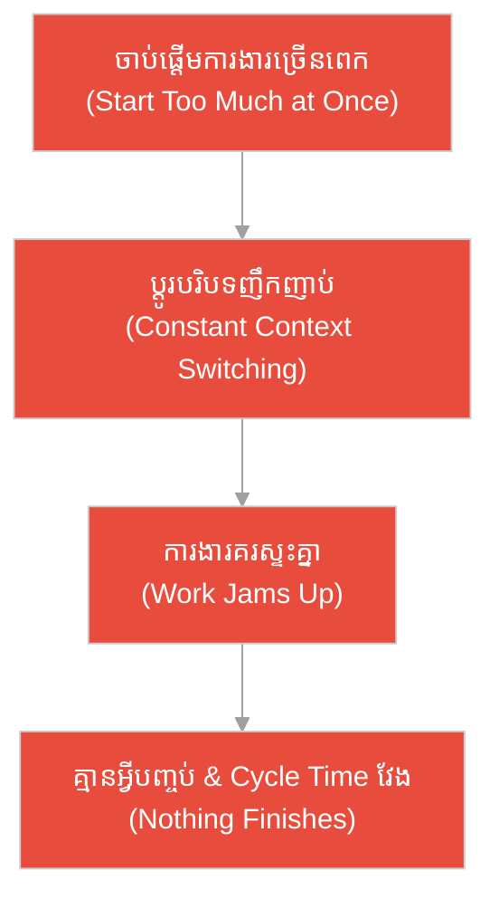
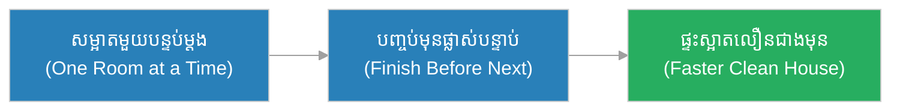
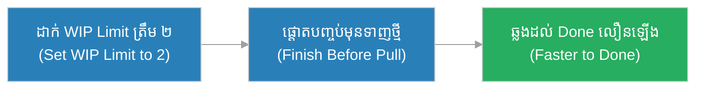
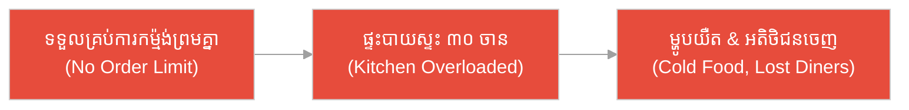
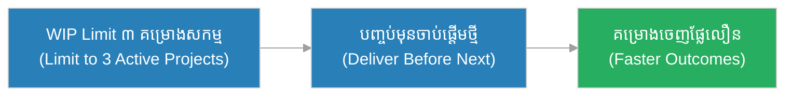
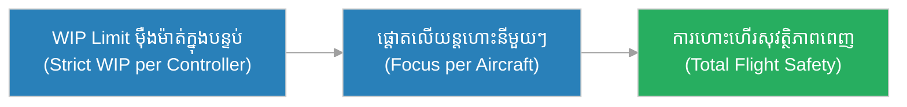
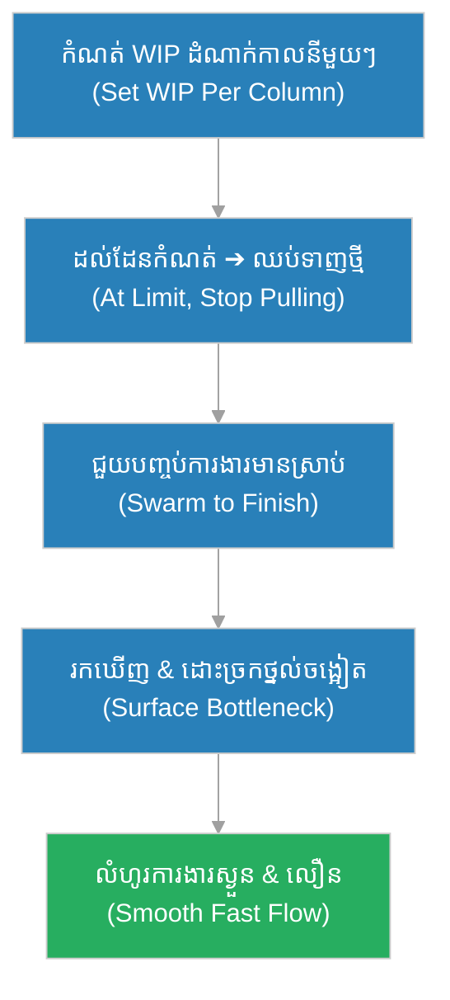

# ការកំណត់ការងារ​កំពុងដំណើរ​ការ (WIP Limits)៖ ស្ពានខ្សែភ្នំចង្អៀត និង​ក្បួនរទេះ​ដែល​ប្រញាប់ឆ្លងព្រម (The Narrow Rope-Bridge & The Caravan That Crowded It All at Once)

**អ្នកនិពន្ធ (Author):** ichamrong 
**កាលបរិច្ឆេទ (Date):** 2026-05-29 
**ស្លាក (Tags):** #agile #scrum #wip-limits #parable 
**ប្រភេទ (Category):** Management & Leadership 
**រយៈពេលអាន (Read Time):** ~១២ នាទី (~12 min) 

---

## 📌 មាតិកា (Table of Contents)
- [អន្ទាក់​នៃ​ភាពមមាញឹក (The Busyness Trap)](#0)
- [១. រឿងប្រៀបប្រដូច៖ ស្ពានខ្សែភ្នំចង្អៀត​ដែល​ទ្រាន់​តែ​ពី​ររទេះ (The Parable: The Narrow Rope-Bridge of Two Carts)](#1)
- [២. បញ្ហា៖ ការចាប់ផ្តើម​ច្រើនពេក ដោយ​បញ្ចប់តិច (The Issue: Too Many Started, Too Few Finished)](#2)
- [៣. ឧទាហរណ៍​ជាក់ស្តែង​ក្នុង​ពិភពពិត (Real World Examples)](#3)
 - [ឧទាហរណ៍​ទី ១ — កម្រិតស្រាល (គ្រួសារ)៖ ការ​សម្អាតផ្ទះថ្ងៃចុងសប្តាហ៍ (The Weekend House Cleaning)](#3-1)
 - [ឧទាហរណ៍​ទី ២ — កម្រិតមធ្យម (បច្ចេកទេស)៖ អ្នក​អភិវឌ្ឍ​ន៍បើក​ការ​ងារ ៥ ផ្នែក​ក្នុង​ពេល​តែ​មួយ (The Dev Juggling Five Tasks)](#3-2)
 - [ឧទាហរណ៍​ទី ៣ — កម្រិតមធ្យម (ធុរកិច្ច)៖ ភោជនីយដ្ឋានទទួល​ការ​កម្ម៉ង់ហួសសមត្ថភាព (The Overbooked Restaurant Kitchen)](#3-3)
 - [ឧទាហរណ៍​ទី ៤ — កម្រិតមធ្យម (គ្រប់​គ្រង)៖ ការ​ដាក់ឱ្យដំណើរ​ការ​គម្រោង​ច្រើនព្រមគ្នា (The Too-Many-Projects Portfolio)](#3-4)
 - [ឧទាហរណ៍​ទី ៥ — កម្រិតធ្ងន់ (ហានិភ័យខ្ពស់)៖ បន្ទប់​ត្រួតពិនិត្យ​ចរាចរណ៍អាកាស (The Air Traffic Control Room)](#3-5)
- [៤. ការ​សន្ទនាបែបសាកសួរ (Socratic Dialogue: Stop Starting, Start Finishing)](#4)
- [៥. ដំណោះស្រាយ៖ ការ​កំណត់ និង​គ្រប់​គ្រង WIP Limits (The Solution: Setting and Managing WIP Limits)](#5)
- [សេចក្តីសន្និដ្ឋាន (Conclusion)](#6)
- [ឯកសារយោង (References)](#7)
- [Related Posts](#8)

---

## អន្ទាក់​នៃ​ភាពមមាញឹក (The Busyness Trap)

នៅ​ពេល​ក្រុ​មក​ារងារ​ចង់​បង្កើន​ផលិតភាព ពួកគេ​តែ​ង​តែ​ធ្លាក់ចូល​ទៅ​ក្នុង​ភាពផ្ទុយគ្នា​ពី​រ៖

* **អន្ទាក់​ចាប់ផ្​តើ​មច្រើន (The Start-Everything Trap):** «ចាប់ផ្​តើ​មក​ារងារឱ្យ​បាន​ច្រើន​ទៅ! មនុស្ស​គ្រប់​គ្នា​ត្រូវ​រវល់​គ្រប់​ពេល បើ​មិន​ដូច្​នោះ​ទេ យើងខាតធនធាន!»
* **អន្ទាក់​មិន​កំណត់សោះ (The No-Limit Trap):** «កុំ​ដាក់​ដែន​កំណត់​លើ​ការ​ងារ​ឱ្យ​មនុស្ស​ឡើយ! ​ឱ្យ​គេ​ទាញ​ការ​ងារ​តាម​ចិត្ត​ទៅ — ​កាន់​តែ​ច្រើន​កាន់​តែ​ល្អ!»

---

## ១. រឿងប្រៀបប្រដូច៖ ស្ពានខ្សែភ្នំចង្អៀត​ដែល​ទ្រាន់​តែ​ពី​ររទេះ (The Parable: The Narrow Rope-Bridge of Two Carts)

កាល​ពី​ព្រេងនាយ មាន​ស្ពានខ្សែមួយយោងឆ្លងជ្រលងភ្នំជ្រៅ។ ស្ពាន​នោះ​រឹងមាំ​ ​តែ​ទ្រាន់​ទម្ងន់​បាន​ត្រឹម​ **«ពី​រ​រទេះ​ក្នុង​ពេល​តែ​មួយ»** ​ប៉ុណ្ណោះ។ ​មេ​ក្បួន​ម្នាក់​ឈ្មោះ ​**វិសាល (Visal)** ​ដឹង​ច្បាស់​ពី​ដែន​កំណត់​នេះ។ ​គាត់​បង្ខំ​ឱ្យ​រទេះ​មួយ​**ឆ្លង​ឱ្យ​ផុត​ជា​មុន** ​មុន​ពេល​អនុញ្ញាត​ឱ្យ​រទេះ​ថ្មី​ឡើង​ស្ពាន។ ​ដោយ​ការ​កំណត់​នេះ ​រទេះ​ឆ្លង​ម្តង​ពី​រ ​ស្ងួន​ល្អ ​ហើយ​ក្បួន​ទាំង​មូល​ឆ្លង​ផុត​ដោយ​សុវត្ថិភាព​និង​រហ័ស។

ផ្ទុយ​ទៅ​វិញ ​ក្បួន​មួយ​ទៀត​មិន​អើពើ​នឹង​ដែន​កំណត់​ឡើយ ​ដោយ​គិត​ថា «ដាក់​រទេះ​ច្រើន​ឆ្លង​ព្រម​គ្នា ​នឹង​ឆ្លង​បាន​លឿន​ជា​ង!»។ ​ពួកគេ​ច្រាន​រទេះ​ដប់​ឡើង​ស្ពាន​ក្នុង​ពេល​តែ​មួយ។ ​លទ្ធផល​គឺ​រទេះ​ស្ទះ​គ្នា​ពេញ​ស្ពាន ​គ្មាន​រទេះ​ណា​អាច​ឆ្លង​ផុត​បាន​ឡើយ ​ហើយ​ខ្សែ​ស្ពាន​តាន​តឹង​ស្ទើរ​ដាច់ ​ស្ទើរ​នាំ​ឱ្យ​មាន​មហន្តរាយ។ ​ការ​ប្រញាប់​ដាក់​ច្រើន​ ​បាន​ធ្វើ​ឱ្យ​អ្វី ៗ ​**ឈប់​ដំណើរ​ការ​ទាំង​ស្រុង**។

---

## ២. បញ្ហា៖ ការចាប់ផ្តើម​ច្រើនពេក ដោយ​បញ្ចប់តិច (The Issue: Too Many Started, Too Few Finished)

នៅក្នុង​ការ​គ្រប់​គ្រងលំហូរ​ការ​ងារ (Flow Management), **ការកំណត់ការងារ​កំពុងដំណើរ​ការ (WIP Limits — Work In Progress Limits)** គឺ​ជា​ការ​កំណត់​ចំនួន​អតិបរមា​នៃ​ការ​ងារ​ដែល​អាច «កំពុង​ធ្វើ» ​ក្នុង​ពេល​តែ​មួយ​ ​សម្រាប់​ដំណាក់​កាល​នីមួយ ៗ ​នៃ​លំហូរ​ការ​ងារ។ គោល​បំណង​គឺ​ដើម្បី​បង្ខំ​ឱ្យ​ការ​ងារ​**បញ្ចប់** ​មុន​ពេល​ចាប់​ផ្​តើ​ម​ការ​ងារ​ថ្មី។

មនុស្ស​ជា​ច្រើន​យល់​ច្រឡំ​ថា «ការ​ចាប់​ផ្​តើ​ម​ការ​ងារ​កាន់​តែ​ច្រើន ​= ​កាន់​តែ​មាន​ផលិតភាព» — ​នេះ​ជា​ការ​យល់​ច្រឡំ! ​ការ​ពិត​គឺ​ផ្ទុយ៖ ​**«ឈប់​ចាប់​ផ្​តើ​ម ​ចាប់​ផ្​តើ​ម​បញ្ចប់» (Stop Starting, Start Finishing)**។ ​ការ​ដាក់​ការ​ងារ​ច្រើន​ពេក​ក្នុង​ពេល​តែ​មួយ ​នាំ​ឱ្យ​ការ​ប្តូរ​បរិបទ​ញឹក​ញាប់ (Context Switching) ​ការ​ងារ​គរ​ស្ទះ ​និង​ Cycle Time ​វែង​ឡើង — ​ដូច​រទេះ​ដប់​ដែល​ស្ទះ​ស្ពាន។ ​ការ​កំណត់ WIP ​ឱ្យ​តិច ​ផ្ទុយ​ទៅ​វិញ ​ធ្វើ​ឱ្យ​លំហូរ​ការ​ងារ​ទាំង​មូល​លឿន​ឡើង។

---

## ៣. ឧទាហរណ៍​ជាក់ស្តែង​ក្នុង​ពិភពពិត

សូមពិនិត្យមើលរបៀប​ដែល​ការ​កំណត់ WIP ជះឥទ្ធិពលដល់កម្រិតជីវិត និង​ការ​ងារទាំង ៥ ខាងក្រោម៖

---

### ឧទាហរណ៍​ទី ១ — កម្រិតស្រាល (គ្រួសារ)៖ ការ​សម្អាតផ្ទះថ្ងៃចុងសប្តាហ៍ (The Weekend House Cleaning)

* **ស្ថានភាព៖** គ្រួសារមួយធ្លាប់ចាប់ផ្​តើ​មសម្អាត​គ្រប់​បន្ទប់ព្រមគ្នា — ​ផ្ទះ​បាយ ​បន្ទប់​គេង ​បន្ទប់​ទឹក ​ហើយ​ចុង​បញ្ចប់​គ្មាន​បន្ទប់​ណា​ស្អាត​ឡើយ។ ​ពួកគេ​ប្តូរ​ច្បាប់៖ ​សម្អាត​តែ​មួយ​បន្ទប់​ក្នុង​ពេល​តែ​មួយ ​ឱ្យ​រួច​ជា​មុន។
* **លទ្ធផល៖** ​បន្ទប់​នីមួយ ៗ ​ស្អាត​ជា​ស្ថាពរ ​មុន​ផ្លាស់​ទៅ​បន្ទប់​បន្ទាប់។ ​ផ្ទះ​ស្អាត​ទាំង​មូល​លឿន​ជា​ង​មុន ​ហើយ​គ្រួសារ​មាន​អារម្មណ៍​ថា​សម្រេច​បាន​ការ​ងារ​ច្បាស់​លាស់។

---

### ឧទាហរណ៍​ទី ២ — កម្រិតមធ្យម (បច្ចេកទេស)៖ អ្នក​អភិវឌ្ឍ​ន៍បើក​ការ​ងារ ៥ ផ្នែក​ក្នុង​ពេល​តែ​មួយ (The Dev Juggling Five Tasks)

* **ស្ថានភាព៖** អ្នក​អភិវឌ្ឍ​ន៍ម្នាក់បើក​ការ​ងារ ៥ ផ្នែកព្រមគ្នា ​ដោយ​លោត​ពី​មួយ​ទៅ​មួយ​មិន​ឈប់។ ​ក្រុម​ដាក់ WIP Limit ​ត្រឹម ​«ការ​ងារ​២ ​ក្នុង​ស្ថានភាព In Progress»។
* **លទ្ធផល៖** អ្នក​អភិវឌ្ឍ​ន៍ផ្តោតបញ្ចប់​ការ​ងារ ​២ ​ឱ្យ​រួច​ជា​មុន ​មុន​ទាញ​ការ​ងារ​ថ្មី។ ​ការ​ប្តូរ​បរិបទ​ថយ​ចុះ ​Bug ​តិច​ជា​ង​មុន ​ហើយ​ការ​ងារ​ឆ្លង​ដល់ Done ​លឿន​ឡើង​ច្បាស់។

---

### ឧទាហរណ៍​ទី ៣ — កម្រិតមធ្យម (ធុរកិច្ច)៖ ភោជនីយដ្ឋានទទួល​ការ​កម្ម៉ង់ហួសសមត្ថភាព (The Overbooked Restaurant Kitchen)

* **ស្ថានភាព៖** ភោជនីយដ្ឋានមួយទទួល​ការ​កម្ម៉ង់​ទាំងអស់​ព្រមគ្នា​ដោយ​គ្មាន​ដែនកំណត់។ ​ផ្ទះ​បាយ​ចម្អិន​ម្ហូប ​៣០ ​ចាន​ព្រម​គ្នា ​ដោយ​គ្មាន​ចាន​ណា​រួច​ស្រេច។
* **លទ្ធផល៖** ​អតិថិជន​រង់ចាំ​យូរ​ខ្លាំង ​ម្ហូប​ត្រ​ជា​ក់ ​ការ​បម្រើ​ច្របូក​ច្របល់ ​ហើយ​អតិថិជន​ខឹង​ចាក​ចេញ​ដោយ​មិន​បង់​ប្រាក់​ ឬ​មិន​ត្រឡប់​មក​វិញ​ទៀត។ ​ការ​ទទួល​ច្រើន​ពេក​បាន​ធ្វើ​ឱ្យ​ផ្ទះ​បាយ​ដួល​រលំ។

---

### ឧទាហរណ៍​ទី ៤ — កម្រិតមធ្យម (គ្រប់​គ្រង)៖ ការ​ដាក់ឱ្យដំណើរ​ការ​គម្រោង​ច្រើនព្រមគ្នា (The Too-Many-Projects Portfolio)

* **ស្ថានភាព៖** អ្នក​គ្រប់​គ្រងផ្នែកដាក់ឱ្យដំណើរ​ការ​គម្រោង ​១០ ​ព្រម​គ្នា ​ដោយ​ប្រើ​ក្រុម​តែ​មួយ។ ​គាត់​ដាក់ WIP Limit ​ត្រឹម​ «គម្រោង​សកម្ម​៣ ​ក្នុង​ពេល​តែ​មួយ»។
* **លទ្ធផល៖** ​ក្រុម​ផ្តោត​បញ្ចប់ ​៣ ​គម្រោង​ឱ្យ​ចេញ​លទ្ធផល​ពិត​ប្រាកដ​ ​មុន​ចាប់​ផ្​តើ​ម​គម្រោង​បន្ទាប់។ ​គម្រោង​ចេញ​ផ្លែ​ផ្កា​លឿន​ជា​ង​មុន ​ហើយ​ស្ថាប័ន​ឃើញ​លទ្ធផល​ច្បាស់ ​ជា​ជា​ង​គម្រោង ​១០ ​ដែល​មិន​ដែល​រួច។

---

### ឧទាហរណ៍​ទី ៥ — កម្រិតធ្ងន់ (ហានិភ័យខ្ពស់)៖ បន្ទប់​ត្រួតពិនិត្យ​ចរាចរណ៍អាកាស (The Air Traffic Control Room)

* **ស្ថានភាព៖** អ្នក​ត្រួតពិនិត្យ​ចរាចរណ៍អាកាសម្នាក់អាច​គ្រប់​គ្រងយន្តហោះ​បាន​ត្រឹមចំនួនកំណត់​ក្នុង​ពេល​តែ​មួយ ​ដោយ​សុវត្ថិភាព។ ​ប្រព័ន្ធ​កំណត់ WIP ​យ៉ាង​ម៉ឺងម៉ាត់ — ​បើ​ដល់​ដែន​កំណត់ ​យន្តហោះ​ថ្មី​ត្រូវ​បញ្ជូន​ទៅ​អ្នក​ត្រួត​ពិនិត្យ​ផ្សេង។
* **លទ្ធផល៖** ​អ្នក​ត្រួត​ពិនិត្យ​មិន​ត្រូវ​លើ​ស​ភារកិច្ច ​អាច​ផ្តោត​លើ​យន្តហោះ​នីមួយ ៗ ​ដោយ​ប្រុង​ប្រយ័ត្ន ​ហើយ​ការ​ហោះ​ហើរ​ឡើង​ចុះ​ប្រព្រឹត្ត​ទៅ​ដោយ​សុវត្ថិភាព​ពេញ​លេញ។ ​ការ​មិន​កំណត់ WIP ​នៅ​ទី​នេះ​នឹង​នាំ​ឱ្យ​មាន​មហន្តរាយ​ខ្លោច​ផ្សា។

---

## ៤. ការ​សន្ទនាបែបសាកសួរ (Socratic Dialogue: Stop Starting, Start Finishing)

**សិស្ស (អ្នក​អភិវឌ្ឍ​ន៍)៖** លោកគ្រូ! ​ខ្ញុំ​ច្រាន​ការ​ងារ ​៦ ​ផ្នែក​ក្នុង​ពេល​តែ​មួយ ​ដើម្បី​ឱ្យ​ខ្ញុំ​មាន​អារម្មណ៍​ថា​មមាញឹក​និង​មាន​ផលិតភាព។ ​ហេតុ​អ្វី​លោក​គ្រូ​ប្រាប់​ឱ្យ​ខ្ញុំ​កំណត់​ត្រឹម ​២?

**គ្រូ (វិស្វករ​ជា​ន់ខ្ពស់)៖** សួរ​បាន​ល្អ។ ​អនុញ្ញាត​ឱ្យ​ខ្ញុំ​សួរ​វិញ៖ ​ក្នុង​ការ​ងារ ​៦ ​ផ្នែក​នោះ ​តើ​មាន​ប៉ុន្​មាន​ផ្នែក​ដែល «រួច​ស្រេច​ជា​ស្ថាពរ» ​ដល់​អ្នក​ប្រើ​ប្រាស់​សប្តាហ៍​នេះ?

**សិស្ស៖** អា... គ្មាន​ផ្នែក​ណា​រួច​ស្រេច​ទាំង​ស្រុង​ទេ​លោកគ្រូ។ ​គ្រប់​ផ្នែក​ធ្វើ​បាន​ពាក់​កណ្តាល​ ៗ ​ទាំង​អស់។

**គ្រូ៖** ដូច្​នេះ​ឯង​មមាញឹក​ខ្លាំង ​តែ​អ្នក​ប្រើ​ប្រាស់​មិន​ទាន់​ទទួល​បាន​អ្វី​ឡើយ។ ​តើ​តម្លៃ​កើត​ឡើង​ពេល​ឯង «ចាប់​ផ្​តើ​ម» ​ការ​ងារ ​ឬ​ពេល​ឯង «បញ្ចប់» ​វា?

**សិស្ស៖** ពេល​ខ្ញុំ​បញ្ចប់​វា​លោកគ្រូ — ​ការ​ងារ​ពាក់​កណ្តាល​គ្មាន​តម្លៃ​ដល់​អ្នក​ប្រើ​ប្រាស់​ឡើយ។

**គ្រូ៖** ​ត្រឹម​ត្រូវ! ​ការ​ងារ​ពាក់​កណ្តាល​ ​៦ ​ផ្នែក ​គឺ​ដូច​រទេះ​ដប់​ដែល​ស្ទះ​ស្ពាន — ​មមាញឹក​ ​តែ​គ្មាន​អ្វី​ឆ្លង​ផុត។ ​បើ​ឯង​កំណត់ WIP ​ត្រឹម ​២ ​តើ​នឹង​មាន​អ្វី​កើត​ឡើង?

**សិស្ស៖** ​ខ្ញុំ​នឹង​បង្ខំ​ខ្លួន​បញ្ចប់​ការ​ងារ ​២ ​ឱ្យ​រួច​ស្រេច ​មុន​ទាញ​ការ​ងារ​ថ្មី ​ដូច្​នេះ​អ្នក​ប្រើ​ប្រាស់​ទទួល​បាន​តម្លៃ​ពិត​ប្រាកដ​លឿន​ជា​ង​មុន!

**គ្រូ៖** ​ត្រឹម​ត្រូវ​ហើយ! ​នេះ​ហើយ​ជា​មន្ត្រ៖ ​**«ឈប់​ចាប់​ផ្​តើ​ម ​ចាប់​ផ្​តើ​ម​បញ្ចប់»**។ ​WIP Limit ​មិន​មែន​ធ្វើ​ឱ្យ​ឯង​ខ្ជិល​ឡើយ — ​វា​បង្ខំ​ឱ្យ​លំហូរ​ការ​ងារ​ស្ងួន ​ដើម្បី​តម្លៃ​ឆ្លង​ដល់​អ្នក​ប្រើ​ប្រាស់​លឿន​បំផុត។

---

## ៥. ដំណោះស្រាយ៖ ការ​កំណត់ និង​គ្រប់​គ្រង WIP Limits (The Solution: Setting and Managing WIP Limits)

ដើម្បី​ប្រើ WIP Limits ឱ្យ​មាន​ប្រសិទ្ធភាព ក្រុ​មក​ារងារ​ត្រូវ​អនុវត្តគោល​ការ​ណ៍​ខាងក្រោម៖

1. **កំណត់ WIP សម្រាប់​ដំណាក់កាល​នីមួយ ៗ (Limit Per Column):** ​ដាក់​ចំនួន​អតិបរមា​សម្រាប់​ជួរ​ឈរ​នីមួយ ៗ ​លើ​ក្តារ Kanban ​(ឧ. ​In Progress, ​Review) ​ ​មិន​មែន​ត្រឹម​សរុប​ឡើយ។
2. **ឈប់ចាប់ផ្​តើ​ម ចាប់ផ្​តើ​មបញ្ចប់ (Stop Starting, Start Finishing):** ​ពេល​ដល់​ដែន​កំណត់ ​សមាជិក​ត្រូវ​ជួយ​បញ្ចប់​ការ​ងារ​ដែល​មាន​ស្រាប់ ​ជា​ជា​ង​ទាញ​ការ​ងារ​ថ្មី។
3. **ឱ្យច្រកថ្នល់ចង្អៀត​បង្ហាញ​ខ្លួន (Let Bottlenecks Surface):** ​ពេល​ការ​ងារ​គរ​នៅ​ជួរ​ណា​មួយ​ដោយ​ដល់​ WIP Limit ​នោះ​ហើយ​ជា​សញ្ញា​ប្រាប់​ច្រក​ថ្នល់​ចង្អៀត​ត្រូវ​ដោះ​ស្រាយ។
4. **ចាប់ផ្​តើ​មតឹង រួច​កែ​តម្រូវ (Start Tight, Then Adjust):** ​ដាក់​ WIP Limit ​ឱ្យ​តិច​ជា​មុន ​រួច​កែ​តម្រូវ​តាម​ទិន្នន័យ​លំហូរ​ការ​ងារ​ពិត​ប្រាកដ។
5. **គោរពដែនកំណត់​ជា​ក្រុម (Respect the Limit as a Team):** ​WIP Limit ​ជា​កិច្ច​ព្រម​ព្រៀង​រួម — ​គ្មាន​នរណា​ម្នាក់​ត្រូវ​បំពាន​វា​ដោយ​ឯកឯង​ឡើយ។

---

## 🐇 ធ្លាក់ចូល​ក្នុង​រន្ធទន្សាយ (Enter the Rabbit Hole)

ដើម្បី​យល់ដឹងកាន់​តែ​ស៊ីជម្រៅអំ​ពី​ការ​គ្រប់​គ្រងលំហូរ​ការ​ងារ និង​ការ​វាស់ល្បឿន សូមស្វែងយល់បន្ថែម៖

* 🚀 **[ប្រព័ន្ធ Kanban (Kanban) ➔](../practices/kanban.md)**
* 🚀 **[ពេលវេលាវដ្ត (Cycle Time) ➔](./cycle-time.md)**
* 🚀 **[វដ្តជីវិត​របស់​សំបុត្រ​ការ​ងារ (Ticket Lifecycle) ➔](../artifacts/ticket-lifecycle.md)**

---

## សេចក្តីសន្និដ្ឋាន (Conclusion)

> **«ការ​ដាក់រទេះច្រើនឡើងស្ពានព្រមគ្នា មិន​ធ្វើ​ឱ្យឆ្លង​លឿន​ឡើង​ឡើយ — វា​ធ្វើ​ឱ្យ​គ្មាន​រទេះណាឆ្លងផុត​បាន។ ឈប់ចាប់ផ្​តើ​ម ចាប់ផ្​តើ​មបញ្ចប់។»**

ការ​កំណត់ WIP Limits ឱ្យត្រឹម​ត្រូវ — ដូចមេក្បួនវិសាល​ដែល​គោរពដែនកំណត់ស្ពាន — ជួយឱ្យក្រុ​មក​ារងារបញ្ឈប់ភាពមមាញឹកឥតន័យ ​ផ្តោត​លើ​ការ​បញ្ចប់​ការ​ងារ​ឱ្យ​ចេញ​តម្លៃ​ពិត​ប្រាកដ ​និង​ឱ្យ​លំហូរ​ការ​ងារ​ទាំង​មូល​ឆ្លង «ស្ពាន» ​ដោយ​ស្ងួន​និង​លឿន​បំផុត។

---

## ឯកសារយោង (References)

* **David J. Anderson** — *Kanban: Successful Evolutionary Change for Your Technology Business* (2010).
* **Donald G. Reinertsen** — *The Principles of Product Development Flow* (2009).

---

## Related Posts

* [ប្រព័ន្ធ Kanban (Kanban)](../practices/kanban.md) — ប្រព័ន្ធ​គ្រប់​គ្រងលំហូរ​ការ​ងារ ដែល​ប្រើ WIP Limits ជា​សសរស្តម្ភសំខាន់។
* [ពេលវេលាវដ្ត (Cycle Time)](./cycle-time.md) — របៀប​ការ​កំណត់ WIP ជួយបង្រួម Cycle Time និង​បង្កើន​ល្បឿនលំហូរ។
* [វដ្តជីវិត​របស់​សំបុត្រ​ការ​ងារ (Ticket Lifecycle)](../artifacts/ticket-lifecycle.md) — ដំណាក់កាល​នីមួយ ៗ ដែល​អាចដាក់ WIP Limit ដើម្បី​គ្រប់​គ្រងលំហូរ។
