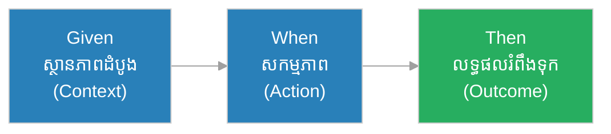
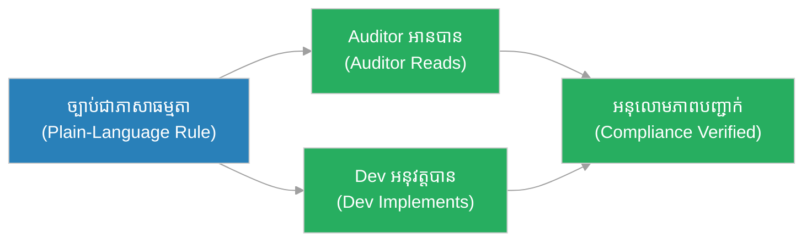
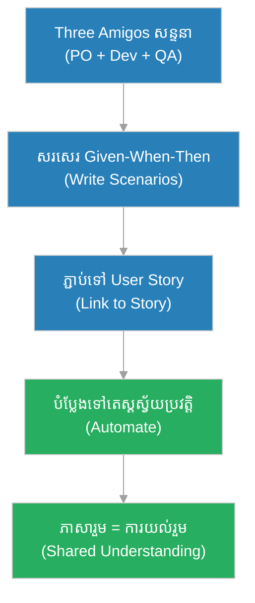

# ការ​អភិវឌ្ឍ​តាម​ឥ​រិ​យា​ប​ថ (Behavior-Driven Development - BDD)៖ ភា​សា​រួ​ម​រ​វា​ង​ស្តេ​ច និង​ស្ថា​ប​ត្យ​ក​រ (The Shared Language of King & Architect)

**អ្នក​និ​ព​ន្ធ (Author):** ichamrong 
**កា​ល​ប​រិ​ច្ឆេ​ទ (Date):** 2026-05-30 
**ស្លា​ក (Tags):** #engineering-practices #bdd #testing #collaboration #parable 
**ប្រ​ភេ​ទ (Category):** Management & Leadership 
**រ​យៈ​ពេល​អា​ន (Read Time):** ~១​២ នា​ទី (~12 min) 

---

## 📌 មា​តិ​កា (Table of Contents)
- [អ​ន្ទា​ក់​ដំណើរ​ការ (The Process Trap)](#0)
- [១. រឿងប្រៀបប្រដូច៖ ស្តេ​ច ស្ថា​ប​ត្យ​ក​រ និង​ពា​ក្យ​ប​ញ្​ជា​ដែល​យ​ល់​ខុ​ស (The Parable: The King, The Architect & The Misread Order)](#1)
- [២. បញ្ហា៖ តើ​អ្វី​ទៅ​ជា BDD? (The Issue: What is BDD?)](#2)
- [៣. ឧ​ទា​ហ​រ​ណ៍​ជា​ក់​ស្​តែ​ង​ក្នុង​ពិ​ភ​ព​ពិត (Real World Examples)](#3)
 - [ឧ​ទា​ហ​រ​ណ៍​ទី ១ — ក​ម្រិ​ត​ស្រា​ល (គ្រួ​សា​រ)៖ កិ​ច្ច​ព្រ​ម​ព្រៀ​ង​ការ​ងារ​ផ្ទះ (The Chore Agreement)](#3-1)
 - [ឧ​ទា​ហ​រ​ណ៍​ទី ២ — ក​ម្រិ​ត​ម​ធ្យ​ម (ប​ច្ចេ​ក​ទេ​ស)៖ មុ​ខ​ងា​រ​ចូ​ល​ប្រើ (The Login Scenario)](#3-2)
 - [ឧ​ទា​ហ​រ​ណ៍​ទី ៣ — ក​ម្រិ​ត​ម​ធ្យ​ម (ធុ​រ​កិ​ច្ច)៖ ការ​ដឹ​ក​ជ​ញ្ជូ​ន​ឥ​ត​គិ​ត​ថ្លៃ (The Free Shipping Rule)](#3-3)
 - [ឧ​ទា​ហ​រ​ណ៍​ទី ៤ — ក​ម្រិ​ត​ម​ធ្យ​ម (គ្រប់​គ្រង)៖ ការ​ផ្សះ​ផ្សា​រ​វិ​វា​ទ PO និង Dev (Resolving the PO-Dev Dispute)](#3-4)
 - [ឧ​ទា​ហ​រ​ណ៍​ទី ៥ — ក​ម្រិ​ត​ធ្ង​ន់ (ប្រព័ន្ធ​សំ​ខា​ន់)៖ ច្បា​ប់​អ​នុ​លោ​ម​ភា​ព​ធ​នា​គា​រ (Banking Compliance Rules)](#3-5)
- [៤. ការ​សន្ទនា​បែ​ប​សា​ក​សួ​រ (Socratic Dialogue)](#4)
- [៥. ដំ​ណោះ​ស្រា​យ៖ Given-When-Then ជា​ភា​សា​រួ​ម (The Solution: Given-When-Then as Shared Language)](#5)
- [សេចក្តី​ស​ន្និ​ដ្ឋា​ន (Conclusion)](#6)
- [ឯ​ក​សា​រ​យោ​ង (References)](#7)
- [Related Posts](#8)

---

## អ​ន្ទា​ក់​ដំណើរ​ការ (The Process Trap)

* **អ​ន្ទា​ក់​ភា​សា​ប​ច្ចេ​ក​ទេ​ស (The Tech-Jargon Trap):** អ្នក​អភិវឌ្ឍ​ន៍​សរសេរ​តេ​ស្ត​ជា​ភា​សា​កូដ​ដែល​ម្ចា​ស់​ផលិតផល​មិន​យ​ល់ — ដូ​ច្​នេះ​គ្មាន​ន​រ​ណា​ផ្ទៀ​ង​ផ្ទា​ត់​ថា​«តើ​យើ​ង​ស​ង់​អ្វី​ត្រឹ​ម​ត្រូវ​ឬ​ទេ»។
* **អ​ន្ទា​ក់​យ​ល់​ច្រ​ឡំ (The Misunderstanding Trap):** PO និ​យា​យ​មួ​យ​ Dev យ​ល់​មួ​យ​ QA សា​ក​មួ​យ​ — ហើ​យ​ល​ទ្ធ​ផ​ល​មិន​ត្រូវ​ចិ​ត្ត​ន​រ​ណា​ឡើយ។

BDD បំ​បែ​ក​អ​ន្ទា​ក់​ទាំ​ង​ពី​រ​ដោយ​បង្កើត **ភា​សា​រួ​ម​មួ​យ** ​ដែល​គ្រប់​គ្នា​យ​ល់​ដូ​ច​គ្នា។

---

## ១. រឿងប្រៀបប្រដូច៖ ស្តេ​ច ស្ថា​ប​ត្យ​ក​រ និង​ពា​ក្យ​ប​ញ្​ជា​ដែល​យ​ល់​ខុ​ស (The Parable: The King, The Architect & The Misread Order)

ស្តេ​ច​ចង់​បាន​ប្រា​សា​ទ​មួ​យ។ ទ្រ​ង់​ប​ញ្​ជា​ស្ថា​ប​ត្យ​ក​រ​ថា៖ «ស​ង់​ប្រា​សា​ទ​ដ៏​ធំ​មួ​យ​ឱ្យ​ខ្ញុំ។» ស្ថា​ប​ត្យ​ក​រ​ស្តា​ប់​ហើ​យ​ស្រ​មៃ​ប្រា​សា​ទ​ខ្ព​ស់​ ៗ ​ច្រើ​ន​ជា​ន់។ ប៉ុន្តែ​ស្តេ​ច​ស្រ​មៃ​ប្រា​សា​ទ​ទូ​លា​យ​មាន​សួ​ន​ច្បា​រ។ បី​ឆ្នាំ​ក្រោយ​ប្រា​សា​ទ​ស​ង់​រួ​ច — ខ្ព​ស់​ ៗ ​ច្រើ​ន​ជា​ន់ — ហើ​យ​ស្តេ​ច​ខឹ​ង​ណា​ស់៖ «នេះ​មិន​មែ​ន​ជា​អ្វី​ដែល​ខ្ញុំ​ចង់​បាន​ឡើយ!»

ស្ថា​ប​ត្យ​ក​រ​ឆ្លា​ត​ម្នា​ក់​ក្រោយ​មក​ បាន​រៀ​ន​មេ​រៀ​ន។ មុន​ស​ង់ គា​ត់​អ​ង្គុ​យ​ជា​មួ​យ​ស្តេ​ច ហើ​យ​សរសេរ​រួ​ម​គ្នា៖ «**ដោយសារ** ស្តេ​ច​មាន​ភ្ញៀ​វ​ច្រើ​ន **នៅ​ពេល** មាន​ពិ​ធី **នោះ** សា​ល​ត្រូវ​ផ្ទុ​ក​ម​នុ​ស្ស ៥​០​០ នា​ក់។ **ដោយសារ** ស្តេ​ច​ស្រ​ឡា​ញ់​ផ្កា **នៅ​ពេល** ព្រឹ​ក **នោះ** ត្រូវ​មាន​សួ​ន​ផ្កា​បែ​រ​ទៅ​ទិ​ស​ខា​ង​កើ​ត។»

ឥ​ឡូ​វ​ស្តេ​ច និង​ស្ថា​ប​ត្យ​ក​រ​យ​ល់​ដូ​ច​គ្នា​ច្បា​ស់​លា​ស់​មុន​ពេល​ដុំ​ថ្ម​ដំ​បូ​ង​ត្រូវ​ដា​ក់។ ប្រា​សា​ទ​ត្រូវ​ចិ​ត្ត​ស្តេ​ច​តាំ​ង​ពី​ថ្ងៃ​ដំ​បូ​ង។

---

## ២. បញ្ហា៖ តើ​អ្វី​ទៅ​ជា BDD? (The Issue: What is BDD?)

**BDD (ការ​អភិវឌ្ឍ​តាម​ឥ​រិ​យា​ប​ថ)** គឺ​ជា​ការ​ព​ង្រី​ក​នៃ [TDD](tdd.md) ដែល​ផ្តោ​ត​លើ **ឥ​រិ​យា​ប​ថ​ដែល​អា​ជី​វ​ក​ម្ម​ចង់​បាន** ជា​ជា​ង​ការ​អ​នុ​វ​ត្ត​ប​ច្ចេ​ក​ទេ​ស។ វា​ប្រើ **ភា​សា​ធ​ម្ម​ជា​តិ​មាន​រ​ច​នា​ស​ម្ព័​ន្ធ** ដែល​អ្នក​ប​ច្ចេ​ក​ទេ​ស និង​អ្នក​មិន​ប​ច្ចេ​ក​ទេ​ស​អា​ច​យ​ល់​ដូ​ច​គ្នា។

ទ​ម្រ​ង់​ស្នូ​ល​គឺ **Given-When-Then (ដោយសារ-នៅ​ពេល-នោះ)**៖
* **Given (ដោយសារ)៖** ស្ថា​ន​ភា​ព​ដំ​បូ​ង (the context)។
* **When (នៅ​ពេល)៖** ស​ក​ម្ម​ភា​ព​ដែល​កើ​ត​ឡើ​ង (the action)។
* **Then (នោះ)៖** ល​ទ្ធ​ផ​ល​រំ​ពឹ​ង​ទុ​ក (the outcome)។

> ភា​ព​ខុ​ស​គ្នា​រ​វា​ង TDD និង BDD៖ TDD សួ​រ «តើ​កូដ​នេះ​ដំ​ណើ​រ​ការ​ត្រឹ​ម​ត្រូវ​ឬ​ទេ?» (ទ​ស្ស​នៈ​អ្នក​អភិវឌ្ឍ​ន៍)។ BDD សួ​រ «តើ​ប្រព័ន្ធ​ប្រ​ព្រឹ​ត្ត​តាម​អ្វី​ដែល​អា​ជី​វ​ក​ម្ម​ចង់​បាន​ឬ​ទេ?» (ទ​ស្ស​នៈ​អ្នក​ប្រើ​ប្រា​ស់)។ BDD គឺ​ជា​ស្ពា​ន​រ​វា​ង [User Story](../artifacts/user-story.md) និង [Acceptance Criteria](../artifacts/acceptance-criteria.md)។

---

## ៣. ឧ​ទា​ហ​រ​ណ៍​ជា​ក់​ស្​តែ​ង​ក្នុង​ពិ​ភ​ព​ពិត

---

### ឧ​ទា​ហ​រ​ណ៍​ទី ១ — ក​ម្រិ​ត​ស្រា​ល (គ្រួ​សា​រ)៖ កិ​ច្ច​ព្រ​ម​ព្រៀ​ង​ការ​ងារ​ផ្ទះ (The Chore Agreement)

* **ស្ថា​ន​ភា​ព៖** ឪ​ពុ​ក​ម្តា​យ និង​កូ​ន​ឯ​ក​ភា​ព​គ្នា​ច្បា​ស់៖ «**ដោយសារ** ថ្ងៃ​ឈ​ប់​ស​ម្រា​ក **នៅ​ពេល** កូ​ន​ស​ម្អា​ត​ប​ន្ទ​ប់​រួ​ច **នោះ** កូ​ន​អា​ច​លេ​ង​ហ្គេ​ម ១ ម៉ោ​ង។»
* **ល​ទ្ធ​ផ​ល៖** គ្មាន​ការ​ឈ្លោះ​គ្នា​ទៀ​ត​ឡើយ ព្រោះ​ល​ក្ខ​ខ​ណ្ឌ​ច្បា​ស់​លា​ស់​សម្រាប់​គ្រប់​គ្នា។ កូ​ន​ដឹ​ង​ច្បា​ស់​ថា​ត្រូវ​ធ្វើ​អ្វី​ដើម្បី​បាន​លេ​ង។

---

### ឧ​ទា​ហ​រ​ណ៍​ទី ២ — ក​ម្រិ​ត​ម​ធ្យ​ម (ប​ច្ចេ​ក​ទេ​ស)៖ មុ​ខ​ងា​រ​ចូ​ល​ប្រើ (The Login Scenario)

* **ស្ថា​ន​ភា​ព៖** ក្រុ​ម​សរសេរ scenario BDD៖ «**Given** អ្នក​ប្រើ​មាន​គ​ណ​នី **When** គា​ត់​ប​ញ្ចូ​ល​ពា​ក្យ​ស​ម្ងា​ត់​ខុ​ស ៣ ដ​ង **Then** គ​ណ​នី​ត្រូវ​ចា​ក់​សោ ៥ នា​ទី។»
* **ល​ទ្ធ​ផ​ល៖** scenario នេះ​ក្លា​យ​ជា​តេ​ស្ត​ស្វ័​យ​ប្រ​វ​ត្តិ​ផ្ទា​ល់។ PO អា​ន​បាន QA សា​ក​បាន Dev សរសេរ​បាន — គ្រប់​គ្នា​យ​ល់​ដូ​ច​គ្នា​ដោយ​គ្មាន​ការ​ប​ក​ប្រែ។

---

### ឧ​ទា​ហ​រ​ណ៍​ទី ៣ — ក​ម្រិ​ត​ម​ធ្យ​ម (ធុ​រ​កិ​ច្ច)៖ ការ​ដឹ​ក​ជ​ញ្ជូ​ន​ឥ​ត​គិ​ត​ថ្លៃ (The Free Shipping Rule)

* **ស្ថា​ន​ភា​ព៖** «**Given** ក​ន្ត្រ​ក​ទិ​ញ​ទំ​និ​ញ​មាន​ត​ម្លៃ​លើ​ស $៥​០ **When** អតិថិជន​ទូ​ទា​ត់​ប្រា​ក់ **Then** ការ​ដឹ​ក​ជ​ញ្ជូ​ន​ឥ​ត​គិ​ត​ថ្លៃ។» ច្បា​ប់​នេះ​ត្រូវ​បាន​សរសេរ​ដោយ​ក្រុ​ម​ទី​ផ្សា​រ មិន​មែ​ន​ Dev។
* **ល​ទ្ធ​ផ​ល៖** ​ Dev អ​នុ​វ​ត្ត​តាម​scenario ​ ច្បា​ស់ ​ QA សា​ក​ត្រឹ​ម​ត្រូវ ​ ​ ហើ​យ​ក្រុ​ម​ទី​ផ្សា​រ​ឃើ​ញ​ច្បា​ស់​ថា​ច្បា​ប់​អា​ជី​វ​ក​ម្ម​របស់​ខ្លួ​ន​បាន​អ​នុ​វ​ត្ត​ត្រឹ​ម​ត្រូវ។

---

### ឧ​ទា​ហ​រ​ណ៍​ទី ៤ — ក​ម្រិ​ត​ម​ធ្យ​ម (គ្រប់​គ្រង)៖ ការ​ផ្សះ​ផ្សា​រ​វិ​វា​ទ PO និង Dev (Resolving the PO-Dev Dispute)

* **ស្ថា​ន​ភា​ព៖** [PO](../roles/product-owner.md) អះ​អា​ង​ថា​មុ​ខ​ងា​រ​«ខុ​ស» Dev អះ​អា​ង​ថា​«ត្រូវ​តាម​ការ​ប្រា​ប់»។ គ្មាន​ឯ​ក​សា​រ​រួ​ម​ដើម្បី​ស​ម្រេ​ច។
* **ល​ទ្ធ​ផ​ល៖** ក្រុ​ម​ចា​ប់​ផ្​តើ​ម​សរសេរ scenario BDD ​ជា​មុន​សម្រាប់​រាល់ User Story។ ឥ​ឡូ​វ «ត្រឹ​ម​ត្រូវ»​មាន​និ​យ​ម​ន័​យ​ច្បា​ស់​លា​ស់ — scenario ​ត្រូវ​ឆ្ល​ង។ វិ​វា​ទ​បា​ត់​ទៅ ព្រោះ​ភា​សា​រួ​ម​ក្លា​យ​ជា​អា​ជ្ញា​ក​ណ្តា​ល។

---

### ឧ​ទា​ហ​រ​ណ៍​ទី ៥ — ក​ម្រិ​ត​ធ្ង​ន់ (ប្រព័ន្ធ​សំ​ខា​ន់)៖ ច្បា​ប់​អ​នុ​លោ​ម​ភា​ព​ធ​នា​គា​រ (Banking Compliance Rules)

* **ស្ថា​ន​ភា​ព៖** ធ​នា​គា​រ​ត្រូវ​អ​នុ​លោ​ម​តាម​ច្បា​ប់​ប្រ​ឆាំ​ង​ការ​លា​ង​ប្រា​ក់ (AML)។ អ្នក​ត្រួ​ត​ពិ​និ​ត្យ​ផ្លូ​វ​ច្បា​ប់ (auditors) មិន​អា​ន​កូដ​បាន​ឡើយ។
* **ល​ទ្ធ​ផ​ល៖** ​scenario BDD ​ត្រូវ​បាន​សរសេរ​ជា​ភា​សា​ធ​ម្ម​តា៖ «**Given** ការ​ផ្ទេ​រ​លើ​ស $១​០,០​០​០ **When** ប្រ​តិ​ប​ត្តិ​ការ​កើ​ត​ឡើ​ង **Then** ត្រូវ​រា​យ​ការ​ណ៍​ទៅ​អា​ជ្ញា​ធ​រ។» Auditors អា​ន​បាន​ផ្ទា​ល់ ផ្ទៀ​ង​ផ្ទា​ត់​អ​នុ​លោ​ម​ភា​ព​បាន​ដោយ​គ្មាន​ត្រូវ​ការ​អ្នក​ប​ក​ប្រែ​ប​ច្ចេ​ក​ទេ​ស។

---

## ៤. ការ​សន្ទនា​បែ​ប​សា​ក​សួ​រ (Socratic Dialogue)

**សិ​ស្ស៖** លោ​ក​គ្រូ យើ​ង​មាន TDD រួ​ច​ហើ​យ ហេ​តុ​អ្វី​ត្រូវ​ការ BDD ​ទៀ​ត?

**គ្រូ៖** សួ​រ​ល្អ។ ប្រា​ប់​ខ្ញុំ​មក — តើ​ម្ចា​ស់​ផលិតផល​របស់​ឯ​ង​អា​ច​អា​ន​តេ​ស្ត TDD ​របស់​ឯ​ង​បាន​ឬ​ទេ?

**សិ​ស្ស៖** មិន​បាន​ទេ... វា​ជា​កូដ។ គា​ត់​មិន​យ​ល់​ឡើយ។

**គ្រូ៖** ដូ​ច្​នេះ​ ​ ​ បើ​តេ​ស្ត​របស់​ឯ​ង​ឆ្ល​ង​ទាំ​ង​អ​ស់ តើ​វា​ប​ញ្​ជា​ក់​ថា​ឯ​ង​បាន​ស​ង់​អ្វី​ដែល​អា​ជី​វ​ក​ម្ម​ពិត​ជា​ចង់​បាន​ឬ​ទេ?

**សិ​ស្ស៖** អ​ត់​ទេ... វា​ប​ញ្​ជា​ក់​តែ​ថា​កូដ​ដំ​ណើ​រ​ការ​តាម​អ្វី​ដែល​ខ្ញុំ​យ​ល់ — ប៉ុន្តែ​ការ​យ​ល់​របស់​ខ្ញុំ​អា​ច​ខុ​ស។

**គ្រូ៖** នោះ​ហើ​យ​ជា​គ​ម្លា​ត​ដែល BDD បំ​ពេ​ញ។ ដូ​ច​ស្តេ​ច និង​ស្ថា​ប​ត្យ​ក​រ — បើ​ពួ​ក​គេ​សរសេរ​ Given-When-Then ​រួ​ម​គ្នា ​មុន​ពេល​ស​ង់ តើ​ប្រា​សា​ទ​នឹ​ង​ខុ​ស​ចិ​ត្ត​ស្តេ​ច​ឬ​ទេ?

**សិ​ស្ស៖** អ​ត់​ទេ ព្រោះ​ពួ​ក​គេ​បាន​ឯ​ក​ភា​ព​គ្នា​ច្បា​ស់​លា​ស់​ជា​មុន។

**គ្រូ៖** ត្រឹ​ម​ត្រូវ​ហើ​យ។ BDD មិន​មែ​ន​គ្រា​ន់​តែ​ជា​ឧ​ប​ក​រ​ណ៍​តេ​ស្ត​ឡើយ — វា​ជា **ឧ​ប​ក​រ​ណ៍​ស​ន្ទ​នា (a conversation tool)**។ ត​ម្លៃ​ធំ​បំ​ផុ​ត​របស់​វា​កើ​ត​ឡើ​ង​មុន​ពេល​សរសេរ​កូដ​ណា​មួ​យ​ផ​ង — ពេល​គ្រប់​គ្នា​ឯ​ក​ភា​ព​លើ​ភា​សា​រួ​ម​មួ​យ។

---

## ៥. ដំ​ណោះ​ស្រា​យ៖ Given-When-Then ជា​ភា​សា​រួ​ម (The Solution: Given-When-Then as Shared Language)

ដើម្បី​អ​នុ​វ​ត្ត BDD ឱ្យ​បាន​ត្រឹ​ម​ត្រូវ៖

1. **សរសេរ scenario រួ​ម​គ្នា​ជា​មុន (Write scenarios together first):** PO, Dev, និង QA អ​ង្គុ​យ​ជា​មួ​យ​គ្នា (ការ​ប្រជុំ «Three Amigos»)។
2. **ប្រើ​ភា​សា​ធ​ម្ម​តា (Use plain language):** scenario ​ត្រូវ​អា​ន​បាន​ដោយ​អ្នក​មិន​ប​ច្ចេ​ក​ទេ​ស។
3. **ភ្​ជា​ប់​ទៅ [User Story](../artifacts/user-story.md):** រាល់ scenario ប​ម្រើ​ User Story មួ​យ។
4. **បំ​ប្លែ​ង​ទៅ​តេ​ស្ត​ស្វ័​យ​ប្រ​វ​ត្តិ (Automate scenarios):** ឧ​ប​ក​រ​ណ៍​ដូ​ច​ Cucumber/SpecFlow បំ​ប្លែ​ង Given-When-Then ​ទៅ​តេ​ស្ត​រ​ត់​បាន។
5. **ប្រើ​ជា [Acceptance Criteria](../artifacts/acceptance-criteria.md):** scenario ​ក្លា​យ​ជា​និ​យ​ម​ន័​យ​ច្បា​ស់​លា​ស់​នៃ​«រួ​ច​រាល់»។

---

## 🐇 ធ្លា​ក់​ចូ​ល​ក្នុង​រន្ធទន្សាយ (Enter the Rabbit Hole)

* 🚀 **[ការ​សរសេរ​កូដ​ដោយ​ចា​ប់​ផ្​តើ​ម​ពី​តេ​ស្ត (TDD) ➔](tdd.md)**
* 🚀 **[រឿ​ង​រ៉ា​វ​របស់​អ្នក​ប្រើប្រាស់ (User Story) ➔](../artifacts/user-story.md)**
* 🚀 **[ល​ក្ខ​ខ​ណ្ឌ​ទ​ទួ​ល​យ​ក (Acceptance Criteria) ➔](../artifacts/acceptance-criteria.md)**

---

## សេចក្តី​ស​ន្និ​ដ្ឋា​ន (Conclusion)

> **«កំ​ហុ​ស​ដ៏​ថ្លៃ​បំ​ផុ​ត​មិន​មែ​ន​កើ​ត​ឡើ​ង​ក្នុង​កូដ​ឡើយ — វា​កើ​ត​ឡើ​ង​ក្នុង​ការ​យ​ល់​ច្រ​ឡំ​មុន​ពេល​សរសេរ​កូដ។»**

BDD បំ​ប្លែ​ង​ការ​ប្រា​ស្រ័​យ​ទា​ក់​ទ​ង​ពី​ការ​ស្មា​ន​ឱ្យ​ទៅ​ជា​ភា​សា​រួ​ម។ ដូ​ច​ស្តេ​ច និង​ស្ថា​ប​ត្យ​ក​រ​ដែល​សរសេរ​រួ​ម​គ្នា​មុន​ដា​ក់​ដុំ​ថ្ម​ដំ​បូ​ង ក្រុ​ម​ការ​ងារ​ដែល​ប្រើ BDD ​ឯ​ក​ភា​ព​លើ​«អ្វី​ដែល​ត្រឹ​ម​ត្រូវ»​មុន​ពេល​ស​ង់។

---

## ឯ​ក​សា​រ​យោ​ង (References)

* **Dan North** — *Introducing BDD* (2006).
* **Gojko Adzic** — *Specification by Example* (2011).

---

## Related Posts

* [ការ​សរសេរ​កូដ​ដោយ​ចា​ប់​ផ្​តើ​ម​ពី​តេ​ស្ត (TDD)](tdd.md) — មូ​ល​ដ្ឋា​ន​ប​ច្ចេ​ក​ទេ​ស​ដែល BDD ​ព​ង្រី​ក។
* [រឿ​ង​រ៉ា​វ​របស់​អ្នក​ប្រើប្រាស់ (User Story)](../artifacts/user-story.md) — scenario BDD ​ប​ម្រើ User Story។
* [ល​ក្ខ​ខ​ណ្ឌ​ទ​ទួ​ល​យ​ក (Acceptance Criteria)](../artifacts/acceptance-criteria.md) — Given-When-Then ​ជា AC។
