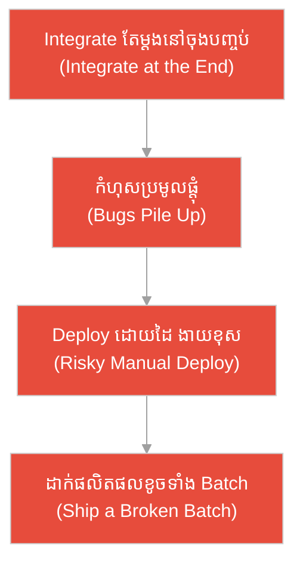
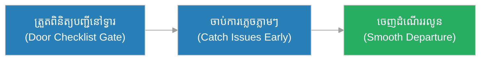
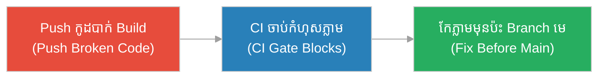
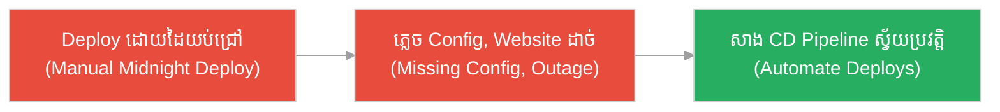
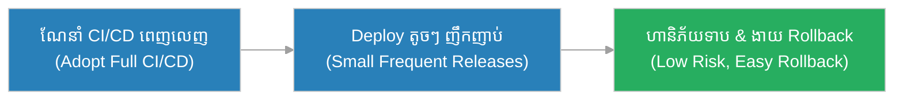
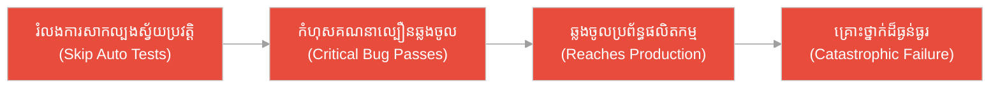
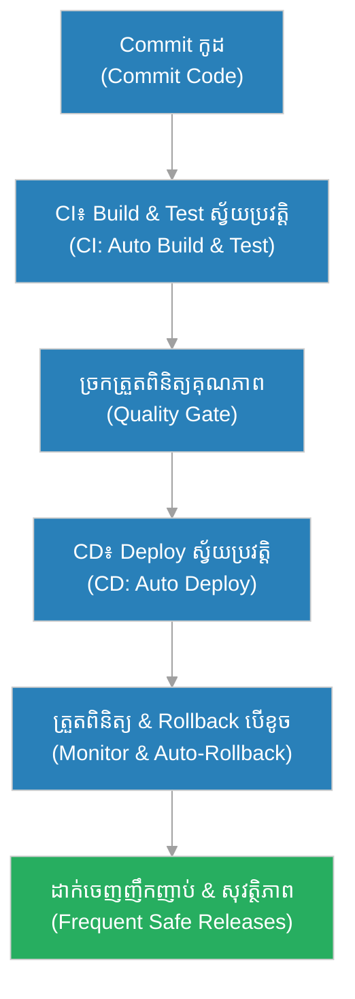

# CI/CD (ការ​រួមបញ្ចូល និង​ដាក់ដំណើរ​ការ​ជា​បន្តបន្ទាប់)៖ ខ្សែផលិតកម្ម​ដែល​មាន​ច្រក​ត្រួតពិនិត្យ​ស្វ័យប្រវត្តិ (The Assembly Line with Automatic Quality Gates)

**អ្នកនិពន្ធ (Author):** ichamrong 
**កាលបរិច្ឆេទ (Date):** 2026-05-29 
**ស្លាក (Tags):** #agile #scrum #ci-cd #parable 
**ប្រភេទ (Category):** Management & Leadership 
**រយៈពេលអាន (Read Time):** ~១២ នាទី (~12 min) 

---

## 📌 មាតិកា (Table of Contents)
- [អន្ទាក់​នៃ CI/CD (The CI/CD Trap)](#0)
- [១. រឿងប្រៀបប្រដូច៖ ខ្សែផលិតកម្មស្វ័យប្រវត្តិ និង​រោង​ជា​ង​ចាស់​ដែល​ត្រួតពិនិត្យ​ចុងក្រោយ (The Parable: The Auto Line vs. The End-Inspection Workshop)](#1)
- [២. បញ្ហា៖ ការ​យល់ច្រឡំថា CI/CD គ្រាន់​តែ​ជា Script ដាក់ដំណើរ​ការ (The Issue: Mistaking CI/CD for Just a Deploy Script)](#2)
- [៣. ឧទាហរណ៍​ជាក់ស្តែង​ក្នុង​ពិភពពិត (Real World Examples)](#3)
 - [ឧទាហរណ៍​ទី ១ — កម្រិតស្រាល (គ្រួសារ)៖ ការ​ត្រួតពិនិត្យ​កាបូប​មុន​ចេញ​ពី​ផ្ទះ (The Door Checklist)](#3-1)
 - [ឧទាហរណ៍​ទី ២ — កម្រិតមធ្យម (បច្ចេកទេស)៖ ការ Merge កូដ​ដែល​បាក់ Build (The Broken Build Merge)](#3-2)
 - [ឧទាហរណ៍​ទី ៣ — កម្រិតមធ្យម (ធុរកិច្ច)៖ ការ Deploy ដោយ​ដៃនៅយប់ជ្រៅ (The Manual Midnight Deploy)](#3-3)
 - [ឧទាហរណ៍​ទី ៤ — កម្រិតមធ្យម (គ្រប់​គ្រង)៖ ការ​ដាក់ចេញញឹកញាប់​ដោយ​សុវត្ថិភាព (The Frequent Safe Release)](#3-4)
 - [ឧទាហរណ៍​ទី ៥ — កម្រិតធ្ងន់ (ហោះហើរ)៖ ការ​ដាក់ Software ខូច​ទៅ​ប្រព័ន្ធ​ត្រួតពិនិត្យ​ជើងហោះហើរ (The Untested Flight System)](#3-5)
- [៤. ការ​សន្ទនាបែបសាកសួរ (Socratic Dialogue: Deploy Script vs. Continuous Pipeline)](#4)
- [៥. ដំណោះស្រាយ៖ ការ​សាង Pipeline CI/CD ឱ្យ​មាន​ប្រសិទ្ធភាព (The Solution: Building an Effective Pipeline)](#5)
- [សេចក្តីសន្និដ្ឋាន (Conclusion)](#6)
- [ឯកសារយោង (References)](#7)
- [Related Posts](#8)

---

## អន្ទាក់​នៃ CI/CD (The CI/CD Trap)

នៅ​ពេល​និយាយអំ​ពី​ការ​ដាក់​កូដ​ឱ្យដំណើរ​ការ យើង​តែ​ង​តែ​ជួបប្រទះនូវភាពផ្ទុយគ្នា​ពី​របែប៖

* **អន្ទាក់​ត្រួតពិនិត្យ​ចុងក្រោយ (The End-Inspection Trap):** «ចូរ​សរសេរ​កូដ​ឱ្យអស់​ជា​មុន​សិន រួចយើងនឹង Merge និង​សាកល្បង​ទាំងអស់​ម្តង​តែ​ម្តងនៅចុងបញ្ចប់!»
* **អន្ទាក់​សាមញ្ញ​និយម (The Over-Simplification Trap):** «CI/CD គ្រាន់​តែ​ជា Script ដាក់ដំណើរ​ការ​មួយ ហើយវា​សម្រាប់​តែ​ក្រុមហ៊ុនធំ ៗ ប៉ុណ្ណោះ ក្រុមតូច​មិន​ចាំបាច់ទេ!»

---

## ១. រឿងប្រៀបប្រដូច៖ ខ្សែផលិតកម្មស្វ័យប្រវត្តិ និង​រោង​ជា​ង​ចាស់​ដែល​ត្រួតពិនិត្យ​ចុងក្រោយ (The Parable: The Auto Line vs. The End-Inspection Workshop)

នៅទីក្រុងឧស្សាហកម្មមួយ មាន​រោងចក្រផលិតនាឡិកា​ពី​រ។ ម្​ចាស់​រោងចក្រទីមួយឈ្មោះ **វិចិត្រ (Vichet)** បាន​រៀបចំខ្សែផលិតកម្ម (Assembly Line) ដែល​មាន **ច្រក​ត្រួតពិនិត្យ​គុណភាព​ស្វ័យប្រវត្តិ (Automatic Quality Gate)** នៅ​គ្រប់​ស្ថានីយ៍។ ភ្លាម ៗ ដែល​គ្រឿងបន្លាស់ខូចមួយលេចចេញ ម៉ាស៊ីននៅស្ថានីយ៍​នោះ​នឹងបញ្ឈប់វាភ្លាម ហើយជូនដំណឹង។ ដូច្​នេះ កំហុស​ត្រូវ​ចាប់​បាន និង​កែ​ភ្លាម ៗ មុន​ពេល​វាបន្ត​ទៅ​ស្ថានីយ៍បន្ទាប់។ ការ​ខូចខាត​មាន​កម្រិតតូចបំផុត ហើយនាឡិកា​ដែល​ចេញ​ពី​ខ្សែ គឺ​មាន​គុណភាព​ល្អ​ជា​និច្ច។

ផ្ទុយ​ទៅ​វិញ រោង​ជា​ង​ចាស់​មួយទៀត​មិន​មាន​ច្រក​ត្រួតពិនិត្យ​តាម​ផ្លូវ​ឡើយ។ ពួកគេផ្គុំនាឡិ​ការ​ាប់រយគ្រឿង ដោយ​ត្រួតពិនិត្យ​តែ​ម្តងនៅ «ចុងបញ្ចប់» ប៉ុណ្ណោះ។ ថ្ងៃមួយ មាន​គ្រឿងបន្លាស់តូចមួយខូចតាំង​ពី​ដើម ប៉ុន្តែ​គ្មាន​នរណាដឹង។ កំហុស​នោះ​បាន​រីករាលដាលចូល​ក្នុង​នាឡិកាមួយ Batch ទាំងមូល។ មុន​ពេល​អ្នក​ត្រួតពិនិត្យ​ចុងក្រោយ​រកឃើញ រោង​ជា​ង​នោះ​បាន​ដឹកនាឡិកាខូចមួយ Batch ធំ​ទៅ​ឱ្យអតិថិជនរួចស្រេច — ត្រូវ​ដកវិញ បោះចោល និង​បាត់បង់​ការ​ទុកចិត្ត​យ៉ាង​ធ្ងន់ធ្ងរ។ រោងចក្រទាំង​ពី​រផលិត​របស់​ដូចគ្នា — តែ​ម្នាក់ចាប់កំហុសភ្លាម ៗ ឯម្នាក់ទៀតរង់ចាំដល់ចុងបញ្ចប់ទើបដឹង។

---

## ២. បញ្ហា៖ ការ​យល់ច្រឡំថា CI/CD គ្រាន់​តែ​ជា Script ដាក់ដំណើរ​ការ (The Issue: Mistaking CI/CD for Just a Deploy Script)

**CI/CD** គឺជា​ការអនុវត្ត​ពី​រផ្នែក​ដែល​ភ្​ជា​ប់គ្នា៖ **CI (Continuous Integration)** — ការ​រួមបញ្ចូល​កូដ និង​សាកល្បងស្វ័យប្រវត្តិញឹកញាប់ (រាល់​ការ Commit) និង **CD (Continuous Delivery/Deployment)** — ការ​ដាក់ឱ្យដំណើរ​ការ​ដោយ​ស្វ័យប្រវត្តិ សុវត្ថិភាព និង​អាច​ធ្វើ​ម្តងទៀត​បាន (Repeatable)។ ទាំង​ពី​រ​នេះ​កាត់បន្ថយហានិភ័យ សម្រាប់​ក្រុម​គ្រប់​ទំហំ មិន​មែន​តែ​ក្រុមហ៊ុនធំ ៗ ឡើយ។

ការ​យល់ច្រឡំធំបំផុត​គឺ គិតថា CI/CD គ្រាន់​តែ​ជា «Script ដាក់ដំណើរ​ការ» ឬ «សម្រាប់​តែ​ក្រុមហ៊ុនធំ»។ ការ​ពិត CI/CD គឺជា​ខ្សែផលិតកម្ម​ដែល​មាន​ច្រក​ត្រួតពិនិត្យ​គុណភាព​ស្វ័យប្រវត្តិ ដែល​ចាប់កំហុសភ្លាម ៗ មុន​ពេល​វារីករាលដាល។ បញ្ហា​ពិត​គឺ ការ Integrate កូដ និង​សាកល្បង​តែ​ម្តងនៅ «ចុងបញ្ចប់» — ដែល​ធ្វើ​ឱ្យកំហុសប្រមូលផ្តុំ និង​ពិបាករកឃើញ ដែល​អាចបណ្តាលឱ្យដាក់ផលិតផលខូចទាំងមូល​ដោយ​មិន​ដឹងខ្លួន។

---

## ៣. ឧទាហរណ៍​ជាក់ស្តែង​ក្នុង​ពិភពពិត

សូមពិនិត្យមើលរបៀប​ដែល​គោល​ការ​ណ៍ CI/CD ជះឥទ្ធិពលដល់កម្រិតជីវិត និង​ការ​ងារទាំង ៥ ខាងក្រោម៖

---

### ឧទាហរណ៍​ទី ១ — កម្រិតស្រាល (គ្រួសារ)៖ ការ​ត្រួតពិនិត្យ​កាបូប​មុន​ចេញ​ពី​ផ្ទះ (The Door Checklist)

* **ស្ថានភាព៖** គ្រួសារមួយដាក់បញ្ជី​ត្រួតពិនិត្យ​តូចមួយនៅមាត់ទ្វារ៖ កូនសោ កាបូបលុយ ទូរស័ព្ទ និង​វ៉ែនតា។ មុន​ពេល​ចេញ​ពី​ផ្ទះម្តង ៗ គ្រប់​គ្នា​ត្រួតពិនិត្យ​តាម​បញ្ជីភ្លាម ៗ (ច្រក​ត្រួតពិនិត្យ​ស្វ័យប្រវត្តិ)។
* **លទ្ធផល៖** ពួកគេ​មិន​ដែល​ត្រឡប់​មក​ផ្ទះវិញពាក់កណ្តាលផ្លូវ ដោយសារ​ភ្លេចកូនសោ​ឡើយ។ កំហុស​ត្រូវ​ចាប់​បាន​ភ្លាម ៗ នៅច្រកទ្វារ មិន​មែននៅ​ពេល​ដល់គោលដៅ។

---

### ឧទាហរណ៍​ទី ២ — កម្រិតមធ្យម (បច្ចេកទេស)៖ ការ Merge កូដ​ដែល​បាក់ Build (The Broken Build Merge)

* **ស្ថានភាព៖** អ្នក​អភិវឌ្ឍ​ន៍ម្នាក់ Push កូដ​ថ្មី​ដែល​បាក់​ការ Build។ ដោយ​ក្រុម​មាន CI Pipeline ដែល​រត់ Test ស្វ័យប្រវត្តិ​រាល់​ការ Push, Pipeline បាន​ចាប់កំហុសភ្លាម និង​បិទ​មិន​ឱ្យ Merge ចូល Branch មេ។
* **លទ្ធផល៖** កំហុស​ត្រូវ​ចាប់​បាន​ក្នុង​រយៈពេល​ប៉ុន្​មាន​នាទី និង​កែ​ភ្លាម ៗ ដោយ​មិន​ប៉ះពាល់ដល់​សមាជិក​ក្រុមដទៃ ឬ Branch មេ​ឡើយ — ដូចច្រក​ត្រួតពិនិត្យ​ស្វ័យប្រវត្តិនៅខ្សែផលិតកម្ម។

---

### ឧទាហរណ៍​ទី ៣ — កម្រិតមធ្យម (ធុរកិច្ច)៖ ការ Deploy ដោយ​ដៃនៅយប់ជ្រៅ (The Manual Midnight Deploy)

* **ស្ថានភាព៖** ក្រុមតូចមួយ Deploy កម្មវិធី​ដោយ​ដៃ​រាល់​ពេល — ចម្លងឯកសារ និង​វាយពាក្យបញ្​ជា​ដោយ​ខ្លួនឯងនៅយប់ជ្រៅ។ ថ្ងៃមួយ វិស្វករហត់នឿយ បាន Deploy ខ្វះឯកសារ Config មួយ បណ្តាលឱ្យ Website ដាច់ ៣ ម៉ោង។
* **លទ្ធផល៖** ដោយ​រៀន​ពី​ព្រឹត្តិ​ការ​ណ៍​នេះ ក្រុម​បាន​សាង CD Pipeline ស្វ័យប្រវត្តិ ដែល​ធ្វើ​ការ Deploy ដូចគ្នាបេះបិទ និង​អាច​ធ្វើ​ម្តងទៀត​បាន (Repeatable) ដោយ​គ្មាន​កំហុសមនុស្ស។

---

### ឧទាហរណ៍​ទី ៤ — កម្រិតមធ្យម (គ្រប់​គ្រង)៖ ការ​ដាក់ចេញញឹកញាប់​ដោយ​សុវត្ថិភាព (The Frequent Safe Release)

* **ស្ថានភាព៖** អ្នក​គ្រប់​គ្រងម្នាក់ខ្លាច​ការ Deploy ដោយ​ធ្លាប់ Deploy តែ ៣ ខែម្តង ដែល​រាល់​ដងពេញ​ដោយ​កំហុស។ ក្រុម​បាន​ណែនាំ CI/CD ពេញលេញ ដែល​អនុញ្ញាតឱ្យ Deploy តូច ៗ និង​ញឹកញាប់ប្រកប​ដោយ​សុវត្ថិភាព។
* **លទ្ធផល៖** ឥឡូវក្រុម Deploy បាន​ច្រើនដង​ក្នុង​មួយថ្ងៃ ដោយ​ប្រសិនបើ​មាន​បញ្ហា គឺ​តូច និង​ងាយ Rollback។ ការ Deploy ក្លាយ​ជា​រឿងធម្មតា មិន​មែន​ជា​រឿងគួរឱ្យខ្លាចទៀត​ឡើយ។

---

### ឧទាហរណ៍​ទី ៥ — កម្រិតធ្ងន់ (ហោះហើរ)៖ ការ​ដាក់ Software ខូច​ទៅ​ប្រព័ន្ធ​ត្រួតពិនិត្យ​ជើងហោះហើរ (The Untested Flight System)

* **ស្ថានភាព៖** ក្រុមអភិវឌ្ឍន៍​ប្រព័ន្ធ​គ្រប់​គ្រងម៉ាស៊ីនយន្តហោះ បាន Merge កូដ​ថ្មី​ដោយ​រំលង​ការ​សាកល្បងស្វ័យប្រវត្តិ ដោយ​ចំណេញ​ពេល។ កូដ​នោះ​មាន​កំហុស​ក្នុង​ការ​គណនាល្បឿន ដែល​គ្មាន CI Gate ណាចាប់​បាន​ឡើយ។
* **លទ្ធផល៖** កំហុស​នោះ​បាន​ឆ្លងចូល​ប្រព័ន្ធ​ផលិតកម្ម បង្កគ្រោះថ្នាក់ដ៏ធ្ងន់ធ្ងរដល់សុវត្ថិភាព​អ្នក​ដំណើរ — ដូចរោង​ជា​ង​ចាស់​ដែល​ដឹកនាឡិកាខូចមួយ Batch ធំ​ទៅ​ឱ្យអតិថិជន មុន​ពេល​នរណាម្នាក់រកឃើញ។

---

## ៤. ការ​សន្ទនាបែបសាកសួរ (Socratic Dialogue: Deploy Script vs. Continuous Pipeline)

**សិស្ស (អ្នក​អភិវឌ្ឍ​ន៍)៖** លោកគ្រូ! យើង​ជា​ក្រុមតូច​តែ ៣ នាក់។ ខ្ញុំគិតថា CI/CD គ្រាន់​តែ​ជា Script ដាក់ដំណើរ​ការ​មួយ ហើយវា​សម្រាប់​តែ​ក្រុមហ៊ុនធំ ៗ មែនទេ?

**គ្រូ (វិស្វករ DevOps)៖** សួរវិញ៖ នៅរោងចក្រ ប្រសិនបើគ្រឿងបន្លាស់ខូចមួយលេចចេញនៅស្ថានីយ៍ទី១ តើ​ល្អ​ជា​ងបើចាប់វា​បាន​ភ្លាមនៅទី​នោះ ឬ​រង់ចាំដល់​ត្រួតពិនិត្យ​ចុងបញ្ចប់ បន្ទាប់​ពី​ផ្គុំ​របស់​ទាំងមូលរួច?

**សិស្ស៖** ច្បាស់ណាស់ ល្អ​ជា​ងបើចាប់​បាន​ភ្លាម ៗ ដើម្បី​កុំ​ឱ្យកំហុសរីករាលដាល។

**គ្រូ៖** នេះ​ហើយ​ជា CI! រាល់​ពេល​ឯង Commit កូដ Pipeline រត់ Test ស្វ័យប្រវត្តិ ដូចច្រក​ត្រួតពិនិត្យ​នៅ​គ្រប់​ស្ថានីយ៍ — ចាប់កំហុសភ្លាម ៗ ។ ឥឡូវ សួរបន្ត៖ ប្រសិនបើឯង Deploy ដោយ​ដៃ​រាល់​ពេល តើ​មាន​ឱកាសភ្លេច ឬ​វាយខុសទេ?

**សិស្ស៖** មាន លោកគ្រូ — ខ្ញុំធ្លាប់ភ្លេចចម្លងឯកសារ Config ម្តង បណ្តាលឱ្យ Website ដាច់។

**គ្រូ៖** នេះ​ហើយ​ជា CD! ការ Deploy ដោយ​ស្វ័យប្រវត្តិ ធ្វើ​ឱ្យដំណើរ​ការ​ដូចគ្នាបេះបិទ​រាល់​ពេល (Repeatable) និង​គ្មាន​កំហុសមនុស្ស។ ដូច្​នេះ តើ CI/CD ជា «Script ដាក់ដំណើរ​ការ» ឬ​ជា «ប្រព័ន្ធ​ការ​ពារ​គុណភាព​ពេញលេញ»?

**សិស្ស៖** គឺជា​ប្រព័ន្ធ​ការ​ពារ​គុណភាព​ពេញលេញលោកគ្រូ មិន​មែនគ្រាន់​តែ Script ទេ។

**គ្រូ៖** ត្រឹម​ត្រូវ​ហើយ! ហើយក្រុមតូចទើប​តែ​ត្រូវ​ការ​វា​ខ្លាំង — ដ្បិតក្រុមតូច​គ្មាន​ពេល​ដោះស្រាយកំហុសធំ ៗ ។ CI/CD កាត់បន្ថយហានិភ័យ​សម្រាប់​ក្រុម​គ្រប់​ទំហំ មិន​មែន​តែ​ក្រុមហ៊ុនធំ ៗ ឡើយ។

---

## ៥. ដំណោះស្រាយ៖ ការ​សាង Pipeline CI/CD ឱ្យ​មាន​ប្រសិទ្ធភាព (The Solution: Building an Effective Pipeline)

ដើម្បី​សាង Pipeline CI/CD ដែល​ជឿទុកចិត្ត​បាន ក្រុ​មក​ារងារ​ត្រូវ​អនុវត្តគោល​ការ​ណ៍ **Integrate-Test-Automate-Release**៖

1. **Commit ញឹកញាប់ និង​តូច ៗ (Commit Small & Often):** រួមបញ្ចូល​កូដ​ចូល Branch មេញឹកញាប់ ដើម្បី​កុំ​ឱ្យកំហុសប្រមូលផ្តុំ ដូច​ការ​ត្រួតពិនិត្យ​នៅ​គ្រប់​ស្ថានីយ៍។
2. **សាកល្បងស្វ័យប្រវត្តិ (Automated Tests as Gates):** រាល់​ការ Push ត្រូវ​ឆ្លងកាត់ Test ស្វ័យប្រវត្តិ (Unit, Integration)។ ប្រសិនបើ Test បរាជ័យ Pipeline បិទ​មិន​ឱ្យបន្ត។
3. **ស្វ័យប្រវត្តិកម្​មក​ារ Build និង Deploy (Automate Build & Deploy):** ការ Deploy ត្រូវ​ធ្វើ​ដោយ Pipeline ដូចគ្នាបេះបិទ​រាល់​ពេល (Repeatable) គ្មាន​ជំហាន​ដោយ​ដៃ។
4. **ដាក់ចេញតូច ៗ និង​ញឹកញាប់ (Release Small & Frequent):** Deploy តូច ៗ ញឹកញាប់ កាត់បន្ថយហានិភ័យ និង​ធ្វើ​ឱ្យ​ការ Rollback ងាយស្រួល។
5. **ត្រួតពិនិត្យ និង Rollback ស្វ័យប្រវត្តិ (Monitor & Auto-Rollback):** តាមដាន​សុខភាព​ប្រព័ន្ធ​ក្រោយ Deploy ហើយ Rollback ដោយ​ស្វ័យប្រវត្តិ ប្រសិនបើ​មាន​បញ្ហា។

---

## 🐇 ធ្លាក់ចូល​ក្នុង​រន្ធទន្សាយ (Enter the Rabbit Hole)

ដើម្បី​យល់ដឹងកាន់​តែ​ស៊ីជម្រៅអំ​ពី​វដ្តជីវិត​នៃ​ការ​ដាក់ដំណើរ​ការ និង​គុណភាព​កូដ សូមស្វែងយល់បន្ថែម៖

* 🚀 **[វដ្តជីវិត​នៃ​ការ​ដាក់ដំណើរ​ការ (Deployment Lifecycle) ➔](./deployment-lifecycle.md)**
* 🚀 **[និយមន័យនៃភាពរួចរាល់ (Definition of Done) ➔](../artifacts/dod.md)**
* 🚀 **[វដ្តជីវិត​នៃ Ticket (Ticket Lifecycle) ➔](../artifacts/ticket-lifecycle.md)**

---

## សេចក្តីសន្និដ្ឋាន (Conclusion)

> **«CI/CD មិន​មែន​ជា Script ដាក់ដំណើរ​ការ​មួយ​ឡើយ — វា​ជា​ខ្សែផលិតកម្ម​ដែល​មាន​ច្រក​ត្រួតពិនិត្យ​គុណភាព​នៅ​គ្រប់​ស្ថានីយ៍ ដែល​ចាប់កំហុសភ្លាម ៗ មុន​ពេល​វាក្លាយ​ជា​មហន្តរាយ។»**

ដូចខ្សែផលិតកម្ម​របស់​វិចិត្រ ដែល​ចាប់គ្រឿងបន្លាស់ខូចភ្លាម ៗ CI/CD ជួយឱ្យក្រុ​មក​ារងារ — ទោះធំ ឬ​តូច — ចាប់កំហុសភ្លាម ៗ ដាក់ផលិតផល​ដោយ​សុវត្ថិភាព និង​ញឹកញាប់ ដោយ​ជឿ​ជា​ក់។ ការ Integrate និង​សាកល្បង​តែ​ម្តងនៅចុងបញ្ចប់ គឺ​ដូចរោង​ជា​ង​ចាស់​ដែល​ដឹកនាឡិកាខូចទាំង Batch ទៅ​ឱ្យអតិថិជន — បន្តិចទៀតក៏ដួលរលំទាំងស្រុង។

---

## ឯកសារយោង (References)

* **Jez Humble & David Farley** — *Continuous Delivery: Reliable Software Releases through Build, Test, and Deployment Automation* (2010).
* **Nicole Forsgren, Jez Humble & Gene Kim** — *Accelerate: The Science of Lean Software and DevOps* (2018).
* **Kent Beck** — *Extreme Programming Explained: Embrace Change* (2004).

---

## Related Posts

* [វដ្តជីវិត​នៃ​ការ​ដាក់ដំណើរ​ការ (Deployment Lifecycle)](./deployment-lifecycle.md) — ដំណាក់កាលលម្អិត​នៃ​ការ​នាំ​កូដ​ពី Commit ទៅ Production។
* [និយមន័យនៃភាពរួចរាល់ (Definition of Done)](../artifacts/dod.md) — លក្ខខណ្ឌ​គុណភាព​ដែល​ច្រក​ត្រួតពិនិត្យ CI/CD ត្រូវ​អនុវត្ត។
