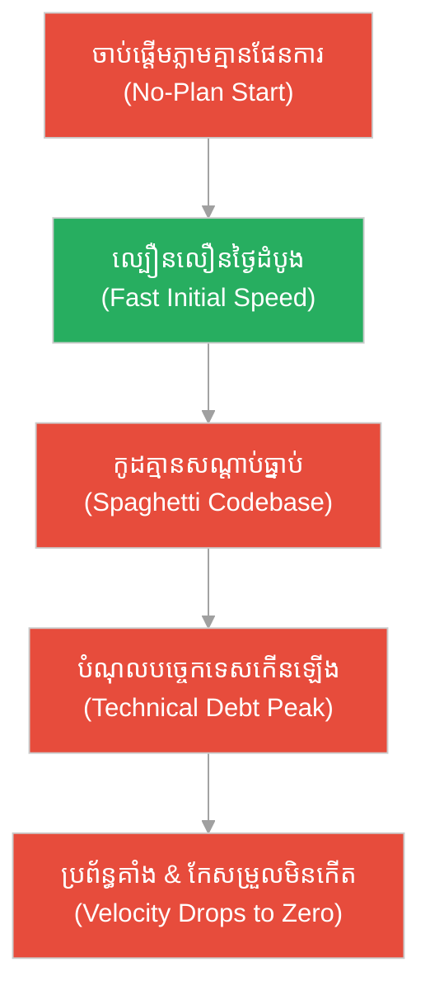
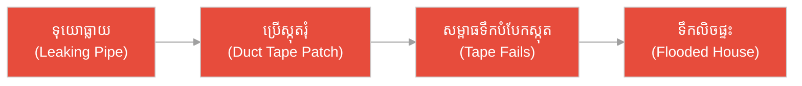
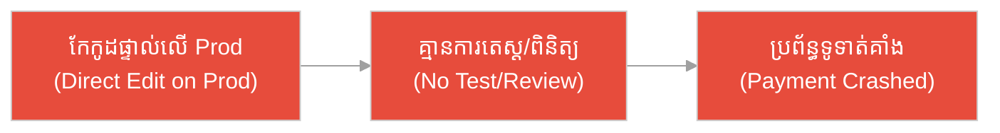
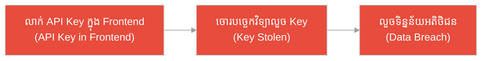
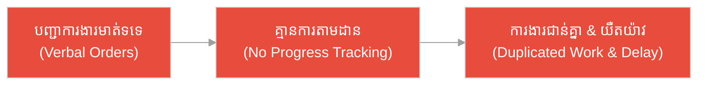
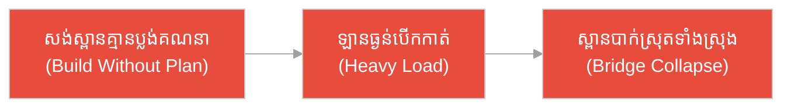
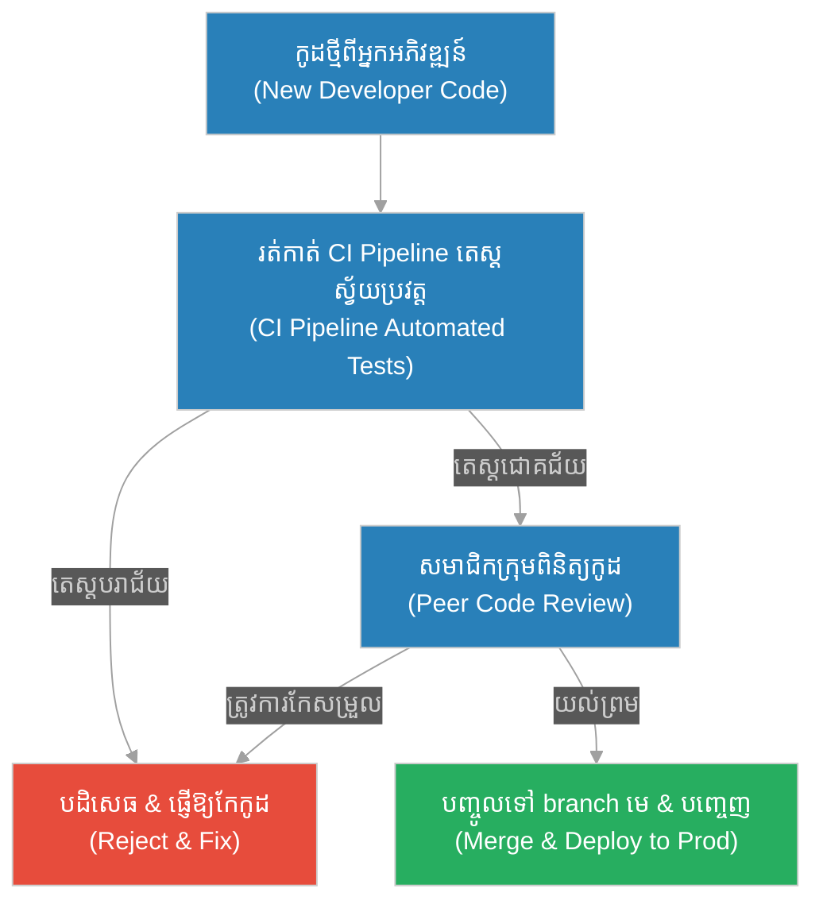

# ការសរសេរកូដតាមចិត្តនឹកឃើញ (Cowboy Coding)៖ ខ្​មាន​់ព្រួញឯកោ និង​ផ្ទះ​គ្មាន​គ្រឹះ (The Lone Archer & The Foundationless House)

**អ្នកនិពន្ធ (Author):** ichamrong 
**កាលបរិច្ឆេទ (Date):** 2026-05-29 
**ស្លាក (Tags):** #engineering-practices #antipattern #process #cowboy-coding #parable 
**ប្រភេទ (Category):** Management & Leadership 
**រយៈពេលអាន (Read Time):** ~១២ នាទី (~12 min) 

---

## 📌 មាតិកា (Table of Contents)
- [អន្ទាក់​ដំណើរ​ការ (The Process Trap)](#0)
- [១. រឿងប្រៀបប្រដូច៖ ជា​ងសាងសង់​នៃ​រដ្ឋជូ និង​វិ​មាន​គ្មាន​គ្រឹះ (The Parable: The Builder of Chu & The Foundationless Pavilion)](#1)
- [២. បញ្ហា៖ ការសរសេរកូដតាមចិត្តនឹកឃើញ (The Issue: Cowboy Coding Explained)](#2)
- [៣. ឧទាហរណ៍​ជាក់ស្តែង​ក្នុង​ពិភពពិត (Real World Examples)](#3)
 - [ឧទាហរណ៍​ទី ១ — កម្រិតស្រាល (គ្រួសារ)៖ ការ​ជួសជុលទុយោទឹក​ដោយ​ប្រើស្កុតរុំ (The Duct-Taped Pipe)](#3-1)
 - [ឧទាហរណ៍​ទី ២ — កម្រិតមធ្យម (បច្ចេកទេស)៖ ការ​កែ​សម្រួល​កូដ​ផ្ទាល់​លើ Production (The Friday Night Hotfix)](#3-2)
 - [ឧទាហរណ៍​ទី ៣ — កម្រិតមធ្យម (ធុរកិច្ច)៖ ការ​លាក់​កូដ​សម្ងាត់​ក្នុង Frontend (The Hardcoded Startup)](#3-3)
 - [ឧទាហរណ៍​ទី ៤ — កម្រិតមធ្យម (គ្រប់​គ្រង)៖ ការ​ចាត់ចែង​ការ​ងារ​ដោយ​គ្មាន​ប្រព័ន្ធ​តាមដាន (The Verbal Backlog)](#3-4)
 - [ឧទាហរណ៍​ទី ៥ — កម្រិតធ្ងន់ (ប្រព័ន្ធ​សំខាន់)៖ ស្ពានដែកកាត់ស្ទឹង​ដែល​ខ្វះ​ការ​គណនាបច្ចេកទេស (The Rushed Bridge)](#3-5)
- [៤. ការ​សន្ទនាបែបសាកសួរ (Socratic Dialogue: The Rationale & Illusion of Rushed Code)](#4)
- [៥. ដំណោះស្រាយ៖ ការ​បង្កើត​វិន័យវិស្វកម្ម (The Solution: Introducing Engineering Discipline)](#5)
- [សេចក្តីសន្និដ្ឋាន (Conclusion)](#6)
- [ឯកសារយោង (References)](#7)
- [Related Posts](#8)

---

## អន្ទាក់​ដំណើរ​ការ (The Process Trap)

នៅក្នុង​ពិភព​នៃ​ការ​អភិវឌ្ឍ​ផលិតផលបច្ចេកវិទ្យា យើង​តែ​ង​តែ​ជួបប្រទះនូវ​ការ​ទាញទាញចិត្ត​ពី​រចរន្តផ្ទុយគ្នា៖

* **ចរន្ត​លឿន​ស្លេវ (The Speed Trap):** «សរសេរ​កូដ​ភ្លាម​ទៅ! កុំ​ខាត​ពេល​រៀបចំផែន​ការ គ្មាន​នរណា​អាន​ឯកសារទេ សំខាន់ឱ្យ​តែ​ផលិតផលដើរ​លឿន!»
* **ចរន្ត​ការ​ិយាល័យធិបតេយ្យ (The Bureaucratic Trap):** «ឈប់សិន! មិន​ត្រូវ​សរសេរ​កូដ​ឡើយ លុះត្រា​តែ​រាល់​ឯកសារស្ថាបត្យកម្ម និង​លក្ខខណ្ឌ​ទាំងអស់​ត្រូវ​បាន​អនុម័ត និង​ចុះហត្ថលេខា​គ្រប់​លំដាប់ថ្នាក់។»

---

## ១. រឿងប្រៀបប្រដូច៖ ជា​ងសាងសង់​នៃ​រដ្ឋជូ និង​វិ​មាន​គ្មាន​គ្រឹះ (The Parable: The Builder of Chu & The Foundationless Pavilion)

កាល​ពី​ព្រេងនាយ ក្នុង​រដ្ឋជូ (Chu) មាន​ជា​ងឈើដ៏ប៉ិនប្រសប់ម្នាក់ឈ្មោះ **សាន (San)**។ សានល្បីខាងសាងសង់ផ្ទះ និង​វិ​មាន​បាន​លឿន​ជា​ងគេ​ក្នុង​តំបន់។ នៅ​ពេល​ដែល​អ្នក​ដទៃចំណាយ​ពេល​ជា​ច្រើនសប្តាហ៍​ដើម្បី​វាស់ស្ទង់​ដី ជីកគ្រឹះ និង​ចាក់ថ្មបេតុង សានចាប់ផ្​តើ​ម​លើ​កសសរ និង​ដំឡើងដំបូលភ្លាម ៗ ។ គាត់​តែ​ងសើចចំអកឱ្យ​ជា​ងដទៃថា៖ «ពួកឯងល្ងង់ណាស់ ខាត​ពេល​ជីកដី​ធ្វើ​អី? មើលយើងសង់វិ​មាន​ដ៏ស្អាត​នេះ រួច​រាល់​ក្នុង​ពេល​តែ ៣ ថ្ងៃប៉ុណ្ណោះ!»

ម្​ចាស់​វិ​មាន​ជា​ច្រើនពេញចិត្តសាន​ខ្លាំងណាស់ ព្រោះ​បាន​ឃើញលទ្ធផល​លឿន​ទាន់ចិត្ត។ ប៉ុន្តែ នៅ​ពេល​ដែល​រដូវវស្សា​មក​ដល់ ចរន្តទឹកជំនន់ និង​ព្យុះបោកបក់​ខ្លាំង វិ​មាន​ដែល​សាន​បាន​សង់​គ្មាន​គ្រឹះមាំទាំ ក៏ចាប់ផ្​តើ​មរញ្ជួយ ស្រុតឈើ និង​បាក់ស្រុតចុះទាំងស្រុង បង្កវិនាសកម្មដល់ទ្រព្យសម្បត្តិ និង​ជីវិតមនុស្ស។ ចំណែកឯផ្ទះ​ដែល​សាងសង់​ដោយ​ជា​ងដទៃ​ដែល​បាន​ចំណាយ​ពេល​ចាក់គ្រឹះ​យ៉ាង​ហ្មត់ចត់ បែរ​ជា​ឈរ​យ៉ាង​រឹងមាំ​មិន​រង្គោះរង្គើ​ឡើយ។

---

## ២. បញ្ហា៖ ការសរសេរកូដតាមចិត្តនឹកឃើញ (The Issue: Cowboy Coding Explained)

បាតុភូត «ជា​ងសាន​នៃ​រដ្ឋជូ» ត្រូវ​បាន​ហៅ​នៅក្នុង​វិស័យវិស្វកម្មសូហ្វវែរថា **Cowboy Coding (ការសរសេរកូដតាមចិត្តនឹកឃើញ)**។ វា​គឺជា​ទម្រង់ប្រឆាំងនឹងលំនាំ​ការ​ងារ (Anti-pattern) ដែល​អ្នក​អភិវឌ្ឍ​ន៍ម្នាក់ ៗ ឬ​ក្រុ​មក​ារងារទាំងមូលចាប់ផ្​តើ​ម​សរសេរ​កូដ​ដោយ៖
1. **គ្មាន​ផែន​ការ​ស្ថាបត្យកម្មច្បាស់លាស់ (No Architecture Planning)**
2. **គ្មាន​ការ​សរសេរ​កូដ​សាកល្បងស្វ័យប្រវត្ត (No Automated Testing)**
3. **គ្មាន​ការ​ពិនិត្យ​កូដ​ពី​សមាជិក​ក្រុម (No Code Review/PR)**
4. **គ្មាន​ឯកសារណែនាំ ឬ​ការ​តាមដាន​កិច្ច​ការ​ងារ (No Docs or Task Tracking)**

យន្ត​ការ​នៃ Cowboy Coding តែ​ង​តែ​ផ្តល់នូវ​ការ​យល់ច្រឡំអំ​ពី «ល្បឿន​លឿន» នៅដំណាក់កាលដំបូង ប៉ុន្តែ​វា​បង្កើត​បំណុលបច្ចេកទេស (Technical Debt) យ៉ាង​មហាសាល​ដែល​ធ្វើ​ឱ្យល្បឿនធ្លាក់ចុះដល់សូន្យនៅ​ពេល​ក្រោយ។

---

## ៣. ឧទាហរណ៍​ជាក់ស្តែង​ក្នុង​ពិភពពិត

ដើម្បី​យល់កាន់​តែ​ច្បាស់អំ​ពី​កម្រិតផ្សេង ៗ គ្នា​នៃ Cowboy Coding សូមពិនិត្យមើលកម្រិតទាំង ៥ ខាងក្រោម៖

---

### ឧទាហរណ៍​ទី ១ — កម្រិតស្រាល (គ្រួសារ)៖ ការ​ជួសជុលទុយោទឹក​ដោយ​ប្រើស្កុតរុំ (The Duct-Taped Pipe)

* **ស្ថានភាព៖** ទុយោទឹក​នៅក្នុង​បន្ទប់ទឹកធ្លាយ។ ស្វាមី​មិន​ព្រមហៅ​ជា​ង ឬ​ទិញទុយោ​ថ្មី​មក​ប្តូរ​ឡើយ ប៉ុន្តែ​ប្រើស្កុតជ័រ​មក​បិទរុំ​ជា​ច្រើន​ជា​ន់​ដើម្បី​ឱ្យរួច​រាល់​លឿន (Do-it-yourself without standard rules)។
* **លទ្ធផល៖** ពី​រថ្ងៃ​ក្រោយ​មក ចរន្តទឹកសង្កត់​ខ្លាំង​ធ្វើ​ឱ្យស្កុតរបូតធ្លាយ នាំឱ្យទឹកជន់លិចបន្ទប់ទឹកទាំងស្រុង និង​ខូចខាតកម្រាលឈើ​ខាងក្រៅ។

---

### ឧទាហរណ៍​ទី ២ — កម្រិតមធ្យម (បច្ចេកទេស)៖ ការ​កែ​សម្រួល​កូដ​ផ្ទាល់​លើ Production (The Friday Night Hotfix)

* **ស្ថានភាព៖** អ្នក​អភិវឌ្ឍ​ន៍រកឃើញកំហុសបច្ចេកទេសតូចមួយ​លើ​ទំព័រ​ទូទាត់ប្រាក់នៅយប់ថ្ងៃសុក្រ។ ដោយ​មិន​ចង់​ដំណើរ​ការ Pipeline ឬ​សុំ​ការ​ត្រួតពិនិត្យ (Code Review) គាត់​បាន​កែ​សម្រួល​កូដ និង​បង្ហោះផ្ទាល់​លើ Server តែ​ម្តង។
* **លទ្ធផល៖** កូដ​ថ្មី​នោះ​បាន​ជះឥទ្ធិពលដល់មុខងារទូទាត់ប្រាក់ (Payment Gateway Integration) ធ្វើ​ឱ្យ​ប្រព័ន្ធ​គាំងទាំងស្រុងពេញមួយចុងសប្តាហ៍ បង្ក​ការ​ខាតបង់ចំណូលរាប់ម៉ឺនដុល្លារ។

---

### ឧទាហរណ៍​ទី ៣ — កម្រិតមធ្យម (ធុរកិច្ច)៖ ការ​លាក់​កូដ​សម្ងាត់​ក្នុង Frontend (The Hardcoded Startup)

* **ស្ថានភាព៖** ក្រុមហ៊ុនចាប់ផ្​តើ​ម​ថ្មី (Startup) មួយ​ចង់​ចេញផលិតផល​របស់​ខ្លួនឱ្យ​បាន​លឿន​បំផុត។ អ្នក​អភិវឌ្ឍ​ន៍​បាន​សរសេរ​កូដ​ភ្​ជា​ប់​ទៅ​ប្រព័ន្ធ​ទិន្នន័យ (Database Api Key) ដោយ​លាក់វាទុក​ក្នុង​កូដ Frontend ដោយ​ផ្ទាល់​ដើម្បី​កុំ​ឱ្យខាត​ពេល​បង្កើត Server-side proxy។
* **លទ្ធផល៖** គូប្រជែង​បាន​ទាញយក​កូដ Frontend មក​មើល រួចលួចយក Api Key ទៅ​ទាញយក​ទិន្នន័យ​អតិថិជន​ទាំងអស់ បណ្តាលឱ្យក្រុមហ៊ុនក្ស័យធន និង​រង​ការ​ប្តឹងផ្តល់។

---

### ឧទាហរណ៍​ទី ៤ — កម្រិតមធ្យម (គ្រប់​គ្រង)៖ ការ​ចាត់ចែង​ការ​ងារ​ដោយ​គ្មាន​ប្រព័ន្ធ​តាមដាន (The Verbal Backlog)

* **ស្ថានភាព៖** អ្នក​ដឹកនាំ​ក្រុ​មក​ារងារប្រាប់​សមាជិក​ម្នាក់ ៗ តាមរយៈ​ការ​និយាយផ្ទាល់មាត់ ឬ​ផ្ញើសារខ្លី​តាម Telegram ដើម្បី​ឱ្យ​ធ្វើ​មុខងារ​ថ្មី ៗ ជា​បន្តបន្ទាប់ ដោយ​មិន​ប្រើប្រាស់​ផ្ទាំង​គ្រប់​គ្រង​ការ​ងារ (Jira/Linear backlog) ឡើយ។
* **លទ្ធផល៖** សមាជិក​ធ្វើ​ការ​ងារ​ជា​ន់គ្នា គ្មាន​នរណាដឹងថាមុខងារណា​ត្រូវ​បាន​ធ្វើ​រួច ឬ​មិន​ទាន់​ធ្វើ​ឡើយ នាំឱ្យខកខានថ្ងៃកំណត់​ជា​មួយអតិថិជន និង​រញ៉េរញ៉ៃពេញ​ការ​ិយាល័យ។

---

### ឧទាហរណ៍​ទី ៥ — កម្រិតធ្ងន់ (ប្រព័ន្ធ​សំខាន់)៖ ស្ពានដែកកាត់ស្ទឹង​ដែល​ខ្វះ​ការ​គណនាបច្ចេកទេស (The Rushed Bridge)

* **ស្ថានភាព៖** អភិបាលស្រុក​ចង់​បាន​ស្ពានដែកឆ្លងស្ទឹងឱ្យរួច​រាល់​មុន​ថ្ងៃបោះឆ្នោត។ ក្រុមវិស្វករសម្រេចចិត្តសង់ស្ពាន​ដោយ​មិន​វាស់ស្ទង់​ជម្រៅគ្រឹះដី​ក្រោម​ស្ទឹង ឬ​គណនាសម្ពាធទម្ងន់​ឡើយ (No standard safety checklists)។
* **លទ្ធផល៖** នៅថ្ងៃសម្ពោធ ឡានដឹកទំនិញធុនធ្ងន់បើកកាត់ ធ្វើ​ឱ្យស្ពានបាក់ស្រុតពាក់កណ្តាលភ្លាម ៗ បណ្តាលឱ្យមនុស្ស​ជា​ច្រើនធ្លាក់ទឹក និង​រងរបួសធ្ងន់ធ្ងរ។

---

## ៤. ការ​សន្ទនាបែបសាកសួរ (Socratic Dialogue: The Rationale & Illusion of Rushed Code)

**សិស្ស (អ្នក​អភិវឌ្ឍ​ន៍យុវជន)៖** លោកគ្រូ! ខ្ញុំយល់ថា Cowboy Coding មាន​គ្រោះថ្នាក់។ ប៉ុន្តែ​តើ​យើង​មិន​គួរផ្តោត​លើ​ល្បឿនទេ​ឬ? នៅក្នុង​ពិភពជំនួញ បើចេញ​យឺត គឺ​មាន​ន័យថាចាញ់គូប្រជែងហើយ!

**គ្រូ (វិស្វករ​ជា​ន់ខ្ពស់)៖** ជា​ការ​ពិត​ណាស់ ល្បឿន​គឺជា​រឿងសំខាន់បំផុត។ ប៉ុន្តែ​អនុញ្ញាតឱ្យខ្ញុំសួរឯងមួយ៖ តើ​អ្វី​ទៅ​ជា​ល្បឿន​ពិតប្រាកដ? តើ​វា​ជា​ល្បឿន​នៃ​ការ​សរសេរ​កូដ​បញ្ចប់នៅថ្ងៃដំបូង ឬ​ជា​ល្បឿន​ដែល​ផលិតផលអាចដំណើរ​ការ និង​បន្ថែមមុខងារ​ថ្មី ៗ បាន​ជា​បន្តបន្ទាប់​ដោយ​គ្មាន​ការ​រអាក់រអួល?

**សិស្ស៖** គឺ​ពិត​ជា​ល្បឿន​នៃ​ការ​បន្ថែមមុខងារ​ថ្មី ៗ បាន​ជា​ប់​ជា​និច្ចហើយលោកគ្រូ។

**គ្រូ៖** ល្អ​ណាស់! ចុះប្រសិនបើឯង​សរសេរ​កូដ​យ៉ាង​លឿន​នៅសប្តាហ៍ទីមួយ​ដោយ​គ្មាន​ការ​រៀបចំគ្រឹះ ហើយនៅសប្តាហ៍ទី​ពី​រ ប្រព័ន្ធ​ចាប់ផ្​តើ​មក​ើត​មាន​កំហុស​ជា​រៀង​រាល់ថ្ងៃ រហូតដល់ក្រុ​មក​ារងារ​ត្រូវ​ចំណាយ​ពេល ៩០% នៃ​ម៉ោង​ការ​ងារ​ដើម្បី​តែ​ដោះស្រាយ​បញ្ហា​ចាស់ តើ​ល្បឿនបន្ថែមមុខងារ​ថ្មី​របស់​ឯងនឹង​ទៅ​ជា​យ៉ាង​ណា?

**សិស្ស៖** វានឹងធ្លាក់ចុះ​យ៉ាង​ខ្លាំង... ស្ទើរ​តែ​ក្លាយ​ជា​សូន្យ ព្រោះ​យើងរវល់​តែ​ជួសជុលរឿង​ចាស់។

**គ្រូ៖** ត្រឹម​ត្រូវ​ហើយ។ ចុះប្រសិនបើយើងចំណាយ​ពេល​រៀបចំគ្រឹះតាំង​ពី​ដំបូង សរសេរ Unit Tests ឱ្យ​បាន​ហ្មត់ចត់ និង​ធ្វើ​ការ​ពិនិត្យ​កូដ (Code Review) ឱ្យ​បាន​ច្បាស់លាស់ ទោះបី​ជា​វា​ធ្វើ​ឱ្យយើង​យឺត​យ៉ាវបន្តិចនៅសប្តាហ៍ដំបូងក៏​ដោយ។ នៅសប្តាហ៍បន្ទាប់ យើងអាចបន្ថែមមុខងារ​ថ្មី ៗ ដោយ​ភាពជឿ​ជា​ក់ និង​ល្បឿន​លឿន តើ​មួយណា​ជា​ជម្រើស​ល្អ​ជា​ង?

**សិស្ស៖** ជម្រើសទី​ពី​រ​ពិត​ជា​ល្អ​ជា​ង​ក្នុង​រយៈពេល​វែង។ ប៉ុន្តែ​ចុះបើ​អ្នក​គ្រប់​គ្រងបង្ខំយើងឱ្យ​បញ្ចេញ​ផលិតផលឱ្យ​លឿន​បំផុត តើ​យើង​ត្រូវ​ធ្វើ​ដូចម្តេច?

**គ្រូ៖** នេះ​ហើយ​ជា​តួនាទី​របស់ **DoR (Definition of Ready)** និង **DoD (Definition of Done)**។ ពួកវា​គឺជា​ខែល​ការ​ពារវិន័យវិស្វកម្ម។ ឯង​ត្រូវ​ពន្យល់ពួកគេឱ្យយល់​ពី​តម្លៃ​នៃ​ការ​កសាង​ប្រព័ន្ធ​ដែល​មាន​គ្រឹះមាំទាំ។ ការ​លះបង់​គុណភាព​ដើម្បី​ល្បឿនបណ្តោះអាសន្ន គឺ​មិន​ខុស​ពី​ការ​ខ្ចីលុយ​ការ​ប្រាក់ខ្ពស់​ដើម្បី​មក​ចាយវាយ​ឡើយ — វានឹង​ធ្វើ​ឱ្យយើងក្ស័យធននៅ​ពេល​ក្រោយ​ដោយសារ​តែ​បំណុល​ការ​ប្រាក់បច្ចេកទេស (Technical Debt Interest)។

---

## ៥. ដំណោះស្រាយ៖ ការ​បង្កើត​វិន័យវិស្វកម្ម (The Solution: Introducing Engineering Discipline)

ដើម្បី​ការ​ពារ​ប្រព័ន្ធ​ការ​ងារ​កុំ​ឱ្យធ្លាក់ចូល​ទៅ​ក្នុង Cowboy Coding ក្រុ​មក​ារងារ​ត្រូវ​អនុវត្តគោល​ការ​ណ៍វិស្វកម្មទំនើប ៗ ដូច​ខាងក្រោម៖

1. **អនុវត្ត​ការ​ត្រួតពិនិត្យ​កូដ​ជា​កាតព្វកិច្ច (Mandatory Code Reviews):** គ្មាន​កូដ​ណា​ដែល​អាចបញ្ចូល​ទៅកាន់ branch មេ (Main/Production branch) ដោយ​គ្មាន​ការ​ពិនិត្យ និង​យល់ព្រម​ពី​សមាជិក​ផ្សេងទៀត​ឡើយ។
2. **ស្វ័យប្រវត្តូបនីយកម្ម CI/CD (Continuous Integration & Deployment):** រាល់​កូដ​ថ្មី​ត្រូវ​រត់កាត់ Pipeline ដើម្បី​ធ្វើ​តេស្តស្វ័យប្រវត្ត និង​ត្រួតពិនិត្យ​ចន្លោះប្រហោងសន្តិសុខ​ជា​មុន។
3. **ការ​គោរព DoR និង DoD (Respect DoR & DoD):** ធានាថាកិច្ច​ការ​ងារ​ត្រូវតែ​មាន​ការ​រៀបចំលក្ខខណ្ឌច្បាស់លាស់​មុន​ពេល​ចាប់ផ្​តើ​ម និង​បំពេញ​តាម​ស្តង់ដារ​គុណភាព​មុន​ពេល​បញ្ចេញ។
4. **ការ​សរសេរ​ឯកសារណែនាំ (Writing Documentation):** កត់ត្រាស្ថាបត្យកម្ម​ប្រព័ន្ធ និង​ការ​ណែនាំអំ​ពី​កូដ ដើម្បី​ធានាថាមុខងារ​ប្រព័ន្ធ​មិន​ស្ថិត​នៅក្នុង​ក្បាល​របស់​មនុស្សម្នាក់​ឡើយ។

---

## 🐇 ធ្លាក់ចូល​ក្នុង​រន្ធទន្សាយ (Enter the Rabbit Hole)

ដើម្បី​យល់ដឹងកាន់​តែ​ស៊ីជម្រៅអំ​ពី​របៀប​បង្កើត​វិន័យវិស្វកម្ម និង​ទប់ស្កាត់​ការសរសេរកូដតាមចិត្តនឹកឃើញ សូមស្វែងយល់បន្ថែម​តាម​តំណភ្​ជា​ប់​ខាងក្រោម៖

* 🚀 **[និយមន័យនៃភាពរួចរាល់​សម្រាប់​ចាប់ផ្​តើ​ម (Definition of Ready - DoR) ➔](../artifacts/dor.md)**
* 🚀 **[និយមន័យនៃភាពរួចរាល់ជាស្ថាពរ (Definition of Done - DoD) ➔](../artifacts/dod.md)**
* 🚀 **[ការ​រៀបចំផែន​ការ​វដ្ត​ការ​ងារ (Sprint Planning) ➔](../ceremonies/sprint-planning.md)**

---

## សេចក្តីសន្និដ្ឋាន (Conclusion)

> **«កូដ​ដែល​លឿន​បំផុត គឺ​កូដ​ដែល​ត្រូវ​បាន​សរសេរ​ឡើង​ដោយ​មាន​ផែន​ការ គុណភាព និង​វិន័យតាំង​ពី​ដំបូង។»**

ការ​លុបបំបាត់ Cowboy Coding មិន​មែន​ជា​ការ​បង្អង់ល្បឿន​នៃ​ការ​អភិវឌ្ឍ​ន៍​នោះ​ទេ ប៉ុន្តែ​វា​ជា​ការ​ចាក់គ្រឹះបេតុងដ៏មាំមួន ដើម្បី​ធានាថាវិ​មាន​បច្ចេកវិទ្យា​របស់​យើងនឹងឈរ​យ៉ាង​រឹងមាំ ទោះ​ជា​ត្រូវ​ឆ្លងកាត់ព្យុះភ្លៀង​នៃ​ជំនួញកម្រិតណាក៏​ដោយ។

---

## ឯកសារយោង (References)

* **Robert C. Martin** — *Clean Architecture: A Craftsman's Guide to Software Structure and Design* (2017).
* **Martin Fowler** — *Refactoring: Improving the Design of Existing Code* (2018).

---

## Related Posts

* [និយមន័យនៃភាពរួចរាល់​សម្រាប់​ចាប់ផ្​តើ​ម (Definition of Ready - DoR)](../artifacts/dor.md) — របៀបចាក់គ្រឹះ​ការ​ងារឱ្យ​បាន​ត្រឹម​ត្រូវ​មុន​ពេល​ចាប់ផ្​តើ​ម​សរសេរ​កូដ។
* [និយមន័យនៃភាពរួចរាល់ជាស្ថាពរ (Definition of Done - DoD)](../artifacts/dod.md) — បញ្ជីផ្ទៀងផ្ទាត់​គុណភាព​នៅទ្វារចេញ ដើម្បី​កម្ចាត់​កូដ​គ្មាន​សណ្តាប់ធ្នាប់។
