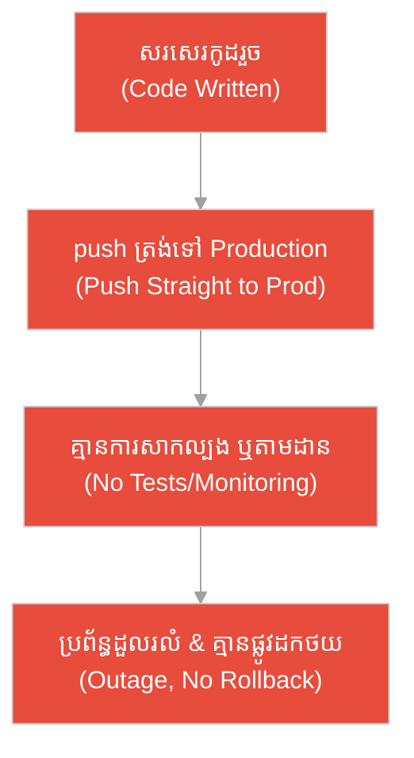
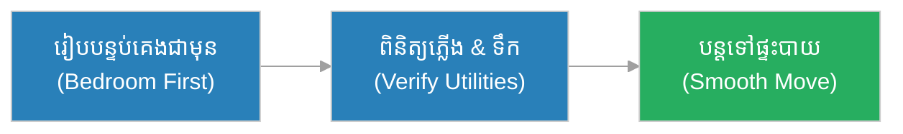
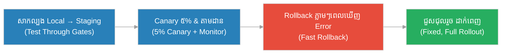
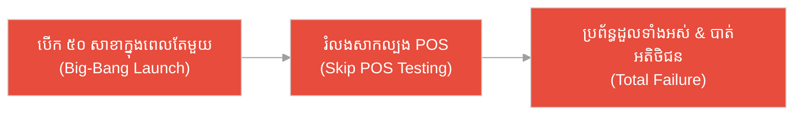
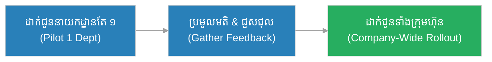
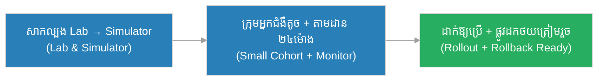
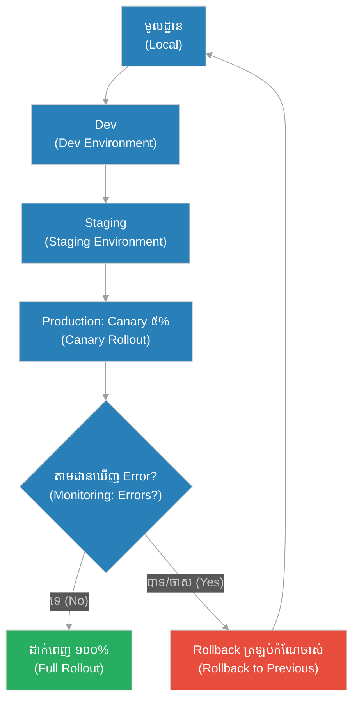

# វដ្តដាក់ឱ្យដំណើរការ (Deployment Lifecycle)៖ សំពៅឆ្លងកាត់ច្រកទ្វារទឹក និង​ការ​សម្របកម្រិតទឹកម្តងមួយជង្រុក (The Ship Through the Canal Locks & The One-Chamber-at-a-Time Seal)

**អ្នកនិពន្ធ (Author):** ichamrong 
**កាលបរិច្ឆេទ (Date):** 2026-05-29 
**ស្លាក (Tags):** #agile #devops #deployment-lifecycle #parable 
**ប្រភេទ (Category):** Management & Leadership 
**រយៈពេលអាន (Read Time):** ~១២ នាទី (~12 min) 

---

## 📌 មាតិកា (Table of Contents)
- [អន្ទាក់​នៃ​ការ​ដាក់ឱ្យដំណើរ​ការ (The Deployment Trap)](#0)
- [១. រឿងប្រៀបប្រដូច៖ សំពៅឆ្លងកាត់ច្រកទ្វារទឹក (The Parable: The Ship Through the Canal Locks)](#1)
- [២. បញ្ហា៖ ការ​យល់ច្រឡំថា «ដាក់ឱ្យដំណើរ​ការ = ផ្ញើ​កូដ​ទៅ​ម៉ាស៊ីន» (The Issue: "Deploy = Just Push Code")](#2)
- [៣. ឧទាហរណ៍​ជាក់ស្តែង​ក្នុង​ពិភពពិត (Real World Examples)](#3)
 - [ឧទាហរណ៍​ទី ១ — កម្រិតស្រាល (គ្រួសារ)៖ ការ​ផ្លាស់ប្តូរផ្ទះ​ថ្មី​ម្តងមួយបន្ទប់ (The Family House Move)](#3-1)
 - [ឧទាហរណ៍​ទី ២ — កម្រិតមធ្យម (បច្ចេកទេស)៖ ការ​ដាក់មុខងារទូទាត់ប្រាក់​ថ្មី​តាម​ដំណាក់កាល (The Staged Payment Feature)](#3-2)
 - [ឧទាហរណ៍​ទី ៣ — កម្រិតមធ្យម (ធុរកិច្ច)៖ ការ​បើកសាខាហាង​ថ្មី​ដោយ​រំលង​ការ​សាកល្បង (The Rushed Store Launch)](#3-3)
 - [ឧទាហរណ៍​ទី ៤ — កម្រិតមធ្យម (គ្រប់​គ្រង)៖ ការ​ដាក់​ប្រព័ន្ធ HR ថ្មី​ជា Canary (The Canary HR Rollout)](#3-4)
 - [ឧទាហរណ៍​ទី ៥ — កម្រិតធ្ងន់ (សង្គ្រោះបន្ទាន់)៖ ការ Update កម្មវិធី​បញ្​ជា​ប្រព័ន្ធ​បេះដូងសិប្បនិម្មិត (The Pacemaker Firmware Update)](#3-5)
- [៤. ការ​សន្ទនាបែបសាកសួរ (Socratic Dialogue: Pushing Code vs. Gated Delivery)](#4)
- [៥. ដំណោះស្រាយ៖ បំពង់បង្ហូរដាក់ឱ្យដំណើរ​ការ​ដែល​មាន​ច្រក​ត្រួតពិនិត្យ (The Solution: A Gated Deployment Pipeline)](#5)
- [សេចក្តីសន្និដ្ឋាន (Conclusion)](#6)
- [ឯកសារយោង (References)](#7)
- [Related Posts](#8)

---

## អន្ទាក់​នៃ​ការ​ដាក់ឱ្យដំណើរ​ការ (The Deployment Trap)

នៅ​ពេល​ដាក់​កូដ​ឱ្យដំណើរ​ការ យើង​តែ​ង​តែ​ជួបប្រទះនូវភាពផ្ទុយគ្នា​ពី​រ៖

* **អន្ទាក់​ប្រញាប់ (The Cowboy Trap):** «ដាក់ឱ្យដំណើរ​ការ គ្រាន់​តែ push កូដ​ឡើង server ផលិតកម្ម (Production) ឱ្យ​តែ​រួច​ទៅ​បាន​ហើយ! មិន​បាច់សាកល្បងអ្វីច្រើនទេ!»
* **អន្ទាក់​ខ្លាច​មិន​ហ៊ានដាក់ (The Freeze Trap):** «កុំ​ទាន់ដាក់ឱ្យដំណើរ​ការ! ត្រូវ​រង់ចាំ ៦ ខែ ឱ្យពិនិត្យអ្វី ៗ គ្រប់​យ៉ាង​ម្តងសិន ហើយដាក់ឱ្យដំណើរ​ការ​ទាំងអស់​ក្នុង​ពេល​តែ​មួយ!»

---

## ១. រឿងប្រៀបប្រដូច៖ សំពៅឆ្លងកាត់ច្រកទ្វារទឹក (The Parable: The Ship Through the Canal Locks)

កាល​ពី​ព្រេងនាយ មាន​ប្រឡាយធំមួយ​ដែល​ភ្​ជា​ប់សមុទ្រខ្ពស់​ទៅ​នឹងសមុទ្រទាប។ ដោយសារ​កម្រិតទឹកទាំង​ពី​រខាងខុសគ្នាឆ្ងាយ ប្រឡាយ​នោះ​ត្រូវ​បាន​បែងចែក​ជា​ជង្រុកទឹក (Lock Chamber) ជា​ច្រើនបន្តបន្ទាប់គ្នា ដែល​នីមួយ ៗ មាន​ទ្វារដ្បិត​យ៉ាង​ជិតស្និទ្ធនៅខាងមុខ និង​ខាង​ក្រោយ។ ច្បាប់​នៃ​ប្រឡាយ​មាន​តែ​មួយ៖ ជង្រុក​នីមួយ ៗ ត្រូវ​ដ្បិតឱ្យជិត និង​សម្របកម្រិតទឹក (Equalize) ឱ្យស្មើនឹងជង្រុកបន្ទាប់​ជា​មុន​សិន ទើបអាចបើកទ្វារ​ទៅ​ជង្រុក​ក្រោយ​បាន — អ្នក​មិន​អាចរំលងជង្រុក ឬ​បើកទ្វារ​ពី​រ​ក្នុង​ពេល​តែ​មួយ​បាន​ឡើយ។

នាយទូកម្នាក់ឈ្មោះ **រិទ្ធី (Rithy)** បាន​បើកសំពៅដឹកអង្ករ​យ៉ាង​ធ្ងន់​របស់​គាត់ចូលជង្រុកទីមួយ។ គាត់រង់ចាំឱ្យទ្វារខាង​ក្រោយ​ដ្បិតជិត ឱ្យទឹកហូរចូលរហូតស្មើកម្រិត ទើបបើកទ្វារខាងមុខ រួចសំពៅរំកិល​ទៅ​ជង្រុកបន្ទាប់។ គាត់​ធ្វើ​បែប​នេះ​ម្តងមួយជង្រុក ដោយ​អត់ធ្មត់ ត្រួតពិនិត្យ​កម្រិតទឹក​រាល់​ដំណាក់កាល។ ទោះបី​យឺត​បន្តិច តែ​សំពៅ និង​អង្ករ​ទាំងអស់​បាន​ទៅ​ដល់សមុទ្រម្ខាងទៀត​ដោយ​សុវត្ថិភាព។

ផ្ទុយ​ទៅ​វិញ នាយទូកម្នាក់ទៀតប្រញាប់​ខ្លាំង ដោយ​ខ្លាចខាត​ពេល។ គាត់​បាន​បង្ខំបើកទ្វារខាងមុខ​មុន​ពេល​ជង្រុកសម្របកម្រិតទឹករួច។ ភ្លាម​នោះ ទឹកដ៏​ខ្លាំង​ពី​ជង្រុកខ្ពស់​បាន​ស្រក់ចូល​យ៉ាង​គំហុក បុកសំពៅ​ទៅ​នឹងជញ្​ជា​ំងថ្ម បំបែកដងសំពៅ ហើយលិចទាំងសំពៅ និង​ទំនិញចូល​ក្នុង​បាតប្រឡាយ។ ការ​ប្រញាប់រំលងច្រក​ត្រួតពិនិត្យ បាន​បង្ខូចអ្វី ៗ ទាំងអស់​ក្នុង​មួយប៉ប្រិចភ្នែក។

---

## ២. បញ្ហា៖ ការ​យល់ច្រឡំថា «ដាក់ឱ្យដំណើរ​ការ = ផ្ញើ​កូដ​ទៅ​ម៉ាស៊ីន» (The Issue: "Deploy = Just Push Code")

នៅក្នុង​ការ​អភិវឌ្ឍ​ន៍​កម្មវិធី​បែប Agile/DevOps, **វដ្តដាក់ឱ្យដំណើរការ (Deployment Lifecycle)** គឺ​មិន​មែន​ជា​សកម្មភាព​តែ​មួយជំហាន​ដែល​គ្រាន់​តែ «push កូដ​ឡើង server» នោះ​ទេ។ ផ្ទុយ​ទៅ​វិញ វា​ជា **បំពង់បង្ហូរ​ដែល​មាន​ច្រក​ត្រួតពិនិត្យ (Gated Pipeline)** ដែល​កូដ​ត្រូវ​ឆ្លងកាត់បរិស្ថាន​ជា​បន្តបន្ទាប់ (មូលដ្ឋាន → Dev → Staging → Production) ដោយ​មាន​ការ​ត្រួតពិនិត្យ​នៅ​រាល់​ច្រក មាន​ការ​ដាក់ឱ្យដំណើរ​ការ​បន្តិចម្តង ៗ (Canary/Gradual Rollout) មាន​ការ​តាមដាន (Monitoring) និង​មាន​ផ្លូវដកថយ (Rollback Path)។

ការ​យល់ច្រឡំថា «ដាក់ឱ្យដំណើរ​ការ = ផ្ញើ​កូដ» គឺ​ដូចជា​នាយទូក​ដែល​បង្ខំបើកទ្វារ​មុន​ពេល​ជង្រុកសម្របកម្រិតទឹក៖ កូដ​ដែល​មិន​បាន​ឆ្លងកាត់ច្រក​ត្រួតពិនិត្យ អាចបំផ្លាញ​ប្រព័ន្ធ​ផលិតកម្មទាំងមូល​ក្នុង​មួយប៉ប្រិចភ្នែក។

---

## ៣. ឧទាហរណ៍​ជាក់ស្តែង​ក្នុង​ពិភពពិត

សូមពិនិត្យមើលរបៀប​ដែល​គោល​ការ​ណ៍ «ឆ្លងកាត់ច្រកម្តងមួយ» ជះឥទ្ធិពលដល់កម្រិតជីវិត និង​ការ​ងារទាំង ៥ ខាងក្រោម៖

---

### ឧទាហរណ៍​ទី ១ — កម្រិតស្រាល (គ្រួសារ)៖ ការ​ផ្លាស់ប្តូរផ្ទះ​ថ្មី​ម្តងមួយបន្ទប់ (The Family House Move)

* **ស្ថានភាព (Situation):** គ្រួសារមួយផ្លាស់ប្តូរ​ទៅ​ផ្ទះ​ថ្មី។ ជំនួសឱ្យ​ការ​ដឹក​របស់​ទាំងអស់​ចូល​ក្នុង​ពេល​តែ​មួយ ពួកគេរៀបចំម្តងមួយបន្ទប់៖ បន្ទប់គេង​ជា​មុន រួចពិនិត្យថាភ្​លើ​ង ទឹក និង​គ្រែដំណើរ​ការ​ល្អ ទើបបន្ត​ទៅ​ផ្ទះបាយ។
* **លទ្ធផល (Outcome):** គ្រួសារអាចគេង និង​ធ្វើ​បាយ​បាន​នៅយប់ដំបូង ដោយ​គ្មាន​ភាពចលាចល ហើយ​រាល់​បន្ទប់​ត្រូវ​បាន​ពិនិត្យឱ្យដំណើរ​ការ​មុន​ពេល​បន្ត។

---

### ឧទាហរណ៍​ទី ២ — កម្រិតមធ្យម (បច្ចេកទេស)៖ ការ​ដាក់មុខងារទូទាត់ប្រាក់​ថ្មី​តាម​ដំណាក់កាល (The Staged Payment Feature)

* **ស្ថានភាព (Situation):** ក្រុមអភិវឌ្ឍន៍​បាន​សរសេរ​មុខងារទូទាត់ប្រាក់​ថ្មី។ ពួកគេដាក់វាឆ្លងកាត់ច្រកម្តងមួយ៖ សាកល្បង​លើ​ម៉ាស៊ីនមូលដ្ឋាន (Local) → Dev → Staging រួចបើកជូន​អ្នក​ប្រើ ៥% ជា Canary ដោយ​តាមដាន error rate។
* **លទ្ធផល (Outcome):** ពេល​ឃើញ error កើនឡើងបន្តិចនៅ Canary ក្រុ​មក​ារងារ rollback ភ្លាម ហើយជួសជុល​មុន​ពេល​ប៉ះពាល់​អ្នក​ប្រើទាំង ១០០%។

---

### ឧទាហរណ៍​ទី ៣ — កម្រិតមធ្យម (ធុរកិច្ច)៖ ការ​បើកសាខាហាង​ថ្មី​ដោយ​រំលង​ការ​សាកល្បង (The Rushed Store Launch)

* **ស្ថានភាព (Situation):** ក្រុមហ៊ុនលក់រាយប្រញាប់បើកសាខា​ថ្មី ៥០ កន្លែង​ក្នុង​ពេល​តែ​មួយថ្ងៃ ដោយ​រំលង​ការ​សាកល្បង​ប្រព័ន្ធ​គិតលុយ (POS) និង​ការ​បណ្តុះបណ្តាលបុគ្គលិក​ជា​មុន។
* **លទ្ធផល (Outcome):** ប្រព័ន្ធ POS ដួលរលំទាំង ៥០ សាខា​ក្នុង​ម៉ោងបើកដំបូង បុគ្គលិក​មិន​ចេះប្រើ អតិថិជន​ត្រូវ​រង់ចាំយូរ និង​ចាកចេញ បណ្តាលឱ្យបាត់បង់ប្រាក់ចំណូល និង​កេរ្តិ៍ឈ្មោះ​យ៉ាង​ធ្ងន់ធ្ងរ។

---

### ឧទាហរណ៍​ទី ៤ — កម្រិតមធ្យម (គ្រប់​គ្រង)៖ ការ​ដាក់​ប្រព័ន្ធ HR ថ្មី​ជា Canary (The Canary HR Rollout)

* **ស្ថានភាព (Situation):** អ្នក​គ្រប់​គ្រងសម្រេចចិត្តដាក់​ប្រព័ន្ធ​គ្រប់​គ្រងបុគ្គលិក (HR System) ថ្មី​ជូននាយកដ្ឋាន​តែ​មួយ (២០ នាក់) ជា​មុន​សិន ដើម្បី​ប្រមូលមតិត្រឡប់ និង​តាមដាន​បញ្ហា មុន​ពេល​ដាក់ជូនបុគ្គលិកទាំង ២,០០០ នាក់។
* **លទ្ធផល (Outcome):** បញ្ហា​តូច ៗ ត្រូវ​បាន​រកឃើញ និង​ជួសជុល​ក្នុង​ក្រុមតូច ហើយ​ពេល​ដាក់ឱ្យប្រើទាំងក្រុមហ៊ុន ដំណើរ​ការ​រលូន​ដោយ​គ្មាន​ការ​តវ៉ាច្រើន។

---

### ឧទាហរណ៍​ទី ៥ — កម្រិតធ្ងន់ (សង្គ្រោះបន្ទាន់)៖ ការ Update កម្មវិធី​បញ្​ជា​ប្រព័ន្ធ​បេះដូងសិប្បនិម្មិត (The Pacemaker Firmware Update)

* **ស្ថានភាព (Situation):** ក្រុមហ៊ុនឧបករណ៍ពេទ្យ​ត្រូវ update កម្មវិធី​បញ្​ជា (Firmware) របស់​ឧបករណ៍ជំនួយបេះដូង (Pacemaker)។ ពួកគេសាកល្បង​លើ​មន្ទីរពិសោធន៍ → ឧបករណ៍ត្រាប់​តាម (Simulator) → អ្នក​ជំងឺស្ម័គ្រចិត្តមួយក្រុមតូច​ក្រោម​ការ​តាមដាន​វេជ្ជសាស្ត្រ ២៤ ម៉ោង មុន​ពេល​ដាក់ឱ្យប្រើទូលំទូលាយ ដោយ​រក្សាផ្លូវដកថយ Firmware ចាស់​ជា​និច្ច។
* **លទ្ធផល (Outcome):** ការ update ត្រូវ​បាន​ដាក់ឱ្យដំណើរ​ការ​ដោយ​សុវត្ថិភាព ដោយ​គ្មាន​គ្រោះថ្នាក់ដល់ជីវិត ហើយផ្លូវដកថយត្រៀមរួច​ជា​និច្ចប្រសិនបើ​មាន​បញ្ហា​បន្ទាន់។

---

## ៤. ការ​សន្ទនាបែបសាកសួរ (Socratic Dialogue: Pushing Code vs. Gated Delivery)

**សិស្ស (អ្នក​អភិវឌ្ឍ​ន៍)៖** លោកគ្រូ! ខ្ញុំ​សរសេរ​កូដ​រួចហើយ ដូច្​នេះ​ខ្ញុំគ្រាន់​តែ push វាឡើង server ផលិតកម្មឱ្យ​តែ​រួច​ទៅ​បាន​ហើយ មែនទេ? តើ «ដាក់ឱ្យដំណើរ​ការ» វា​មាន​អ្វីច្រើន​ជា​ង​នេះ?

**គ្រូ (វិស្វករ DevOps)៖** អនុញ្ញាតឱ្យខ្ញុំសួរវិញ៖ ប្រសិនបើ​កូដ​នោះ​មាន bug ដែល​ឯងមើល​មិន​ឃើញ ហើយឯង push វាត្រង់​ទៅ Production តើ​នឹង​មាន​អ្វីកើតឡើងចំពោះ​អ្នក​ប្រើ ១លាននាក់?

**សិស្ស៖** ប្រហែល​ជា​ប្រព័ន្ធ​នឹងដួល ហើយ​អ្នក​ប្រើ​ទាំងអស់​នឹងជួប​បញ្ហា...

**គ្រូ៖** ត្រឹម​ត្រូវ។ ដូច្​នេះ ហេតុអ្វី​បាន​ជា​យើង​មិន push កូដ​ត្រង់ ៗ ទៅ Production ភ្លាម ៗ ? តើ​ឯងធ្លាប់ឃើញសំពៅឆ្លងកាត់ច្រកទ្វារទឹក (Canal Locks) ទេ?

**សិស្ស៖** ធ្លាប់លោកគ្រូ។ សំពៅ​ត្រូវ​ចូលជង្រុកម្តងមួយ រង់ចាំទឹកសម្របកម្រិត រួចទើបបើកទ្វារបន្ទាប់។

**គ្រូ៖** ហ្នឹងហើយ! កូដ​ក៏ដូចសំពៅដែរ។ វា​ត្រូវ​ឆ្លងកាត់ច្រកម្តងមួយ៖ Local → Dev → Staging → Production។ នៅ​រាល់​ច្រក មាន​ការ​ត្រួតពិនិត្យ (Tests, Reviews)។ ហើយ​ពេល​ដល់ Production យើង​មិន​បើកជូន​អ្នក​ប្រើទាំង ១០០% ភ្លាមទេ — យើងបើក​ជា Canary ៥% ជា​មុន​សិន ដោយ​តាមដាន។ ប្រសិនបើនាយទូកបង្ខំបើកទ្វារ​មុន​ពេល​ជង្រុកសម្របកម្រិត តើ​មាន​អ្វីកើតឡើង?

**សិស្ស៖** សំពៅនឹងបុកជញ្​ជា​ំង ហើយលិច។ ដូច្​នេះ បើខ្ញុំ push ត្រង់​ទៅ Production ដោយ​រំលងច្រក​ត្រួតពិនិត្យ ប្រព័ន្ធ​ក៏អាច «លិច» ដែរ។

**គ្រូ៖** ត្រឹម​ត្រូវ! ហើយចំណុចសំខាន់មួយទៀត — ប្រសិនបើ​ការ​តាមដាន (Monitoring) ឃើញ error កើនឡើង​ពេល Canary តើ​ឯងគួរ​ធ្វើ​ដូចម្តេច?

**សិស្ស៖** ខ្ញុំគួរ rollback ភ្លាម ៗ ត្រឡប់​ទៅ​កំណែ​ចាស់​ដែល​ដំណើរ​ការ​ល្អ មុន​ពេល​ប៉ះពាល់​អ្នក​ប្រើ​ទាំងអស់!

**គ្រូ៖** ល្អ​ណាស់។ ដូច្​នេះ ចូរចងចាំ៖ «ដាក់ឱ្យដំណើរ​ការ» មិន​មែន​ជា «push កូដ» ឡើយ ប៉ុន្តែ​វា​ជា​ដំណើរ​ការ​មាន​ច្រក​ត្រួតពិនិត្យ ដែល​មាន Canary, Monitoring និង​ផ្លូវ Rollback ត្រៀមរួច​ជា​និច្ច។

---

## ៥. ដំណោះស្រាយ៖ បំពង់បង្ហូរដាក់ឱ្យដំណើរ​ការ​ដែល​មាន​ច្រក​ត្រួតពិនិត្យ (The Solution: A Gated Deployment Pipeline)

ដើម្បី​ដាក់​កូដ​ឱ្យដំណើរ​ការ​ដោយ​សុវត្ថិភាព ក្រុ​មក​ារងារ​ត្រូវ​អនុវត្តគោល​ការ​ណ៍ច្រក​ត្រួតពិនិត្យ​ដូច​ខាងក្រោម៖

1. **ច្រកម្តងមួយ មិន​រំលង (One Gate at a Time):** កូដ​ត្រូវ​ឆ្លងកាត់បរិស្ថាន​ជា​បន្តបន្ទាប់ — មូលដ្ឋាន (Local) → Dev → Staging → Production។ មិន​អាចរំលងបរិស្ថានណាមួយ​បាន​ឡើយ ដូចសំពៅ​មិន​អាចរំលងជង្រុក។
2. **ត្រួតពិនិត្យ​នៅ​រាល់​ច្រក (Checks at Each Gate):** រាល់​ច្រក​ត្រូវ​មាន​ការ​សាកល្បងស្វ័យប្រវត្តិ (Automated Tests), ការ Review និង​ការ​អនុម័ត (Approval) មុន​ពេល​បន្ត​ទៅ​ច្រកបន្ទាប់ — ដូចទឹក​ត្រូវ​សម្របកម្រិតឱ្យស្មើ។
3. **ដាក់បន្តិចម្តង ៗ (Canary/Gradual Rollout):** នៅ Production កុំ​បើកជូន​អ្នក​ប្រើទាំង ១០០% ភ្លាម ៗ ។ ចាប់ផ្​តើ​ម​ពី ៥% → ៥០% → ១០០% ដោយ​តាមដាន​នៅ​រាល់​ដំណាក់កាល។
4. **តាមដាន & ផ្លូវដកថយ (Monitoring & Rollback):** ត្រូវ​តាមដាន error rate និង​សុខភាព​ប្រព័ន្ធ​ជា​និច្ច។ ប្រសិនបើ​មាន​បញ្ហា ត្រូវ rollback ត្រឡប់​ទៅ​កំណែ​ចាស់​ភ្លាម ៗ — ផ្លូវដកថយ​ត្រូវ​ត្រៀមរួច​ជា​និច្ច។

---

## 🐇 ធ្លាក់ចូល​ក្នុង​រន្ធទន្សាយ (Enter the Rabbit Hole)

ដើម្បី​យល់ដឹងកាន់​តែ​ស៊ីជម្រៅអំ​ពី​ដំណើរ​ការ​ដាក់ឱ្យដំណើរ​ការ និង​លំហូរ​ការ​ងារពាក់ព័ន្ធ សូមស្វែងយល់បន្ថែម៖

* 🚀 **[បំពង់បង្ហូរ CI/CD (Continuous Integration / Continuous Delivery) ➔](./ci-cd.md)**
* 🚀 **[វដ្តជីវិត​របស់​សំបុត្រ​ការ​ងារ (Ticket Lifecycle) ➔](../artifacts/ticket-lifecycle.md)**
* 🚀 **[និយមន័យ​នៃ​ភាព​បាន​បញ្ចប់ (Definition of Done) ➔](../artifacts/dod.md)**

---

## សេចក្តីសន្និដ្ឋាន (Conclusion)

> **«ការ​ដាក់ឱ្យដំណើរ​ការ មិន​មែន​ជា​ការ push កូដ​ឡើង server ឡើយ ប៉ុន្តែ​វា​ជា​ការ​នាំសំពៅឆ្លងកាត់ច្រកម្តងមួយ ដោយ​រង់ចាំឱ្យកម្រិតទឹកសម្របឱ្យស្មើនៅ​រាល់​ច្រក។»**

ការអនុវត្ត​វដ្តដាក់ឱ្យដំណើរការ​ដ៏ត្រឹម​ត្រូវ — ដោយ​ឆ្លងកាត់ច្រក​ត្រួតពិនិត្យ​ម្តងមួយ ដាក់បន្តិចម្តង ៗ តាមដាន​ជា​និច្ច និង​រក្សាផ្លូវដកថយ — ជួយឱ្យក្រុ​មក​ារងារនាំ​កូដ​ទៅ​ដល់​អ្នក​ប្រើ​ដោយ​សុវត្ថិភាព ដោយ​ជៀសវាង​ការ «បុកជញ្​ជា​ំង និង​លិចសំពៅ» ដូចនាយទូក​ដែល​ប្រញាប់រំលងច្រក។

---

## ឯកសារយោង (References)

* **Jez Humble & David Farley** — *Continuous Delivery: Reliable Software Releases through Build, Test, and Deployment Automation* (2010).
* **Nicole Forsgren, Jez Humble & Gene Kim** — *Accelerate: The Science of Lean Software and DevOps* (2018).
* **Betsy Beyer, Chris Jones, Jennifer Petoff & Niall Richard Murphy** — *Site Reliability Engineering (Google SRE Book)* (2016).

---

## Related Posts

* [បំពង់បង្ហូរ CI/CD (CI/CD Pipeline)](./ci-cd.md) — ការ​ធ្វើ​ស្វ័យប្រវត្តិកម្ម​នៃ​ការ build, test និង​បញ្ជូន​កូដ ដែល​ជា​មូលដ្ឋាន​នៃ​វដ្តដាក់ឱ្យដំណើរការ។
* [វដ្តជីវិត​របស់​សំបុត្រ​ការ​ងារ (Ticket Lifecycle)](../artifacts/ticket-lifecycle.md) — របៀប​ដែល​ការ​ងារផ្លាស់ប្តូរស្ថានភាពម្តងមួយជំហានរហូតដល់​ត្រូវ​ដាក់ឱ្យដំណើរ​ការ។
* [និយមន័យ​នៃ​ភាព​បាន​បញ្ចប់ (Definition of Done)](../artifacts/dod.md) — លក្ខខណ្ឌច្បាស់លាស់​ដែល​កូដ​ត្រូវ​បំពេញ​មុន​ពេល​ឆ្លងកាត់ច្រក​ទៅ Production។
