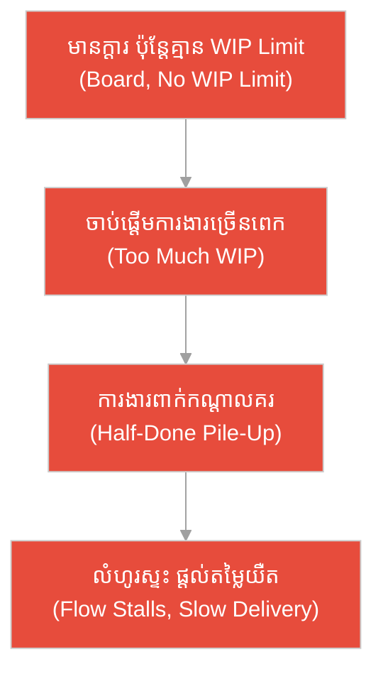
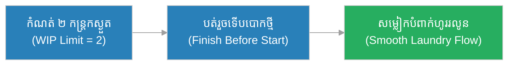
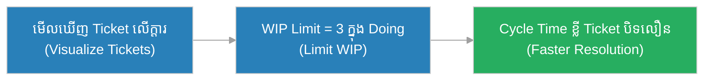
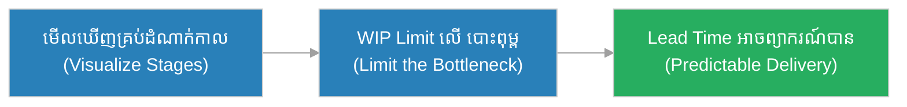
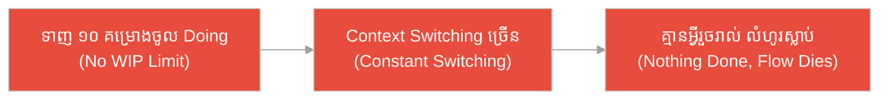
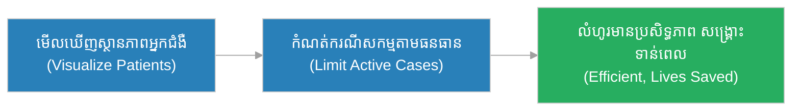
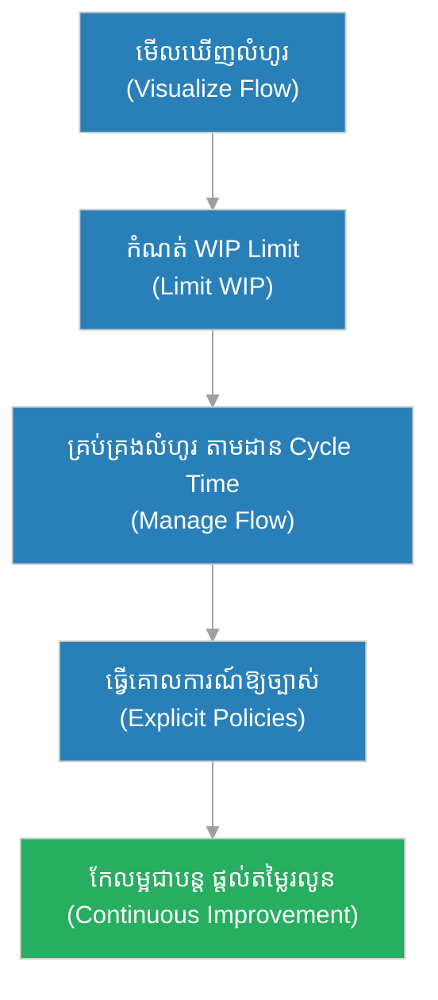

# ក្របខ័ណ្ឌ Kanban (Kanban)៖ បង្អួចបញ្ជូនម្ហូប​ក្នុង​រោង​តែ និង​ចំនួនថាសកំណត់ (The Teahouse Pass-Window & The Limited Trays)

**អ្នកនិពន្ធ (Author):** ichamrong 
**កាលបរិច្ឆេទ (Date):** 2026-05-29 
**ស្លាក (Tags):** #agile #scrum #kanban #parable 
**ប្រភេទ (Category):** Management & Leadership 
**រយៈពេលអាន (Read Time):** ~១២ នាទី (~12 min) 

---

## 📌 មាតិកា (Table of Contents)
- [អន្ទាក់​ការ​យល់ច្រឡំ (The Misconception Trap)](#0)
- [១. រឿងប្រៀបប្រដូច៖ បង្អួចបញ្ជូនម្ហូប និង​ថាសកំណត់ (The Parable: The Pass-Window & The Limited Trays)](#1)
- [២. បញ្ហា៖ ការ​ច្រឡំថា Kanban គ្រាន់​តែ​ជា​ក្តារ Sticky Notes (The Issue: Kanban Is Not Just a Board)](#2)
- [៣. ឧទាហរណ៍​ជាក់ស្តែង​ក្នុង​ពិភពពិត (Real World Examples)](#3)
 - [ឧទាហរណ៍​ទី ១ — កម្រិតស្រាល (គ្រួសារ)៖ ការ​បោកគក់សម្លៀកបំពាក់ (The Family Laundry Flow)](#3-1)
 - [ឧទាហរណ៍​ទី ២ — កម្រិតមធ្យម (បច្ចេកទេស)៖ ក្រុមដោះស្រាយ Bug Support (The Support Bug Queue)](#3-2)
 - [ឧទាហរណ៍​ទី ៣ — កម្រិតមធ្យម (ធុរកិច្ច)៖ ផ្ទះបោះពុម្ពផ្សាយ (The Print Shop Backlog)](#3-3)
 - [ឧទាហរណ៍​ទី ៤ — កម្រិតមធ្យម (គ្រប់​គ្រង)៖ ការ​ទទួល​គម្រោង​ច្រើនពេក (The Overcommitted PM)](#3-4)
 - [ឧទាហរណ៍​ទី ៥ — កម្រិតធ្ងន់ (សង្គ្រោះបន្ទាន់)៖ បន្ទប់ Triage មន្ទីរពេទ្យ (The Hospital Triage Flow)](#3-5)
- [៤. ការ​សន្ទនាបែបសាកសួរ (Socratic Dialogue: A Board vs. Managed Flow)](#4)
- [៥. ដំណោះស្រាយ៖ ការអនុវត្ត Kanban ឱ្យត្រឹម​ត្រូវ (The Solution: Practicing Kanban)](#5)
- [សេចក្តីសន្និដ្ឋាន (Conclusion)](#6)
- [ឯកសារយោង (References)](#7)
- [Related Posts](#8)

---

## អន្ទាក់​ការ​យល់ច្រឡំ (The Misconception Trap)

នៅ​ពេល​និយាយអំ​ពី Kanban យើង​តែ​ង​តែ​ជួបនូវ​ការ​យល់ច្រឡំផ្ទុយគ្នា​ពី​រ៖

* **អន្ទាក់​ក្តារ Sticky (The Sticky-Note Trap):** «យើង​មាន​ក្តារ To Do / Doing / Done ដិតក្រដាសពណ៌ ដូច្​នេះ​យើង​ធ្វើ Kanban ហើយ! មិន​បាច់កំណត់អ្វីបន្ថែមទេ!»
* **អន្ទាក់​គ្មាន​ព្រំដែន (The No-Limit Trap):** «យក​ការ​ងារ​ទាំងអស់​ដាក់ចូល Doing ឱ្យអស់​ទៅ ឱ្យ​តែ​គ្រប់​គ្នាមមាញឹក! ការ​ងារកាន់​តែ​ច្រើន​ក្នុង​ពេល​តែ​មួយ កាន់​តែ​ផលិត​បាន​ច្រើន!»

---

## ១. រឿងប្រៀបប្រដូច៖ បង្អួចបញ្ជូនម្ហូប និង​ថាសកំណត់ (The Parable: The Pass-Window & The Limited Trays)

នៅក្នុង​រោង​តែ​ដ៏រវល់មួយ មាន​បង្អួចបញ្ជូនម្ហូប (pass-window) ភ្​ជា​ប់រវាងផ្ទះបាយ និង​សាល។ ម្​ចាស់​រោង​តែ​ឈ្មោះ **សុភា (Sophea)** បាន​កំណត់ច្បាប់ដ៏​សាមញ្ញ​មួយ៖ បង្អួច​នេះ​អនុញ្ញាតឱ្យ​មាន​ត្រឹម​តែ **ថាសម្ហូប ៥ ប៉ុណ្ណោះ** «កំពុង​ធ្វើ​ដំណើរ» (in flight) ក្នុង​ពេល​តែ​មួយ។ ការ​បញ្​ជា​ទិញ​ថ្មី​មួយ​នឹងចាប់ផ្​តើ​ម​ធ្វើ លុះត្រា​តែ​មាន​ថាសមួយរួច​រាល់ បាន​នាំចេញ និង​សម្អាតរួចសិន។ ដោយសារ​ច្បាប់​នេះ ម្ហូបហូរ (flow) យ៉ាង​រលូន ផ្ទះបាយ​មិន​លុះត្រឡប់ ហើយ​តែ​តែ​ង​តែ​ក្តៅ ស្រស់ ដល់ដៃភ្ញៀវ។

ផ្ទុយ​ទៅ​វិញ មាន​រោង​តែ​មួយទៀត​ដែល​គ្មាន​កំណត់ចំនួនថាស​ឡើយ។ ភ្ញៀវកុម្ម៉ង់ច្រើន មេចុងភៅក៏ចាប់ផ្​តើ​ម​ធ្វើ​គ្រប់​ការ​បញ្​ជា​ទិញព្រមគ្នា។ ឆ្នាំងពេញ ថាសពាក់កណ្តាលរួចគរនៅបង្អួច គ្មាន​នរណាដឹងថាមួយណាគួរបញ្ចប់​មុន។ លទ្ធផល៖ ការ​ងារពាក់កណ្តាល (half-done) គរ​ជា​គំនរ បង្អួច​ស្ទះ ហើយ​តែ​ដែល​នាំចេញក៏ត្រ​ជា​ក់ឥតរស​ជា​តិ។ មិន​មែន​ព្រោះ​ចុងភៅខ្ជិល​ឡើយ ប៉ុន្តែ​ព្រោះ​ការ​ងារ​ច្រើនពេក​ក្នុង​ពេល​តែ​មួយ បាន​បំផ្លាញ​លំហូរ​ទាំងមូល។

---

## ២. បញ្ហា៖ ការ​ច្រឡំថា Kanban គ្រាន់​តែ​ជា​ក្តារ Sticky Notes (The Issue: Kanban Is Not Just a Board)

**Kanban** គឺជា​វិធីសាស្ត្រ​គ្រប់​គ្រងលំហូរ​ការ​ងារ (workflow) ដែល​ផ្តោត​លើ ៣ គោល​ការ​ណ៍សំខាន់៖ (១) **មើលឃើញលំហូរ (Visualize the flow)**, (២) **កំណត់​ការ​ងារកំពុង​ធ្វើ (Limit Work In Progress / WIP)**, និង (៣) **គ្រប់​គ្រង និង​កែលម្អ​លំហូរ (Manage & improve flow)**។ វា​មិន​មាន​វដ្តថេរ (Sprints) ឡើយ — វា​ជា​ដំណើរ​ការ **បន្ត (continuous)**។

ការ​ច្រឡំធំបំផុត​គឺ៖ «Kanban = ក្តារដិតក្រដាសពណ៌»។ ការ​មាន​ក្តារគ្រាន់​តែ​សម្រេច​បាន​គោល​ការ​ណ៍ទីមួយ (មើលឃើញ) ប៉ុណ្ណោះ។ បើ​គ្មាន **WIP Limit** ក្តារ​នោះ​គ្រាន់​តែ​ជា​បញ្ជីការងារ​ដ៏វែង​ដែល​គរប្រមូលផ្តុំ។ បេះដូង​ពិត​របស់ Kanban គឺ **WIP Limit** ដែល​បង្ខំឱ្យក្រុមបញ្ចប់​ការ​ងារ​ដែល​ចាប់ផ្​តើ​មហើយ មុន​ពេល​ចាប់ផ្​តើ​មក​ារងារ​ថ្មី — ដូចថាស ៥ របស់​សុភា។

---

## ៣. ឧទាហរណ៍​ជាក់ស្តែង​ក្នុង​ពិភពពិត

សូមពិនិត្យមើលរបៀប​ដែល​គោល​ការ​ណ៍ Kanban (មិន​មែនត្រឹម​តែ​ក្តារ) ជះឥទ្ធិពលដល់ស្ថានភាពទាំង ៥ ខាងក្រោម៖

---

### ឧទាហរណ៍​ទី ១ — កម្រិតស្រាល (គ្រួសារ)៖ ការ​បោកគក់សម្លៀកបំពាក់ (The Family Laundry Flow)

* **ស្ថានភាព៖** គ្រួសារមួយ​តែ​ង​តែ​គរសម្លៀកបំពាក់កខ្វក់​ជា​គំនរធំ ហើយម៉ាស៊ីនបោកដំណើរ​ការ​មិន​ទាន់។ ពួកគេកំណត់ច្បាប់ Kanban៖ មាន «កន្ត្រកកំពុងស្ងួត» ត្រឹម​តែ ២ ប៉ុណ្ណោះ; មិន​បោក​ថ្មី​ទេ បើ ២ កន្ត្រកនៅ​មិន​ទាន់បត់ និង​ទុកដាក់រួច។
* **លទ្ធផល៖** សម្លៀកបំពាក់ហូរ​យ៉ាង​រលូន គ្មាន​គំនរសើម គ្មាន​ភ្លេចបោក ហើយផ្ទះស្អាត​ជា​និច្ច។

---

### ឧទាហរណ៍​ទី ២ — កម្រិតមធ្យម (បច្ចេកទេស)៖ ក្រុមដោះស្រាយ Bug Support (The Support Bug Queue)

* **ស្ថានភាព៖** ក្រុមជំនួយបច្ចេកទេសទទួល Bug ច្រើន​មិន​អាចព្យាករណ៍​បាន ដូច្​នេះ Sprint ថេរ​មិន​សម។ ពួកគេប្រើ Kanban៖ មើលឃើញ Ticket ទាំងអស់​លើ​ក្តារ ហើយកំណត់ WIP Limit ត្រឹម ៣ Ticket ក្នុង «Doing» ក្នុង​ពេល​តែ​មួយ។
* **លទ្ធផល៖** Cycle Time ខ្លី​ជា​ង​មុន Ticket បិទ​លឿន ហើយក្រុម​មិន​បែកខ្ញែក​ការ​ផ្តោតអារម្មណ៍ទៀត​ឡើយ។

---

### ឧទាហរណ៍​ទី ៣ — កម្រិតមធ្យម (ធុរកិច្ច)៖ ផ្ទះបោះពុម្ពផ្សាយ (The Print Shop Backlog)

* **ស្ថានភាព៖** ផ្ទះបោះពុម្ពមួយទទួល​ការ​បញ្​ជា​ទិញច្រើនពេក ហើយម៉ាស៊ីនបោះពុម្ព​មាន​កំណត់។ ម្​ចាស់​ប្រើ Kanban៖ បង្ហាញ​ការ​ងារ​គ្រប់​ដំណាក់កាល (រចនា → បោះពុម្ព → កាត់ → ប្រគល់) ហើយកំណត់ WIP Limit សម្រាប់​ដំណាក់កាល «បោះពុម្ព»។
* **លទ្ធផល៖** ការ​ងារ​មិន​កក​ស្ទះ​នៅម៉ាស៊ីនបោះពុម្ព Lead Time អាចព្យាករណ៍​បាន ហើយអតិថិជនទទួល​ការ​ងារទាន់​ពេល​ថេរ។

---

### ឧទាហរណ៍​ទី ៤ — កម្រិតមធ្យម (គ្រប់​គ្រង)៖ ការ​ទទួល​គម្រោង​ច្រើនពេក (The Overcommitted PM)

* **ស្ថានភាព៖** អ្នក​គ្រប់​គ្រងម្នាក់​ចង់​បង្ហាញ​ថាក្រុមមមាញឹក ដូច្​នេះ​គាត់ទាញ​គម្រោង ១០ ចូល​ក្នុង «Doing» ព្រមគ្នា ដោយ​គ្មាន WIP Limit។ គាត់គិតថា «ការ​ងារកាន់​តែ​ច្រើន​ក្នុង​ពេល​តែ​មួយ = ផលិតភាពខ្ពស់»។
* **លទ្ធផល៖** គ្មាន​គម្រោង​ណាមួយបញ្ចប់ ការ​ផ្លាស់ប្តូរបរិបទ (context switching) ស៊ី​ពេល​ច្រើន ហើយ Cycle Time យឺត​យ៉ាវ ដោយ​អ្វី ៗ ​សុទ្ធ​តែ «កំពុង​ធ្វើ» ប៉ុន្តែ​គ្មាន​អ្វី​ «រួច​រាល់»។

---

### ឧទាហរណ៍​ទី ៥ — កម្រិតធ្ងន់ (សង្គ្រោះបន្ទាន់)៖ បន្ទប់ Triage មន្ទីរពេទ្យ (The Hospital Triage Flow)

* **ស្ថានភាព៖** បន្ទប់សង្គ្រោះបន្ទាន់​មាន​គ្រែកំណត់ និង​គ្រូពេទ្យកំណត់។ ប្រធានបន្ទប់ប្រើគោល​ការ​ណ៍បែប Kanban៖ មើលឃើញ​ស្ថានភាព​អ្នក​ជំងឺ​គ្រប់​រូប​លើ​ក្តារ កំណត់ចំនួនករណី «កំពុងព្យាបាល​សកម្ម» តាម​ធនធាន​ពិត ហើយ​គ្រប់​គ្រង​លំហូរ​អ្នក​ជំងឺ។
* **លទ្ធផល៖** គ្មាន​អ្នក​ជំងឺណាមួយ​ត្រូវ​បាន​ភ្លេច ឬ​ទុក​ឱ្យ​ចាំ​យូរ​ដោយ​គ្មាន​ការ​ព្យាបាល​ ការ​ប្រើធនធាន​មាន​ប្រសិទ្ធភាព និង​ជួយសង្គ្រោះជីវិត​បាន​ទាន់​ពេល។

---

## ៤. ការ​សន្ទនាបែបសាកសួរ (Socratic Dialogue: A Board vs. Managed Flow)

**សិស្ស (អ្នក​គ្រប់​គ្រងផលិតផល)៖** លោកគ្រូ យើង​បាន​បង្កើត​ក្តារ To Do / Doing / Done ដិតក្រដាសពណ៌រួចហើយ។ ដូច្​នេះ​យើង​ធ្វើ Kanban ត្រឹម​ត្រូវ​ហើយមែនទេ?

**គ្រូ (Flow Coach)៖** សួរវិញសិន៖ តើ​នៅក្នុង​ជួរ «Doing» របស់​ឯង មាន​ការ​ងារប៉ុន្​មាន​នៅ​ពេល​នេះ?

**សិស្ស៖** អូ... ប្រហែល ២០ ការ​ងារ ព្រោះ​គ្រប់​គ្នាមមាញឹក។

**គ្រូ៖** ចុះ​ក្នុង​ចំណោម ២០ នោះ មាន​ប៉ុន្​មាន​ដែល​ពិត​ជា​បាន​បញ្ចប់​សប្តាហ៍​នេះ?

**សិស្ស៖** ប្រហែល... ២ ប៉ុណ្ណោះ លោកគ្រូ។ ឯ​ទៀត​នៅ​ជា​ប់​គាំង។

**គ្រូ៖** ដូច្​នេះ​ក្តារ​របស់​ឯង​បង្ហាញ​ការ​ងារ ប៉ុន្តែ​វា​មិន​បាន​គ្រប់​គ្រង​លំហូរ​ឡើយ។ បើ​គ្មាន​ការ​កំណត់​ចំនួន​ការ​ងារ​កំពុង​ធ្វើ (WIP Limit) តើ​ការ​ងារ​អាច​ហូរ​ចេញ​បាន​ដែរ​ឬ​ទេ ឬ​គ្រាន់​តែ​គរ​នៅ​កណ្តាល?

**សិស្ស៖** គ្រាន់​តែ​គរ​ប៉ុណ្ណោះ... ដូច​ថាស​ម្ហូប​ដែល​បំពេញ​បង្អួច​ពេញ។

**គ្រូ៖** ត្រឹម​ត្រូវ។ ក្តារ​គឺ​គ្រាន់​តែ​ជា​គោល​ការ​ណ៍​ទីមួយ (មើលឃើញ)។ បេះដូង​ពិត​នៃ Kanban គឺ **កំណត់ WIP** ដើម្បី​បង្ខំ​ឱ្យ​បញ្ចប់​មុន​ពេល​ចាប់​ផ្​តើ​ម​ថ្មី រួច **គ្រប់​គ្រង និង​កែលម្អ​លំហូរ** ជា​បន្ត​បន្ទាប់។ ការ​ងារ​ច្រើន​ក្នុង​ពេល​តែ​មួយ មិន​មែន​ជា​ផលិតភាព​ឡើយ — ការ​ងារ​រួច​រាល់​ទើប​ជា​ផលិតភាព។

---

## ៥. ដំណោះស្រាយ៖ ការអនុវត្ត Kanban ឱ្យត្រឹម​ត្រូវ (The Solution: Practicing Kanban)

ដើម្បី​ឱ្យ Kanban ដំណើរ​ការ​ពិតប្រាកដ ក្រុម​ត្រូវ​អនុវត្តគោល​ការ​ណ៍ស្នូលទាំង​នេះ៖

1. **មើលឃើញលំហូរ (Visualize the Workflow):** បង្ហាញ​គ្រប់​ដំណាក់កាល​ការ​ងារ​ពិត​លើ​ក្តារ មិន​មែន​ត្រឹម To Do / Doing / Done ប៉ុណ្ណោះ។
2. **កំណត់ WIP (Limit Work In Progress):** កំណត់​ចំនួន​ការ​ងារ​អតិបរមា​ក្នុង​ដំណាក់កាល​នីមួយ ៗ — នេះ​ជា​បេះដូង​របស់ Kanban។
3. **គ្រប់​គ្រងលំហូរ (Manage Flow):** តាមដាន Cycle Time និង Lead Time ដើម្បី​រក​មើល​ការ​កក​ស្ទះ (bottleneck)។
4. **ធ្វើ​ឱ្យ​គោល​ការ​ណ៍​ច្បាស់លាស់ (Make Policies Explicit):** កំណត់​ច្បាស់​ថា​ការ​ងារ​ឆ្លង​ដំណាក់កាល​ពេល​ណា (Definition of Done សម្រាប់​ជួរ​នីមួយ​ ៗ )។
5. **កែលម្អ​ជា​បន្ត (Continuous Improvement):** ប្រើ​ទិន្នន័យ​លំហូរ​ដើម្បី​កែ​តម្រូវ WIP Limit និង​ដំណើរ​ការ​ជា​បន្ត — គ្មាន​វដ្ត​ថេរ​ឡើយ។

---

## 🐇 ធ្លាក់ចូល​ក្នុង​រន្ធទន្សាយ (Enter the Rabbit Hole)

ដើម្បី​យល់ដឹងកាន់​តែ​ស៊ីជម្រៅអំ​ពី Kanban និង​ម៉ែត្រ​នៃ​លំហូរ សូមស្វែងយល់បន្ថែម៖

* 🚀 **[ការកំណត់ការងារ​កំពុង​ធ្វើ (WIP Limits) ➔](../metrics/wip-limits.md)**
* 🚀 **[រយៈពេល​វដ្ត​ការ​ងារ (Cycle Time) ➔](../metrics/cycle-time.md)**
* 🚀 **[ក្របខ័ណ្ឌ Scrum (Scrum) ➔](./scrum.md)**

---

## សេចក្តីសន្និដ្ឋាន (Conclusion)

> **«Kanban មិន​មែន​ជា​ក្តារដិតក្រដាសពណ៌​ឡើយ វា​ជា​ការ​មើលឃើញលំហូរ ការកំណត់ការងារ​កំពុង​ធ្វើ និង​ការ​គ្រប់​គ្រងលំហូរ ឱ្យ​ការ​ងារហូរចេញដូចទឹក មិន​មែនគរ​ជា​គំនរ។»**

ការអនុវត្ត Kanban ឱ្យ​បាន​ត្រឹម​ត្រូវ — ជា​ពិសេស WIP Limit — ជួយឱ្យក្រុ​មក​ារងារផ្តល់តម្លៃ​យ៉ាង​រលូន ដូចបង្អួចបញ្ជូនម្ហូប​របស់​សុភា ដែល​រក្សាថាសត្រឹម ៥ ហើយ​នាំ​តែ​ក្តៅ ៗ ​ដល់​ភ្ញៀវ​ជា​និច្ច — មិន​មែន​ដោយ​ការ​ធ្វើ​គ្រប់​យ៉ាង​ព្រម​គ្នា​នោះ​ទេ។

---

## ឯកសារយោង (References)

* **David J. Anderson** — *Kanban: Successful Evolutionary Change for Your Technology Business* (2010).
* **Marcus Hammarberg & Joakim Sundén** — *Kanban in Action* (2014).

---

## Related Posts

* [ការកំណត់ការងារ​កំពុង​ធ្វើ (WIP Limits)](../metrics/wip-limits.md) — បេះដូង​ពិត​របស់ Kanban ដែល​បង្ខំឱ្យបញ្ចប់​មុន​ពេល​ចាប់ផ្​តើ​ម​ថ្មី។
* [ក្របខ័ណ្ឌ Scrum (Scrum)](./scrum.md) — ជម្រើស Agile មួយផ្សេងទៀត​ដែល​ផ្តោត​លើ​វដ្តថេរ មិន​មែនលំហូរបន្ត។
