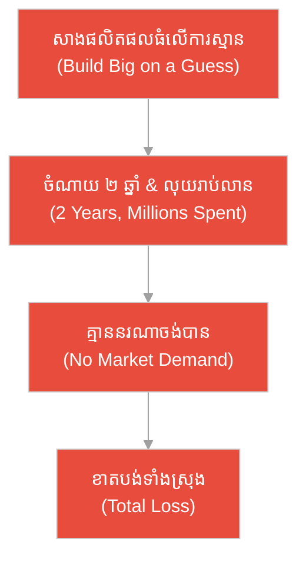
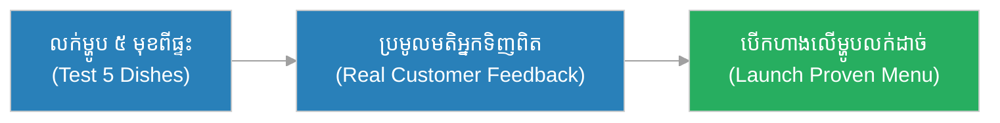
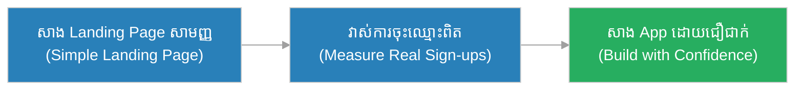
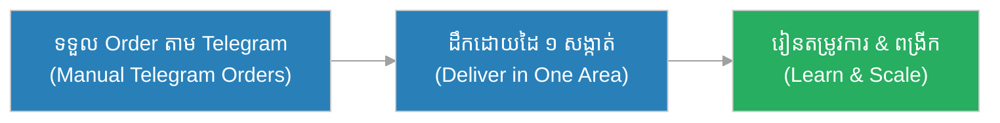
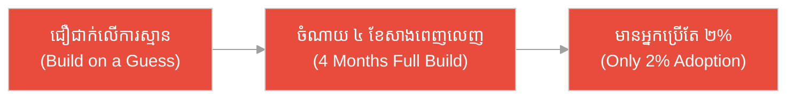
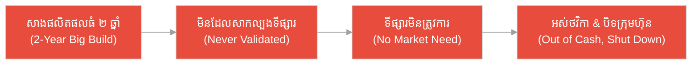
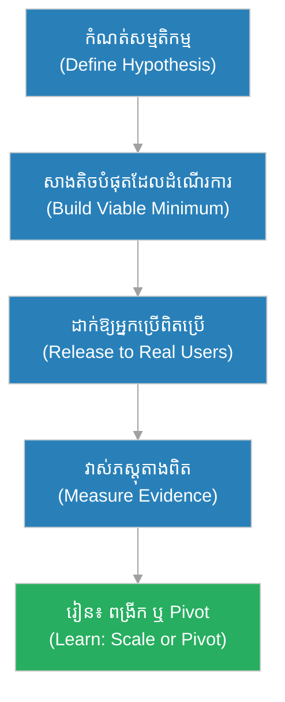

# ផលិតផលអប្បបរមា (Minimum Viable Product - MVP)៖ ក្បូនចំណងខ្សែ មុន​ពេល​សាងស្ពានធំ (The Raft-and-Rope Ferry Before the Grand Bridge)

**អ្នកនិពន្ធ (Author):** ichamrong 
**កាលបរិច្ឆេទ (Date):** 2026-05-29 
**ស្លាក (Tags):** #agile #scrum #mvp #parable 
**ប្រភេទ (Category):** Management & Leadership 
**រយៈពេលអាន (Read Time):** ~១២ នាទី (~12 min) 

---

## 📌 មាតិកា (Table of Contents)
- [អន្ទាក់​នៃ MVP (The MVP Trap)](#0)
- [១. រឿងប្រៀបប្រដូច៖ ក្បូនចំណងខ្សែ និង​ស្ពាន​ទៅកាន់​ច្រាំងស្ងាត់ (The Parable: The Rope Ferry & The Bridge to an Empty Bank)](#1)
- [២. បញ្ហា៖ ការ​យល់ច្រឡំថា MVP ជា​ផលិតផលថោក និង​ខូចពាក់កណ្តាល (The Issue: Mistaking MVP for a Cheap Broken Product)](#2)
- [៣. ឧទាហរណ៍​ជាក់ស្តែង​ក្នុង​ពិភពពិត (Real World Examples)](#3)
 - [ឧទាហរណ៍​ទី ១ — កម្រិតស្រាល (គ្រួសារ)៖ ការ​សាកល្បងម្ហូប​ថ្មី​មុន​បើកហាង (The Test-Kitchen Menu)](#3-1)
 - [ឧទាហរណ៍​ទី ២ — កម្រិតមធ្យម (បច្ចេកទេស)៖ ទំព័រ​ចុះឈ្មោះ​មុន​ពេល​សាង​កម្មវិធី (The Landing Page Probe)](#3-2)
 - [ឧទាហរណ៍​ទី ៣ — កម្រិតមធ្យម (ធុរកិច្ច)៖ សេវាដឹកជញ្ជូន​ដោយ​ដៃមួយសង្កាត់ (The One-Neighborhood Delivery)](#3-3)
 - [ឧទាហរណ៍​ទី ៤ — កម្រិតមធ្យម (គ្រប់​គ្រង)៖ ការ​សាងមុខងារពេញលេញ​ដោយ​គ្មាន​ភស្តុតាង (The Feature Built on a Guess)](#3-4)
 - [ឧទាហរណ៍​ទី ៥ — កម្រិតធ្ងន់ (ហិរញ្ញវត្ថុ)៖ ការ​ដុតថវិ​ការ​ាប់លាន​លើ​ផលិតផល​ដែល​គ្មាន​នរណា​ចង់​បាន (The Million-Dollar Phantom)](#3-5)
- [៤. ការ​សន្ទនាបែបសាកសួរ (Socratic Dialogue: Half-Product vs. Validated Learning)](#4)
- [៥. ដំណោះស្រាយ៖ ការ​សាង MVP ឱ្យត្រឹម​ត្រូវ (The Solution: Building a True MVP)](#5)
- [សេចក្តីសន្និដ្ឋាន (Conclusion)](#6)
- [ឯកសារយោង (References)](#7)
- [Related Posts](#8)

---

## អន្ទាក់​នៃ MVP (The MVP Trap)

នៅ​ពេល​សាងផលិតផល​ថ្មី យើង​តែ​ង​តែ​ជួបប្រទះនូវភាពផ្ទុយគ្នា​ពី​របែប៖

* **អន្ទាក់​ផលិតផលថោកខូច (The Broken Half-Product Trap):** «MVP គឺ​គ្រាន់​តែ​ជា​ផលិតផលថោក ៗ ខូចពាក់កណ្តាល គ្មាន​គុណភាព ដាក់ឱ្យដំណើរ​ការ​ទៅ មិន​បាច់ខ្វល់!»
* **អន្ទាក់​ភាពពេញលេញ (The Gold-Plating Trap):** «យើង​ត្រូវ​សាងផលិតផលឱ្យពេញលេញ និង​ល្អ​ឥតខ្ចោះ មុន​ពេល​បង្ហាញ​ដល់អតិថិជន ដោយ​ចំណាយ ២ ឆ្នាំ និង​លុយរាប់លាន!»

---

## ១. រឿងប្រៀបប្រដូច៖ ក្បូនចំណងខ្សែ និង​ស្ពាន​ទៅកាន់​ច្រាំងស្ងាត់ (The Parable: The Rope Ferry & The Bridge to an Empty Bank)

នៅភូមិមួយ​ជា​ប់ស្ទឹងធំ ប្រ​ជា​ជន​ត្រូវ​ការ​ដឹងថា តើ​មនុស្ស​ពិត​ជា​ចង់​ឆ្លងស្ទឹង​ទៅ​ច្រាំងម្ខាងទៀតដែរ​ឬ​ទេ។ មេភូមិម្នាក់ឈ្មោះ **ដារ៉ា (Dara)** មិន​បាន​សាងស្ពានធំភ្លាម ៗ ឡើយ។ ផ្ទុយ​ទៅ​វិញ គាត់​បាន​ចងក្បូនឫស្សីតូចមួយ ភ្​ជា​ប់ខ្សែឆ្លងស្ទឹង — ជា​របស់​តូចបំផុត​ដែល​អនុញ្ញាតឱ្យ​អ្នក​ដំណើរ «ពិតប្រាកដ» អាចឆ្លង​បាន។ ភ្លាម ៗ នោះ មនុស្សចាប់ផ្​តើ​មឆ្លង​ជា​រៀង​រាល់ថ្ងៃ — អ្នក​លក់ដូរ កសិករ និង​សិស្ស។ ដារ៉ា​បាន​ឃើញភស្តុតាង​ជាក់ស្តែង​ថា មនុស្ស​ពិត​ជា​ត្រូវ​ការ​ផ្លូវឆ្លង។ ដោយ​មាន​ចំណេះដឹង​នេះ គាត់ក៏សាងស្ពានធំ​ជា​បន្តិចម្តង ត្រឹម​ត្រូវ​តាម​តម្រូវ​ការ​ពិត។

ផ្ទុយ​ទៅ​វិញ មាន​ភូមិមួយទៀត​ដែល​មេភូមិ​មាន​មហិច្ឆតាខ្ពស់។ គាត់ប្រមូលថវិកា​ទាំងអស់ ហើយចំណាយ ៣ ឆ្នាំសាងស្ពានថ្មដ៏ធំស្កឹមស្កៃ ដោយ​គ្មាន​ភស្តុតាងណាមួយថា មាន​នរណា​ចង់​ឆ្លង​ឡើយ។ នៅ​ពេល​ស្ពានសាងរួច គាត់ទើប​តែ​ដឹងថា — ច្រាំងម្ខាងទៀត​គ្មាន​ភូមិ គ្មាន​ទីផ្សារ គ្មាន​មនុស្ស។ ស្ពានដ៏ស្អាត​នោះ​នាំ​ទៅកាន់​ច្រាំងស្ងាត់ឥតមនុស្ស ហើយថវិកា​ទាំងអស់​ត្រូវ​ខាតបង់​ដោយ​ឥតប្រយោជន៍។ មេភូមិទាំង​ពី​រសាងស្ពានដូចគ្នា — តែ​ម្នាក់រៀន​មុន​ពេល​សាង ឯម្នាក់ទៀតស្​មាន​មុន​ពេល​សាង។

---

## ២. បញ្ហា៖ ការ​យល់ច្រឡំថា MVP ជា​ផលិតផលថោក និង​ខូចពាក់កណ្តាល (The Issue: Mistaking MVP for a Cheap Broken Product)

**ផលិតផលអប្បបរមា (Minimum Viable Product - MVP)** គឺជា​កំណែតូចបំផុត​នៃ​ផលិតផល ដែល​អាចដាក់ឱ្យប្រើ​បាន (Releasable) ផ្តល់ **តម្លៃ​ពិតប្រាកដ (Real Value)** ដល់​អ្នក​ប្រើ និង​សំខាន់បំផុត — ផ្ទៀងផ្ទាត់សម្មតិកម្ម​របស់​យើង (Validate a Hypothesis) ដើម្បី​រៀន (Learning)។

ការ​យល់ច្រឡំធំបំផុត​គឺ គិតថា MVP ជា «ផលិតផលថោក ខូចពាក់កណ្តាល» ដែល​គ្មាន​គុណភាព។ ការ​ពិត MVP ត្រូវ​ដំណើរ​ការ និង​ផ្តល់តម្លៃ​ពិត — វាគ្រាន់​តែ «តូច» និង «ផ្តោត» តែ​ប៉ុណ្ណោះ។ បញ្ហា​ពិត​គឺ ការ​សាងផលិតផលធំ និង​ពេញលេញ ដោយ​ផ្អែក​លើ «ការ​ស្​មាន» ដោយ​គ្មាន​ភស្តុតាងថា អតិថិជន​ពិត​ជា​ត្រូវ​ការ​វា — ដែល​នាំ​ទៅ​រក​ការ​ខាតបង់​ពេល​វេលា និង​ថវិកាដ៏ច្រើន។

---

## ៣. ឧទាហរណ៍​ជាក់ស្តែង​ក្នុង​ពិភពពិត

សូមពិនិត្យមើលរបៀប​ដែល​គំនិត MVP ជះឥទ្ធិពលដល់កម្រិតជីវិត និង​ការ​ងារទាំង ៥ ខាងក្រោម៖

---

### ឧទាហរណ៍​ទី ១ — កម្រិតស្រាល (គ្រួសារ)៖ ការ​សាកល្បងម្ហូប​ថ្មី​មុន​បើកហាង (The Test-Kitchen Menu)

* **ស្ថានភាព៖** គ្រួសារមួយ​ចង់​បើកភោជនីយដ្ឋាន ប៉ុន្តែ​មិន​ដឹងថា ម្ហូបណា​ដែល​អ្នក​ស្រុកចូលចិត្ត។ ជំនួសឱ្យ​ការ​វិនិយោគបើកហាងភ្លាម ៗ ពួកគេចម្អិនម្ហូប ៥ មុខ លក់​ពី​ផ្ទះ និង​សុំមតិ​ពី​អ្នក​ទិញ​ពិតប្រាកដ។
* **លទ្ធផល៖** ពួកគេរកឃើញថា ម្ហូប ២ មុខលក់ដាច់​ខ្លាំង ឯ ៣ មុខទៀត​មិន​មាន​នរណា​ចង់​បាន។ ពួកគេបើកហាង​ដោយ​ផ្តោត​លើ​ម្ហូប​ដែល​មាន​ភស្តុតាងថាមនុស្សចូលចិត្ត ជៀសវាង​ការ​ខាតបង់។

---

### ឧទាហរណ៍​ទី ២ — កម្រិតមធ្យម (បច្ចេកទេស)៖ ទំព័រ​ចុះឈ្មោះ​មុន​ពេល​សាង​កម្មវិធី (The Landing Page Probe)

* **ស្ថានភាព៖** ក្រុមមួយ​មាន​គំនិតសាង App កក់ថ្នាក់រៀនភាសា។ មុន​ពេល​សរសេរ​កូដ ៦ ខែ ពួកគេ​បាន​សាង​តែ​ទំព័រ Landing Page សាមញ្ញ​មួយ ពន្យល់​ពី​គំនិត និង​មាន​ប៊ូតុង «ចុះឈ្មោះ» ដើម្បី​វាស់ចំណាប់អារម្មណ៍​ពិត។
* **លទ្ធផល៖** ក្នុង ២ សប្តាហ៍ មាន​មនុស្ស ៨០០ នាក់ចុះឈ្មោះ — ភស្តុតាងច្បាស់លាស់ថា មាន​តម្រូវ​ការ។ ពួកគេបន្តសាង App ដោយ​ជឿ​ជា​ក់ ដោយ​ផ្តោត​លើ​មុខងារ​ដែល​អ្នក​ចុះឈ្មោះស្នើសុំ។

---

### ឧទាហរណ៍​ទី ៣ — កម្រិតមធ្យម (ធុរកិច្ច)៖ សេវាដឹកជញ្ជូន​ដោយ​ដៃមួយសង្កាត់ (The One-Neighborhood Delivery)

* **ស្ថានភាព៖** ស្ថាបនិកម្នាក់​ចង់​សាងក្រុមហ៊ុនដឹកជញ្ជូនអាហារ។ ជំនួសឱ្យ​ការ​សាង App ស្មុគស្មាញ និង​ជួល​អ្នក​ដឹក ១០០ នាក់ភ្លាម ៗ គាត់ចាប់ផ្​តើ​ម​ដោយ​ដៃ៖ ទទួល Order តាម Telegram និង​ដឹក​ដោយ​ខ្លួនឯង​ក្នុង​សង្កាត់​តែ​មួយ។
* **លទ្ធផល៖** គាត់រៀន​ពី​បញ្ហា​ពិតប្រាកដ — ម៉ោងណា​ដែល​អ្នក​ទិញច្រើន ហាងណា​ដែល​ពេញនិយម។ ដោយ​មាន​ភស្តុតាង​នេះ គាត់ពង្រីកសេវា​ដោយ​ជឿ​ជា​ក់ និង​សាង App តាម​តម្រូវ​ការ​ពិត។

---

### ឧទាហរណ៍​ទី ៤ — កម្រិតមធ្យម (គ្រប់​គ្រង)៖ ការ​សាងមុខងារពេញលេញ​ដោយ​គ្មាន​ភស្តុតាង (The Feature Built on a Guess)

* **ស្ថានភាព៖** អ្នក​គ្រប់​គ្រងផលិតផលម្នាក់ជឿ​ជា​ក់ថា អតិថិជន​ត្រូវ​ការ​មុខងារ «Chat ក្នុង App» ដ៏ស្មុគស្មាញ។ គាត់ឱ្យក្រុមចំណាយ ៤ ខែ សាងវាឱ្យពេញលេញ ដោយ​មិន​បាន​សាកល្បងសម្មតិកម្ម​នេះ​ជា​មុន​ឡើយ។
* **លទ្ធផល៖** បន្ទាប់​ពី​ដាក់ឱ្យដំណើរ​ការ មាន​អ្នក​ប្រើ​តែ ២% ប៉ុណ្ណោះប្រើមុខងារ​នេះ។ ៤ ខែ និង​ធនធានក្រុម​ត្រូវ​ខាតបង់ ដោយសារ​សាង​លើ​ការ​ស្​មាន មិន​មែន​លើ​ភស្តុតាង។

---

### ឧទាហរណ៍​ទី ៥ — កម្រិតធ្ងន់ (ហិរញ្ញវត្ថុ)៖ ការ​ដុតថវិ​ការ​ាប់លាន​លើ​ផលិតផល​ដែល​គ្មាន​នរណា​ចង់​បាន (The Million-Dollar Phantom)

* **ស្ថានភាព៖** ក្រុមហ៊ុន Startup មួយប្រមូលថវិកា​បាន ៥ លានដុល្លារ។ ដោយ​ជឿ​ជា​ក់​លើ​គំនិត​របស់​ខ្លួនពេក ពួកគេចំណាយ ២ ឆ្នាំ និង​ថវិកា​ទាំងអស់ សាងផលិតផលដ៏ស្មុគស្មាញពេញលេញ ដោយ​មិន​ដែល​បង្ហាញ​ដល់អតិថិជន​ពិតប្រាកដ​ឡើយ។
* **លទ្ធផល៖** នៅ​ពេល​ដាក់លក់ ពួកគេទើប​តែ​ដឹងថា ទីផ្សារ​ពិត​មិន​ត្រូវ​ការ​ផលិតផល​នេះ។ ក្រុមហ៊ុនអស់ថវិកា និង​បិទទ្វារ — ដូចស្ពានដ៏ស្អាត​ដែល​នាំ​ទៅកាន់​ច្រាំងស្ងាត់ឥតមនុស្ស។

---

## ៤. ការ​សន្ទនាបែបសាកសួរ (Socratic Dialogue: Half-Product vs. Validated Learning)

**សិស្ស (ស្ថាបនិក)៖** លោកគ្រូ! ប្រធានឱ្យខ្ញុំសាង MVP។ ខ្ញុំយល់ថា វាគ្រាន់​តែ​ជា​ផលិតផលថោក ៗ ខូចពាក់កណ្តាល ដាក់ឱ្យដំណើរ​ការ​ទៅ​សិន មែនទេ?

**គ្រូ (អ្នក​ប្រឹក្សា Startup)៖** នេះ​ជា​ការ​យល់ច្រឡំដ៏គ្រោះថ្នាក់។ សួរវិញ៖ ប្រសិនបើខ្ញុំ​ចង់​ដឹងថា មនុស្ស​ពិត​ជា​ចង់​ឆ្លងស្ទឹង តើ​ខ្ញុំគួរសាងស្ពានថ្មដ៏ធំភ្លាម ៗ ឬ​ចងក្បូនតូចមួយ ភ្​ជា​ប់ខ្សែឱ្យគេឆ្លងសាកមើល?

**សិស្ស៖** ច្បាស់ណាស់ ត្រូវ​ចងក្បូនតូចសាកមើលសិន ដើម្បី​កុំ​ខាតបង់​ការ​សាងស្ពានធំ​ទៅ​កន្លែង​គ្មាន​មនុស្ស។

**គ្រូ៖** ត្រឹម​ត្រូវ! ប៉ុន្តែ សួរបន្ត៖ ក្បូន​នោះ​ត្រូវ «ដំណើរ​ការ» ដែរទេ? បើខ្សែដាច់ ហើយ​អ្នក​ដំណើរធ្លាក់ទឹក តើ​គេនឹងជឿទុកចិត្តក្បូន​នោះ​ទេ?

**សិស្ស៖** អត់ទេលោកគ្រូ ក្បូន​ត្រូវ​ដំណើរ​ការ និង​សុវត្ថិភាព ទោះវាតូចក៏​ដោយ។

**គ្រូ៖** នេះ​ហើយ​ជា​គន្លឹះ! MVP មិន​មែន​ជា «ផលិតផលខូច» ឡើយ — វា​គឺជា​របស់​តូចបំផុត​ដែល «ដំណើរ​ការ​ពិត» ផ្តល់តម្លៃ​ពិត និង​ផ្តល់ភស្តុតាង​ពិត​ថា មនុស្ស​ពិត​ជា​ត្រូវ​ការ​វា។ ដូច្​នេះ ពាក្យ «Minimum» និង «Viable» ពាក្យណាសំខាន់​ជា​ង?

**សិស្ស៖** ខ្ញុំគិតថា ទាំង​ពី​រសំខាន់ស្មើគ្នាលោកគ្រូ — តូចបំផុត ប៉ុន្តែ​ត្រូវ​ដំណើរ​ការ និង​ផ្តល់តម្លៃ។

**គ្រូ៖** ត្រឹម​ត្រូវ​ហើយ! គោលដៅ​ពិត​របស់ MVP មិន​មែនត្រឹម​តែ «ដាក់ផលិតផល» ឡើយ ប៉ុន្តែ «ដើម្បី​រៀន» (Validated Learning)។ យើងសាងតិចបំផុត ដើម្បី​រៀនច្រើនបំផុត មុន​ពេល​វិនិយោគធំ។ កុំ​សាងស្ពានធំ​ទៅកាន់​ច្រាំង​ដែល​ឯង​មិន​ដែល​ដឹងថា មាន​នរណានៅទី​នោះ។

---

## ៥. ដំណោះស្រាយ៖ ការ​សាង MVP ឱ្យត្រឹម​ត្រូវ (The Solution: Building a True MVP)

ដើម្បី​សាង MVP ឱ្យ​មាន​តម្លៃ និង​ផ្តល់​ការ​រៀន​ពិតប្រាកដ ក្រុ​មក​ារងារ​ត្រូវ​អនុវត្តគោល​ការ​ណ៍ **សម្មតិកម្ម-សាង-វាស់-រៀន (Hypothesis-Build-Measure-Learn)**៖

1. **ចាប់ផ្​តើ​ម​ដោយ​សម្មតិកម្មច្បាស់លាស់ (Start with a Hypothesis):** តើ​យើងជឿអ្វី? «ខ្ញុំជឿថា អ្នក​ប្រើ X ត្រូវ​ការ Y ដើម្បី​ដោះស្រាយ Z»។ MVP គឺ​ការ​សាកល្បងជំនឿ​នេះ។
2. **កំណត់ «Viable» ឱ្យច្បាស់ (Define the "Viable"):** MVP ត្រូវ​ដំណើរ​ការ និង​ផ្តល់តម្លៃ​ពិតប្រាកដ — វា​មិន​មែន​ជា Prototype ខូច​ឡើយ។ អ្នក​ប្រើ​ពិតប្រាកដ​ត្រូវ​អាចប្រើវា​បាន។
3. **កាត់បន្ថយ «Minimum» ឱ្យតូចបំផុត (Cut to the Minimum):** យកចេញនូវ​រាល់​មុខងារ​ដែល​មិន​ចាំបាច់​សម្រាប់​ការ​សាកល្បងសម្មតិកម្ម។ ផ្តោត​លើ​តម្លៃស្នូល​តែ​មួយ។
4. **វាស់ភស្តុតាង​ពិត (Measure Real Evidence):** កុំ​ស្តាប់​តែ «មនុស្សនិយាយ» — សង្កេតមើល «មនុស្ស​ធ្វើ​អ្វី»។ ការ​ប្រើ ការ​ទិញ និង​ការ​ត្រឡប់​មក​វិញ គឺជា​ភស្តុតាង​ពិត។
5. **រៀន និង​កែប្រែ ឬ Pivot (Learn & Iterate):** ប្រសិនបើភស្តុតាងបញ្​ជា​ក់សម្មតិកម្ម — ពង្រីក។ ប្រសិនបើបដិសេធវា — ប្តូរទិសដៅ (Pivot) មុន​ពេល​ខាតថវិកាច្រើន។

---

## 🐇 ធ្លាក់ចូល​ក្នុង​រន្ធទន្សាយ (Enter the Rabbit Hole)

ដើម្បី​យល់ដឹងកាន់​តែ​ស៊ីជម្រៅអំ​ពី​ការ​ផ្តល់តម្លៃ និង​ការ​ប្រមូលមតិ​ពី​អតិថិជន សូមស្វែងយល់បន្ថែម៖

* 🚀 **[ការ​បង្កើន​បន្តិចម្តង ៗ (Increment) ➔](../artifacts/increment.md)**
* 🚀 **[រឿងរ៉ាវ​របស់​អ្នក​ប្រើ (User Story) ➔](../artifacts/user-story.md)**
* 🚀 **[ការ​ពិនិត្យឡើងវិញនូវវដ្ត​ការ​ងារ (Sprint Review) ➔](../ceremonies/sprint-review.md)**

---

## សេចក្តីសន្និដ្ឋាន (Conclusion)

> **«MVP មិន​មែន​ជា​ស្ពានដ៏ស្អាត​ទៅកាន់​ច្រាំងស្ងាត់​ឡើយ — វា​ជា​ក្បូនតូចមួយ​ដែល​បង្ហាញ​ថា ច្រាំងម្ខាងទៀត​ពិត​ជា​មាន​មនុស្សកំពុងរង់ចាំ។»**

ផលិតផលអប្បបរមា​មិន​មែន​ជា​ផលិតផលថោក ឬ​ខូចពាក់កណ្តាល​ឡើយ។ វា​ជា​ការ​វិនិយោគដ៏ឆ្លាតវៃ ដែល​អនុញ្ញាតឱ្យយើងរៀន​ពី​អតិថិជន​ពិតប្រាកដ មុន​ពេល​ដុតថវិ​ការ​ាប់លាន​លើ​ការ​ស្​មាន។ ដូចមេភូមិដារ៉ា​ដែល​ចងក្បូន​មុន​ពេល​សាងស្ពាន ការ​សាង MVP ដ៏ត្រឹម​ត្រូវ ជួយឱ្យយើងសាងផលិតផល​ដែល​មនុស្ស​ពិត​ជា​ត្រូវ​ការ មិន​មែនផលិតផល​ដែល​យើងគ្រាន់​តែ​ស្​មាន​ថាគេ​ចង់​បាន។

---

## ឯកសារយោង (References)

* **Eric Ries** — *The Lean Startup: How Today's Entrepreneurs Use Continuous Innovation to Create Radically Successful Businesses* (2011).
* **Steve Blank** — *The Four Steps to the Epiphany* (2005).
* **Ash Maurya** — *Running Lean: Iterate from Plan A to a Plan That Works* (2012).

---

## Related Posts

* [ការ​បង្កើន​បន្តិចម្តង ៗ (Increment)](../artifacts/increment.md) — របៀបបន្ថែមតម្លៃ​ជា​បណ្​តើ​រ ៗ បន្ទាប់​ពី MVP ដំបូង​បាន​បញ្​ជា​ក់តម្រូវ​ការ។
* [រឿងរ៉ាវ​របស់​អ្នក​ប្រើ (User Story)](../artifacts/user-story.md) — ឧបករណ៍ពិពណ៌នាតម្លៃតូចបំផុត​ដែល​អ្នក​ប្រើ​ពិតប្រាកដ​ត្រូវ​ការ។
