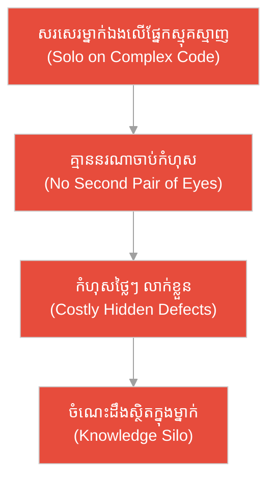
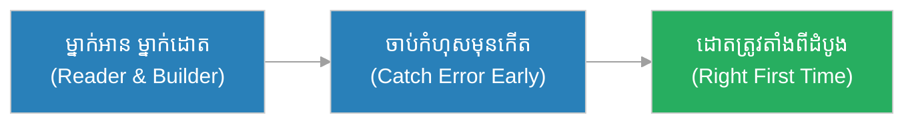
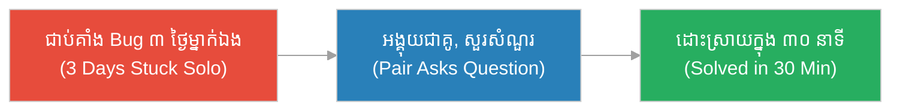
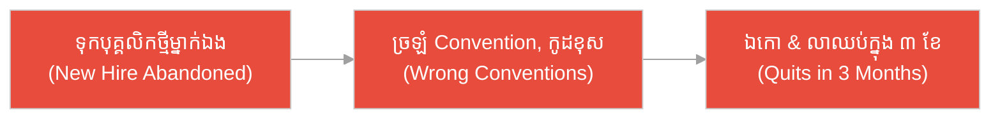
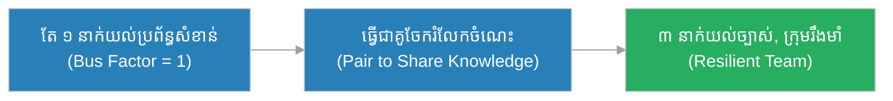
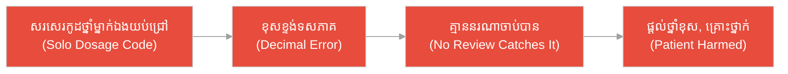
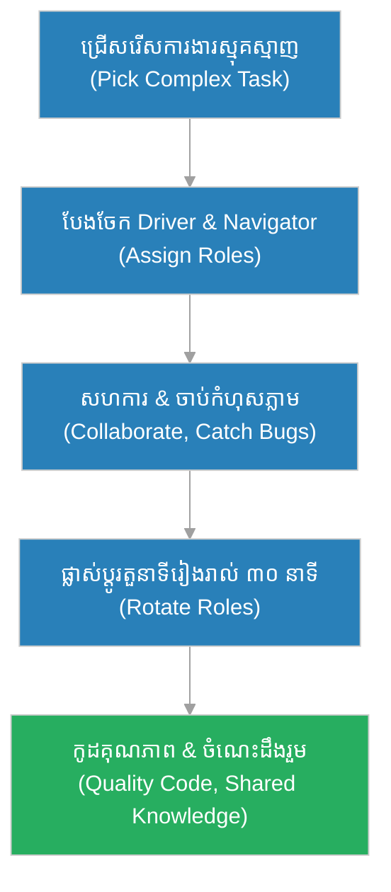

# ការសរសេរកូដជាគូ (Pair Programming)៖ ជា​ងឆ្លាក់ឈើ​ពី​រនាក់នៅតុ​តែ​មួយ (The Two Woodcarvers at One Bench)

**អ្នកនិពន្ធ (Author):** ichamrong 
**កាលបរិច្ឆេទ (Date):** 2026-05-29 
**ស្លាក (Tags):** #agile #scrum #pair-programming #parable 
**ប្រភេទ (Category):** Management & Leadership 
**រយៈពេលអាន (Read Time):** ~១២ នាទី (~12 min) 

---

## 📌 មាតិកា (Table of Contents)
- [អន្ទាក់​នៃ​ការសរសេរកូដជាគូ (The Pair Programming Trap)](#0)
- [១. រឿងប្រៀបប្រដូច៖ ជា​ងឆ្លាក់ឈើ​ពី​រនាក់ និង​ជា​ងម្នាក់ឯង​ដែល​ហត់នឿយ (The Parable: Two Carvers & The Lone Tired Carver)](#1)
- [២. បញ្ហា៖ ការ​យល់ច្រឡំថា​ការ​សរសេរ​ជា​គូ ជា​ការ​ខ្ជះខ្​ជា​យធនធាន (The Issue: Mistaking Pairing for Wasted Effort)](#2)
- [៣. ឧទាហរណ៍​ជាក់ស្តែង​ក្នុង​ពិភពពិត (Real World Examples)](#3)
 - [ឧទាហរណ៍​ទី ១ — កម្រិតស្រាល (គ្រួសារ)៖ ការ​ដោតគ្រឿងសង្ហារិម​ដោយ​ដៃ​ពី​រនាក់ (The Two-Person Assembly)](#3-1)
 - [ឧទាហរណ៍​ទី ២ — កម្រិតមធ្យម (បច្ចេកទេស)៖ ការ​ដោះស្រាយ Bug ស្មុគស្មាញ​ជា​គូ (The Tricky Bug Pair)](#3-2)
 - [ឧទាហរណ៍​ទី ៣ — កម្រិតមធ្យម (ធុរកិច្ច)៖ បុគ្គលិក​ថ្មី​ដែល​គ្មាន​នរណាបង្រៀន (The Abandoned New Hire)](#3-3)
 - [ឧទាហរណ៍​ទី ៤ — កម្រិតមធ្យម (គ្រប់​គ្រង)៖ ការ​ចែករំលែកចំណេះដឹង​លើ​ផ្នែកសំខាន់ (The Bus-Factor Fix)](#3-4)
 - [ឧទាហរណ៍​ទី ៥ — កម្រិតធ្ងន់ (ផ្នែកវេជ្ជសាស្ត្រ)៖ កូដ​គ្រប់​គ្រងថ្នាំ​ដែល​គ្មាន​នរណា​ត្រួតពិនិត្យ (The Unreviewed Dosage Code)](#3-5)
- [៤. ការ​សន្ទនាបែបសាកសួរ (Socratic Dialogue: Double Cost vs. Fewer Defects)](#4)
- [៥. ដំណោះស្រាយ៖ ការអនុវត្ត​ការសរសេរកូដជាគូ​ឱ្យ​មាន​ប្រសិទ្ធភាព (The Solution: Effective Pairing)](#5)
- [សេចក្តីសន្និដ្ឋាន (Conclusion)](#6)
- [ឯកសារយោង (References)](#7)
- [Related Posts](#8)

---

## អន្ទាក់​នៃ​ការសរសេរកូដជាគូ (The Pair Programming Trap)

នៅ​ពេល​និយាយអំ​ពី​ការសរសេរកូដជាគូ យើង​តែ​ង​តែ​ជួបប្រទះនូវភាពផ្ទុយគ្នា​ពី​របែប៖

* **អន្ទាក់​ខ្ជះខ្​ជា​យ (The Wasted-Effort Trap):** «ការ​សរសេរ​ជា​គូ គឺ​មនុស្ស​ពី​រនាក់​ធ្វើ​ការ​ងារ​របស់​មនុស្សម្នាក់ — ខ្ជះខ្​ជា​យម៉ោងពាក់កណ្តាល! ឱ្យគេ​ធ្វើ​រៀង ៗ ខ្លួន​ទៅ ល្អ​ជា​ង!»
* **អន្ទាក់​ផ្គូផ្គង​គ្រប់​ពេល (The Always-Pair Trap):** «រាល់​បន្ទាត់​កូដ ត្រូវ​សរសេរ​ជា​គូ​ជា​និច្ច ទោះ​ការ​ងារតូច ៗ ឬ​សាមញ្ញ​យ៉ាង​ណាក៏​ដោយ!»

---

## ១. រឿងប្រៀបប្រដូច៖ ជា​ងឆ្លាក់ឈើ​ពី​រនាក់ និង​ជា​ងម្នាក់ឯង​ដែល​ហត់នឿយ (The Parable: Two Carvers & The Lone Tired Carver)

នៅសិប្បកម្មឆ្លាក់ឈើមួយ មាន​ជា​ង​ពី​រនាក់អង្គុយនៅតុ​ការ​ងារ​តែ​មួយ។ ជា​ងម្នាក់ឈ្មោះ **រិទ្ធី (Rithy)** កាន់ដែកឆ្លាក់ ហើយ​ជា​ងម្នាក់ទៀតមើលឃ្លាំងមើលរោងឈើ (Grain) និង​ស្រែកប្រាប់ភ្លាម ៗ មុន​ពេល​ដែកឆ្លាក់ឆ្លងផ្លូវខុស៖ «ឈប់! រន្ធនៅខាងស្តាំនឹងបាក់ ប្រសិនបើឯងឆ្លាក់ជ្រៅ​ជា​ង​នេះ!» ដោយ​មាន​ភ្នែក​ពី​រគូ កំហុស​ត្រូវ​ចាប់​បាន​មុន​ពេល​វាកើតឡើង។ បន្ទះឈើ​ដែល​ខូច​មាន​កម្រិតតិចបំផុត ហើយ​ជា​ងស្ទាត់​បាន​បង្រៀន​ជា​ង​ថ្មី​ឱ្យមើលឃើញ «រោងឈើ» ដូចគាត់ដែរ។

ផ្ទុយ​ទៅ​វិញ មាន​ជា​ងម្នាក់ឯងម្នាក់ ដែល​ហត់នឿយ និង​ធ្វើ​ការ​តែ​ម្នាក់ឯង​គ្មាន​នរណាមើល។ នៅ​ពេល​ដែល​គាត់ឆ្លាក់បន្ទះឈើថ្លៃមួយ គាត់​មិន​បាន​កត់សម្គាល់ថា គាត់កំពុងឆ្លាក់ច្រាសរោងឈើ។ ដោយ​គ្មាន​នរណាស្រែកព្រ​មាន គាត់​បាន​ឆ្លាក់បន្តរហូតបន្ទះឈើថ្លៃ​នោះ​បាក់​ជា​ពី​រ។ គ្មាន​នរណាដឹងទាល់​តែ​វាដល់ដៃអតិថិជន — ដែល​ពេល​នោះ​វា​យឺត​ពេល​ជួសជុលហើយ។ ជា​ងទាំង​ពី​រក្រុម​មាន​ជំនាញដូចគ្នា — តែ​ក្រុមមួយ​មាន​ភ្នែក​ពី​រគូ​ការ​ពារ ឯម្នាក់ទៀត​ធ្វើ​ការ​តែ​ម្នាក់ឯង​គ្មាន​នរណាមើល។

---

## ២. បញ្ហា៖ ការ​យល់ច្រឡំថា​ការ​សរសេរ​ជា​គូ ជា​ការ​ខ្ជះខ្​ជា​យធនធាន (The Issue: Mistaking Pairing for Wasted Effort)

**ការសរសេរកូដជាគូ (Pair Programming)** គឺជា​ការអនុវត្ត​ដែល​អ្នក​អភិវឌ្ឍ​ន៍​ពី​រនាក់​ធ្វើ​ការ​នៅ​កុំ​ព្យូទ័រ​តែ​មួយ៖ ម្នាក់​ជា **អ្នក​បើកបរ (Driver)** ដែល​វាយ​កូដ និង​ម្នាក់​ជា **អ្នក​មើល (Navigator)** ដែល​គិត​ពី​ទិសដៅ និង​ចាប់កំហុសភ្លាម ៗ ។ ពួកគេផ្លាស់ប្តូរតួនាទីគ្នា​ជា​ប្រចាំ។

ការ​យល់ច្រឡំធំបំផុត​គឺ គិតថា «ការ​សរសេរ​ជា​គូ គឺ​មនុស្ស​ពី​រនាក់​ធ្វើ​ការ​ងារ​របស់​ម្នាក់ = ខ្ជះខ្​ជា​យធនធាន»។ ការ​ពិត វា​ជា​ការ​ដោះដូរ៖ ចំណាយម៉ោងបន្ថែម​រយៈពេល​ខ្លី ដើម្បី​បាន​កំហុសតិច (Fewer Defects) ការ​ចែករំលែកចំណេះដឹង (Shared Knowledge) និង​ការ​បង្ហាត់បុគ្គលិក​ថ្មី​បាន​លឿន (Faster Onboarding)។ បញ្ហា​ពិត​គឺ ការ​សរសេរ​កូដ​តែ​ម្នាក់ឯង​លើ​ផ្នែកស្មុគស្មាញ និង​សំខាន់ ដោយ​គ្មាន​នរណាមើល — ដែល​នាំ​ទៅ​រកកំហុសថ្លៃ ៗ ដែល​រកឃើញ​យឺត​ពេល។

---

## ៣. ឧទាហរណ៍​ជាក់ស្តែង​ក្នុង​ពិភពពិត

សូមពិនិត្យមើលរបៀប​ដែល​ការ​សរសេរ​ជា​គូ ជះឥទ្ធិពលដល់កម្រិតជីវិត និង​ការ​ងារទាំង ៥ ខាងក្រោម៖

---

### ឧទាហរណ៍​ទី ១ — កម្រិតស្រាល (គ្រួសារ)៖ ការ​ដោតគ្រឿងសង្ហារិម​ដោយ​ដៃ​ពី​រនាក់ (The Two-Person Assembly)

* **ស្ថានភាព៖** ប្តីប្រពន្ធដោតទូឈើ​ថ្មី​ពី​ប្រអប់។ ម្នាក់​អាន​សៀវភៅណែនាំ និង​កាន់គ្រឿង ឯម្នាក់ទៀតវីសភ្​ជា​ប់។ អ្នក​អាន​បាន​កត់សម្គាល់ភ្លាមថា «ផ្ទាំង​នេះ​ត្រឡប់ខាង​ក្រោយ!» មុន​ពេល​វីសភ្​ជា​ប់ខុស។
* **លទ្ធផល៖** ពួកគេដោតទូ​បាន​ត្រឹម​ត្រូវ​តាំង​ពី​ដំបូង ដោយ​មិន​បាច់ស្រាយវីសចេញ​ធ្វើ​ឡើងវិញ។ ភ្នែក​ពី​រគូ ការ​ពារកំហុស​មុន​ពេល​វាកើតឡើង។

---

### ឧទាហរណ៍​ទី ២ — កម្រិតមធ្យម (បច្ចេកទេស)៖ ការ​ដោះស្រាយ Bug ស្មុគស្មាញ​ជា​គូ (The Tricky Bug Pair)

* **ស្ថានភាព៖** អ្នក​អភិវឌ្ឍ​ន៍ម្នាក់​ជា​ប់គាំង​លើ Bug ស្មុគស្មាញ​រយៈពេល ៣ ថ្ងៃ។ ប្រធានក្រុមឱ្យ​សហការ​ីម្នាក់ទៀត​មក​អង្គុយ​ជា​គូ។ អ្នក​មើល (Navigator) បាន​សួរថា «តើ​ឯង​ពិត​ជា​ប្រាកដថា Variable នេះ​មិន null ឬ?» — ភ្លាម​នោះ ប្រភព​នៃ Bug ត្រូវ​រកឃើញ។
* **លទ្ធផល៖** Bug ដែល​ជា​ប់គាំង ៣ ថ្ងៃ ត្រូវ​ដោះស្រាយ​ក្នុង ៣០ នាទី​ពេល​ធ្វើ​ជា​គូ។ ការ​ដោះដូរម៉ោងបន្ថែម គឺ​មាន​តម្លៃ​ខ្លាំងណាស់។

---

### ឧទាហរណ៍​ទី ៣ — កម្រិតមធ្យម (ធុរកិច្ច)៖ បុគ្គលិក​ថ្មី​ដែល​គ្មាន​នរណាបង្រៀន (The Abandoned New Hire)

* **ស្ថានភាព៖** ក្រុមហ៊ុនមួយជួល​អ្នក​អភិវឌ្ឍ​ន៍​ថ្មី ប៉ុន្តែ​ទុកគាត់ឱ្យ​អាន​ឯកសារ​តែ​ម្នាក់ឯង​រយៈពេល ១ ខែ ដោយ​គ្មាន​នរណា​ធ្វើ​ជា​គូ​បង្ហាញ។ បុគ្គលិក​ថ្មី​ច្រឡំ Convention របស់ Codebase និង​សរសេរ​កូដ​ខុសស្ទីល​ជា​ច្រើន។
* **លទ្ធផល៖** ការ Review កូដ​ចំណាយ​ពេល​ច្រើន គាត់​មាន​អារម្មណ៍ឯកោ និង​សម្រេចចិត្តលាឈប់​ក្នុង ៣ ខែ។ ការ​ខ្វះ​ការ​ផ្គូផ្គងបង្ហាត់ បណ្តាលឱ្យខាតបង់ទាំង​ពេល​វេលា និង​បុគ្គលិក។

---

### ឧទាហរណ៍​ទី ៤ — កម្រិតមធ្យម (គ្រប់​គ្រង)៖ ការ​ចែករំលែកចំណេះដឹង​លើ​ផ្នែកសំខាន់ (The Bus-Factor Fix)

* **ស្ថានភាព៖** អ្នក​គ្រប់​គ្រងកត់សម្គាល់ថា មាន​តែ​វិស្វករម្នាក់គត់​ដែល​យល់​ពី​ប្រព័ន្ធ​ទូទាត់ប្រាក់ដ៏សំខាន់ (Bus Factor = 1)។ ប្រសិនបើគាត់ឈឺ ឬ​លាឈប់ ក្រុមនឹង​ជា​ប់គាំង។ គាត់រៀបចំឱ្យវិស្វករ​នោះ​ធ្វើ​ជា​គូ​ជា​មួយ​សហការ​ី ២ នាក់ផ្សេងទៀត​ជា​ប្រចាំ។
* **លទ្ធផល៖** ក្នុង ១ ខែ មាន​វិស្វករ ៣ នាក់យល់ច្បាស់​ពី​ប្រព័ន្ធ​ទូទាត់។ ហានិភ័យ​នៃ​ការ​ពឹងផ្អែក​លើ​មនុស្ស​តែ​ម្នាក់​ត្រូវ​លុបបំបាត់ ហើយក្រុ​មក​ាន់​តែ​រឹងមាំ។

---

### ឧទាហរណ៍​ទី ៥ — កម្រិតធ្ងន់ (ផ្នែកវេជ្ជសាស្ត្រ)៖ កូដ​គ្រប់​គ្រងថ្នាំ​ដែល​គ្មាន​នរណា​ត្រួតពិនិត្យ (The Unreviewed Dosage Code)

* **ស្ថានភាព៖** វិស្វករម្នាក់ហត់នឿយ សរសេរ​កូដ​គណនាកម្រិតថ្នាំ (Drug Dosage) សម្រាប់​ម៉ាស៊ីនវេជ្ជសាស្ត្រ តែ​ម្នាក់ឯងនៅយប់ជ្រៅ ដោយ​គ្មាន​នរណា​ធ្វើ​ជា​គូ ឬ Review។ គាត់ដាក់ខ្ទង់ទសភាគខុសមួយកន្លែង (10.0 ក្លាយ​ជា 100)។
* **លទ្ធផល៖** កំហុស​នោះ​មិន​ត្រូវ​បាន​ចាប់ បណ្តាលឱ្យម៉ាស៊ីនផ្តល់កម្រិតថ្នាំខុស ដែល​បង្កគ្រោះថ្នាក់ដល់​អ្នក​ជំងឺ។ ការ​សរសេរ​ផ្នែកសំខាន់ដ៏ស្លាប់រស់ ដោយ​គ្មាន​ភ្នែកទី​ពី​រ គឺជា​គ្រោះថ្នាក់ដ៏ធំ។

---

## ៤. ការ​សន្ទនាបែបសាកសួរ (Socratic Dialogue: Double Cost vs. Fewer Defects)

**សិស្ស (អ្នក​អភិវឌ្ឍ​ន៍)៖** លោកគ្រូ! ប្រធានឱ្យយើង​សរសេរ​កូដ​ជា​គូ ប៉ុន្តែ​ខ្ញុំគិតថា វា​គឺ​មនុស្ស​ពី​រនាក់​ធ្វើ​ការ​ងារ​របស់​ម្នាក់ — ខ្ជះខ្​ជា​យម៉ោងពាក់កណ្តាល មែនទេ?

**គ្រូ (វិស្វករ​ជា​ន់ខ្ពស់)៖** សួរវិញ៖ ប្រសិនបើ​ជា​ងឆ្លាក់ឈើម្នាក់ឆ្លាក់បន្ទះឈើថ្លៃ តើ​ល្អ​ជា​ងបើ​មាន​ជា​ងម្នាក់ទៀតមើល និង​ស្រែកព្រ​មាន​មុន​ពេល​ដែកឆ្លាក់ឆ្លងផ្លូវ ឬ​ឱ្យគាត់ឆ្លាក់​តែ​ម្នាក់ឯងហើយប្រថុយបាក់បន្ទះថ្លៃ​នោះ?

**សិស្ស៖** ច្បាស់ណាស់ ល្អ​ជា​ងបើ​មាន​ម្នាក់មើល ដើម្បី​កុំ​ឱ្យបាក់បន្ទះថ្លៃ។

**គ្រូ៖** ត្រឹម​ត្រូវ! ឥឡូវ គិតមើល៖ ប្រសិនបើកំហុសមួយឆ្លងចូល Production ហើយ​ត្រូវ​ដោះស្រាយ Bug ពេល​យប់ តើ​វាខ្ជះខ្​ជា​យម៉ោងប៉ុន្​មាន?

**សិស្ស៖** ច្រើនណាស់លោកគ្រូ — ពេល​ខ្លះមួយថ្ងៃពេញ និង​ធ្វើ​ឱ្យអតិថិជនខឹង។

**គ្រូ៖** ដូច្​នេះ ការ​ចំណាយម៉ោងបន្ថែមបន្តិច​ពេល​សរសេរ ដើម្បី​ចាប់កំហុសភ្លាម ៗ — តើ​នោះ​ជា «ការ​ខ្ជះខ្​ជា​យ» ឬ «ការ​វិនិយោគ»? ហើយ កុំ​ភ្លេច៖ ពេល​ធ្វើ​ជា​គូ ជា​ង​ថ្មី​រៀន​ពី​ជា​ងស្ទាត់ ហើយចំណេះដឹងលែងស្ថិត​ក្នុង​ក្បាលមនុស្ស​តែ​ម្នាក់។

**សិស្ស៖** គឺជា​ការ​វិនិយោគលោកគ្រូ — បាន​កំហុសតិច បាន​បង្រៀនបុគ្គលិក​ថ្មី និង​បាន​ចែករំលែកចំណេះដឹង។

**គ្រូ៖** ត្រឹម​ត្រូវ​ហើយ! ប៉ុន្តែ​កុំ​ផ្គូផ្គង​គ្រប់​ពេល​ដោយ​ងងឹតងងុល។ ការ​ងារ​សាមញ្ញ ឬ Routine មិន​ចាំបាច់ផ្គូផ្គង​ឡើយ។ ផ្គូផ្គង​លើ​ផ្នែកស្មុគស្មាញ សំខាន់ ឬ​ពេល​បង្ហាត់បុគ្គលិក​ថ្មី — នោះ​ជា​កន្លែង​ដែល​ការ​ដោះដូរ​នេះ​មាន​តម្លៃខ្ពស់បំផុត។

---

## ៥. ដំណោះស្រាយ៖ ការអនុវត្ត​ការសរសេរកូដជាគូ​ឱ្យ​មាន​ប្រសិទ្ធភាព (The Solution: Effective Pairing)

ដើម្បី​ឱ្យ​ការសរសេរកូដជាគូ​ផ្តល់តម្លៃខ្ពស់បំផុត ក្រុ​មក​ារងារ​ត្រូវ​អនុវត្តគោល​ការ​ណ៍ **Driver-Navigator-Rotate**៖

1. **បែងចែកតួនាទីច្បាស់លាស់ (Clear Roles):** ម្នាក់​ជា Driver (វាយ​កូដ ផ្តោត​លើ​ជំហានបច្ចុប្បន្ន) និង​ម្នាក់​ជា Navigator (គិត​ពី​ទិសដៅ ចាប់កំហុស និង​សួរសំណួរ)។
2. **ផ្លាស់ប្តូរតួនាទី​ជា​ប្រចាំ (Rotate Often):** ប្តូរ Driver/Navigator រាល់ ១៥-៣០ នាទី ដើម្បី​រក្សា​ការ​ផ្តោតអារម្មណ៍ និង​ការ​ចូលរួម​របស់​ទាំង​ពី​រនាក់។
3. **ជ្រើសរើស​ការ​ងារឱ្យ​បាន​ត្រឹម​ត្រូវ (Pair on the Right Work):** ផ្គូផ្គង​លើ​ផ្នែកស្មុគស្មាញ សំខាន់ ឬ​ពេល​បង្ហាត់បុគ្គលិក​ថ្មី។ ការ​ងារ​សាមញ្ញ ឬ Routine មិន​ចាំបាច់ផ្គូផ្គង​ឡើយ។
4. **គោរព និង​ស្តាប់គ្នា​ទៅ​វិញ​ទៅ​មក (Respect & Listen):** Navigator មិន​ត្រូវ​រិះគន់ ឬ​កាន់កាប់ Keyboard ដោយ​បង្ខំ។ ការ​ផ្គូផ្គង​ល្អ គឺជា​ការ​សហការ មិន​មែន​ការ​គ្រប់​គ្រង។
5. **សម្រាក ដើម្បី​ជៀសវាង​ការ​ហត់នឿយ (Take Breaks):** ការ​ផ្គូផ្គងប្រើថាមពល​ផ្លូវចិត្ត​ច្រើន។ សម្រាក​ជា​ប្រចាំ ដើម្បី​រក្សា​គុណភាព និង​ថាមពល។

---

## 🐇 ធ្លាក់ចូល​ក្នុង​រន្ធទន្សាយ (Enter the Rabbit Hole)

ដើម្បី​យល់ដឹងកាន់​តែ​ស៊ីជម្រៅអំ​ពី​ការ​សហការ និង​គុណភាព​កូដ សូមស្វែងយល់បន្ថែម៖

* 🚀 **[ការ​សរសេរ​កូដ​បែបឯកោឥតវិន័យ (Cowboy Coding) ➔](./cowboy-coding.md)**
* 🚀 **[ក្រុមអភិវឌ្ឍន៍ (Development Team) ➔](../roles/development-team.md)**
* 🚀 **[និយមន័យនៃភាពរួចរាល់ (Definition of Done) ➔](../artifacts/dod.md)**

---

## សេចក្តីសន្និដ្ឋាន (Conclusion)

> **«ការសរសេរកូដជាគូ មិន​មែន​ជា​មនុស្ស​ពី​រនាក់​ធ្វើ​ការ​ងារ​របស់​ម្នាក់​ឡើយ — វា​ជា​ភ្នែក​ពី​រគូ​ដែល​ការ​ពារកំហុស​មុន​ពេល​វាក្លាយ​ជា​មហន្តរាយ និង​ជា​ការ​បង្រៀនដ៏​ល្អ​បំផុត។»**

ដូចជា​ងឆ្លាក់ឈើ​ពី​រនាក់នៅតុ​តែ​មួយ ការសរសេរកូដជាគូ ដោះដូរម៉ោងបន្ថែម​រយៈពេល​ខ្លី ដើម្បី​បាន​កំហុសតិច ការ​ចែករំលែកចំណេះដឹង និង​ការ​បង្ហាត់បុគ្គលិក​ថ្មី​បាន​លឿន។ ការ​សរសេរ​ផ្នែកសំខាន់ ៗ តែ​ម្នាក់ឯង ដោយ​គ្មាន​ភ្នែកទី​ពី​រ គឺ​ដូចជា​ងម្នាក់ឯង​ដែល​ហត់នឿយ ដែល​ឆ្លាក់ច្រាសរោងឈើ រហូតបាក់បន្ទះថ្លៃ ដោយ​គ្មាន​នរណាស្រែកព្រ​មាន។

---

## ឯកសារយោង (References)

* **Kent Beck** — *Extreme Programming Explained: Embrace Change* (2nd Edition, 2004).
* **Laurie Williams & Robert Kessler** — *Pair Programming Illuminated* (2002).
* **Andrew Hunt & David Thomas** — *The Pragmatic Programmer* (1999).

---

## Related Posts

* [ការ​សរសេរ​កូដ​បែបឯកោឥតវិន័យ (Cowboy Coding)](./cowboy-coding.md) — ផ្ទុយ​ពី​ការ​ផ្គូផ្គង គឺ​ការ​សរសេរ​ម្នាក់ឯង​គ្មាន​វិន័យ ដែល​នាំ​ទៅ​រកកំហុស។
* [ក្រុមអភិវឌ្ឍន៍ (Development Team)](../roles/development-team.md) — របៀប​ដែល​ការ​ផ្គូផ្គងពង្រឹងភាពរឹងមាំ និង​ចំណេះដឹងរួម​របស់​ក្រុម។
