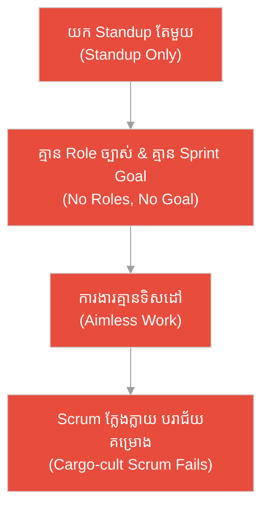
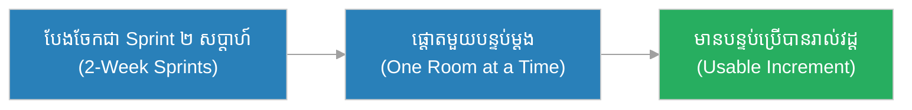
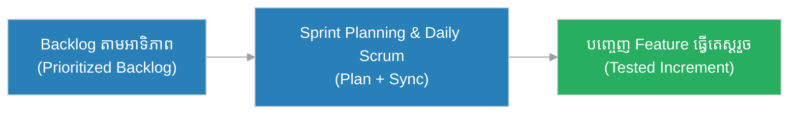
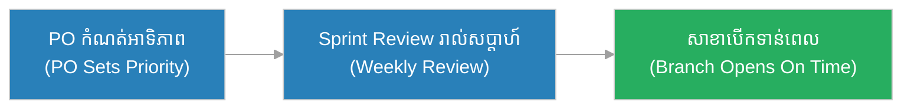
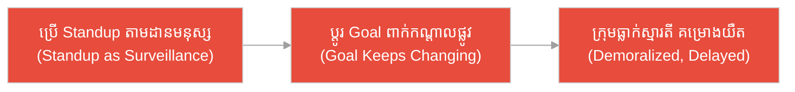
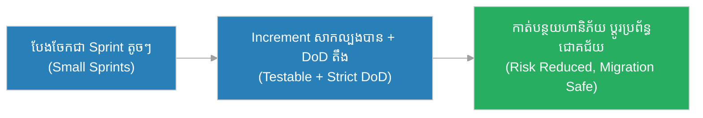
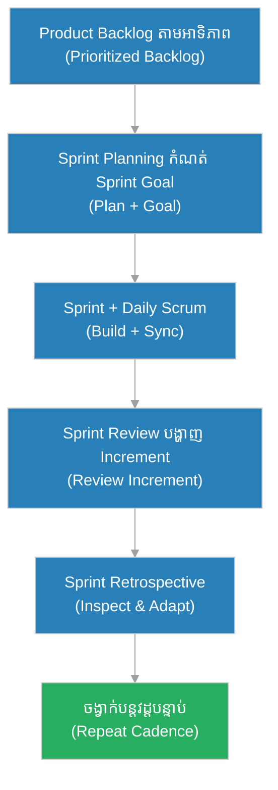

# ក្របខ័ណ្ឌ Scrum (Scrum)៖ ក្រុមអុំទូកប្រណាំង និង​សំឡេង​តែ​មួយ​នៃ Coxswain (The Rowing Eight & The Single Voice of the Coxswain)

**អ្នកនិពន្ធ (Author):** ichamrong 
**កាលបរិច្ឆេទ (Date):** 2026-05-29 
**ស្លាក (Tags):** #agile #scrum #framework #parable 
**ប្រភេទ (Category):** Management & Leadership 
**រយៈពេលអាន (Read Time):** ~១២ នាទី (~12 min) 

---

## 📌 មាតិកា (Table of Contents)
- [អន្ទាក់​ការ​យល់ច្រឡំ (The Misconception Trap)](#0)
- [១. រឿងប្រៀបប្រដូច៖ ក្រុមអុំទូកប្រណាំង និង​សំឡេង Coxswain (The Parable: The Rowing Eight & The Coxswain)](#1)
- [២. បញ្ហា៖ ការ​ច្រឡំថា Scrum គ្រាន់​តែ​ជា Standup (The Issue: Scrum Is Not Just Standups)](#2)
- [៣. ឧទាហរណ៍​ជាក់ស្តែង​ក្នុង​ពិភពពិត (Real World Examples)](#3)
 - [ឧទាហរណ៍​ទី ១ — កម្រិតស្រាល (គ្រួសារ)៖ ការ​សាងសង់ផ្ទះល្វែង​តាម​វដ្ត (The Home Renovation Sprints)](#3-1)
 - [ឧទាហរណ៍​ទី ២ — កម្រិតមធ្យម (បច្ចេកទេស)៖ ក្រុមអភិវឌ្ឍន៍​កម្មវិធី​ទូរស័ព្ទ (The Mobile App Squad)](#3-2)
 - [ឧទាហរណ៍​ទី ៣ — កម្រិតមធ្យម (ធុរកិច្ច)៖ ការ​បើកសាខាហាងកាហ្វេ​ថ្មី (The Café Branch Launch)](#3-3)
 - [ឧទាហរណ៍​ទី ៤ — កម្រិតមធ្យម (គ្រប់​គ្រង)៖ ការ​ប្តូរ Scrum ទៅ​ជា​ការ​តាមដាន​ចៅហ្វាយ (The Fake Scrum)](#3-4)
 - [ឧទាហរណ៍​ទី ៥ — កម្រិតធ្ងន់ (សង្គ្រោះបន្ទាន់)៖ ប្រព័ន្ធ​ធនាគារ Core Banking (The Core Banking Migration)](#3-5)
- [៤. ការ​សន្ទនាបែបសាកសួរ (Socratic Dialogue: Standups vs. The Whole Framework)](#4)
- [៥. ដំណោះស្រាយ៖ ការអនុវត្ត Scrum ឱ្យពេញលេញ (The Solution: Running Scrum Properly)](#5)
- [សេចក្តីសន្និដ្ឋាន (Conclusion)](#6)
- [ឯកសារយោង (References)](#7)
- [Related Posts](#8)

---

## អន្ទាក់​ការ​យល់ច្រឡំ (The Misconception Trap)

នៅ​ពេល​និយាយអំ​ពី Scrum យើង​តែ​ង​តែ​ជួបនូវ​ការ​យល់ច្រឡំផ្ទុយគ្នា​ពី​រ៖

* **អន្ទាក់ Standup សុទ្ធ (The Standup-Only Trap):** «យើង​ធ្វើ Daily Standup រាល់ព្រឹក ដូច្​នេះ​យើង​ធ្វើ Scrum ហើយ! Scrum ក៏ស្មើនឹង Agile ដែរ មិន​បាច់រៀនអ្វីបន្ថែមទេ!»
* **អន្ទាក់​ច្បាប់ហួសហេតុ (The Heavy-Process Trap):** «Scrum ត្រូវ​ការ​ឯកសាររាប់រយ​ទំព័រ ការប្រជុំ ៥ ម៉ោង​ក្នុង​មួយថ្ងៃ និង​នីតិវិធីស្មុគស្មាញ​គ្រប់​យ៉ាង ទើបឱ្យឈ្មោះថា Scrum ត្រឹម​ត្រូវ!»

---

## ១. រឿងប្រៀបប្រដូច៖ ក្រុមអុំទូកប្រណាំង និង​សំឡេង Coxswain (The Parable: The Rowing Eight & The Coxswain)

នៅ​លើ​ទន្លេដ៏ធំមួយ មាន​ក្រុមអុំទូកប្រណាំងមួយក្រុម​ដែល​មាន​អ្នក​អុំ ៨ នាក់ និង​អ្នក​ដឹកនាំ​សំឡេងម្នាក់ឈ្មោះ **ដារា (Dara)** ដែល​អង្គុយនៅខាង​ក្រោយ​ទូក។ ដារា​មិន​បាន​ចាប់ចែវ​ឡើយ ប៉ុន្តែ​គាត់ស្រែកប្រាប់ល្បឿនចែវ (cadence) ដ៏ច្បាស់លាស់ និង​ម៉ឺងម៉ាត់៖ «មួយ... ពី​រ... មួយ... ពី​រ...»។ អ្នក​អុំទាំង ៨ ស្តាប់សំឡេង​តែ​មួយ ហើយចែវស្របគ្នា​ជា​ចង្វាក់ដ​ដែល ៗ ។ ម្​ចាស់​ក្រុមម្នាក់ទៀតឈរនៅច្រាំងកំណត់ផ្លូវ (course) ឱ្យទូកដើរ​ទៅ​ណា។ រាល់​ចែវមួយ អ្នក​អុំ​ទាំងអស់​ប្តូរទិសព្រមគ្នា​ក្នុង​ពេល​ដ៏ខ្លី ហើយ​ក្នុង​ចង្វាក់ថេរ (fixed rhythm) ទូក​របស់​ដារា​បាន​បោះជំហានឆ្ពោះ​ទៅ​មុខ​យ៉ាង​រលូន ឈ្នះ​ការ​ប្រណាំង។

ផ្ទុយ​ទៅ​វិញ មាន​ទូកមួយទៀត​ដែល​អ្នក​អុំម្នាក់ ៗ គិតថា «ខ្ញុំ​ខ្លាំង ខ្ញុំចេះអុំ» ដូច្​នេះ​ម្នាក់ ៗ ចែវ​តាម​ចង្វាក់ផ្ទាល់ខ្លួន។ គ្មាន Coxswain ឱ្យសំឡេង​តែ​មួយ គ្មាន​នរណាកំណត់ផ្លូវ។ ចែវខាងឆ្វេង​លឿន ចែវខាងស្តាំ​យឺត ទូកក៏វិល​ជា​រង្វង់នៅកណ្តាលទន្លេ ទោះបី​ជា​គ្រប់​គ្នាខំចែវអស់កម្លាំងក៏​ដោយ។ កម្លាំងពូ​កែ​ម្នាក់ ៗ បើ​គ្មាន​ចង្វាក់រួម គ្មាន​សំឡេង​តែ​មួយ និង​គ្មាន​ទិសដៅ ក៏គ្រាន់​តែ​បង្វិលទូកនៅនឹងកន្លែង​តែ​ប៉ុណ្ណោះ។

---

## ២. បញ្ហា៖ ការ​ច្រឡំថា Scrum គ្រាន់​តែ​ជា Standup (The Issue: Scrum Is Not Just Standups)

**Scrum** គឺជា **ក្របខ័ណ្ឌស្រាល (lightweight framework)** មួយ​នៅក្នុង Agile ដែល​ជួយឱ្យក្រុ​មក​ារងារផ្តល់តម្លៃ​ជា​បន្តបន្ទាប់​តាមរយៈ វដ្ត​ការ​ងារខ្លី (Sprints)។ វា​មាន **តួនាទីបី (3 Roles)** គឺ Product Owner, Scrum Master, និង Developers; **ព្រឹត្តិ​ការ​ណ៍ប្រាំ (5 Events)** គឺ Sprint, Sprint Planning, Daily Scrum, Sprint Review, Sprint Retrospective; និង **សិប្បផល (Artifacts)** គឺ Product Backlog, Sprint Backlog, Increment។

ការ​ច្រឡំធំបំផុត​គឺ៖ «Scrum = Standup» ឬ «Scrum = Agile»។ នេះ​មិន​ត្រឹម​ត្រូវ​ឡើយ។ Agile គឺជា **ទស្សនវិជ្​ជា (philosophy/mindset)** ដ៏ធំ ឯ Scrum គ្រាន់​តែ​ជា **ក្របខ័ណ្ឌ​ជា​ក់លាក់មួយ** ក្នុង​ចំណោមជម្រើស​ជា​ច្រើន (ដូចជា Kanban)។ ប្រសិនបើក្រុមយក​តែ Standup មក​ធ្វើ ប៉ុន្តែ​បោះបង់ Product Owner ច្បាស់លាស់ ឬ​មិន​មាន Sprint Goal នោះ​វានឹងក្លាយ​ជា «Scrum ក្លែងក្លាយ (Cargo-cult Scrum)»។

---

## ៣. ឧទាហរណ៍​ជាក់ស្តែង​ក្នុង​ពិភពពិត

សូមពិនិត្យមើលរបៀប​ដែល​ក្របខ័ណ្ឌ Scrum ដ៏ពេញលេញ (មិន​មែនត្រឹម​តែ Standup) ជះឥទ្ធិពលដល់ស្ថានភាពទាំង ៥ ខាងក្រោម៖

---

### ឧទាហរណ៍​ទី ១ — កម្រិតស្រាល (គ្រួសារ)៖ ការ​សាងសង់ផ្ទះល្វែង​តាម​វដ្ត (The Home Renovation Sprints)

* **ស្ថានភាព៖** គ្រួសារមួយ​ចង់​ជួសជុលផ្ទះទាំងមូល។ ជំនួសឱ្យ​ការ​ព្យាយាម​ធ្វើ​គ្រប់​យ៉ាង​ព្រមគ្នា ពួកគេបែងចែក​ជា «វដ្ត ២ សប្តាហ៍» (Sprint)៖ វដ្តទី១ ផ្ទះបាយ វដ្តទី២ បន្ទប់ទឹក។ ម្តាយ​ដើរតួ Product Owner កំណត់អាទិភាព ឪពុក​ជា Scrum Master ដោះស្រាយឧបសគ្គ។
* **លទ្ធផល៖** រាល់ ២ សប្តាហ៍ គ្រួសារ​មាន​បន្ទប់​ដែល​ប្រើ​ការ​បាន​ពេញលេញ (Increment) ហើយអាច​កែប្រែ​ផែន​ការ​តាម​ថវិកា​ជាក់ស្តែង។

---

### ឧទាហរណ៍​ទី ២ — កម្រិតមធ្យម (បច្ចេកទេស)៖ ក្រុមអភិវឌ្ឍន៍​កម្មវិធី​ទូរស័ព្ទ (The Mobile App Squad)

* **ស្ថានភាព៖** ក្រុមអភិវឌ្ឍន៍​កម្មវិធី​ទូរស័ព្ទ ៦ នាក់ ប្រើ Scrum ពេញលេញ៖ Product Owner រៀបចំ Backlog តាម​អាទិភាព, Sprint Planning ជ្រើសរើស​ការ​ងារ, Daily Scrum តម្រង់ទិស, និង Sprint Review បង្ហាញ Increment ដល់​អ្នក​ប្រើ។
* **លទ្ធផល៖** រាល់​វដ្ត ២ សប្តាហ៍ ពួកគេ​បញ្ចេញ feature ដែល​ធ្វើ​តេស្តរួច ហើយ Retrospective ជួយឱ្យក្រុ​មក​ែលម្អដំណើរ​ការ​ជា​និច្ច។

---

### ឧទាហរណ៍​ទី ៣ — កម្រិតមធ្យម (ធុរកិច្ច)៖ ការ​បើកសាខាហាងកាហ្វេ​ថ្មី (The Café Branch Launch)

* **ស្ថានភាព៖** ម្​ចាស់​ហាងកាហ្វេ​ចង់​បើកសាខា​ថ្មី​ក្នុង ៨ សប្តាហ៍។ គាត់ប្រើ Scrum៖ Product Owner (ម្​ចាស់) កំណត់អាទិភាព (ម៉ាស៊ីនកាហ្វេ → គ្រឿងសង្ហារឹម → ការ​ផ្សព្វផ្សាយ) ហើយ Sprint Review រាល់​សប្តាហ៍​បង្ហាញ​វឌ្ឍនភាព​ពិត។
* **លទ្ធផល៖** សាខាបើកទាន់​ពេល ដោយសារ​អាទិភាពច្បាស់លាស់ និង​ការ​កែ​តម្រូវផែន​ការ​តាម​មតិអតិថិជន​ពិត​ក្នុង​ពេល​សាកល្បង។

---

### ឧទាហរណ៍​ទី ៤ — កម្រិតមធ្យម (គ្រប់​គ្រង)៖ ការ​ប្តូរ Scrum ទៅ​ជា​ការ​តាមដាន​ចៅហ្វាយ (The Fake Scrum)

* **ស្ថានភាព៖** អ្នក​គ្រប់​គ្រងម្នាក់ប្រកាសថា «យើង​ធ្វើ Scrum» ប៉ុន្តែ​គាត់ប្រើ Daily Scrum ដើម្បី​សួរថា «ឯង​ធ្វើ​បាន​ដល់ណាហើយ?» ដូចជា​ការ​តាមដាន ហើយផ្លាស់ប្តូរ Sprint Goal ពាក់កណ្តាលផ្លូវ​រាល់​ពេល។ គ្មាន Product Owner ច្បាស់លាស់។
* **លទ្ធផល៖** ក្រុ​មក​ារងារធ្លាក់ស្មារតី ការ​ផ្តោតអារម្មណ៍បែកខ្ញែក គម្រោង​យឺត​យ៉ាវ ព្រោះ Scrum ត្រូវ​បាន​កាត់ត្រឹម​តែ «ការប្រជុំ» ដោយ​បោះបង់គោល​ការ​ណ៍សំខាន់។

---

### ឧទាហរណ៍​ទី ៥ — កម្រិតធ្ងន់ (សង្គ្រោះបន្ទាន់)៖ ប្រព័ន្ធ​ធនាគារ Core Banking (The Core Banking Migration)

* **ស្ថានភាព៖** ធនាគារមួយ​ត្រូវ​ផ្លាស់ប្តូរ​ប្រព័ន្ធ Core Banking ដ៏ស្មុគស្មាញ​ដែល​ប៉ះពាល់ប្រាក់អតិថិជនរាប់លាននាក់។ ក្រុមប្រើ Scrum ពេញលេញ ដោយ​បែងចែក​ការ​ផ្លាស់ប្តូរ​ទៅ​ជា Sprint ដែល​មាន Increment អាចសាកល្បង​បាន និង Definition of Done តឹងរ៉ឹង។
* **លទ្ធផល៖** រាល់​វដ្ត ហានិភ័យ​ត្រូវ​បាន​កាត់បន្ថយ ដោយ​ការ​សាកល្បង​ពិត​លើ​ទិន្នន័យ​តូច មុន​ពេល​ដាក់ឱ្យដំណើរ​ការ​ពេញ ជៀសវាងគ្រោះមហន្តរាយផ្នែកហិរញ្ញវត្ថុ។

---

## ៤. ការ​សន្ទនាបែបសាកសួរ (Socratic Dialogue: Standups vs. The Whole Framework)

**សិស្ស (អ្នក​អភិវឌ្ឍ​ន៍)៖** លោកគ្រូ ក្រុមយើង​ធ្វើ Daily Standup រាល់ព្រឹក ដូច្​នេះ​យើង​ធ្វើ Scrum ត្រឹម​ត្រូវ​ហើយមែនទេ?

**គ្រូ (Agile Coach)៖** សួរវិញសិន៖ តើ​ក្រុមឯង​មាន Product Owner ដែល​កំណត់អាទិភាព Backlog ច្បាស់លាស់​ឬ​ទេ?

**សិស្ស៖** អត់ទេ... ចៅហ្វាយយើងប្រាប់​ការ​ងារផ្សេង ៗ គ្នា​គ្រប់​ពេល តាម​អ្វី​ដែល​គាត់នឹកឃើញ។

**គ្រូ៖** ចុះក្រុមឯង​មាន Sprint Goal ច្បាស់លាស់ ដែល​មិន​ផ្លាស់ប្តូរពាក់កណ្តាល Sprint ឬ​ទេ?

**សិស្ស៖** អត់ដែរ... ការ​ងារផ្លាស់ប្តូរ​រាល់ថ្ងៃ។

**គ្រូ៖** ដូច្​នេះ ឯងគ្រាន់​តែ​ឈរជុំគ្នាប្រាប់គ្នា​ពី​ការ​ងារ ប៉ុន្តែ​គ្មាន​ទិសដៅរួម គ្មាន Coxswain ឱ្យចង្វាក់​តែ​មួយ។ តើ​នេះ​ជា Scrum ឬ​គ្រាន់​តែ​ជា «ការប្រជុំ​ឈរ»?

**សិស្ស៖** ប្រហែលគ្រាន់​តែ​ជា​ការប្រជុំ... ដោយ​គ្មាន​ចង្វាក់ ឬ​ទិសដៅ។

**គ្រូ៖** ត្រឹម​ត្រូវ។ Scrum មិន​មែន​ជា «event មួយ» ឡើយ វា​ជា **ប្រព័ន្ធ​ដ៏សុក្រឹត** នៃ តួនាទី + ព្រឹត្តិ​ការ​ណ៍ + សិប្បផល ដែល​ធ្វើ​ការ​ជា​មួយគ្នា។ បើដកចេញ​តែ​មួយ — ដូចជា Product Owner ឬ Sprint Goal — ប្រព័ន្ធ​ទាំងមូលលែងដំណើរ​ការ ដូចទូកអុំ​ដែល​គ្មាន Coxswain។ Scrum ក៏​មិន​មែន​ជា Agile ទាំងស្រុងដែរ វាគ្រាន់​តែ​ជា **ក្របខ័ណ្ឌមួយ** ក្នុង​ចំណោមជម្រើស​ជា​ច្រើន​របស់ Agile។

---

## ៥. ដំណោះស្រាយ៖ ការអនុវត្ត Scrum ឱ្យពេញលេញ (The Solution: Running Scrum Properly)

ដើម្បី​ឱ្យ Scrum ដំណើរ​ការ​ពិតប្រាកដ ក្រុម​ត្រូវ​រក្សាសមាសភាគទាំងបី ឱ្យពេញលេញ៖

1. **តួនាទីបី (3 Accountabilities):** Product Owner (កំណត់តម្លៃ និង​អាទិភាព), Scrum Master (ការ​ពារដំណើរ​ការ និង​លុប​ឧបសគ្គ), Developers (បង្កើត Increment)។
2. **ព្រឹត្តិ​ការ​ណ៍ប្រាំ (5 Events):** Sprint (ស្រោប), Sprint Planning, Daily Scrum, Sprint Review, Sprint Retrospective — នីមួយ ៗ មាន Timebox ច្បាស់លាស់។
3. **សិប្បផលបី (3 Artifacts):** Product Backlog, Sprint Backlog, Increment — នីមួយ ៗ ភ្​ជា​ប់នឹង Commitment (Product Goal, Sprint Goal, Definition of Done)។
4. **ចង្វាក់ថេរ (Fixed Cadence):** រក្សា Sprint ឱ្យ​មាន​រយៈពេល​ថេរ ដើម្បី​បង្កើត​ចង្វាក់ និង​ភាពអាចព្យាករណ៍​បាន។
5. **Empiricism:** ត្រួតពិនិត្យ និង​សម្របខ្លួន (Inspect & Adapt) ជា​និច្ច ផ្អែក​លើ​ភស្តុតាង​ពិត មិន​មែន​ការ​ស្​មាន។

---

## 🐇 ធ្លាក់ចូល​ក្នុង​រន្ធទន្សាយ (Enter the Rabbit Hole)

ដើម្បី​យល់ដឹងកាន់​តែ​ស៊ីជម្រៅអំ​ពី​ក្របខ័ណ្ឌ Scrum និង​ជម្រើសផ្សេងទៀត សូមស្វែងយល់បន្ថែម៖

* 🚀 **[ការ​រៀបចំផែន​ការ​វដ្ត​ការ​ងារ (Sprint Planning) ➔](../ceremonies/sprint-planning.md)**
* 🚀 **[តួនាទី​ក្នុង​ក្រុ​មក​ារងារ Scrum (Scrum Roles) ➔](../roles/scrum-roles.md)**
* 🚀 **[ក្របខ័ណ្ឌ Kanban (Kanban) ➔](./kanban.md)**

---

## សេចក្តីសន្និដ្ឋាន (Conclusion)

> **«Scrum មិន​មែន​ជា​ការប្រជុំ Standup ឡើយ វា​ជា​ក្របខ័ណ្ឌស្រាលដ៏ពេញលេញ ដែល​ឱ្យក្រុមមួយ ចែវស្របគ្នា​ក្នុង​ចង្វាក់​តែ​មួយ ឆ្ពោះ​ទៅ​ទិសដៅរួម។»**

ការអនុវត្ត Scrum ឱ្យ​បាន​ពេញលេញ — តួនាទី ព្រឹត្តិ​ការ​ណ៍ និង​សិប្បផល ធ្វើ​ការ​ជា​មួយគ្នា — ជួយឱ្យក្រុ​មក​ារងារផ្តល់តម្លៃ​ជា​បន្តបន្ទាប់ ដូចក្រុមអុំទូក​របស់​ដារា​ដែល​ឈ្នះ​ការ​ប្រណាំង​ដោយសារ ចង្វាក់ ទិសដៅ និង​សំឡេង​តែ​មួយ មិន​មែន​ដោយសារ​កម្លាំងម្នាក់ ៗ ដាច់ដោយឡែក​នោះ​ទេ។

---

## ឯកសារយោង (References)

* **Ken Schwaber & Jeff Sutherland** — *The Scrum Guide* (2020).
* **Kenneth S. Rubin** — *Essential Scrum: A Practical Guide to the Most Popular Agile Process* (2012).
* **Jeff Sutherland** — *Scrum: The Art of Doing Twice the Work in Half the Time* (2014).

---

## Related Posts

* [ការ​រៀបចំផែន​ការ​វដ្ត​ការ​ងារ (Sprint Planning)](../ceremonies/sprint-planning.md) — របៀបជ្រើសរើស​ការ​ងារ និង​កំណត់ Sprint Goal សម្រាប់​វដ្ត​នីមួយ ៗ ។
* [ក្របខ័ណ្ឌ Kanban (Kanban)](./kanban.md) — ជម្រើស Agile មួយផ្សេងទៀត​ដែល​ផ្តោត​លើ​លំហូរ មិន​មែនវដ្តថេរ។
