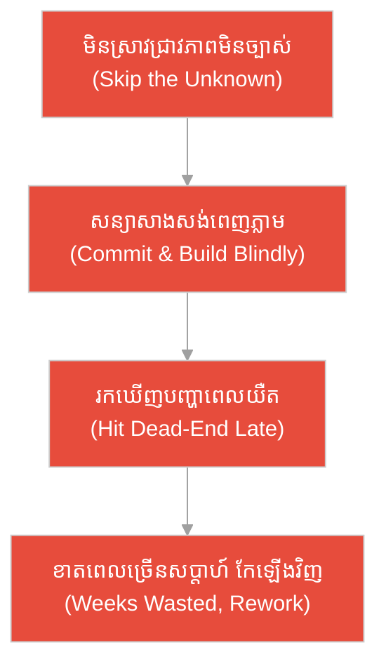
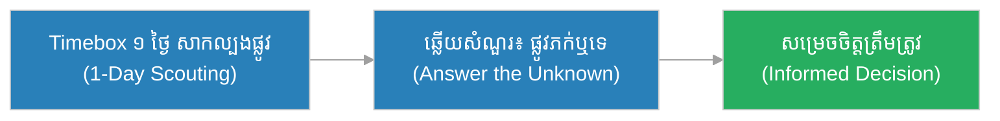
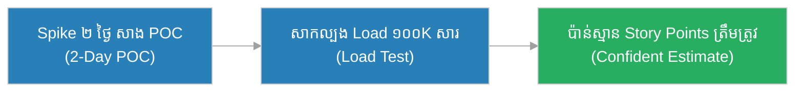
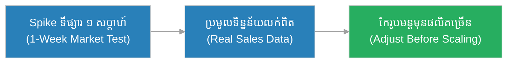
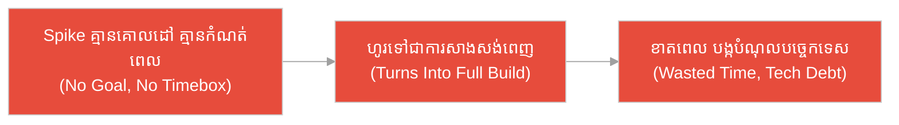
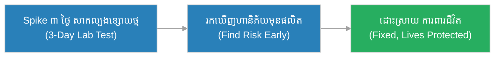
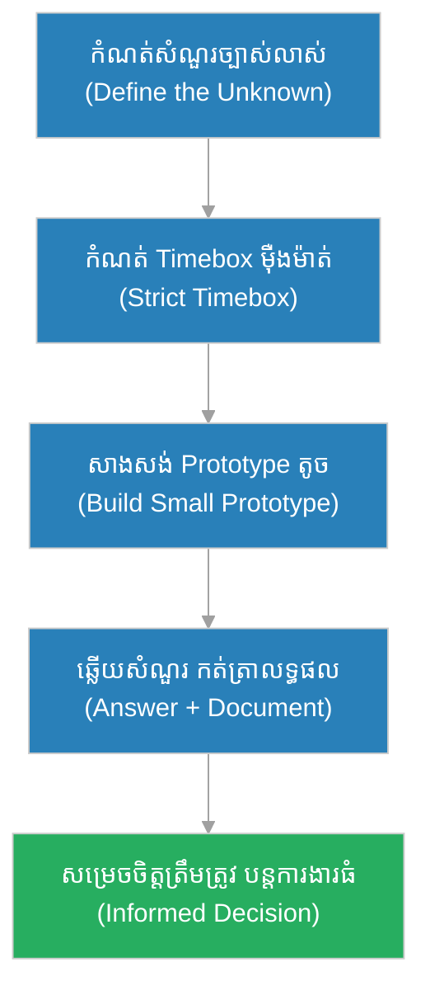

# ការស្រាវជ្រាវ (Spike)៖ អ្នក​ស្កុតផ្លូវ និង​ច្រកភ្នំ​មិន​ទាន់គូស​ផែនទី (The Scouts & The Unmapped Mountain Pass)

**អ្នកនិពន្ធ (Author):** ichamrong 
**កាលបរិច្ឆេទ (Date):** 2026-05-29 
**ស្លាក (Tags):** #agile #scrum #spike #parable 
**ប្រភេទ (Category):** Management & Leadership 
**រយៈពេលអាន (Read Time):** ~១២ នាទី (~12 min) 

---

## 📌 មាតិកា (Table of Contents)
- [អន្ទាក់​ការ​យល់ច្រឡំ (The Misconception Trap)](#0)
- [១. រឿងប្រៀបប្រដូច៖ អ្នក​ស្កុតផ្លូវ និង​ច្រកភ្នំ (The Parable: The Scouts & The Mountain Pass)](#1)
- [២. បញ្ហា៖ ការ​ច្រឡំ Spike ជា​ការ​សរសេរ​កូដ​គ្មាន​ផែន​ការ (The Issue: A Spike Is Not Aimless Tinkering)](#2)
- [៣. ឧទាហរណ៍​ជាក់ស្តែង​ក្នុង​ពិភពពិត (Real World Examples)](#3)
 - [ឧទាហរណ៍​ទី ១ — កម្រិតស្រាល (គ្រួសារ)៖ ការ​សាកល្បងផ្លូវ​មុន​ទិញដី (The Land Scouting Trip)](#3-1)
 - [ឧទាហរណ៍​ទី ២ — កម្រិតមធ្យម (បច្ចេកទេស)៖ ការ​សាកល្បង Library ថ្មី (The New Library POC)](#3-2)
 - [ឧទាហរណ៍​ទី ៣ — កម្រិតមធ្យម (ធុរកិច្ច)៖ ការ​សិក្សាទីផ្សារតូច (The Market Test)](#3-3)
 - [ឧទាហរណ៍​ទី ៤ — កម្រិតមធ្យម (គ្រប់​គ្រង)៖ Spike ដែល​ក្លាយ​ជា​ការ​សាងសង់ពេញ (The Runaway Spike)](#3-4)
 - [ឧទាហរណ៍​ទី ៥ — កម្រិតធ្ងន់ (សង្គ្រោះបន្ទាន់)៖ ការ​វាយតម្លៃ​ប្រព័ន្ធ​បេះដូង​ថ្មី (The Medical Device Feasibility)](#3-5)
- [៤. ការ​សន្ទនាបែបសាកសួរ (Socratic Dialogue: Tinkering vs. Bounded Research)](#4)
- [៥. ដំណោះស្រាយ៖ ការអនុវត្ត Spike ឱ្យ​មាន​គោលដៅ (The Solution: Running a Bounded Spike)](#5)
- [សេចក្តីសន្និដ្ឋាន (Conclusion)](#6)
- [ឯកសារយោង (References)](#7)
- [Related Posts](#8)

---

## អន្ទាក់​ការ​យល់ច្រឡំ (The Misconception Trap)

នៅ​ពេល​និយាយអំ​ពី Spike យើង​តែ​ង​តែ​ជួបនូវ​ការ​យល់ច្រឡំផ្ទុយគ្នា​ពី​រ៖

* **អន្ទាក់​លេង​សើច (The Tinkering Trap):** «Spike គឺ​ជា​ពេល​ដែល​ខ្ញុំ​អាច​សរសេរ​កូដ​អ្វី​ក៏​បាន​តាម​ចិត្ត គ្មាន​គោលដៅ គ្មាន​កំណត់​ពេល — ជា​ការ​សម្រាក​ពី​ការ​ងារ​ពិត!»
* **អន្ទាក់​ស្​មាន​ហួស​ហេតុ (The Guesswork Trap):** «យើង​មិន​ដឹង​ថា​បច្ចេកវិទ្យា​នេះ​ដំណើរ​ការ​ឬ​ទេ ប៉ុន្តែ​យើង​នឹង​ប៉ាន់​ស្​មាន​ហើយ​សាងសង់​ពេញ​ទាំង​មូល​ភ្លាម — បើ​ខុស​ទើប​ដឹង!»

---

## ១. រឿងប្រៀបប្រដូច៖ អ្នក​ស្កុតផ្លូវ និង​ច្រកភ្នំ (The Parable: The Scouts & The Mountain Pass)

កងទ័ពមួយ​ត្រូវ​ឆ្លងកាត់ច្រកភ្នំដ៏ខ្ពស់ ដែល​គ្មាន​នរណាធ្លាប់គូស​ផែនទី​ពី​មុន​មក។ មេបញ្​ជា​ការ​ឈ្មោះ **វិរៈ (Vireak)** មិន​ប្រញាប់​ដឹក​ទ័ព​ទាំង​មូល​ចូល​ឡើយ។ គាត់​ជ្រើស​អ្នក​ស្កុត​ផ្លូវ ៥ នាក់ ផ្តល់​ឱ្យ​ពួក​គេ **គោលដៅ​ច្បាស់លាស់​មួយ**៖ «ទៅ​មើល​ថា​ច្រក​នេះ​ឆ្លង​បាន​ឬ​ទេ មាន​ទឹក​ឬ​ទេ និង​ត្រូវ​ការ​ពេល​ប៉ុន្​មាន​ថ្ងៃ»; ហើយ​ផ្តល់​ **កំណត់​ពេល​ច្បាស់​លាស់​មួយ**៖ «ត្រឡប់​មក​វិញ​ក្នុង ៣ ថ្ងៃ ទោះ​បី​ឃើញ​អ្វី​ក៏​ដោយ»។ បន្ទាប់​ពី ៣ ថ្ងៃ អ្នក​ស្កុត​ត្រឡប់​មក​វិញ​ប្រាប់​ថា​ច្រក​ខាង​លិច​ស្ទះ ប៉ុន្តែ​ច្រក​ខាង​កើត​ឆ្លង​បាន។ វិរៈ​ដឹក​ទ័ព​តាម​ច្រក​ខាង​កើត​ដោយ​សុវត្ថិភាព។

ផ្ទុយ​ទៅ​វិញ មាន​មេ​បញ្​ជា​ការ​មួយ​ទៀត​ដែល​មិន​ព្រម​ផ្ញើ​អ្នក​ស្កុត​ឡើយ ដោយ​សារ​ខ្លាច​ខាត​ពេល។ គាត់​ដឹក​ទ័ព​ទាំង​មូល​ចូល​ច្រក​ដែល​មិន​ទាន់​គូស​ផែនទី​ភ្លាម។ លទ្ធផល៖ ច្រក​នោះ​ជា​ច្រក​ងាប់ (dead-end canyon) ដែល​គ្មាន​ផ្លូវ​ចេញ។ ទ័ព​ត្រូវ​ដក​ថយ​ខាត​ពេល​ច្រើន​សប្តាហ៍ និង​បាត់​បង់​ស្បៀង។ ការ​ខ្លាច​ខាត​ពេល ៣ ថ្ងៃ​ស្កុត បាន​នាំ​ឱ្យ​ខាត​ច្រើន​សប្តាហ៍​នៃ​ការ​ដើរ​ខុស។

---

## ២. បញ្ហា៖ ការ​ច្រឡំ Spike ជា​ការ​សរសេរ​កូដ​គ្មាន​ផែន​ការ (The Issue: A Spike Is Not Aimless Tinkering)

**Spike (ការ​ស្រាវ​ជ្រាវ)** គឺ​ជា​ការ​ងារ​ស្រាវ​ជ្រាវ​ដែល **កំណត់​ពេល (timeboxed)** និង **ភ្​ជា​ប់​នឹង​គោលដៅ (goal-bounded)** ដើម្បី​ឆ្​លើ​យ​នឹង **សំណួរ​ឬ​ភាព​មិន​ច្បាស់​លាស់​ជា​ក់​លាក់​មួយ (a specific unknown)** មុន​ពេល​ក្រុម​សន្យា​ធ្វើ​ការ​ងារ​ធំ។ ឧទាហរណ៍៖ «តើ Library X អាច​គ្រប់​គ្រង​អ្នក​ប្រើ​ ១០,០០០ នាក់​ព្រម​គ្នា​បាន​ឬ​ទេ?»។

ការ​ច្រឡំ​ធំ​បំផុត​គឺ៖ «Spike = សរសេរ​កូដ​លេង​តាម​ចិត្ត» ឬ «Spike = ការ​សម្រាក​ពី​វិន័យ»។ នេះ​មិន​ត្រឹម​ត្រូវ​ឡើយ។ Spike មាន **គោលដៅ​ច្បាស់លាស់** (តើ​ត្រូវ​ឆ្​លើ​យ​សំណួរ​អ្វី), មាន **កំណត់​ពេល​ច្បាស់លាស់** (ឧ. ២ ថ្ងៃ), និង​មាន **លទ្ធផល​ច្បាស់លាស់** (ការ​សម្រេច​ចិត្ត ឬ​ការ​ប៉ាន់​ស្​មាន​កាន់​តែ​ត្រឹម​ត្រូវ)។ បើ​គ្មាន​កំណត់​ពេល Spike នឹង​ហូរ​ទៅ​ជា​ការ​សាងសង់​ពេញ​ដោយ​មិន​ដឹង​ខ្លួន។

---

## ៣. ឧទាហរណ៍​ជាក់ស្តែង​ក្នុង​ពិភពពិត

សូមពិនិត្យមើលរបៀប​ដែល Spike ដែល​មាន​គោលដៅ និង​កំណត់​ពេល ជះឥទ្ធិពលដល់ស្ថានភាពទាំង ៥ ខាងក្រោម៖

---

### ឧទាហរណ៍​ទី ១ — កម្រិតស្រាល (គ្រួសារ)៖ ការ​សាកល្បងផ្លូវ​មុន​ទិញដី (The Land Scouting Trip)

* **ស្ថានភាព៖** គ្រួសារមួយ​ចង់​ទិញដីសង់ផ្ទះនៅជនបទ ប៉ុន្តែ​មិន​ច្បាស់ថាផ្លូវចូលអាច​ធ្វើ​ដំណើររដូវវស្សា​បាន​ទេ។ ពួកគេ​ចំណាយ​ត្រឹម​ ១ ថ្ងៃ (timebox) ទៅ​សាកល្បង​បើក​ឡាន​ចូល​ដើម្បី​ឆ្​លើ​យ​សំណួរ​តែ​មួយ៖ «តើ​ផ្លូវ​នេះ​ភក់​ឬ​ទេ?»។
* **លទ្ធផល៖** ពួកគេ​ដឹង​ច្បាស់​ថា​ផ្លូវ​ភក់​ខ្លាំង រួច​សម្រេច​ចិត្ត​ចរចា​តម្លៃ​ដី​ឱ្យ​ថោក​ឬ​ស្វែង​រក​ដី​ផ្សេង — ជៀស​វាង​ការ​ទិញ​ខុស​ដ៏​ថ្លៃ។

---

### ឧទាហរណ៍​ទី ២ — កម្រិតមធ្យម (បច្ចេកទេស)៖ ការ​សាកល្បង Library ថ្មី (The New Library POC)

* **ស្ថានភាព៖** ក្រុមអភិវឌ្ឍន៍​មិន​ច្បាស់ថា Library ផ្ញើសារ Push Notification ថ្មី​អាចទ្រាំទ្រ ១០០,០០០ សារ​ក្នុង​មួយ​នាទី​ឬ​ទេ។ ពួកគេ​បង្កើត Spike មួយ​មាន​កំណត់​ពេល ២ ថ្ងៃ ដើម្បី​សាង​សង់ Proof-of-Concept តូច​មួយ​ហើយ​សាក​ល្បង​ Load។
* **លទ្ធផល៖** ក្នុង ២ ថ្ងៃ ពួកគេ​ដឹង​ច្បាស់​ថា Library អាច​ទ្រាំ​បាន​ហើយ​ប៉ាន់​ស្​មាន Story Points បាន​ត្រឹម​ត្រូវ​សម្រាប់​ការ​ងារ​ពិត។

---

### ឧទាហរណ៍​ទី ៣ — កម្រិតមធ្យម (ធុរកិច្ច)៖ ការ​សិក្សាទីផ្សារតូច (The Market Test)

* **ស្ថានភាព៖** ក្រុមហ៊ុនលក់​ភេសជ្ជៈ​មិន​ច្បាស់​ថា​រស​ជា​តិ​ថ្មី​នឹង​លក់​ដាច់​ឬ​ទេ។ ជំនួស​ឱ្យ​ការ​ផលិត​ ១០០,០០០ កំប៉ុង​ភ្លាម ពួកគេ​ធ្វើ Spike ទីផ្សារ​មួយ​សប្តាហ៍​ដោយ​លក់​សាក​នៅ​ហាង ៥ ប៉ុណ្ណោះ។
* **លទ្ធផល៖** ទិន្នន័យ​លក់​ពិត​ប្រាប់​ថា​រស​ជា​តិ​នេះ​មិន​ពេញ​និយម​ខ្លាំង​ទេ ដូច្​នេះ​ក្រុមហ៊ុន​កែ​រូបមន្ត​មុន​ផលិត​ច្រើន — ជៀស​វាង​ការ​ខាត​បង់​ដ៏​ធំ។

---

### ឧទាហរណ៍​ទី ៤ — កម្រិតមធ្យម (គ្រប់​គ្រង)៖ Spike ដែល​ក្លាយ​ជា​ការ​សាងសង់ពេញ (The Runaway Spike)

* **ស្ថានភាព៖** អ្នក​គ្រប់​គ្រងម្នាក់​អនុញ្ញាត​ឱ្យ​អ្នក​អភិវឌ្ឍ​ន៍​ធ្វើ Spike ដោយ​គ្មាន​គោលដៅ និង​គ្មាន​កំណត់​ពេល។ អ្នក​អភិវឌ្ឍ​ន៍​ចាប់​ផ្​តើ​ម​សាង​សង់​មុខងារ​ពេញ​លេញ​ដោយ​មិន​ដឹង​ខ្លួន រួម​ទាំង​លម្អ​ UI ដែល​មិន​ទាន់​ត្រូវ​ការ។
* **លទ្ធផល៖** «Spike» នោះ​ស៊ី​ពេល ៣ សប្តាហ៍ ខណៈ​សំណួរ​ដើម​នៅ​មិន​ទាន់​ឆ្​លើ​យ​ច្បាស់​ ហើយ​កូដ​សាក​ល្បង​នោះ​ត្រូវ​បាន​ដាក់​ចូល​ផលិតកម្ម​ដោយ​គ្មាន​ការ​ត្រួត​ពិនិត្យ — បង្ក​បំណុល​បច្ចេកទេស។

---

### ឧទាហរណ៍​ទី ៥ — កម្រិតធ្ងន់ (សង្គ្រោះបន្ទាន់)៖ ការ​វាយតម្លៃ​ប្រព័ន្ធ​បេះដូង​ថ្មី (The Medical Device Feasibility)

* **ស្ថានភាព៖** ក្រុមវិស្វករឧបករណ៍វេជ្ជសាស្ត្រ​មិន​ច្បាស់​ថា​ឧបករណ៍​ត្រួត​ពិនិត្យ​ចង្វាក់​បេះដូង​ថ្មី​អាច​ដំណើរ​ការ​ត្រឹម​ត្រូវ​ក្នុង​ស្ថានភាព​ខ្សោយ​ថ្ម​ឬ​ទេ។ ពួកគេ​ធ្វើ Spike មាន​កំណត់​ពេល ៣ ថ្ងៃ ដើម្បី​សាក​ល្បង​ស្ថានភាព​ខ្សោយ​ថ្ម​ក្នុង​បន្ទប់​ពិសោធន៍​ដោយ​ឡែក​មុន​ការ​អនុម័ត​ផលិត។
* **លទ្ធផល៖** ការ​សាក​ល្បង​បង្ហាញ​ហានិភ័យ​ធ្ងន់ធ្ងរ​នៅ​ស្ថានភាព​ខ្សោយ​ថ្ម ដែល​ត្រូវ​បាន​ដោះស្រាយ​មុន​ផលិត — ការ​ស្រាវ​ជ្រាវ​តូច​មួយ​នេះ​បាន​ការ​ពារ​ជីវិត​អ្នក​ជំងឺ​រាប់​ពាន់​នាក់។

---

## ៤. ការ​សន្ទនាបែបសាកសួរ (Socratic Dialogue: Tinkering vs. Bounded Research)

**សិស្ស (អ្នក​អភិវឌ្ឍ​ន៍)៖** លោកគ្រូ ខ្ញុំចូលចិត្ត Spike ណាស់ ព្រោះ​វា​ជា​ពេល​ដែល​ខ្ញុំអាច​សរសេរ​កូដ​អ្វីក៏​បាន​តាម​ចិត្ត ដោយ​គ្មាន​នរណារំខាន!

**គ្រូ (Tech Lead)៖** សួរវិញសិន៖ មុន​ពេល​ឯងចាប់ផ្​តើ​ម Spike នេះ តើ​ឯង​សរសេរ​សំណួរច្បាស់លាស់ណាមួយ​ដែល​ត្រូវ​ឆ្​លើ​យ?

**សិស្ស៖** អត់ទេ... ខ្ញុំគ្រាន់​តែ​ចង់​សាកល្បងបច្ចេកវិទ្យា​ថ្មី ៗ ដែល​គួរឱ្យចាប់អារម្មណ៍។

**គ្រូ៖** ចុះឯងកំណត់​ពេល​ថា ត្រូវ​បញ្ចប់នៅ​ពេល​ណាទេ?

**សិស្ស៖** អត់ដែរ... ខ្ញុំ​ធ្វើ​រហូតដល់ខ្ញុំសប្បាយចិត្ត។

**គ្រូ៖** ដូច្​នេះ​បើ​អ្នក​ស្កុត​ផ្លូវ​ចេញ​ដំណើរ​ដោយ​មិន​ដឹង​ថា​ត្រូវ​មើល​អ្វី និង​មិន​ដឹង​ថា​ត្រូវ​ត្រឡប់​មក​វិញ​ពេល​ណា តើ​ពួក​គេ​នឹង​នាំ​យក​ព័ត៌មាន​មាន​ប្រយោជន៍​មក​ឱ្យ​ទ័ព​បាន​ដែរ​ឬ​ទេ?

**សិស្ស៖** ប្រហែល​អត់​ទេ... ពួក​គេ​នឹង​វង្វេង​ផ្លូវ​គ្មាន​ទី​បញ្ចប់។

**គ្រូ៖** ត្រឹម​ត្រូវ។ Spike មិន​មែន​ជា​ការ​លេង​សើច​ឡើយ វា​ជា **ការ​ស្កុត​ផ្លូវ** ដែល​មាន **គោលដៅ​ច្បាស់​លាស់** (ឆ្​លើ​យ​សំណួរ​ណា), **កំណត់​ពេល​ច្បាស់​លាស់** (timebox), និង **លទ្ធផល​ច្បាស់​លាស់** (ការ​សម្រេច​ចិត្ត)។ ការ​ស្រាវ​ជ្រាវ​ដ៏​តូច​មាន​វិន័យ ការ​ពារ​យើង​ពី​ការ​ដើរ​ខុស​ដ៏​ធំ។

---

## ៥. ដំណោះស្រាយ៖ ការអនុវត្ត Spike ឱ្យ​មាន​គោលដៅ (The Solution: Running a Bounded Spike)

ដើម្បី​ឱ្យ Spike ផ្តល់តម្លៃ មិន​មែនខាត​ពេល ក្រុម​ត្រូវ​អនុវត្តគោល​ការ​ណ៍ទាំង​នេះ៖

1. **កំណត់​សំណួរ​ច្បាស់​លាស់ (Define the Unknown):** សរសេរ​សំណួរ​ជា​ក់​លាក់​មួយ​ដែល Spike ត្រូវ​ឆ្​លើ​យ មុន​ពេល​ចាប់​ផ្​តើ​ម។
2. **កំណត់​ពេល​ម៉ឺងម៉ាត់ (Strict Timebox):** ផ្តល់​ពេល​ច្បាស់​លាស់ (ឧ. ១–៣ ថ្ងៃ) ហើយ​ឈប់​នៅ​ពេល​អស់​ពេល ទោះ​បី​មិន​ទាន់​ល្អ​ឥត​ខ្ចោះ។
3. **កំណត់​លទ្ធផល​ដែល​ត្រូវ​ការ (Define the Output):** លទ្ធផល​គឺ​ការ​សម្រេច​ចិត្ត ឬ​ការ​ប៉ាន់​ស្​មាន​ត្រឹម​ត្រូវ — មិន​មែន​កូដ​ផលិតកម្ម​ឡើយ។
4. **បោះ​ចោល​កូដ​សាក​ល្បង (Throw Away the Prototype):** កូដ Spike ភាគ​ច្រើន​គួរ​ត្រូវ​បោះ​ចោល មិន​ដាក់​ចូល​ផលិតកម្ម​ដោយ​ផ្ទាល់​ឡើយ។
5. **កត់​ត្រា និង​ចែក​រំលែក (Document & Share):** កត់​ត្រា​អ្វី​ដែល​រៀន​បាន ដើម្បី​ឱ្យ​ក្រុម​ទាំង​មូល​សម្រេច​ចិត្ត​ត្រឹម​ត្រូវ។

---

## 🐇 ធ្លាក់ចូល​ក្នុង​រន្ធទន្សាយ (Enter the Rabbit Hole)

ដើម្បី​យល់ដឹងកាន់​តែ​ស៊ីជម្រៅអំ​ពី Spike និង​ការ​ប៉ាន់ស្​មាន​ភាព​មិន​ច្បាស់ សូមស្វែងយល់បន្ថែម៖

* 🚀 **[ពិន្ទុរឿង (Story Points) ➔](../metrics/story-points.md)**
* 🚀 **[បំណុលបច្ចេកទេស (Technical Debt) ➔](./technical-debt.md)**
* 🚀 **[រឿង​អ្នកប្រើប្រាស់ (User Story) ➔](../artifacts/user-story.md)**

---

## សេចក្តីសន្និដ្ឋាន (Conclusion)

> **«Spike មិន​មែន​ជា​ការ​សរសេរ​កូដ​លេង​តាម​ចិត្ត​ឡើយ វា​ជា​ការ​ស្កុតផ្លូវដ៏​មាន​វិន័យ — កំណត់​ពេល កំណត់គោលដៅ ដើម្បី​ឆ្​លើ​យសំណួរមួយ មុន​ពេល​ដឹកទ័ពទាំងមូលចូលច្រកភ្នំ។»**

ការអនុវត្ត Spike ឱ្យ​បាន​ត្រឹម​ត្រូវ — មាន​គោលដៅ កំណត់​ពេល និង​លទ្ធផលច្បាស់លាស់ — ជួយឱ្យក្រុ​មក​ារងារកាត់បន្ថយភាព​មិន​ច្បាស់លាស់ ដូចមេបញ្​ជា​ការ​វិរៈ​ដែល​ផ្ញើ​អ្នក​ស្កុត ៥ នាក់ ការ​ពារទ័ពទាំងមូល​ពី​ការ​ដើរចូលច្រកងាប់។

---

## ឯកសារយោង (References)

* **Kent Beck** — *Extreme Programming Explained: Embrace Change* (2nd ed., 2004).
* **Mike Cohn** — *Agile Estimating and Planning* (2005).

---

## Related Posts

* [បំណុលបច្ចេកទេស (Technical Debt)](./technical-debt.md) — Spike ដែល​គ្មាន​វិន័យ អាច​បង្កើត​បំណុលបច្ចេកទេស​ដោយ​មិន​ដឹងខ្លួន។
* [រឿង​អ្នកប្រើប្រាស់ (User Story)](../artifacts/user-story.md) — Spike តែ​ង​តែ​ផ្​តើ​មឡើង​ពី​ភាព​មិន​ច្បាស់លាស់​ក្នុង User Story មួយ។
