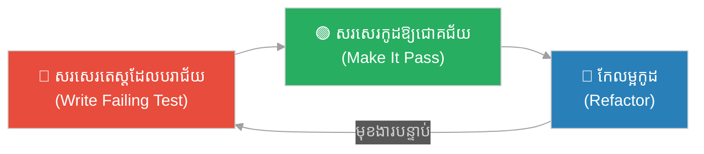
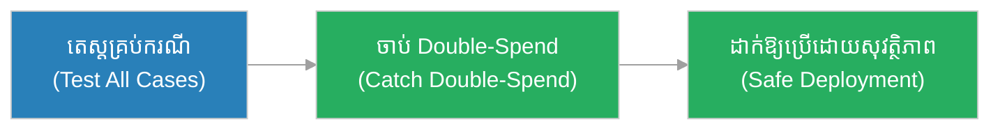
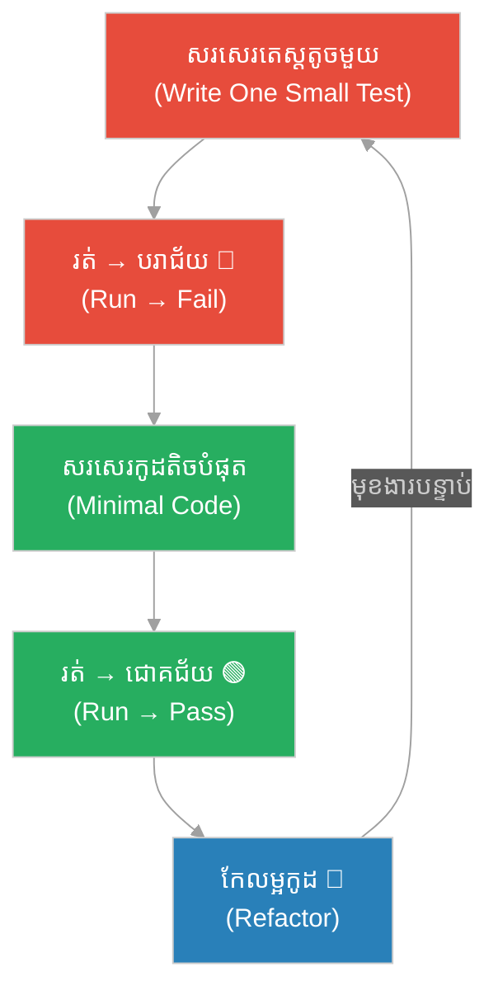

# ការ​សរសេរ​កូដ​ដោយ​ចា​ប់​ផ្​តើ​ម​ពី​តេ​ស្ត (Test-Driven Development - TDD)៖ ស្ពា​ន​ដែល​សា​ង​ពី​ខ្សែ​សុវត្ថិភាព (The Bridge Built From Safety Lines)

**អ្នក​និ​ព​ន្ធ (Author):** ichamrong 
**កា​ល​ប​រិ​ច្ឆេ​ទ (Date):** 2026-05-30 
**ស្លា​ក (Tags):** #engineering-practices #tdd #testing #quality #parable 
**ប្រ​ភេ​ទ (Category):** Management & Leadership 
**រ​យៈ​ពេល​អា​ន (Read Time):** ~១​២ នា​ទី (~12 min) 

---

## 📌 មា​តិ​កា (Table of Contents)
- [អ​ន្ទា​ក់​ដំណើរ​ការ (The Process Trap)](#0)
- [១. រឿងប្រៀបប្រដូច៖ អ្នក​ស​ង់​ស្ពា​ន និង​ខ្សែ​សុវត្ថិភាព (The Parable: The Bridge Builder & The Safety Line)](#1)
- [២. បញ្ហា៖ តើ​អ្វី​ទៅ​ជា TDD? (The Issue: What is TDD?)](#2)
- [៣. ឧ​ទា​ហ​រ​ណ៍​ជា​ក់​ស្​តែ​ង​ក្នុង​ពិ​ភ​ព​ពិត (Real World Examples)](#3)
 - [ឧ​ទា​ហ​រ​ណ៍​ទី ១ — ក​ម្រិ​ត​ស្រា​ល (គ្រួ​សា​រ)៖ រូ​ប​ម​ន្ត​ម្ហូ​ប​ដែល​សា​ក​ល្ប​ង​ជា​មុន (The Tested Recipe)](#3-1)
 - [ឧ​ទា​ហ​រ​ណ៍​ទី ២ — ក​ម្រិ​ត​ម​ធ្យ​ម (ប​ច្ចេ​ក​ទេ​ស)៖ មុ​ខ​ងា​រ​គ​ណ​នា​ព​ន្ធ (The Tax Calculator)](#3-2)
 - [ឧ​ទា​ហ​រ​ណ៍​ទី ៣ — ក​ម្រិ​ត​ម​ធ្យ​ម (ធុ​រ​កិ​ច្ច)៖ ការ​ការ​ពា​រ​ត​ម្លៃ​ផលិតផល (The Pricing Guardrail)](#3-3)
 - [ឧ​ទា​ហ​រ​ណ៍​ទី ៤ — ក​ម្រិ​ត​ម​ធ្យ​ម (គ្រប់​គ្រង)៖ ការ Refactor ដោយ​ទុ​ក​ចិ​ត្ត (The Confident Refactor)](#3-4)
 - [ឧ​ទា​ហ​រ​ណ៍​ទី ៥ — ក​ម្រិ​ត​ធ្ង​ន់ (ប្រព័ន្ធ​សំ​ខា​ន់)៖ ប្រព័ន្ធ​ទូ​ទា​ត់​ប្រា​ក់ (The Payment System)](#3-5)
- [៤. ការ​សន្ទនា​បែ​ប​សា​ក​សួ​រ (Socratic Dialogue)](#4)
- [៥. ដំ​ណោះ​ស្រា​យ៖ វ​ដ្ត Red-Green-Refactor (The Solution: The Red-Green-Refactor Cycle)](#5)
- [សេចក្តី​ស​ន្និ​ដ្ឋា​ន (Conclusion)](#6)
- [ឯ​ក​សា​រ​យោ​ង (References)](#7)
- [Related Posts](#8)

---

## អ​ន្ទា​ក់​ដំណើរ​ការ (The Process Trap)

* **អ​ន្ទា​ក់​សរសេរ​មុន​តេ​ស្ត​ក្រោយ (The Test-Later Trap):** «សរសេរ​កូដ​ឱ្យ​រួ​ច​សិ​ន រួ​ច​ទើ​ប​សរសេរ​តេ​ស្ត​ពេល​មាន​ពេល» — ប៉ុន្តែ​«ពេល​មាន​ពេល»​នោះ​មិន​ដែល​មក​ដ​ល់​ឡើយ។
* **អ​ន្ទា​ក់​គ្មាន​តេ​ស្ត (The No-Test Trap):** «កូដ​ខ្ញុំ​ដំណើរ​ការ​ហើ​យ​ដោយ​ខ្ញុំ​សា​ក​ដោយ​ដៃ​រួ​ច​ហើ​យ» — រ​ហូ​ត​ដ​ល់​ការ​ផ្លា​ស់​ប្តូ​រ​ប​ន្ទា​ប់​បំ​បែ​ក​អ្វី​មួ​យ​ដែល​គ្មាន​ន​រ​ណា​ដឹ​ង។

TDD បំ​បែ​ក​អ​ន្ទា​ក់​ទាំ​ង​ពី​រ​ដោយ​ត្រ​ឡ​ប់​លំ​ដា​ប់៖ **តេ​ស្ត​មុន កូដ​ក្រោយ។**

---

## ១. រឿងប្រៀបប្រដូច៖ អ្នក​ស​ង់​ស្ពា​ន និង​ខ្សែ​សុវត្ថិភាព (The Parable: The Bridge Builder & The Safety Line)

ក​ម្ម​ក​រ​ពី​រ​នា​ក់​ត្រូវ​ស​ង់​ស្ពា​ន​ឆ្ល​ង​ជ្រ​ល​ង​ភ្នំ។ **ដា​រ៉ា (Dara)** និ​យា​យ​ថា៖ «ខ្សែ​សុវត្ថិភាព​ធ្វើ​ឱ្យ​យឺត។ ខ្ញុំ​ដើ​រ​លើ​ធ្នឹ​ម​ដោយ​ឥ​ត​ខ្សែ ដើម្បី​ឱ្យ​លឿន។» គា​ត់​ដើ​រ​លឿន​ពិត​មែ​ន ប៉ុន្តែ​រាល់​ជំ​ហា​ន គា​ត់​ភ័​យ​ខ្លា​ច រ​ង្គើ ហើ​យ​មិន​ហ៊ា​ន​ងា​ក​ក្រោយ​ដើម្បី​កែ​ការ​ងារ​ដែល​ខុ​ស។

**វិ​ចិ​ត្រ (Vichet)** ផ្ទុ​យ​ទៅ​វិ​ញ ច​ង​ខ្សែ​សុវត្ថិភាព​ជា​មុន​មុន​ពេល​ដើ​រ​លើ​ធ្នឹ​ម​នីមួយ ៗ ។ ការ​ច​ង​ខ្សែ​ចំ​ណា​យ​ពេល​ប​ន្តិ​ច ប៉ុន្តែ​ពេល​គា​ត់​ដើ​រ គា​ត់​ដើ​រ​ដោយ​ទុ​ក​ចិ​ត្ត — ដួ​ល​ក៏​ខ្សែ​ទ​ប់ ហើ​យ​គា​ត់​ហ៊ា​ន​សា​ក​ផ្លូ​វ​ថ្មី ៗ ​ដោយ​មិន​ខ្លា​ច។

នៅ​ចុ​ង​ប​ញ្ច​ប់ វិ​ចិ​ត្រ​ស​ង់​ស្ពា​ន​បាន​រឹ​ង​មាំ​ជា​ង រហ័ស​ជា​ង (ព្រោះ​គា​ត់​មិន​ខ្លា​ច​សា​ក​អ្វី​ថ្មី) និង​នៅ​មាន​ជី​វិ​ត។ ខ្សែ​សុវត្ថិភាព​មិន​មែ​ន​ជា​ឧបសគ្គ​ឡើយ — វា​ជា​អ្វី​ដែល​ផ្ត​ល់​ភា​ព​ក្លា​ហា​ន​ដើម្បី​ផ្លា​ស់​ប្តូ​រ។

---

## ២. បញ្ហា៖ តើ​អ្វី​ទៅ​ជា TDD? (The Issue: What is TDD?)

**TDD (ការ​សរសេរ​កូដ​ដោយ​ចា​ប់​ផ្​តើ​ម​ពី​តេ​ស្ត)** គឺ​ជា​វិ​ន័​យ​អភិវឌ្ឍ​ដែល​អ្នក **សរសេរ​តេ​ស្ត​មុន​ពេល​សរសេរ​កូដ​ដែល​ត្រូវ​ឱ្យ​តេ​ស្ត​នោះ​ជោគជ័យ**។ វា​ដំ​ណើ​រ​ការ​តាម​វ​ដ្ត​ខ្លី​ ៗ ៣ ជំ​ហា​ន​ដែល​ហៅ​ថា **Red-Green-Refactor**៖

1. **🔴 Red (ក្រ​ហ​ម)៖** សរសេរ​តេ​ស្ត​មួ​យ​សម្រាប់​មុ​ខ​ងា​រ​ដែល​មិន​ទា​ន់​មាន។ តេ​ស្ត​បរាជ័យ (ព្រោះ​កូដ​មិន​ទា​ន់​មាន)។
2. **🟢 Green (បៃ​ត​ង)៖** សរសេរ​កូដ​តិ​ច​បំ​ផុ​ត​ដែល​ធ្វើ​ឱ្យ​តេ​ស្ត​ជោគជ័យ។
3. **🔵 Refactor (កែ​ល​ម្អ)៖** ស​ម្អា​ត​កូដ​ឱ្យ​ស្អា​ត​ ដោយ​ទុ​ក​ឱ្យ​តេ​ស្ត​នៅ​តែ​ជោគជ័យ។

> TDD ខុ​ស​ពី «ការ​សរសេរ​តេ​ស្ត» ធ​ម្ម​តា។ ភា​ព​ខុ​ស​គ្នា​គឺ **លំ​ដា​ប់** — តេ​ស្ត​ដឹ​ក​នាំ​ការ​រ​ច​នា (test *drives* design)។ ការ​សរសេរ​តេ​ស្ត​មុន​ប​ង្ខំ​ឱ្យ​អ្នក​គិ​ត​ពី «តើ​កូដ​នេះ​គួ​រ​ប្រ​ព្រឹ​ត្ត​ដូ​ច​ម្ដេ​ច?» មុន​ពេល​«តើ​ខ្ញុំ​សរសេរ​វា​ដូ​ច​ម្ដេ​ច?»។

---

## ៣. ឧ​ទា​ហ​រ​ណ៍​ជា​ក់​ស្​តែ​ង​ក្នុង​ពិ​ភ​ព​ពិត

---

### ឧ​ទា​ហ​រ​ណ៍​ទី ១ — ក​ម្រិ​ត​ស្រា​ល (គ្រួ​សា​រ)៖ រូ​ប​ម​ន្ត​ម្ហូ​ប​ដែល​សា​ក​ល្ប​ង​ជា​មុន (The Tested Recipe)

* **ស្ថា​ន​ភា​ព៖** មុន​ពេល​ច​ម្អិ​ន​អា​ហា​រ​ពិ​សេ​ស​ឱ្យ​ភ្ញៀ​វ ​អ្នក​ម្តា​យ​កំ​ណ​ត់​ជា​មុន​ថា «អា​ហា​រ​នេះ​ត្រូវ​មាន​រ​ស​ជា​តិ​ប្រៃ​ប​ន្តិ​ច មិន​ផ្អែ​ម​ពេ​ក និង​ក្តៅ​ល្ម​ម។» នេះ​ជា «តេ​ស្ត» របស់​នា​ង។
* **ល​ទ្ធ​ផ​ល៖** ពេល​ច​ម្អិ​ន​រួ​ច នា​ង​ភ្ល​ក្ស​ផ្ទៀ​ង​នឹ​ង​លក្ខណៈ​ទាំ​ង​នោះ។ បើ​ខ្វះ​ប្រៃ នា​ង​ដឹ​ង​ភ្លា​ម។ នា​ង​មិន​ប​ម្រើ​ភ្ញៀ​វ​ដោយ​ស្មា​ន​ឡើយ — នា​ង​ប​ម្រើ​តែ​អា​ហា​រ​ដែល​«ឆ្ល​ង​តេ​ស្ត»។

---

### ឧ​ទា​ហ​រ​ណ៍​ទី ២ — ក​ម្រិ​ត​ម​ធ្យ​ម (ប​ច្ចេ​ក​ទេ​ស)៖ មុ​ខ​ងា​រ​គ​ណ​នា​ព​ន្ធ (The Tax Calculator)

* **ស្ថា​ន​ភា​ព៖** អ្នក​អភិវឌ្ឍ​ន៍​ត្រូវ​សរសេរ​មុ​ខ​ងា​រ​គ​ណ​នា​ព​ន្ធ។ មុន​សរសេរ​កូដ គា​ត់​សរសេរ​តេ​ស្ត៖ «បើ​ត​ម្លៃ $១​០​០ ព​ន្ធ ១​០% ល​ទ្ធ​ផ​ល​ត្រូវ $១​១​០។ បើ​ត​ម្លៃ $០ ល​ទ្ធ​ផ​ល​ត្រូវ $០។»
* **ល​ទ្ធ​ផ​ល៖** តេ​ស្ត​បរាជ័យ (🔴 មិន​ទា​ន់​មាន​កូដ)។ គា​ត់​សរសេរ​កូដ​គ​ណ​នា​ព​ន្ធ​រ​ហូ​ត​តេ​ស្ត​ជោគជ័យ (🟢)។ ពេល​ក្រោយ​ មាន​ន​រ​ណា​កែ​កូដ ​ បើ​ការ​គ​ណ​នា​ខុ​ស តេ​ស្ត​នឹ​ង​បរាជ័យ​ភ្លា​ម​ ៗ — មុន​ការ​ខូ​ច​ខា​ត​ទៅ​ដ​ល់​អតិថិជន។

---

### ឧ​ទា​ហ​រ​ណ៍​ទី ៣ — ក​ម្រិ​ត​ម​ធ្យ​ម (ធុ​រ​កិ​ច្ច)៖ ការ​ការ​ពា​រ​ត​ម្លៃ​ផលិតផល (The Pricing Guardrail)

* **ស្ថា​ន​ភា​ព៖** ហា​ង​អ​ន​ឡា​ញ​មាន​ច្បា​ប់៖ «ប​ញ្ចុះ​ត​ម្លៃ​មិន​អា​ច​លើ​ស ៥​០%។» ក្រុ​ម​ការ​ងារ​សរសេរ​តេ​ស្ត​ដែល​ប​ញ្​ជា​ក់​ច្បា​ប់​នេះ​មុន​ពេល​សរសេរ​មុ​ខ​ងា​រ​ប​ញ្ចុះ​ត​ម្លៃ។
* **ល​ទ្ធ​ផ​ល៖** ៦ ខែ​ក្រោយ ​អ្នក​អភិវឌ្ឍ​ន៍​ថ្មី​ម្នា​ក់​ព្យា​យា​ម​ប​ន្ថែ​ម​មុ​ខ​ងា​រ​«ប​ញ្ចុះ ៧​០%»។ តេ​ស្ត​បរាជ័យ​ភ្លា​ម​ ៗ ការ​ពា​រ​ការ​ខា​ត​ប​ង់​ចំ​ណូ​ល​រា​ប់​ពា​ន់​ដុ​ល្លា​រ។ តេ​ស្ត​ក្លា​យ​ជា​ឯ​ក​សា​រ​រ​ស់ (living documentation) នៃ​ច្បា​ប់​អា​ជី​វ​ក​ម្ម។

---

### ឧ​ទា​ហ​រ​ណ៍​ទី ៤ — ក​ម្រិ​ត​ម​ធ្យ​ម (គ្រប់​គ្រង)៖ ការ Refactor ដោយ​ទុ​ក​ចិ​ត្ត (The Confident Refactor)

* **ស្ថា​ន​ភា​ព៖** ក្រុ​ម​ការ​ងារ​ត្រូវ​[Refactor](refactoring.md) កូដ​ចាស់​ដ៏​ស្មុ​គ​ស្មា​ញ។ ដោយ​សា​រ​មាន​តេ​ស្ត​គ្រ​ប​ដ​ណ្ត​ប់​រួ​ច​ហើ​យ ពួ​ក​គេ​ហ៊ា​ន​ផ្លា​ស់​ប្តូ​រ​រ​ច​នា​ស​ម្ព័​ន្ធ​ខា​ង​ក្នុង។
* **ល​ទ្ធ​ផ​ល៖** រាល់​ការ​ផ្លា​ស់​ប្តូ​រ ពួ​ក​គេ​រ​ត់​តេ​ស្ត។ បៃ​ត​ង​ទាំ​ង​អ​ស់ = សុវត្ថិភាព។ ការ Refactor ​ដ៏​ធំ​បាន​ប​ញ្ច​ប់​ដោយ​គ្មាន​បំ​បែ​ក​មុ​ខ​ងា​រ​ណា​មួ​យ​ឡើយ — ដោយ​សា​រ​ខ្សែ​សុវត្ថិភាព (តេ​ស្ត) នៅ​ទី​នោះ។

---

### ឧ​ទា​ហ​រ​ណ៍​ទី ៥ — ក​ម្រិ​ត​ធ្ង​ន់ (ប្រព័ន្ធ​សំ​ខា​ន់)៖ ប្រព័ន្ធ​ទូ​ទា​ត់​ប្រា​ក់ (The Payment System)

* **ស្ថា​ន​ភា​ព៖** ក្រុ​ម​ហ៊ុ​ន​Fintech​ សរសេរ​ប្រព័ន្ធ​ផ្ទេ​រ​ប្រា​ក់។ មុន​សរសេរ​កូដ ពួ​ក​គេ​សរសេរ​តេ​ស្ត​សម្រាប់​គ្រប់​ក​រ​ណី៖ ប្រា​ក់​មិន​គ្រប់, គ​ណ​នី​មិន​មាន, ការ​ផ្ទេ​រ​ស្ទួ​ន (double-spend), និង​ការ​ផ្ទេ​រ​ធ​ម្ម​តា។
* **ល​ទ្ធ​ផ​ល៖** ក​រ​ណី «ការ​ផ្ទេ​រ​ស្ទួ​ន» ដែល​អា​ច​ប​ង្ក​ការ​បា​ត់​ប​ង់​ប្រា​ក់​រា​ប់​លា​ន​ ត្រូវ​បាន​ចា​ប់​បាន​ដោយ​តេ​ស្ត​តាំ​ង​ពី​ថ្ងៃ​ដំ​បូ​ង។ ប្រព័ន្ធ​ដា​ក់​ឱ្យ​ប្រើ​ប្រា​ស់​ដោយ​គ្មាន​ឧ​ប្ប​ត្តិ​ហេ​តុ​ហិ​រ​ញ្ញ​វ​ត្ថុ​ធ្ង​ន់​ធ្ង​រ​ឡើយ។

---

## ៤. ការ​សន្ទនា​បែ​ប​សា​ក​សួ​រ (Socratic Dialogue)

**សិ​ស្ស៖** លោ​ក​គ្រូ ការ​សរសេរ​តេ​ស្ត​មុន​ធ្វើ​ឱ្យ​ខ្ញុំ​យឺត​ទ្វេ​ដ​ង — ខ្ញុំ​សរសេរ​ទាំ​ង​តេ​ស្ត ទាំ​ង​កូដ។ ហេ​តុ​អ្វី​មិន​សរសេរ​តែ​កូដ​ឱ្យ​រួ​ច?

**គ្រូ៖** សួ​រ​ល្អ។ ប្រា​ប់​ខ្ញុំ​មក — ពេល​ឯ​ង​សរសេរ​កូដ​តែ​ឯ​ង​មិន​ដឹ​ង​ថា​វា​ត្រូវ​ប្រ​ព្រឹ​ត្ត​ដូ​ច​ម្ដេ​ច​ច្បា​ស់ ឯ​ង​ចំ​ណា​យ​ពេល​ប៉ុ​ន្មា​ន​ដើម្បី​ដោះ​ស្រា​យ​បញ្ហា​ពេល​ក្រោយ?

**សិ​ស្ស៖** ច្រើ​ន​ណា​ស់... ពេល​ខ្លះ​ខ្ញុំ​ចំ​ណា​យ​ពេល​ច្រើ​ន​ម៉ោ​ង​ស្វែ​ង​រ​ក​កំ​ហុ​ស​ដែល​ការ​ផ្លា​ស់​ប្តូ​រ​ខ្ញុំ​បាន​ប​ង្ក។

**គ្រូ៖** ដូ​ច្​នេះ​«ល្បឿន»​ដែល​ឯ​ង​បាន​ពី​ការ​មិន​សរសេរ​តេ​ស្ត​ ត្រូវ​បាន​ស​ង​ត្រ​ឡ​ប់​វិ​ញ​ដោយ​ការ​ស្វែ​ង​រ​ក​កំ​ហុ​ស។ ឥ​ឡូ​វ​សួ​រ​ប​ន្ត — ពេល​ឯ​ង​មាន​តេ​ស្ត​គ្រ​ប​ដ​ណ្ត​ប់ តើ​ឯ​ង​ហ៊ា​ន​ផ្លា​ស់​ប្តូ​រ​កូដ​ចាស់​ឬ​ទេ?

**សិ​ស្ស៖** ហ៊ា​ន​ជា​ង​ឆ្ងា​យ ព្រោះ​បើ​ខ្ញុំ​បំ​បែ​ក​អ្វី​មួ​យ តេ​ស្ត​នឹ​ង​ប្រា​ប់​ខ្ញុំ​ភ្លា​ម។

**គ្រូ៖** នោះ​ហើ​យ​ជា​អំ​ណោ​យ​ពិត​ប្រា​ក​ដ​នៃ TDD។ វា​មិន​មែ​ន​ត្រឹ​ម​ការ​ចា​ប់​កំ​ហុ​ស​ឡើយ — វា​ផ្ត​ល់​ឱ្យ​ឯ​ង​នូ​វ **ភា​ព​ក្លា​ហា​ន​ដើម្បី​ផ្លា​ស់​ប្តូ​រ**។ ដូ​ច​អ្នក​ស​ង់​ស្ពា​ន​វិ​ចិ​ត្រ ខ្សែ​សុវត្ថិភាព​មិន​ធ្វើ​ឱ្យ​ឯ​ង​យឺត​ឡើយ​ក្នុង​រ​យៈ​ពេល​វែ​ង — វា​ឱ្យ​ឯ​ង​ដើ​រ​លឿន​ដោយ​ទុ​ក​ចិ​ត្ត។

---

## ៥. ដំ​ណោះ​ស្រា​យ៖ វ​ដ្ត Red-Green-Refactor (The Solution: The Red-Green-Refactor Cycle)

ដើម្បី​អ​នុ​វ​ត្ត TDD ឱ្យ​បាន​ត្រឹ​ម​ត្រូវ៖

1. **សរសេរ​តេ​ស្ត​តូ​ច​មួ​យ​មុន (Write one small test first):** កុំ​សរសេរ​ច្រើ​ន​ក្នុង​ពេល​តែ​មួ​យ។ មួ​យ​មុ​ខ​ងា​រ មួ​យ​តេ​ស្ត។
2. **មើ​ល​ឱ្យ​តេ​ស្ត​បរាជ័យ (Watch it fail - Red):** ប​ញ្​ជា​ក់​ថា​តេ​ស្ត​ពិត​ជា​សា​ក​អ្វី​មួ​យ។
3. **សរសេរ​កូដ​តិ​ច​បំ​ផុ​ត (Write minimal code - Green):** គ្រា​ន់​តែ​ឱ្យ​តេ​ស្ត​ជោគជ័យ កុំ​ប​ន្ថែ​ម​អ្វី​លើ​ស។
4. **កែលម្អ​ដោយ​ទុ​ក​ចិ​ត្ត (Refactor safely):** ស​ម្អា​ត​កូដ ​ដោយ​រ​ត់​តេ​ស្ត​ឱ្យ​ច្បា​ស់​ថា​នៅ​បៃ​ត​ង។
5. **រួ​ម​ប​ញ្ចូ​ល​ក្នុង [CI/CD](ci-cd.md):** រាល់​តេ​ស្ត​រ​ត់​ស្វ័​យ​ប្រ​វ​ត្តិ​នៅ​ពេល​ប​ញ្ចូ​ល​កូដ​ថ្មី។

---

## 🐇 ធ្លា​ក់​ចូ​ល​ក្នុង​រន្ធទន្សាយ (Enter the Rabbit Hole)

* 🚀 **[ការ​អភិវឌ្ឍ​តាម​ឥ​រិ​យា​ប​ថ (BDD) ➔](bdd.md)**
* 🚀 **[ការ​កែលម្អ​កូដ (Refactoring) ➔](refactoring.md)**
* 🚀 **[CI/CD ➔](ci-cd.md)**
* 🚀 **[បំ​ណុ​ល​ប​ច្ចេ​ក​ទេ​ស (Technical Debt) ➔](technical-debt.md)**

---

## សេចក្តី​ស​ន្និ​ដ្ឋា​ន (Conclusion)

> **«តេ​ស្ត​មិន​មែ​ន​ជា​អ្វី​ដែល​ឯ​ង​ធ្វើ​ប​ន្ទា​ប់​ពី​សរសេរ​កូដ​ឡើយ — វា​ជា​អ្វី​ដែល​ដឹ​ក​នាំ​រ​បៀ​ប​ឯ​ង​សរសេរ​កូដ។»**

TDD បំ​ប្លែ​ង​តេ​ស្ត​ពី​«ប​ន្ទុ​ក​ក្រោយ»​ឱ្យ​ទៅ​ជា​«ខ្សែ​សុវត្ថិភាព​មុន»។ វា​ផ្ត​ល់​នូ​វ​ភា​ព​ក្លា​ហា​ន​ដើម្បី​ផ្លា​ស់​ប្តូ​រ និង​ឯ​ក​សា​រ​រ​ស់​នៃ​អ្វី​ដែល​កូដ​គួ​រ​ប្រ​ព្រឹ​ត្ត។

---

## ឯ​ក​សា​រ​យោ​ង (References)

* **Kent Beck** — *Test-Driven Development: By Example* (2002).
* **Robert C. Martin** — *Clean Code: A Handbook of Agile Software Craftsmanship* (2008).

---

## Related Posts

* [ការ​អភិវឌ្ឍ​តាម​ឥ​រិ​យា​ប​ថ (BDD)](bdd.md) — ការ​ព​ង្រី​ក TDD ​ទៅ​ក​ម្រិ​ត​ឥ​រិ​យា​ប​ថ​អា​ជី​វ​ក​ម្ម។
* [ការ​កែលម្អ​កូដ (Refactoring)](refactoring.md) — ជំ​ហា​ន​ទី​៣ នៃ​វ​ដ្ត TDD។
* [CI/CD](ci-cd.md) — ការ​រ​ត់​តេ​ស្ត​ដោយ​ស្វ័​យ​ប្រ​វ​ត្តិ​នៅ​ពេល​ប​ញ្ចូ​ល​កូដ។
