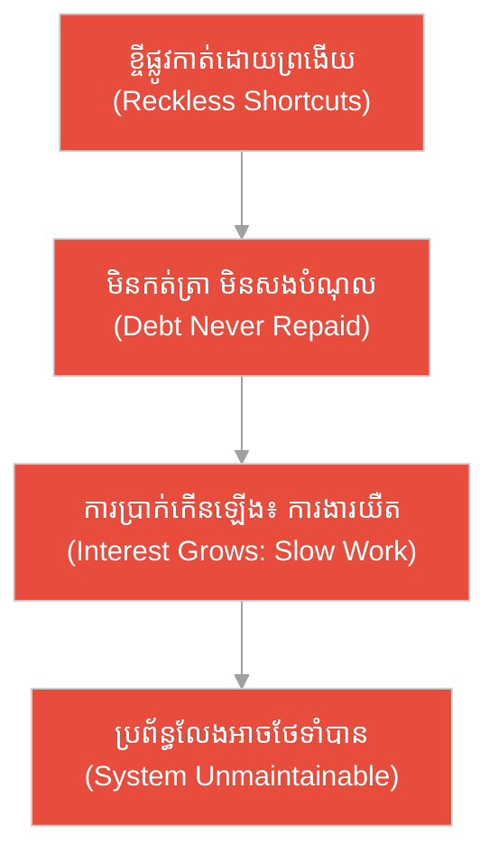
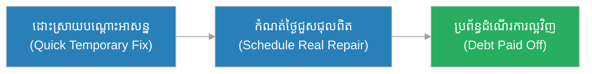
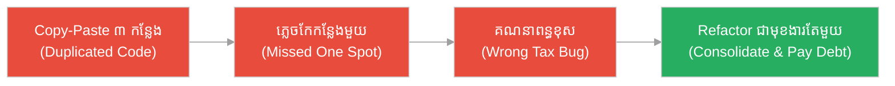
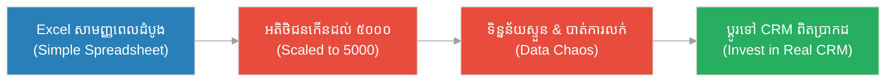
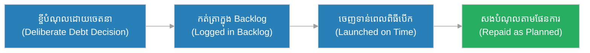
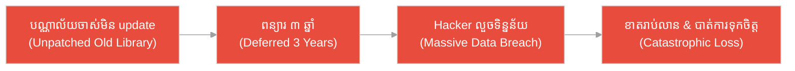
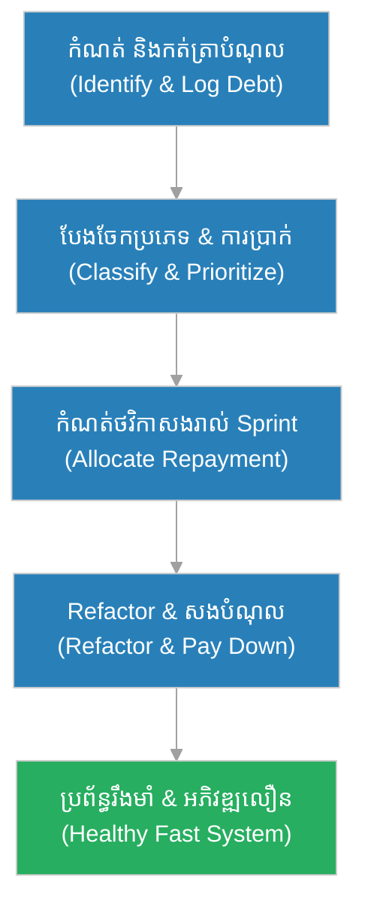

# បំណុលបច្ចេកទេស (Technical Debt)៖ ស្រូវ​ដែល​ខ្ចី​ពី​អ្នក​ជិតខាង និង​ការ​ប្រាក់​ដែល​កើន​រាល់​រដូវច្រូត (The Borrowed Rice & The Interest That Grows Each Harvest)

**អ្នកនិពន្ធ (Author):** ichamrong 
**កាលបរិច្ឆេទ (Date):** 2026-05-29 
**ស្លាក (Tags):** #agile #scrum #technical-debt #parable 
**ប្រភេទ (Category):** Management & Leadership 
**រយៈពេលអាន (Read Time):** ~១២ នាទី (~12 min) 

---

## 📌 មាតិកា (Table of Contents)
- [អន្ទាក់​នៃ​បំណុលបច្ចេកទេស (The Technical Debt Trap)](#0)
- [១. រឿងប្រៀបប្រដូច៖ ស្រូវខ្ចី និង​ការ​ប្រាក់​ដែល​លិចលង់កសិករ (The Parable: The Borrowed Rice That Drowned the Farmer)](#1)
- [២. បញ្ហា៖ ការ​យល់ច្រឡំថា​បំណុលបច្ចេកទេស​គ្រាន់​តែ​ជា​កូដ​កខ្វក់ (The Issue: Mistaking Debt for Just Messy Code)](#2)
- [៣. ឧទាហរណ៍​ជាក់ស្តែង​ក្នុង​ពិភពពិត (Real World Examples)](#3)
 - [ឧទាហរណ៍​ទី ១ — កម្រិតស្រាល (គ្រួសារ)៖ ការ​ជួសជុលម៉ាស៊ីនត្រ​ជា​ក់បណ្តោះអាសន្ន (The Patched Air-Conditioner)](#3-1)
 - [ឧទាហរណ៍​ទី ២ — កម្រិតមធ្យម (បច្ចេកទេស)៖ មុខងារ Copy-Paste ដែល​រីករាលដាល (The Copy-Paste Sprawl)](#3-2)
 - [ឧទាហរណ៍​ទី ៣ — កម្រិតមធ្យម (ធុរកិច្ច)៖ បញ្ជីអតិថិជន​ក្នុង Excel ដែល​លែង​គ្រប់​គ្រង​បាន (The Spreadsheet CRM)](#3-3)
 - [ឧទាហរណ៍​ទី ៤ — កម្រិតមធ្យម (គ្រប់​គ្រង)៖ បំណុល​ដែល​គ្រប់​គ្រង​ដោយ​ចេតនា (The Deliberate Launch Debt)](#3-4)
 - [ឧទាហរណ៍​ទី ៥ — កម្រិតធ្ងន់ (សុវត្ថិភាព)៖ បណ្ណាល័យ​ចាស់​ដែល​មិន​បាន​ធ្វើ​បច្ចុប្បន្នភាព (The Unpatched Banking Library)](#3-5)
- [៤. ការ​សន្ទនាបែបសាកសួរ (Socratic Dialogue: Messy Code vs. Managed Trade-off)](#4)
- [៥. ដំណោះស្រាយ៖ ការ​គ្រប់​គ្រង​បំណុលបច្ចេកទេស​ឱ្យ​មាន​វិន័យ (The Solution: Managing Debt with Discipline)](#5)
- [សេចក្តីសន្និដ្ឋាន (Conclusion)](#6)
- [ឯកសារយោង (References)](#7)
- [Related Posts](#8)

---

## អន្ទាក់​នៃ​បំណុលបច្ចេកទេស (The Technical Debt Trap)

នៅក្នុង​ការ​អភិវឌ្ឍ​ន៍​កម្មវិធី យើង​តែ​ង​តែ​ជួបប្រទះនូវភាពផ្ទុយគ្នា​ពី​របែបអំ​ពី​បំណុលបច្ចេកទេស៖

* **អន្ទាក់​បដិសេធទាំងស្រុង (The Zero-Debt Trap):** «បំណុលបច្ចេកទេស​គឺ​អាក្រក់​ទាំងស្រុង! យើង​ត្រូវ​សរសេរ​កូដ​ឱ្យ​ល្អ​ឥតខ្ចោះ ១០០% មុន​ពេល​ដាក់ឱ្យដំណើរ​ការ ទោះបី​ត្រូវ​ខាត​ពេល​ប៉ុន្​មាន​ខែក៏​ដោយ!»
* **អន្ទាក់​ខ្ចី​ដោយ​ព្រងើយ (The Reckless Borrowing Trap):** «យកវាដំណើរ​ការ​ទៅ​សិន! កុំ​ខ្វល់រឿង​គុណភាព​កូដ យើងនឹងជួសជុលនៅ​ពេល​ក្រោយ» (ប៉ុន្តែ «ពេល​ក្រោយ» នោះ​មិន​ដែល​មក​ដល់​ឡើយ)។

---

## ១. រឿងប្រៀបប្រដូច៖ ស្រូវខ្ចី និង​ការ​ប្រាក់​ដែល​លិចលង់កសិករ (The Parable: The Borrowed Rice That Drowned the Farmer)

នៅភូមិមួយ​ជា​ប់មាត់ស្ទឹង មាន​កសិករម្នាក់ឈ្មោះ **ច័ន្ទ (Chan)**។ នៅ​ពេល​ជិតអស់ស្រូវ គាត់​បាន​ទៅ​ខ្ចីស្រូវមួយថាំង​ពី​អ្នក​ជិតខាង​ដើម្បី​បរិភោគ។ ការ​ខ្ចី​នេះ​ងាយស្រួល និង​លឿន​ណាស់ — គ្រាន់​តែ​ដើរ​ទៅ​សុំ ស្រូវក៏​បាន​ដល់ផ្ទះ។ ប៉ុន្តែ​អ្នក​ជិតខាង​បាន​ប្រាប់ច្បាស់ថា៖ «រាល់​រដូវច្រូត ឯង​ត្រូវ​សង​មក​វិញច្រើន​ជា​ងអ្វី​ដែល​ឯង​បាន​យក» — នោះ​គឺ​ការ​ប្រាក់។

រដូវច្រូតដំបូង ច័ន្ទ​មាន​ស្រូវ​គ្រប់​គ្រាន់ ប៉ុន្តែ​ដោយ​ខ្ជិលសងបំណុល​ចាស់ គាត់​បាន​ខ្ចីបន្ថែមទៀត​ដើម្បី​ទិញគ្រឿងសប្បាយ។ រដូវបន្ទាប់ បំណុលកើនឡើងទ្វេដង។ រាល់​ដងគាត់​ត្រូវ​ចំណាយផលស្រូវកាន់​តែ​ច្រើន​ទៅ​សង​ការ​ប្រាក់ ដោយ​នៅសល់​សម្រាប់​ខ្លួនកាន់​តែ​តិច។ ច័ន្ទ​មិន​ដែល​ឈប់​ដើម្បី​សងបំណុលដើម​ឡើយ គាត់គ្រាន់​តែ​ខ្ចី​ថ្មី​ដើម្បី​សង​ចាស់។ ទីបំផុត ការ​ប្រាក់​បាន​កើន​លើ​សផលស្រូវទាំងមូល — គាត់​ត្រូវ​លក់គោ លក់នង្គ័ល ហើយ​ចុងក្រោយ​បាត់បង់ស្រែទាំងមូល​ទៅ​ឱ្យ​អ្នក​ជិតខាង។

ផ្ទុយ​ទៅ​វិញ កសិករម្នាក់ទៀតក៏​បាន​ខ្ចីស្រូវដែរនៅ​ពេល​លំបាក ប៉ុន្តែ​គាត់ខ្ចី​ដោយ​ចេតនា និង​ផែន​ការ​ច្បាស់លាស់៖ ខ្ចីត្រឹម​តែ​ដែល​ត្រូវ​ការ ហើយ​រាល់​រដូវច្រូត គាត់កំណត់ផ្នែកមួយ​នៃ​ផលស្រូវ ដើម្បី​សងបំណុលដើម​ជា​មុន​សិន។ មិន​យូរប៉ុន្​មាន គាត់សងអស់បំណុល និង​បន្តដាំស្រូវ​ដោយ​សេរីភាព។ ស្រូវ​ដែល​ខ្ចី​មិន​មែន​ជា​រឿង​អាក្រក់​ឡើយ — អ្វី​ដែល​អាក្រក់​គឺ​ការ​ខ្ចី​ដោយ​ព្រងើយ និង​មិន​ដែល​សងវិញ។

---

## ២. បញ្ហា៖ ការ​យល់ច្រឡំថា​បំណុលបច្ចេកទេស​គ្រាន់​តែ​ជា​កូដ​កខ្វក់ (The Issue: Mistaking Debt for Just Messy Code)

នៅក្នុង​ការ​អភិវឌ្ឍ​ន៍​កម្មវិធី **បំណុលបច្ចេកទេស (Technical Debt)** គឺជា​ការ​ជ្រើសរើសផ្លូវ​ដែល​លឿន និង​ងាយស្រួលនៅ​ពេល​នេះ ដោយ​ដឹងថាវានឹង​បង្កើត​ការ​ងារបន្ថែម (ការ​ប្រាក់) នៅ​ពេល​អនាគត។ វា​មិន​មែនគ្រាន់​តែ​ជា «កូដ​កខ្វក់» នោះ​ទេ — វា​ជា **ការ​ដោះដូរ (Trade-off)** ដែល​ពេល​ខ្លះ​ត្រូវ​ធ្វើ​ដោយ​ចេតនា ដើម្បី​ដាក់ផលិតផលឱ្យដំណើរ​ការ​ទាន់​ពេល។

ការ​យល់ច្រឡំធំបំផុត​មាន​ពី​រ៖ ទី១ គិតថា​បំណុលបច្ចេកទេស​គឺ «អាក្រក់​ទាំងស្រុង» ដែល​ត្រូវ​ជៀសវាង​គ្រប់​ពេល និង​ទី២ គិតថាវា​ជា «កូដ​ខ្ជិល ៗ » ដែល​គ្មាន​គ្រោះថ្នាក់។ បញ្ហា​ពិតប្រាកដ​គឺ បំណុល​ដែល​មិន​បាន​គ្រប់​គ្រង — ដែល​កើន​ការ​ប្រាក់រហូតបណ្តាលឱ្យ​ការ​ងារ​ថ្មី ៗ យឺត និង​លែងអាចបន្ត​បាន។

---

## ៣. ឧទាហរណ៍​ជាក់ស្តែង​ក្នុង​ពិភពពិត

សូមពិនិត្យមើលរបៀប​ដែល​បំណុលបច្ចេកទេស​ជះឥទ្ធិពលដល់កម្រិតជីវិត និង​ការ​ងារទាំង ៥ ខាងក្រោម៖

---

### ឧទាហរណ៍​ទី ១ — កម្រិតស្រាល (គ្រួសារ)៖ ការ​ជួសជុលម៉ាស៊ីនត្រ​ជា​ក់បណ្តោះអាសន្ន (The Patched Air-Conditioner)

* **ស្ថានភាព៖** ម៉ាស៊ីនត្រ​ជា​ក់ផ្ទះ​មាន​ទឹកលេច។ ម្​ចាស់​ផ្ទះយកធុងតូចមួយ​ទៅ​ទ្រាប់ទឹក ជំនួសឱ្យ​ការ​ហៅ​ជា​ង​មក​ជួសជុលផ្ទាល់។ វិធី​នេះ​លឿន និង​សន្សំប្រាក់នៅ​ពេល​នេះ ប៉ុន្តែ​គាត់​ត្រូវ​ចាក់ធុងចោល​រាល់ថ្ងៃ (ការ​ប្រាក់)។
* **លទ្ធផល៖** ដោយ​ដឹងថា​នេះ​ជា «បំណុល» គាត់​បាន​កំណត់ថ្ងៃច្បាស់លាស់​ដើម្បី​ហៅ​ជា​ង​មក​ជួសជុល​ជា​ស្ថាពរ​ក្នុង​សប្តាហ៍បន្ទាប់ ជៀសវាង​ការ​ខូចខាតធំ និង​ការ​ខ្ជះខ្​ជា​យ​ពេល​វេលា​រៀង​រាល់ថ្ងៃ។

---

### ឧទាហរណ៍​ទី ២ — កម្រិតមធ្យម (បច្ចេកទេស)៖ មុខងារ Copy-Paste ដែល​រីករាលដាល (The Copy-Paste Sprawl)

* **ស្ថានភាព៖** ដើម្បី​បញ្ចប់មុខងារ ៣ យ៉ាង​ឱ្យ​បាន​ទាន់​ពេល អ្នក​អភិវឌ្ឍ​ន៍​បាន copy-paste ប្លុក​កូដ​គណនាពន្ធដ៏ស្មុគស្មាញ ៣ កន្លែងផ្សេងគ្នា។ ៦ ខែ​ក្រោយ ច្បាប់ពន្ធផ្លាស់ប្តូរ ហើយក្រុម​ត្រូវ​កែ​កូដ​នៅ ៣ កន្លែង — តែ​គេភ្លេចកន្លែងមួយ បង្កើត​ការ​គណនាខុស។
* **លទ្ធផល៖** នេះ​ជា​ការ​ប្រាក់​នៃ​បំណុល​ដែល​មិន​បាន​គ្រប់​គ្រង។ ក្រុម​បាន​រៀនមេរៀន ហើយ​ធ្វើ Refactor ដោយ​បង្រួ​មក​ូដ​នោះ​ទៅ​ជា​មុខងារ​តែ​មួយ (Single Source of Truth) ដើម្បី​សងបំណុល​និង​បញ្ឈប់​ការ​ប្រាក់។

---

### ឧទាហរណ៍​ទី ៣ — កម្រិតមធ្យម (ធុរកិច្ច)៖ បញ្ជីអតិថិជន​ក្នុង Excel ដែល​លែង​គ្រប់​គ្រង​បាន (The Spreadsheet CRM)

* **ស្ថានភាព៖** ហាងតូចមួយចាប់ផ្​តើ​ម​គ្រប់​គ្រងអតិថិជន ៥០ នាក់​ដោយ Excel — លឿន និង​សាមញ្ញ។ ប៉ុន្តែ ២ ឆ្នាំ​ក្រោយ អតិថិជនកើនដល់ ៥០០០ នាក់ ឯកសារ Excel ដាច់ញឹកញាប់ ទិន្នន័យ​ស្ទួន និង​បាត់បង់​ការ​លក់ ដោយសារ​មិន​អាច​តាមដាន​បាន។
* **លទ្ធផល៖** បំណុល​ដែល​មិន​បាន​សង​បាន​កើន​ការ​ប្រាក់រហូតវាក្លាយ​ជា​បន្ទុក។ ម្​ចាស់​ហាង​បាន​សម្រេចចិត្តវិនិយោគ​ទៅ​ប្រព័ន្ធ CRM ពិតប្រាកដ ដោះស្រាយ​បញ្ហា​ជា​មូលដ្ឋាន។

---

### ឧទាហរណ៍​ទី ៤ — កម្រិតមធ្យម (គ្រប់​គ្រង)៖ បំណុល​ដែល​គ្រប់​គ្រង​ដោយ​ចេតនា (The Deliberate Launch Debt)

* **ស្ថានភាព៖** ដើម្បី​បង្ហាញ​ផលិតផល​ក្នុង​ពិធីបើកដ៏សំខាន់មួយ អ្នក​គ្រប់​គ្រងផលិតផលសម្រេចចិត្ត​ដោយ​ចេតនាថា មុខងារទូទាត់នឹងគាំទ្រ​តែ ១ វិធីសាស្ត្រសិន (ដោយ​ដឹងថា​ត្រូវ​បន្ថែមទៀត​ក្រោយ)។ គាត់កត់ត្រាបំណុល​នេះ​ច្បាស់លាស់​ក្នុង Backlog។
* **លទ្ធផល៖** ផលិតផល​បាន​ចេញទាន់​ពេល ឈ្នះអតិថិជនដំបូង។ បន្ទាប់​ពី​ពិធីបើក ក្រុម​បាន​សងបំណុល​នេះ​តាម​ផែន​ការ — នេះ​ជា​បំណុល​ដែល​គ្រប់​គ្រង​បាន​ល្អ (Deliberate & Prudent Debt)។

---

### ឧទាហរណ៍​ទី ៥ — កម្រិតធ្ងន់ (សុវត្ថិភាព)៖ បណ្ណាល័យ​ចាស់​ដែល​មិន​បាន​ធ្វើ​បច្ចុប្បន្នភាព (The Unpatched Banking Library)

* **ស្ថានភាព៖** ប្រព័ន្ធ​ធនាគារមួយប្រើបណ្ណាល័យ (Library) ចំណាស់​ដែល​មាន​ចន្លោះប្រហោងសុវត្ថិភាព។ ក្រុមដឹង​បញ្ហា​នេះ ៣ ឆ្នាំ​មក​ហើយ ប៉ុន្តែ​តែ​ង​តែ​ពន្យារ​ការ update ដោយ​ខ្លាចបាក់​ប្រព័ន្ធ — បំណុល​នេះ​កើន​ការ​ប្រាក់​រាល់ថ្ងៃ។
* **លទ្ធផល៖** ពួក Hacker បាន​ទាញយកចន្លោះប្រហោង​នោះ លួច​ទិន្នន័យ​អតិថិជនរាប់លាននាក់ បណ្តាលឱ្យខាតបង់ប្រាក់រាប់លានដុល្លារ និង​បាត់បង់​ការ​ទុកចិត្ត។ បំណុល​ដែល​មិន​បាន​សង​បាន​ដួលរលំទាំងស្រុង។

---

## ៤. ការ​សន្ទនាបែបសាកសួរ (Socratic Dialogue: Messy Code vs. Managed Trade-off)

**សិស្ស (អ្នក​អភិវឌ្ឍ​ន៍)៖** លោកគ្រូ! ប្រធានក្រុមនិយាយថា «យើង​មាន​បំណុលបច្ចេកទេស​ច្រើនណាស់»។ ខ្ញុំយល់ថា បំណុលបច្ចេកទេស​គឺ​គ្រាន់​តែ​ជា​កូដ​ខូច ៗ ឬ​កូដ​ខ្ជិល ៗ មែនទេ?

**គ្រូ (ស្ថាបត្យករ​កម្មវិធី)៖** នេះ​ជា​ការ​យល់ច្រឡំទូ​ទៅ។ សួរវិញ៖ ប្រសិនបើឯងខ្ចីលុយ​ពី​ធនាគារ​ដើម្បី​បើកអាជីវកម្ម តើ​នោះ​ជា​រឿង​អាក្រក់​ឬ?

**សិស្ស៖** អត់ទេ បើខ្ចី​ដោយ​ចេតនា និង​សងវិញទាន់​ពេល វាជួយឱ្យអាជីវកម្មចាប់ផ្​តើ​ម​បាន​លឿន។

**គ្រូ៖** ត្រឹម​ត្រូវ! បំណុលបច្ចេកទេស​ក៏ដូចគ្នា។ ពេល​ខ្លះយើងជ្រើសរើសផ្លូវកាត់​ដោយ​ចេតនា ដើម្បី​ដាក់ផលិតផលឱ្យដំណើរ​ការ​ទាន់​ពេល។ ចុះ​តើ​មាន​អ្វីកើតឡើង បើឯងខ្ចីលុយ ហើយ​មិន​ដែល​សង​ការ​ប្រាក់?

**សិស្ស៖** ការ​ប្រាក់នឹងកើនឡើងរហូតលិចលង់ខ្ញុំ លោកគ្រូ។

**គ្រូ៖** ដូចគ្នាបេះបិទ! ការ​ប្រាក់​នៃ​បំណុលបច្ចេកទេស​គឺ «ការ​ងារ​ថ្មី ៗ កាន់​តែ​យឺត»។ កូដ​ស្មុគស្មាញ​ដែល​មិន​បាន​សម្អាត ធ្វើ​ឱ្យ​រាល់​មុខងារ​ថ្មី​ពិបាក​សរសេរ ងាយខូច និង​ថ្លៃ​ជា​ង។ ដូច្​នេះ បញ្ហា​ពិត​គឺ​នៅឯណា — នៅត្រង់​ការ​ខ្ចី ឬ​នៅត្រង់​ការ​មិន​សង?

**សិស្ស៖** នៅត្រង់​ការ​មិន​សង និង​ការ​មិន​គ្រប់​គ្រងវាលោកគ្រូ។

**គ្រូ៖** ត្រឹម​ត្រូវ​ហើយ! ដូច្​នេះ កុំ​ស្អប់​បំណុលបច្ចេកទេស និង​កុំ​ព្រងើយកន្​តើ​យចំពោះវា។ ត្រូវ «កត់ត្រាវាឱ្យឃើញ» (Make it visible) ក្នុង Backlog «វាស់​ការ​ប្រាក់​របស់​វា» (Measure the interest) និង «កំណត់ផែន​ការ​សងវា​ជា​ប្រចាំ» (Pay it down deliberately)។ បំណុល​ដែល​អ្នក​មើលឃើញ និង​គ្រប់​គ្រង​បាន គឺជា​ឧបករណ៍មួយ មិន​មែន​ជា​ស​ត្រូវ​ឡើយ។

---

## ៥. ដំណោះស្រាយ៖ ការ​គ្រប់​គ្រង​បំណុលបច្ចេកទេស​ឱ្យ​មាន​វិន័យ (The Solution: Managing Debt with Discipline)

ដើម្បី​កុំ​ឱ្យ​បំណុលបច្ចេកទេស​ក្លាយ​ជា​បន្ទុកលិចលង់ ក្រុ​មក​ារងារ​ត្រូវ​អនុវត្តគោល​ការ​ណ៍ **មើលឃើញ-វាស់-សង (See-Measure-Pay)**៖

1. **កត់ត្រាបំណុលឱ្យមើលឃើញ (Make Debt Visible):** រាល់​ការ​សម្រេចចិត្តជ្រើសរើសផ្លូវកាត់ ត្រូវ​កត់ត្រា​ជា Ticket ក្នុង Backlog ដើម្បី​កុំ​ឱ្យវាបាត់ និង​ភ្លេច។
2. **បែងចែក​ប្រភេទ​បំណុល (Classify the Debt):** តើ​នេះ​ជា​បំណុល​ដោយ​ចេតនា (Deliberate) ឬ​ដោយ​ធ្វេសប្រហែស (Reckless)? តើ​វា​មាន​ការ​ប្រាក់ខ្ពស់ ឬ​ទាប? ផ្តោត​លើ​បំណុល​ដែល​ឈឺចាប់បំផុត​ជា​មុន។
3. **កំណត់ថវិកាសងបំណុល​រាល់​វដ្ត (Allocate Repayment Budget):** ក្នុង​វដ្ត​ការ​ងារ​នីមួយ ៗ (Sprint) កំណត់ភាគរយ (ឧ. ១៥-២០%) នៃ​សមត្ថភាពក្រុម​សម្រាប់​ការ Refactor និង​សងបំណុល។
4. **រួមបញ្ចូល​ក្នុង Definition of Done (Bake into DoD):** ការ​ងារ​មិន​ត្រូវ​ចាត់ទុកថា «រួច​រាល់» បើវាបន្ថែមបំណុល​ថ្មី​ដោយ​មិន​មាន​ការ​អនុម័ត។
5. **កុំ​ខ្ចី​ដោយ​ព្រងើយ (No Reckless Borrowing):** ការ​ខ្ចី​ដោយ​ចេតនា​ដើម្បី​រៀន គឺ​ល្អ ប៉ុន្តែ​ការ​ខ្ចី​ដោយ​ខ្ជិល និង​មិន​មាន​ផែន​ការ​សង គឺ​នាំ​ទៅ​រក​ការ​ដួលរលំ។

---

## 🐇 ធ្លាក់ចូល​ក្នុង​រន្ធទន្សាយ (Enter the Rabbit Hole)

ដើម្បី​យល់ដឹងកាន់​តែ​ស៊ីជម្រៅអំ​ពី​ប្រភព​នៃ​បំណុលបច្ចេកទេស និង​របៀបទប់ស្កាត់វា សូមស្វែងយល់បន្ថែម៖

* 🚀 **[ការ​សរសេរ​កូដ​បែបឯកោឥតវិន័យ (Cowboy Coding) ➔](./cowboy-coding.md)**
* 🚀 **[និយមន័យនៃភាពរួចរាល់ (Definition of Done) ➔](../artifacts/dod.md)**
* 🚀 **[ការស្រាវជ្រាវ​បច្ចេកទេស (Spike) ➔](./spike.md)**

---

## សេចក្តីសន្និដ្ឋាន (Conclusion)

> **«បំណុលបច្ចេកទេស​មិន​មែន​ជា​ស​ត្រូវ​ឡើយ — អ្វី​ដែល​ជា​ស​ត្រូវ គឺ​ការ​ខ្ចី​ដោយ​ព្រងើយ និង​ការ​មិន​ដែល​សងវិញ។»**

ដូចស្រូវ​ដែល​ខ្ចី​ពី​អ្នក​ជិតខាង បំណុលបច្ចេកទេស​អាចជួយយើងឆ្លងផុតវិបត្តិ និង​ដាក់ផលិតផលឱ្យដំណើរ​ការ​ទាន់​ពេល។ ប៉ុន្តែ​ប្រសិនបើយើងខ្ចី​ដោយ​ព្រងើយ និង​មិន​ដែល​ឈប់​ដើម្បី​សងវិញ ការ​ប្រាក់នឹងកើនរហូតលិចលង់យើង។ ការ​គ្រប់​គ្រងបំណុលឱ្យមើលឃើញ និង​សងវា​ដោយ​វិន័យ គឺជា​គន្លឹះ​នៃ​ប្រព័ន្ធ​កម្មវិធី​ដែល​រឹងមាំ និង​អភិវឌ្ឍ​បាន​យូរអង្វែង។

---

## ឯកសារយោង (References)

* **Martin Fowler** — *Refactoring: Improving the Design of Existing Code* (2nd Edition, 2018).
* **Ward Cunningham** — *The WyCash Portfolio Management System* (OOPSLA 1992) — ប្រភពដើម​នៃ​ពាក្យ «Technical Debt»។
* **Kent Beck** — *Extreme Programming Explained: Embrace Change* (2004).

---

## Related Posts

* [ការ​សរសេរ​កូដ​បែបឯកោឥតវិន័យ (Cowboy Coding)](./cowboy-coding.md) — ប្រភពចម្បងមួយ​នៃ​បំណុលបច្ចេកទេស​ដែល​ខ្ចី​ដោយ​ព្រងើយ។
* [និយមន័យនៃភាពរួចរាល់ (Definition of Done)](../artifacts/dod.md) — ឧបករណ៍​ការ​ពារ​កុំ​ឱ្យបំណុល​ថ្មី​លូកចូល​ដោយ​មិន​ដឹងខ្លួន។
