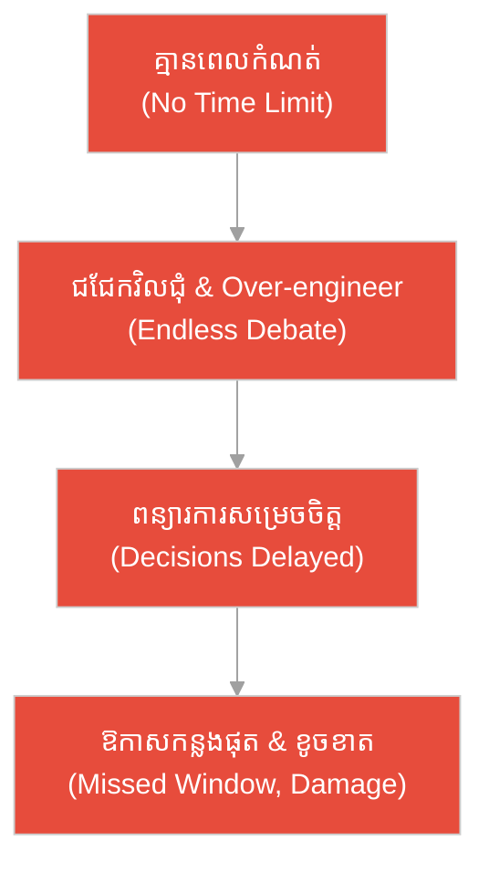
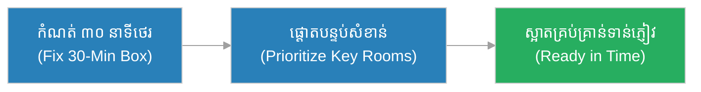
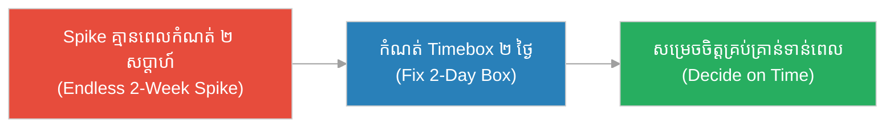
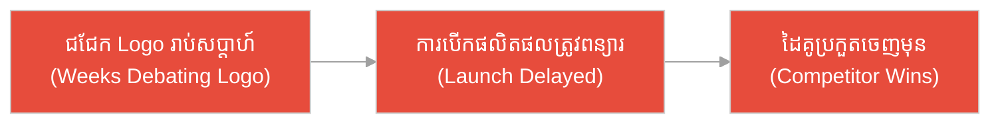
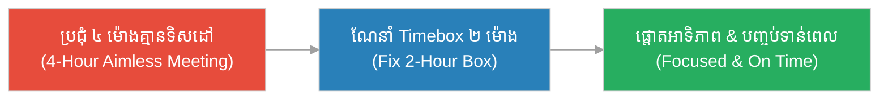
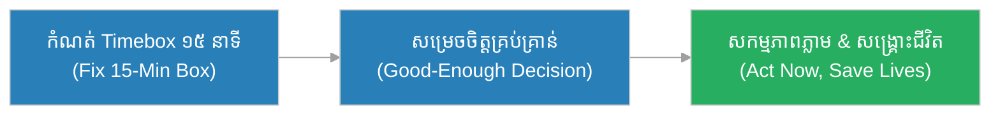
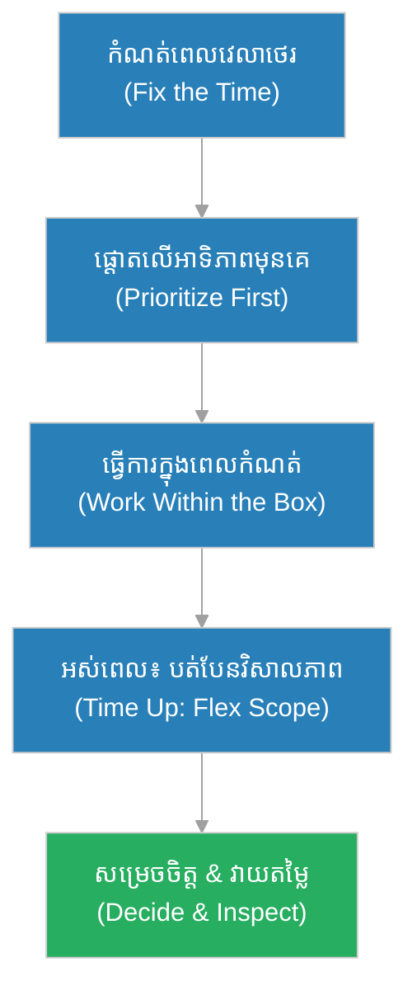

# ការកំណត់ពេលវេលា (Timeboxing)៖ នាឡិកាខ្សាច់​នៃ​ក្រុមប្រឹក្សាភូមិ (The Village Council's Hourglass)

**អ្នកនិពន្ធ (Author):** ichamrong 
**កាលបរិច្ឆេទ (Date):** 2026-05-29 
**ស្លាក (Tags):** #agile #scrum #timeboxing #parable 
**ប្រភេទ (Category):** Management & Leadership 
**រយៈពេលអាន (Read Time):** ~១២ នាទី (~12 min) 

---

## 📌 មាតិកា (Table of Contents)
- [អន្ទាក់​នៃ​ការកំណត់ពេលវេលា (The Timeboxing Trap)](#0)
- [១. រឿងប្រៀបប្រដូច៖ នាឡិកាខ្សាច់ និង​ក្រុមប្រឹក្សា​ដែល​ជជែកគ្នា ៣ ឆ្នាំ (The Parable: The Hourglass & The Three-Year Debate)](#1)
- [២. បញ្ហា៖ ការ​យល់ច្រឡំថា Timeboxing ជា​ការ​ប្រញាប់កាត់​គុណភាព (The Issue: Mistaking Timeboxing for Rushing)](#2)
- [៣. ឧទាហរណ៍​ជាក់ស្តែង​ក្នុង​ពិភពពិត (Real World Examples)](#3)
 - [ឧទាហរណ៍​ទី ១ — កម្រិតស្រាល (គ្រួសារ)៖ ការ​សម្អាតផ្ទះ​ក្នុង ៣០ នាទី (The 30-Minute Tidy)](#3-1)
 - [ឧទាហរណ៍​ទី ២ — កម្រិតមធ្យម (បច្ចេកទេស)៖ ការ Spike ស្រាវជ្រាវ​ដែល​គ្មាន​ទីបញ្ចប់ (The Endless Research Spike)](#3-2)
 - [ឧទាហរណ៍​ទី ៣ — កម្រិតមធ្យម (ធុរកិច្ច)៖ ការ​សម្រេចចិត្តជ្រើសរើស Logo (The Logo Decision Loop)](#3-3)
 - [ឧទាហរណ៍​ទី ៤ — កម្រិតមធ្យម (គ្រប់​គ្រង)៖ ការប្រជុំ​ដែល​គ្មាន​ពេល​កំណត់ (The Endless Meeting)](#3-4)
 - [ឧទាហរណ៍​ទី ៥ — កម្រិតធ្ងន់ (សង្គ្រោះបន្ទាន់)៖ ការ​សម្រេចចិត្ត​ពេល​គ្រោះមហន្តរាយ (The Disaster Triage Clock)](#3-5)
- [៤. ការ​សន្ទនាបែបសាកសួរ (Socratic Dialogue: Rushing vs. Fixed Time Flexible Scope)](#4)
- [៥. ដំណោះស្រាយ៖ ការអនុវត្ត Timeboxing ឱ្យ​មាន​ប្រសិទ្ធភាព (The Solution: Effective Timeboxing)](#5)
- [សេចក្តីសន្និដ្ឋាន (Conclusion)](#6)
- [ឯកសារយោង (References)](#7)
- [Related Posts](#8)

---

## អន្ទាក់​នៃ​ការកំណត់ពេលវេលា (The Timeboxing Trap)

នៅ​ពេល​និយាយអំ​ពី​ការ​គ្រប់​គ្រង​ពេល​វេលា យើង​តែ​ង​តែ​ជួបប្រទះនូវភាពផ្ទុយគ្នា​ពី​របែប៖

* **អន្ទាក់​ប្រញាប់កាត់​គុណភាព (The Rushing Trap):** «Timeboxing គឺ​ការ​ប្រញាប់ ៗ — យើង​ត្រូវ​បញ្ចប់​ការ​ងារ​ទាំងអស់​ឱ្យ​បាន​ទាន់​ពេល ទោះ​ត្រូវ​កាត់​គុណភាព​យ៉ាង​ណាក៏​ដោយ!»
* **អន្ទាក់​ភាព​ល្អ​ឥតខ្ចោះ (The Perfectionism Trap):** «យើង​មិន​កំណត់​ពេល​ឡើយ — យើងនឹង​ពិភាក្សា និង​កែលម្អ​រហូតដល់វា​ល្អ​ឥតខ្ចោះ ទោះ​ត្រូវ​ចំណាយ​ពេល​ប៉ុន្​មាន​ឆ្នាំក៏​ដោយ!»

---

## ១. រឿងប្រៀបប្រដូច៖ នាឡិកាខ្សាច់ និង​ក្រុមប្រឹក្សា​ដែល​ជជែកគ្នា ៣ ឆ្នាំ (The Parable: The Hourglass & The Three-Year Debate)

នៅភូមិមួយ មាន​ក្រុមប្រឹក្សា​ដែល​ត្រូវ​សម្រេចចិត្ត​លើ​បញ្ហា​សំខាន់ ៗ ។ មេភូមិវ័យចំណាស់ឈ្មោះ **សុភា (Sophea)** បាន​ដាក់ច្បាប់មួយ៖ រាល់​ការ​ជជែក​ពិភាក្សា ត្រូវ​ដាក់ **នាឡិកាខ្សាច់ (Hourglass)** មួយនៅកណ្តាលតុ។ នៅ​ពេល​ខ្សាច់ហូរអស់ ក្រុមប្រឹក្សា «ត្រូវ» សម្រេចចិត្ត​ដោយ​ផ្អែក​លើ​ព័ត៌មាន​ដែល​ពួកគេ​មាន​នៅ​ពេល​នោះ។ ច្បាប់​នេះ​ការ​ពារ​កុំ​ឱ្យ​ការ​ជជែកវិលជុំ​គ្មាន​ទីបញ្ចប់។ ដោយ​ដឹងថា​ពេល​មាន​កំណត់ ក្រុមប្រឹក្សាផ្តោត​លើ​ចំណុចសំខាន់បំផុត និង​សម្រេចចិត្ត​បាន​ទាន់​ពេល​ជា​និច្ច។

ផ្ទុយ​ទៅ​វិញ មាន​ភូមិមួយទៀត​ដែល​គ្មាន​នាឡិកាខ្សាច់​ឡើយ។ នៅ​ពេល​ត្រូវ​សម្រេចថា គួរសាងស្ពានឆ្លងស្ទឹង​ឬ​អត់ ក្រុមប្រឹក្សា​បាន​ជជែកគ្នា​ទៅ​មក​ដោយ​ឥតទីបញ្ចប់ — សួររក​ព័ត៌មាន​បន្ថែម ពិភាក្សា​គ្រប់​លម្អិតតូចតាច និង​ពន្យារ​ការ​សម្រេចចិត្តរហូត។ ការ​ជជែក​នោះ​អូសបន្លាយ ៣ ឆ្នាំ។ ក្នុង​អំឡុង​ពេល​នោះ ទឹកស្ទឹង​បាន​ជន់លិចភូមិដល់ ២ ដង បំផ្លាញដំណាំ និង​ផ្ទះសម្បែង ដោយសារ​គ្មាន​ស្ពានឱ្យប្រ​ជា​ជនរត់គេចទាន់​ពេល។ ការ​មិន​កំណត់​ពេល ដោយ​ចង់​បាន​ការ​សម្រេចចិត្ត «ល្អ​ឥតខ្ចោះ» បាន​បង្ក​ការ​ខូចខាតធ្ងន់ធ្ងរ​ជា​ង​ការ​សម្រេចចិត្ត «គ្រប់​គ្រាន់» ទាន់​ពេល​ទៅ​ទៀត។

---

## ២. បញ្ហា៖ ការ​យល់ច្រឡំថា Timeboxing ជា​ការ​ប្រញាប់កាត់​គុណភាព (The Issue: Mistaking Timeboxing for Rushing)

**ការកំណត់ពេលវេលា (Timeboxing)** គឺជា​ការអនុវត្ត​ដែល​យើងកំណត់ **ពេល​វេលា​ថេរ (Fixed Time)** សម្រាប់​សកម្មភាពមួយ ហើយ **បត់បែន​វិសាលភាព (Flexible Scope)** តាម​នោះ។ នៅ​ពេល​អស់​ពេល ការ​ងារ​ត្រូវ​ឈប់ ហើយយើងវាយតម្លៃលទ្ធផល​ដែល​សម្រេច​បាន។ វាបង្ខំឱ្យយើងផ្តោត​លើ​អ្វី​ដែល​សំខាន់បំផុត​ជា​មុន (Prioritization)។

ការ​យល់ច្រឡំធំបំផុត​គឺ គិតថា «Timeboxing មាន​ន័យថាប្រញាប់ ឬ​កាត់​គុណភាព»។ ការ​ពិត គឺ​ផ្ទុយស្រឡះ៖ យើងកំណត់ «ពេល​វេលា» ឱ្យថេរ ហើយ «បត់បែន​វិសាលភាព» — នេះ​បង្ខំឱ្យយើងផ្តោត​លើ​អាទិភាព និង​ការ​ពារ​កុំ​ឱ្យធ្លាក់ចូល​ក្នុង​ភាព​ល្អ​ឥតខ្ចោះឥតទីបញ្ចប់។ បញ្ហា​ពិត​គឺ ការ​មិន​កំណត់​ពេល ដែល​នាំ​ទៅ​រក​ការ​ជជែកវិលជុំ ការ Over-engineering និង​ការ​ពន្យារ​ការ​សម្រេចចិត្តរហូត​ពេល​វេលា​កន្លងផុត។

---

## ៣. ឧទាហរណ៍​ជាក់ស្តែង​ក្នុង​ពិភពពិត

សូមពិនិត្យមើលរបៀប​ដែល​ការកំណត់ពេលវេលា ជះឥទ្ធិពលដល់កម្រិតជីវិត និង​ការ​ងារទាំង ៥ ខាងក្រោម៖

---

### ឧទាហរណ៍​ទី ១ — កម្រិតស្រាល (គ្រួសារ)៖ ការ​សម្អាតផ្ទះ​ក្នុង ៣០ នាទី (The 30-Minute Tidy)

* **ស្ថានភាព៖** គ្រួសារមួយ​មាន​ភ្ញៀវ​មក​ដល់​ក្នុង ៣០ នាទី។ ជំនួសឱ្យ​ការ​សម្អាតផ្ទះទាំងមូលឱ្យ​ល្អ​ឥតខ្ចោះ (ដែល​មិន​អាចទាន់) ពួកគេកំណត់​ពេល​ថេរ ៣០ នាទី និង​ផ្តោត​លើ​បន្ទប់​ដែល​ភ្ញៀវនឹងឃើញ៖ បន្ទប់ទទួលភ្ញៀវ និង​បង្គន់។
* **លទ្ធផល៖** ផ្ទះមើល​ទៅ​ស្អាត​គ្រប់​គ្រាន់​សម្រាប់​ភ្ញៀវ ដោយ​ផ្តោត​លើ​អ្វីសំខាន់បំផុត។ ពេល​ថេរ បង្ខំឱ្យពួកគេជ្រើសរើសអាទិភាព ជំនួសឱ្យ​ការ​ព្យាយាម​ធ្វើ​គ្រប់​យ៉ាង។

---

### ឧទាហរណ៍​ទី ២ — កម្រិតមធ្យម (បច្ចេកទេស)៖ ការ Spike ស្រាវជ្រាវ​ដែល​គ្មាន​ទីបញ្ចប់ (The Endless Research Spike)

* **ស្ថានភាព៖** អ្នក​អភិវឌ្ឍ​ន៍ម្នាក់​ត្រូវ​ស្រាវជ្រាវ Library ថ្មី​សម្រាប់​គម្រោង។ ដោយ​គ្មាន​ពេល​កំណត់ គាត់ចំណាយ ២ សប្តាហ៍សាកល្បង Library ៥ ផ្សេងគ្នា ប្រៀបធៀប​គ្រប់​លម្អិតតូចតាច ដោយ​មិន​ធ្លាប់សម្រេចចិត្ត។
* **លទ្ធផល៖** ប្រធានក្រុ​មក​ំណត់ Timebox ២ ថ្ងៃ សម្រាប់​ការ Spike នេះ។ ដោយ​មាន​ពេល​កំណត់ អ្នក​អភិវឌ្ឍ​ន៍ផ្តោត​លើ​លក្ខណៈ​សំខាន់ ៣ យ៉ាង និង​សម្រេចចិត្តជ្រើសរើស Library ដែល​គ្រប់​គ្រាន់ទាន់​ពេល។

---

### ឧទាហរណ៍​ទី ៣ — កម្រិតមធ្យម (ធុរកិច្ច)៖ ការ​សម្រេចចិត្តជ្រើសរើស Logo (The Logo Decision Loop)

* **ស្ថានភាព៖** ក្រុមទីផ្សារ​ត្រូវ​ជ្រើសរើស Logo ថ្មី​សម្រាប់​ការ​បើកផលិតផល។ ដោយ​គ្មាន​ពេល​កំណត់ ពួកគេជជែកគ្នា​ពី​ពណ៌ និង​ពុម្ពអក្សររាប់សប្តាហ៍ ដោយ​រាល់​ម្នាក់​ចង់​បាន​ភាព​ល្អ​ឥតខ្ចោះ​តាម​រស​ជា​តិខ្លួន។
* **លទ្ធផល៖** ការ​បើកផលិតផល​ត្រូវ​ពន្យារ ដោយសារ Logo មិន​ទាន់សម្រេច ហើយដៃគូប្រកួតប្រជែង​បាន​ចេញផលិតផលដូចគ្នា​មុន។ ការ​ខ្វះ Timebox បាត់បង់ឱកាសទីផ្សារ។

---

### ឧទាហរណ៍​ទី ៤ — កម្រិតមធ្យម (គ្រប់​គ្រង)៖ ការប្រជុំ​ដែល​គ្មាន​ពេល​កំណត់ (The Endless Meeting)

* **ស្ថានភាព៖** អ្នក​គ្រប់​គ្រងម្នាក់រៀបចំ​ការប្រជុំ Sprint Planning ដោយ​គ្មាន​កំណត់​ពេល​ច្បាស់លាស់។ ការប្រជុំ​អូសបន្លាយ ៤ ម៉ោង ដោយ​ចំណាយ​ពេល​លើ​បញ្ហា​តូចតាច និង​ការ​ពិភាក្សា​ក្រៅប្រធានបទ។
* **លទ្ធផល៖** គាត់ណែនាំ Timebox ២ ម៉ោង​សម្រាប់ Sprint Planning។ ដោយ​មាន​ពេល​កំណត់ ក្រុមផ្តោត​លើ​ការ​សម្រេចចិត្តសំខាន់បំផុត និង​បញ្ចប់​ការប្រជុំ​ទាន់​ពេល​ដោយ​មាន​លទ្ធផលច្បាស់លាស់។

---

### ឧទាហរណ៍​ទី ៥ — កម្រិតធ្ងន់ (សង្គ្រោះបន្ទាន់)៖ ការ​សម្រេចចិត្ត​ពេល​គ្រោះមហន្តរាយ (The Disaster Triage Clock)

* **ស្ថានភាព៖** ក្នុង​ពេល​គ្រោះមហន្តរាយធម្ម​ជា​តិ ក្រុមសង្គ្រោះ​ត្រូវ​សម្រេចចិត្តថា គួរបញ្ជូនជំនួយ​ទៅ​តំបន់ណា​មុន​គេ។ ប្រសិនបើពួកគេជជែកគ្នា​ដោយ​គ្មាន​ពេល​កំណត់ ដើម្បី​បាន​ផែន​ការ «ល្អ​ឥតខ្ចោះ» ជនរងគ្រោះនឹងស្លាប់​ក្នុង​ពេល​រង់ចាំ។
* **លទ្ធផល៖** ក្រុ​មក​ំណត់ Timebox ១៥ នាទី​សម្រាប់​ការ​សម្រេចចិត្ត — បន្ទាប់​មក​ត្រូវ​សកម្មភាពភ្លាម​ដោយ​ផ្អែក​លើ​ព័ត៌មាន​ដែល​មាន។ ការ​សម្រេចចិត្ត «គ្រប់​គ្រាន់» ទាន់​ពេល បាន​សង្គ្រោះជីវិតរាប់រយនាក់ ខណៈ​ការ​រង់ចាំភាព​ល្អ​ឥតខ្ចោះនឹងបណ្តាលឱ្យមនុស្សស្លាប់។

---

## ៤. ការ​សន្ទនាបែបសាកសួរ (Socratic Dialogue: Rushing vs. Fixed Time Flexible Scope)

**សិស្ស (អ្នក​អភិវឌ្ឍ​ន៍)៖** លោកគ្រូ! Scrum Master ដាក់ Timebox ១៥ នាទី​លើ Daily Standup និង ២ ម៉ោង​លើ Planning។ ខ្ញុំគិតថា Timeboxing គឺ​គ្រាន់​តែ​បង្ខំឱ្យយើងប្រញាប់ និង​កាត់​គុណភាព មែនទេ?

**គ្រូ (Agile Coach)៖** សួរវិញ៖ នៅក្រុមប្រឹក្សាភូមិ ប្រសិនបើ​គ្មាន​នាឡិកាខ្សាច់ ហើយពួកគេជជែកគ្នា​ពី​ការ​សាងស្ពាន ៣ ឆ្នាំ ខណៈទឹកជន់លិចភូមិ ២ ដង — តើ​នោះ​ជា «គុណភាព» ឬ «មហន្តរាយ»?

**សិស្ស៖** គឺ​មហន្តរាយលោកគ្រូ — ការ​មិន​សម្រេចចិត្តបង្ក​ការ​ខូចខាតធ្ងន់ធ្ងរ។

**គ្រូ៖** ត្រឹម​ត្រូវ! ឥឡូវ គិតមើល៖ ពេល​ឯង​ធ្វើ Timebox តើ​អ្វី​ដែល​ថេរ — ពេល​វេលា ឬ​វិសាលភាព​នៃ​ការ​ងារ?

**សិស្ស៖** ខ្ញុំគិតថា... ពេល​វេលា​ជា​អ្វី​ដែល​ថេរ មែនទេលោកគ្រូ?

**គ្រូ៖** ត្រឹម​ត្រូវ! ពេល​វេលា​ថេរ ឯ «វិសាលភាព​បត់បែន»។ ដូច្​នេះ ប្រសិនបើ​ពេល​ជិតអស់ ឯង​មិន​មែនកាត់ «គុណភាព» ឡើយ — ឯងកាត់ «វិសាលភាព» ដោយ​ផ្តោត​លើ​អ្វីសំខាន់បំផុត​ជា​មុន។ តើ​នេះ​បង្ខំឱ្យឯង​ធ្វើ​អ្វី?

**សិស្ស៖** បង្ខំឱ្យខ្ញុំជ្រើសរើសអាទិភាព និង​ផ្តោត​លើ​អ្វី​ដែល​សំខាន់បំផុតលោកគ្រូ។

**គ្រូ៖** ត្រឹម​ត្រូវ​ហើយ! Timeboxing មិន​មែន​ការ​ប្រញាប់​ឡើយ — វា​ជា​ឧបករណ៍​ការ​ពារ​កុំ​ឱ្យយើងធ្លាក់ចូល​ក្នុង​ភាព​ល្អ​ឥតខ្ចោះឥតទីបញ្ចប់ និង​បង្ខំឱ្យយើងផ្តោត​លើ​តម្លៃខ្ពស់បំផុត។ ការ​សម្រេចចិត្ត «គ្រប់​គ្រាន់» ទាន់​ពេល ច្រើន​តែ​ល្អ​ជា​ង​ការ​សម្រេចចិត្ត «ល្អ​ឥតខ្ចោះ» ដែល​យឺត​ពេក។

---

## ៥. ដំណោះស្រាយ៖ ការអនុវត្ត Timeboxing ឱ្យ​មាន​ប្រសិទ្ធភាព (The Solution: Effective Timeboxing)

ដើម្បី​ឱ្យ Timeboxing ផ្តល់តម្លៃខ្ពស់បំផុត ក្រុ​មក​ារងារ​ត្រូវ​អនុវត្តគោល​ការ​ណ៍ **Fix-Time-Flex-Scope**៖

1. **កំណត់​ពេល​វេលា​ឱ្យថេរ (Fix the Time):** កំណត់​រយៈពេល​ច្បាស់លាស់​សម្រាប់​សកម្មភាព​នីមួយ ៗ (ឧ. Daily Standup ១៥ នាទី, Sprint ២ សប្តាហ៍) ហើយគោរពវាម៉ឺងម៉ាត់។
2. **បត់បែន​វិសាលភាព មិន​មែន​គុណភាព (Flex Scope, Not Quality):** នៅ​ពេល​ជិតអស់​ពេល កុំ​កាត់​គុណភាព — កាត់​វិសាលភាព ដោយ​ផ្តោត​លើ​អ្វីសំខាន់បំផុត​ជា​មុន។
3. **ផ្តោត​លើ​អាទិភាព​មុន​គេ (Prioritize First):** ដាក់​ការ​ងារ​ដែល​មាន​តម្លៃខ្ពស់បំផុតនៅខាងដើម ដើម្បី​ធានាថា ប្រសិនបើ​ពេល​អស់ អ្វីសំខាន់បំផុត​បាន​សម្រេច។
4. **គោរពនាឡិកាខ្សាច់ (Honor the Hourglass):** នៅ​ពេល​អស់​ពេល ត្រូវ​ឈប់ និង​វាយតម្លៃ។ កុំ​ពន្យារ «បន្តិចទៀត» ដែល​ធ្វើ​ឱ្យ Timebox លែង​មាន​ន័យ។
5. **វាយតម្លៃ និង​កែលម្អ (Inspect & Adapt):** ប្រសិនបើ Timebox ខ្លី ឬ​វែងពេក សម្រាប់​ការ​ងារ​នោះ កែ​តម្រូវវានៅ​ពេល​ក្រោយ ប៉ុន្តែ​គោរពវា​ក្នុង​ពេល​បច្ចុប្បន្ន។

---

## 🐇 ធ្លាក់ចូល​ក្នុង​រន្ធទន្សាយ (Enter the Rabbit Hole)

ដើម្បី​យល់ដឹងកាន់​តែ​ស៊ីជម្រៅអំ​ពី​ការ​គ្រប់​គ្រង​ពេល​វេលា និង​ពិធីការ​ងារ​របស់ Scrum សូមស្វែងយល់បន្ថែម៖

* 🚀 **[ការប្រជុំខ្លីប្រចាំថ្ងៃ (Daily Standup) ➔](../ceremonies/daily-standup.md)**
* 🚀 **[ការ​រៀបចំផែន​ការ​វដ្ត​ការ​ងារ (Sprint Planning) ➔](../ceremonies/sprint-planning.md)**
* 🚀 **[ការស្រាវជ្រាវ​បច្ចេកទេស (Spike) ➔](./spike.md)**

---

## សេចក្តីសន្និដ្ឋាន (Conclusion)

> **«Timeboxing មិន​មែន​ការ​ប្រញាប់កាត់​គុណភាព​ឡើយ — យើងកំណត់​ពេល​វេលា​ឱ្យថេរ និង​បត់បែន​វិសាលភាព ដើម្បី​បង្ខំឱ្យយើងផ្តោត​លើ​អ្វីសំខាន់បំផុត និង​សម្រេចចិត្តទាន់​ពេល។»**

ដូចនាឡិកាខ្សាច់​របស់​មេភូមិសុភា Timeboxing ការ​ពារ​កុំ​ឱ្យយើងធ្លាក់ចូល​ក្នុង​ការ​ជជែកវិលជុំ និង​ភាព​ល្អ​ឥតខ្ចោះឥតទីបញ្ចប់។ ការ​សម្រេចចិត្ត «គ្រប់​គ្រាន់» ទាន់​ពេល ច្រើន​តែ​មាន​តម្លៃ​ជា​ង​ការ​សម្រេចចិត្ត «ល្អ​ឥតខ្ចោះ» ដែល​យឺត​ពេក។ កុំ​ទុកឱ្យទឹកជន់លិចភូមិ ២ ដង ខណៈយើងនៅ​តែ​ជជែកគ្នា​ពី​ការ​សាងស្ពាន។

---

## ឯកសារយោង (References)

* **Ken Schwaber & Jeff Sutherland** — *The Scrum Guide* (2020) — Timeboxing ជា​គោល​ការ​ណ៍ស្នូល​នៃ Scrum Events។
* **James Shore & Shane Warden** — *The Art of Agile Development* (2007).
* **Kenneth S. Rubin** — *Essential Scrum: A Practical Guide to the Most Popular Agile Process* (2012).

---

## Related Posts

* [ការប្រជុំខ្លីប្រចាំថ្ងៃ (Daily Standup)](../ceremonies/daily-standup.md) — ឧទាហរណ៍​ដ៏​ល្អ​នៃ Timebox ១៥ នាទី​ដែល​រក្សា​ការប្រជុំ​ឱ្យខ្លី និង​ផ្តោត។
* [ការ​រៀបចំផែន​ការ​វដ្ត​ការ​ងារ (Sprint Planning)](../ceremonies/sprint-planning.md) — របៀប​ដែល Timebox ជួយឱ្យ​ការ​រៀបចំផែន​ការ​ផ្តោត និង​បញ្ចប់ទាន់​ពេល។
