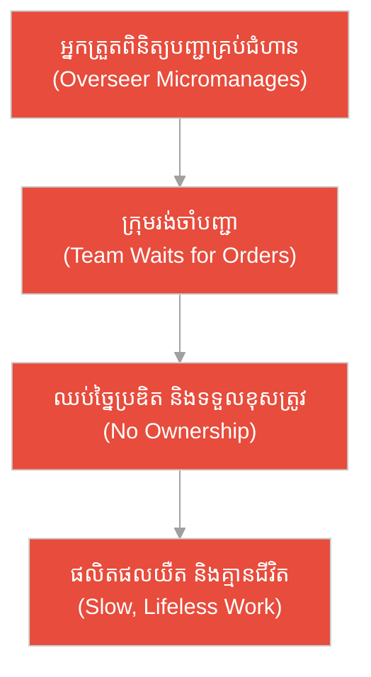
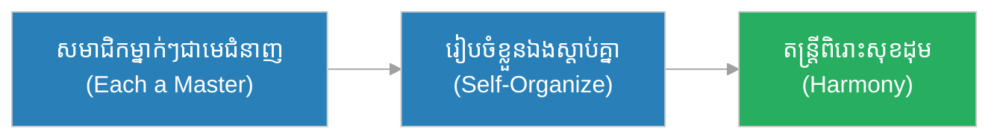
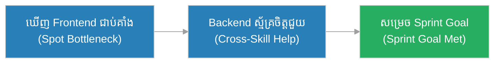
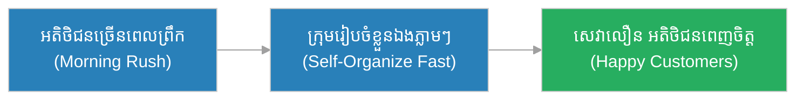
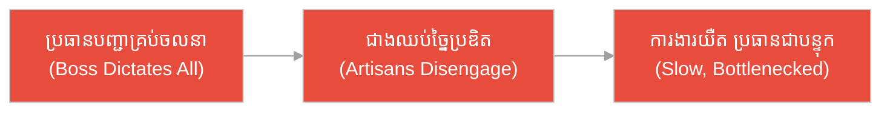
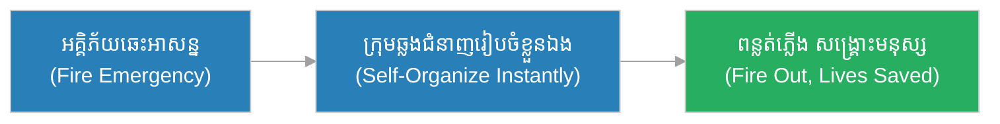
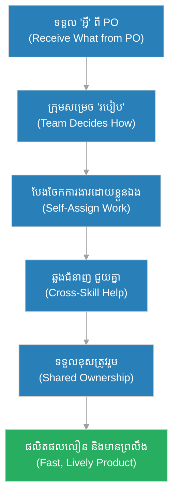

# ក្រុមអភិវឌ្ឍន៍ (Development Team)៖ ក្រុម​ជា​ងសិល្បៈប្រាសាទ និង​ការ​រៀបចំខ្លួនឯង (The Temple Artisans & Self-Organization)

**អ្នកនិពន្ធ (Author):** ichamrong 
**កាលបរិច្ឆេទ (Date):** 2026-05-29 
**ស្លាក (Tags):** #agile #scrum #development-team #parable 
**ប្រភេទ (Category):** Management & Leadership 
**រយៈពេលអាន (Read Time):** ~១២ នាទី (~12 min) 

---

## 📌 មាតិកា (Table of Contents)
- [អន្ទាក់​នៃ​ការ​ប្រគល់​ការ​ងារ (The Task-Assignment Trap)](#0)
- [១. រឿងប្រៀបប្រដូច៖ ក្រុម​ជា​ងសិល្បៈប្រាសាទ និង​អ្នក​ត្រួតពិនិត្យ​ដែល​បញ្​ជា​គ្រប់​ស្នាមដាក់ (The Parable: The Temple Artisans & The Micromanaging Overseer)](#1)
- [២. បញ្ហា៖ ការ​ច្រឡំថាក្រុម​ត្រូវ​ការ​អ្នក​ប្រគល់​ការ​ងារ (The Issue: The Myth That the Team Needs a Task-Assigner)](#2)
- [៣. ឧទាហរណ៍​ជាក់ស្តែង​ក្នុង​ពិភពពិត (Real World Examples)](#3)
 - [ឧទាហរណ៍​ទី ១ — កម្រិតស្រាល (ផ្ទាល់ខ្លួន)៖ ក្រុមតន្ត្រីភ្លេង​ការ (The Wedding Band)](#3-1)
 - [ឧទាហរណ៍​ទី ២ — កម្រិតមធ្យម (បច្ចេកទេស)៖ ក្រុមឆ្លងជំនាញ Frontend និង Backend (The Cross-Functional Team)](#3-2)
 - [ឧទាហរណ៍​ទី ៣ — កម្រិតមធ្យម (ធុរកិច្ច)៖ ក្រុមបើកហាងកាហ្វេ​ថ្មី​ដែល​រៀបចំខ្លួនឯង (The Café Opening Crew)](#3-3)
 - [ឧទាហរណ៍​ទី ៤ — កម្រិតមធ្យម (គ្រប់​គ្រង)៖ អ្នក​ត្រួតពិនិត្យ​ដែល​បញ្​ជា​គ្រប់​ជំហាន (The Micromanaged Workshop)](#3-4)
 - [ឧទាហរណ៍​ទី ៥ — កម្រិតធ្ងន់ (សង្គ្រោះបន្ទាន់)៖ ក្រុមពន្លត់អគ្គិភ័យ​ដែល​រៀបចំខ្លួនឯងភ្លាម ៗ (The Firefighting Crew)](#3-5)
- [៤. ការ​សន្ទនាបែបសាកសួរ (Socratic Dialogue: Being Assigned vs. Self-Organizing)](#4)
- [៥. ដំណោះស្រាយ៖ ការ​កសាង​ក្រុមអភិវឌ្ឍន៍​ដែល​រៀបចំខ្លួនឯង (The Solution: Building a Self-Organizing Team)](#5)
- [សេចក្តីសន្និដ្ឋាន (Conclusion)](#6)
- [ឯកសារយោង (References)](#7)
- [Related Posts](#8)

---

## អន្ទាក់​នៃ​ការ​ប្រគល់​ការ​ងារ (The Task-Assignment Trap)

នៅក្នុង​ក្រុមអភិវឌ្ឍន៍ យើង​តែ​ង​តែ​ជួបប្រទះនូវភាពផ្ទុយគ្នា​ពី​រ​យ៉ាង៖

* **អន្ទាក់​រង់ចាំបញ្​ជា (The Wait-for-Orders Trap):** «ខ្ញុំ​ជា​អ្នក​អភិវឌ្ឍ​ន៍ ខ្ញុំគ្រាន់​តែ​រង់ចាំចៅហ្វាយប្រគល់​ការ​ងារឱ្យខ្ញុំម្នាក់ ៗ ខ្ញុំ​មិន​ចាំបាច់សម្រេចចិត្តថានរណា​ធ្វើ​អ្វី​ឡើយ!»
* **អន្ទាក់​ឯកត្តជន (The Lone-Wolf Trap):** «ខ្ញុំ​ជា​ជំនាញ Backend ខ្ញុំ​ធ្វើ​តែ Backend ប៉ុណ្ណោះ ខ្ញុំ​មិន​ជួយ Frontend ឬ Testing ឡើយ — នោះ​មិន​មែន​ការ​ងារ​របស់​ខ្ញុំ!»

---

## ១. រឿងប្រៀបប្រដូច៖ ក្រុម​ជា​ងសិល្បៈប្រាសាទ និង​អ្នក​ត្រួតពិនិត្យ​ដែល​បញ្​ជា​គ្រប់​ស្នាមដាក់ (The Parable: The Temple Artisans & The Micromanaging Overseer)

កាល​ពី​ព្រេងនាយ មាន​ក្រុម​ជា​ងសិល្បៈដ៏ប៉ិនប្រសប់មួយ ត្រូវ​សាងសង់ប្រាសាទថ្មដ៏ស្រស់ស្អាត។ ក្នុង​ក្រុម​នោះ​មាន **ច័ន្ទ (Chan)** ជា​ជា​ងចម្លាក់ **ដារ៉ា (Dara)** ជា​ជា​ងបាយអ និង **រស្មី (Reaksmey)** ជា​ជា​ងគំនូរ។ ពួកគេម្នាក់ ៗ ជា​មេ​នៃ​ជំនាញខ្លួន។ គ្មាន​នរណាម្នាក់បញ្​ជា​គេថា​ត្រូវ​ដាក់ដែកគោលឆ្នុះត្រង់ណា ឬ​គូរបន្ទាត់ណា​មុន​ឡើយ — ពួកគេ **រៀបចំខ្លួនឯង (Self-organize)** ថានរណា​ធ្វើ​ផ្នែកណា ផ្អែក​លើ​ជំនាញ និង​ស្ថានភាព​ការ​ងារ។ នៅ​ពេល​ជា​ងចម្លាក់​ត្រូវ​ការ​ជំនួយ​លើ​កថ្មធ្ងន់ ជា​ងបាយអក៏​មក​ជួយ។ ដោយសារ​ពួកគេទុកចិត្តគ្នា និង​សម្រេចចិត្តរួមគ្នា ប្រាសាទ​នោះ​ក៏កើតឡើង​យ៉ាង​រស់រវើក និង​ពោរពេញ​ដោយ​ព្រលឹងសិល្បៈ។

ផ្ទុយ​ទៅ​វិញ មាន​ទីតាំងសាងសង់ប្រាសាទមួយទៀត ដែល​មាន​អ្នក​ត្រួតពិនិត្យ​ម្នាក់បញ្​ជា​គ្រប់​ស្នាមដាក់។ គាត់ប្រាប់​ជា​ងចម្លាក់ម្នាក់ ៗ ថា «ត្រូវ​ឆ្នុះត្រង់​នេះ កុំ​ឆ្នុះត្រង់​នោះ» គ្រប់​ចលនាដៃ។ ជា​ងម្នាក់ ៗ ក្លាយ​ជា​មនុស្សយន្ត​គ្មាន​គំនិត ឈប់ច្​នៃ​ប្រឌិត និង​ធ្វើ​ការ​យឺត ដោយ​រង់ចាំបញ្​ជា​នីមួយ ៗ ។ លទ្ធផល ប្រាសាទ​នោះ​កើតឡើង​យឺត គ្មាន​ជីវិត និង​គ្មាន​ព្រលឹងសិល្បៈ ដោយសារ​អ្នក​ត្រួតពិនិត្យ​បាន​បង្ខាំងសេរីភាព​នៃ​ជា​ងជំនាញ។

---

## ២. បញ្ហា៖ ការ​ច្រឡំថាក្រុម​ត្រូវ​ការ​អ្នក​ប្រគល់​ការ​ងារ (The Issue: The Myth That the Team Needs a Task-Assigner)

នៅក្នុង​ការ​គ្រប់​គ្រង​គម្រោង​បែប Agile, **ក្រុមអភិវឌ្ឍន៍ (Development Team)** គឺជា​ក្រុមឆ្លងជំនាញ (Cross-functional) និង​រៀបចំខ្លួនឯង (Self-organizing) ដែល​មាន​ជំនាញ​គ្រប់​គ្រាន់​ដើម្បី​បង្កើត​ផលិតផល​ដែល​អាចដាក់ដំណើរ​ការ​បាន។ ក្រុម​នេះ **ខ្លួនឯង** សម្រេចចិត្តថា «តើ​នរណា​ធ្វើ​អ្វី និង​ធ្វើ​តាម​របៀបណា (How)»។

ការ​ច្រឡំ ថាក្រុម​ត្រូវ​ការ​នរណាម្នាក់ប្រគល់​ការ​ងារ និង​បញ្​ជា​គ្រប់​ជំហាន គឺជា​ការ​សម្លាប់​ការ​ច្​នៃ​ប្រឌិត ការ​ទទួលខុស​ត្រូវ និង​ល្បឿន​របស់​ក្រុម។ ក្រុមមនុស្សយន្ត​ដែល​រង់ចាំបញ្​ជា មិន​អាច​បង្កើត​ផលិតផលដ៏​ល្អ​បាន​ឡើយ។

---

## ៣. ឧទាហរណ៍​ជាក់ស្តែង​ក្នុង​ពិភពពិត

សូមពិនិត្យមើលរបៀប​ដែល​ក្រុមរៀបចំខ្លួនឯងជះឥទ្ធិពលដល់កម្រិតជីវិត និង​ការ​ងារទាំង ៥ ខាងក្រោម៖

---

### ឧទាហរណ៍​ទី ១ — កម្រិតស្រាល (ផ្ទាល់ខ្លួន)៖ ក្រុមតន្ត្រីភ្លេង​ការ (The Wedding Band)

* **ស្ថានភាព៖** ក្រុមតន្ត្រីភ្លេង​ការ​មួយ​មាន​អ្នក​លេងពិណ អ្នក​វាយស្គរ និង​អ្នក​ច្រៀង។ គ្មាន​នរណាបញ្​ជា​គេថា​ត្រូវ​លេងណូតណា​ឡើយ — ពួកគេស្តាប់គ្នា​ទៅ​វិញ​ទៅ​មក រៀបចំខ្លួនឯងថានរណានាំ នរណា​តាម ផ្អែក​លើ​បទចម្រៀង។
* **លទ្ធផល៖** តន្ត្រីចេញ​មក​យ៉ាង​ពិរោះ និង​សុខដុមរមនា ដោយសារ​សមាជិក​ម្នាក់ ៗ ជា​មេជំនាញ និង​សម្របខ្លួន​ទៅ​តាម​គ្នា​ដោយ​ខ្លួនឯង។

---

### ឧទាហរណ៍​ទី ២ — កម្រិតមធ្យម (បច្ចេកទេស)៖ ក្រុមឆ្លងជំនាញ Frontend និង Backend (The Cross-Functional Team)

* **ស្ថានភាព៖** ក្នុង Sprint មួយ ការ​ងារ Backend ស្ទើររួច​រាល់ ប៉ុន្តែ Frontend នៅ​ជា​ប់គាំងច្រើន។ ដោយ​គ្មាន​នរណាបញ្​ជា អ្នក​អភិវឌ្ឍ​ន៍ Backend ឈ្មោះ ច័ន្ទ (Chan) ស្ម័គ្រចិត្ត​មក​ជួយ Frontend ដើម្បី​សម្រេច Sprint Goal។
* **លទ្ធផល៖** ក្រុមសម្រេច Sprint Goal ទាន់​ពេល​វេលា ដោយសារ​សមាជិក​រៀបចំខ្លួនឯង និង​ជួយគ្នាឆ្លងជំនាញ ដោយ​មិន​រង់ចាំ​ការ​ប្រគល់​ការ​ងារ​ពី​នរណាម្នាក់​ឡើយ។

---

### ឧទាហរណ៍​ទី ៣ — កម្រិតមធ្យម (ធុរកិច្ច)៖ ក្រុមបើកហាងកាហ្វេ​ថ្មី​ដែល​រៀបចំខ្លួនឯង (The Café Opening Crew)

* **ស្ថានភាព៖** ក្រុមបុគ្គលិកបើកហាងកាហ្វេ​ថ្មី​មួយ មិន​មាន​ចៅហ្វាយប្រគល់​ការ​ងារម្នាក់ ៗ ឡើយ។ នៅ​ពេល​អតិថិជនច្រើន​ពេល​ព្រឹក ពួកគេរៀបចំខ្លួនឯង — ម្នាក់ឆុងកាហ្វេ ម្នាក់ទទួល​ការ​កម្ម៉ង់ ម្នាក់សម្អាតតុ — ផ្អែក​លើ​ស្ថានភាព​ពិតប្រាកដ។
* **លទ្ធផល៖** អតិថិជនទទួលសេវា​លឿន និង​ពេញចិត្ត ដោយ​ក្រុមសម្របខ្លួន​យ៉ាង​រហ័ស ដោយសារ​ពួកគេឆ្លងជំនាញ និង​សម្រេចចិត្តរួមគ្នា។

---

### ឧទាហរណ៍​ទី ៤ — កម្រិតមធ្យម (គ្រប់​គ្រង)៖ អ្នក​ត្រួតពិនិត្យ​ដែល​បញ្​ជា​គ្រប់​ជំហាន (The Micromanaged Workshop)

* **ស្ថានភាព៖** នៅរោង​ជា​ងសិប្បកម្មមួយ ប្រធានរោង​ជា​ងបញ្​ជា​ជា​ងម្នាក់ ៗ គ្រប់​ចលនា — ត្រូវ​កាត់ឈើទំហំណា ត្រូវ​ខាត់ប៉ុន្​មាន​នាទី — ដោយ​មិន​ទុក​ការ​សម្រេចចិត្តឱ្យ​ជា​ងជំនាញ។
* **លទ្ធផល៖** ជា​ងម្នាក់ ៗ ឈប់ច្​នៃ​ប្រឌិត រង់ចាំបញ្​ជា​នីមួយ ៗ ការ​ងារ​យឺត ហើយប្រធានរោង​ជា​ងក្លាយ​ជា​បន្ទុក (Bottleneck) — ដូចទីតាំងសាងសង់ប្រាសាទ​ដែល​គ្មាន​ព្រលឹង។

---

### ឧទាហរណ៍​ទី ៥ — កម្រិតធ្ងន់ (សង្គ្រោះបន្ទាន់)៖ ក្រុមពន្លត់អគ្គិភ័យ​ដែល​រៀបចំខ្លួនឯងភ្លាម ៗ (The Firefighting Crew)

* **ស្ថានភាព៖** នៅ​ពេល​អគ្គិភ័យឆេះអគារ ក្រុមពន្លត់អគ្គិភ័យឆ្លងជំនាញ​ត្រូវ​ធ្វើ​សកម្មភាពភ្លាម ៗ ។ ដោយ​គ្មាន​ពេល​រង់ចាំបញ្​ជា​លម្អិត ពួកគេរៀបចំខ្លួនឯង — ម្នាក់បាញ់ទឹក ម្នាក់ជួយសង្គ្រោះមនុស្ស ម្នាក់​គ្រប់​គ្រងសម្ពាធទុយោ — ផ្អែក​លើ​ជំនាញ និង​ស្ថានភាពភ្លាម ៗ ។
* **លទ្ធផល៖** អគ្គិភ័យ​ត្រូវ​បាន​ពន្លត់ទាន់​ពេល​វេលា និង​សង្គ្រោះមនុស្ស​បាន​ជោគជ័យ ដោយសារ​ក្រុម​មាន​ជំនាញ​គ្រប់​គ្រាន់ និង​សម្រេចចិត្តរួមគ្នា​ដោយ​ខ្លួនឯង​ក្នុង​ភាពអាសន្ន។

---

## ៤. ការ​សន្ទនាបែបសាកសួរ (Socratic Dialogue: Being Assigned vs. Self-Organizing)

**សិស្ស (សមាជិក​ក្រុម​ថ្មី)៖** លោកគ្រូ! ខ្ញុំទើបចូល​ក្រុមអភិវឌ្ឍន៍ ប៉ុន្តែ​គ្មាន​នរណាប្រគល់​ការ​ងារឱ្យខ្ញុំម្នាក់ ៗ ឡើយ។ តើ​ខ្ញុំ​ត្រូវ​រង់ចាំចៅហ្វាយប្រាប់ខ្ញុំ ឬ?

**គ្រូ (វិស្វករ​ជា​ន់ខ្ពស់)៖** សួរ​ល្អ។ ខ្ញុំសុំសួរវិញ៖ នៅ​ពេល​ក្រុម​ជា​ងសិល្បៈសាងសង់ប្រាសាទ តើ​ពួកគេ​ត្រូវ​ការ​នរណាម្នាក់ប្រាប់​ជា​ងចម្លាក់ថា​ត្រូវ​ឆ្នុះត្រង់ណា​គ្រប់​ស្នាម​ឬ?

**សិស្ស៖** ប្រហែល​ជា​មិន​ទេ លោកគ្រូ។ ជា​ងចម្លាក់ខ្លួនឯងដឹងថា​ត្រូវ​ឆ្នុះត្រង់ណា ព្រោះ​គាត់​ជា​មេជំនាញ។

**គ្រូ៖** ត្រឹម​ត្រូវ។ ដូច្​នេះ តើ​ក្រុមអភិវឌ្ឍន៍​ដែល​ជា​មេជំនាញ គួររង់ចាំ​ការ​ប្រគល់​ការ​ងារ ឬ​គួររៀបចំខ្លួនឯងថានរណា​ធ្វើ​អ្វី?

**សិស្ស៖** គួររៀបចំខ្លួនឯង លោកគ្រូ។ ប៉ុន្តែ​បើ​គ្មាន​នរណាប្រគល់​ការ​ងារ តើ​យើងដឹងថា​ត្រូវ​ធ្វើ​អ្វី​ដោយ​របៀបណា?

**គ្រូ៖** នេះ​ហើយ​ជា​អន្ទាក់! Product Owner ប្រាប់ក្រុមនូវ **«អ្វី»** ដែល​មាន​តម្លៃ និង​អាទិភាព។ ប៉ុន្តែ **ក្រុមខ្លួនឯង** សម្រេចចិត្ត **«របៀប (How)»** — នរណា​ធ្វើ ប្រើបច្ចេកវិទ្យាអ្វី និង​បែងចែក​ការ​ងារ​យ៉ាង​ណា។ ការ​រៀបចំខ្លួនឯង​នេះ​ហើយ ដែល​ធ្វើ​ឱ្យក្រុម​លឿន និង​ច្​នៃ​ប្រឌិត។

**សិស្ស៖** ដូច្​នេះ ការ​ដែល​គ្មាន​នរណាប្រគល់​ការ​ងារ មិន​មែន​ជា​បញ្ហា ប៉ុន្តែ​ជា​សេរីភាពមែនទេ?

**គ្រូ៖** ត្រឹម​ត្រូវ​ហើយ។ ក្រុមដ៏​ល្អ ដូចជា​ក្រុម​ជា​ងសិល្បៈ ដែល​ទុកចិត្តគ្នា ឆ្លងជំនាញ និង​សម្រេចចិត្តរួមគ្នា — នោះ​ហើយ​ជា​ប្រភព​នៃ​ផលិតផល​ដែល​មាន​ព្រលឹង។

---

## ៥. ដំណោះស្រាយ៖ ការ​កសាង​ក្រុមអភិវឌ្ឍន៍​ដែល​រៀបចំខ្លួនឯង (The Solution: Building a Self-Organizing Team)

ដើម្បី​កសាង​ក្រុមអភិវឌ្ឍន៍​ដ៏​ខ្លាំង ត្រូវ​ប្រកាន់ខ្​ជា​ប់នូវគោល​ការ​ណ៍​ខាងក្រោម៖

1. **រៀបចំខ្លួនឯង (Self-organize):** ក្រុមខ្លួនឯងសម្រេចចិត្តថានរណា​ធ្វើ​អ្វី និង​ធ្វើ​តាម​របៀបណា ដោយ​ផ្អែក​លើ​ជំនាញ និង​ស្ថានភាព។
2. **ឆ្លងជំនាញ (Be Cross-functional):** ក្រុម​មាន​ជំនាញ​គ្រប់​គ្រាន់ (Frontend, Backend, Test, Design) ដើម្បី​បង្កើត​ផលិតផល​ដែល​អាចដាក់ដំណើរ​ការ​បាន ដោយ​មិន​ពឹង​លើ​ផ្នែក​ខាងក្រៅ។
3. **ទទួលខុស​ត្រូវ​រួម (Shared Ownership):** ជោគជ័យ និង​បរាជ័យ​ជា​របស់​ក្រុមទាំងមូល មិន​មែន​របស់​បុគ្គលណាម្នាក់​ឡើយ — ដូច្​នេះ​ម្នាក់ ៗ ជួយគ្នា។
4. **ទុកចិត្ត និង​ជួយគ្នា (Trust & Help):** នៅ​ពេល​ផ្នែកណា​ជា​ប់គាំង សមាជិក​ដទៃស្ម័គ្រចិត្ត​មក​ជួយ ដោយ​មិន​រង់ចាំ​ការ​ប្រគល់។

---

## 🐇 ធ្លាក់ចូល​ក្នុង​រន្ធទន្សាយ (Enter the Rabbit Hole)

ដើម្បី​យល់ដឹងកាន់​តែ​ស៊ីជម្រៅអំ​ពី​របៀប​ដែល​ក្រុមអភិវឌ្ឍន៍​សហការ និង​រៀបចំ​ការ​ងារ សូមស្វែងយល់បន្ថែម៖

* 🚀 **[ការ​រៀបចំផែន​ការ​វដ្ត​ការ​ងារ (Sprint Planning) ➔](../ceremonies/sprint-planning.md)**
* 🚀 **[តួនាទី​ក្នុង​ក្រុ​មក​ារងារ Scrum (Scrum Roles) ➔](./scrum-roles.md)**
* 🚀 **[ការសរសេរកូដជាគូ (Pair Programming) ➔](../practices/pair-programming.md)**

---

## សេចក្តីសន្និដ្ឋាន (Conclusion)

> **«ក្រុមអភិវឌ្ឍន៍​ដ៏​ល្អ មិន​ត្រូវ​ការ​នរណាម្នាក់បញ្​ជា​គ្រប់​ស្នាមឆ្នុះ​ឡើយ ប៉ុន្តែ​ជា​ក្រុម​ជា​ងជំនាញ​ដែល​រៀបចំខ្លួនឯង​បង្កើត​ស្នាដៃដ៏​មាន​ព្រលឹង។»**

ក្រុមអភិវឌ្ឍន៍​ដ៏​ខ្លាំង ដូចជា​ក្រុម​ជា​ងសិល្បៈប្រាសាទ ដែល​ម្នាក់ ៗ ជា​មេជំនាញ ទុកចិត្តគ្នា និង​សម្រេចចិត្តរួមគ្នាថានរណា​ធ្វើ​អ្វី។ ការ​ទុកសេរីភាព​នៃ «របៀប» ឱ្យក្រុម គឺជា​មាគ៌ា​ដែល​នាំ​ទៅ​រកផលិតផលដ៏​ល្អ និង​ពោរពេញ​ដោយ​ជីវិត។

---

## ឯកសារយោង (References)

* **Ken Schwaber & Jeff Sutherland** — *The Scrum Guide* (2020).
* **Kenneth S. Rubin** — *Essential Scrum: A Practical Guide to the Most Popular Agile Process* (2012).
* **Mike Cohn** — *Succeeding with Agile: Software Development Using Scrum* (2009).

---

## Related Posts

* [ការ​រៀបចំផែន​ការ​វដ្ត​ការ​ងារ (Sprint Planning)](../ceremonies/sprint-planning.md) — របៀបក្រុមជ្រើសរើស និង​បែងចែក​ការ​ងារ​ដោយ​ខ្លួនឯង​សម្រាប់ Sprint។
* [តួនាទី​ក្នុង​ក្រុ​មក​ារងារ Scrum (Scrum Roles)](./scrum-roles.md) — ការ​យល់ដឹង​ពី​តួនាទីច្បាស់លាស់​ក្នុង​ក្រុម Scrum។
* [ការសរសេរកូដជាគូ (Pair Programming)](../practices/pair-programming.md) — បច្ចេកទេស​សហការ​មួយ​ដែល​ក្រុមរៀបចំខ្លួនឯង​តែ​ងប្រើ។
