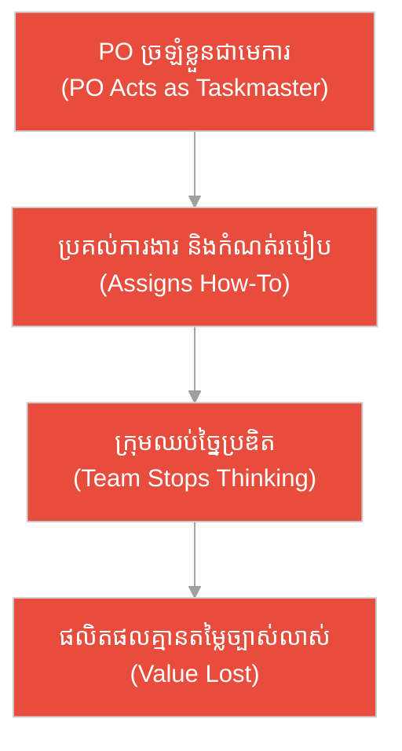
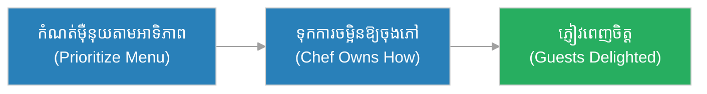
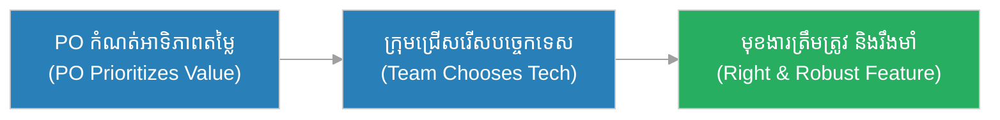
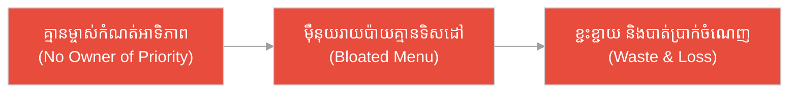
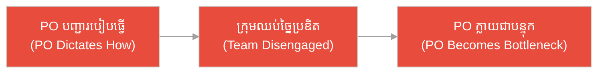
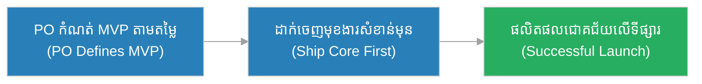
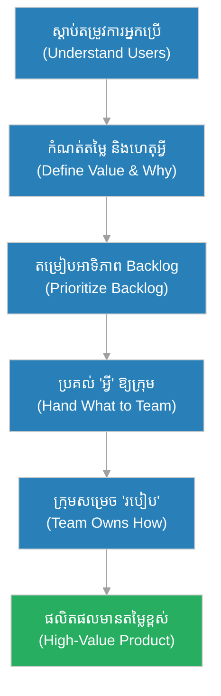

# ម្ចាស់ផលិតផល (Product Owner)៖ មេឈ្មួញផ្សារ និង​បញ្ជីទំនិញ​ដែល​ត្រូវ​លក់ (The Head Merchant & The Goods Worth Stocking)

**អ្នកនិពន្ធ (Author):** ichamrong 
**កាលបរិច្ឆេទ (Date):** 2026-05-29 
**ស្លាក (Tags):** #agile #scrum #product-owner #parable 
**ប្រភេទ (Category):** Management & Leadership 
**រយៈពេលអាន (Read Time):** ~១២ នាទី (~12 min) 

---

## 📌 មាតិកា (Table of Contents)
- [អន្ទាក់​នៃ​ភាព​ជា​ម្​ចាស់ (The Ownership Trap)](#0)
- [១. រឿងប្រៀបប្រដូច៖ មេឈ្មួញផ្សារ និង​ផ្សារដៃគូ​ដែល​លក់​របស់​គ្មាន​នរណា​ចង់ (The Parable: The Head Merchant & The Rival Market)](#1)
- [២. បញ្ហា៖ ការ​ច្រឡំ Product Owner ជា​អ្នក​គ្រប់​គ្រង​គម្រោង (The Issue: PO Mistaken for a Project Manager)](#2)
- [៣. ឧទាហរណ៍​ជាក់ស្តែង​ក្នុង​ពិភពពិត (Real World Examples)](#3)
 - [ឧទាហរណ៍​ទី ១ — កម្រិតស្រាល (ផ្ទាល់ខ្លួន)៖ ការ​រៀបចំម៉ឺនុយអាហារ​ពេល​ល្ងាច​សម្រាប់​ភ្ញៀវ (The Dinner Menu Priority)](#3-1)
 - [ឧទាហរណ៍​ទី ២ — កម្រិតមធ្យម (បច្ចេកទេស)៖ ការ​តម្រៀបអាទិភាពមុខងារ​កម្មវិធី​ទូរស័ព្ទ (The App Feature Priority)](#3-2)
 - [ឧទាហរណ៍​ទី ៣ — កម្រិតមធ្យម (ធុរកិច្ច)៖ ការ​បើកម៉ឺនុយ​ថ្មី​នៅភោជនីយដ្ឋាន​ដោយ​គ្មាន​ទិសដៅ (The Restaurant Menu Chaos)](#3-3)
 - [ឧទាហរណ៍​ទី ៤ — កម្រិតមធ្យម (គ្រប់​គ្រង)៖ ការ​ប្រគល់​ការ​ងារខុសតួនាទីដល់​ក្រុមអភិវឌ្ឍន៍ (The Micromanaging PO)](#3-4)
 - [ឧទាហរណ៍​ទី ៥ — កម្រិតធ្ងន់ (ការ​សម្រេចចិត្តធំ)៖ ការ​ដាក់លក់ផលិតផល​ថ្មី​លើ​ទីផ្សារ (The Product Launch Decision)](#3-5)
- [៤. ការ​សន្ទនាបែបសាកសួរ (Socratic Dialogue: Assigning Tasks vs. Owning Value)](#4)
- [៥. ដំណោះស្រាយ៖ ការ​ធ្វើ​ជា Product Owner ដ៏​មាន​ប្រសិទ្ធភាព (The Solution: Being an Effective Product Owner)](#5)
- [សេចក្តីសន្និដ្ឋាន (Conclusion)](#6)
- [ឯកសារយោង (References)](#7)
- [Related Posts](#8)

---

## អន្ទាក់​នៃ​ភាព​ជា​ម្​ចាស់ (The Ownership Trap)

នៅក្នុង​តួនាទី​ជា Product Owner យើង​តែ​ង​តែ​ជួបប្រទះនូវភាពផ្ទុយគ្នា​ពី​រ​យ៉ាង៖

* **អន្ទាក់​មេ​ការ (The Taskmaster Trap):** «ខ្ញុំ​ជា Product Owner ដូច្​នេះ​ខ្ញុំ​ជា​អ្នក​ប្រាប់​អ្នក​អភិវឌ្ឍ​ន៍ម្នាក់ ៗ ថា​ត្រូវ​សរសេរ​កូដ​បែបណា និង​ធ្វើ​ការ​ងារមួយណា​មុន​មួយណា​ក្រោយ!»
* **អន្ទាក់​ម្​ចាស់​ផ្ទះ​មិន​នៅផ្ទះ (The Absentee Trap):** «ខ្ញុំគ្រាន់​តែ​ជា​អ្នក​សរសេរ​បញ្ជីការងារ រួចទុកឱ្យក្រុមសម្រេចចិត្ត​ដោយ​ខ្លួនឯងថាអ្វីសំខាន់ ខ្ញុំ​មិន​ចាំបាច់កំណត់អាទិភាពទេ!»

---

## ១. រឿងប្រៀបប្រដូច៖ មេឈ្មួញផ្សារ និង​ផ្សារដៃគូ​ដែល​លក់​របស់​គ្មាន​នរណា​ចង់ (The Parable: The Head Merchant & The Rival Market)

កាល​ពី​ព្រេងនាយ មាន​ផ្សារដ៏មមាញឹកមួយនៅចំកណ្តាលភូមិ ដែល​ដឹកនាំ​ដោយ​មេឈ្មួញម្នាក់ឈ្មោះ **ច័ន្ទ (Chan)**។ ច័ន្ទ​មិន​មែន​ជា​អ្នក​លក់ផ្ទាល់​នោះ​ទេ ប៉ុន្តែ​គាត់ស្គាល់បំណងប្រាថ្នា​របស់​អ្នក​ភូមិច្បាស់លាស់​ជា​ងគេ។ រាល់ព្រឹក គាត់សម្រេចចិត្តថា «តើ​ទំនិញមួយណា​ដែល​អ្នក​ភូមិ​ត្រូវ​ការ​ខ្លាំង​បំផុតថ្ងៃ​នេះ?» — ស្រូវ មុន​អំបិល មុន​ក្រណាត់ — ហើយគាត់រៀបបញ្ជីអាទិភាព​នោះ​ប្រគល់ឱ្យ​អ្នក​លក់ម្នាក់ ៗ ។ ប៉ុន្តែ ច័ន្ទ​មិន​ដែល​ប្រាប់​អ្នក​លក់ថា «ត្រូវ​រៀបស្តង់បែបណា ត្រូវ​ដាក់ស្រូវខាងឆ្វេង ឬ​ខាងស្តាំ» នោះ​ឡើយ។ គាត់ប្រាប់​តែ **អ្វី (What)** និង **ហេតុអ្វី (Why)** និង​លំដាប់អាទិភាព ហើយទុក **របៀប (How)** ឱ្យ​អ្នក​លក់ជំនាញម្នាក់ ៗ សម្រេចចិត្ត​ដោយ​ខ្លួនឯង។ ដោយសារ​ផ្សារ​នេះ​តែ​ង​តែ​មាន​ទំនិញ​ដែល​ត្រូវ​នឹងតម្រូវ​ការ វាក៏ចម្រុងចម្រើនថ្ងៃ​រាល់ថ្ងៃ។

ផ្ទុយ​ទៅ​វិញ មាន​ផ្សារដៃគូមួយទៀតនៅខាងកើតភូមិ ដែល​គ្មាន​មេឈ្មួញកំណត់ទិសដៅ​ឡើយ។ អ្នក​លក់ម្នាក់ ៗ យកទំនិញ​តាម​តែ​ចិត្តនឹកឃើញ — ម្នាក់យកស្បែកជើងព្រិល ម្នាក់យកគ្រឿងលំអដ៏ថ្លៃ ដែល​គ្មាន​អ្នក​ភូមិណា​មាន​លុយទិញ។ ស្តង់ពេញ​ទៅ​ដោយ​ទំនិញ ប៉ុន្តែ​គ្មាន​នរណាម្នាក់​ត្រូវ​ការ​ទេ។ មិន​យូរប៉ុន្​មាន ផ្សារ​នោះ​ក៏​ត្រូវ​បិទទ្វារ ដោយសារ​ខ្វះមនុស្សម្នាក់​ដែល​ដឹងថា «តើ​អ្វី​ដែល​មាន​តម្លៃ​ត្រូវ​លក់» និង​កំណត់អាទិភាពឱ្យច្បាស់លាស់។

---

## ២. បញ្ហា៖ ការ​ច្រឡំ Product Owner ជា​អ្នក​គ្រប់​គ្រង​គម្រោង (The Issue: PO Mistaken for a Project Manager)

នៅក្នុង​ការ​គ្រប់​គ្រង​គម្រោង​បែប Agile, **ម្ចាស់ផលិតផល (Product Owner)** គឺជា​បុគ្គល​ដែល​ទទួលខុស​ត្រូវ​លើ **តម្លៃ (Value)** នៃ​ផលិតផល។ គាត់​ជា​ម្​ចាស់​នៃ **Product Backlog** គឺ​កំណត់ថា «ត្រូវ​ធ្វើ​អ្វី (What)» «ហេតុអ្វី (Why)» និង «តាម​លំដាប់អាទិភាពណា (Priority)»។ គាត់ **មិន​មែន** ជា​អ្នក​គ្រប់​គ្រង​គម្រោង​ដែល​ប្រគល់​ការ​ងារ និង​ប្រាប់ក្រុមថា «ត្រូវ​ធ្វើ​ការ​ងារ​នេះ​តាម​របៀបណា (How)» នោះ​ទេ។

ប្រសិនបើ Product Owner យល់ច្រឡំខ្លួនឯង​ជា «មេ​ការ» ដែល​ប្រគល់ភារកិច្ច គាត់នឹងបំផ្លាញ​ការ​រៀបចំខ្លួនឯង​របស់​ក្រុម (Self-organization) និង​ធ្វើ​ឱ្យក្រុ​មក​្លាយ​ជា​មនុស្សយន្ត​គ្មាន​គំនិតច្​នៃ​ប្រឌិត។

---

## ៣. ឧទាហរណ៍​ជាក់ស្តែង​ក្នុង​ពិភពពិត

សូមពិនិត្យមើលរបៀប​ដែល​តួនាទី Product Owner ជះឥទ្ធិពលដល់កម្រិតជីវិត និង​ការ​ងារទាំង ៥ ខាងក្រោម៖

---

### ឧទាហរណ៍​ទី ១ — កម្រិតស្រាល (ផ្ទាល់ខ្លួន)៖ ការ​រៀបចំម៉ឺនុយអាហារ​ពេល​ល្ងាច​សម្រាប់​ភ្ញៀវ (The Dinner Menu Priority)

* **ស្ថានភាព៖** រស្មី (Reaksmey) ជា​ម្​ចាស់​ផ្ទះ ត្រូវ​រៀបចំអាហារ​ពេល​ល្ងាច​សម្រាប់​ភ្ញៀវ។ នាងសម្រេចចិត្តថា «ត្រូវ​ធ្វើ​ម្ហូបអ្វី» តាម​អាទិភាព (ម្ហូបសម្ល មុន​បង្អែម) ដោយ​ផ្អែក​លើ​ចំណូលចិត្តភ្ញៀវ ប៉ុន្តែ​ទុកឱ្យចុងភៅជំនាញសម្រេចចិត្ត «តើ​ត្រូវ​ចម្អិនបែបណា»។
* **លទ្ធផល៖** ភ្ញៀវពេញចិត្តម្ហូប​យ៉ាង​ខ្លាំង ព្រោះ​ម៉ឺនុយ​ត្រូវ​នឹងចំណូលចិត្ត ហើយចុងភៅ​មាន​សេរីភាព​បង្ហាញ​ជំនាញ។

---

### ឧទាហរណ៍​ទី ២ — កម្រិតមធ្យម (បច្ចេកទេស)៖ ការ​តម្រៀបអាទិភាពមុខងារ​កម្មវិធី​ទូរស័ព្ទ (The App Feature Priority)

* **ស្ថានភាព៖** ដារ៉ា (Dara) ជា Product Owner នៃ​កម្មវិធី​ដឹកជញ្ជូនអាហារ។ គាត់រៀបបញ្ជី Product Backlog ដោយ​ដាក់ «មុខងារទូទាត់ប្រាក់​តាម ABA» នៅលំដាប់កំពូល ព្រោះ​អ្នក​ប្រើទាមទារ​ខ្លាំង។ គាត់ប្រាប់ក្រុមនូវ «តម្លៃ» នៃ​មុខងារ​នេះ ប៉ុន្តែ​ទុក​ការ​ជ្រើសរើស API និង​ស្ថាបត្យកម្​មក​ូដឱ្យ​ក្រុមអភិវឌ្ឍន៍។
* **លទ្ធផល៖** ក្រុមអភិវឌ្ឍន៍​សាងសង់មុខងារត្រឹម​ត្រូវ​តាម​អាទិភាព និង​ជ្រើសរើស​ដំណោះស្រាយ​បច្ចេកទេស​ល្អ​បំផុត​ដោយ​ខ្លួនឯង។

---

### ឧទាហរណ៍​ទី ៣ — កម្រិតមធ្យម (ធុរកិច្ច)៖ ការ​បើកម៉ឺនុយ​ថ្មី​នៅភោជនីយដ្ឋាន​ដោយ​គ្មាន​ទិសដៅ (The Restaurant Menu Chaos)

* **ស្ថានភាព៖** ភោជនីយដ្ឋានមួយ​គ្មាន​នរណាម្នាក់ទទួលខុស​ត្រូវ​កំណត់អាទិភាពម៉ឺនុយ។ ចុងភៅម្នាក់ ៗ បន្ថែមម្ហូប​ថ្មី ៗ តាម​ចិត្តរៀង ៗ ខ្លួន រហូតម៉ឺនុយ​មាន​ម្ហូប ២០០ មុខ​ដែល​គ្មាន​នរណាបញ្​ជា​ទិញ និង​ធ្វើ​ឱ្យចំណាយវត្ថុធាតុដើមខ្ជះខ្​ជា​យ។
* **លទ្ធផល៖** អតិថិជនច្របូកច្របល់ ម៉ឺនុយវែងពេក គ្មាន​ម្ហូបពិសេសច្បាស់លាស់ ហើយភោជនីយដ្ឋានបាត់បង់ប្រាក់ចំណេញ ដោយសារ​ខ្វះម្​ចាស់​កំណត់អាទិភាពតម្លៃ។

---

### ឧទាហរណ៍​ទី ៤ — កម្រិតមធ្យម (គ្រប់​គ្រង)៖ ការ​ប្រគល់​ការ​ងារខុសតួនាទីដល់​ក្រុមអភិវឌ្ឍន៍ (The Micromanaging PO)

* **ស្ថានភាព៖** សុខ (Sok) ជា Product Owner ប៉ុន្តែ​គាត់ច្រឡំខ្លួន​ជា​មេ​ការ។ រាល់ព្រឹក គាត់ប្រគល់​ការ​ងារ​ទៅ​អ្នក​អភិវឌ្ឍ​ន៍ម្នាក់ ៗ និង​បញ្​ជា​ថា «ត្រូវ​សរសេរ​កូដ​នេះ​តាម​របៀប​នេះ» ដោយ​មិន​ទុកសិទ្ធិសម្រេចចិត្តបច្ចេកទេសឱ្យក្រុម​ឡើយ។
* **លទ្ធផល៖** ក្រុមអភិវឌ្ឍន៍​បាត់បង់​ការ​ច្​នៃ​ប្រឌិត ឈប់ផ្តល់យោបល់ប្រសើរ ហើយ Sok ក្លាយ​ជា​បន្ទុក (Bottleneck) ដែល​ធ្វើ​ឱ្យ​គម្រោង​យឺត​យ៉ាវ និង​គុណភាព​ធ្លាក់ចុះ។

---

### ឧទាហរណ៍​ទី ៥ — កម្រិតធ្ងន់ (ការ​សម្រេចចិត្តធំ)៖ ការ​ដាក់លក់ផលិតផល​ថ្មី​លើ​ទីផ្សារ (The Product Launch Decision)

* **ស្ថានភាព៖** មុន​ពេល​ដាក់លក់​កម្មវិធី​ធនាគារចល័ត​ថ្មី ដារ៉ា (Dara) ជា Product Owner ត្រូវ​សម្រេចចិត្តថា «តើ​មុខងារណា​ដែល​ត្រូវ​ដាក់ចេញ​មុន​គេ (MVP)?» ដោយ​ផ្អែក​លើ​តម្លៃអាជីវកម្ម និង​សុវត្ថិភាព​អ្នក​ប្រើ។ គាត់ដាក់អាទិភាព «សុវត្ថិភាពចូលប្រើ និង​ការ​ផ្ទេរប្រាក់» នៅកំពូល ហើយពន្យារមុខងារតុប​តែ​ងលំអ​ទៅ​ពេល​ក្រោយ។
* **លទ្ធផល៖** ផលិតផលដាក់ចេញទាន់​ពេល​ជា​មួយមុខងារសំខាន់បំផុត ទទួល​បាន​ទំនុកចិត្ត​ពី​អ្នក​ប្រើ និង​ជោគជ័យ​លើ​ទីផ្សារ ដោយសារ PO កំណត់អាទិភាពតម្លៃត្រឹម​ត្រូវ។

---

## ៤. ការ​សន្ទនាបែបសាកសួរ (Socratic Dialogue: Assigning Tasks vs. Owning Value)

**សិស្ស (អ្នក​អភិវឌ្ឍ​ន៍)៖** លោកគ្រូ! Product Owner របស់​ពួកយើងប្រគល់​ការ​ងារឱ្យពួកយើងម្នាក់ ៗ រាល់ព្រឹក ហើយប្រាប់ថា​ត្រូវ​សរសេរ​កូដ​បែបណាទៀតផង។ តើ​នេះ​មែន​ជា​ការ​ងារ​របស់​គាត់​ឬ?

**គ្រូ (Agile Coach)៖** សួរ​ល្អ​ណាស់។ ខ្ញុំសុំសួរវិញ៖ តើ​នៅក្នុង​ផ្សារ មេឈ្មួញ​ដែល​ដឹងតម្រូវ​ការ​អ្នក​ភូមិ គួរប្រាប់​អ្នក​លក់ថា «ត្រូវ​លក់អ្វី» ឬ​ប្រាប់ថា «ត្រូវ​រៀបស្តង់បែបណា»?

**សិស្ស៖** គួរប្រាប់ថា «ត្រូវ​លក់អ្វី» ប៉ុណ្ណោះ លោកគ្រូ។ ការ​រៀបស្តង់​គឺជា​ជំនាញ​របស់​អ្នក​លក់។

**គ្រូ៖** ត្រឹម​ត្រូវ។ ដូច្​នេះ តើ Product Owner គួរ​ជា​ម្​ចាស់​នៃ «អ្វី (What)» និង «ហេតុអ្វី (Why)» ឬ​ជា​ម្​ចាស់​នៃ «របៀប (How)»?

**សិស្ស៖** ប្រហែល​ជា «អ្វី» និង «ហេតុអ្វី» លោកគ្រូ។ ប៉ុន្តែ​បើគាត់​មិន​ប្រគល់​ការ​ងារ តើ​នរណាសម្រេចចិត្តថាខ្ញុំ​ធ្វើ​អ្វី​មុន?

**គ្រូ៖** នេះ​ហើយ​ជា​អន្ទាក់! Product Owner កំណត់ **អាទិភាព** នៃ Product Backlog — គឺ​ថា «មុខងារណា​មាន​តម្លៃខ្ពស់​ត្រូវ​ធ្វើ​មុន»។ ប៉ុន្តែ **ក្រុមអភិវឌ្ឍន៍​ខ្លួនឯង** ជ្រើសរើសថា «តើ​នរណា​ធ្វើ និង​ធ្វើ​តាម​របៀបណា»។ Product Owner ជា​ម្​ចាស់​នៃ **តម្លៃ** មិន​មែន​ជា​មេ​ការ​នៃ **កិច្ច​ការ** ឡើយ។

**សិស្ស៖** ដូច្​នេះ​បើគាត់ឈប់បញ្​ជា​របៀប​ធ្វើ ហើយផ្តោត​លើ​តម្លៃ និង​អាទិភាពវិញ ផលិតផលនឹង​ល្អ​ជា​ង មែនទេ?

**គ្រូ៖** ត្រឹម​ត្រូវ​ហើយ។ ម្ចាស់ផលិតផល​ដ៏​ល្អ ប្រាប់ក្រុមនូវ «ភ្នំ» ដែល​ត្រូវ​ឡើង មិន​មែនជ្រើសរើសជើងម្នាក់ ៗ ថា​ជា​ន់ថ្មណាមួយ​ឡើយ។

---

## ៥. ដំណោះស្រាយ៖ ការ​ធ្វើ​ជា Product Owner ដ៏​មាន​ប្រសិទ្ធភាព (The Solution: Being an Effective Product Owner)

ដើម្បី​ធ្វើ​ជា Product Owner ដ៏​ល្អ បុគ្គល​នោះ​ត្រូវ​ផ្តោត​លើ **តម្លៃ** និង​គោល​ការ​ណ៍​ខាងក្រោម៖

1. **ជា​ម្​ចាស់​នៃ «អ្វី» និង «ហេតុអ្វី» (Own the What & Why):** កំណត់ច្បាស់លាស់ថាផលិតផល​ត្រូវ​ដោះស្រាយ​បញ្ហា​អ្វី និង​សម្រាប់​នរណា ប៉ុន្តែ​ទុក «របៀប (How)» ឱ្យ​ក្រុមអភិវឌ្ឍន៍។
2. **កំណត់អាទិភាព Product Backlog (Prioritize Ruthlessly):** តម្រៀប​ការ​ងារ​តាម​តម្លៃអាជីវកម្ម ដោយ​ដាក់អ្វី​ដែល​សំខាន់បំផុតនៅកំពូល​ជា​និច្ច។
3. **ការ​អាចទាក់ទង​បាន (Be Available):** ឆ្​លើ​យសំណួរ​របស់​ក្រុមអំ​ពី​តម្រូវ​ការ និង​តម្លៃ​យ៉ាង​ឆាប់​រហ័ស ដើម្បី​កុំ​ឱ្យក្រុម​ជា​ប់គាំង។
4. **និយាយ «ទេ» ឱ្យ​បាន (Say No):** ការ​ពារ Product Backlog ពី​ការ​ងារ​ដែល​គ្មាន​តម្លៃ ដើម្បី​ផ្តោត​លើ​អ្វី​ដែល​សំខាន់បំផុត។

---

## 🐇 ធ្លាក់ចូល​ក្នុង​រន្ធទន្សាយ (Enter the Rabbit Hole)

ដើម្បី​យល់ដឹងកាន់​តែ​ស៊ីជម្រៅអំ​ពី​ឧបករណ៍​ដែល Product Owner ប្រើ​ដើម្បី​គ្រប់​គ្រងតម្លៃ សូមស្វែងយល់បន្ថែម៖

* 🚀 **[បញ្ជីការងារផលិតផល (Product Backlog) ➔](../artifacts/product-backlog.md)**
* 🚀 **[រឿងរ៉ាវ​អ្នកប្រើប្រាស់ (User Story) ➔](../artifacts/user-story.md)**
* 🚀 **[លក្ខខណ្ឌ​នៃ​ការ​ទទួលយក (Acceptance Criteria) ➔](../artifacts/acceptance-criteria.md)**

---

## សេចក្តីសន្និដ្ឋាន (Conclusion)

> **«Product Owner ជា​ម្​ចាស់​នៃ «អ្វី» និង «ហេតុអ្វី» មិន​មែន​ជា​មេ​ការ​នៃ «របៀប» ឡើយ។»**

ម្ចាស់ផលិតផល​ដ៏​ល្អ ដូចជា​មេឈ្មួញផ្សារដ៏ឆ្លាតវៃ ដែល​ដឹងច្បាស់ថា​អ្នក​ភូមិ​ត្រូវ​ការ​អ្វី កំណត់អាទិភាពទំនិញឱ្យត្រឹម​ត្រូវ ប៉ុន្តែ​ទុកសិល្បៈ​នៃ​ការ​លក់ឱ្យ​អ្នក​ជំនាញម្នាក់ ៗ ។ នេះ​ហើយ​ជា​មាគ៌ា​ដែល​នាំផលិតផល​ទៅ​រកជោគជ័យ និង​តម្លៃ​ពិតប្រាកដ។

---

## ឯកសារយោង (References)

* **Ken Schwaber & Jeff Sutherland** — *The Scrum Guide* (2020).
* **Roman Pichler** — *Agile Product Management with Scrum* (2010).
* **Kenneth S. Rubin** — *Essential Scrum: A Practical Guide to the Most Popular Agile Process* (2012).

---

## Related Posts

* [បញ្ជីការងារផលិតផល (Product Backlog)](../artifacts/product-backlog.md) — ឧបករណ៍សំខាន់បំផុត​ដែល Product Owner ប្រើ​ដើម្បី​កំណត់អាទិភាពតម្លៃ។
* [រឿងរ៉ាវ​អ្នកប្រើប្រាស់ (User Story)](../artifacts/user-story.md) — របៀប​បង្ហាញ​តម្រូវ​ការ​អ្នក​ប្រើ​ជា​ទម្រង់ងាយយល់​សម្រាប់​ក្រុម។
* [ភាគីពាក់ព័ន្ធ (Stakeholders)](./stakeholders.md) — អ្នក​ដែល Product Owner ត្រូវ​សម្របសម្រួល​ដើម្បី​យល់​ពី​តម្លៃអាជីវកម្ម។
