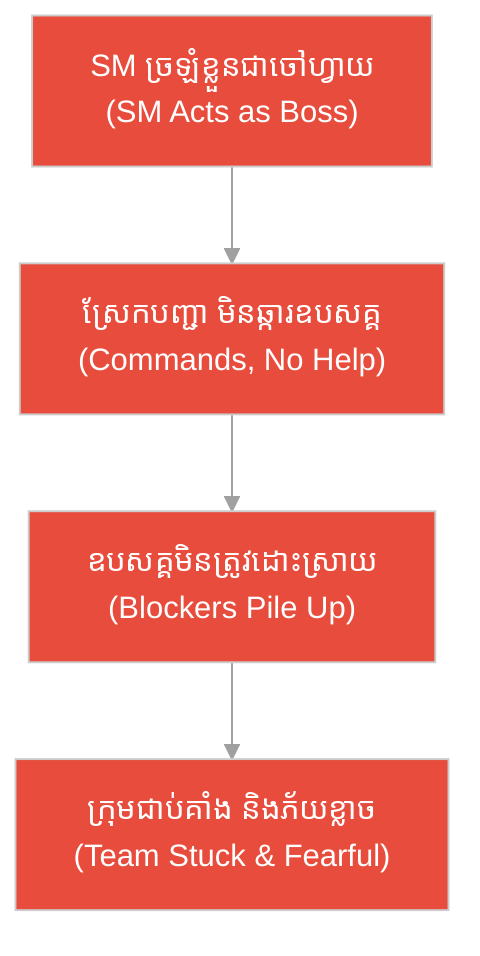
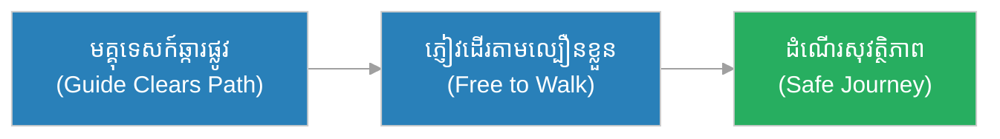
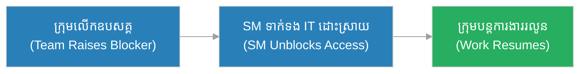
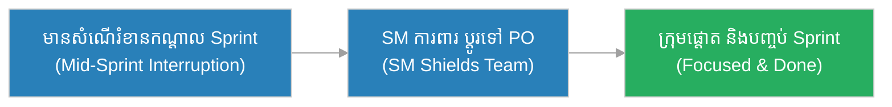
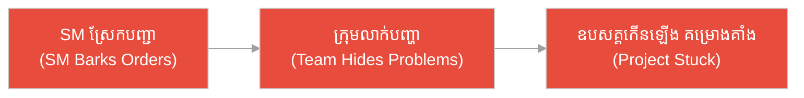
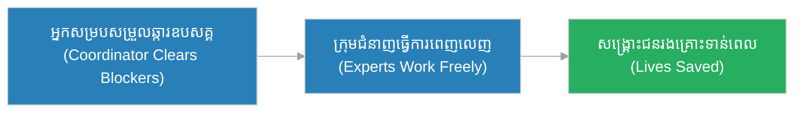
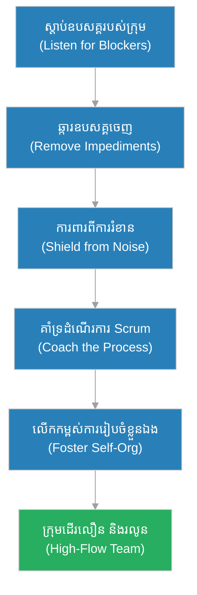

# គ្រូ Scrum (Scrum Master)៖ មេក្រុមឆ្​ការ​ផ្លូវ និង​ដើមឈើ​ដែល​រារាំង​ខ្បួនរទេះ (The Path-Clearing Crew Chief & The Fallen Trees)

**អ្នកនិពន្ធ (Author):** ichamrong 
**កាលបរិច្ឆេទ (Date):** 2026-05-29 
**ស្លាក (Tags):** #agile #scrum #scrum-master #parable 
**ប្រភេទ (Category):** Management & Leadership 
**រយៈពេលអាន (Read Time):** ~១២ នាទី (~12 min) 

---

## 📌 មាតិកា (Table of Contents)
- [អន្ទាក់​នៃ​ភាព​ជា​អ្នក​ដឹកនាំ (The Leadership Trap)](#0)
- [១. រឿងប្រៀបប្រដូច៖ មេក្រុមឆ្​ការ​ផ្លូវ និង​ខ្បួនរទេះ​ដែល​ជា​ប់គាំង (The Parable: The Crew Chief & The Stuck Caravan)](#1)
- [២. បញ្ហា៖ ការ​ច្រឡំ Scrum Master ជា​ចៅហ្វាយក្រុម (The Issue: Scrum Master Mistaken for a Boss)](#2)
- [៣. ឧទាហរណ៍​ជាក់ស្តែង​ក្នុង​ពិភពពិត (Real World Examples)](#3)
 - [ឧទាហរណ៍​ទី ១ — កម្រិតស្រាល (ផ្ទាល់ខ្លួន)៖ មគ្គុទេសក៍ផ្លូវលំ​ក្នុង​ព្រៃ (The Trail Guide)](#3-1)
 - [ឧទាហរណ៍​ទី ២ — កម្រិតមធ្យម (បច្ចេកទេស)៖ ការ​ដោះស្រាយ​ការ​រង់ចាំសិទ្ធិចូលប្រើ Server (The Access Blocker)](#3-2)
 - [ឧទាហរណ៍​ទី ៣ — កម្រិតមធ្យម (ធុរកិច្ច)៖ ការ​ការ​ពារក្រុម​ពី​ការ​ផ្តាច់ផ្តិលពាក្យបញ្​ជា (The Interruption Shield)](#3-3)
 - [ឧទាហរណ៍​ទី ៤ — កម្រិតមធ្យម (គ្រប់​គ្រង)៖ មេក្រុម​ដែល​គ្រាន់​តែ​ស្រែកបញ្​ជា (The Barking Chief)](#3-4)
 - [ឧទាហរណ៍​ទី ៥ — កម្រិតធ្ងន់ (សង្គ្រោះបន្ទាន់)៖ ការ​សម្របសម្រួល​ក្រុម​ឆ្លើយតប​គ្រោះមហន្តរាយ (The Disaster Response Coordination)](#3-5)
- [៤. ការ​សន្ទនាបែបសាកសួរ (Socratic Dialogue: Commanding vs. Serving)](#4)
- [៥. ដំណោះស្រាយ៖ ការ​ធ្វើ​ជា Scrum Master ដ៏​មាន​ប្រសិទ្ធភាព (The Solution: Being an Effective Scrum Master)](#5)
- [សេចក្តីសន្និដ្ឋាន (Conclusion)](#6)
- [ឯកសារយោង (References)](#7)
- [Related Posts](#8)

---

## អន្ទាក់​នៃ​ភាព​ជា​អ្នក​ដឹកនាំ (The Leadership Trap)

នៅក្នុង​តួនាទី​ជា Scrum Master យើង​តែ​ង​តែ​ជួបប្រទះនូវភាពផ្ទុយគ្នា​ពី​រ​យ៉ាង៖

* **អន្ទាក់​ចៅហ្វាយ (The Boss Trap):** «ខ្ញុំ​ជា Scrum Master ដូច្​នេះ​ខ្ញុំ​ជា​ចៅហ្វាយក្រុម! ខ្ញុំចែក​ការ​ងារ វាយតម្លៃបុគ្គលិក និង​ស្រែកបញ្​ជា​ឱ្យពួកគេ​ធ្វើ​ការ!»
* **អន្ទាក់​អ្នក​សម្របសម្រួល​អកម្ម (The Passive Trap):** «ខ្ញុំគ្រាន់​តែ​កក់ប្រជុំ និង​កត់ត្រាប៉ុណ្ណោះ ខ្ញុំ​មិន​ចាំបាច់ដោះស្រាយឧបសគ្គ ឬ​ការ​ពារក្រុម​ឡើយ — នោះ​មិន​មែន​ការ​ងារ​របស់​ខ្ញុំទេ!»

---

## ១. រឿងប្រៀបប្រដូច៖ មេក្រុមឆ្​ការ​ផ្លូវ និង​ខ្បួនរទេះ​ដែល​ជា​ប់គាំង (The Parable: The Crew Chief & The Stuck Caravan)

កាល​ពី​ព្រេងនាយ មាន​ខ្បួនរទេះឈ្មួញដ៏វែងមួយ ត្រូវ​ធ្វើ​ដំណើរឆ្លងកាត់ព្រៃភ្នំ​ទៅកាន់​ទីក្រុង។ ផ្លូវ​នោះ​ពោពេញ​ទៅ​ដោយ​ដើមឈើដួល និង​ថ្មធំ ៗ រារាំង។ មេក្រុមឆ្​ការ​ផ្លូវម្នាក់ឈ្មោះ **ច័ន្ទ (Chan)** មិន​បាន​ដេក​លើ​រទេះ ឬ​ស្រែកបញ្​ជា​អ្នក​បររទេះ​ឡើយ។ ផ្ទុយ​ទៅ​វិញ គាត់ដើរនាំមុខខ្បួន — រកឃើញដើមឈើដួល គាត់ក៏អារវាចេញ ឃើញថ្មធំ គាត់ក៏រុញវាចេញ​ពី​ផ្លូវ។ គាត់​ជា **អ្នក​បម្រើ** ដែល​ឆ្​ការ​ផ្លូវ មិន​មែន​ជា​ចៅហ្វាយ​ដែល​វាយរំពាត់​អ្នក​បររទេះ​ឡើយ។ ដោយសារ​ផ្លូវឆ្​ការ​ស្អាត រទេះម្នាក់ ៗ បន្តដំណើរ​បាន​រលូន និង​ទៅ​ដល់ទីក្រុងទាន់​ពេល​វេលា។

ផ្ទុយ​ទៅ​វិញ មាន​ខ្បួនរទេះមួយទៀត​ដែល​ដឹកនាំ​ដោយ «អ្នក​ដឹកនាំ» ម្នាក់ ដែល​គ្រាន់​តែ​អង្គុយ​លើ​សេះ ស្រែកបញ្​ជា​ថា «បរ​លឿន​ឡើង! កុំ​ខ្ជិល!» ប៉ុន្តែ​មិន​ដែល​ឆ្​ការ​ដើមឈើ ឬ​ថ្មចេញ​ពី​ផ្លូវ​ឡើយ។ នៅ​ពេល​រទេះមួយ​ជា​ប់នឹងដើមឈើដួល គាត់គ្រាន់​តែ​ស្រែកថែមទៀត។ លទ្ធផល គឺ​ខ្បួនរទេះទាំងមូល​ជា​ប់គាំងនៅកណ្តាលព្រៃរាប់ថ្ងៃ ដោយសារ «អ្នក​ដឹកនាំ» បាន​បញ្​ជា ប៉ុន្តែ​មិន​បាន​ឆ្​ការ​ឧបសគ្គណាមួយចេញ​ឡើយ។

---

## ២. បញ្ហា៖ ការ​ច្រឡំ Scrum Master ជា​ចៅហ្វាយក្រុម (The Issue: Scrum Master Mistaken for a Boss)

នៅក្នុង​ការ​គ្រប់​គ្រង​គម្រោង​បែប Agile, **គ្រូ Scrum (Scrum Master)** គឺជា **អ្នក​ដឹកនាំ​បែប​អ្នក​បម្រើ (Servant-Leader)**។ តួនាទី​របស់​គាត់​គឺ ឆ្​ការ​ឧបសគ្គ (Remove Blockers) ការ​ពារក្រុម​ពី​ការ​រំខាន និង​ធានាថាដំណើរ​ការ Scrum ត្រូវ​បាន​គោរព​យ៉ាង​ត្រឹម​ត្រូវ។ គាត់ **មិន​មែន** ជា​ចៅហ្វាយក្រុម​ដែល​ចែក​ការ​ងារ ស្រែកបញ្​ជា ឬ​វាយតម្លៃបុគ្គលិក​នោះ​ទេ។

ប្រសិនបើ Scrum Master ច្រឡំខ្លួន​ជា «ចៅហ្វាយ» ក្រុមនឹងបាត់បង់​ការ​រៀបចំខ្លួនឯង ខ្លាច​មិន​ហ៊ាននិយាយ​ការ​ពិត ហើយឧបសគ្គ​ពិតប្រាកដ​នឹង​មិន​ត្រូវ​បាន​ដោះស្រាយ​ឡើយ។

---

## ៣. ឧទាហរណ៍​ជាក់ស្តែង​ក្នុង​ពិភពពិត

សូមពិនិត្យមើលរបៀប​ដែល​តួនាទី Scrum Master ជះឥទ្ធិពលដល់កម្រិតជីវិត និង​ការ​ងារទាំង ៥ ខាងក្រោម៖

---

### ឧទាហរណ៍​ទី ១ — កម្រិតស្រាល (ផ្ទាល់ខ្លួន)៖ មគ្គុទេសក៍ផ្លូវលំ​ក្នុង​ព្រៃ (The Trail Guide)

* **ស្ថានភាព៖** ក្រុមដើរលេងព្រៃមួយ​មាន​មគ្គុទេសក៍ឈ្មោះ រស្មី (Reaksmey)។ នាង​មិន​បាន​ដើរផ្តាច់មុខ ឬ​ប្រាប់ភ្ញៀវម្នាក់ ៗ ថា​ត្រូវ​ដាក់ជើង​លើ​ថ្មណា​ឡើយ ប៉ុន្តែ​នាងដើរនាំមុខបន្តិច រកផ្លូវសុវត្ថិភាព និង​ផ្តាច់វល្លិ​ដែល​រារាំង​ផ្លូវ។
* **លទ្ធផល៖** ភ្ញៀវដើរលេង​បាន​យ៉ាង​រលូន សប្បាយ និង​សុវត្ថិភាព ដោយសារ​ផ្លូវ​ត្រូវ​ឆ្​ការ ប៉ុន្តែ​ម្នាក់ ៗ នៅ​តែ​មាន​សេរីភាពដើរ​តាម​ល្បឿនខ្លួនឯង។

---

### ឧទាហរណ៍​ទី ២ — កម្រិតមធ្យម (បច្ចេកទេស)៖ ការ​ដោះស្រាយ​ការ​រង់ចាំសិទ្ធិចូលប្រើ Server (The Access Blocker)

* **ស្ថានភាព៖** ក្រុមអភិវឌ្ឍន៍​ជា​ប់គាំងពេញ ៣ ថ្ងៃ ព្រោះ​មិន​ទាន់​បាន​សិទ្ធិចូលប្រើ Production Server ពី​ផ្នែក IT។ ដារ៉ា (Dara) ជា Scrum Master មិន​បាន​ស្រែកឱ្យក្រុម​ធ្វើ​ការ​លឿន​ជា​ង​មុន​ទេ ប៉ុន្តែ​គាត់​ទៅ​ទាក់ទងផ្នែក IT ដោយ​ផ្ទាល់ ដើម្បី​ដោះស្រាយឧបសគ្គ​នេះ។
* **លទ្ធផល៖** សិទ្ធិចូលប្រើ​ត្រូវ​បាន​ផ្តល់​ក្នុង​ពេល​ត្រឹម​តែ ២ ម៉ោងបន្ទាប់ ហើយក្រុមអាចបន្ត​ការ​ងារ​ដោយ​រលូន ដោយ Scrum Master បាន​ឆ្​ការ​ផ្លូវឱ្យ។

---

### ឧទាហរណ៍​ទី ៣ — កម្រិតមធ្យម (ធុរកិច្ច)៖ ការ​ការ​ពារក្រុម​ពី​ការ​ផ្តាច់ផ្តិលពាក្យបញ្​ជា (The Interruption Shield)

* **ស្ថានភាព៖** អ្នក​គ្រប់​គ្រង​ជា​ន់ខ្ពស់ផ្សេង ៗ តែ​ង​តែ​ចូល​មក​សុំឱ្យ​ក្រុមអភិវឌ្ឍន៍​ធ្វើ «ការ​ងារបន្ទាន់» ផ្សេង ៗ កណ្តាល Sprint ធ្វើ​ឱ្យក្រុមបាត់​ការ​ផ្តោតអារម្មណ៍។ សុខ (Sok) ជា Scrum Master ឈរ​ការ​ពារក្រុម ដោយ​ប្តូរទិសសំណើទាំង​នោះ​ទៅកាន់ Product Owner ដើម្បី​ពិចារណា​តាម​អាទិភាព។
* **លទ្ធផល៖** ក្រុមអាចផ្តោត​លើ Sprint Goal ដោយ​គ្មាន​ការ​រំខាន ហើយ Sprint បញ្ចប់​ដោយ​ជោគជ័យ ដោយ Scrum Master ដើរតួ​ជា​ខែល​ការ​ពារ។

---

### ឧទាហរណ៍​ទី ៤ — កម្រិតមធ្យម (គ្រប់​គ្រង)៖ មេក្រុម​ដែល​គ្រាន់​តែ​ស្រែកបញ្​ជា (The Barking Chief)

* **ស្ថានភាព៖** Scrum Master ម្នាក់ច្រឡំខ្លួន​ជា​ចៅហ្វាយ។ រាល់ Daily Standup គាត់ស្រែកសួរថា «ហេតុអ្វី​បាន​ជា​យឺត? នរណាខ្ជិល?» ប៉ុន្តែ​មិន​ដែល​ជួយដោះស្រាយឧបសគ្គ​ដែល​ក្រុម​លើ​កឡើង​ឡើយ។
* **លទ្ធផល៖** ក្រុមឈប់និយាយ​ការ​ពិត លាក់​បញ្ហា ខ្លាច​ត្រូវ​ស្តីបន្ទោស ហើយឧបសគ្គ​ពិតប្រាកដ​កើនឡើងរហូត​គម្រោង​ជា​ប់គាំង — ដូចមេក្រុម​ដែល​ស្រែកបញ្​ជា ប៉ុន្តែ​មិន​ឆ្​ការ​ផ្លូវ។

---

### ឧទាហរណ៍​ទី ៥ — កម្រិតធ្ងន់ (សង្គ្រោះបន្ទាន់)៖ ការ​សម្របសម្រួល​ក្រុម​ឆ្លើយតប​គ្រោះមហន្តរាយ (The Disaster Response Coordination)

* **ស្ថានភាព៖** ក្នុង​ពេល​ជំនន់ទឹកភ្លៀងធំ ក្រុមជួយសង្គ្រោះ​ត្រូវ​ចែកអាហារ និង​ជម្រកដល់ជនរងគ្រោះ។ អ្នក​សម្របសម្រួល​ឈ្មោះ ច័ន្ទ (Chan) មិន​បាន​បញ្​ជា​អ្នក​ជំនាញសង្គ្រោះម្នាក់ ៗ ថា​ត្រូវ​សង្គ្រោះបែបណា​ឡើយ ប៉ុន្តែ​គាត់ផ្តោត​លើ​ការ​ដោះស្រាយឧបសគ្គ៖ រកទូកបន្ថែម ទាក់ទងស្បៀង និង​បើកផ្លូវចូលតំបន់ជន់លិច។
* **លទ្ធផល៖** ក្រុមជំនាញម្នាក់ ៗ ធ្វើ​ការ​ងារខ្លួន​បាន​ពេញលេញ ដោយ​គ្មាន​ឧបសគ្គ ហើយជនរងគ្រោះ​ត្រូវ​បាន​សង្គ្រោះទាន់​ពេល​វេលា ដោយ Scrum Master នៃ​ប្រតិបត្តិ​ការ បាន​ឆ្​ការ​គ្រប់​ឧបសគ្គចេញ។

---

## ៤. ការ​សន្ទនាបែបសាកសួរ (Socratic Dialogue: Commanding vs. Serving)

**សិស្ស (សមាជិក​ក្រុម)៖** លោកគ្រូ! Scrum Master របស់​ពួកយើងគិតថាគាត់​ជា​ចៅហ្វាយ — គាត់ចែក​ការ​ងារ និង​វាយតម្លៃយើងម្នាក់ ៗ ។ តើ​នេះ​ត្រឹម​ត្រូវ​ឬ?

**គ្រូ (Agile Coach)៖** សួរ​ល្អ។ ខ្ញុំសុំសួរវិញ៖ នៅ​ពេល​ខ្បួនរទេះ​ធ្វើ​ដំណើរ​ក្នុង​ព្រៃ តើ​មេក្រុម​ដែល​ឆ្​ការ​ផ្លូវ គួរស្រែកបញ្​ជា​អ្នក​បររទេះ ឬ​គួរអារដើមឈើ​ដែល​រារាំង​ផ្លូវចេញ?

**សិស្ស៖** គួរអារដើមឈើចេញ លោកគ្រូ។ ការ​ស្រែក​មិន​ធ្វើ​ឱ្យរទេះផុត​ពី​ដើមឈើដួល​ឡើយ។

**គ្រូ៖** ត្រឹម​ត្រូវ។ ដូច្​នេះ តើ Scrum Master គួរផ្តោត​លើ «ការ​បញ្​ជា​មនុស្ស» ឬ «ការ​ឆ្​ការ​ឧបសគ្គ»?

**សិស្ស៖** គួរផ្តោត​លើ​ការ​ឆ្​ការ​ឧបសគ្គ លោកគ្រូ។ ប៉ុន្តែ​បើគាត់​មិន​មែន​ជា​ចៅហ្វាយ តើ​គាត់​មាន​អំណាចអ្វី?

**គ្រូ៖** នេះ​ហើយ​ជា​អន្ទាក់! អំណាច​របស់ Scrum Master មិន​មែន​មក​ពី​ការ​បញ្​ជា​ឡើយ ប៉ុន្តែ​មក​ពី​ការ **បម្រើ** ក្រុម — ដោះស្រាយឧបសគ្គ ការ​ពារ​ពី​ការ​រំខាន និង​ជួយឱ្យដំណើរ​ការ Scrum រលូន។ គាត់​ជា **អ្នក​ដឹកនាំ​បែប​អ្នក​បម្រើ (Servant-Leader)** មិន​មែន​ជា​មេបញ្​ជា​ការ​ឡើយ។

**សិស្ស៖** ដូច្​នេះ​បើគាត់ឈប់ស្រែកបញ្​ជា ហើយចាប់ផ្​តើ​មឆ្​ការ​ផ្លូវឱ្យពួកយើងវិញ ក្រុមនឹងដើរ​លឿន​ជា​ង មែនទេ?

**គ្រូ៖** ត្រឹម​ត្រូវ​ហើយ។ Scrum Master ដ៏​ល្អ ធ្វើ​ឱ្យខ្លួនមើល​ទៅ «គ្មាន​វត្ត​មាន» ព្រោះ​ផ្លូវរលូនណាស់ — នោះ​ហើយ​ជា​សញ្ញា​នៃ​ភាពជោគជ័យ។

---

## ៥. ដំណោះស្រាយ៖ ការ​ធ្វើ​ជា Scrum Master ដ៏​មាន​ប្រសិទ្ធភាព (The Solution: Being an Effective Scrum Master)

ដើម្បី​ធ្វើ​ជា Scrum Master ដ៏​ល្អ បុគ្គល​នោះ​ត្រូវ​ប្រកាន់ខ្​ជា​ប់នូវគោល​ការ​ណ៍​អ្នក​បម្រើ​ខាងក្រោម៖

1. **ឆ្​ការ​ឧបសគ្គ (Remove Impediments):** ស្វែងរក និង​ដោះស្រាយឧបសគ្គ​ដែល​រារាំង​ក្រុម​ជា​និច្ច មិន​ថាបច្ចេកទេស ឬ​រដ្ឋបាល។
2. **ការ​ពារក្រុម (Protect the Team):** ឈរ​ជា​ខែល​ការ​ពារក្រុម​ពី​ការ​រំខាន និង​សំណើបន្ថែ​មក​ណ្តាល Sprint។
3. **គាំទ្រដំណើរ​ការ Scrum (Coach the Process):** ជួយឱ្យក្រុម និង​ស្ថាប័នយល់ និង​គោរព​ពិធីការ Scrum ឱ្យ​បាន​ត្រឹម​ត្រូវ។
4. **លើ​កកម្ពស់​ការ​រៀបចំខ្លួនឯង (Foster Self-organization):** កុំ​ចែក​ការ​ងារ ប៉ុន្តែ​ជួយឱ្យក្រុមសម្រេចចិត្ត​ដោយ​ខ្លួនឯង​បាន​កាន់​តែ​ប្រសើរ។

---

## 🐇 ធ្លាក់ចូល​ក្នុង​រន្ធទន្សាយ (Enter the Rabbit Hole)

ដើម្បី​យល់ដឹងកាន់​តែ​ស៊ីជម្រៅអំ​ពី​ពិធីការ និង​ឧបករណ៍​ដែល Scrum Master គាំទ្រ សូមស្វែងយល់បន្ថែម៖

* 🚀 **[ការប្រជុំខ្លីប្រចាំថ្ងៃ (Daily Standup) ➔](../ceremonies/daily-standup.md)**
* 🚀 **[ការ​ពិនិត្យឡើងវិញ​និង​កែលម្អ​វដ្ត​ការ​ងារ (Sprint Retrospective) ➔](../ceremonies/sprint-retrospective.md)**
* 🚀 **[ដែនកំណត់​ការ​ងារកំពុងដំណើរ​ការ (WIP Limits) ➔](../metrics/wip-limits.md)**

---

## សេចក្តីសន្និដ្ឋាន (Conclusion)

> **«Scrum Master ដ៏​ល្អ មិន​មែន​ជា​ចៅហ្វាយ​ដែល​វាយរំពាត់​ឡើយ ប៉ុន្តែ​ជា​អ្នក​ដែល​ដើរនាំមុខ ឆ្​ការ​ដើមឈើ និង​ថ្មចេញ​ពី​ផ្លូវឱ្យក្រុ​មក​ារងារ។»**

គ្រូ Scrum ដ៏​ល្អ ដូចជា​មេក្រុមឆ្​ការ​ផ្លូវដ៏ឧស្សាហ៍ ដែល​ធ្វើ​ឱ្យដំណើរ​របស់​ខ្បួនរទេះរលូន ដោយ​ការ​ដោះស្រាយឧបសគ្គ មិន​មែន​ការ​ស្រែកបញ្​ជា។ នេះ​ហើយ​ជា​មាគ៌ា​នៃ​ភាព​ជា​អ្នក​ដឹកនាំ​បែប​អ្នក​បម្រើ ដែល​នាំក្រុម​ទៅ​រកជោគជ័យ​ដោយ​សុវត្ថិភាព។

---

## ឯកសារយោង (References)

* **Ken Schwaber & Jeff Sutherland** — *The Scrum Guide* (2020).
* **Mike Cohn** — *Succeeding with Agile: Software Development Using Scrum* (2009).
* **Kenneth S. Rubin** — *Essential Scrum: A Practical Guide to the Most Popular Agile Process* (2012).

---

## Related Posts

* [ការប្រជុំខ្លីប្រចាំថ្ងៃ (Daily Standup)](../ceremonies/daily-standup.md) — ពិធីការ​ដែល Scrum Master គាំទ្រ​ដើម្បី​លើ​កឧបសគ្គ​ប្រចាំថ្ងៃ។
* [ការ​ពិនិត្យឡើងវិញវដ្ត​ការ​ងារ (Sprint Retrospective)](../ceremonies/sprint-retrospective.md) — ឱកាស​ដែល Scrum Master ជួយក្រុ​មក​ែលម្អដំណើរ​ការ។
* [តួនាទី​ក្នុង​ក្រុ​មក​ារងារ Scrum (Scrum Roles)](./scrum-roles.md) — ការ​យល់ដឹង​ពី​តួនាទីច្បាស់លាស់​ក្នុង​ក្រុម Scrum។
