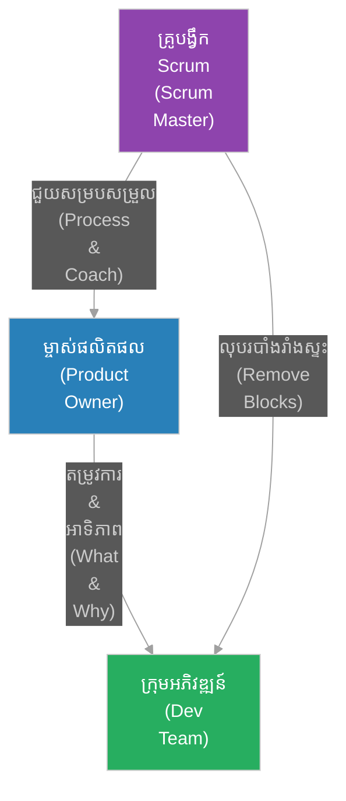

# តួនាទី​នៅក្នុង Scrum (Scrum Roles)

**អ្នកនិពន្ធ (Author):** ichamrong 
**កាលបរិច្ឆេទ (Date):** 2026-05-29 
**ស្លាក (Tags):** #agile #scrum #scrum-roles #product-owner #scrum-master #dev-team 
**ប្រភេទ (Category):** Management & Leadership 
**រយៈពេលអាន (Read Time):** ~៥ នាទី (~5 min) 

---

## 📌 មាតិកា (Table of Contents)
- [១. ម្ចាស់ផលិតផល (Product Owner - PO)](#1)
- [២. គ្រូ​បង្វឹក Scrum (Scrum Master - SM)](#2)
- [៣. ក្រុមការងារអភិវឌ្ឍន៍ (Development Team - Dev)](#3)
- [៤. របៀប​ដែល​តួនាទីទាំង ៣ ធ្វើ​ការ​រួមគ្នា (How They Interact)](#4)

---

## ១. ម្ចាស់ផលិតផល (Product Owner - PO)

**ម្ចាស់ផលិតផល (Product Owner)** ទទួលខុស​ត្រូវ​លើ​ការ​បង្កើន​តម្លៃ​អតិបរមា​នៃ​ផលិតផល​ដែល​សាងសង់​ដោយ​ក្រុ​មក​ារងារ។ និយាយឱ្យ​សាមញ្ញ PO គឺជា​ម្​ចាស់​នៃ **«អ្វី​ដែល​ត្រូវ​ធ្វើ» (What)** និង **«ហេតុអ្វី​ត្រូវ​ធ្វើ» (Why)**។

* **ភារកិច្ចចម្បង៖**
 * គ្រប់​គ្រង និង​រៀបចំអាទិភាព​បញ្ជីការងារផលិតផល (Product Backlog)។
 * កំណត់​ចក្ខុវិស័យ​ផលិតផល (Product Vision) និង​ផែន​ការ​ផលិតផល (Roadmap)។
 * តម្រង់ទិសដៅ និង​ធ្វើ​ការ​យ៉ាង​ជិតស្និទ្ធ​ជា​មួយ​ភាគីពាក់ព័ន្ធ (Stakeholders) និង​ក្រុមការងារអភិវឌ្ឍន៍។
 * វាយតម្លៃលទ្ធផល​ការ​ងារ និង​សម្រេច​ថាតើ​ត្រូវ​បញ្ចេញ​ផលិតផល (Release) ឬ​ទេ៖

---

## ២. គ្រូ​បង្វឹក Scrum (Scrum Master - SM)

**គ្រូ​បង្វឹក Scrum (Scrum Master)** ទទួលខុស​ត្រូវ​ក្នុង​ការ​លើ​កកម្ពស់ និង​គាំទ្រដល់ក្របខ័ណ្ឌ Scrum។ SM មិន​មែន​ជា​អ្នក​ចាត់ចែង​គម្រោង (Project Manager) ឡើយ ប៉ុន្តែ​ជា **«អ្នក​បម្រើ​ដែល​នាំមុខ» (Servant Leader)** និង​ជា​អ្នក​ការ​ពារដំណើរ​ការ​ការ​ងារ (Process Owner)។

* **ភារកិច្ចចម្បង៖**
 * ជួយ​លុបបំបាត់​រាល់​ឧបសគ្គ ឬ​បញ្ហា​ស្ទះ​ការ​ងារ (Blockers) ដែល​រាំង​ស្ទះ​ដល់ល្បឿន​របស់​ក្រុម។
 * សម្របសម្រួល និង​រៀបចំ​ពិធីសារ Scrum ទាំងអស់ (Planning, Standup, Review, Retro)។
 * បង្វឹក​ក្រុ​មក​ារងារឱ្យយល់ច្បាស់​ពី​ស្វ័យ-គ្រប់​គ្រង (Self-organization) និង​សហការគ្នា។
 * ការ​ពារក្រុ​មក​ារងារ​ពី​ការ​រំខាន ឬ​ការ​បន្ថែម​វិសាលភាព​ការ​ងារពាក់កណ្តាលទី​ពី​ភាគី​ខាងក្រៅ។

---

## ៣. ក្រុមការងារអភិវឌ្ឍន៍ (Development Team - Dev)

**ក្រុមការងារអភិវឌ្ឍន៍ (Development Team)** គឺជា​ក្រុម​អ្នក​ជំនាញ​ដែល​រួមគ្នា​ធ្វើ​ការ​ងារបច្ចេកទេស​ដើម្បី​សាងសង់ផ្នែក​កម្មវិធី​ដែល​ដំណើរ​ការ​បាន​ពិតប្រាកដ (Working Increment)។ ពួកគេ​ជា​ម្​ចាស់​នៃ **«វិធីសាស្ត្រ​ក្នុង​ការ​ធ្វើ» (How)** និង **«គុណភាព​ផលិតផល» (Quality)**។

* **លក្ខណៈពិសេស៖**
 * **ពហុជំនាញ (Cross-functional):** មាន​រាល់​ជំនាញចាំបាច់​ទាំងអស់ (សរសេរ​កូដ, ចាប់យកតម្រូវ​ការ, QA/Testing, UX/UI, DevOps) ដើម្បី​បញ្ចប់កិច្ច​ការ​ងារ​ដោយ​ខ្លួនឯង។
 * **ស្វ័យ-គ្រប់​គ្រង (Self-organizing):** សម្រេចចិត្ត​ដោយ​ខ្លួនឯង​ថាតើ​អ្នក​ណា​ត្រូវ​ធ្វើ​ការ​ងារអ្វី និង​សរសេរ​កូដ​តាម​របៀបណា​ដើម្បី​សម្រេចឱ្យ​បាន​តាម​គោលដៅ Sprint។
 * **ទទួលខុស​ត្រូវ​រួម (Collective Ownership):** មិន​មាន​ឋានានុក្រម ឬ​ឈ្មោះតួនាទី​ដាច់ដោយឡែក​នៅក្នុង​ក្រុ​មក​ារងារ​ឡើយ រាល់​ជោគជ័យ ឬ​បរាជ័យ​ជា​ការ​ទទួលខុស​ត្រូវ​រួមគ្នា។

---

## ៤. របៀប​ដែល​តួនាទីទាំង ៣ ធ្វើ​ការ​រួមគ្នា (How They Interact)

នៅក្នុង Scrum ភាពជោគជ័យកើតចេញ​ពី​សមតុល្យអំណាច និង​ទំនួលខុស​ត្រូវ​ច្បាស់លាស់រវាងតួនាទីទាំងបី៖

ការ​យល់ខុស ឬ​ការ​ប្រើប្រាស់​តួនាទីច្របូកច្របល់ (ឧទាហរណ៍៖ PO ដើរតួ​ជា SM ឬ SM បញ្​ជា​ការ​ងារបច្ចេកទេស​លើ Dev) នឹងនាំឱ្យបាត់បង់ប្រសិទ្ធភាព និង​ភាពច្​នៃ​ប្រឌិត​របស់​ក្រុម។
