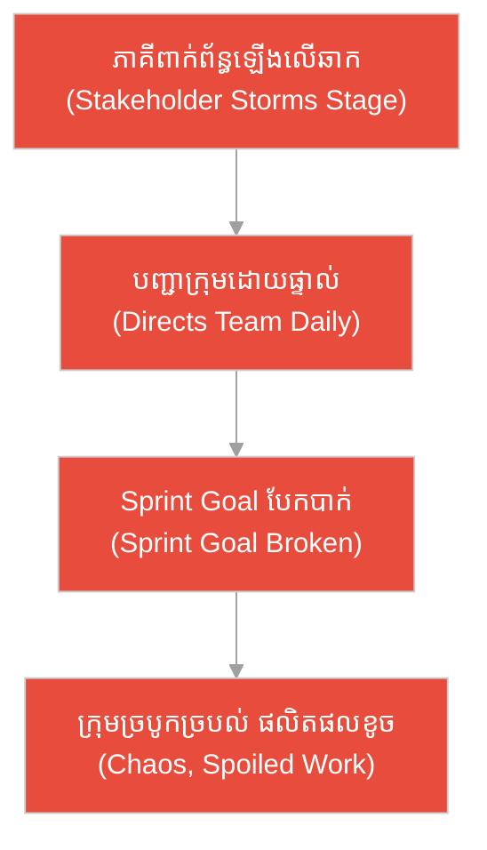
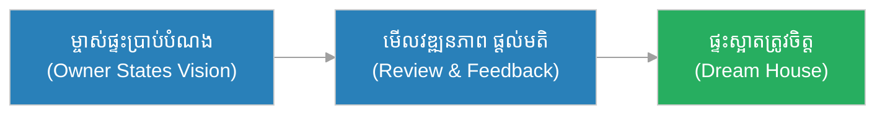
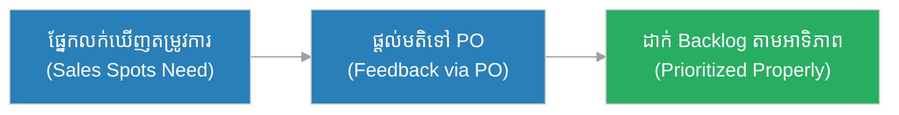
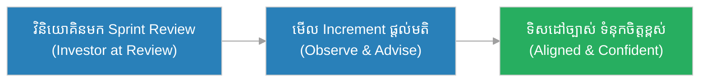
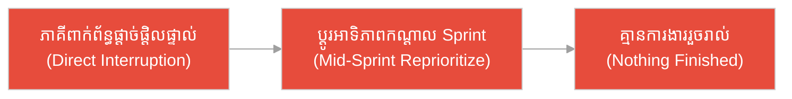
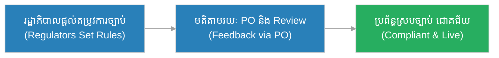
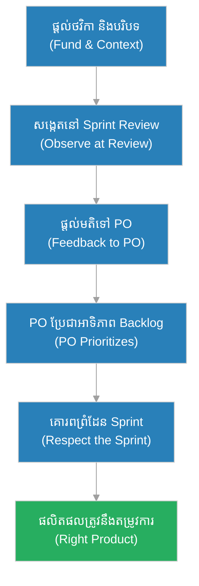

# ភាគីពាក់ព័ន្ធ (Stakeholders)៖ ម្​ចាស់​ឧបត្ថម្ភល្ខោន និង​សិល្បករនៅ​លើ​ឆាក (The Theatre Patrons & The Actors on Stage)

**អ្នកនិពន្ធ (Author):** ichamrong 
**កាលបរិច្ឆេទ (Date):** 2026-05-29 
**ស្លាក (Tags):** #agile #scrum #stakeholders #parable 
**ប្រភេទ (Category):** Management & Leadership 
**រយៈពេលអាន (Read Time):** ~១២ នាទី (~12 min) 

---

## 📌 មាតិកា (Table of Contents)
- [អន្ទាក់​នៃ​ភាគីពាក់ព័ន្ធ (The Stakeholder Trap)](#0)
- [១. រឿងប្រៀបប្រដូច៖ ម្​ចាស់​ឧបត្ថម្ភល្ខោន និង​អ្នក​ដែល​ឡើង​លើ​ឆាកកណ្តាល​ការ​សម្​តែ​ង (The Parable: The Patrons & The One Who Stormed the Stage)](#1)
- [២. បញ្ហា៖ ការ​ច្រឡំថា​ភាគីពាក់ព័ន្ធ​គួរបញ្​ជា​ការ​ងារ​ប្រចាំថ្ងៃ (The Issue: Stakeholders Driving Daily Work)](#2)
- [៣. ឧទាហរណ៍​ជាក់ស្តែង​ក្នុង​ពិភពពិត (Real World Examples)](#3)
 - [ឧទាហរណ៍​ទី ១ — កម្រិតស្រាល (ផ្ទាល់ខ្លួន)៖ ម្​ចាស់​ផ្ទះ និង​ស្ថាបត្យករសាងផ្ទះ (The Homeowner & The Architect)](#3-1)
 - [ឧទាហរណ៍​ទី ២ — កម្រិតមធ្យម (បច្ចេកទេស)៖ ផ្នែកលក់ផ្តល់មតិ​តាមរយៈ PO (The Sales Feedback Loop)](#3-2)
 - [ឧទាហរណ៍​ទី ៣ — កម្រិតមធ្យម (ធុរកិច្ច)៖ វិនិយោគិនផ្តល់មតិនៅ Sprint Review (The Investor at the Review)](#3-3)
 - [ឧទាហរណ៍​ទី ៤ — កម្រិតមធ្យម (គ្រប់​គ្រង)៖ ភាគីពាក់ព័ន្ធ​ផ្តាច់ផ្តិលក្រុ​មក​ណ្តាល Sprint (The Sprint Interrupter)](#3-4)
 - [ឧទាហរណ៍​ទី ៥ — កម្រិតធ្ងន់ (ការ​សម្រេចចិត្តធំ)៖ ភាគីពាក់ព័ន្ធ​រដ្ឋាភិបាល​លើ​គម្រោង​សុខាភិបាល (The Health Project Regulators)](#3-5)
- [៤. ការ​សន្ទនាបែបសាកសួរ (Socratic Dialogue: Directing vs. Funding & Observing)](#4)
- [៥. ដំណោះស្រាយ៖ ការ​ចូលរួម​ភាគីពាក់ព័ន្ធ​ឱ្យ​បាន​ត្រឹម​ត្រូវ (The Solution: Engaging Stakeholders Effectively)](#5)
- [សេចក្តីសន្និដ្ឋាន (Conclusion)](#6)
- [ឯកសារយោង (References)](#7)
- [Related Posts](#8)

---

## អន្ទាក់​នៃ​ភាគីពាក់ព័ន្ធ (The Stakeholder Trap)

នៅក្នុង​ការ​គ្រប់​គ្រង​ភាគីពាក់ព័ន្ធ យើង​តែ​ង​តែ​ជួបប្រទះនូវភាពផ្ទុយគ្នា​ពី​រ​យ៉ាង៖

* **អន្ទាក់​ឡើង​លើ​ឆាក (The Stage-Storming Trap):** «ខ្ញុំ​ជា​អ្នក​ផ្តល់ថវិកា ដូច្​នេះ​ខ្ញុំ​មាន​សិទ្ធិចូលផ្តាច់ផ្តិលក្រុ​មក​ណ្តាល Sprint និង​បញ្​ជា​សិល្បករម្នាក់ ៗ ថា​ត្រូវ​លេងបែបណា!»
* **អន្ទាក់​ភ្ញៀវអវត្ត​មាន (The Absent-Patron Trap):** «ខ្ញុំគ្រាន់​តែ​ផ្តល់លុយ រួចបាត់ខ្លួន — ខ្ញុំ​មិន​មក​មើល Sprint Review ឬ​ផ្តល់មតិ​ឡើយ រហូតដល់ផលិតផលរួចទាំងស្រុង!»

---

## ១. រឿងប្រៀបប្រដូច៖ ម្​ចាស់​ឧបត្ថម្ភល្ខោន និង​អ្នក​ដែល​ឡើង​លើ​ឆាកកណ្តាល​ការ​សម្​តែ​ង (The Parable: The Patrons & The One Who Stormed the Stage)

កាល​ពី​ព្រេងនាយ មាន​រោងល្ខោនដ៏ល្បីមួយ ត្រូវ​ឧបត្ថម្ភ​ដោយ​ម្​ចាស់​ទ្រព្យ​អ្នក​មាន។ ម្​ចាស់​ឧបត្ថម្ភម្នាក់ឈ្មោះ **ច័ន្ទ (Chan)** ផ្តល់ថវិកា​ដើម្បី​សាងរោងល្ខោន និង​ជួលសិល្បករ។ នៅយប់សម្​តែ​ង​បង្ហាញ (Premiere) គាត់អង្គុយមើល ទះដៃកោតសរសើរ ហើយ​ក្រោយ​ការ​សម្​តែ​ង គាត់ផ្តល់មតិដ៏​មាន​តម្លៃ​ទៅ​អ្នក​ដឹកនាំ​ល្ខោន (Director)៖ «ខ្ញុំចូលចិត្តរឿង​នេះ ប៉ុន្តែ​តួឯកគួរអារម្មណ៍​ខ្លាំង​ជា​ង​នេះ​បន្តិច»។ គាត់ **មិន​ដែល​ឡើង​លើ​ឆាក** ដើម្បី​បញ្​ជា​សិល្បករម្នាក់ ៗ កណ្តាល​ការ​សម្​តែ​ង​ឡើយ។ ដោយសារ​គាត់គោរពតួនាទីខ្លួន — ផ្តល់ថវិកា សង្កេត និង​ផ្តល់មតិ​តាម​ផ្លូវត្រឹម​ត្រូវ — ល្ខោន​នោះ​ក៏កាន់​តែ​ប្រសើរឡើងវេនម្តង ៗ និង​ពេញនិយម។

ផ្ទុយ​ទៅ​វិញ មាន​ម្​ចាស់​ឧបត្ថម្ភម្នាក់ទៀត​ដែល​ច្រឡំខ្លួន​ជា​អ្នក​ដឹកនាំ។ កណ្តាល​ការ​សម្​តែ​ង គាត់ឡើង​លើ​ឆាក ស្រែកប្តូរទីតាំងសិល្បករ ផ្លាស់ប្តូរពាក្យសម្តីភ្លាម ៗ ហើយប្តូរទិសសាច់រឿង។ សិល្បករច្របូកច្របល់ ភ្លេចពាក្យ ហើយ​ការ​សម្​តែ​ងទាំងមូលក៏រលាយ។ ទស្សនិកជននាំគ្នាចេញ ដោយសារ​ម្​ចាស់​ឧបត្ថម្ភម្នាក់​នោះ បាន​ឆ្លងកាត់ព្រំដែន​នៃ​តួនាទីខ្លួន ហើយបំផ្លាញស្នាដៃ ដែល​គាត់ផ្ទាល់​បាន​ឧបត្ថម្ភ។

---

## ២. បញ្ហា៖ ការ​ច្រឡំថា​ភាគីពាក់ព័ន្ធ​គួរបញ្​ជា​ការ​ងារ​ប្រចាំថ្ងៃ (The Issue: Stakeholders Driving Daily Work)

នៅក្នុង​ការ​គ្រប់​គ្រង​គម្រោង​បែប Agile, **ភាគីពាក់ព័ន្ធ (Stakeholders)** គឺជា​បុគ្គល ឬ​ក្រុម​ដែល​មាន​ចំណាប់អារម្មណ៍​លើ​ផលិតផល — អ្នក​ផ្តល់ថវិកា អតិថិជន អ្នក​ប្រើ ឬ​អ្នក​គ្រប់​គ្រង​ជា​ន់ខ្ពស់។ តួនាទី​របស់​ពួកគេ​គឺ **ផ្តល់ថវិក និង​គាំទ្រ (Fund)** **សង្កេតវឌ្ឍនភាព (Observe at Reviews)** និង **ផ្តល់មតិ​តាមរយៈ Product Owner (Give Feedback)**។ ពួកគេ **មិន​មែន** ជា​អ្នក​ដែល​បញ្​ជា​ការ​ងារ​ប្រចាំថ្ងៃ ឬ​ផ្តាច់ផ្តិលក្រុ​មក​ណ្តាល Sprint ឡើយ។

ប្រសិនបើ​ភាគីពាក់ព័ន្ធ​ច្រឡំ ហើយឡើង «លើ​ឆាក» ដើម្បី​បញ្​ជា​ក្រុម​ដោយ​ផ្ទាល់ វានឹងបំផ្លាញ​ការ​ផ្តោតអារម្មណ៍ បំបែក Sprint Goal និង​ធ្វើ​ឱ្យក្រុមច្របូកច្របល់។

---

## ៣. ឧទាហរណ៍​ជាក់ស្តែង​ក្នុង​ពិភពពិត

សូមពិនិត្យមើលរបៀប​ដែល​តួនាទី​ភាគីពាក់ព័ន្ធ​ជះឥទ្ធិពលដល់កម្រិតជីវិត និង​ការ​ងារទាំង ៥ ខាងក្រោម៖

---

### ឧទាហរណ៍​ទី ១ — កម្រិតស្រាល (ផ្ទាល់ខ្លួន)៖ ម្​ចាស់​ផ្ទះ និង​ស្ថាបត្យករសាងផ្ទះ (The Homeowner & The Architect)

* **ស្ថានភាព៖** រស្មី (Reaksmey) ជា​ម្​ចាស់​ផ្ទះ ផ្តល់ថវិកាសាងសង់ផ្ទះ និង​ប្រាប់ស្ថាបត្យកនូវចំណង់ចំណូលចិត្ត។ នាង​មក​មើលវឌ្ឍនភាពនៅចំណុចសំខាន់ ៗ (មិលស្តូន) និង​ផ្តល់មតិ ប៉ុន្តែ​នាង​មិន​ឡើង​ទៅ​ប្រាប់​ជា​ងសំណង់ម្នាក់ ៗ ថា​ត្រូវ​ដាក់ឥដ្ឋណាមួយ​ឡើយ។
* **លទ្ធផល៖** ផ្ទះកើតឡើងស្អាត ត្រូវ​នឹងបំណង ដោយសារ រស្មី គោរពតួនាទីខ្លួន​ជា​ម្​ចាស់​ផ្ទះ និង​ទុក​ការ​សាងសង់ឱ្យ​អ្នក​ជំនាញ។

---

### ឧទាហរណ៍​ទី ២ — កម្រិតមធ្យម (បច្ចេកទេស)៖ ផ្នែកលក់ផ្តល់មតិ​តាមរយៈ PO (The Sales Feedback Loop)

* **ស្ថានភាព៖** ផ្នែកលក់ (ភាគីពាក់ព័ន្ធ) ឃើញថាអតិថិជន​ត្រូវ​ការ​មុខងារ «នាំចេញរបាយ​ការ​ណ៍ Excel»។ ជំនួសឱ្យ​ការ​ទៅ​ប្រាប់​អ្នក​អភិវឌ្ឍ​ន៍​ដោយ​ផ្ទាល់ ពួកគេផ្តល់មតិ​នេះ​ទៅ ដារ៉ា (Dara) ជា Product Owner ដើម្បី​ដាក់​ក្នុង Product Backlog តាម​អាទិភាព។
* **លទ្ធផល៖** មុខងារ​ត្រូវ​បាន​ដាក់​តាម​អាទិភាពត្រឹម​ត្រូវ ក្រុម​មិន​ត្រូវ​រំខានកណ្តាល Sprint ហើយតម្រូវ​ការ​អាជីវកម្ម​ត្រូវ​បាន​បំពេញ​តាម​ផ្លូវ​ការ​ត្រឹម​ត្រូវ។

---

### ឧទាហរណ៍​ទី ៣ — កម្រិតមធ្យម (ធុរកិច្ច)៖ វិនិយោគិនផ្តល់មតិនៅ Sprint Review (The Investor at the Review)

* **ស្ថានភាព៖** វិនិយោគិនម្នាក់ឈ្មោះ ច័ន្ទ (Chan) ផ្តល់ថវិកាដល់ក្រុមហ៊ុន​បង្កើត​កម្មវិធី។ គាត់​មក​ចូលរួម Sprint Review រៀង​រាល់​ពី​រសប្តាហ៍ ដើម្បី​មើលលទ្ធផល​ជាក់ស្តែង (Increment) និង​ផ្តល់មតិអំ​ពី​ទិសដៅទីផ្សារ។
* **លទ្ធផល៖** ក្រុមទទួល​បាន​ទិសដៅអាជីវកម្មច្បាស់លាស់ ហើយវិនិយោគិន​មាន​ទំនុកចិត្ត​លើ​វឌ្ឍនភាព ដោយ​ការ​សង្កេត និង​ផ្តល់មតិ​តាម​ផ្លូវត្រឹម​ត្រូវ ដោយ​មិន​រំខានដំណើរ​ការ​ការ​ងារ។

---

### ឧទាហរណ៍​ទី ៤ — កម្រិតមធ្យម (គ្រប់​គ្រង)៖ ភាគីពាក់ព័ន្ធ​ផ្តាច់ផ្តិលក្រុ​មក​ណ្តាល Sprint (The Sprint Interrupter)

* **ស្ថានភាព៖** អ្នក​គ្រប់​គ្រងផ្នែកម្នាក់ (ភាគីពាក់ព័ន្ធ) មិន​រង់ចាំ Sprint Review ឡើយ។ គាត់ដើរចូល​ទៅកាន់​តុ​ក្រុមអភិវឌ្ឍន៍​ដោយ​ផ្ទាល់​រាល់ថ្ងៃ ហើយប្តូរអាទិភាព​ការ​ងារកណ្តាល Sprint តាម​ចិត្តខ្លួន។
* **លទ្ធផល៖** Sprint Goal បែកបាក់ ក្រុមបាត់​ការ​ផ្តោតអារម្មណ៍ និង​ធ្វើ​ការ​ងារពាក់កណ្តាលច្រើនបំផុត ដែល​គ្មាន​មួយរួច​រាល់ — ដូចម្​ចាស់​ឧបត្ថម្ភ​ដែល​ឡើង​លើ​ឆាកបំផ្លាញ​ការ​សម្​តែ​ង។

---

### ឧទាហរណ៍​ទី ៥ — កម្រិតធ្ងន់ (ការ​សម្រេចចិត្តធំ)៖ ភាគីពាក់ព័ន្ធ​រដ្ឋាភិបាល​លើ​គម្រោង​សុខាភិបាល (The Health Project Regulators)

* **ស្ថានភាព៖** ក្នុង​គម្រោង​បង្កើត​ប្រព័ន្ធ​កត់ត្រាសុខភាព​អ្នក​ជំងឺថ្នាក់​ជា​តិ ភាគីពាក់ព័ន្ធ​រដ្ឋាភិបាល (ក្រសួងសុខាភិបាល) ផ្តល់តម្រូវ​ការ​ផ្នែកច្បាប់ និង​សុវត្ថិភាព​ទិន្នន័យ។ ពួកគេ​ចូលរួម Sprint Review សំខាន់ ៗ ហើយផ្តល់មតិ​តាមរយៈ Product Owner ដោយ​មិន​បញ្​ជា​ក្រុមបច្ចេកទេស​ដោយ​ផ្ទាល់​ឡើយ។
* **លទ្ធផល៖** ប្រព័ន្ធ​គោរពច្បាប់ មាន​សុវត្ថិភាពខ្ពស់ និង​ដាក់ដំណើរ​ការ​បាន​ទាន់​ពេល ដោយសារ​ភាគីពាក់ព័ន្ធ​ផ្តល់ទិសដៅ និង​មតិ​តាម​ផ្លូវ​ការ​ត្រឹម​ត្រូវ ដោយ​មិន​បំផ្លាញលំហូរ​ការ​ងារ​របស់​ក្រុម។

---

## ៤. ការ​សន្ទនាបែបសាកសួរ (Socratic Dialogue: Directing vs. Funding & Observing)

**សិស្ស (សមាជិក​ក្រុម)៖** លោកគ្រូ! ភាគីពាក់ព័ន្ធ​ម្នាក់ចូល​មក​ប្រាប់ពួកយើងផ្ទាល់​រាល់ថ្ងៃ ឱ្យប្តូរ​ការ​ងារ។ តើ​គាត់​មាន​សិទ្ធិបញ្​ជា​ពួកយើងផ្ទាល់​ឬ?

**គ្រូ (Agile Coach)៖** សួរ​ល្អ។ ខ្ញុំសុំសួរវិញ៖ នៅរោងល្ខោន តើ​ម្​ចាស់​ឧបត្ថម្ភ​ដែល​ផ្តល់ថវិកា គួរឡើង​លើ​ឆាកកណ្តាល​ការ​សម្​តែ​ង​ដើម្បី​បញ្​ជា​សិល្បករ​ឬ?

**សិស្ស៖** មិន​គួរទេ លោកគ្រូ។ បើគាត់ឡើង​លើ​ឆាក ការ​សម្​តែ​ងនឹងរលាយ។

**គ្រូ៖** ត្រឹម​ត្រូវ។ ដូច្​នេះ ម្​ចាស់​ឧបត្ថម្ភគួរ​ធ្វើ​អ្វីវិញ?

**សិស្ស៖** គាត់គួរផ្តល់ថវិកា មើល​ការ​សម្​តែ​ង ហើយផ្តល់មតិ​ក្រោយ​ការ​សម្​តែ​ង លោកគ្រូ។

**គ្រូ៖** ត្រឹម​ត្រូវ​ហើយ! ភាគីពាក់ព័ន្ធ​ក៏ដូចគ្នា — ពួកគេ **ផ្តល់ថវិកា សង្កេតនៅ Sprint Review និង​ផ្តល់មតិ​តាមរយៈ Product Owner**។ Product Owner ជា «អ្នក​ដឹកនាំ​ល្ខោន (Director)» ដែល​ប្រែមតិទាំង​នោះ​ទៅ​ជា​អាទិភាព Backlog។ ភាគីពាក់ព័ន្ធ​មិន​គួរ «ឡើង​លើ​ឆាក» ដើម្បី​បញ្​ជា​ក្រុម​ដោយ​ផ្ទាល់​ឡើយ។

**សិស្ស៖** ដូច្​នេះ មតិ​របស់​ភាគីពាក់ព័ន្ធ​នៅ​តែ​សំខាន់ ប៉ុន្តែ​វា​ត្រូវ​ឆ្លងកាត់ផ្លូវត្រឹម​ត្រូវ មែនទេ?

**គ្រូ៖** ត្រឹម​ត្រូវ​ហើយ។ ភាគីពាក់ព័ន្ធ​ដ៏​ល្អ គឺជា​ម្​ចាស់​ឧបត្ថម្ភដ៏ឆ្លាតវៃ ដែល​ដឹងថា​ការ​គោរពតួនាទីខ្លួន គឺជា​មាគ៌ា​ដែល​ធ្វើ​ឱ្យស្នាដៃ​ល្អ​បំផុត។

---

## ៥. ដំណោះស្រាយ៖ ការ​ចូលរួម​ភាគីពាក់ព័ន្ធ​ឱ្យ​បាន​ត្រឹម​ត្រូវ (The Solution: Engaging Stakeholders Effectively)

ដើម្បី​ឱ្យ​ភាគីពាក់ព័ន្ធ​ចូលរួម​ប្រកប​ដោយ​ប្រសិទ្ធភាព ត្រូវ​ប្រកាន់ខ្​ជា​ប់នូវគោល​ការ​ណ៍​ខាងក្រោម៖

1. **ផ្តល់ថវិកា និង​គាំទ្រ (Fund & Support):** ភាគីពាក់ព័ន្ធ​ផ្តល់ធនធាន ការ​គាំទ្រ និង​បរិបទអាជីវកម្ម ដែល​ក្រុម​ត្រូវ​ការ​ដើម្បី​ជោគជ័យ។
2. **សង្កេតនៅ Sprint Review (Observe at Reviews):** ចូលរួម Sprint Review ដើម្បី​មើលលទ្ធផល​ជាក់ស្តែង (Increment) និង​វឌ្ឍនភាព​តាម​ផ្លូវ​ការ។
3. **ផ្តល់មតិ​តាមរយៈ Product Owner (Feedback via the PO):** ប្រគល់មតិ និង​តម្រូវ​ការ​ទៅ Product Owner ដែល​ប្រែវា​ជា​អាទិភាព Backlog មិន​មែន​ទៅ​ក្រុម​ដោយ​ផ្ទាល់​ឡើយ។
4. **គោរពព្រំដែន​នៃ Sprint (Respect the Sprint):** កុំ​ផ្តាច់ផ្តិល ឬ​ប្តូរអាទិភាពកណ្តាល Sprint ដើម្បី​ការ​ពារ​ការ​ផ្តោតអារម្មណ៍​របស់​ក្រុម។

---

## 🐇 ធ្លាក់ចូល​ក្នុង​រន្ធទន្សាយ (Enter the Rabbit Hole)

ដើម្បី​យល់ដឹងកាន់​តែ​ស៊ីជម្រៅអំ​ពី​របៀប​ដែល​ភាគីពាក់ព័ន្ធ​ចូលរួម និង​ផ្តល់មតិ សូមស្វែងយល់បន្ថែម៖

* 🚀 **[ការ​ពិនិត្យឡើងវិញវដ្ត​ការ​ងារ (Sprint Review) ➔](../ceremonies/sprint-review.md)**
* 🚀 **[ម្ចាស់ផលិតផល (Product Owner) ➔](./product-owner.md)**
* 🚀 **[បញ្ជីការងារផលិតផល (Product Backlog) ➔](../artifacts/product-backlog.md)**

---

## សេចក្តីសន្និដ្ឋាន (Conclusion)

> **«ភាគីពាក់ព័ន្ធ​ដ៏​ល្អ ផ្តល់ថវិកា សង្កេត និង​ផ្តល់មតិ ប៉ុន្តែ​មិន​ដែល​ឡើង​លើ​ឆាក​ដើម្បី​បញ្​ជា​សិល្បករកណ្តាល​ការ​សម្​តែ​ង​ឡើយ។»**

ភាគីពាក់ព័ន្ធ ដូចជា​ម្​ចាស់​ឧបត្ថម្ភល្ខោនដ៏ឆ្លាតវៃ ដែល​គោរពតួនាទីខ្លួន — ផ្តល់​ការ​គាំទ្រ មើល​ការ​សម្​តែ​ង និង​ផ្តល់មតិ​តាម​ផ្លូវត្រឹម​ត្រូវ​តាមរយៈ Product Owner។ ការ​គោរពព្រំដែន​នេះ ហើយ ដែល​នាំស្នាដៃ​ទៅ​រកភាពពេញនិយម និង​តម្លៃ​ពិតប្រាកដ។

---

## ឯកសារយោង (References)

* **Ken Schwaber & Jeff Sutherland** — *The Scrum Guide* (2020).
* **Roman Pichler** — *Agile Product Management with Scrum* (2010).
* **Kenneth S. Rubin** — *Essential Scrum: A Practical Guide to the Most Popular Agile Process* (2012).

---

## Related Posts

* [ការ​ពិនិត្យឡើងវិញវដ្ត​ការ​ងារ (Sprint Review)](../ceremonies/sprint-review.md) — ឱកាសផ្លូវ​ការ​ដែល​ភាគីពាក់ព័ន្ធ​សង្កេត និង​ផ្តល់មតិ។
* [ម្ចាស់ផលិតផល (Product Owner)](./product-owner.md) — ស្ពានភ្​ជា​ប់រវាង​ភាគីពាក់ព័ន្ធ និង​ក្រុមអភិវឌ្ឍន៍។
* [បញ្ជីការងារផលិតផល (Product Backlog)](../artifacts/product-backlog.md) — កន្លែង​ដែល​មតិ​ភាគីពាក់ព័ន្ធ​ត្រូវ​ប្រែ​ជា​អាទិភាព។
