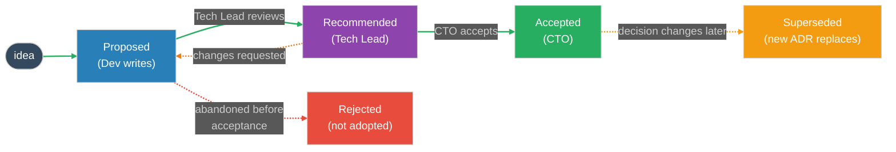

# ADR Sign-Off Procedure — Architecture Decision Records

Standard Operating Procedure (SOP). This is an internal process document, not a legal contract. The signature block records each role's acknowledgement that they have read the procedure and agree to follow it.

An **Architecture Decision Record (ADR)** captures a single significant technical decision: the context, the decision made, and its consequences. This procedure defines when an ADR is required, the approval chain (**Dev → Tech Lead → CTO**), the lifecycle of an ADR, and where records are stored.

## Document Control

| Field | Value |
|-------|-------|
| Document type | Internal Standard Operating Procedure (SOP) |
| Document owner | `<name / role responsible for maintaining this doc>` |
| Version | `<1.0>` |
| Status | `<Draft / Approved>` |
| Effective date | `<YYYY-MM-DD>` |
| Next review date | `<YYYY-MM-DD>` |
| Applies to | Dev, Tech Lead, CTO on `<team / project>` |

---

## Summary

An ADR records **why** a significant technical decision was made, so the reasoning survives after the people and the moment are gone. Each ADR is a short, numbered, immutable record (ADR-0001, ADR-0002, …) stored alongside the code base.

A decision is proposed by a **Dev**, reviewed and recommended by the **Tech Lead**, and accepted by the **CTO**. Once accepted, an ADR is not edited — if the decision changes later, a new ADR is written that **supersedes** the old one. This keeps a permanent, honest history of how the architecture evolved.

---

## Table of Contents
1. When to Write an ADR
2. The Approval Chain
3. ADR Lifecycle
   - 3.1 Lifecycle Diagram
   - 3.2 Status Definitions
4. Ownership & RACI Matrix
5. ADR Rules
6. Where ADRs Are Stored
7. Exceptions & Escalation
8. Glossary
9. Signature Block
10. Change Log

Related: [ADR template](adr/adr-template.md) · [example ADR-0001](adr/adr-0001-example.md)

---

## 1. When to Write an ADR

Write an ADR for a decision that is **significant and hard to reverse** — one a future team member would ask "why did we do it this way?"

Write an ADR when the decision:
- Chooses a technology, framework, database, or major library.
- Sets a pattern the whole codebase will follow (e.g. how state is managed, how errors propagate).
- Affects more than one team or service, or has security / cost / performance trade-offs.
- Deliberately rejects an obvious alternative (record why it was rejected).

Do **not** write an ADR for:
- Routine, easily reversible coding choices (a variable name, a small refactor).
- Anything already covered by an existing ADR (link to it instead).

If unsure, ask the Tech Lead. It is better to have a short ADR than an undocumented decision.

---

## 2. The Approval Chain

ADRs are authored in **IcePanel**. An ADR is approved through three steps; each step is a sign-off, and the CTO's sign-off is cast as a **vote inside IcePanel**.

1. **Dev — proposes.** A developer writes the ADR in IcePanel (Status: Proposed) capturing the context, the decision, the alternatives considered, and the consequences. The Dev owns the ADR while it is Proposed.
2. **Tech Lead — reviews and recommends.** The Tech Lead checks the decision is sound, the alternatives are fair, and the consequences are honest. They may request changes (the ADR stays Proposed) or recommend it for acceptance, then email the CTO to request the vote (see the email templates below).
3. **CTO — accepts (votes in IcePanel).** The CTO reviews the ADR and casts their vote in IcePanel. Only the CTO can move an ADR to Accepted.

A decision is not "real" until the CTO accepts it. Work may begin on a Proposed ADR at the team's risk, but the record is not authoritative until accepted.

The notification at each handoff uses the standard [ADR email templates](adr/email-templates.md): the Tech Lead recommendation, the request for the CTO's vote, an optional reminder, and the decision-outcome announcement.

---

## 3. ADR Lifecycle

### 3.1 Lifecycle Diagram

Line colors: green = path to acceptance · orange = changes requested or superseded · red = rejected.

> For documents where Mermaid does not render (Google Docs, PDF, print), use the exported image: `assets/adr-lifecycle-flow.png` (or `assets/adr-lifecycle-flow.svg`). Re-export from `assets/adr-lifecycle-flow.mmd` if the flow changes.

### 3.2 Status Definitions

| Status | Meaning |
|--------|---------|
| Proposed | Written by a Dev; under review. Not yet authoritative. |
| Recommended | Tech Lead has reviewed and recommends acceptance; awaiting CTO. |
| Accepted | CTO has signed off. This is now the decision of record. |
| Superseded | A later ADR replaces this one. The record stays, marked with the ADR that replaced it. |
| Rejected | The proposal was not adopted. The record stays so the reasoning is not lost. |

---

## 4. Ownership & RACI Matrix

R = Responsible, A = Accountable, C = Consulted, I = Informed.

| Activity | Dev | Tech Lead | CTO | PM / PO |
|----------|-----|-----------|-----|---------|
| Write the ADR (Proposed) | A/R | C | I | I |
| Review and recommend | C | A/R | I | I |
| Accept (final sign-off) | I | C | A/R | I |
| Supersede with a new ADR | R | A | A | I |
| Maintain the ADR index | C | A/R | I | I |

The CTO is the single accountable approver for acceptance; the Tech Lead is accountable for the quality of the review and the index.

---

## 5. ADR Rules

1. One decision per ADR. Each record captures exactly one decision. Split compound decisions into separate ADRs.
2. ADRs are immutable once Accepted. Do not edit an accepted ADR to change the decision. Write a new ADR that supersedes it, and mark the old one Superseded with a link.
3. Numbered and never reused. ADRs are numbered sequentially (ADR-0001, ADR-0002…). A rejected or superseded number is not reused.
4. Record the rejected alternatives. An ADR must state what else was considered and why it was not chosen — that is often the most valuable part.
5. Approval chain is fixed. Dev proposes, Tech Lead recommends, CTO accepts. Only the CTO marks an ADR Accepted.
6. Stored with the code. ADRs live in the repository so they are versioned alongside the system they describe.
7. Keep it short. An ADR is one to two pages. If it is longer, the decision is probably more than one ADR.

---

## 6. Where ADRs Are Stored

- ADRs are authored and voted on in **IcePanel**, which is the source of truth for the decision and its status.
- A copy of each ADR is kept in the `adr/` folder next to this procedure, so the decision is versioned alongside the code base.
- File naming: `adr-NNNN-short-title.md` (e.g. `adr-0001-use-postgres.md`).
- Use the [ADR template](adr/adr-template.md) for every new ADR, and the [email templates](adr/email-templates.md) for the approval notifications.
- An index lists each ADR, its title, status, and IcePanel link, maintained by the Tech Lead (see the `adr/` README).

---

## 7. Exceptions & Escalation

- **Urgent decision made under pressure.** If a decision had to be made before an ADR could be written (e.g. during an incident), write the ADR **retroactively** as soon as possible, marked with the real date the decision was made, and run it through the normal approval chain.
- **CTO unavailable.** If the CTO cannot sign off in time, the Tech Lead may mark the ADR Recommended and the team may proceed at its own risk; the ADR stays Proposed/Recommended until the CTO formally accepts.
- **Disagreement on a decision.** If Dev and Tech Lead disagree, the matter is escalated to the CTO, who decides. The ADR records the decision and, where useful, the dissent.
- **Requesting an exception.** Any role may request an exception by raising it to the document owner or the CTO. Approved exceptions are recorded on the ADR; they do not change the procedure itself.

This procedure is a working agreement: stable within a sprint, improved between sprints.

---

## 8. Glossary

| Term | Meaning |
|------|---------|
| ADR | Architecture Decision Record — a short record of one significant technical decision |
| Context | The situation and forces that make a decision necessary |
| Decision | The choice that was made |
| Consequences | The results of the decision, good and bad, after applying it |
| Superseded | An accepted ADR replaced by a later one; the record is kept, not deleted |
| Status | The lifecycle state of an ADR (Proposed, Recommended, Accepted, Superseded, Rejected) |

---

## 9. Signature Block

By signing below, each role acknowledges that they have read this procedure and agree to follow it. This is an internal working agreement, not a legal contract.

| Role | Name | Signature | Date |
|------|------|-----------|------|
| Developer (representative) | `<name>` | `____________` | `<YYYY-MM-DD>` |
| Tech Lead | `<name>` | `____________` | `<YYYY-MM-DD>` |
| CTO | `<name>` | `____________` | `<YYYY-MM-DD>` |

---

## 10. Change Log

| Version | Date | Author | Change |
|---------|------|--------|--------|
| 1.0 | `<YYYY-MM-DD>` | `<name>` | Initial version |
