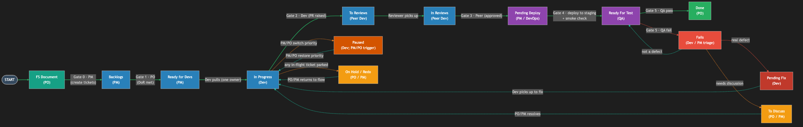

# Ticket Sign-Off Procedure — PM / PO / Dev / QA

Standard Operating Procedure (SOP). This is an internal process document, not a legal contract. The signature block records each role's acknowledgement that they have read the procedure and agree to follow it.

## Document Control

| Field | Value |
|-------|-------|
| Document type | Internal Standard Operating Procedure (SOP) |
| Document owner | `<name / role responsible for maintaining this doc>` |
| Version | `<1.0>` |
| Status | `<Draft / Approved>` |
| Effective date | `<YYYY-MM-DD>` |
| Next review date | `<YYYY-MM-DD>` |
| Applies to | PM, PO, Dev, QA on `<team / project>` |

---

## Summary

This document defines how a Jira ticket moves from the PO's Functional Spec (FS) all the way to Deployed, and who confirms (signs off) each step. A ticket is treated as a state machine: it moves forward through defined statuses, each status has exactly one owner, and only that owner may move the ticket out of it. Every transition is a sign-off — the owner confirms the gate's criteria are met before handing the ticket to the next owner.

The procedure covers eight forward-flow statuses, five side statuses (Fails, Paused, On Hold, To Discuss, Redo), the Pending Fix status, and the FS document as the starting input — fifteen states in total. It defines the ownership of each, plus the rules for failures, holds, and rework. The signature block at the end records the team's agreement to follow it.

**Where sign-offs are recorded.** Each gate sign-off is recorded in Jira: the owner makes the status transition and adds a brief comment confirming the gate was met (for example, "QA passed: 12/12 cases, no open bugs"). The owner's name and the date come from the Jira transition history.

---

## Table of Contents
1. Statuses
   - 1.1 FS Document (input from PO)
   - 1.2 Status Flow Diagram
   - 1.3 Status List
2. Gate Explanations
   - 2.1 Gate Summary Table
   - 2.2 Notes on Each Gate
3. Ownership & RACI Matrix
4. Side Statuses (Fails, Pending Fix, Paused, On Hold, To Discuss, Redo)
5. Sign-Off Rules
6. Exceptions & Escalation
7. Glossary
8. Signature Block
9. Change Log

---

## 1. Statuses

### 1.1 FS Document (input from PO)

Work begins with the **Functional Spec (FS) document**, written and owned by the PO. The PO owns only the FS — it defines what is being built and why. From an approved FS, the **PM** creates the tickets into **Backlogs** (Gate 0) and owns them from there. Nothing enters the workflow without an approved FS.

### 1.2 Status Flow Diagram

```mermaid
%%{init: {
  'theme': 'dark',
  'themeVariables': {
    'background': '#1e1e1e',
    'primaryTextColor': '#ffffff',
    'lineColor': '#a0a0a0'
  },
  'themeCSS': 'svg { background-color: #1e1e1e !important; padding: 1rem !important; border-radius: 8px !important; } .edgeLabel rect { fill: #1e1e1e !important; } text, tspan { fill: #ffffff !important; }'
}}%%
flowchart LR
    START(["START"]):::start --> FS["FS Document<br/>(PO)"]:::input
    FS -->|"Gate 0 · PM<br/>(create tickets)"| A["Backlogs<br/>(PM)"]:::process
    A -->|"Gate 1 · PO<br/>(DoR met)"| B["Ready for Devs<br/>(PM)"]:::process
    B -->|"Dev pulls (one owner)"| C["In Progress<br/>(Dev)"]:::process
    C -->|"Gate 2 · Dev (PR raised)"| D["To Reviews<br/>(Peer Dev)"]:::process
    D -->|"Reviewer picks up"| E["In Reviews<br/>(Peer Dev)"]:::process
    E -->|"Gate 3 · Peer (approved)"| F["Pending Deploy<br/>(PM / DevOps)"]:::process
    F -->|"Gate 4 · deploy to staging<br/>+ smoke check"| G["Ready For Test<br/>(QA)"]:::process
    G -->|"Gate 5 · QA pass"| H["Done<br/>(PO)"]:::success

    %% --- Fails / fix branch (right side) ---
    G -.->|"Gate 5 · QA fail"| I["Fails<br/>(Dev / PM triage)"]:::danger
    I -.->|"real defect"| PF["Pending Fix<br/>(Dev)"]:::danger
    I -.->|"not a defect"| G
    I -.->|"needs discussion"| TD["To Discuss<br/>(PO / PM)"]:::hold
    PF -.->|"Dev picks up to fix"| C
    TD -.->|"PO/PM resolves"| C

    %% --- Pause / park branch (left side) ---
    C -.->|"PM/PO switch priority"| PA["Paused<br/>(Dev; PM/PO trigger)"]:::hold
    PA -.->|"PM/PO restore priority"| C
    C -.->|"any in-flight ticket parked"| OH["On Hold / Redo<br/>(PO / PM)"]:::hold
    OH -.->|"PO/PM returns to flow"| C

    %% --- Edge colors by type ---
    %% Forward flow (green)
    linkStyle 0,1,2,3,4,5,6,7,8 stroke:#27ae60,stroke-width:2px
    %% Fail / defect (red)
    linkStyle 9,10 stroke:#e74c3c,stroke-width:2px
    %% Pause / park, off-flow (orange)
    linkStyle 12,15,17 stroke:#e67e22,stroke-width:2px
    %% Return to flow (teal)
    linkStyle 11,13,14,16,18 stroke:#1abc9c,stroke-width:2px

    style START fill:#34495e,color:#fff
    style FS fill:#16a085,color:#fff
    style A fill:#2980b9,color:#fff
    style B fill:#2980b9,color:#fff
    style C fill:#2980b9,color:#fff
    style D fill:#2980b9,color:#fff
    style E fill:#2980b9,color:#fff
    style F fill:#8e44ad,color:#fff
    style G fill:#8e44ad,color:#fff
    style H fill:#27ae60,color:#fff
    style I fill:#e74c3c,color:#fff
    style PF fill:#c0392b,color:#fff
    style TD fill:#f39c12,color:#fff
    style OH fill:#f39c12,color:#fff
    style PA fill:#d35400,color:#fff
```

Line colors: green = forward flow (toward Done) · red = fail / defect · orange = paused or parked (off-flow) · teal = returning to the flow.

> For documents where Mermaid does not render (Google Docs, PDF, print), use the exported image: `assets/signoff-jira-ticket-flow.png` (or `assets/signoff-jira-ticket-flow.svg`). Re-export from `assets/signoff-jira-ticket-flow.mmd` if the flow changes.

### 1.3 Status List

The forward-flow statuses, in order, plus the side statuses:

Forward flow:
1. Backlogs
2. Ready for Devs
3. In Progress
4. To Reviews
5. In Reviews
6. Pending Deploy
7. Ready For Test
8. Done

Side statuses (off the forward flow):
9. Fails
10. Paused
11. On Hold
12. To Discuss
13. Redo

(Plus Pending Fix, entered from Fails when a real defect is confirmed.)

---

## 2. Gate Explanations

### 2.1 Gate Summary Table

| # | Transition | Owner (signs off) | Exit criteria (what is confirmed) |
|---|------------|-------------------|-----------------------------------|
| 0 | FS Document → Backlogs | PM (from PO's FS) | FS approved by PO; PM creates tickets into Backlogs |
| 1 | Backlogs → Ready for Devs | PO | Definition of Ready met: clear story, testable AC, estimated, no blocker |
| — | Ready for Devs → In Progress | PM → Dev (pulls) | PM confirms the ticket is ready/assigned; a single Dev self-assigns; capacity available |
| 2 | In Progress → To Reviews | Dev (author) | Code complete, unit tests pass, PR raised |
| 3 | In Reviews → Pending Deploy | Peer Dev / Reviewer | Review approved, CI green, merged |
| 4 | Pending Deploy → Ready For Test | PM / DevOps | Deployed to staging, smoke check passed |
| 5 | Ready For Test → Done or Fails | QA | All tests pass and AC verified (Done); otherwise QA reports Fails |
| — | Done → Deployed | PM | Release window agreed, rollback ready, deployed and smoke-checked |

### 2.2 Notes on Each Gate

**Gate 0 — FS Document → Backlogs (PM, from PO's FS).** The PO writes and approves the Functional Spec — that is the only artifact the PO owns at this stage. The PM then creates the tickets from the approved FS into Backlogs and owns them from there. This is the single entry point into the workflow. The FS must be ready one sprint ahead — dropped by Day 7 (the 7th working day) of the prior sprint — so tickets are refined and Ready before the next sprint's planning.

**Gate 1 — Backlogs → Ready for Devs (PO).** The PO confirms the ticket meets the Definition of Ready: the requirement is clear and traceable to the FS, acceptance criteria are written and testable, the ticket is sized, and no dependency is blocking it. Only then is it available for a developer.

**Pull — Ready for Devs → In Progress (PM → Dev).** The PM owns Ready for Devs: they confirm the ticket is ready and lined up for the team. A single developer then self-assigns and pulls the top-priority ticket. From that point the ticket has exactly one owner. WIP limits apply: a developer should not pull new work while their current ticket is unfinished.

**Gate 2 — In Progress → To Reviews (Dev author).** The developer confirms the code implements every acceptance criterion, unit tests pass, and the work is self-reviewed. They raise a Pull Request, which moves the ticket to To Reviews. From this point the reviewer owns the ticket, not the author.

**Gate 3 — To Reviews / In Reviews → Pending Deploy (Peer Dev / Reviewer).** The reviewer picks the ticket up from To Reviews, moves it to In Reviews, and reviews the PR for correctness, readability, and conventions. CI must be green. Once approved and merged, the ticket moves to Pending Deploy. If changes are requested, the author addresses them; the ticket does not skip ahead.

**Gate 4 — Pending Deploy → Ready For Test (PM / DevOps).** The build is deployed to the staging/test environment and a smoke check is run. QA is then notified that a testable build is available, and the ticket moves to Ready For Test. Testing always happens on a deployed build, never before deploy.

> **Delays at Pending Deploy.** A ticket stuck in Pending Deploy directly blocks QA and shrinks the time left to test and fix before the sprint ends. If a ticket sits in Pending Deploy for **more than 1 working day**, the owner (PM / DevOps) must add a comment on the ticket explaining the problem being faced and the expected timing, and CC the relevant members (QA, the Dev author, and the PO/PM) so everyone is aware and can adjust. The same applies to any ticket whose delay in one status blocks work downstream.
>
> Common causes and what to do:
> - **Server / infrastructure problem.** The staging environment is down or the deploy pipeline is failing. Comment the cause and the fix ETA; do not move the ticket to Ready For Test until a clean build is actually deployed (testing a broken environment wastes QA's time).
> - **Dependency on another ticket.** This ticket cannot be deployed or meaningfully tested until a related ticket is ready. Do **not** hand it to QA yet — testing it now is wasted effort because it will fail or break again once the dependency lands. Comment which ticket it depends on, link them, and hold it in Pending Deploy (or move it to On Hold / To Discuss if the wait is long) until the dependency is deployed together.
>
> The goal is to protect QA's limited testing time: only pass a ticket to Ready For Test when testing it will produce a real, trustworthy result.

**Gate 5 — Ready For Test → Done or Fails (QA).** QA executes the test cases against the deployed build and verifies the acceptance criteria. If everything passes with no open Sev-1/Sev-2 defects, the ticket goes to Done. If anything fails, QA reports the failure by setting the ticket to Fails — QA reports, it does not decide what happens next.

**Deploy — Done → Deployed (PM).** Once a ticket is Done, it is eligible to be bundled into a release and promoted to production. That release process — Staging → UAT → Production, with PO + PM dual sign-off and the rollback rule — is governed by the separate Deployment Sign-Off Procedure (`signoff-deployment-procedure.md`).

---

## 3. Ownership & RACI Matrix

Owner = the single role who may move the ticket out of this status. Everyone else cannot change it. R = Responsible, A = Accountable (owner), C = Consulted, I = Informed.

| Status | Owner (can move) | Cannot move | PM | PO | Dev | QA |
|--------|------------------|-------------|----|----|-----|----|
| FS Document | PO | PM, Dev, QA | C | A/R | C | C |
| Backlogs | PM | PO, Dev, QA | A/R | C | C | C |
| Ready for Devs | PM → Dev pulls | PO, QA | A | C | R | C |
| In Progress | Dev (author) | PM, PO, QA | I | C | A/R | I |
| To Reviews | Peer Dev / Reviewer | PM, PO, QA | I | I | A/R | I |
| In Reviews | Peer Dev / Reviewer | PM, PO, QA | I | I | A/R | I |
| Pending Deploy | PM / DevOps | PO, Dev, QA | A/R | I | C | I |
| Ready For Test | QA | PM, PO, Dev | I | C | C | A/R |
| Fails | Dev / PM (triage) | PO, QA | A/R | C | A/R | R (reports) |
| Pending Fix | Dev (fixes) | PM, PO, QA | I | I | A/R | C |
| Paused | Dev (PM/PO trigger) | QA | C | C | A/R | I |
| Done | PO (final accept) | Dev, QA | C | A | I | I |
| On Hold | PO / PM | Dev, QA | A/R | A/R | I | I |
| To Discuss | PO / PM | Dev, QA | A/R | A/R | I | I |
| Redo | PO / PM (reassigns Dev) | Dev, QA | A/R | A/R | I | I |

Each status has exactly one accountable owner. The "Cannot move" column lists the roles locked out of changing that status — they may comment or request a move, but the Jira transition is reserved for the owner.

---

## 4. Side Statuses

These statuses sit off the forward flow. Any role may request a move into them, but only the listed owner moves the ticket back into the flow. Most are owned by PO/PM; the exceptions are Pending Fix and Paused, which the Dev owns.

| Status | When used | Owner (moves it back) |
|--------|-----------|------------------------|
| Fails | Test failed — QA reports it at Gate 5. Dev/PM then triage it. | Dev / PM decide next step |
| Pending Fix | Confirmed real defect; Dev must fix it | Dev (back to In Progress → fix → forward through the gates) |
| Paused | Dev was working the ticket, then PM/PO switched priority to more urgent work | Dev owns it; PM/PO trigger the pause and the resume → back to In Progress |
| To Discuss | Needs clarification or a decision before work continues | PO / PM |
| On Hold | Blocked, or waiting on external input | PO / PM |
| Redo | Approach was wrong; ticket must be reworked from an earlier point | PO / PM (reassigns to Dev) |

Fails triage (by Dev / PM): real defect → Pending Fix · false alarm → back to Ready For Test · needs discussion → To Discuss.

Paused vs. On Hold: Paused means work was started and then bumped by a re-prioritization (Dev keeps ownership and resumes when PM/PO restore priority). On Hold means the ticket is blocked or waiting on something external (PO/PM own it). Use Paused for "we chose to do something more urgent first," On Hold for "it cannot proceed right now."

---

## 5. Sign-Off Rules

1. One owner per status. At any moment a ticket has exactly one accountable role; two people never own it at once.
2. Only the owner can move it. Other roles may comment or request a move, but the transition itself is reserved for the owner — even with admin rights.
3. Forward through gates only. No jumping (e.g. In Progress straight to Done). The only backward moves are QA reporting Fails (then Dev/PM triage) and Redo, both logged.
4. Sign-off is explicit. Moving a ticket equals signing off; the owner adds a brief Jira comment stating the gate was met.
5. Side statuses belong to PO/PM (except Pending Fix and Paused, owned by Dev). Anyone may request them; only the owner returns the ticket to the flow.
6. Status reflects reality. The Jira status is the true location of the work; if it is blocked, move it to On Hold or flag it.
7. No silent drag-backs. Every backward or side move requires a log entry and a comment.
8. Rules are frozen during a sprint. No one changes this procedure mid-sprint; problems are noted, discussed at the retrospective, and any fix takes effect in the next sprint (see Exceptions & Escalation).
9. Flag delays that block others. If a ticket sits in any status for more than 1 working day and that delay affects downstream work (for example, a slow Pending Deploy blocking QA), the owner comments on the ticket explaining the problem and CCs the relevant members so everyone is aware. Blockers open more than 1 working day are also raised at the next Daily Standup.

---

## 6. Exceptions & Escalation

No procedure covers every situation. When the normal flow cannot be followed:

- **Client-driven changes (PO/PM authority).** Because the PO/PM act on live client conversations, they may pull **any** ticket — regardless of its current owner — into a side status (On Hold, To Discuss, Paused, or Redo) when the client's needs change. They must do so carefully and accountably: add a Jira comment with the reason and client reference, and notify the current owner. This authority does **not** let them push a ticket *forward* past a gate (for example, skipping QA to Done) — quality gates still apply. The PO/PM own the consequences of any ticket they move.
- **Disagreement over a gate.** If two roles disagree on whether a gate is met (for example, QA says a ticket fails but Dev says it is correct), the ticket stays in its current status and the matter is raised to the PM. The PM facilitates a decision; if it concerns scope or value, the PO decides. The outcome is recorded as a Jira comment.
- **Urgent production fix (hotfix).** A critical production issue may use an expedited path agreed in advance by the PM and PO. Even then, the code review (Gate 3) and a QA check (Gate 5) are not skipped — they are time-boxed, not removed. Any gate that is compressed must be noted on the ticket.
- **Requesting an exception.** Any role may request an exception to this procedure by raising it to the document owner or the PM. Approved exceptions are recorded on the ticket; they do not change the procedure itself.
- **Repeated non-adherence.** If the procedure is repeatedly bypassed (for example, tickets moved by a non-owner, or gates skipped), the PM raises it at the next retrospective so the team can address the cause — whether the rule is wrong or it is not being followed.

### Changing this procedure — frozen during a sprint

This procedure (the ISOP — Internal Sign-Off Procedure) is **frozen for the duration of a sprint**. No one may change the rules mid-sprint, regardless of role.

- Any problem, gap, or disagreement with the procedure found during a sprint is **noted** (on the ticket or a shared list), not acted on by changing the rule.
- All noted problems are **raised and discussed at the Sprint Retrospective**.
- The team **decides** there whether to update the ISOP, and any agreed change takes effect in the **next sprint** — never the current one.
- Updates are recorded in the Change Log with a new version number and effective date.

This keeps every ticket in a sprint governed by one stable set of rules from start to finish. The procedure is a working agreement: stable within a sprint, improved between sprints.

---

## 7. Glossary

| Term | Meaning |
|------|---------|
| FS | Functional Spec — the document, written by the PO, that defines what is built and why |
| AC | Acceptance Criteria — the testable conditions a ticket must meet to be accepted |
| DoR | Definition of Ready — the checklist a ticket must pass before development starts |
| DoD | Definition of Done — the quality checklist a ticket must pass before it is Done |
| PR | Pull Request — a proposed code change submitted for review |
| CI | Continuous Integration — the automated build-and-test pipeline run on each change |
| Smoke check | A quick post-deploy test confirming the build is up and basic functions work |
| UAT | User Acceptance Testing — the PO (or customer) confirming the work delivers value |
| Sev-1 / Sev-2 | Severity levels for defects; Sev-1 is critical, Sev-2 is high |
| WIP | Work In Progress — the number of tickets being worked at once |
| Staging | The pre-production environment where QA tests a deployed build |
| Owner | The single role allowed to move a ticket out of its current status |

---

## 8. Signature Block

By signing below, each role acknowledges that they have read this procedure and agree to follow it and to respect the ownership rules for every status. This is an internal working agreement, not a legal contract.

| Role | Name | Signature | Date |
|------|------|-----------|------|
| Product Owner (PO) | `<name>` | `____________` | `<YYYY-MM-DD>` |
| Project Manager (PM) | `<name>` | `____________` | `<YYYY-MM-DD>` |
| Development Lead (Dev) | `<name>` | `____________` | `<YYYY-MM-DD>` |
| Quality Assurance (QA) | `<name>` | `____________` | `<YYYY-MM-DD>` |

---

## 9. Change Log

| Version | Date | Author | Change |
|---------|------|--------|--------|
| 1.0 | `<YYYY-MM-DD>` | `<name>` | Initial version |
