# នីតិវិធីអនុម័តសំបុត្រ (Ticket Sign-Off Procedure) — PM / PO / Dev / QA

នីតិវិធីប្រតិបត្តិការស្តង់ដារ (SOP)។ ឯកសារនេះជាឯកសារដំណើរការផ្ទៃក្នុង មិនមែនជាកិច្ចសន្យាផ្លូវច្បាប់ឡើយ។ តារាងហត្ថលេខានៅខាងចុងគ្រាន់តែកត់ត្រាការទទួលស្គាល់របស់តួនាទីនីមួយៗ ថាបានអាននីតិវិធីនេះ ហើយយល់ព្រមអនុវត្តតាម។

## ការគ្រប់គ្រងឯកសារ (Document Control)

| វាល (Field) | តម្លៃ (Value) |
|-------|-------|
| ប្រភេទឯកសារ | នីតិវិធីប្រតិបត្តិការស្តង់ដារផ្ទៃក្នុង (Internal SOP) |
| ម្ចាស់ឯកសារ | `<ឈ្មោះ / តួនាទីដែលទទួលខុសត្រូវថែទាំឯកសារនេះ>` |
| កំណែ (Version) | `<1.0>` |
| ស្ថានភាព (Status) | `<ព្រាង (Draft) / អនុម័ត (Approved)>` |
| កាលបរិច្ឆេទចូលជាធរមាន | `<YYYY-MM-DD>` |
| កាលបរិច្ឆេទពិនិត្យឡើងវិញបន្ទាប់ | `<YYYY-MM-DD>` |
| អនុវត្តចំពោះ | PM, PO, Dev, QA នៅក្នុង `<ក្រុម / គម្រោង>` |

---

## សេចក្តីសង្ខេប (Summary)

ឯកសារនេះកំណត់របៀបដែលសំបុត្រ Jira ផ្លាស់ទីពីឯកសារ Functional Spec (FS) របស់ PO រហូតដល់ Deployed និងកំណត់ថា អ្នកណាជាអ្នកបញ្ជាក់ (អនុម័ត) នៅជំហាននីមួយៗ។ សំបុត្រត្រូវបានចាត់ទុកជា **ម៉ាស៊ីនស្ថានភាព (state machine)**៖ វាផ្លាស់ទៅមុខតាមស្ថានភាពដែលបានកំណត់ ស្ថានភាពនីមួយៗមានម្ចាស់តែម្នាក់ ហើយមានតែម្ចាស់នោះប៉ុណ្ណោះដែលអាចផ្លាស់សំបុត្រចេញពីស្ថានភាពនោះបាន។ រាល់ការផ្លាស់ប្តូរគឺជាការអនុម័ត (sign-off) — ម្ចាស់បញ្ជាក់ថាលក្ខខណ្ឌនៃច្រក (gate) ត្រូវបានបំពេញ មុននឹងប្រគល់សំបុត្រទៅម្ចាស់បន្ទាប់។

នីតិវិធីនេះគ្របដណ្តប់លើស្ថានភាពលំហូរទៅមុខ ៨ ស្ថានភាពចំហៀង ៥ (Fails, Paused, On Hold, To Discuss, Redo) ស្ថានភាព Pending Fix និងឯកសារ FS ជាធាតុចូលដំបូង — សរុបទាំងអស់ ១៥ ស្ថានភាព។ វាកំណត់ម្ចាស់នៃស្ថានភាពនីមួយៗ ព្រមទាំងច្បាប់សម្រាប់ការបរាជ័យ ការផ្អាក និងការធ្វើឡើងវិញ។ តារាងហត្ថលេខានៅខាងចុង កត់ត្រាការព្រមព្រៀងរបស់ក្រុមក្នុងការអនុវត្តតាម។

---

## មាតិកា (Table of Contents)
1. ស្ថានភាព (Statuses)
   - 1.1 ឯកសារ FS (ធាតុចូលពី PO)
   - 1.2 ដ្យាក្រាមលំហូរស្ថានភាព
   - 1.3 បញ្ជីស្ថានភាព
2. ការពន្យល់ច្រក (Gate Explanations)
   - 2.1 តារាងសង្ខេបច្រក
   - 2.2 កំណត់សម្គាល់លើច្រកនីមួយៗ
3. ម៉ាទ្រីសម្ចាស់ និង RACI (Ownership & RACI Matrix)
4. ស្ថានភាពចំហៀង (Fails, Pending Fix, Paused, On Hold, To Discuss, Redo)
5. ច្បាប់នៃការអនុម័ត (Sign-Off Rules)
6. ករណីលើកលែង និងការបញ្ជូនបន្ត (Exceptions & Escalation)
7. វចនានុក្រម (Glossary)
8. តារាងហត្ថលេខា (Signature Block)
9. កំណត់ត្រាការផ្លាស់ប្តូរ (Change Log)

---

## ១. ស្ថានភាព (Statuses)

### 1.1 ឯកសារ FS (ធាតុចូលពី PO)

ការងារចាប់ផ្តើមជាមួយ **ឯកសារ Functional Spec (FS)** ដែលសរសេរ និងជាកម្មសិទ្ធិរបស់ PO។ PO ជាម្ចាស់តែ FS ប៉ុណ្ណោះ — វាកំណត់ថា អ្វីដែលត្រូវសាងសង់ និងហេតុអ្វី។ ពី FS ដែលបានអនុម័ត **PM** បង្កើតសំបុត្រចូលទៅ **Backlogs** (Gate 0) ហើយក្លាយជាម្ចាស់ចាប់ពីពេលនោះ។ គ្មានអ្វីអាចចូលក្នុងលំហូរការងារបានឡើយ បើគ្មាន FS ដែលបានអនុម័ត។

### 1.2 ដ្យាក្រាមលំហូរស្ថានភាព (Status Flow Diagram)

```mermaid
%%{init: {
  'theme': 'dark',
  'themeVariables': {
    'background': '#1e1e1e',
    'primaryTextColor': '#ffffff',
    'lineColor': '#a0a0a0'
  },
  'themeCSS': 'svg { background-color: #1e1e1e !important; padding: 1rem !important; border-radius: 8px !important; } .edgeLabel rect { fill: #1e1e1e !important; } text, tspan { fill: #ffffff !important; }'
}}%%
flowchart LR
    START(["START"]):::start --> FS["FS Document<br/>(PO)"]:::input
    FS -->|"Gate 0 · PM<br/>(បង្កើតសំបុត្រ)"| A["Backlogs<br/>(PM)"]:::process
    A -->|"Gate 1 · PO<br/>(បំពេញ DoR)"| B["Ready for Devs<br/>(PM)"]:::process
    B -->|"Dev ទាញយក (ម្ចាស់ម្នាក់)"| C["In Progress<br/>(Dev)"]:::process
    C -->|"Gate 2 · Dev (បើក PR)"| D["To Reviews<br/>(Peer Dev)"]:::process
    D -->|"អ្នកត្រួតពិនិត្យទទួល"| E["In Reviews<br/>(Peer Dev)"]:::process
    E -->|"Gate 3 · Peer (អនុម័ត)"| F["Pending Deploy<br/>(PM / DevOps)"]:::process
    F -->|"Gate 4 · ដាក់លើ staging<br/>+ smoke check"| G["Ready For Test<br/>(QA)"]:::process
    G -->|"Gate 5 · QA ជាប់"| H["Done<br/>(PO)"]:::success

    %% --- មែកធាង Fails / ជួសជុល ---
    G -.->|"Gate 5 · QA បរាជ័យ"| I["Fails<br/>(Dev / PM ត្រួតពិនិត្យ)"]:::danger
    I -.->|"កំហុសពិតប្រាកដ"| PF["Pending Fix<br/>(Dev)"]:::danger
    I -.->|"មិនមែនកំហុស"| G
    I -.->|"ត្រូវការពិភាក្សា"| TD["To Discuss<br/>(PO / PM)"]:::hold
    PF -.->|"Dev ទទួលយកជួសជុល"| C
    TD -.->|"PO/PM ដោះស្រាយ"| C

    %% --- មែកធាង ផ្អាក / ផ្ញើទុក ---
    C -.->|"PM/PO ប្តូរអាទិភាព"| PA["Paused<br/>(Dev; PM/PO ផ្តួចផ្តើម)"]:::hold
    PA -.->|"PM/PO ស្តារអាទិភាព"| C
    C -.->|"សំបុត្រកំពុងដំណើរការ អាចផ្ញើទុក"| OH["On Hold / Redo<br/>(PO / PM)"]:::hold
    OH -.->|"PO/PM ត្រឡប់ចូលលំហូរ"| C

    %% --- ពណ៌បន្ទាត់តាមប្រភេទ ---
    %% លំហូរទៅមុខ (បៃតង)
    linkStyle 0,1,2,3,4,5,6,7,8 stroke:#27ae60,stroke-width:2px
    %% បរាជ័យ / កំហុស (ក្រហម)
    linkStyle 9,10 stroke:#e74c3c,stroke-width:2px
    %% ផ្អាក / ផ្ញើទុក ក្រៅលំហូរ (ទឹកក្រូច)
    linkStyle 12,15,17 stroke:#e67e22,stroke-width:2px
    %% ត្រឡប់ចូលលំហូរ (បៃតងខៀវ)
    linkStyle 11,13,14,16,18 stroke:#1abc9c,stroke-width:2px

    style START fill:#34495e,color:#fff
    style FS fill:#16a085,color:#fff
    style A fill:#2980b9,color:#fff
    style B fill:#2980b9,color:#fff
    style C fill:#2980b9,color:#fff
    style D fill:#2980b9,color:#fff
    style E fill:#2980b9,color:#fff
    style F fill:#8e44ad,color:#fff
    style G fill:#8e44ad,color:#fff
    style H fill:#27ae60,color:#fff
    style I fill:#e74c3c,color:#fff
    style PF fill:#c0392b,color:#fff
    style TD fill:#f39c12,color:#fff
    style OH fill:#f39c12,color:#fff
    style PA fill:#d35400,color:#fff
```

ពណ៌បន្ទាត់៖ បៃតង = លំហូរទៅមុខ (ឆ្ពោះទៅ Done) · ក្រហម = បរាជ័យ / កំហុស · ទឹកក្រូច = ផ្អាក ឬផ្ញើទុក (ក្រៅលំហូរ) · បៃតងខៀវ = ត្រឡប់ចូលលំហូរវិញ។

### 1.3 បញ្ជីស្ថានភាព (Status List)

ស្ថានភាពលំហូរទៅមុខ តាមលំដាប់ បូករួមនឹងស្ថានភាពចំហៀង៖

លំហូរទៅមុខ (Forward flow)៖
1. Backlogs
2. Ready for Devs
3. In Progress
4. To Reviews
5. In Reviews
6. Pending Deploy
7. Ready For Test
8. Done

ស្ថានភាពចំហៀង (ក្រៅលំហូរទៅមុខ)៖
9. Fails
10. Paused
11. On Hold
12. To Discuss
13. Redo

(បូកនឹង Pending Fix ដែលចូលពី Fails នៅពេលបញ្ជាក់ថាជាកំហុសពិតប្រាកដ។)

---

## ២. ការពន្យល់ច្រក (Gate Explanations)

### 2.1 តារាងសង្ខេបច្រក (Gate Summary Table)

| # | ការផ្លាស់ប្តូរ (Transition) | ម្ចាស់ (អនុម័ត) | លក្ខខណ្ឌចេញ (អ្វីដែលត្រូវបញ្ជាក់) |
|---|------------|-------------------|-----------------------------------|
| 0 | FS Document → Backlogs | PM (ពី FS របស់ PO) | FS អនុម័តដោយ PO; PM បង្កើតសំបុត្រចូល Backlogs |
| 1 | Backlogs → Ready for Devs | PO | បំពេញ Definition of Ready៖ រឿងច្បាស់ AC អាចសាកល្បង បានប៉ាន់ស្មាន គ្មានឧបសគ្គ |
| — | Ready for Devs → In Progress | PM → Dev (ទាញ) | PM បញ្ជាក់ថាសំបុត្ររួចរាល់/បានចាត់ចែង; Dev ម្នាក់ទទួលខ្លួនឯង; មានសមត្ថភាព |
| 2 | In Progress → To Reviews | Dev (អ្នកសរសេរ) | កូដរួចរាល់ unit test ជាប់ បើក PR |
| 3 | In Reviews → Pending Deploy | Peer Dev / អ្នកត្រួតពិនិត្យ | ត្រួតពិនិត្យអនុម័ត CI បៃតង merge រួច |
| 4 | Pending Deploy → Ready For Test | PM / DevOps | ដាក់លើ staging smoke check ជាប់ |
| 5 | Ready For Test → Done ឬ Fails | QA | ការសាកល្បងទាំងអស់ជាប់ និង AC បានផ្ទៀងផ្ទាត់ (Done); បើមិនដូច្នេះ QA រាយការណ៍ Fails |
| — | Done → Deployed | PM | ព្រមព្រៀងពេលចេញផ្សាយ មាន rollback ដាក់ឱ្យដំណើរការ និង smoke-check |

### 2.2 កំណត់សម្គាល់លើច្រកនីមួយៗ (Notes on Each Gate)

**Gate 0 — FS Document → Backlogs (PM, ពី FS របស់ PO)។** PO សរសេរ និងអនុម័ត Functional Spec — នេះជាឯកសារតែមួយគត់ដែល PO ជាម្ចាស់នៅដំណាក់កាលនេះ។ បន្ទាប់មក PM បង្កើតសំបុត្រពី FS ដែលបានអនុម័ត ចូលទៅ Backlogs ហើយក្លាយជាម្ចាស់ចាប់ពីពេលនោះ។ នេះជាច្រកចូលតែមួយគត់នៃលំហូរការងារ។ FS ត្រូវតែរួចរាល់មុនមួយ sprint — ដាក់ឱ្យរួចត្រឹម ថ្ងៃទី ៧ នៃ sprint មុន — ដើម្បីឱ្យសំបុត្រត្រូវបានសម្អិត និងរួចរាល់មុនការរៀបចំផែនការ (សូមមើល Sprint Ticket Confirmation Lifecycle ផ្នែក 5.1)។

**Gate 1 — Backlogs → Ready for Devs (PO)។** PO បញ្ជាក់ថាសំបុត្របំពេញ Definition of Ready៖ តម្រូវការច្បាស់ និងអាចតាមដានទៅ FS បាន លក្ខខណ្ឌទទួលយក (AC) ត្រូវបានសរសេរ និងអាចសាកល្បងបាន សំបុត្រត្រូវបានវាស់ទំហំ ហើយគ្មានភាពអាស្រ័យណាមួយរារាំង។ លុះត្រាតែបែបនេះ ទើបវាអាចឱ្យ Dev ទាញយកបាន។

**Pull — Ready for Devs → In Progress (PM → Dev)។** PM ជាម្ចាស់ Ready for Devs៖ គាត់បញ្ជាក់ថាសំបុត្ររួចរាល់ និងបានរៀបចំសម្រាប់ក្រុម។ បន្ទាប់មក Dev ម្នាក់ទទួលខ្លួនឯង ហើយទាញសំបុត្រអាទិភាពកំពូល។ ចាប់ពីពេលនោះ សំបុត្រមានម្ចាស់តែម្នាក់។ ដែនកំណត់ WIP អនុវត្ត៖ Dev មិនគួរទាញការងារថ្មីខណៈដែលសំបុត្របច្ចុប្បន្នមិនទាន់ចប់ឡើយ។

**Gate 2 — In Progress → To Reviews (Dev អ្នកសរសេរ)។** Dev បញ្ជាក់ថាកូដបំពេញគ្រប់លក្ខខណ្ឌទទួលយក unit test ជាប់ ហើយការងារត្រូវបានពិនិត្យដោយខ្លួនឯង។ គាត់បើក Pull Request ដែលផ្លាស់សំបុត្រទៅ To Reviews។ ចាប់ពីពេលនេះ អ្នកត្រួតពិនិត្យ (reviewer) ជាម្ចាស់សំបុត្រ មិនមែនអ្នកសរសេរទេ។

**Gate 3 — To Reviews / In Reviews → Pending Deploy (Peer Dev / អ្នកត្រួតពិនិត្យ)។** អ្នកត្រួតពិនិត្យទទួលសំបុត្រពី To Reviews ផ្លាស់វាទៅ In Reviews ហើយត្រួតពិនិត្យ PR លើភាពត្រឹមត្រូវ ភាពងាយអាន និងលក្ខណៈស្តង់ដារ។ CI ត្រូវតែបៃតង។ ពេលអនុម័ត និង merge រួច សំបុត្រផ្លាស់ទៅ Pending Deploy។ បើមានស្នើសុំការកែប្រែ អ្នកសរសេរត្រូវដោះស្រាយ; សំបុត្រមិនលោតទៅមុខឡើយ។

**Gate 4 — Pending Deploy → Ready For Test (PM / DevOps)។** Build ត្រូវបានដាក់លើបរិស្ថាន staging/test ហើយ smoke check ត្រូវបានដំណើរការ។ បន្ទាប់មក QA ត្រូវបានជូនដំណឹងថា build អាចសាកល្បងបាន ហើយសំបុត្រផ្លាស់ទៅ Ready For Test។ ការសាកល្បងតែងតែធ្វើលើ build ដែលបានដាក់ឱ្យដំណើរការ មិនមែនមុនពេលដាក់ឡើយ។

> **ការពន្យារពេលនៅ Pending Deploy។** សំបុត្រដែលជាប់គាំងនៅ Pending Deploy រារាំង QA ដោយផ្ទាល់ និងបន្ថយពេលវេលាដែលនៅសល់សម្រាប់សាកល្បង និងជួសជុលមុន sprint ចប់។ បើការដាក់ដំណើរការត្រូវបានពន្យារ ម្ចាស់ (PM / DevOps) ត្រូវបន្ថែមមតិនៅលើសំបុត្រ ពន្យល់ពីបញ្ហាដែលកំពុងជួបប្រទះ និងពេលវេលាដែលរំពឹងទុក ហើយ CC ដល់សមាជិកពាក់ព័ន្ធ (QA អ្នកសរសេរ Dev និង PO/PM) ដើម្បីឱ្យគ្រប់គ្នាដឹង និងអាចកែតម្រូវ។ ដូចគ្នានេះដែរ អនុវត្តចំពោះសំបុត្រណាមួយដែលការពន្យារពេលក្នុងស្ថានភាពមួយ រារាំងការងារនៅខាងក្រោម។
>
> មូលហេតុទូទៅ និងអ្វីត្រូវធ្វើ៖
> - **បញ្ហា Server / ហេដ្ឋារចនាសម្ព័ន្ធ។** បរិស្ថាន staging ដាច់ ឬ deploy pipeline បរាជ័យ។ បញ្ចេញមតិពីមូលហេតុ និងពេលរំពឹងជួសជុល; កុំផ្លាស់សំបុត្រទៅ Ready For Test រហូតដល់ build ស្អាតត្រូវបានដាក់ដំណើរការពិតប្រាកដ (ការសាកល្បងលើបរិស្ថានខូច ខ្ជះខ្ជាយពេលវេលា QA)។
> - **ភាពអាស្រ័យលើសំបុត្រផ្សេង។** សំបុត្រនេះមិនអាចដាក់ដំណើរការ ឬសាកល្បងឱ្យមានន័យបានទេ រហូតដល់សំបុត្រពាក់ព័ន្ធរួចរាល់។ **កុំ** ប្រគល់វាទៅ QA នៅឡើយ — ការសាកល្បងវាឥឡូវនេះ ខ្ជះខ្ជាយកម្លាំង ព្រោះវានឹងបរាជ័យ ឬខូចម្តងទៀតពេលសំបុត្រអាស្រ័យនោះមកដល់។ បញ្ចេញមតិថាវាអាស្រ័យលើសំបុត្រណា ភ្ជាប់ពួកវាជាមួយគ្នា ហើយទុកវានៅ Pending Deploy (ឬផ្លាស់ទៅ On Hold / To Discuss បើការរង់ចាំយូរ) រហូតដល់សំបុត្រអាស្រ័យត្រូវបានដាក់ដំណើរការជាមួយគ្នា។
>
> គោលដៅគឺការពារពេលវេលាសាកល្បងមានកំណត់របស់ QA៖ ប្រគល់សំបុត្រទៅ Ready For Test តែនៅពេលការសាកល្បងវានឹងផ្តល់លទ្ធផលពិតប្រាកដ និងអាចទុកចិត្តបាន។

**Gate 5 — Ready For Test → Done ឬ Fails (QA)។** QA ដំណើរការករណីសាកល្បងលើ build ដែលបានដាក់ឱ្យដំណើរការ ហើយផ្ទៀងផ្ទាត់លក្ខខណ្ឌទទួលយក។ បើទាំងអស់ជាប់ ដោយគ្មានកំហុស Sev-1/Sev-2 ដែលនៅបើកចំហ សំបុត្រទៅ Done។ បើមានអ្វីបរាជ័យ QA រាយការណ៍ការបរាជ័យដោយដាក់សំបុត្រទៅ Fails — QA គ្រាន់តែរាយការណ៍ វាមិនសម្រេចថាអ្វីកើតឡើងបន្ទាប់ឡើយ។

**Deploy — Done → Deployed (PM)។** PM បញ្ជាក់ពេលវេលាចេញផ្សាយ ផែនការ rollback និងការជូនដំណឹងដល់ភាគីពាក់ព័ន្ធ បន្ទាប់មកដាក់ផលិតផលឱ្យដំណើរការនៅ production ហើយធ្វើ smoke check ក្រោយការដាក់ដំណើរការ។

---

## ៣. ម៉ាទ្រីសម្ចាស់ និង RACI (Ownership & RACI Matrix)

ម្ចាស់ (Owner) = តួនាទីតែមួយដែលអាចផ្លាស់សំបុត្រចេញពីស្ថានភាពនេះ។ អ្នកដទៃទាំងអស់មិនអាចផ្លាស់វាបានឡើយ។ R = ទទួលខុសត្រូវធ្វើ (Responsible), A = ទទួលខុសត្រូវចុងក្រោយ/ម្ចាស់ (Accountable), C = ត្រូវពិគ្រោះ (Consulted), I = ត្រូវជូនដំណឹង (Informed)។

| ស្ថានភាព | ម្ចាស់ (អាចផ្លាស់) | មិនអាចផ្លាស់ | PM | PO | Dev | QA |
|--------|------------------|-------------|----|----|-----|----|
| FS Document | PO | PM, Dev, QA | C | A/R | C | C |
| Backlogs | PM | PO, Dev, QA | A/R | C | C | C |
| Ready for Devs | PM → Dev ទាញ | PO, QA | A | C | R | C |
| In Progress | Dev (អ្នកសរសេរ) | PM, PO, QA | I | C | A/R | I |
| To Reviews | Peer Dev / អ្នកត្រួតពិនិត្យ | PM, PO, QA | I | I | A/R | I |
| In Reviews | Peer Dev / អ្នកត្រួតពិនិត្យ | PM, PO, QA | I | I | A/R | I |
| Pending Deploy | PM / DevOps | PO, Dev, QA | A/R | I | C | I |
| Ready For Test | QA | PM, PO, Dev | I | C | C | A/R |
| Fails | Dev / PM (ត្រួតពិនិត្យ) | PO, QA | A/R | C | A/R | R (រាយការណ៍) |
| Pending Fix | Dev (ជួសជុល) | PM, PO, QA | I | I | A/R | C |
| Paused | Dev (PM/PO ផ្តួចផ្តើម) | QA | C | C | A/R | I |
| Done | PO (ទទួលយកចុងក្រោយ) | Dev, QA | C | A | I | I |
| On Hold | PO / PM | Dev, QA | A/R | A/R | I | I |
| To Discuss | PO / PM | Dev, QA | A/R | A/R | I | I |
| Redo | PO / PM (ប្រគល់ Dev វិញ) | Dev, QA | A/R | A/R | I | I |

ស្ថានភាពនីមួយៗមានម្ចាស់ទទួលខុសត្រូវតែម្នាក់គត់។ ជួរ «មិនអាចផ្លាស់» បង្ហាញតួនាទីដែលត្រូវបានហាមផ្លាស់ស្ថានភាពនោះ — ពួកគេអាចបញ្ចេញមតិ ឬស្នើសុំការផ្លាស់ ប៉ុន្តែការផ្លាស់ប្តូរនៅក្នុង Jira ត្រូវបានបម្រុងទុកសម្រាប់ម្ចាស់ប៉ុណ្ណោះ។

---

## ៤. ស្ថានភាពចំហៀង (Side Statuses)

ស្ថានភាពទាំងនេះស្ថិតនៅក្រៅលំហូរទៅមុខ។ តួនាទីណាក៏អាចស្នើសុំការផ្លាស់ចូលបាន ប៉ុន្តែមានតែម្ចាស់ដែលបានរាយប៉ុណ្ណោះ ដែលផ្លាស់សំបុត្រត្រឡប់ចូលលំហូរវិញ។ ភាគច្រើនជាកម្មសិទ្ធិ PO/PM; ករណីលើកលែងគឺ Pending Fix និង Paused ដែល Dev ជាម្ចាស់។

| ស្ថានភាព | ប្រើពេលណា | ម្ចាស់ (ផ្លាស់ត្រឡប់វិញ) |
|--------|-----------|------------------------|
| Fails | ការសាកល្បងបរាជ័យ — QA រាយការណ៍នៅ Gate 5។ បន្ទាប់មក Dev/PM ត្រួតពិនិត្យ។ | Dev / PM សម្រេចជំហានបន្ទាប់ |
| Pending Fix | បានបញ្ជាក់ថាជាកំហុសពិតប្រាកដ; Dev ត្រូវជួសជុល | Dev (ត្រឡប់ទៅ In Progress → ជួសជុល → ឆ្លងកាត់ច្រកទៅមុខ) |
| Paused | Dev កំពុងធ្វើសំបុត្រ បន្ទាប់មក PM/PO ប្តូរអាទិភាពទៅការងារបន្ទាន់ជាង | Dev ជាម្ចាស់; PM/PO ផ្តួចផ្តើមការផ្អាក និងការបន្ត → ត្រឡប់ទៅ In Progress |
| To Discuss | ត្រូវការការបញ្ជាក់ ឬការសម្រេចមុនការងារបន្ត | PO / PM |
| On Hold | ត្រូវបានរារាំង ឬកំពុងរង់ចាំធាតុចូលពីខាងក្រៅ | PO / PM |
| Redo | វិធីសាស្ត្រខុស; សំបុត្រត្រូវធ្វើឡើងវិញពីចំណុចមុន | PO / PM (ប្រគល់ Dev វិញ) |

ការត្រួតពិនិត្យ Fails (ដោយ Dev / PM)៖ កំហុសពិតប្រាកដ → Pending Fix · ការជូនដំណឹងខុស → ត្រឡប់ទៅ Ready For Test · ត្រូវការពិភាក្សា → To Discuss។

Paused ធៀបនឹង On Hold៖ Paused មានន័យថាការងារបានចាប់ផ្តើម រួចត្រូវបានបុកដោយការប្តូរអាទិភាព (Dev រក្សាភាពជាម្ចាស់ ហើយបន្តពេល PM/PO ស្តារអាទិភាព)។ On Hold មានន័យថាសំបុត្រត្រូវបានរារាំង ឬកំពុងរង់ចាំអ្វីមួយពីខាងក្រៅ (PO/PM ជាម្ចាស់)។ ប្រើ Paused សម្រាប់ «យើងជ្រើសរើសធ្វើអ្វីដែលបន្ទាន់ជាងសិន» ប្រើ On Hold សម្រាប់ «វាមិនអាចបន្តពេលនេះបាន»។

---

## ៥. ច្បាប់នៃការអនុម័ត (Sign-Off Rules)

1. **ម្ចាស់តែម្នាក់ក្នុងមួយស្ថានភាព។** នៅពេលណាមួយ សំបុត្រមានតួនាទីទទួលខុសត្រូវតែម្នាក់; មិនដែលមានពីរនាក់ជាម្ចាស់ក្នុងពេលតែមួយឡើយ។
2. **មានតែម្ចាស់ប៉ុណ្ណោះអាចផ្លាស់វា។** តួនាទីដទៃអាចបញ្ចេញមតិ ឬស្នើសុំការផ្លាស់ ប៉ុន្តែការផ្លាស់ប្តូរផ្ទាល់ត្រូវបានបម្រុងទុកសម្រាប់ម្ចាស់ — ទោះបីមានសិទ្ធិ admin ក៏ដោយ។
3. **ទៅមុខតាមច្រកប៉ុណ្ណោះ។** គ្មានការលោត (ឧ. In Progress ផ្ទាល់ទៅ Done) ឡើយ។ ការផ្លាស់ថយក្រោយតែមួយគត់គឺ QA រាយការណ៍ Fails (បន្ទាប់មក Dev/PM ត្រួតពិនិត្យ) និង Redo ដែលទាំងពីរត្រូវកត់ត្រា។
4. **ការអនុម័តត្រូវច្បាស់លាស់។** ការផ្លាស់សំបុត្រស្មើនឹងការអនុម័ត; ម្ចាស់បន្ថែមមតិ Jira ខ្លីៗ បញ្ជាក់ថាច្រកត្រូវបានបំពេញ។
5. **ស្ថានភាពចំហៀងជាកម្មសិទ្ធិ PO/PM** (លើកលែង Pending Fix និង Paused ដែល Dev ជាម្ចាស់)។ អ្នកណាក៏អាចស្នើ; មានតែម្ចាស់ប៉ុណ្ណោះត្រឡប់សំបុត្រចូលលំហូរវិញ។
6. **ស្ថានភាពឆ្លុះបញ្ចាំងការពិត។** ស្ថានភាព Jira ជាទីតាំងពិតនៃការងារ; បើវាត្រូវបានរារាំង ផ្លាស់វាទៅ On Hold ឬដាក់សញ្ញាសម្គាល់។
7. **គ្មានការទាញថយក្រោយដោយស្ងាត់ៗ។** រាល់ការផ្លាស់ថយក្រោយ ឬចំហៀង ត្រូវការកំណត់ត្រា និងមតិ។
8. **ច្បាប់ត្រូវបានបង្កក់ក្នុងអំឡុង sprint។** គ្មាននរណាផ្លាស់ប្តូរនីតិវិធីនេះនៅពាក់កណ្តាល sprint ឡើយ; បញ្ហាត្រូវបានកត់ត្រា ពិភាក្សានៅ retrospective ហើយការកែតម្រូវចូលជាធរមាននៅ sprint បន្ទាប់ (សូមមើល ករណីលើកលែង និងការបញ្ជូនបន្ត)។
9. **ដាក់សញ្ញាការពន្យារពេលដែលរារាំងអ្នកដទៃ។** បើសំបុត្រនៅក្នុងស្ថានភាពមួយយូរពេក ហើយការពន្យារនោះប៉ះពាល់ការងារនៅខាងក្រោម (ឧ. Pending Deploy យឺត រារាំង QA) ម្ចាស់ត្រូវបញ្ចេញមតិនៅលើសំបុត្រ ពន្យល់ពីបញ្ហា ហើយ CC ដល់សមាជិកពាក់ព័ន្ធ ដើម្បីឱ្យគ្រប់គ្នាដឹង។

---

## ៦. ករណីលើកលែង និងការបញ្ជូនបន្ត (Exceptions & Escalation)

គ្មាននីតិវិធីណាគ្របដណ្តប់គ្រប់ស្ថានភាពទាំងអស់ឡើយ។ ពេលលំហូរធម្មតាមិនអាចអនុវត្តបាន៖

- **ការផ្លាស់ប្តូរតាមតម្រូវការអតិថិជន (សិទ្ធិ PO/PM)។** ដោយសារ PO/PM ធ្វើសកម្មភាពផ្អែកលើការសន្ទនាផ្ទាល់ជាមួយអតិថិជន ពួកគេអាចទាញសំបុត្រ **ណាមួយ** — ដោយមិនគិតពីម្ចាស់បច្ចុប្បន្ន — ចូលទៅស្ថានភាពចំហៀង (On Hold, To Discuss, Paused, ឬ Redo) ពេលតម្រូវការអតិថិជនផ្លាស់ប្តូរ។ ពួកគេត្រូវធ្វើដោយប្រុងប្រយ័ត្ន និងមានការទទួលខុសត្រូវ៖ បន្ថែមមតិ Jira ជាមួយហេតុផល និងឯកសារយោងអតិថិជន ហើយជូនដំណឹងដល់ម្ចាស់បច្ចុប្បន្ន។ សិទ្ធិនេះ **មិន** អនុញ្ញាតឱ្យពួកគេរុញសំបុត្រ *ទៅមុខ* ឆ្លងកាត់ច្រកឡើយ (ឧ. លោត QA ទៅ Done) — ច្រកគុណភាពនៅតែអនុវត្ត។ PO/PM ទទួលខុសត្រូវលើផលវិបាកនៃសំបុត្រណាមួយដែលគេផ្លាស់។
- **ការមិនយល់ស្របលើច្រក។** បើតួនាទីពីរមិនយល់ស្របថាច្រកត្រូវបានបំពេញឬអត់ (ឧ. QA ថាសំបុត្របរាជ័យ តែ Dev ថាវាត្រឹមត្រូវ) សំបុត្រនៅស្ថានភាពបច្ចុប្បន្ន ហើយបញ្ហាត្រូវបញ្ជូនទៅ PM។ PM សម្របសម្រួលការសម្រេច; បើទាក់ទងនឹងវិសាលភាព ឬតម្លៃ PO សម្រេច។ លទ្ធផលត្រូវកត់ត្រាជាមតិ Jira។
- **ការជួសជុលបន្ទាន់នៅ production (hotfix)។** បញ្ហា production ធ្ងន់ធ្ងរអាចប្រើផ្លូវរហ័សដែលបានព្រមព្រៀងជាមុនដោយ PM និង PO។ ទោះបីបែបនេះក៏ដោយ ការត្រួតពិនិត្យកូដ (Gate 3) និងការត្រួត QA (Gate 5) មិនត្រូវបានរំលងឡើយ — វាត្រូវកំណត់ពេល មិនមែនលុបចោល។ ច្រកណាដែលត្រូវបង្រួមត្រូវកត់ត្រានៅលើសំបុត្រ។
- **ការស្នើសុំករណីលើកលែង។** តួនាទីណាក៏អាចស្នើសុំករណីលើកលែងពីនីតិវិធីនេះ ដោយលើកឡើងទៅម្ចាស់ឯកសារ ឬ PM។ ករណីលើកលែងដែលបានអនុម័តត្រូវកត់ត្រានៅលើសំបុត្រ; វាមិនផ្លាស់ប្តូរនីតិវិធីខ្លួនឯងឡើយ។
- **ការមិនគោរពដដែលៗ។** បើនីតិវិធីត្រូវបានរំលងជាញឹកញាប់ (ឧ. សំបុត្រត្រូវបានផ្លាស់ដោយអ្នកមិនមែនម្ចាស់ ឬច្រកត្រូវបានរំលង) PM លើកវាឡើងនៅ retrospective បន្ទាប់ ដើម្បីឱ្យក្រុមដោះស្រាយមូលហេតុ — ថាតើច្បាប់ខុស ឬគេមិនអនុវត្តតាម។

### ការផ្លាស់ប្តូរនីតិវិធីនេះ — ត្រូវបានបង្កក់ក្នុងអំឡុង sprint

នីតិវិធីនេះ (ISOP — Internal Sign-Off Procedure) ត្រូវបាន **បង្កក់ (frozen) ពេញមួយរយៈពេលនៃ sprint**។ គ្មាននរណាម្នាក់អាចផ្លាស់ប្តូរច្បាប់នៅពាក់កណ្តាល sprint បានឡើយ ដោយមិនគិតពីតួនាទី។

- រាល់បញ្ហា ចន្លោះខ្វះខាត ឬការមិនយល់ស្របជាមួយនីតិវិធី ដែលរកឃើញក្នុងអំឡុង sprint ត្រូវបាន **កត់ត្រា** (នៅលើសំបុត្រ ឬបញ្ជីរួម) មិនមែនដោះស្រាយដោយការផ្លាស់ច្បាប់ភ្លាមៗឡើយ។
- បញ្ហាដែលបានកត់ត្រាទាំងអស់ ត្រូវបាន **លើកឡើង និងពិភាក្សានៅ Sprint Retrospective**។
- ក្រុម **សម្រេច** នៅទីនោះថា តើត្រូវធ្វើបច្ចុប្បន្នភាព ISOP ឬអត់ ហើយការផ្លាស់ប្តូរដែលបានព្រមព្រៀង ចូលជាធរមាននៅ **sprint បន្ទាប់** — មិនមែន sprint បច្ចុប្បន្នឡើយ។
- ការធ្វើបច្ចុប្បន្នភាពត្រូវកត់ត្រាក្នុង Change Log ជាមួយលេខកំណែថ្មី និងកាលបរិច្ឆេទចូលជាធរមាន។

នេះធ្វើឱ្យរាល់សំបុត្រនៅក្នុង sprint ស្ថិតក្រោមច្បាប់ស្ថិរភាពតែមួយ ពីដើមដល់ចប់។ នីតិវិធីនេះជាកិច្ចព្រមព្រៀងការងារ៖ ស្ថិរភាពក្នុង sprint កែលម្អនៅចន្លោះ sprint។

---

## ៧. វចនានុក្រម (Glossary)

| ពាក្យ | អត្ថន័យ |
|------|---------|
| FS | Functional Spec — ឯកសារសរសេរដោយ PO ដែលកំណត់ថា អ្វីត្រូវសាងសង់ និងហេតុអ្វី |
| AC | Acceptance Criteria — លក្ខខណ្ឌអាចសាកល្បងបាន ដែលសំបុត្រត្រូវបំពេញ ដើម្បីត្រូវបានទទួលយក |
| DoR | Definition of Ready — បញ្ជីត្រួតពិនិត្យដែលសំបុត្រត្រូវឆ្លងកាត់មុនការអភិវឌ្ឍចាប់ផ្តើម |
| DoD | Definition of Done — បញ្ជីត្រួតពិនិត្យគុណភាពដែលសំបុត្រត្រូវឆ្លងកាត់មុនវាក្លាយជា Done |
| PR | Pull Request — ការផ្លាស់ប្តូរកូដដែលស្នើសុំសម្រាប់ការត្រួតពិនិត្យ |
| CI | Continuous Integration — ប្រព័ន្ធ build និងសាកល្បងស្វ័យប្រវត្តិ ដែលដំណើរការលើរាល់ការផ្លាស់ប្តូរ |
| Smoke check | ការសាកល្បងរហ័សក្រោយការដាក់ដំណើរការ បញ្ជាក់ថា build ដំណើរការ និងមុខងារមូលដ្ឋានដំណើរការ |
| UAT | User Acceptance Testing — PO (ឬអតិថិជន) បញ្ជាក់ថាការងារផ្តល់តម្លៃ |
| Sev-1 / Sev-2 | កម្រិតធ្ងន់ធ្ងរនៃកំហុស; Sev-1 ធ្ងន់ធ្ងរបំផុត Sev-2 ខ្ពស់ |
| WIP | Work In Progress — ចំនួនសំបុត្រដែលកំពុងធ្វើក្នុងពេលតែមួយ |
| Staging | បរិស្ថានមុន production ដែល QA សាកល្បង build ដែលបានដាក់ដំណើរការ |
| Owner (ម្ចាស់) | តួនាទីតែមួយដែលអាចផ្លាស់សំបុត្រចេញពីស្ថានភាពបច្ចុប្បន្ន |

---

## ៨. តារាងហត្ថលេខា (Signature Block)

ដោយចុះហត្ថលេខាខាងក្រោម តួនាទីនីមួយៗទទួលស្គាល់ថា ខ្លួនបានអាននីតិវិធីនេះ ហើយយល់ព្រមអនុវត្តតាម និងគោរពច្បាប់ម្ចាស់សម្រាប់ស្ថានភាពនីមួយៗ។ នេះជាកិច្ចព្រមព្រៀងការងារផ្ទៃក្នុង មិនមែនជាកិច្ចសន្យាផ្លូវច្បាប់ឡើយ។

| តួនាទី | ឈ្មោះ | ហត្ថលេខា | កាលបរិច្ឆេទ |
|------|------|-----------|------|
| Product Owner (PO) | `<ឈ្មោះ>` | `____________` | `<YYYY-MM-DD>` |
| Project Manager (PM) | `<ឈ្មោះ>` | `____________` | `<YYYY-MM-DD>` |
| Development Lead (Dev) | `<ឈ្មោះ>` | `____________` | `<YYYY-MM-DD>` |
| Quality Assurance (QA) | `<ឈ្មោះ>` | `____________` | `<YYYY-MM-DD>` |

---

## ៩. កំណត់ត្រាការផ្លាស់ប្តូរ (Change Log)

| កំណែ | កាលបរិច្ឆេទ | អ្នកនិពន្ធ | ការផ្លាស់ប្តូរ |
|---------|------|--------|--------|
| 1.0 | `<YYYY-MM-DD>` | `<ឈ្មោះ>` | កំណែដំបូង |
