# Ticket Sign-Off Template — PM / PO / Dev / QA (Jira)

**How to use this template.** Work starts from the FS (Functional Spec) document written by the PO. Copy the Sign-Off Record into the Jira ticket when work begins. Each ticket moves through the team's statuses; the owner of a status is the only role who may move it forward. The Reference sections define the ownership rules — read once, then just use the record.

---

## 📌 Table of Contents
- [Part A — Sign-Off Record (copy this into the ticket)](#record)
  - [Ticket Header](#header)
  - [Gate 0 · FS Document → Backlogs (PO writes FS; PM creates tickets)](#g0)
  - [Gate 1 · Ready for Devs (PO signs; PM owns)](#g1)
  - [Gate 2 · In Progress → To Reviews (Dev signs; Peer owns)](#g2)
  - [Gate 3 · In Reviews (Peer Dev / Lead)](#g3)
  - [Gate 4 · Pending Deploy → Ready For Test (PM / DevOps)](#g4)
  - [Gate 5 · Test result: Done or Fails (QA)](#g5)
  - [Side Statuses: Paused · On Hold · To Discuss · Redo](#side)
  - [Defect / Rework Log](#rework)
- [Part B — Reference](#reference)
  - [The Four Roles](#roles)
  - [Status Flow](#flow)
  - [Ownership & RACI Matrix](#raci)
  - [Ownership Rules](#rules)
  - [Anti-Patterns to Avoid](#antipatterns)
- [Related Posts](#related)

---

# Part A — Sign-Off Record

Copy everything from Ticket Header down to Defect / Rework Log into the ticket. Fill the placeholders, tick each gate when it is signed off, and record the date and name. A status may only be moved by its owner — see the Ownership Matrix.

## Ticket Header

| Field | Value |
|-------|-------|
| **Jira Key** | `<PROJ-000>` |
| **Title** | `<ticket title>` |
| **Type** | `<Story / Bug / Task / Spike>` |
| **FS Document** | `<link to Functional Spec>` |
| **Sprint** | `<sprint name / number>` |
| **Priority** | `<Highest / High / Medium / Low>` |
| **Story Points** | `<n>` |
| **PO** | `<name>` |
| **PM** | `<name>` |
| **Dev (owner)** | `<name>` |
| **QA** | `<name>` |
| **Epic / Parent** | `<PROJ-000 or n/a>` |

---

## Gate 0 · FS Document → Backlogs — FS owned by **PO**, tickets created by **PM**
*The PO writes and approves the Functional Spec (the only artifact PO owns here). The PM then creates the tickets into `Backlogs` and owns them from there.*

- [ ] FS document written and approved (PO)
- [ ] Scope and out-of-scope clearly stated (PO)
- [ ] Tickets created in **Backlogs** from the FS (PM)

**FS link:** `<url>`

**FS approved:** ☐ PO `<name>` — `<YYYY-MM-DD>`

**Tickets created:** ☐ PM `<name>` — `<YYYY-MM-DD>`

---

## Gate 1 · Backlogs → Ready for Devs — gate signed off by **PO**
*PO confirms the Definition of Ready. The resulting **Ready for Devs** status is then owned by the **PM**, who lines it up for the team to pull.*

- [ ] User story / requirement is clear and traceable to the FS
- [ ] Acceptance criteria written and testable
- [ ] Dependencies identified and not blocking
- [ ] Estimated and sized by the team
- [ ] Designs / specs attached (if applicable)

**Acceptance Criteria**
1. `<Given … When … Then …>`
2. `<…>`

**Signed off:** ☐ PO `<name>` — `<YYYY-MM-DD>`

---

## Gate 2 · In Progress → To Reviews — gate signed off by **Dev (author)**
*A Dev pulls from `Ready for Devs` into `In Progress` (one owner), builds, then raises the PR. Once in **To Reviews**, the **Peer Dev / Reviewer** owns the ticket — not the author.*

- [ ] Code implements all acceptance criteria
- [ ] Unit tests written and passing
- [ ] Runs locally / in dev environment
- [ ] Self-reviewed; debug code and TODOs removed
- [ ] Pull Request raised → moves ticket to **To Reviews**: `<PR link>`

**Signed off:** ☐ Dev `<name>` — `<YYYY-MM-DD>`

---

## Gate 3 · In Reviews → Pending Deploy — owned by **Peer Dev / Tech Lead**
*Reviewer picks up from `To Reviews`, reviews in `In Reviews`, approves to `Pending Deploy`.*

- [ ] PR reviewed for correctness, readability, conventions
- [ ] CI pipeline green (build + automated checks)
- [ ] No unresolved review comments
- [ ] Merged to integration branch: `<branch / merge commit>`

**Signed off:** ☐ Reviewer `<name>` — `<YYYY-MM-DD>`

---

## Gate 4 · Pending Deploy → Ready For Test — owned by **PM / DevOps**
*Build is deployed to the test/staging environment, then handed to QA.*

- [ ] Deployed to staging / test environment: `<env + version/tag>`
- [ ] Smoke check passed after deploy
- [ ] QA notified that the build is testable → moves ticket to **Ready For Test**

**Signed off:** ☐ PM / DevOps `<name>` — `<YYYY-MM-DD>`

---

## Gate 5 · Ready For Test → Done **or** Fails — owned by **QA**
*QA tests the deployed build. Pass → `Done`. Fail → `Fails`, then QA triages the failure (see below).*

- [ ] All test cases executed — `<passed>/<total>`
- [ ] Acceptance criteria verified against the FS
- [ ] Edge cases and negative paths tested
- [ ] Regression checked (no existing functionality broken)
- [ ] No open Sev-1 / Sev-2 defects

**Test Evidence:** `<link to test run / screenshots / report>`

**Result:**  ☐ **Done** (all passed)   ☐ **Fails** (QA reports the failure → Dev/PM triage below)

### If Fails — **Dev / PM** triage the failure
QA only *reports* the failure by setting **Fails**. **Dev / PM** then decide which way it goes:

| Triage outcome | Move ticket to | Who decides / acts next |
|----------------|----------------|--------------------------|
| **Real defect** — confirmed bug | **Pending Fix** | **Dev** confirms → fixes → redeploy → back to Ready For Test |
| **Not a defect** — false alarm / works as intended | **Ready For Test** | **PM** rules it out → QA re-tests (no code change) |
| **Needs discussion** — unclear requirement / disagreement | **To Discuss** | **PM** routes to PO/PM, then returns to flow |

**Reported by:** ☐ QA `<name>` — `<YYYY-MM-DD>`

**Triaged by:** ☐ Dev / PM `<name>` — `<YYYY-MM-DD>` · **Outcome:** `<Pending Fix / Ready For Test / To Discuss>`

---

## Side Statuses
*Tickets parked outside the forward flow. Any role may **request** a move here, but only the owner moves a ticket back into the flow. Most are owned by PO/PM; the exceptions are **Pending Fix** and **Paused**, owned by Dev.*

| Status | When used | Who can move it back |
|--------|-----------|----------------------|
| **Fails** | Test failed — QA *reports* it at Gate 5. **Dev / PM** then **triage** it into one of the three below. | **Dev / PM** decide next step |
| **Pending Fix** | Confirmed real defect; Dev must fix it | **Dev** (fixes → redeploy → Ready For Test) |
| **Paused** | Dev was working the ticket, then **PM/PO switched priority** to more urgent work | **Dev** owns it; PM/PO trigger pause + resume → back to In Progress |
| **To Discuss** | Needs clarification or a decision before work continues | **PO / PM** |
| **On Hold** | Blocked, or waiting on external input | **PO / PM** |
| **Redo** | Approach was wrong; ticket must be reworked from an earlier point | **PO / PM** (reassigns to Dev) |

**Fails triage (by Dev / PM):** real defect → Pending Fix · false alarm → back to Ready For Test · needs discussion → To Discuss.

**Paused vs. On Hold:** Paused = work started, then bumped by a re-prioritization (Dev keeps ownership, resumes when PM/PO restore priority). On Hold = blocked or waiting on something external (PO/PM own it).

**Parked by:** `<name>` — `<YYYY-MM-DD>` · **Reason:** `<why>` · **Returned by:** `<PO/PM name>` — `<date>`

---

## Defect / Rework Log
*Record every backward move (Fails / Redo). Backward moves are **never** silent drag-backs — always logged here with a Jira comment.*

| # | Date | Reported by (QA) | Triaged by (Dev/PM) | Triage outcome | Defect / reason | Sev | Reassigned to | Resolved (Y/N) |
|---|------|------------------|---------------------|----------------|-----------------|-----|---------------|----------------|
| 1 | `<date>` | `<QA>` | `<Dev / PM>` | `<Pending Fix / Ready For Test / To Discuss>` | `<what failed>` | `<1–4>` | `<Dev / PO-PM>` | `<>` |
| 2 |  |  |  |  |  |  |  |  |

---
---

# Part B — Reference

The rules behind the template. A Jira ticket is a **state machine**, not a chat box: it moves *forward* through *defined statuses*, with **exactly one owner per status**. Only that owner may move the ticket out of the status — every other role is **locked out** of changing it. Each move is a **sign-off**: the owner confirms the gate's criteria are met before handing to the next owner.

## The Four Roles

| Role | Owns | Cares About |
|------|------|-------------|
| **PM** (Project/Delivery Manager) | Schedule, deploys, risk, cross-team coordination, parked tickets | *Is this on track? Are blockers cleared?* |
| **PO** (Product Owner) | The FS, the *what* and *why*, priority, acceptance criteria | *Does this deliver the right value to users?* |
| **Dev** (Development Team) | The *how*, implementation, code quality, unit tests, reviews | *Is this built correctly and maintainably?* |
| **QA** (Quality Assurance) | Verification, test coverage, regression, defect reports | *Does this actually work, including edge cases?* |

---

## Status Flow

```mermaid
%%{init: {
  'theme': 'dark',
  'themeVariables': {
    'background': '#1e1e1e',
    'primaryTextColor': '#ffffff',
    'lineColor': '#a0a0a0'
  },
  'themeCSS': 'svg { background-color: #1e1e1e !important; padding: 1rem !important; border-radius: 8px !important; } .edgeLabel rect { fill: #1e1e1e !important; } text, tspan { fill: #ffffff !important; }'
}}%%
flowchart LR
    START(["▶ START"]):::start --> FS["FS Document<br/>(PO)"]:::input
    FS -->|"Gate 0 · PM<br/>(create tickets)"| A["Backlogs<br/>(PM)"]:::process
    A -->|"Gate 1 · PO<br/>(DoR met)"| B["Ready for Devs<br/>(PM)"]:::process
    B -->|"Dev pulls (one owner)"| C["In Progress<br/>(Dev)"]:::process
    C -->|"Gate 2 · Dev (PR raised)"| D["To Reviews<br/>(Peer Dev)"]:::process
    D -->|"Reviewer picks up"| E["In Reviews<br/>(Peer Dev)"]:::process
    E -->|"Gate 3 · Peer (approved)"| F["Pending Deploy<br/>(PM / DevOps)"]:::process
    F -->|"Gate 4 · deploy to staging"| G["Ready For Test<br/>(QA)"]:::process
    G -->|"Gate 5 · QA pass"| H["Done"]:::success

    %% --- Fails / fix branch ---
    G -.->|"Gate 5 · QA fail"| I["Fails<br/>(Dev / PM triage)"]:::danger
    I -.->|"real defect"| PF["Pending Fix<br/>(Dev)"]:::danger
    I -.->|"not a defect /<br/>false alarm"| G
    I -.->|"needs discussion"| TD["To Discuss<br/>(PO / PM)"]:::hold
    PF -.->|"Dev picks up to fix"| C
    TD -.->|"PO/PM resolves"| C

    %% --- Pause / park branch ---
    C -.->|"PM/PO switch priority"| PA["Paused<br/>(Dev; PM/PO trigger)"]:::hold
    PA -.->|"PM/PO restore priority"| C
    C -.->|"any in-flight ticket parked"| OH["On Hold / Redo<br/>(PO / PM)"]:::hold
    OH -.->|"PO/PM returns to flow"| C

    %% --- Edge colors by type ---
    %% Forward flow (green)
    linkStyle 0,1,2,3,4,5,6,7,8 stroke:#27ae60,stroke-width:2px
    %% Fail / defect (red)
    linkStyle 9,10 stroke:#e74c3c,stroke-width:2px
    %% Pause / park, off-flow (orange)
    linkStyle 12,15,17 stroke:#e67e22,stroke-width:2px
    %% Return to flow (teal)
    linkStyle 11,13,14,16,18 stroke:#1abc9c,stroke-width:2px

    style START fill:#34495e,color:#fff
    style FS fill:#16a085,color:#fff
    style A fill:#2980b9,color:#fff
    style B fill:#2980b9,color:#fff
    style C fill:#2980b9,color:#fff
    style D fill:#2980b9,color:#fff
    style E fill:#2980b9,color:#fff
    style F fill:#8e44ad,color:#fff
    style G fill:#8e44ad,color:#fff
    style H fill:#27ae60,color:#fff
    style I fill:#e74c3c,color:#fff
    style PF fill:#c0392b,color:#fff
    style TD fill:#f39c12,color:#fff
    style OH fill:#f39c12,color:#fff
    style PA fill:#d35400,color:#fff
```

**Line colors:** green = forward flow (toward Done) · red = fail / defect · orange = paused or parked (off-flow) · teal = returning to the flow.

**Dashed lines are non-forward transitions.** From Ready For Test, QA either passes the ticket to Done or reports a failure by setting Fails. Dev / PM then triage Fails three ways: real defect → Pending Fix (Dev fixes, redeploys), not a defect → back to Ready For Test, or needs discussion → To Discuss (PO/PM). A ticket bumped by a priority switch goes to Paused (Dev-owned; PM/PO trigger and restore). The other side statuses (On Hold, Redo) are entered/exited only by PO/PM.

---

## Ownership & RACI Matrix

**Owner** = the single role who may move the ticket *out* of this status. Everyone else **cannot change it**.
**R** = Responsible · **A** = Accountable (owner) · **C** = Consulted · **I** = Informed.

| Status | Owner (can move) | Cannot move | PM | PO | Dev | QA |
|--------|------------------|-------------|----|----|-----|----|
| **FS Document** | **PO** | PM, Dev, QA | C | **A/R** | C | C |
| **Backlogs** | **PM** | PO, Dev, QA | **A/R** | C | C | C |
| **Ready for Devs** | **PM** → Dev pulls | PO, QA | **A** | C | R | C |
| **In Progress** | **Dev (author)** | PM, PO, QA | I | C | **A/R** | I |
| **To Reviews** | **Peer Dev / Reviewer** | PM, PO, QA | I | I | **A/R** | I |
| **In Reviews** | **Peer Dev / Lead** | PM, PO, QA | I | I | **A/R** | I |
| **Pending Deploy** | **PM / DevOps** | PO, Dev, QA | **A/R** | I | C | I |
| **Ready For Test** | **QA** | PM, PO, Dev | I | C | C | **A/R** |
| **Fails** | **Dev / PM** (triage) | PO, QA | **A/R** | C | **A/R** | R (reports) |
| **Pending Fix** | **Dev** (fixes) | PM, PO, QA | I | I | **A/R** | C |
| **Done** | **PO** (final accept) | Dev, QA | C | **A** | I | I |
| **Paused** | **Dev** (PM/PO trigger) | QA | C | C | **A/R** | I |
| **On Hold** | **PO / PM** | Dev, QA | **A/R** | **A/R** | I | I |
| **To Discuss** | **PO / PM** | Dev, QA | **A/R** | **A/R** | I | I |
| **Redo** | **PO / PM** (→ reassign Dev) | Dev, QA | **A/R** | **A/R** | I | I |

Each status has exactly **one accountable owner**. The "Cannot move" column lists the roles **locked out** of changing that status — they may comment or request a move, but the Jira transition is reserved for the owner.

---

## Ownership Rules

1. **One owner per status.** At any moment a ticket has exactly one accountable role. Two people never own the same ticket at once.
2. **Only the owner can move it.** Other roles cannot drag a ticket out of a status they don't own — even with admin rights, this is a process violation. They comment or @-mention the owner instead.
3. **Forward through gates only.** No jumping (e.g. In Progress → Done). Backward moves are: QA reporting `Fails`, **Dev/PM** triaging it (→ Pending Fix, → Ready For Test, or → To Discuss), and `Redo` (PO/PM) — all logged.
4. **Sign-off is explicit.** Moving a ticket = signing off. The owner ticks the gate in the record and adds a brief Jira comment (e.g. *"QA passed: 12/12 cases, no open bugs"*).
5. **Side statuses belong to PO/PM, except Pending Fix and Paused (Dev-owned).** Anyone can *request* a side status; only its owner moves the ticket back into the forward flow.
6. **Status reflects reality.** The Jira status is the *true* location of the work. If it's blocked, move it to On Hold or flag it — don't leave it lying In Progress.
7. **No silent drag-backs.** Every backward or side move requires a Defect/Rework Log entry (or a parked-reason note) and a comment.

---

## Anti-Patterns to Avoid

| Anti-Pattern | Why It Hurts | The Fix |
|--------------|--------------|---------|
| Dev moves ticket to **Done** without QA | Defects escape to production | Only QA→Done (Gate 5) and PO accept; Dev is locked out of Done |
| Reviewer or PM edits a ticket stuck **In Progress** | Two owners; conflicting changes | Only the Dev author owns In Progress |
| QA silently drags ticket back instead of **Fails** | Dev loses context; no record | Set **Fails**, log it, reassign Dev |
| PO skips **Ready for Devs** (no DoR) | Dev guesses, builds wrong thing | Enforce Gate 1 before a ticket leaves Backlogs |
| Anyone moves a ticket out of **On Hold** | Bypasses the PO/PM priority decision | Only PO/PM returns parked tickets |
| Ticket stuck "In Progress" but actually blocked | Status lies; PM can't see risk | Move to On Hold / To Discuss; status must reflect reality |
| Tester moves a build to **Ready For Test** before deploy | QA tests stale code | Pending Deploy → staging deploy → only then Ready For Test |

---

## Related Posts

* [Ticket Lifecycle](../keywords/artifacts/ticket-lifecycle.md) — why a ticket is a state machine with one owner per state.
* [Definition of Ready (DoR)](../keywords/artifacts/dor.md) — the gate before a ticket reaches Ready for Devs.
* [Definition of Done (DoD)](../keywords/artifacts/dod.md) — the final quality gate before Done.
* [Deployment Lifecycle](../keywords/practices/deployment-lifecycle.md) — what happens at Pending Deploy and beyond.
* [WIP Limits](../keywords/metrics/wip-limits.md) — how to limit tickets per status for smooth flow.
* [Scrum Roles](../keywords/roles/scrum-roles.md) — overview of who does what on the team.
