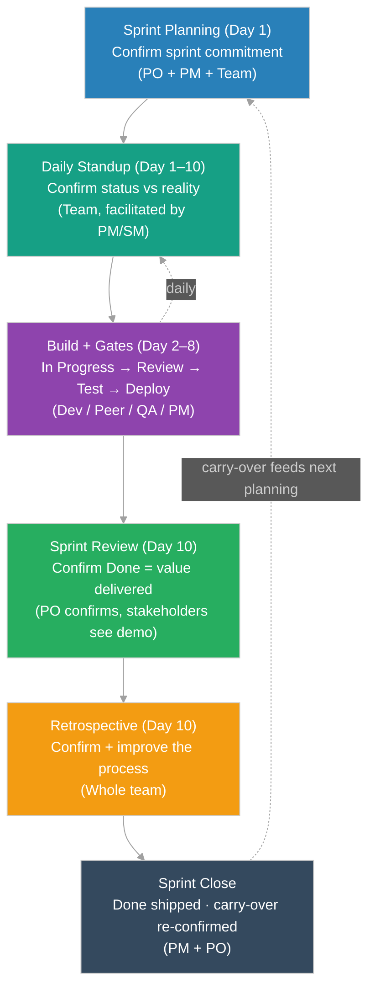

# Sprint Ticket Confirmation Lifecycle

How tickets get confirmed and signed off across a single sprint. This document maps the per-ticket sign-off gates (see Ticket Sign-Off Template) onto the sprint's events — from Sprint Planning on Day 1 to the Sprint Review and Retrospective at the end. It answers one question for the whole team: *at each point in the sprint, what must be confirmed, and by whom?*

Assumes a standard two-week sprint (10 working days). Adjust the day numbers to your sprint length.

---

## Contents
1. The Idea — Confirmation Is Continuous
2. Sprint Confirmation Flow (Diagram)
3. Confirmation Points, Stage by Stage
4. Roles at Each Sprint Event
5. Daily Confirmation Cadence
   - 5.1 FS Deadline — One Sprint Ahead
6. Carry-Over Rules
7. Sprint-Close Confirmation Checklist
8. Related Documents

---

## 1. The Idea — Confirmation Is Continuous

A sprint is not "build for two weeks, then check at the end." Confirmation happens continuously, at defined points:

- **Entry confirmation** — at Sprint Planning, the team confirms which tickets are committed (each is Ready, sized, and understood).
- **Progress confirmation** — at every Daily Standup, each in-flight ticket's status is confirmed against reality (and its owner re-stated).
- **Quality confirmation** — mid-sprint, tickets pass through the review/test/deploy gates as they complete.
- **Value confirmation** — at Sprint Review, the PO confirms each Done ticket actually delivers value.
- **Process confirmation** — at the Retrospective, the team confirms the *way* they worked and improves it.

Each confirmation has a single accountable owner, exactly like the per-ticket gates.

---

## 2. Sprint Confirmation Flow (Diagram)

---

## 3. Confirmation Points, Stage by Stage

### Stage 1 — Sprint Planning (Day 1): Confirm the Commitment

What is confirmed: which tickets the team commits to this sprint, and that each one is genuinely ready to start.

- The PO presents the prioritized tickets (sourced from the FS and backlog).
- The team confirms each candidate ticket meets the Definition of Ready: clear story, testable acceptance criteria, sized, no blocking dependency.
- The team confirms capacity — total points fit the team's velocity.
- Tickets that pass move to **Ready for Devs**; the sprint backlog is locked.

Accountable: **PO** (scope and priority) with **PM** (capacity and commitment).

Confirmation output: an agreed sprint backlog where every ticket is Ready.

### Stage 2 — Daily Standup (Day 1–10): Confirm Status vs. Reality

What is confirmed: that every in-flight ticket's Jira status reflects where the work actually is, and that each has one clear owner.

- Each owner states: what moved yesterday, what they will move today, and any blocker.
- Any ticket whose status no longer matches reality is corrected on the spot.
- Blockers are raised; the PM owns clearing them.

Accountable: **each ticket's owner** confirms their own ticket; **PM / Scrum Master** facilitates.

Confirmation output: a board that tells the truth, every day.

### Stage 3 — Build & Gates (Day 2–8): Confirm Quality at Each Gate

What is confirmed: as tickets complete, each passes its quality gates before being called Done. This is where the per-ticket sign-off gates run:

| Gate | Confirmed by | Confirms |
|------|--------------|----------|
| In Progress → To Reviews | Dev (author) | Code complete, unit tests pass, PR raised |
| In Reviews → Pending Deploy | Peer Dev | Review approved, CI green, merged |
| Pending Deploy → Ready For Test | PM / DevOps | Deployed to staging, smoke check passed |
| Ready For Test → Done / Fails | QA | Tests pass (or reports Fails) |
| Fails triage | Dev / PM | Real defect → Pending Fix, false alarm → Ready For Test, unclear → To Discuss |

Accountable: the owner of each status (see the Ticket Sign-Off Template for the full ownership matrix).

Confirmation output: each completed ticket has passed every gate, with a name and date.

### Stage 4 — Sprint Review (Day 10): Confirm Value

What is confirmed: that the tickets marked Done actually deliver the intended value — not just "it works," but "it solves the problem."

- The team demos completed increments to the PO and stakeholders.
- The PO formally accepts each Done ticket against its acceptance criteria.
- Tickets that do not meet the bar are not accepted; they carry over (see Carry-Over Rules).

Accountable: **PO** (acceptance), with stakeholders consulted.

Confirmation output: a confirmed list of accepted, shippable tickets.

### Stage 5 — Retrospective (Day 10): Confirm the Process

What is confirmed: that the way the team worked this sprint is sound, and what to improve next sprint.

- The team reviews what went well, what did not, and what to change.
- Action items are agreed with owners.

Accountable: **whole team**, facilitated by the **Scrum Master / PM**.

Confirmation output: agreed, owned improvement actions for the next sprint.

---

## 4. Roles at Each Sprint Event

| Sprint Event | PO | PM | Dev | QA |
|--------------|----|----|-----|----|
| Sprint Planning | Accountable (scope, priority) | Accountable (capacity) | Responsible (estimate) | Consulted (testability) |
| Daily Standup | Informed | Facilitates | Responsible (own tickets) | Responsible (own tickets) |
| Build & Gates | Consulted | Accountable (deploy) | Responsible (build, review) | Accountable (test) |
| Sprint Review | Accountable (accept) | Consulted | Responsible (demo) | Consulted |
| Retrospective | Participates | Facilitates | Participates | Participates |
| Sprint Close | Accountable (value) | Accountable (carry-over) | Informed | Informed |

---

## 5. Daily Confirmation Cadence

A two-week sprint runs 10 working days, Monday to Friday across two weeks (Day 1 = Mon week 1, Day 10 = Fri week 2).

| Day | Event | What is confirmed |
|-----|-------|-------------------|
| Day 1 (Mon, wk 1) | Sprint Planning | Commitment confirmed; backlog locked; tickets Ready |
| Day 1–9 | Daily Standup | Status vs. reality confirmed; blockers surfaced |
| Day 2–8 | Build & Gates | Tickets pass review / test / deploy gates as they complete |
| Day 7 (Tue, wk 2) | FS deadline for NEXT sprint | PO drops the approved FS for the next sprint (see 5.1) |
| Day 8–9 | Refinement + Hardening | Next sprint's FS refined into Ready tickets; open Fails triaged and fixed; no new work pulled |
| Day 10 (Fri, wk 2) | Sprint Review | Value confirmed; Done tickets accepted by PO |
| Day 10 | Retrospective | Process confirmed; improvements owned |
| Day 10 | Sprint Close + Planning prep | Shipping confirmed; carry-over re-confirmed; next sprint's tickets ready for Day 1 planning |

### 5.1 FS Deadline — One Sprint Ahead

The Functional Spec must be ready before the sprint it feeds, never dropped mid-sprint. The rule:

- The PO drops the approved FS for the NEXT sprint by **Day 7 (Tuesday of week 2)** of the current sprint.
- Days 8–9 are used to refine that FS into Ready tickets (clear story, testable AC, sized).
- By Day 1 of the next sprint, the tickets are already Ready, so Sprint Planning is a commitment decision, not a writing session.

Why a deadline: if the FS lands late, planning has nothing solid to commit to, and the team starts the sprint guessing. The Day 7 cutoff gives three working days of refinement before the next planning.

If the FS is not ready by Day 7, the affected work does not enter the next sprint — it waits for the sprint after. The deadline is owned by the **PO**, with the **PM** flagging at standup if it is at risk.

---

## 6. Carry-Over Rules

A ticket that is not confirmed Done by Sprint Review carries over. Confirm the following before moving it to the next sprint:

- Confirm the current Jira status (e.g. still In Progress, in Pending Fix, or On Hold) — it must reflect reality.
- Confirm the reason it did not complete (under-estimated, blocked, descoped) and log it.
- Confirm priority with the PO — carry-over is not automatic; the PO re-prioritizes it against new work.
- Confirm any partial sign-offs already collected remain valid (e.g. a passed code review need not be repeated unless the code changed).

Carry-over is owned by **PM** (mechanics) and **PO** (re-prioritization).

---

## 7. Sprint-Close Confirmation Checklist

Complete at the end of each sprint.

**Sprint:** `<name / number>`   **Dates:** `<start> – <end>`   **Facilitator:** `<name>`

**Commitment vs. delivery**

- [ ] Tickets committed at planning: `<n>`
- [ ] Tickets confirmed Done (PO-accepted): `<n>`
- [ ] Tickets carried over: `<n>` — reasons logged
- [ ] Open defects at close: `<n>` — each triaged (Pending Fix / To Discuss / accepted as known issue)

**Confirmations**

- [ ] PO confirms all Done tickets are accepted and deliver value
- [ ] QA confirms all accepted tickets passed testing with no open Sev-1 / Sev-2
- [ ] Dev confirms all merged code is on the release branch; no orphaned work
- [ ] PM confirms shipping status and rollback readiness for released items
- [ ] Carry-over re-confirmed and re-prioritized for next sprint planning

**Sprint-close sign-off**

- PO `<name>` — `<YYYY-MM-DD>`
- PM `<name>` — `<YYYY-MM-DD>`
- Dev (lead) `<name>` — `<YYYY-MM-DD>`
- QA `<name>` — `<YYYY-MM-DD>`

---

## 8. Related Documents

- Ticket Sign-Off Template — per-ticket gates and the full ownership matrix (./signoff.md)
- Worked Example — one ticket through every gate (./examples/signoff-example.md)
- Sprint Planning — committing to the sprint backlog (../keywords/ceremonies/sprint-planning.md)
- Daily Standup — the daily alignment (../keywords/ceremonies/daily-standup.md)
- Sprint Review — demo and acceptance (../keywords/ceremonies/sprint-review.md)
- Sprint Retrospective — improving the process (../keywords/ceremonies/sprint-retrospective.md)
- Ticket Lifecycle — why a ticket is a state machine (../keywords/artifacts/ticket-lifecycle.md)
