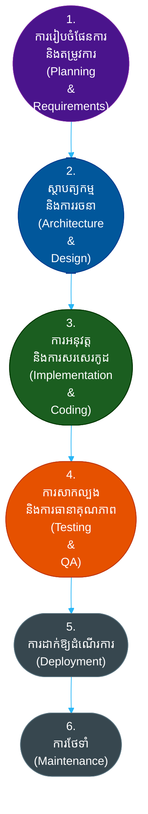

# តើអ្វីទៅជាវដ្តជីវិតនៃការអភិវឌ្ឍកម្មវិធី (Software Development Life Cycle - SDLC)?

**អ្នកនិពន្ធ (Author):** ichamrong  
**កាលបរិច្ឆេទ (Date):** 2026-05-17  
**ស្លាក (Tags):** #sdlc #engineering-practices #project-management #process  
**ប្រភេទ (Category):** ការគ្រប់គ្រង និងការដឹកនាំ (Management & Leadership)  
**រយៈពេលអាន (Read Time):** ~១៥ នាទី (~15 min)  

---

## 📌 មាតិកា (Table of Contents)
- [1. ទស្សនវិជ្ជាស្នូល (The Core Philosophy)](#1-the-core-philosophy)
- [2. លំហូរលម្អិត៖ ដំណាក់កាលទូទៅទាំង ៦ (Detailed Flow: The 6 Universal Phases)](#2-detailed-flow-the-6-universal-phases)
- [3. ពេលណាត្រូវប្រើប្រាស់ SDLC (និងពេលណាត្រូវរំលងវា) (When to Use SDLC (And When to Skip It))](#3-when-to-use-sdlc-and-when-to-skip-it)
  - [ចំណុចស្នូលដ៏ល្អបំផុត (ករណីប្រើប្រាស់ទូទៅបំផុត) (The Sweet Spot - Most Common Use Cases)](#the-sweet-spot-most-common-use-cases)
  - [ពេលណាត្រូវចៀសវាងឱ្យឆ្ងាយ (ហេតុអ្វីមិនគួរប្រើវា) (When to RUN AWAY - Why Not to Use It)](#when-to-run-away-why-not-to-use-it)
- [4. ការវិភាគក្រោយបរាជ័យ៖ ហេតុអ្វីបានជាក្រុមការងារបរាជ័យក្នុងការអនុវត្ត SDLC (The Autopsy: Why Teams Fail at SDLC)](#4-the-autopsy-why-teams-fail-at-sdlc)
- [5. ប្លង់មេនៃភាពជោគជ័យ៖ ហេតុអ្វីបានជាក្រុមការងារជោគជ័យក្នុងការអនុវត្ត SDLC (The Blueprint: Why Teams Succeed at SDLC)](#5-the-blueprint-why-teams-succeed-at-sdlc)
- [6. ការអនុវត្តក្នុងកម្រិតសហគ្រាស៖ តថភាពចម្រុះ (Enterprise Adoption: The Hybrid Reality)](#6-enterprise-adoption-the-hybrid-reality)
- [7. ករណីសិក្សាក្នុងពិភពជាក់ស្តែង (ពីកម្រិតដំបូងដល់កម្រិតខ្ពស់) (Real-World Case Studies (Basic to Advanced))](#7-real-world-case-studies-basic-to-advanced)
- [🔗 ឯកសារយោងខាងក្រៅ (External References)](#external-references)
- [📚 ឯកសារយោងឆ្លង និងការអានបន្ថែម (Cross-References & Related Reading)](#cross-references-related-reading)

---

## មាតិកា (Table of Contents)

- [1. ទស្សនវិជ្ជាស្នូល (The Core Philosophy)](#1-the-core-philosophy)
- [2. លំហូរលម្អិត៖ ដំណាក់កាលទូទៅទាំង ៦ (Detailed Flow: The 6 Universal Phases)](#2-detailed-flow-the-6-universal-phases)
- [3. ពេលណាត្រូវប្រើប្រាស់ SDLC (និងពេលណាត្រូវរំលងវា) (When to Use SDLC (And When to Skip It))](#3-when-to-use-sdlc-and-when-to-skip-it)
- [4. ការវិភាគក្រោយបរាជ័យ៖ ហេតុអ្វីបានជាក្រុមការងារបរាជ័យក្នុងការអនុវត្ត SDLC (The Autopsy: Why Teams Fail at SDLC)](#4-the-autopsy-why-teams-fail-at-sdlc)
- [5. ប្លង់មេនៃភាពជោគជ័យ៖ ហេតុអ្វីបានជាក្រុមការងារជោគជ័យក្នុងការអនុវត្ត SDLC (The Blueprint: Why Teams Succeed at SDLC)](#5-the-blueprint-why-teams-succeed-at-sdlc)
- [6. ការអនុវត្តក្នុងកម្រិតសហគ្រាស៖ តថភាពចម្រុះ (Enterprise Adoption: The Hybrid Reality)](#6-enterprise-adoption-the-hybrid-reality)
- [7. ករណីសិក្សាក្នុងពិភពជាក់ស្តែង (ពីកម្រិតដំបូងដល់កម្រិតខ្ពស់) (Real-World Case Studies (Basic to Advanced))](#7-real-world-case-studies-basic-to-advanced)

---

## 1. ទស្សនវិជ្ជាស្នូល (The Core Philosophy)

**វដ្តជីវិតនៃការអភិវឌ្ឍកម្មវិធី (Software Development Life Cycle - SDLC)** គឺជាដំណើរការដែលមានរចនាសម្ព័ន្ធ និងស្តង់ដារមួយដែលត្រូវបានប្រើប្រាស់ដោយក្រុមការងារវិស្វកម្ម (Engineering Teams) ដើម្បីរចនា (Design) អភិវឌ្ឍ (Develop) សាកល្បង (Test) និងដាក់ឱ្យដំណើរការ (Deploy) កម្មវិធីកុំព្យូទ័រដែលមានគុណភាពខ្ពស់។ 

វាផ្តល់នូវក្របខ័ណ្ឌការងារដែលអាចព្យាករណ៍បាន (Predictable Framework) ដែលផ្លាស់ប្តូរគំនិតមិនច្បាស់លាស់មួយទៅជាផលិតផលដែលអាចដំណើរការបាន និងងាយស្រួលក្នុងការថែទាំ។ បើគ្មាន SDLC ទេ ការអភិវឌ្ឍកម្មវិធីនឹងធ្លាក់ចូលទៅក្នុង "ការសរសេរកូដតាមចិត្តនឹកឃើញ (Cowboy Coding)"—ដែលជាកន្លែងអ្នកអភិវឌ្ឍន៍សរសេរកូដដោយគ្មានផែនការច្បាស់លាស់ នាំឱ្យកើតមានប្រព័ន្ធចាស់ៗដែលពិបាកថែទាំ (Unmaintainable Legacy Systems) ការខកខានថ្ងៃកំណត់ (Missed Deadlines) និងផលិតផលដែលមានកំហុសបច្ចេកទេស (Buggy Products)។

## 2. លំហូរលម្អិត៖ ដំណាក់កាលទូទៅទាំង ៦ (Detailed Flow: The 6 Universal Phases)

មិនថាក្រុមការងារប្រើប្រាស់វិធីសាស្ត្រ Agile, Waterfall ឬ Spiral នោះទេ ការអភិវឌ្ឍកម្មវិធីស្ទើរតែទាំងអស់តែងតែឆ្លងកាត់ដំណាក់កាលជាមូលដ្ឋានទាំងនេះ។

| ដំណាក់កាល (Phase) | ការពន្យល់លម្អិត (Detailed Explanation) | លទ្ធផលស្នូល (Core Deliverable) |
| :--- | :--- | :--- |
| **1. ការរៀបចំផែនការ និងតម្រូវការ (Planning & Req)** | កំណត់ *អ្វី* ដែលប្រព័ន្ធគួរធ្វើ。 ការប្រមូលតម្រូវការរបស់អ្នកប្រើប្រាស់ កម្រិតកំណត់ផ្នែកច្បាប់ និងគោលដៅនៃការដំណើរការ (Performance Goals)។ ការសិក្សាពីលទ្ធភាពជោគជ័យ (Feasibility Studies) ត្រូវបានធ្វើឡើងនៅក្នុងដំណាក់កាលនេះ。 | ឯកសារតម្រូវការផលិតផល (Product Requirements Document - PRD) |
| **2. ការរចនា (Design)** | កំណត់ *របៀប* ដែលប្រព័ន្ធនឹងធ្វើវា。 ការជ្រើសរើសបច្ចេកវិទ្យា (Tech Stacks) គម្រោងទិន្នន័យ (Database Schemas) កិច្ចសន្យា API (API Contracts) និងគំរូរចនា UX/UI (UX/UI Mockups)。 | ឯកសារស្ថាបត្យកម្មប្រព័ន្ធ (System Architecture Document) |
| **3. ការអនុវត្ត (Implementation)** | ការសរសេរកូដជាក់ស្តែង。 ការបំប្លែងការរចនាទៅជាកម្មវិធីដែលអាចដំណើរការបាន。 នេះគឺជាកន្លែងដែលអ្នកអភិវឌ្ឍន៍ចំណាយពេលវេលាភាគច្រើនរបស់ពួកគេ。 | កូដប្រភព (Source Code) |
| **4. ការសាកល្បង (Testing)** | ការផ្ទៀងផ្ទាត់ថាកូដដំណើរការ និងបញ្ជាក់ថាវាឆ្លើយតបនឹងតម្រូវការ。 ស្វែងរកកំហុសបច្ចេកទេស (Bugs) ចន្លោះប្រហោងសុវត្ថិភាព (Security Flaws) និងបញ្ហារាំងស្ទះដល់ដំណើរការ (Performance Bottlenecks)。 | របាយការណ៍សាកល្បង និងការអនុម័តធានាគុណភាព (Test Reports, QA Sign-off) |
| **5. ការដាក់ឱ្យដំណើរការ (Deployment)** | ការបញ្ចេញកម្មវិធីទៅកាន់អ្នកប្រើប្រាស់នៅក្នុងបរិស្ថានផលិតកម្ម (Production Environment)。 ជាទូទៅពាក់ព័ន្ធនឹងប្រព័ន្ធស្វ័យប្រវត្តិនៃការបញ្ចូល និងការដាក់ឱ្យដំណើរការ (CI/CD Pipelines)。 | កម្មវិធីដំណើរការផ្ទាល់ (Live Software) |
| **6. ការថែទាំ (Maintenance)** | ការជួសជុលកំហុសបច្ចេកទេសនៅក្នុងបរិស្ថានផលិតកម្ម ការដំឡើងកំណែថ្មីនៃបណ្ណាល័យជំនួយ (Upgrading Dependencies) និងការបន្ថែមមុខងារកែលម្អតូចៗក្នុងអំឡុងពេលអាយុកាលរបស់កម្មវិធី。 | កញ្ចប់កូដជួសជុល និងការធ្វើបច្ចុប្បន្នភាពកំណែ (Patches, Version Updates) |

## 3. ពេលណាត្រូវប្រើប្រាស់ SDLC (និងពេលណាត្រូវរំលងវា) (When to Use SDLC (And When to Skip It))

### ចំណុចស្នូលដ៏ល្អបំផុត (ករណីប្រើប្រាស់ទូទៅបំផុត) (The Sweet Spot - Most Common Use Cases)
អ្នកគួរតែប្រើប្រាស់ដំណើរការ SDLC ផ្លូវការសម្រាប់ **គម្រោងកម្មវិធីពាណិជ្ជកម្មណាមួយ** គម្រោងណាមួយដែលមានអ្នកអភិវឌ្ឍន៍លើសពីម្នាក់ ឬប្រព័ន្ធណាដែលគ្រប់គ្រងទិន្នន័យរសើបរបស់អ្នកប្រើប្រាស់។ វាគឺជាឆ្អឹងខ្នងនៃវិស្វកម្មវិជ្ជាជីវៈ។

### ពេលណាត្រូវចៀសវាងឱ្យឆ្ងាយ (ហេតុអ្វីមិនគួរប្រើវា) (When to RUN AWAY - Why Not to Use It)
ពេលវេលាតែមួយគត់ដែលអ្នកគួររំលង SDLC ទាំងស្រុង (ពោលគឺ គ្រាន់តែបើកកម្មវិធីសរសេរកូដ ហើយវាយកូដយកតែម្តង) គឺសម្រាប់ **កូដសរសេរសម្រាប់ប្រើប្រាស់បណ្តោះអាសន្នរួចបោះចោល (Throwaway Scripts) គំរូសាកល្បងក្នុងកម្មវិធីប្រកួតប្រជែង (Hackathon Prototypes) ឬគម្រោងសិក្សាផ្ទាល់ខ្លួន**។ ការអនុវត្តអភិបាលកិច្ច SDLC ដ៏តឹងរ៉ឹងទៅលើកូដ Bash Script ចំនួន ៥០ បន្ទាត់ គឺជាការខ្ជះខ្ជាយពេលវេលាបែបការិយាធិបតេយ្យ។

## 4. ការវិភាគក្រោយបរាជ័យ៖ ហេតុអ្វីបានជាក្រុមការងារបរាជ័យក្នុងការអនុវត្ត SDLC (The Autopsy: Why Teams Fail at SDLC)

ក្រុមការងារភាគច្រើនមិនមែនបរាជ័យដោយសារតែពួកគេខ្វះខាតដំណើរការ SDLC នោះទេ ប៉ុន្តែពួកគេបរាជ័យដោយសារតែ **របៀបដែលពួកគេអនុវត្តវា**。
- **ការប្រកាន់ខ្ជាប់គោលការណ៍ជ្រុលហួសហេតុជាជាងការអនុវត្តជាក់ស្តែង (Dogmatism over Pragmatism):** ការបង្ខំឱ្យក្រុមការងារដើរតាមដំណើរការដោយងងឹតងងល់ ទោះបីជាវាធ្វើឱ្យការងារយឺតយ៉ាវក៏ដោយ (ឧទាហរណ៍៖ ការទាមទារឯកសារស្ថាបត្យកម្ម ៥០ ទំព័រ សម្រាប់តែកម្មវិធី CRUD សាមញ្ញមួយ)។
- **ការរំលងដំណាក់កាលរៀបចំផែនការ (Skipping the Planning Phase):** ការយល់ព្រមតាមសម្ពាធពីថ្នាក់គ្រប់គ្រងដើម្បី "ចាប់ផ្តើមសរសេរកូដតែម្តងទៅ"。 នេះនាំឱ្យមានការបង្កើតផលិតផលខុសគោលដៅ ប្រកបដោយប្រសិទ្ធភាព (ពោលគឺខំធ្វើកូដឱ្យល្អឥតខ្ចោះ តែផលិតផលមិនត្រូវនឹងតម្រូវការប្រើប្រាស់)。
- **ការទុកការសាកល្បងជាការងារបន្ទាប់បន្សំ (Testing as an Afterthought):** ការប្រញាប់ប្រញាល់បញ្ចប់ដំណាក់កាលធានាគុណភាព (QA) ដើម្បីឱ្យទាន់ថ្ងៃកំណត់ដែលកំណត់ឡើងដោយគ្មានមូលដ្ឋានច្បាស់លាស់ នាំឱ្យកើតមានកំហុសបច្ចេកទេសធ្ងន់ធ្ងរនៅលើបរិស្ថានផលិតកម្ម (Catastrophic Production Bugs)។

## 5. ប្លង់មេនៃភាពជោគជ័យ៖ ហេតុអ្វីបានជាក្រុមការងារជោគជ័យក្នុងការអនុវត្ត SDLC (The Blueprint: Why Teams Succeed at SDLC)

- **ការអនុលោមទៅតាមវប្បធម៌ក្រុមការងារ (Alignment with Team Culture):** គំរូ SDLC ដែលបានជ្រើសរើសត្រូវគ្នាទៅនឹងទំហំក្រុម កម្រិតភាពចាស់ទុំនៃការងារ (Maturity) និងកម្រិតហានិភ័យនៃគម្រោង។
- **ការកំណត់និយមន័យច្បាស់លាស់នៃពាក្យ "រួចរាល់សម្រាប់ចាប់ផ្តើម" (Definition of Ready - DoR) និង "រួចរាល់ជាស្ថាពរ" (Definition of Done - DoD):** ក្រុមការងារអនុវត្តយ៉ាងម៉ត់ចត់នូវ DoR មុនពេលចាប់ផ្តើមដំណាក់កាលនីមួយៗ និង DoD មុនពេលបញ្ចប់ដំណាក់កាលនោះ។
- **ការកែលម្អជាប្រចាំ (Continuous Improvement):** ក្រុមការងាររៀបចំកិច្ចប្រជុំត្រួតពិនិត្យឡើងវិញ (Retrospectives) ដើម្បីកែលម្អដំណើរការ SDLC របស់ពួកគេឱ្យកាន់តែប្រសើរឡើងជាលំដាប់ ដោយកាត់បន្ថយនីតិវិធីការិយាធិបតេយ្យ និងបន្ថែមវិធានការសុវត្ថិភាពនៅកន្លែងដែលចាំបាច់។

## 6. ការអនុវត្តក្នុងកម្រិតសហគ្រាស៖ តថភាពចម្រុះ (Enterprise Adoption: The Hybrid Reality)

នៅក្នុងសហគ្រាសសកលដ៏ធំសម្បើម (ដូចជា **Microsoft, Google ឬ JP Morgan** ជាដើម) មិនដែលប្រើប្រាស់គំរូ SDLC តែ *មួយ* នោះទេ។ ក្រុមហ៊ុនធំៗប្រើប្រាស់ **វិធីសាស្ត្រចម្រុះ (Hybrid Approach)** ដោយបង្កើតក្រុមប្រឹក្សាអភិបាលកិច្ច SDLC កណ្តាល ដើម្បីកំណត់ថាគំរូណាមួយគួរត្រូវបានប្រើប្រាស់ដោយផ្អែកលើផ្នែកនីមួយៗ។

- **ក្រុមការងារហេដ្ឋារចនាសម្ព័ន្ធមជ្ឈមណ្ឌលទិន្នន័យ (Data Center Infrastructure Team):** អាចនឹងប្រើប្រាស់គំរូ Waterfall ដ៏តឹងរ៉ឹង ពីព្រោះការទម្លាក់ខ្សែអុបទិកក្រោមបាតសមុទ្រ ឬការសាងសង់មជ្ឈមណ្ឌលទិន្នន័យរូបវន្ត (Physical Data Centers) ទាមទារការរៀបចំផែនការទុកជាមុនរាប់ឆ្នាំ និងកញ្ចប់ថវិកាថេរ។
- **ក្រុមការងារអភិវឌ្ឍន៍គេហទំព័រផ្នែកខាងមុខ (Web Frontend Team):** នឹងប្រើប្រាស់វិធីសាស្ត្រ Agile ដើម្បីដាក់ឱ្យដំណើរការនូវការធ្វើបច្ចុប្បន្នភាពលើចំណុចប្រទាក់អ្នកប្រើប្រាស់ (UI Updates) និងការសាកល្បងប្រៀបធៀប (A/B Tests) ជាច្រើនដងក្នុងមួយថ្ងៃ។
- **ផ្នែកស្រាវជ្រាវ និងអភិវឌ្ឍន៍បញ្ញាសិប្បនិម្មិត (AI/R&D Division):** នឹងប្រើប្រាស់គំរូ Spiral ដើម្បីបង្កើតគំរូសាកល្បងនៃម៉ូដែលភាសាពិសោធន៍ (Experimental Language Models) និងវាយតម្លៃហានិភ័យ មុនពេលបញ្ចេញវាទៅកាន់ផលិតផលផ្លូវការ។

នៅក្នុងកម្រិតសហគ្រាស ភាពជោគជ័យគឺពឹងផ្អែកលើការធានាថា លំហូរការងារដែលខុសគ្នាទាំងស្រុងទាំងនេះ អាចរួមបញ្ចូលគ្នាដោយសុវត្ថិភាពទៅជាក្រុមហ៊ុនតែមួយដែលមានសាមគ្គីភាព និងភាពស៊ីសង្វាក់គ្នា។

## 7. ករណីសិក្សាក្នុងពិភពជាក់ស្តែង (ពីកម្រិតដំបូងដល់កម្រិតខ្ពស់) (Real-World Case Studies (Basic to Advanced))

ខាងក្រោមនេះគឺជាឧទាហរណ៍ចំនួន ៥ នៃការអនុវត្ត SDLC ចាប់ពីកម្រិតសាមញ្ញរហូតដល់កម្រិតខ្ពស់៖

1. **កម្រិតដំបូង៖ ក្តារខានបានរបស់អ្នកអភិវឌ្ឍន៍តែម្នាក់ឯង (Basic - The Solo Developer's Kanban Board)**
   អ្នកអភិវឌ្ឍន៍ឯករាជ្យ (Freelance Developer) ម្នាក់ដែលបង្កើតគេហទំព័របង្ហាញស្នាដៃផ្ទាល់ខ្លួន (Portfolio Site) ប្រើប្រាស់ SDLC បែបសាមញ្ញបំផុត។ ពួកគេចំណាយពេល ១ ថ្ងៃក្នុងការគូរគំនូសព្រាងការរចនា (ការរៀបចំផែនការ/ការរចនា), ៣ ថ្ងៃក្នុងការសាងសង់ (ការអនុវត្តកូដ), ១ ថ្ងៃក្នុងការចុចសាកល្បងដំណើរការ (ការសាកល្បង) និងការដាក់ឱ្យដំណើរការតាមរយៈ Vercel (ការដាក់ឱ្យដំណើរការ)។
2. **កម្រិតមធ្យម៖ ទីភ្នាក់ងារឌីជីថល (Intermediate - The Digital Agency)**
   ទីភ្នាក់ងារគេហទំព័រ (Web Agency) ដែលមានសមាជិក ៥ នាក់ បង្កើតគេហទំព័រពាណិជ្ជកម្មអេឡិចត្រូនិក (E-commerce Site) សម្រាប់អតិថិជន។ ពួកគេប្រើប្រាស់ SDLC ដែលមានរចនាសម្ព័ន្ធច្បាស់លាស់៖ ២ សប្តាហ៍សម្រាប់ការប្រមូលតម្រូវការជាមួយអតិថិជន និងការបង្កើតគំរោងប្លង់ព្រាង (Wireframes)។ បន្ទាប់មក ៤ សប្តាហ៍សម្រាប់ការសរសេរកូដ តាមដានដោយ ១ សប្តាហ៍សម្រាប់ការសាកល្បងទទួលយកដោយអ្នកប្រើប្រាស់ (User Acceptance Testing - UAT) មុនពេលដាក់ឱ្យដំណើរការជាផ្លូវការ (Go-live)។
3. **កម្រិតមធ្យម៖ ក្រុមហ៊ុនធុរកិច្ចថ្មីផ្នែកសេវាកម្មកម្មវិធី (Intermediate - The SaaS Startup)**
   ក្រុមហ៊ុនធុរកិច្ចថ្មី (Startup) ដែលមានសមាជិក ២០ នាក់ ប្រើប្រាស់ Agile SDLC។ ពួកគេបង្រួមដំណាក់កាលទាំង ៦ ទៅជាវដ្តការងាររយៈពេល ២ សប្តាហ៍ (2-week Sprints)។ រាល់វដ្តការងារនីមួយៗរួមបញ្ចូលទាំងការរៀបចំផែនការ ការរចនាមុខងារតូចមួយ ការសរសេរកូដ ការសរសេរកូដសាកល្បងស្វ័យប្រវត្តិ (Automated Tests) និងការដាក់ឱ្យដំណើរការភ្លាមៗ។
4. **កម្រិតខ្ពស់៖ ធនាគារពហុជាតិ (Advanced - The Multi-National Bank)**
   ស្ថាប័នហិរញ្ញវត្ថុដ៏ធំសម្បើមមួយប្រមូលផ្តុំអ្នកអភិវឌ្ឍន៍ចំនួន ៥,០០០ នាក់ ឱ្យដំណើរការក្រោមក្របខ័ណ្ឌអភិបាលកិច្ច SDLC ដ៏តឹងរ៉ឹង។ មុនពេលកូដណាមួយត្រូវបានសរសេរ ក្រុមការងារសន្តិសុខ និងអនុលោមភាព (Security and Compliance Teams) ត្រូវតែពិនិត្យ និងអនុម័តលើការរចនាជាមុនសិន។ ការសាកល្បងរួមមានក្រុមការងារ QA ជំនាញ ការសាកល្បងវាយលុកស្វែងរកចន្លោះប្រហោង (Penetration Testing) និងការធ្វើសវនកម្មបទប្បញ្ញត្តិ (Regulatory Audits) មុនពេលដាក់ឱ្យដំណើរការ។
5. **កម្រិតខ្ពស់៖ ប្រព័ន្ធប្រតិបត្តិការប្រភពកូដចំហ (Advanced - The Open-Source OS - Linux Kernel)**
   គម្រោងសកលដែលគ្មានមជ្ឈមណ្ឌលបញ្ជា (Decentralized Project)។ SDLC ត្រូវបានគ្រប់គ្រងទាំងស្រុងតាមរយៈបញ្ជីសំបុត្ររួម (Mailing Lists) និង Git។ ការរៀបចំផែនការកើតឡើងតាមរយៈសំណើរសុំមតិយោបល់ (Requests for Comments - RFCs)។ ការអនុវត្តត្រូវបានធ្វើឡើងដោយអ្នករួមចំណែកទូទាំងសកលលោក (Global Contributors)។ ការសាកល្បងត្រូវបានធ្វើឡើងជាស្វ័យប្រវត្តិតាមរយៈបណ្តាញម៉ាស៊ីនសាកល្បង CI ដ៏ធំសម្បើម (Massive CI Farms) ហើយ "ការដាក់ឱ្យដំណើរការ" គឺជាការបញ្ចេញនូវកំណែ Kernel ថ្មី។

---

**ការរុករក (Navigation):** [លិបិក្រមស៊េរី SDLC (SDLC Series Index)](./06-comparison-matrix.md) | [គំរូ Waterfall (Waterfall Model) →](./02-waterfall-model.md)

---

## 🔗 ឯកសារយោងខាងក្រៅ (External References)
- [AWS: តើ SDLC គឺជាអ្វី? (What is SDLC?)](https://aws.amazon.com/what-is/sdlc/)
- [IBM: ការពន្យល់អំពីវដ្តជីវិតនៃការអភិវឌ្ឍកម្មវិធី (Software Development Life Cycle Explained)](https://www.ibm.com/topics/software-development-lifecycle)
- [PMI: សៀវភៅណែនាំអំពីចំណេះដឹងនៃការគ្រប់គ្រងគម្រោង (Project Management Body of Knowledge - PMBOK)](https://www.pmi.org/pmbok-guide-standards)

## 📚 ឯកសារយោងឆ្លង និងការអានបន្ថែម (Cross-References & Related Reading)
- **Agile និងដំណើរការ (Agile & Process):** [DoR ទល់នឹង DoD (DoR vs DoD)](../02-dor-and-dod-guide.md) | [ម៉ាទ្រីសប្រៀបធៀប SDLC (SDLC Comparison Matrix)](./06-comparison-matrix.md) | [តើ SDLC គឺជាអ្វី? (What is SDLC?)](./01-what-is-sdlc.md)
- **ឯកសារ និងលំហូរ (Documentation & Flow):** [សៀវភៅណែនាំទំនាក់ទំនងតាមរយៈរូបភាព (Visual Communication Guide)](../../developer-habits/visual-communication/README.md) | [លំហូរការងាររៀបចំឯកសាររហ័ស (Fast Documentation Workflow)](../../productivity/01-fast-documentation-workflow.md) | [សៀវភៅណែនាំ MCP (MCP Guide)](../../developer-habits/02-mcp-development-guide.md)

---

*ធ្វើបច្ចុប្បន្នភាពចុងក្រោយ៖ 2026-05-17*

## ព័ត៌មានទាក់ទង (Related)

- [ឧបករណ៍គ្រប់គ្រងគម្រោង (Project Management Tools)](../01-project-management-tools.md)
- [និយមន័យនៃពាក្យរួចរាល់សម្រាប់ចាប់ផ្តើម និងរួចរាល់ជាស្ថាពរ (Definition of Ready & Done)](../02-dor-and-dod-guide.md)
- [គន្លងអាជីព (Career Paths)](../../concepts/career-paths/README.md)
