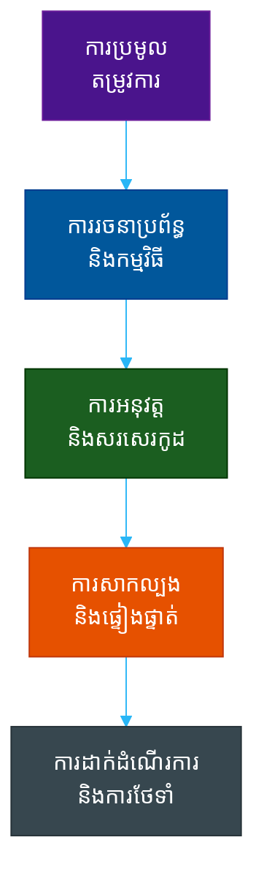

# វដ្តជីវិតនៃការអភិវឌ្ឍកម្មវិធី៖ ម៉ូដែលទឹកធ្លាក់ (Software Development Life Cycles: The Waterfall Model)

**អ្នកនិពន្ធ (Author)៖** ichamrong  
**កាលបរិច្ឆេទ (Date)៖** 2026-05-17  
**ស្លាក (Tags)៖** #sdlc #waterfall #project-management #engineering-practices  
**ប្រភេទ (Category)៖** ការគ្រប់គ្រង និងភាពជាដឹកនាំ (Management & Leadership)  
**រយៈពេលអាន (Read Time)៖** ប្រហែល ១៥ នាទី (~15 min)  

---

## 📌 មាតិកា (Table of Contents)
- [១. ទស្សនវិជ្ជាស្នូល (1. The Core Philosophy)](#1-the-core-philosophy)
- [២. លំហូរលម្អិត និងស្ថាបត្យកម្ម (2. Detailed Flow and Architecture)](#2-detailed-flow-and-architecture)
- [៣. ពេលណាគួរប្រើប្រាស់ និងពេលណាដែលមិនគួរប្រើប្រាស់ (3. When to Use It (And When NOT To))](#3-when-to-use-it-and-when-not-to)
  - [ចំណុចល្អប្រសើរបំផុត (The Sweet Spot - Most Common Use Cases)](#the-sweet-spot-most-common-use-cases)
  - [ពេលណាដែលត្រូវចៀសវាង (When to RUN AWAY - Why Not to Use It)](#when-to-run-away-why-not-to-use-it)
- [៤. ការវិភាគរកមូលហេតុនៃការបរាជ័យ៖ ហេتوىអ្វីបានជាក្រុមការងារបរាជ័យជាមួយម៉ូដែលទឹកធ្លាក់ (4. The Autopsy: Why Teams Fail with Waterfall)](#4-the-autopsy-why-teams-fail-with-waterfall)
- [៥. ប្លង់មេនៃភាពជោគជ័យ៖ ហេតុអ្វីបានជាក្រុមការងារជោគជ័យជាមួយម៉ូដែលទឹកធ្លាក់ (5. The Blueprint: Why Teams Succeed with Waterfall)](#5-the-blueprint-why-teams-succeed-with-waterfall)
- [៦. ការយកទៅប្រើប្រាស់ក្នុងកម្រិតសហគ្រាស៖ របៀបដែលក្រុមហ៊ុនធំៗពង្រីកវិសាលភាពម៉ូដែលទឹកធ្លាក់ (6. Enterprise Adoption: How Big Companies Scale Waterfall)](#6-enterprise-adoption-how-big-companies-scale-waterfall)
- [៧. ករណីសិក្សាក្នុងពិភពពិត - ពីកម្រិតដំបូងដល់កម្រិតខ្ពស់ (7. Real-World Case Studies (Basic to Advanced))](#7-real-world-case-studies-basic-to-advanced)
  - [១. កម្រិតដំបូង៖ គេហទំព័រក្រុមហ៊ុនបែបឋិតិវន្ត (1. Basic: A Static Corporate Website)](#1-basic-a-static-corporate-website)
  - [២. កម្រិតមធ្យម៖ ហ្វឺមវែរនៃឧបករណ៍គិតលុយ (2. Intermediate: Point-of-Sale (POS) Terminal Firmware)](#2-intermediate-point-of-sale-pos-terminal-firmware)
  - [៣. កម្រិតមធ្យម៖ ប្រព័ន្ធបើកប្រាក់បៀវត្សរ៍ធនធានមនុស្សផ្ទៃក្នុង (3. Intermediate: Internal HR Payroll System)](#3-intermediate-internal-hr-payroll-system)
  - [៤. កម្រិតខ្ពស់៖ បន្ទះបញ្ជាម៉ាស៊ីនបោកគក់ពាណិជ្ជកម្ម (4. Advanced: Commercial Washing Machine Control Board)](#4-advanced-commercial-washing-machine-control-board)
  - [៥. កម្រិតខ្ពស់៖ កម្មវិធីអវកាសអាប៉ូឡូរបស់ណាសា (5. Advanced: NASA's Apollo Space Program)](#5-advanced-nasas-apollo-space-program)
- [🔗 ឯកសារយោងខាងក្រៅ (External References)](#external-references)
- [📚 ការអានបន្ថែម និងឯកសារយោងឆ្លងកាត់ (Cross-References & Related Reading)](#cross-references-related-reading)

---

## មាតិកា (Table of Contents)

- [១. ទស្សនវិជ្ជាស្នូល (1. The Core Philosophy)](#1-the-core-philosophy)
- [២. លំហូរលម្អិត និងស្ថាបត្យកម្ម (2. Detailed Flow and Architecture)](#2-detailed-flow-and-architecture)
- [៣. ពេលណាគួរប្រើប្រាស់ និងពេលណាដែលមិនគួរប្រើប្រាស់ (3. When to Use It (And When NOT To))](#3-when-to-use-it-and-when-not-to)
- [៤. ការវិភាគរកមូលហេតុនៃការបរាជ័យ៖ ហេតុអ្វីបានជាក្រុមការងារបរាជ័យជាមួយម៉ូដែលទឹកធ្លាក់ (4. The Autopsy: Why Teams Fail with Waterfall)](#4-the-autopsy-why-teams-fail-with-waterfall)
- [៥. ប្លង់មេនៃភាពជោគជ័យ៖ ហេតុអ្វីបានជាក្រុមការងារជោគជ័យជាមួយម៉ូដែលទឹកធ្លាក់ (5. The Blueprint: Why Teams Succeed with Waterfall)](#5-the-blueprint-why-teams-succeed-with-waterfall)
- [៦. ការយកទៅប្រើប្រាស់ក្នុងកម្រិតសហគ្រាស៖ របៀបដែលក្រុមហ៊ុនធំៗពង្រីកវិសាលភាពម៉ូដែលទឹកធ្លាក់ (6. Enterprise Adoption: How Big Companies Scale Waterfall)](#6-enterprise-adoption-how-big-companies-scale-waterfall)
- [៧. ករណីសិក្សាក្នុងពិភពពិត - ពីកម្រិតដំបូងដល់កម្រិតខ្ពស់ (7. Real-World Case Studies (Basic to Advanced))](#7-real-world-case-studies-basic-to-advanced)

---

## ១. ទស្សនវិជ្ជាស្នូល (1. The Core Philosophy)

> **«វាស់ពីរដង កាត់តែម្តង (Measure twice, cut once)។ ការផ្លាស់ប្តូរមានតម្លៃថ្លៃខ្លាំងណាស់។»**

ម៉ូដែលទឹកធ្លាក់ (Waterfall Model) គឺជាវិធីសាស្ត្រលីនេអ៊ែរនិងមានលំដាប់លំដោយ (linear, sequential approach) ដែលចាស់ជាងគេ និងសាមញ្ញបំផុតសម្រាប់ការរចនាកម្មវិធី (software design)។ នៅក្នុងវិធីសាស្ត្រនេះ វឌ្ឍនភាពការងារនឹងហូរចុះក្រោមជាលំដាប់ (ដូចជាទឹកធ្លាក់) ឆ្លងកាត់ដំណាក់កាលផ្សេងៗគ្នាជាច្រើន។

ការសន្មតស្នូលនៃម៉ូដែលទឹកធ្លាក់គឺថា **រាល់តម្រូវការទាំងអស់អាចត្រូវបានដឹង និងប្រមូលផ្តុំទុកជាមុន (all requirements can be known and gathered upfront)** ហើយការផ្លាស់ប្តូរតម្រូវការណាមួយក្នុងអំឡុងពេលសរសេរកូដ ឬសាកល្បង នឹងមានតម្លៃថ្លៃខ្ពស់រហូតដល់មិនអាចទទួលយកបាន។ ហេតុដូច្នេះហើយ ការរៀបចំផែនការយ៉ាងល្អិតល្អន់ និងហ្មត់ចត់បំផុតនឹងជួយការពារការកែប្រែឡើងវិញដែលមានតម្លៃថ្លៃ (prevent expensive rework)។

## ២. លំហូរលម្អិត និងស្ថាបត្យកម្ម (2. Detailed Flow and Architecture)

នៅក្នុងម៉ូដែលទឹកធ្លាក់សុទ្ធសាធ (pure Waterfall) **ដំណាក់កាលនីមួយៗមិនត្រួតស៊ីគ្នាឡើយ (phases do not overlap)**។ ដំណាក់កាលមួយត្រូវតែបញ្ចប់ ១០០% និងទទួលបានការយល់ព្រមជាផ្លូវការ (formally signed off) មុនពេលដំណាក់កាលបន្ទាប់អាចចាប់ផ្តើមបាន។ គ្មានការត្រឡប់ថយក្រោយឡើយ។

១. **តម្រូវការ (Requirements)៖** ភាគីពាក់ព័ន្ធ (Stakeholders) កំណត់រាល់មុខងារទាំងអស់ដែលកម្មវិធីត្រូវតែមាន។ ដំណាក់កាលនេះបង្កើតបាននូវឯកសារបញ្ជាក់លម្អិតពីតម្រូវការកម្មវិធីដ៏ធំមួយហៅថា SRS (Software Requirements Specification)។
២. **ការរចនា (Design)៖** អ្នករៀបចំស្ថាបត្យកម្មប្រព័ន្ធ (Architects) បកប្រែឯកសារ SRS ទៅជាគ្រោងប្រព័ន្ធទិន្នន័យ (database schemas) កិច្ចសន្យា API (API contracts) និងគំនូសតាង UML (UML diagrams)។ ដំណាក់កាលនេះមិនទាន់មានការសរសេរកូដណាមួយនៅឡើយទេ។
៣. **ការអនុវត្ត (Implementation)៖** អ្នកអភិវឌ្ឍន៍កម្មវិធី (Developers) យកឯកសាររចនាទាំងនោះមកសរសេរកូដ។ ពួកគេមិនពិភាក្សាផ្ទាល់ជាមួយអតិថិជនឡើយ គឺពួកគេគ្រាន់តែអនុវត្តតាមការបញ្ជាក់លម្អិត (spec) តែប៉ុណ្ណោះ។
៤. **ការសាកល្បង (Testing)៖** ក្រុមធានាគុណភាព (QA Teams) ទទួលយកកូដដែលបានសរសេររួចរាល់ទាំងស្រុង ហើយធ្វើការសាកល្បងផ្ទៀងផ្ទាត់ធៀបនឹងឯកសារតម្រូវការ SRS ដើម។
៥. **ការដាក់ឱ្យដំណើរការ (Deployment)៖** ផលិតផលដែលបានបញ្ចប់ និងផ្ទៀងផ្ទាត់រួចរាល់ ត្រូវបានប្រគល់ជូនអតិថិជនតាមរយៈការបញ្ចេញកញ្ចប់ធំតែម្តងគត់ (single "Big Bang" release)។

## ៣. ពេលណាគួរប្រើប្រាស់ និងពេលណាដែលមិនគួរប្រើប្រាស់ (When to Use It (And When NOT To))

### ចំណុចល្អប្រសើរបំផុត (The Sweet Spot - Most Common Use Cases)
ម៉ូដែលទឹកធ្លាក់មានប្រសិទ្ធភាពខ្ពស់បំផុតនៅពេលដែល **ភាពអាចព្យាករណ៍បានមានសារៈសំខាន់ជាងភាពបត់បែន (predictability is more important than adaptability)**។
- **កិច្ចសន្យាតម្លៃថេរ (Fixed-Bid Contracts)៖** នៅពេលដែលភ្នាក់ងារអភិវឌ្ឍន៍ជាប់កាតព្វកិច្ចផ្លូវច្បាប់ក្នុងការផ្តល់ជូននូវសំណុំមុខងារជាក់លាក់ណាមួយសម្រាប់តម្លៃថេរដែលបានព្រមព្រៀង។
- **បរិស្ថានដែលមានបទប្បញ្ញត្តិតឹងរ៉ឹង (Highly Regulated Environments)៖** គម្រោងរដ្ឋាភិបាល វិស័យសុខាភិបាល និងហេដ្ឋារចនាសម្ព័ន្ធ ដែលច្បាប់តម្រូវឱ្យមានឯកសាររៀបចំទុកជាមុនយ៉ាងច្រើនសន្ធឹកសន្ធាប់។
- **ការរួមបញ្ចូលផ្នែករឹង (Hardware Integrations)៖** កម្មវិធីដែលបង្កប់នៅក្នុងឧបករណ៍រូបវន្ត (ដែលការធ្វើបច្ចុប្បន្នភាពឥតខ្សែ ឬ Over-The-Air Update មិនអាចធ្វើទៅបាន ឬមានគ្រោះថ្នាក់ខ្លាំង)។

### ពេលណាដែលត្រូវចៀសវាង (When to RUN AWAY - Why Not to Use It)
- **អាជីវកម្មបង្កើតថ្មី និងសេវាកម្មកម្មវិធីសម្រាប់អ្នកប្រើប្រាស់ទូទៅ (Startups & Consumer SaaS)៖** ប្រសិនបើអ្នកកំពុងព្យាយាមស្វែងរកភាពស៊ីគ្នារវាងផលិតផលនិងទីផ្សារ (Product-Market Fit) ម៉ូដែលទឹកធ្លាក់នឹងសម្លាប់ក្រុមហ៊ុនរបស់អ្នក។ អ្នកនឹងចំណាយពេល ១៨ ខែដើម្បីបង្កើតអ្វីដែលអ្នកបានគ្រោងទុកយ៉ាងពិតប្រាកដ រួចទើបដឹងថាអ្នកប្រើប្រាស់មិនត្រូវការវាឡើយ។
- **ប្រព័ន្ធស្មុគស្មាញ និងថ្មីស្រឡាង (Complex, Novel Systems)៖** គម្រោងទាំងឡាយណាដែលអ្នកមិនទាន់យល់ច្បាស់អំពីបញ្ហាប្រឈមផ្នែកបច្ចេកទេស រហូតទាល់តែអ្នកចាប់ផ្តើមសរសេរកូដផ្ទាល់។

## ៤. ការវិភាគរកមូលហេតុនៃការបរាជ័យ៖ ហេតុអ្វីបានជាក្រុមការងារបរាជ័យជាមួយម៉ូដែលទឹកធ្លាក់ (The Autopsy: Why Teams Fail with Waterfall)

ម៉ូដែលទឹកធ្លាក់មានកេរ្តិ៍ឈ្មោះមិនល្អនៅក្នុងវិស័យអភិវឌ្ឍន៍កម្មវិធីទំនើប ដោយសារវាបង្កឱ្យមានបរាជ័យយ៉ាងធ្ងន់ធ្ងរនៅពេលយកទៅប្រើប្រាស់ខុសបច្ចេកទេស។
- **ការបរាជ័យក្នុងការរួមបញ្ចូលកញ្ចប់ធំតែម្តង ("Big Bang" Integration Failure)៖** ដោយសារតែការសាកល្បង (testing) ធ្វើឡើងនៅចុងបញ្ចប់បង្អស់ អ្នកសរសេរកូដច្រើនតែរួមបញ្ចូលម៉ូឌុល (modules) ទាំងអស់របស់ពួកគេជាលើកដំបូងបន្ទាប់ពីដំណើរការគម្រោងបានជាច្រើនខែ។ ប្រសិនបើស្ថាបត្យកម្មស្នូល (core architecture) មានកំហុសឆ្គង នោះគម្រោងទាំងមូលអាចនឹងត្រូវបោះបង់ចោល។
- **ការភ័ន្តច្រឡំអំពីតម្រូវការ (Requirement Illusion)៖** វាសន្មតថាអតិថិជនដឹងយ៉ាងច្បាស់នូវអ្វីដែលពួកគេចង់បានតាំងពីថ្ងៃដំបូង។ តាមពិតទៅ អតិថិជនដឹងពីអ្វីដែលពួកគេចង់បាន *បន្ទាប់ពី* ពួកគេបានឃើញកំណែសាកល្បងដំបូងតែប៉ុណ្ណោះ។
- **អន្ទាក់នៃការចំណាយដែលមិនអាចស្រោចស្រង់បាន (Sunk Cost Trap)៖** ប្រសិនបើទីផ្សារមានការប្រែប្រួលនៅខែទី ៦ ក្នុងកំឡុងពេលគម្រោងដែលមានរយៈពេល ១២ ខែ ក្រុមការងារច្រើនតែបន្តបង្កើតផលិតផលដែលហួសសម័យនោះដដែល ដោយសារតែ «ការបញ្ជាក់លម្អិតត្រូវបានចាក់សោ (spec is locked)»។

## ៥. ប្លង់មេនៃភាពជោគជ័យ៖ ហេតុអ្វីបានជាក្រុមការងារជោគជ័យជាមួយម៉ូដែលទឹកធ្លាក់ (The Blueprint: Why Teams Succeed with Waterfall)

- **ការចងក្រងឯកសារយ៉ាងល្អឥតខ្ចោះ (Incredible Documentation)៖** ដោយសារតែដំណាក់កាលរចនា (design phase) ត្រូវបានធ្វើឡើងយ៉ាងល្អិតល្អន់ ប្រសិនបើអ្នកអភិវឌ្ឍន៍ម្នាក់ចាកចេញពីគម្រោងពាក់កណ្តាលទី នោះអ្នកអភិវឌ្ឍន៍ថ្មីអាចអានឯកសារបញ្ជាក់លម្អិត (spec) និងបន្តការងារពីកន្លែងដែលបានផ្អាកដោយគ្មានការរអាក់រអួល។
- **ថវិកាដែលអាចព្យាករណ៍បាន (Predictable Budgets)៖** ថ្នាក់គ្រប់គ្រងដឹងយ៉ាងច្បាស់ថាតើគម្រោងនេះនឹងត្រូវចំណាយអស់ថវិកាប៉ុន្មាន និងដឹងពីពេលវេលាជាក់លាក់ដែលត្រូវប្រគល់គម្រោង។
- **ដំណាក់កាលសំខាន់ៗច្បាស់លាស់ (Clear Milestones)៖** មិនដែលមានភាពស្រពិចស្រពិលអំពីស្ថានភាពគម្រោងឡើយ។ អ្នកអាចដឹងយ៉ាងច្បាស់ថា គម្រោងកំពុងស្ថិតក្នុងដំណាក់កាលរចនា (Design phase) ឬដំណាក់កាលអនុវត្ត (Implementation phase)។

## ៦. ការយកទៅប្រើប្រាស់ក្នុងកម្រិតសហគ្រាស៖ របៀបដែលក្រុមហ៊ុនធំៗពង្រីកវិសាលភាពម៉ូដែលទឹកធ្លាក់ (Enterprise Adoption: How Big Companies Scale Waterfall)

ទោះបីជាម៉ូដែលទឹកធ្លាក់ទទួលបានការរិះគន់យ៉ាងខ្លាំងនៅក្នុងវិស័យអភិវឌ្ឍន៍កម្មវិធីទំនើបក៏ដោយ ក៏សហគ្រាសធំៗដែលមានតម្លៃរាប់ពាន់លានដុល្លានៅតែពឹងផ្អែកលើវាសម្រាប់ **ការរួមបញ្ចូលផ្នែករឹង (hardware integration) និងខ្សែសង្វាក់ផ្គត់ផ្គង់ដ៏ធំសម្ដើម (massive supply chains)**។

ជាឧទាហរណ៍ ក្រុមហ៊ុន **Apple** ប្រើប្រាស់ដំណើរការដែលមានរចនាសម្ព័ន្ធច្បាស់លាស់ស្រដៀងនឹងម៉ូដែលទឹកធ្លាក់ (Waterfall-like process) សម្រាប់ការអភិវឌ្ឍទូរស័ព្ទ iPhone។ ការរចនាផ្នែករឹង (Hardware design) មិនអាចធ្វើតាមរបៀបការងាររហ័សរហួន (Agile) ឡើយ — អ្នកមិនអាចផ្លាស់ប្តូរទំហំនៃបន្ទះឈីបស៊ីលីកូនរូបវន្ត (physical silicon chip) នៅរយៈពេលពីរសប្តាហ៍មុនពេលការផលិតចាប់ផ្តើមនោះទេ។ ក្រុមហ៊ុន Apple តែងតែចាក់សោរឯកសារលម្អិតផ្នែករឹង (hardware specs) ជាច្រើនឆ្នាំទុកជាមុន។ ក្រុមការងារផ្នែកទន់ iOS ត្រូវតែសម្របសម្រួលវឌ្ឍនភាពការងាររបស់ពួកគេជាមួយកាលបរិច្ឆេទចាក់សោរផ្នែករឹងដ៏តឹងរ៉ឹង និងមិនអាចផ្លាស់ប្តូរបានទាំងនេះ ដើម្បីធានាថាប្រព័ន្ធប្រតិបត្តិការដំណើរការយ៉ាងល្អឥតខ្ចោះនៅថ្ងៃដាក់លក់ជាផ្លូវការ។

ស្រដៀងគ្នានេះដែរ ក្រុមហ៊ុនសំណង់លំដាប់សកល និងអ្នកម៉ៅការលើវិស័យការពារជាតិ ប្រើប្រាស់ម៉ូដែលទឹកធ្លាក់ ដោយសារខ្សែសង្វាក់ផ្គត់ផ្គង់របស់ពួកគេ (ការបញ្ជាទិញដែកថែប ការផលិតចានរ៉ាដា) ទាមទារឱ្យមានភាពអាចព្យាករណ៍បានទាំងស្រុង និងទំហំការងារច្បាស់លាស់ (fixed scopes)។ ការផ្លាស់ប្តូរតម្រូវការណាមួយនៅពាក់កណ្តាលគម្រោងអាចនឹងត្រូវចំណាយអស់រាប់រយលានដុល្លារ។

## ៧. ករណីសិក្សាក្នុងពិភពពិត - ពីកម្រិតដំបូងដល់កម្រិតខ្ពស់ (Real-World Case Studies (Basic to Advanced))

### ១. កម្រិតដំបូង៖ គេហទំព័រក្រុមហ៊ុនបែបឋិតិវន្ត (Basic: A Static Corporate Website)
ក្រុមហ៊ុនមេធាវីមួយចង់បានគេហទំព័រផ្តល់ព័ត៌មានចំនួន ៥ ទំព័រ។ តម្រូវការទាំងអស់គឺឋិតិវន្តទាំងស្រុង (entirely static)។ ភ្នាក់ងារអភិវឌ្ឍន៍ប្រមូលអត្ថបទ រចនាប្លង់គំរូតាមរយៈ Photoshop ទទួលបានការអនុម័ត សរសេរកូដ HTML/CSS និងដាក់ឱ្យដំណើរការ។ គ្មានតម្រូវការចាំបាច់សម្រាប់ការអភិវឌ្ឍបែប Agile ឡើយ។

### ២. កម្រិតមធ្យម៖ ហ្វឺមវែរនៃឧបករណ៍គិតលុយ (Intermediate: Point-of-Sale (POS) Terminal Firmware)
ក្រុមហ៊ុនមួយបង្កើតកម្មវិធីសម្រាប់ម៉ាស៊ីនគិតលុយរូបវន្ត (physical cash register)។ លក្ខណៈបច្ចេកទេសផ្នែករឹង (hardware specs) ត្រូវបានចាក់សោររួចជាស្រេច។ វិធានអនុលោមភាព (compliance rules) សម្រាប់ដំណើរការកាតឥណទានគឺតឹងរ៉ឹង និងមិនផ្លាស់ប្តូរឡើយ។ ពួកគេសរសេរឯកសារលម្អិត បង្កើតកម្មវិធី សាកល្បងយ៉ាងហ្មត់ចត់ និងបញ្ចូលកម្មវិធីនោះទៅក្នុងឧបករណ៍ផ្នែករឹង (flash to hardware)។

### ៣. កម្រិតមធ្យម៖ ប្រព័ន្ធបើកប្រាក់បៀវត្សរ៍ធនធានមនុស្សផ្ទៃក្នុង (Intermediate: Internal HR Payroll System)
ស្ថាប័នរដ្ឋាភិបាលមួយត្រូវការប្រព័ន្ធគណនាប្រាក់បៀវត្សរ៍។ ច្បាប់សារពើពន្ធ និងរូបមន្តគណិតវិទ្យាត្រូវបានកំណត់យ៉ាងច្បាស់លាស់ដោយច្បាប់។ គ្មានការផ្តល់មតិកែលម្អពីអ្នកប្រើប្រាស់ (user feedback) លើរបៀបគណនាពន្ធឡើយ។ ម៉ូដែលទឹកធ្លាក់ធានាថាការគណនានឹងត្រូវរៀបចំឡើងយ៉ាងល្អឥតខ្ចោះមុនពេលការសរសេរកូដចាប់ផ្តើម។

### ៤. កម្រិតខ្ពស់៖ បន្ទះបញ្ជាម៉ាស៊ីនបោកគក់ពាណិជ្ជកម្ម (Advanced: Commercial Washing Machine Control Board)
វិស្វករប្រព័ន្ធបង្កប់ (embedded systems engineers) សរសេរកូដភាសា C សម្រាប់ម៉ាស៊ីនបោកគក់។ ប្រសិនបើមានកំហុសឆ្គង (bug) ណាមួយកើតឡើងនៅក្នុងដំណាក់កាលផលិតកម្ម ពួកគេត្រូវប្រមូលយកម៉ាស៊ីនរូបវន្តចំនួន ៥០,០០០ គ្រឿងត្រឡប់មកវិញ។ ការរចនាទុកជាមុនយ៉ាងលម្អិត និងការសាកល្បងទ្រង់ទ្រាយធំនៅចុងបញ្ចប់នៃវដ្តជីវិត (Waterfall) គឺជាមធ្យោបាយតែមួយគត់ដើម្បីដំណើរការប្រកបដោយសុវត្ថិភាព។

### ៥. កម្រិតខ្ពស់៖ កម្មវិធីអវកាសអាប៉ូឡូរបស់ណាសា (Advanced: NASA's Apollo Space Program)
រឿងរ៉ាវជោគជ័យដ៏លេចធ្លោបំផុតនៃម៉ូដែលទឹកធ្លាក់។ កម្មវិធីផ្នែកទន់សម្រាប់បេសកកម្មអាប៉ូឡូ (Apollo missions) ទាមទារភាពល្អឥតខ្ចោះជាដាច់ខាត។ គណិតវិទ្យា និងរូបវិទ្យាត្រូវបានដឹងយ៉ាងច្បាស់លាស់។ កម្មវិធីផ្នែកទន់ត្រូវបានបញ្ជាក់លម្អិតយ៉ាងល្អិតល្អន់រហូតដល់កម្រិតបៃ (byte) សរសេរបញ្ចូលទៅក្នុងអង្គចងចាំរូបវន្តបែបខ្សែពួរ (physical rope-core memory) និងសាកល្បងយ៉ាងតឹងរ៉ឹងបំផុតមុនពេលបង្ហោះ។

---

**ការរុករក (Navigation)៖** [← តើអ្វីជា SDLC? (What is SDLC?)](./01-what-is-sdlc.md) | [លិបិក្រមនៃស៊េរី SDLC (SDLC Series Index)](./06-comparison-matrix.md) | [ម៉ូដែល Agile (Agile Model) →](./03-agile-model.md)

---

## 🔗 ឯកសារយោងខាងក្រៅ (External References)
- [Managing the Development of Large Software Systems (Winston W. Royce, 1970)](http://www-scf.usc.edu/~csci201/lectures/Lecture11/royce1970.pdf)
- [Atlassian: The Waterfall Methodology](https://www.atlassian.com/agile/project-management/waterfall)
- [PMI: Traditional vs Agile Project Management](https://www.pmi.org/learning/library)

## 📚 ការអានបន្ថែម និងឯកសារយោងឆ្លងកាត់ (Cross-References & Related Reading)
- **ការងារបែប Agile និងដំណើរការ (Agile & Process)៖** [DoR vs DoD](../02-dor-and-dod-guide.md) | [តារាងប្រៀបធៀប SDLC (SDLC Comparison Matrix)](./06-comparison-matrix.md) | [តើអ្វីជា SDLC? (What is SDLC?)](./01-what-is-sdlc.md)
- **ឯកសារ និងលំហូរការងារ (Documentation & Flow)៖** [មគ្គុទ្ទេសក៍ទំនាក់ទំនងតាមរូបភាព (Visual Communication Guide)](../../developer-habits/visual-communication/README.md) | [លំហូរការងារចងក្រងឯកសាររហ័ស (Fast Documentation)](../../productivity/01-fast-documentation-workflow.md) | [មគ្គុទ្ទេសក៍ MCP (MCP Guide)](../../developer-habits/02-mcp-development-guide.md)

---

*កាលបរិច្ឆេទធ្វើបច្ចុប្បន្នភាពចុងក្រោយ៖ ២០២៦-០៥-១៧ (Last updated: 2026-05-17)*

## ឯកសារពាក់ព័ន្ធ (Related)

- [ឧបករណ៍គ្រប់គ្រងគម្រោង (Project Management Tools)](../01-project-management-tools.md)
- [ការកំណត់លក្ខខណ្ឌរួចរាល់ និងការបញ្ចប់ការងារ (Definition of Ready & Done)](../02-dor-and-dod-guide.md)
- [គន្លងអាជីព (Career Paths)](../../concepts/career-paths/README.md)
